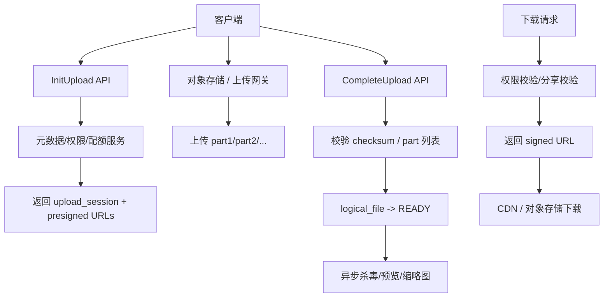

# 系统设计 - 案例 16：企业网盘系统真题模拟

## 题目

设计一个企业网盘系统，支持：

- 文件上传与下载
- 目录管理
- 企业内共享
- 对外分享链接
- 大文件断点续传
- 基础秒传

先不做：

- 在线协同编辑
- 实时评论
- 复杂推荐

## 这题为什么常考

企业网盘题是非常经典的文件系统面试题，因为它几乎天然覆盖：

- 元数据与内容分离
- 上传状态机
- 分块与断点续传
- 权限与分享
- 秒传与去重
- 带宽成本与 CDN
- 删除回收与垃圾回收

这题如果答得好，说明你已经不把“上传文件”看成一个接口，而是看成一整套传输系统 + 元数据系统 + 对象存储系统。

## 面试官视角：这题真正想考什么

面试官通常想看四件事：

1. 你会不会把 `逻辑文件` 和 `物理内容` 分开
2. 你知不知道大文件不能让业务 API 服务中转
3. 你会不会讲上传状态机、秒传和删除回收
4. 你能不能把权限、分享和 signed URL 讲清楚

## 结构化思考过程（可在面试里直接说出来的版本）

### 第一步：先澄清范围

我会先问：

1. 单文件最大多大？
2. 是否支持企业内目录与部门权限？
3. 分享链接是仅内部可见，还是支持外部访问？
4. 是否要求秒传和断点续传？
5. 上传完成后是否需要杀毒、审核或预览转换？

如果面试官不继续补充，我会主动收敛：

- 最大文件 `20 GB`
- 支持企业内 ACL
- 分享链接支持外部访问，但有时效控制
- 支持秒传和断点续传
- 上传完成后异步做杀毒和预览处理

### 第二步：给一轮粗估算

假设：

- 注册用户 `1000 万`
- DAU `100 万`
- 平均每个活跃用户每天上传/下载 `4` 个文件
- 平均文件大小 `5 MB`
- 但少量大文件可到 `20 GB`

这组数据说明：

- QPS 不是唯一问题，真正贵的是带宽和对象存储容量
- 上传/下载链路不能由业务 API 亲自搬运所有字节
- 文件系统的主矛盾是 `元数据与内容分离 + 大对象传输 + 权限控制`

### 第三步：定义核心对象

我会把系统拆成五类核心对象：

1. `logical_file`
   - 用户看到的文件
   - 文件名、目录、拥有者、状态

2. `physical_object`
   - 真实物理内容
   - hash、size、object_key、引用计数

3. `upload_session`
   - 本次上传过程
   - part 列表、状态、过期时间

4. `share_link`
   - 外部分享
   - token、过期时间、权限边界

5. `acl_entry`
   - 企业内权限关系

### 第四步：搭高层架构

### 第五步：明确主链路

#### 上传链路

1. 客户端请求初始化上传
2. 服务端校验配额、目录权限、文件大小
3. 创建 `upload_session`
4. 返回分块上传地址
5. 客户端直接上传到对象存储
6. 客户端调用 `CompleteUpload`
7. 服务端校验完 part 后，将 `logical_file` 状态切到 `READY`

#### 下载链路

1. 先查元数据和权限
2. 校验是否为所有者、企业内授权，或有效分享链接
3. 返回短期有效 signed URL
4. 客户端从 CDN 或对象存储直接下载

### 第六步：主动深挖两个关键点

#### 深挖点 A：为什么大文件不能经过业务 API 中转

如果让 `客户端 -> API 服务 -> 对象存储`：

- API 服务会被带宽打满
- 连接和内存占用会很重
- 重试成本极高
- 扩容费用会失控

所以更成熟的做法是：

- API 服务只负责“授权与会话”
- 真正的字节直传到对象存储或上传网关

#### 深挖点 B：秒传和删除为什么依赖 logical / physical 分离

如果用户 A、B 上传的是同一份内容：

- 逻辑上是两个文件
- 物理上希望只存一份对象

所以需要：

- `logical_file -> physical_object` 多对一
- 上传前用 `size + 强 hash + 分块 hash` 做秒传判断
- 删除时先删逻辑文件，物理对象要等引用归零后再 GC

## 参考答案（面试里可直接说的一版）

如果让我设计一个企业网盘，我会先把系统拆成三层：逻辑文件、物理内容和上传会话。  
逻辑文件是用户看到的目录、文件名、权限和分享关系；物理内容是真正的对象数据；上传会话是这一次上传过程的状态机。  
这道题的主矛盾不是简单的文件落盘，而是元数据与对象内容分离、大文件传输、权限控制以及带宽成本。

高层上，我会把元数据放在数据库或专门的元数据服务里，把文件内容放在对象存储里。  
上传时客户端先调用 `InitUpload`，服务端完成权限与配额校验，创建 `upload_session`，返回分块上传地址；然后客户端直传对象存储，最后调用 `CompleteUpload`，服务端验证分块和 checksum，成功后再把 `logical_file` 状态切到 `READY`。  
下载时，服务端只负责权限和分享校验，然后返回短期有效的 signed URL，由客户端从 CDN 或对象存储直接下载。

如果继续深挖，我会重点讲两个点。  
第一，大文件为什么不能经过业务 API 中转，因为真正贵的是带宽和连接资源，业务 API 应该管授权与元数据，而不是搬运 20GB 文件。  
第二，秒传和删除为什么必须把逻辑文件和物理对象拆开，因为多个用户可能共享同一份物理内容，这时候删除一个逻辑文件不能直接删对象，必须通过引用计数和 GC 来管理。

如果再往后扩展，我会补分享链接时效、企业内 ACL、杀毒与预览异步处理、冷热分层和对象生命周期策略。

## 面试官可能继续追问什么

### 追问 1：上传完成前，文件能不能出现在列表里

回答重点：

- 可以有记录，但状态应是 `UPLOADING/PENDING`
- 非上传者一般不应看到可下载版本
- 对外分享和预览必须等 `READY`

### 追问 2：为什么分享链接和企业内权限不能共用一个逻辑

回答重点：

- 企业内权限更像 ACL
- 分享链接更像临时凭证
- 需要时效、下载次数、密码、只读/可下载边界

### 追问 3：秒传为什么不能只看 MD5

回答重点：

- 哈希碰撞与恶意利用风险
- 应组合 `size + 强 hash + 分块校验`
- 必要时抽样或服务端二次校验

### 追问 4：删除以后为什么不立刻删对象

回答重点：

- 可能有多个逻辑文件引用
- 还要支持回收站或短期恢复
- 需要延迟 GC 和后台清理

### 追问 5：如果对象存储某个区域延迟很高怎么办

回答重点：

- 热文件走 CDN
- 下载走 signed URL 直连更近节点
- 必要时做多区域复制和区域就近读

## 常见失分点

1. 把整个上传过程答成一个同步 API。
2. 没有上传状态机，只说“上传成功后记录数据库”。
3. 不区分逻辑文件和物理对象。
4. 分享与下载权限只说一句“做鉴权”。
5. 删除不讲 GC 和引用计数。

## 总结

企业网盘题最重要的一句话是：

`它不是一个文件接口题，而是一个元数据系统 + 对象存储系统 + 传输状态机系统。`

只要你能围绕这句话展开：

- 对象先拆清
- 上传链路先讲状态机
- 下载链路讲权限与 signed URL
- 秒传和删除讲 logical/physical 分离

这题就会非常像真实工程。

## 自测问题

1. 如果要支持版本历史，你会把版本建模放在哪一层？
2. 如果要支持图片预览和 PDF 转换，应该放在同步链路还是异步链路？
3. 如果一个用户不断上传超大文件但从不分享，你觉得哪一层成本压力最大？
4. 如果面试官追问“企业网盘和对象存储服务有什么区别”，你会怎么回答？
