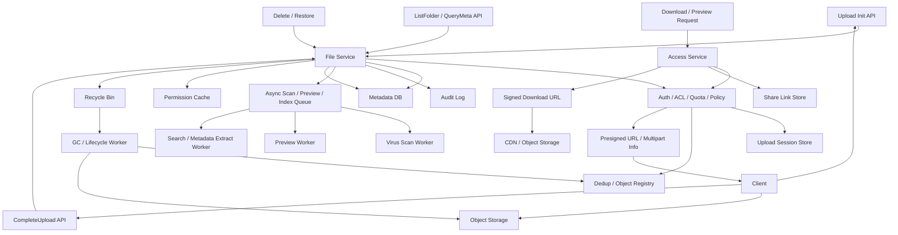

# 系统设计 - 案例 16：企业网盘系统真题模拟

## 题目

设计一个企业网盘系统，支持：

- 文件上传与下载
- 目录管理
- 企业内共享
- 对外分享链接
- 大文件断点续传
- 基础秒传
- 回收站与恢复
- 基础预览能力

先不做：

- 在线协同编辑
- 实时评论
- 复杂推荐
- 细粒度内容理解与智能检索

## 为什么这题值得深讲

企业网盘题看起来像“上传文件”。

但它其实非常适合检验一个候选人是不是在设计系统，
而不是只会拼几个常见组件。

原因是这题会同时考到：

- 一个 `QPS 不一定爆炸，但字节流量非常大` 的系统，主矛盾到底是什么
- 一个 `元数据正确性很强、内容传输很重` 的系统，为什么必须拆两套真相源
- 一个看起来只是“存文件”的题，为什么会牵出状态机、权限、配额、GC、审计、成本
- 为什么上传、下载、分享、预览、回收，不应该被当成一条链路
- 为什么“秒传”听起来简单，实际上背后是去重边界、权限边界和生命周期边界

很多回答会停在：

- `文件放对象存储，元数据放 MySQL，前面加 CDN`

这不算错，
但也远远不够。

真正成熟的回答应该能讲清楚：

- 题目里哪些产品语义要先收敛
- 哪些对象才是系统里的真相源
- 为什么上传成功不等于文件可见
- 为什么删除文件不等于删除内容
- 为什么 ACL、分享链接、秒传、回收站必须一起设计
- 系统是怎么一步一步推出来的，而不是像模板拼图

## 面试官真正想看什么

这题通常在看下面几件事：

1. 你会不会先把 `逻辑文件`、`物理对象`、`上传会话` 拆开
2. 你知不知道大文件应该 `直传对象存储`，而不是让业务 API 搬字节
3. 你能不能把上传设计成 `状态机`，而不是一个同步接口
4. 你会不会处理目录树、ACL 继承、外链分享这类元数据复杂度
5. 你能不能比较秒传、整文件去重、块级去重、GC 的 trade-off
6. 你会不会主动讲回收站、审计、杀毒、预览、冷热分层、成本治理这些真实工程问题
7. 你能不能识别这个系统的主矛盾是 `字节搬运和生命周期治理`，而不是数据库 QPS

## 一开始先别急着设计，先收敛题目语义

真实系统设计里，
很多坑不是技术坑，
而是语义坑。

企业网盘题尤其如此。

我会先主动澄清下面这些问题：

1. 单文件最大多大，是 `2 GB`、`20 GB` 还是 `200 GB`
2. 上传完成后是否要求立即可下载，还是允许先 `PROCESSING`
3. 是否支持版本历史，还是只看当前版本
4. 企业内共享是基于组织架构、用户组、目录 ACL，还是只是简单“发链接”
5. 对外分享是否需要密码、有效期、下载次数、是否允许预览
6. 秒传是只要求“整文件级复用”，还是希望做到“块级去重”
7. 删除是直接删除，还是进回收站后延迟清理
8. 是否要求杀毒、内容审核、审计日志、DLP
9. 是否有租户维度的存储配额和上传频控
10. 用户是否全球分布，是否要做跨区域下载加速

如果面试官不继续补充，
我会主动把题目收敛成下面这个版本：

- 单文件最大 `20 GB`
- 支持目录树、企业内共享、外链分享
- 支持断点续传
- 支持基础秒传，但先只做整文件级
- 上传完成后先进入 `PROCESSING`，异步做杀毒和预览
- 企业内权限基于目录 ACL，外链支持有效期、密码、下载权限
- 支持回收站，保留 `30 天`
- 默认单区域写，下载走对象存储 / CDN
- 暂不做在线协同编辑和复杂版本冲突合并

这里面有几个非常关键的产品选择。

### 选择 1：先做整文件秒传，不直接做块级去重

为什么？

- 面试里的“基础秒传”，大多数时候不要求你把存储压榨到极致
- 整文件级 dedup 已经能覆盖大量重复上传场景
- 块级去重会把对象引用关系、GC、计费、恢复链路都变复杂
- 块级方案对客户端和服务端协议的侵入更强

也就是说：

- “要不要块级去重”不是技术能不能做的问题
- 而是这个题当前值不值得付出那层复杂度

### 选择 2：上传成功不等于文件立即 `READY`

为什么？

- 文件字节传到对象存储，不代表这个文件已经通过治理
- 企业网盘很常见地要求杀毒、转预览、抽取元数据
- 如果在异步后处理前就把文件暴露出去，可能出现“能看到但不能用”的中间态

所以如果题目没要求极致的“秒可用”，
我会主动把语义收紧成：

- 上传成功后先 `PROCESSING`
- 完成治理后再 `READY`

### 选择 3：企业内 ACL 和外链分享分两套授权模型

为什么？

- 企业内共享依赖身份、组织、角色和目录继承
- 对外分享依赖 token、有效期、密码、下载策略
- 它们虽然最后都可能导向“可以下载”，但判定语义完全不同

所以我不会把它们混成一个：

- `if internal else share`

而是会明确成两套机制，
最后在“下载授权服务”处收口。

## 第一步：先判断这是一个什么类型的系统

我会先明确：

- 这不是一个“数据库 QPS 为主”的系统
- 而是一个 `控制流相对轻、数据流非常重` 的系统
- 也是一个 `元数据强约束、内容层偏最终一致` 的系统
- 还是一个 `带宽成本、存储成本、生命周期治理` 非常重要的系统

这意味着：

1. 我们真正要优化的不是“上传接口 QPS”，而是“字节搬运方式”
2. 业务 API 不应该亲自承接大文件流量
3. 元数据正确性比预览实时性更重要
4. 目录、ACL、分享、回收这些元数据设计，往往比对象存储本身更复杂
5. CDN、对象存储、异步后处理，不是锦上添花，而是主角

很多人会把这题答成：

- “怎么传文件”

但企业网盘真正的主战场其实是：

- 如何把 `传输`
- `元数据`
- `权限`
- `对象生命周期`

这四件事拆开，
又让它们协同起来。

## 第二步：先做一轮容量估算，不然 trade-off 没锚点

我会主动给一组面试里合理的假设：

- 企业租户总数 `10 万`
- 注册用户总数 `1000 万`
- DAU `100 万`
- 平均每个活跃用户每天上传 `2` 个文件
- 平均每个活跃用户每天下载或预览 `10` 次
- 平均文件大小 `8 MB`
- 大文件占比 `1%`，平均大小 `2 GB`
- 峰值 `InitUpload` QPS `3000 - 5000`
- 峰值 `CompleteUpload` QPS `1000 - 2000`
- 峰值下载授权 QPS `2 万`
- 真正的内容下载带宽远大于 API QPS

先往下推几步。

### 元数据规模

如果日新增逻辑文件：

- `100 万 * 2 = 200 万 / 天`

一年就是：

- `200 万 * 365 = 7.3 亿`

假设一条逻辑文件记录、
版本记录、
目录索引、
审计字段、
二级索引加起来，
平均真实占用按 `0.8 KB - 1.5 KB` 算，
那一年级别的元数据量大致是：

- `584 GB - 1 TB+`

这说明：

- 元数据虽然不是短视频级别的爆炸流量
- 但也绝不是“永远单机 MySQL 就够了”的小系统

### 存储与带宽成本

日上传量如果按平均 `8 MB` 算：

- `200 万 * 8 MB = 16 TB / 天`

哪怕考虑：

- 小文件多
- 大文件少
- 秒传会抵消一部分

它依然是一个很明显的“内容存储成本题”。

再看下载。

如果日下载或预览 `1000 万` 次：

- `100 万 * 10 = 1000 万 / 天`

按平均 `8 MB` 算，
就是：

- `80 TB / 天`

真实情况里，
某些文件会被多人重复下载，
某些热门分享链接还会被外部集中访问，
所以：

- CDN 和对象存储带宽才是长期成本大头

### 上传会话与事件规模

假设每次上传都会产生：

- `upload_session`
- 若干 part 记录
- 审计日志
- 预览 / 杀毒任务

那说明：

- 你不仅在管理文件
- 你还在管理大量“围绕文件而生的生命周期数据”

这也是为什么这题不能只画“一个 file 表”。

### 延迟目标

我会给出一个比较合理的目标：

- `InitUpload P99 < 100 ms`
- `ResumeUpload / QueryParts P99 < 80 ms`
- `CompleteUpload P99 < 200 ms`
- `ListFolder P99 < 150 ms`
- `CreateShareLink P99 < 100 ms`
- `DownloadAuthorize P99 < 100 ms`

这里要强调：

- 文件真正的字节传输时间不纳入 API 延迟预算
- API 只负责控制链路
- 数据链路交给对象存储 / CDN

这个目标一旦定下来，
后面很多方案就自然出来了：

- 业务 API 不能中转大文件
- 上传必须是会话化和分块化
- 下载必须返回短期有效的授权地址
- 预览和杀毒必须异步

## 第三步：先定义不变量，而不是先选技术

这是这题最容易被忽略、
但最能拉开差距的一步。

我会先定义下面几个不变量：

1. 任意时刻，一个 `logical_file` 只暴露一个当前可见版本
2. 一个上传会话未完成前，对普通读者来说文件不能视为 `READY`
3. 逻辑文件删除不等于物理对象立即删除
4. 一个物理对象可以被多个逻辑文件或版本引用
5. 企业内 ACL 和外链分享必须作为两套授权机制独立演进
6. 预览、缩略图、全文索引允许延迟，但文件元数据和权限不能错
7. 秒传可以复用物理内容，但不能因此泄漏“系统里是否存在某个文件”
8. 所有文件、目录、ACL、分享记录都必须带 `tenant_id`，默认不允许跨租户引用

这几条不变量背后的意思是：

- 逻辑世界和物理世界不能混为一谈
- 上传完成和文件可用不是同一时刻
- 生命周期管理比“能不能传上去”更核心
- 安全边界和成本边界都会反过来影响架构

很多候选人会把“秒传怎么做”讲得很重，
但其实在企业网盘里，
先讲清：

- 谁是用户看到的文件
- 谁是真正存字节的对象
- 谁在描述一次上传过程

比一上来谈 hash 更重要。

## 第四步：不要直接给最终方案，先走一遍真实设计推演

这一步是这章我要重点加强的地方。

我不会直接把最终架构甩出来，
而是像真的在设计系统一样，
一步一步推。

## 第一轮思考：最朴素的方案是什么

最直观的方案是：

- 客户端把文件 POST 到业务 API
- 业务 API 把文件流写到对象存储
- 同时写一条文件元数据到数据库
- 成功后立即返回可下载

这个方案有什么好处？

- 简单
- Demo 很容易跑通
- 小文件、小团队场景下完全可用

但如果规模一上去，
问题会马上暴露：

1. 业务 API 会被大文件带宽打满
2. 长连接、TLS、内存拷贝成本都压在应用层
3. 网络抖动时，失败重试代价极高
4. 上传中断后很难断点续传
5. 很难表达“文件传了一半”的中间状态
6. 秒传、回收站、物理复用、GC 都会变得很别扭

所以第一轮方案可以作为：

- 最小可用系统

但绝不是面试里应该停下来的位置。

## 第二轮思考：先把字节流和控制流拆开

既然主矛盾不是数据库点查，
而是字节搬运，
那我会优先动上传链路：

- `InitUpload` 由业务 API 负责
- 文件内容直传对象存储
- `CompleteUpload` 再由业务 API 收口

这样带来的变化是：

- 业务 API 不再承接大文件带宽
- 上传失败只需重传部分分块
- 上传和元数据写入可以解耦

但这还不够，
因为又会出现几个新问题：

1. 对象已经传上去，但 `CompleteUpload` 还没来怎么办
2. 客户端声称“我传完了”，服务端能不能直接相信
3. 会话过期了但对象没清理，怎么办
4. 客户端断线后如何知道哪些 part 已经成功

所以这时候我会进一步想：

- 需要一个持久化的 `upload_session`
- 需要 part 级状态和校验
- 需要幂等的 `CompleteUpload`
- 需要临时对象清理机制

也就是说，
真正成熟的“直传设计”，
不是“发个 presigned URL”就结束了。

## 第三轮思考：上传必须变成状态机，而不是一个接口

这一步特别关键。

如果没有状态机，
你就只能把文件理解成：

- 有
- 没有

但真实系统里不是这样的。

一次上传至少会经过这些状态：

- `INIT`
- `UPLOADING`
- `UPLOADED_PENDING_COMMIT`
- `PROCESSING`
- `READY`
- `FAILED_PROCESSING`
- `ABORTED`
- `EXPIRED`

这里每个状态都对应真实工程意义：

- `INIT`：会话已创建，但还没开始上传
- `UPLOADING`：部分 part 已经写入对象存储
- `UPLOADED_PENDING_COMMIT`：字节可能传完了，但还没业务确认
- `PROCESSING`：正在做杀毒、预览、抽取元数据
- `READY`：可下载、可分享、可搜索
- `FAILED_PROCESSING`：文件内容有，但治理失败，不能直接暴露

这一步的本质是：

- 让“上传过程”成为系统的一等公民

很多回答里最大的缺口就是：

- 只画 file 表
- 不画 upload session

这会导致断点续传、
失败恢复、
对象清理、
幂等提交都无处安放。

## 第四轮思考：逻辑文件和物理对象必须拆开

接下来要讨论的是：

- 用户看到的文件
- 和真正存储的字节对象

到底是不是一个东西。

如果把它们绑在一起，
会马上遇到几个问题：

1. 改文件名和移动目录，本质不应该复制内容
2. 同一内容被不同用户上传，为什么要存两份
3. 删除一个逻辑文件时，怎么判断物理内容还能不能删
4. 将来支持版本历史时，当前文件和历史版本怎么表达

所以我会明确拆成：

- `logical_file`
- `file_version`
- `physical_object`

它们分别负责：

- 用户语义
- 版本语义
- 内容语义

这样一来：

- 重命名只改逻辑文件
- 新版本产生新的 `file_version`
- 秒传只是复用 `physical_object`
- GC 只看 `physical_object.ref_count`

也就是说，
秒传、版本、回收站和 GC，
其实都建立在这次拆分之上。

## 第五轮思考：权限和分享为什么不能共用一个判断分支

很多人会说：

- “下载前做鉴权就好了”

但企业网盘里的“鉴权”，
其实至少有两大类。

第一类是企业内访问：

- 依赖登录身份
- 依赖租户
- 依赖目录 ACL
- 依赖部门、用户组、角色

第二类是外链分享：

- 依赖 `share_token`
- 依赖有效期
- 依赖密码
- 依赖下载次数或访问策略

两者最后都可能得到一个结果：

- 允许下载

但它们的可撤销方式、
审计方式、
风险等级、
缓存方式都不一样。

所以成熟设计里我会说：

- ACL 服务和 Share 服务可以最终在一个“下载授权层”收口
- 但逻辑上一定要两套模型分开演进

## 第六轮思考：秒传要不要一上来做到最极致

接下来要讨论的是：

- 文件去重和秒传

这一步很多人会直接说：

- “客户端传 MD5，命中就秒传”

但这只是表面做法，
不是成熟设计。

真正要比较的是下面几类方案。

## 秒传与去重方案比较

### 方案 A：完全不做秒传

做法：

- 所有文件都正常上传
- 每个逻辑文件都对应一份独立物理内容

优点：

- 最简单
- 权限边界最清晰
- 不需要处理 dedup、ref_count、GC

缺点：

- 存储成本高
- 重复上传体验差
- 大文件重复上传浪费大量带宽

适合什么时候：

- 早期系统
- 文件重复率低
- 先验证核心流程

### 方案 B：整文件 hash 命中就直接秒传

做法：

- 客户端先上报 `size + content_hash`
- 服务端如果命中已有物理对象，
  就直接复用对象并创建逻辑引用

优点：

- 实现相对简单
- 对大文件体验收益很大
- 存储复用效果明显

缺点：

- 如果仅凭客户端声明就信任，
  会有伪造风险
- 还要处理“文件存在性是否泄漏”

适合什么时候：

- 大多数面试场景
- 基础秒传
- 初版企业网盘

### 方案 C：整文件 dedup，但由服务端二次确认

做法：

- 客户端先上报 hash 试探是否可复用
- 命中后服务端仍保留校验策略
- 对高风险场景做二次校验或抽样校验

优点：

- 兼顾体验和安全
- 可以降低伪造 hash 的风险
- 更接近真实生产实践

缺点：

- 比“纯秒传”略复杂
- 命中路径和非命中路径不完全一致

适合什么时候：

- 既想做秒传，
  又不想把信任完全交给客户端

### 方案 D：块级去重

做法：

- 文件分块
- 每个块单独做内容寻址和引用复用

优点：

- 空间利用率理论上更高
- 对大量相似文件效果更好

缺点：

- 元数据量暴增
- GC 复杂度显著上升
- 下载重组和恢复更复杂
- 配额和审计语义更重

适合什么时候：

- 文件重复度极高
- 存储成本极端敏感
- 团队能承担更高系统复杂度

### 我在这个题里的选择

如果题目只是“企业网盘 + 基础秒传”，
我会优先选：

- `整文件级 dedup + 服务端保留校验能力`

原因是：

1. 比完全不做秒传，体验和成本都好很多
2. 比块级去重，复杂度更可控
3. 更符合这道面试题应该抓的主矛盾

如果面试官追问：

- “那是不是全局 dedup？”

我会补充：

- 物理层可以做全局复用
- 但接口层不能直接泄漏“某个内容是否已存在”
- 命中逻辑需要有权限和风控边界

这里的核心观点是：

- 秒传的目标是减少重复上传
- 但不能为了“看起来快”，破坏安全模型

## 顺手做个容量 sanity check：秒传值不值得做

假设日上传 `16 TB`，
其中有 `20%` 内容重复，
那理论上可以减少：

- `3.2 TB / 天`

一年级别就是：

- `1000 TB+`

这已经不是“小优化”。

所以在企业网盘里，
整文件级 dedup 往往非常值得做。

但块级去重是否值得，
就要看：

- 重复模式
- 团队复杂度预算
- GC 和审计成本

## 第五步：元数据真相源怎么选

这里我不会直接说“上某个数据库”，
而是先看访问模式。

元数据层的典型访问模式是：

- 按目录列文件
- 按 `file_id` 点查
- 改文件名
- 移动目录
- 校验 ACL
- 创建分享链接
- 查回收站
- 查版本历史

这说明它本质上不是一个纯粹的：

- `key -> value`

问题。

它带有非常多的：

- 关系
- 约束
- 事务
- 查询

所以我们要比较两类方案。

## 元数据存储方案比较

### 方案 A：关系型数据库做真相源

优点：

- 目录树、ACL、分享记录都比较自然
- 事务能力适合创建文件、移动目录、删除恢复等操作
- 唯一约束和外键语义更清晰
- 审计和后台治理更方便

缺点：

- 超大目录和超大租户场景下要谨慎设计索引
- 深层目录遍历和权限继承可能变复杂
- 后续分片演进要有规划

### 方案 B：纯 KV / 文档存储做真相源

优点：

- 点查能力强
- 某些场景更容易水平扩展

缺点：

- 目录遍历、排序、过滤、ACL 表达都不自然
- 事务和约束能力通常较弱
- 很容易把业务逻辑推到应用层，导致复杂度外溢

### 我在这个题里的回答方式

如果这是面试题，
我会给一个更现实、
更分阶段的回答：

- `V1`：关系型数据库做元数据真相源
- `V2`：对象存储承接内容，搜索/预览索引做异步派生
- `V3`：当单表和租户规模继续上升，再按 `tenant_id` 或目录空间做分片

这样回答比“一上来就上某个 NoSQL”更稳，
因为你是在按访问模式和演进路径讲，
而不是按流行词讲。

## 目录树为什么是个隐藏难点

很多人以为目录只是：

- 一个 `parent_id`

但网盘题一旦认真做，
目录会牵出很多问题：

- 目录列表分页
- 权限继承
- 移动整个子树
- 回收站恢复
- 大目录下的热点查询

这会带来一个真实的设计选择。

### 选择 A：简单邻接表 `parent_id`

做法：

- 每个文件或目录记录 `parent_folder_id`
- 列目录时按 `parent_folder_id` 查询

优点：

- 简单
- 直观
- 大多数 CRUD 足够

缺点：

- 查祖先链路要递归
- 目录移动后权限和路径缓存要重算

### 选择 B：邻接表 + 路径缓存 / ancestor 辅助表

做法：

- 真相源仍用 `parent_id`
- 同时维护 `path_cache` 或祖先关系表
- 用于快速展示路径和做权限辅助判断

优点：

- 保留简单模型
- 又能支持更快的路径展示和批量处理

缺点：

- 目录移动时代价更高
- 要处理缓存和派生数据的一致性

### 我在这个题里的选择

如果题目没有极端目录深度要求，
我会优先选：

- `parent_id` 做真相源
- 配合路径缓存或祖先派生表做优化

因为这比一上来上 closure table 更好讲，
也更符合大多数企业网盘的渐进演进。

## 配额为什么也是个隐藏难点

很多回答会简单说：

- “每个租户有存储上限”

但一旦你做了秒传和共享，
配额马上就会变成一个语义问题。

要按什么算？

### 选择 A：按物理对象大小计费 / 计配额

优点：

- 更贴近真实存储成本

缺点：

- 一个对象被多个文件引用时，
  很难向业务解释谁占用了多少
- 用户删除文件后，
  看到的配额变化可能不直观

### 选择 B：按逻辑文件大小计配额

优点：

- 对用户更直观
- 目录、分享、删除、恢复都容易解释

缺点：

- 逻辑配额和物理成本会脱钩

### 我在这个题里的选择

企业网盘题里，
我会优先说：

- 对外展示和配额按逻辑文件大小算
- 物理层成本单独统计

这样：

- 用户视角清晰
- 秒传不会把“为什么我没上传也占空间”讲乱

## 第六步：把最终高层架构定下来

在前面几轮推演之后，
一个比较成熟的架构会长这样：

## 第七步：把 API 设计说清楚

如果我要讲得更工程化，
我会把 API 也顺手定义一下。

### 初始化上传

`POST /v1/upload-sessions`

请求字段：

- `tenant_id`
- `parent_folder_id`
- `file_name`
- `declared_size`
- `content_hash` 可选
- `part_size`
- `idempotency_key` 可选但推荐

返回字段：

- `session_id`
- `upload_mode`
- `multipart_upload_id`
- `part_urls` 或上传凭证
- `dedup_hit` 是否命中
- `file_stub_id` 可选
- `expire_at`

### 查询已上传分块 / 恢复续传

`GET /v1/upload-sessions/{session_id}`

返回字段：

- `status`
- `uploaded_parts`
- `missing_parts`
- `expire_at`

### 完成上传

`POST /v1/upload-sessions/{session_id}/complete`

请求字段：

- `parts`
- `final_content_hash`
- `client_checksum`

返回字段：

- `file_id`
- `version_id`
- `state`

### 中止上传

`POST /v1/upload-sessions/{session_id}/abort`

这个 API 很重要，
因为它意味着：

- 悬挂会话和临时对象是系统设计的一部分，
  不是“以后后台扫一下就行”

### 列目录

`GET /v1/folders/{folder_id}/children`

请求参数：

- `page_token`
- `page_size`
- `order_by`
- `keyword` 可选

### 下载授权

`POST /v1/files/{file_id}/download-token`

返回字段：

- `signed_url`
- `expire_at`
- `range_supported`

### 创建分享链接

`POST /v1/shares`

请求字段：

- `resource_id`
- `resource_type`
- `expire_at`
- `password`
- `permission`
- `max_download_count` 可选

### 删除与恢复

- `POST /v1/files/{file_id}/trash`
- `POST /v1/files/{file_id}/restore`

这些 API 定义的价值在于：

- 你能看出哪些是控制链路
- 哪些是内容链路
- 哪些动作是幂等的
- 哪些动作会驱动状态迁移

## 第八步：把核心数据模型说深一点

### 逻辑文件表

`logical_file`

关键字段：

- `file_id`
- `tenant_id`
- `parent_folder_id`
- `owner_id`
- `display_name`
- `file_type`
- `size`
- `mime_type`
- `state`
- `current_version_id`
- `quota_size`
- `deleted_at`
- `created_at`
- `updated_at`

这里我会强调：

- `size` 是逻辑展示大小
- `quota_size` 可以是计配额口径
- `state` 不只是有没有这个文件，
  还描述它是否可用

### 文件版本表

`file_version`

关键字段：

- `version_id`
- `file_id`
- `tenant_id`
- `physical_object_id`
- `content_hash`
- `size`
- `uploader_id`
- `created_at`
- `scan_status`
- `preview_status`

这个表存在的意义是：

- 当前文件和历史版本要分开
- 秒传复用的是内容，
  不是逻辑文件本身

### 物理对象表

`physical_object`

关键字段：

- `physical_object_id`
- `tenant_scope` 或 `global_scope`
- `object_key`
- `content_hash`
- `size`
- `storage_class`
- `ref_count`
- `lifecycle_state`
- `created_at`
- `last_ref_dropped_at`

这里的关键点有两个：

1. `object_key` 是对象存储里的真实定位信息
2. `ref_count` 和 `lifecycle_state` 决定 GC 何时发生

### 上传会话表

`upload_session`

关键字段：

- `session_id`
- `tenant_id`
- `uploader_id`
- `target_folder_id`
- `declared_name`
- `declared_size`
- `declared_hash`
- `multipart_upload_id`
- `status`
- `uploaded_part_count`
- `expire_at`
- `idempotency_key`

如果 part 级明细很多，
可以拆独立表：

- `upload_part(session_id, part_no, etag, size, uploaded_at)`

### 分享链接表

`share_link`

关键字段：

- `share_id`
- `tenant_id`
- `resource_id`
- `resource_type`
- `token`
- `password_hash`
- `expire_at`
- `permission`
- `max_download_count`
- `disabled_at`

### ACL 表

`acl_entry`

关键字段：

- `tenant_id`
- `resource_id`
- `resource_type`
- `subject_id`
- `subject_type`
- `permission`
- `inherit_from`

### 回收站记录

`recycle_entry`

关键字段：

- `entry_id`
- `tenant_id`
- `resource_id`
- `resource_type`
- `deleted_by`
- `deleted_at`
- `purge_after`

### 审计事件

`audit_event`

字段：

- `event_id`
- `tenant_id`
- `actor_id`
- `action`
- `resource_id`
- `ts`
- `context`

这里我会顺手强调两个点：

1. 审计不是“以后再补”的后台功能，
   企业产品里它往往是必需品
2. 下载、分享、删除、恢复最好都有审计轨迹，
   不要只记录上传

## 第九步：真正把上传主链路拆开来讲

企业网盘如果想讲深，
必须把上传链路拆细。

## 上传控制链路的理想延迟预算

我会给一个大致预算：

- 权限 / 配额校验：`10 - 30 ms`
- 创建 upload session：`5 - 20 ms`
- 生成上传凭证：`5 - 20 ms`
- `InitUpload` 总体：`< 100 ms`
- `CompleteUpload` 元数据提交：`50 - 150 ms`

这能说明：

- 上传 API 关注的是“控制动作”
- 真正耗时的是文件传输本身
- 不应该把“文件传 3 分钟”误算成“API 很慢”

## 上传流程

1. 客户端调用 `InitUpload`
2. 服务端校验用户、目录、ACL、配额、文件策略
3. 服务端尝试做 dedup 判断
4. 如果秒传命中，直接创建逻辑文件与版本引用
5. 如果未命中，创建 `upload_session`
6. 返回 multipart 上传信息
7. 客户端并发上传各个 part 到对象存储
8. 客户端调用 `CompleteUpload`
9. 服务端校验 part 完整性、etag、hash
10. 创建或复用 `physical_object`
11. 写入 `file_version`
12. 更新 `logical_file.current_version_id`
13. 状态切到 `PROCESSING`
14. 投递杀毒 / 预览 / 索引任务
15. 后处理完成后切到 `READY`

这里我会强调：

- `CompleteUpload` 是整个上传流程里最重要的业务收口点
- 它不是一个“形式上的确认”
- 而是从“字节可能存在”切到“系统承认这个文件存在”的分界点

## 断点续传怎么做

这是面试官很爱追问的点。

我会明确说：

- 客户端上传 part 时记录本地进度
- 服务端持久化 `upload_session` 和 part 状态
- 断线恢复时，客户端先查会话状态
- 只补传缺失的 part

这里要处理三个细节：

1. part 是否真的落盘成功，
   不能只看客户端本地状态
2. 会话要有 `expire_at`，
   否则临时对象会无限堆积
3. `CompleteUpload` 必须幂等，
   否则客户端重试可能重复建版本

## 为什么 `CompleteUpload` 不能只信客户端

如果客户端说：

- “我传完了”

服务端就直接建文件，
会有几个风险：

1. 某些 part 实际没上传成功
2. 客户端声明的 hash 与真实内容不一致
3. 恶意客户端伪造 part 清单

所以更稳的做法是：

- 服务端根据对象存储返回的 part 信息做校验
- 核对 part 列表
- 必要时核对最终 checksum

也就是说：

- 客户端可以发起提交
- 但最终“承认文件存在”的权力在服务端

## 上传链路里的幂等怎么做

我会主动补这个点，
因为它非常体现工程感。

`InitUpload` 的幂等：

- 用 `idempotency_key`
- 防止用户重复点上传导致建出多个会话

`CompleteUpload` 的幂等：

- 基于 `session_id`
- 如果已经成功创建过 `file_version`，
  再次提交直接返回已有结果

删除 / 恢复的幂等：

- 重复删除不应该反复扣配额
- 重复恢复不应该创建多份引用

## 第十步：把下载和预览链路讲成真正的设计

很多网盘题只讲上传，
但企业网盘真正长期消耗成本的，
往往是下载和分发。

## 下载授权链路的理想延迟预算

我会给一个大致预算：

- ACL / Share 校验：`10 - 30 ms`
- 文件状态检查：`5 - 10 ms`
- 生成签名地址：`5 - 20 ms`
- `DownloadAuthorize` 总体：`< 100 ms`

这个预算说明：

- API 只做“谁能拿到下载入口”
- 不做大文件内容回传

## 下载流程

1. 用户请求下载文件
2. 服务端判断这是企业内访问还是外链访问
3. 服务端校验身份、ACL、分享状态、文件状态
4. 服务端检查是否允许下载还是只允许预览
5. 服务端返回短期有效的 `signed URL`
6. 客户端从 CDN 或对象存储直接获取内容
7. 下载行为进入审计日志

### 为什么要区分下载和预览

这也是一个很容易体现深度的小点。

预览和下载的差别不只是：

- 一个在浏览器里看
- 一个保存到本地

它们的策略往往也不同：

- 某些文件允许预览但不允许下载
- 某些文件需要打水印
- 某些文件只能走预览转码产物，
  不能直接给原文件

所以成熟系统里会把：

- 原始对象下载
- 预览产物读取

当成两条相近但不完全一样的链路。

## 为什么要返回 signed URL，而不是 API 直接流式下载

这是一个很适合体现成熟度的比较点。

### 方案 A：API 服务直接流式返回文件

优点：

- 逻辑直观
- 控制点集中

缺点：

- 应用层带宽和连接压力非常大
- 大文件 range request 支持复杂
- 扩容成本高
- CDN 利用率低

### 方案 B：API 只做授权，返回 signed URL

优点：

- 应用层不搬大字节
- 更容易接入对象存储和 CDN
- 大文件下载和断点续传更自然

缺点：

- 地址泄漏窗口要靠过期时间控制
- 要处理 URL 签名和权限映射

### 我在这个题里的选择

如果题目是企业网盘，
我会明确选：

- `授权服务 + signed URL + CDN / 对象存储`

因为这是最符合系统主矛盾的方案。

## 热门下载怎么办

某些企业文件会形成热点，
比如：

- 全员培训资料
- 招标文件
- 对外招商包
- 安装包和模板

这时我会优先依赖：

- CDN
- 边缘缓存
- 热点对象预热

而不是试图让元数据服务本身扛下载流量。

## 第十一步：把目录与 ACL 讲进去，不然答案还是不够真实

企业网盘不是简单的“文件列表”。

目录意味着：

- 权限继承
- 批量共享
- 大量列表查询
- 子树移动
- 大规模删除与恢复

这也是为什么元数据层通常比对象存储层更复杂。

## 目录列表怎么做

典型查询是：

- 某个文件夹下的子项列表
- 分页
- 排序
- 按名称搜索

所以我会在元数据层提供：

- `(tenant_id, parent_folder_id, deleted_at, sort_key)` 索引

如果面试官继续追问大目录问题，
我会补充：

- 大目录尽量用游标分页
- 避免 `offset` 深翻页
- 排序字段有限定，
  比如按名称、更新时间、大小

## ACL 继承怎么做

我会优先做显式 `acl_entry`，
而不是把权限直接写在文件行里。

原因是：

- 企业内共享不是单一拥有者模型
- 目录级授权需要多主体、多权限类型表达
- 权限往往会继承到子文件和子目录

但 ACL 也有代价：

- 每次判断路径更长
- 继承规则更复杂
- 目录移动时派生权限可能失效

所以工程上通常会做：

- 真相源用 ACL 表
- 热权限结果做缓存
- 对热点目录做预计算或派生权限展开

## 目录移动为什么是危险操作

这也是很能体现深度的追问点。

把一个文件从 A 目录移到 B 目录，
看起来只是改个 `parent_id`。

但真实系统里可能意味着：

- 继承权限变化
- 分享边界变化
- 审计语义变化
- 路径缓存失效

所以成熟设计里，
目录移动通常不是一个轻飘飘的更新。

我会明确说：

- 小规模场景可同步更新
- 大子树移动可以拆成“元数据切换 + 派生数据异步修复”

## 第十二步：把分享系统讲成单独系统

如果只说：

- “生成一个 token 就好了”

答案还是不够真实。

我会把分享链路单独拆出来讲。

## 分享链路怎么拆

### 链接生成

生成时需要确定：

- 分享对象是文件还是目录
- 是否允许下载
- 是否只允许预览
- 是否有密码
- 是否有有效期
- 是否有限制次数

### 链接访问

访问时需要校验：

- token 是否存在
- 是否过期
- 是否被手动失效
- 密码是否正确
- 资源状态是否允许访问

### 链接审计

企业产品里很常见的要求是：

- 谁创建了分享
- 谁访问了分享
- 下载了几次
- 是否触发异常访问

所以分享不只是一个：

- `share_token -> file_id`

映射。

它本质上是一个带策略和审计的访问控制系统。

## 分享系统的真实 trade-off

### 能不能把外链也走企业内 ACL

理论上可以把两套模型揉到一起，
但我不建议这么讲。

因为代价是：

- ACL 模型被 token 访问语义污染
- 审计和撤销不自然
- 密码、有效期、下载次数这些策略不好表达

现实里更稳的做法是：

- 内部身份访问走 ACL
- 匿名或半匿名访问走 share link

## 第十三步：把秒传、配额、回收站和 GC 串起来讲

这一段是企业网盘题里非常容易被漏掉、
但非常能拉开差距的部分。

我会明确说：

- 上传不是以“字节写入成功”结束
- 删除也不是以“逻辑文件消失”结束

真正的生命周期要一直讲到：

- 物理对象什么时候可以删

## 生命周期链路怎么拆

### 创建引用

正常上传或秒传成功后：

- 创建 `logical_file`
- 创建 `file_version`
- 让 `physical_object.ref_count + 1`

### 逻辑删除

用户删除文件时：

- 文件从正常列表消失
- 进入回收站
- 不立即删物理对象

### 回收站恢复

恢复时：

- 恢复逻辑文件可见性
- 不需要重新上传内容

### 永久删除与 GC

当回收站过期、
且没有任何引用时：

- `ref_count` 归零
- 由后台 GC 删除物理对象

这条链路的核心思想是：

- 用户语义和物理存储语义必须分层

## 为什么删除文件不等于删除物理对象

原因很简单：

- 一个对象可能被多个逻辑文件引用
- 当前文件可能还有历史版本
- 回收站保留期内还允许恢复

如果一删除就删对象，
轻则恢复失败，
重则把别人的文件也删掉。

## GC 怎么做

我会给一个比较现实的设计：

1. 逻辑删除时只打标记
2. 回收站过期后触发“物理删除候选”检查
3. 只有 `ref_count == 0`
   且不在保留期内，
   才进入 GC 队列
4. GC Worker 再去删对象存储里的内容
5. 删除成功后更新 `physical_object.lifecycle_state`

这里我会顺手强调：

- GC 是最终一致动作
- 不应该放到用户同步请求里

## 配额和 dedup 的真实 trade-off

如果做了物理复用，
就会出现一个很现实的问题：

- 用户秒传了一个已存在的文件，
  是否要立刻占用他的配额

我会倾向于：

- 按逻辑文件大小算配额，
  所以仍然占用

原因是：

- 这符合用户直觉
- 删除、恢复、共享、历史版本都更好解释

物理层节省的是：

- 平台成本

不是：

- 业务语义

## 第十四步：把异步后处理讲成单独系统

如果回答里只说“上传成功后可下载”，
那通常还不够真实。

企业网盘很常见地会有这些异步后处理：

- 杀毒
- 文档预览转换
- 缩略图生成
- OCR 或文本抽取
- 索引写入
- DLP / 合规检查

这些能力的共同特点是：

- 不是上传主路径必须同步完成
- 但会影响文件最终是否可见、可预览、可外发

## 后处理链路怎么拆

### 原始事件层

`CompleteUpload` 成功后，
只做轻量事件投递：

- `file_uploaded`
- `preview_requested`
- `scan_requested`

### Worker 层

不同 Worker 消费不同任务：

- 杀毒 Worker
- 预览 Worker
- 元数据抽取 Worker

### 结果回写层

处理完成后，
再回写：

- `scan_status`
- `preview_status`
- `search_status`
- `logical_file.state`

## 后处理系统的真实 trade-off

### 能不能上传完成立刻 READY

理论上可以。

但代价是：

- 用户可能拿到未扫描内容
- 预览和下载状态不一致
- 高风险租户更难治理

现实里更合理的是：

- 原文件下载和预览能力可以分级开放
- 对高风险文件先隔离
- 对普通文件可在治理通过后切到 `READY`

## 第十五步：把安全、审计和风控讲进去，不然答案还是不够真实

企业网盘天然涉及很多治理问题：

- 恶意文件上传
- 敏感内容外发
- 热门外链被爬取
- 大量分享导致数据泄漏
- 秒传探测文件存在性

所以我会主动补下面几类保护。

## 上传侧保护

- 文件大小和类型白名单
- 租户 / 用户上传频控
- hash 伪造与重复提交防护
- 杀毒与内容扫描
- 可疑租户进入隔离策略

## 下载与分享侧保护

- 分享链接有效期
- 密码保护
- 最大下载次数
- 风险国家或 IP 限制
- 高敏文件禁止外链
- 预览水印

## 审计与合规

我会主动说：

- 上传要审计
- 下载要审计
- 分享创建 / 失效要审计
- 删除 / 恢复 / 永久删除都要审计

因为企业题和普通 ToC 文件题一个很大的区别就在这里：

- 企业产品通常不仅在乎“能不能做”
- 还在乎“事后能不能追”

## 秒传的安全边界

这是一个很容易暴露短板的点。

如果系统一旦发现 hash 存在，
就直接告诉客户端：

- “秒传成功”

那就可能泄漏：

- 某个内容是否存在于系统中

更稳的做法是：

- 物理层做复用
- 但接口层不把“存在性”暴露成一个可被探测的 oracle

也就是说：

- dedup 是系统内部优化
- 不是向攻击者暴露内容存在性的接口

## 第十六步：如果题目升级到全球访问，我怎么讲

如果面试官说：

- “用户在全球，能不能就近访问？”

我不会一上来就说：

- “多主写”

更现实的做法是：

### 写路径

- 仍然优先单主区域或按租户 home region 单写

理由：

- 上传控制链路要处理 ACL、配额、审计、会话、回收站
- 这些强约束元数据放单主更简单
- 上传量通常远小于下载字节量

### 读路径

- 下载和预览尽量就近访问
- 对象存储可做跨区域复制
- 外链和热点内容走 CDN

### 异步处理

- 预览和索引可以集中处理
- 或在主区域处理后把产物分发到边缘

这里体现的是一个很重要的思想：

- 不要为了一个“写量并不高”的系统，
  引入过重的多主元数据复杂度

## 第十七步：如果继续演进，这个系统会怎么长大

一个真实系统不会从 Day 1 就是完全体。

所以我会主动给出一个演进路径。

### 阶段 1：关系型元数据 + 对象存储 + 直传

适合：

- 早期产品
- 流量还不大
- 先把上传、下载、目录、分享跑通

### 阶段 2：断点续传 + 回收站 + 整文件秒传

适合：

- 大文件比例上升
- 重复上传明显
- 用户开始关注恢复和体验

### 阶段 3：异步后处理 + 权限缓存 + CDN

适合：

- 预览和治理诉求增强
- 热门下载明显
- ACL 判定开始成为热点

### 阶段 4：元数据分片 + 冷热分层 + 多区域分发

适合：

- 租户规模继续增大
- 存储成本和全球访问明显上升

这种“按阶段演进”的回答，
比一上来堆满所有组件更像真实工程。

## 面试里我会怎么讲最终方案

如果让我设计一个企业网盘，
我会先把系统拆成三层：

- 逻辑文件层
- 物理对象层
- 上传会话层

逻辑文件负责目录、文件名、权限、回收站和分享关系；
物理对象负责真实字节内容；
上传会话负责一次上传过程的状态机。

在传输架构上，
我不会让客户端把大文件先传给业务 API，
再由 API 中转到对象存储。

更合理的方案是：

- 客户端先调用 `InitUpload`
- 服务端完成权限、目录、配额和秒传判断
- 未命中秒传时创建 `upload_session` 并返回 multipart 上传凭证
- 客户端直接向对象存储上传分块
- 最后调用 `CompleteUpload`
- 服务端校验分块和 checksum 后创建 `file_version`
- 然后把 `logical_file` 状态切到 `PROCESSING`
- 再异步做杀毒、预览和索引，最终变成 `READY`

元数据我会优先放关系型数据库，
因为企业网盘的复杂度主要在目录树、ACL、分享、回收站和审计；
内容数据放对象存储，
下载时通过 ACL 或分享校验后返回短期有效的 `signed URL`，
让客户端从 CDN 或对象存储直接下载。

基础秒传我只做整文件级 dedup，
不直接做块级去重；
删除文件时也只做逻辑删除和回收站保留，
等引用归零且保留期结束后再由后台 GC 删除物理对象。

如果继续深挖，
我会重点讲四个点：

第一，
为什么上传状态机必须和文件可见状态分离；

第二，
为什么逻辑文件和物理对象必须分离；

第三，
为什么 ACL 和外链分享是两套授权模型；

第四，
为什么秒传、配额、回收站和 GC 必须一起设计。

## 面试官如果继续追问，我会怎么答

### 追问 1：为什么不直接让 API 服务中转文件

回答重点：

- 应用层带宽和连接成本太高
- 大文件失败重试代价大
- 断点续传和 range 支持更复杂
- 业务 API 应该控制合法性，不该搬运所有字节

### 追问 2：如果对象已经上传完成，但 `CompleteUpload` 没来怎么办

回答重点：

- `upload_session` 持久化
- 会话带过期时间
- 对象先作为临时对象存在
- 后台定时扫描未完成会话并清理悬挂对象
- 客户端可重试 `CompleteUpload`

### 追问 3：为什么不一上来做块级去重

回答重点：

- 元数据和引用关系复杂很多
- GC、下载重组、审计和配额都会更重
- 面试题里通常整文件级 dedup 已经能覆盖大部分收益

### 追问 4：删除文件后，什么时候真正删除物理对象

回答重点：

- 先逻辑删除进入回收站
- 回收站过期后再检查引用计数
- `ref_count == 0` 才进入 GC
- GC 由后台异步执行

### 追问 5：如果某个目录共享给几万人，会不会 ACL 查询很慢

回答重点：

- 真相源用 ACL 表
- 热权限结果做缓存
- 对热点目录做派生权限展开或预计算
- 下载授权和目录列表可以分开优化

### 追问 6：秒传会不会泄漏“这个文件已经存在”

回答重点：

- 不能把 dedup 结果直接暴露成存在性 oracle
- 物理层可以复用
- 接口层要保留权限和风险边界

### 追问 7：为什么元数据更适合关系型数据库

回答重点：

- 目录、ACL、分享、回收站都是强元数据问题
- 需要事务和约束
- 纯 KV 不利于复杂关系表达

## 常见失分点

1. 把上传答成一个同步接口，没有上传状态机。
2. 让业务 API 搬运所有文件字节，没有把控制流和数据流拆开。
3. 不区分逻辑文件、版本和物理对象，导致秒传、删除、GC 都讲不清。
4. 只说“权限校验”，没有分清企业内 ACL 和外链分享。
5. 删除时不讲回收站、引用计数和后台 GC。
6. 秒传只会说“传 MD5”，不讲安全边界和服务端确认。
7. 只谈对象存储，不谈目录树、ACL、审计、预览、杀毒这些企业场景的核心复杂度。
8. 全球访问一上来就答多主写，没有先看真正的热点是在下载而不是元数据写入。

## 总结

企业网盘真正考的，
不是“文件存哪”，
而是：

`如何把传输、元数据、权限、生命周期和治理拆清楚，并让它们在大文件、共享、秒传和回收场景下还能协同工作。`

一个更成熟的回答，
通常应该按这个顺序展开：

1. 先收敛产品语义
2. 再识别主矛盾是字节搬运和生命周期治理
3. 再拆逻辑文件、物理对象、上传会话
4. 再讲直传、状态机、下载授权、ACL 和分享
5. 最后讲秒传、配额、回收站、GC、审计和全球演进

## 自测问题

1. 如果产品后来要求支持“版本历史 + 任意版本恢复”，你的 `file_version` 和回收站链路要怎么改？
2. 如果安全团队要求“外链只允许预览不可下载”，你会改哪层，是分享策略层、下载授权层还是预览产物层？
3. 如果某个租户每天上传量巨大但下载很少，你觉得成本瓶颈更偏带宽、存储还是元数据？
4. 如果某个文件被一万人同时下载，你最担心的是 ACL 服务、元数据数据库、对象存储，还是 CDN？
5. 如果未来要支持跨区域灾备，你会优先复制元数据、物理对象，还是预览产物？为什么？
