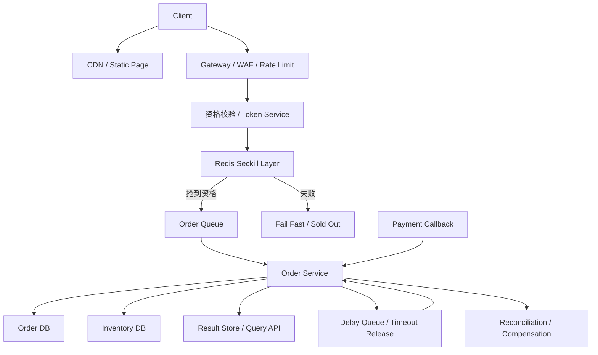

# 系统设计 - 案例 17：秒杀与库存系统真题模拟

## 题目

设计一个秒杀系统，支持：

- 活动商品秒杀
- 高并发抢购
- 库存预占
- 支付确认
- 超时未支付自动释放

先不做：

- 复杂推荐分发
- 跨国家、多区域共享库存
- 复杂招商、选品和运营中台

## 为什么这题值得深讲

秒杀题几乎是系统设计面试里最典型的“看起来很熟，真正讲深很难”的题。

它难的地方不是：

- 你知不知道 Redis
- 你知不知道消息队列
- 你会不会说“削峰填谷”

它真正难在于，这题会同时逼你面对几类完全不同的问题：

- 极短时间内的流量洪峰
- 极小资源池上的激烈竞争
- 库存、订单、支付三者之间的状态一致性
- 机器人流量和真实用户流量混在一起
- 用户体验、成功率、正确性之间的强 trade-off

这题特别适合拉开差距，因为很多回答会停在：

- `Redis 扣库存 + MQ 异步下单`

这不算错，但还远远不够。

真正成熟的回答，至少要讲清楚下面这些问题：

- 秒杀系统真正的主矛盾到底是什么
- 为什么不是所有请求都应该进入交易主链路
- Redis 在这里到底是“真相源”还是“加速层”
- 为什么库存要用状态机，而不是一个数字减一就结束
- 为什么这题宁可少卖，也不能超卖
- 支付成功、订单超时、回调重复、消息重试同时发生时，系统怎么收敛

也就是说，这题考的不是“会不会堆组件”，而是：

- 你能不能先定义边界和不变量，再推导出架构

## 面试官真正想看什么

这题通常在看下面几件事：

1. 你会不会先定义库存和订单的不变量，而不是一上来选技术
2. 你能不能识别主矛盾是“前层拦洪峰 + 后层保正确”，而不是单纯“提高吞吐”
3. 你会不会把 `开售前准备`、`抢购资格`、`库存预占`、`异步下单`、`支付确认`、`超时释放` 几条链路拆开
4. 你能不能比较 `数据库扣减`、`Redis 扣减`、`Redis 预占 + DB 真相源` 这些方案的 trade-off
5. 你会不会设计状态机、幂等、补偿和对账
6. 你会不会处理热点 SKU、防刷、热点 key 和资源隔离这些真实问题

## 一开始先别急着设计，先收敛题目语义

秒杀题如果一上来就开始说组件，通常很容易讲偏。

因为这题里面有很多“看起来像技术问题，其实先是产品语义问题”的点。

我会先主动澄清下面这些问题：

1. 是单个爆款 SKU，还是很多 SKU 同时参与活动？
2. 是否允许用户排队，还是必须立即告诉用户成功/失败？
3. 秒杀库存是不是独立库存池，还是和正常库存共用？
4. 支付窗口是 `5 分钟`、`15 分钟`，还是更短？
5. 同一用户对同一 SKU 是否只能成功一次？
6. 是否要求严格不超卖？能不能接受少量少卖？
7. 是否需要资格预热、验证码、设备/IP 限流、防机器人刷单？
8. 活动页面是否可以提前静态化预热？

如果面试官不继续补充，我会主动把题目收敛成下面这个版本：

- 单个爆款 SKU 秒杀
- 允许用户进入排队或处理中状态
- 秒杀库存和日常库存逻辑隔离
- 支付窗口 `15 分钟`
- 同一用户对同一 SKU 只能成功一次
- 严格不能超卖
- 接受少量少卖，但不接受超卖
- 支持资格校验和基础防刷

这里面有两个非常关键的产品选择。

### 选择 1：接受少量少卖，但不接受超卖

这是这题最关键的价值排序。

为什么？

- 超卖意味着真实账错
- 超卖意味着后面可能无货履约、批量退款、商家投诉
- 超卖是系统可信度问题，不只是“损失一点体验”

而少卖意味着什么？

- 可能损失一点 GMV
- 可能损失一点转化率
- 但账务和履约仍然是对的

所以在真实系统里，秒杀的核心倾向通常是：

- 宁可保守一点，也不要把库存账做错

也就是说：

- “是否接受少卖”不是纯技术问题，而是系统价值排序问题

### 选择 2：下单时预占库存，而不是支付成功后再扣

很多人会说：

- “支付成功再扣库存，不就不会占坑了吗？”

这在普通场景里听起来像一种优化，但在秒杀题里通常会把语义彻底搞乱。

为什么？

- 如果下单成功但不预占，用户去支付时可能已经没货
- 那支付成功后还拿不到商品，体验会非常差
- 同时订单、支付、库存三者之间会缺少一个稳定的中间状态

所以如果题目没特殊要求，我会主动把库存语义定义成：

- `available -> reserved -> sold / released`

这样：

- 用户抢到资格后先有一份库存占用
- 支付成功后把占用转成已售
- 超时未支付则释放占用

这会让支付窗口、回滚、超时和对账都清楚很多。

## 第一步：先判断这是一个什么类型的系统

我会先明确，这不是一个普通的“高并发下单系统”，而是一个非常特殊的系统：

- 它有极强的时间集中性
- 它有极强的热点集中性
- 它有极强的请求无效性
- 它对正确性的要求高于对平均吞吐的追求

更具体一点说：

1. 绝大多数请求从一开始就注定买不到
2. 真正有资格进入交易后层的请求只占很小一部分
3. 系统最贵的不是“生成订单”这一步，而是“在洪峰中快速筛掉无效流量”
4. 秒杀不是纯读系统，也不是普通写系统，而是“入口超高并发、后层强正确”的混合系统

这意味着几个很重要的设计结论：

1. 不能把所有请求都打到订单服务和数据库
2. Redis 在这里不是锦上添花，而是流量分层的关键组件
3. 排队和异步化不是可选优化，而是核心架构能力
4. 库存真相必须清晰定义，不能“Redis 一份、DB 一份、都算真相”

很多人会把这题回答成：

- “怎么用 Redis 顶住高 QPS”

但真正高分的回答应该是：

- “怎么让海量无效请求在前层止步，同时让少量有效请求通过状态机和真相源正确收敛”

## 第二步：先做一轮容量估算，不然 trade-off 没锚点

这题如果不做容量估算，后面很多设计都只是口号。

我会给一组面试里非常典型、又足够有代表性的假设：

- 单个活动库存 `1 万`
- 开售前已有大量页面预热
- 开售 `10 秒` 内共有 `100 万` 次抢购请求进入系统
- 峰值入口流量约 `10 万 QPS`
- 极端情况下可到 `20 万 QPS`
- 支付确认峰值远低于抢购峰值

这组数字不是为了“算得特别准”，而是为了把系统主矛盾钉住。

### 入口流量和有效流量差距有多大

如果开售 `10 秒` 内有 `100 万` 次请求，而库存只有 `1 万`，那意味着：

- 最多只有 `1%` 的请求可能成功
- 至少 `99%` 的请求从业务结果上看是无效的

这个比例一出来，设计方向就很清楚了：

- 我们的目标不是让 `100 万` 个请求都优雅地下单
- 而是让其中绝大多数尽快、廉价、可控地失败

也就是说：

- “失败得快”在秒杀系统里是一种能力，不是失败

### 如果所有请求都进入订单链路会怎么样

假设你不做前层筛选，让 `100 万` 请求都去创建订单，那么开售 `10 秒` 内：

- 订单服务要抗 `10 万 QPS`
- 数据库要承受大量唯一校验、库存更新、事务冲突
- 库存热点会极端集中在一个 SKU 上

这种情况下，即使数据库本身顶得住，事务竞争和锁冲突也会非常重。

更糟的是：

- 大部分请求其实根本不该走到这一步

所以系统必须分层：

- 前层负责快速判断“有没有资格继续”
- 后层负责对极少量有效请求做严肃交易处理

### 订单和状态数据规模

如果库存是 `1 万`，那这一轮活动最终成功订单上限也是 `1 万` 左右。

哪怕考虑：

- 部分超时未支付
- 部分支付失败
- 部分释放后被后续用户补位成功

最终进入订单真相链路的记录数量，通常也还是远低于入口请求数。

比如你让前层最多放行 `1.2 万` 到 `1.5 万` 个资格请求，那么：

- 订单 DB 的真实写入规模就会从 `100 万` 下降到 `1 万级`

这就是秒杀架构的本质：

- 不是把后层做得足够大
- 而是尽量不要让无效请求进入后层

### 延迟目标

我会顺手给出一组比较合理的目标：

- 抢购接口 `P99 < 50 ms`
- 查询排队/结果接口 `P99 < 100 ms`
- 支付确认接口 `P99 < 200 ms`
- 超时释放允许秒级延迟，但必须最终收敛

这几个目标一旦定下来，很多设计就自然推出来了：

- 抢购接口不能同步落完整订单
- 抢购接口不能同步写复杂事务
- 支付和释放必须依赖状态机
- 对账和补偿必须异步化

## 第三步：先定义不变量，而不是先选技术

这是秒杀题里最容易被忽略、但最能拉开差距的一步。

我会先定义下面几个不变量：

1. 任意时刻，同一秒杀 SKU 满足 `sold + reserved <= total_stock`
2. 同一用户对同一秒杀 SKU 最多只能有一个成功或有效占用中的订单
3. 支付成功的订单必须对应一份仍然有效的库存占用
4. 超时未支付的订单最终必须释放占用库存
5. 任意回调、消息重试、任务重跑都不能破坏前面四条

如果想再说得更工程一点，我还会补一句：

- Redis 中的资格或占用状态可以短暂和数据库不一致，但数据库中的订单与库存状态必须能最终收敛为真相

这几条不变量背后的意思是：

- 秒杀库存不是一个简单数字
- 订单状态和库存状态必须成对设计
- 幂等不是“补充项”，而是系统正确性的一部分

很多候选人会不停强调：

- “QPS 很高”

但如果不变量没定义清楚，后面即使堆了再多组件，也只是高 QPS 地出错。

## 第四步：不要直接给最终方案，先走一遍真实设计推演

这一步是这章我要重点加强的地方。

我不会一上来就把最终架构图甩出来，而是像真的在设计系统一样，一轮一轮推。

## 第一轮思考：最朴素的方案是什么

最直观的方案通常是：

- 用户点“立即抢购”
- 请求直接到订单服务
- 订单服务在数据库里校验库存
- 库存大于 0 就扣减并创建订单
- 用户去支付
- 超时后再扫表释放

这个方案有什么优点？

- 简单
- 所有真相都在数据库里
- 小流量下功能闭环完整

如果只是：

- 小活动
- 小库存
- 低并发

它甚至完全可用。

但一旦放到秒杀场景，问题会马上暴露：

1. 所有请求都进入交易链路，后层压力失控
2. 单个 SKU 会变成数据库热点
3. 高并发下事务竞争、锁等待、超时重试会非常重
4. 失败请求成本太高，系统会把资源浪费在注定失败的人身上

所以第一轮方案可以作为：

- 最小可用系统

但绝不是面试里应该停下来的位置。

## 第二轮思考：先把大多数无效流量挡在交易后层之前

既然库存只有 `1 万`，而入口请求有 `100 万`，那最自然的想法就是：

- 绝大多数请求不应该进入订单数据库

这时候我会把链路拆成两层：

1. 前层资格筛选层
2. 后层订单落账层

前层做什么？

- 活动是否开始
- 用户是否登录
- 是否命中过度频率限制
- 是否已成功抢购过
- 库存资格是否还有

后层做什么？

- 创建订单
- 记录库存预占
- 处理支付确认
- 处理释放和补偿

这个拆分非常关键，因为它体现了秒杀系统真正的主次关系：

- 前层不是“简单校验”
- 前层是整个系统能不能活下来的关键

### 为什么前层不能只是 Gateway 限流

很多回答会说：

- “前面加个限流就行”

但普通限流只能解决一部分问题。

原因是：

- 限流只能控制总流量
- 它不能判断谁有资格成功
- 它也不能完成一人一单、库存原子判断这些业务语义

所以我们要的不是单纯“流控”，而是：

- 带业务语义的前层筛选

这通常需要：

- 活动配置
- 用户维度状态
- SKU 维度状态
- 原子扣减或原子保留能力

而这也是 Redis 在秒杀题里价值最大的地方之一。

## 第三轮思考：抢购 token 到底值不值得做

很多秒杀系统在真实工程里，不会让客户端直接无限次打抢购接口。

这里有一个隐藏但很重要的设计点：

- 要不要引入 `抢购 token` 或 `动态抢购凭证`

如果不做这个能力，会有什么问题？

- 抢购接口地址过于暴露
- 机器人可以提前压测或持续刷接口
- 活动未开始前就有大量无意义请求打进来
- 很难把“资格校验”和“正式抢购”分层

所以这一步值得单独比较。

## 抢购 token 方案比较

### 方案 A：不开 token，用户直接调用抢购接口

做法：

- 用户打开商品页后，直接点“立即抢购”
- 客户端直接调用秒杀下单接口

优点：

- 最简单
- 用户路径最短
- 系统实现最省事

缺点：

- 抢购接口完全暴露
- 很难做更精细的资格控制
- 机器人更容易提前打爆接口

适合什么时候：

- 内部系统
- 小规模活动
- 防刷要求不高

### 方案 B：活动开始时动态下发短时 token

做法：

- 用户先请求资格接口
- 资格接口判断登录态、活动状态、防刷规则
- 通过后发一个短时有效的 `purchase_token`
- 只有带 token 才能进入正式抢购接口

优点：

- 抢购接口不直接裸露
- 可以把“资格校验”和“抢购预占”拆成两步
- token 可以带上活动、用户、过期时间、签名等信息

缺点：

- 系统更复杂
- 多了一条接口
- token 本身也会变成热点对象

适合什么时候：

- 核心活动
- 防刷要求较高
- 想把入口流量进一步分层

### 方案 C：开售前预热资格，开售时凭资格抢购

做法：

- 用户在活动开始前完成预约、答题、会员校验等资格动作
- 系统提前把合格用户放进资格池
- 开售时只允许资格池用户参与抢购

优点：

- 能极大降低无效流量
- 防刷和控量更从容
- 用户体验更稳定

缺点：

- 更依赖运营流程
- 通用性没那么强
- 不一定适合所有秒杀业务

### 我在这个题里的选择

如果是常规面试题，我会给一个务实回答：

- 不一定必须做复杂预约资格池
- 但我会保留 `短时 purchase_token` 或动态路径签名能力

原因是：

1. 这能把资格校验前置
2. 这能减少接口暴露和机器人持续撞接口
3. 这能把正式抢购链路变得更可控

但我也不会把它说成必须组件，因为：

- 秒杀系统的核心还是库存与订单的正确性
- token 是很重要的增强项，不是唯一核心

## 第四轮思考：库存到底放哪里才算真相

这一步是秒杀题最经典、也最容易答偏的部分。

很多人会说：

- “库存放 Redis，快”

或者：

- “库存放数据库，准”

这两句话各自只讲对了一半。

真正要比较的是：

- 前层资格判断的库存
- 后层交易真相的库存

它们是否必须是同一份状态，以及应该怎样协作。

## 库存方案比较

### 方案 A：只在数据库里扣库存

做法：

- 每次抢购都进入数据库
- 在数据库里检查 `stock > 0`
- 满足条件就更新库存并创建订单

优点：

- 真相统一
- 事务边界清晰
- 审计和对账简单

缺点：

- 开售瞬间数据库热点极大
- 大量失败请求也要付出事务成本
- 锁竞争和重试会非常重

适合什么时候：

- 并发不极端
- 活动规模不大
- 更重视实现简单

### 方案 B：只在 Redis 里扣库存

做法：

- 前层直接在 Redis 中用原子操作减库存
- 抢到的人再异步补写订单和数据库

优点：

- 快
- 顶热点能力强
- 前层性能非常好

缺点：

- Redis 很难独立承担最终账务真相
- 异步落库失败、消息丢失、补偿失败都会让账变复杂
- 支付、释放、重复回调会让收敛逻辑更难

适合什么时候：

- 更偏活动资格发放
- 不那么强调交易账务严肃性

### 方案 C：Redis 做前层预占，数据库做最终订单与库存真相源

做法：

- 前层在 Redis 中做资格原子判断和快速预占
- 只有预占成功的请求进入订单队列
- 后层在数据库中创建订单并记录库存占用
- 支付成功再把占用转已售
- 超时释放时回收库存

优点：

- 兼顾吞吐和正确性
- 可以在前层挡住绝大部分无效流量
- 又不会把最终账务完全交给 Redis

缺点：

- 复杂度更高
- 会出现短暂不一致
- 需要对账和补偿

### 我在这个题里的选择

真实系统里，如果这是一个核心秒杀系统，我通常会选：

- `Redis 做前层快速预占 + 数据库做订单和库存最终真相`

原因不是“Redis 很快”这么简单，而是：

1. 洪峰流量必须在前层被拦住
2. 库存和订单最终必须有严肃真相源
3. 秒杀系统不是单纯抢资格，还要承受支付、取消、释放和对账

所以这里我会很明确地说：

- Redis 负责前层资格与热点吸收
- 数据库负责后层真相与最终收敛

这句话非常重要，因为它定义了整个系统的一致性边界。

## 顺手做个容量 sanity check：为什么前层预占能显著降压

假设库存是 `1 万`。

如果你在前层只允许最多 `1 万` 个有效预占进入后层，那么：

- 后层订单写入规模最多就是 `1 万级`

即使你为了减少少卖，允许少量缓冲，比如：

- 最多放行 `1.1 万` 或 `1.2 万`

后层压力也仍然是可控的。

相比之下，如果没有前层预占，后层面对的是：

- `100 万` 次请求

这两个数量级差了将近：

- `100 倍`

这说明前层筛选不是一个小优化，而是整个秒杀系统成立的前提。

## 第五轮思考：请求要不要排队

走到这一步以后，问题会进一步演化成：

- 抢到资格的人，是不是应该直接同步创建订单？

很多人会觉得：

- “资格都抢到了，那就顺手同步下单不就完了”

但真实系统里，这里仍然值得比较。

## 请求进入后层的方案比较

### 方案 A：抢到资格后，直接同步创建订单

优点：

- 用户反馈快
- 链路短
- 业务逻辑相对直观

缺点：

- 订单服务仍然会承受尖峰突刺
- 一旦后层抖动，用户接口 RT 会直接恶化
- 重试和超时会把问题放大

适合什么时候：

- 规模没那么极端
- 后层容量很强

### 方案 B：抢到资格后写入队列，异步创建订单

优点：

- 可以把后层消费速率控制在稳定范围内
- 更容易做重试、补偿和削峰
- 用户侧可以用“排队中”或“处理中”过渡

缺点：

- 用户结果不是立刻返回
- 业务流程更复杂
- 要设计结果查询和超时处理

适合什么时候：

- 典型高并发秒杀
- 用户可接受“处理中/排队中”

### 我在这个题里的选择

如果产品允许，我会明确选择：

- `异步队列 + 结果查询`

原因是：

1. 秒杀的本质就是洪峰整形
2. 排队是把后层从“被流量推着跑”变成“按系统节奏消费”
3. 订单创建、库存落账、幂等控制都更容易稳定

所以我会把用户体验设计成：

- 抢购接口先返回“已受理/排队中”
- 客户端轮询结果，或者通过 WebSocket/推送收到最终结果

这里我会主动强调一句：

- 排队不是用户体验的退步，而是系统稳定性和公平性的基础设施

## 第六轮思考：为什么库存和订单都要用状态机

如果走到这一步，你其实已经不能再把秒杀理解成：

- 一个 `stock = stock - 1`

因为秒杀交易里有非常多中间状态：

- 用户抢到资格，但订单还没写成功
- 订单写成功，但还没支付
- 支付成功回调重复到达
- 超时释放任务和支付成功同时发生
- 订单取消后，库存要不要回补

如果没有状态机，你很难把这些场景解释清楚。

## 库存状态为什么不能只用一个数字

很多回答里会把库存简化成：

- `stock`

然后说：

- 下单减一
- 取消加一

这在低并发场景也许够用，但在秒杀题里通常不够。

更合理的方式是把库存至少分成：

- `available`
- `reserved`
- `sold`

或者在实现上存成：

- `total_stock`
- `reserved_stock`
- `sold_stock`

这样你就可以自然表达：

- 抢到资格后，`available -> reserved`
- 支付成功后，`reserved -> sold`
- 超时未支付后，`reserved -> available`

这比“支付成功再扣库存”更符合业务语义，也更适合做对账。

## 订单状态机怎么设计

订单状态我通常会定义成下面这样：

- `INIT`
- `PENDING_PAYMENT`
- `PAID`
- `EXPIRED`
- `CANCELLED`
- `FAILED`

其中：

- `INIT` 可以表示已受理但还未完成完整落账
- `PENDING_PAYMENT` 表示订单已创建且占有库存
- `PAID` 表示交易完成
- `EXPIRED` 表示支付超时
- `FAILED` 表示系统异常导致订单未成功建立

这里很关键的一点是：

- 订单状态和库存状态必须成对迁移

比如：

- `PENDING_PAYMENT` 对应一份 `reserved`
- `PAID` 对应一份 `sold`
- `EXPIRED/CANCELLED` 对应已释放占用

如果你能主动把这两套状态机讲成联动关系，答案会立刻显得很成熟。

## 第七步：把最终高层架构定下来

在前面几轮推演之后，一个比较成熟的秒杀架构会长这样：

这里每一层的职责我会讲得非常明确：

- `CDN / Static Page` 承接页面和静态资源，不让页面请求拖累交易接口
- `Gateway / WAF / Rate Limit` 做基础防护和粗粒度控流
- `资格校验 / Token Service` 做登录、资格、防刷和短时凭证发放
- `Redis Seckill Layer` 做原子资格判断和前层预占
- `Order Queue` 把后层压力从洪峰变成可控消费速率
- `Order Service + DB` 负责最终订单、库存状态和业务真相
- `Delay Queue / Timeout Release` 负责支付超时释放
- `Reconciliation / Compensation` 负责长期正确性收敛

## 第八步：把 API 设计说清楚

如果我要讲得更工程化，我会顺手把接口也定义出来。

### 获取活动信息

`GET /v1/seckill/activities/{activity_id}`

返回字段：

- `activity_id`
- `sku_id`
- `start_time`
- `end_time`
- `status`
- `price`
- `limit_per_user`

这个接口通常会：

- 走页面静态化或高缓存
- 不应该在开售瞬间频繁查主库

### 获取抢购 token

`POST /v1/seckill/activities/{activity_id}/token`

请求字段：

- `user_id` 由登录态隐含
- `device_id`
- `captcha_token` 可选

返回字段：

- `purchase_token`
- `expire_at`

这个接口的作用不是“下单”，而是：

- 资格校验
- 防刷前置
- 隐藏真实抢购入口

### 提交抢购请求

`POST /v1/seckill/orders`

请求字段：

- `activity_id`
- `sku_id`
- `purchase_token`
- `request_id`
- `idempotency_key`

返回字段：

- `accepted`
- `queue_status`
- `result_query_token`

这里我会特别强调：

- 这个接口更像“提交秒杀请求”，不一定意味着订单已经创建成功

### 查询秒杀结果

`GET /v1/seckill/orders/result?request_id=xxx`

返回字段可能是：

- `QUEUING`
- `SUCCESS`
- `FAILED`
- `SOLD_OUT`
- `REPEATED`
- `EXPIRED`

这一步很重要，因为它把：

- 用户感知
- 后层异步处理

连接了起来。

### 支付回调

`POST /v1/payments/callback`

请求字段：

- `order_id`
- `payment_status`
- `transaction_id`
- `event_id`

这个接口必须具备：

- 幂等能力
- 状态机校验能力

因为支付回调重复是非常常见的。

## 第九步：把核心数据模型说深一点

### 活动配置表

`seckill_activity`

关键字段：

- `activity_id`
- `sku_id`
- `start_time`
- `end_time`
- `status`
- `limit_per_user`
- `seckill_price`
- `payment_timeout_sec`

这张表的作用是：

- 定义规则真相
- 给前层做配置预热

### 库存表

`seckill_inventory`

关键字段：

- `activity_id`
- `sku_id`
- `total_stock`
- `reserved_stock`
- `sold_stock`
- `version`
- `updated_at`

为什么我会保留 `version`？

- 因为后层更新时，往往需要乐观锁或版本校验

这张表里最重要的不是字段本身，而是你能不能说出它背后的约束：

- `reserved_stock + sold_stock <= total_stock`

### 秒杀订单表

`seckill_order`

关键字段：

- `order_id`
- `activity_id`
- `sku_id`
- `user_id`
- `status`
- `amount`
- `request_id`
- `idempotency_key`
- `expire_at`
- `payment_txn_id`
- `created_at`
- `updated_at`

这里 `request_id` 和 `idempotency_key` 都值得保留，因为：

- 一个用于链路追踪和结果查询
- 一个用于接口级幂等

### 抢购请求结果表

`seckill_request_result`

关键字段：

- `request_id`
- `user_id`
- `activity_id`
- `sku_id`
- `result_status`
- `order_id`
- `reason_code`
- `expire_at`

这张表的价值是：

- 用户异步查询时不用扫订单主表
- 能把“失败原因”显式化

### 支付事件表

`payment_event_log`

关键字段：

- `event_id`
- `order_id`
- `payment_status`
- `transaction_id`
- `received_at`

这张表通常是为了：

- 幂等
- 审计
- 对账

### 释放任务记录

`inventory_release_task`

关键字段：

- `task_id`
- `order_id`
- `execute_at`
- `status`
- `retry_count`

即使你最终用的是延迟队列，这类记录也常常值得保留，因为：

- 延迟消息不等于可审计任务

## 第十步：真正把开售前准备讲出来

秒杀系统回答如果从“用户点按钮”才开始，通常说明对线上系统没有真实感觉。

因为秒杀很多问题在开售前就已经决定了胜负。

## 开售前到底要准备什么

### 页面和静态资源预热

我会先把：

- 商品详情页
- 活动规则
- 倒计时
- 图片和前端静态资源

都提前静态化并放到 CDN。

原因很简单：

- 秒杀开始时最先被打爆的，未必是交易接口
- 很多时候是商品页、活动页、详情接口先撑不住

如果这些内容还要临时读数据库或后端拼装，系统甚至可能在正式下单前就已经变慢。

### 活动配置和热点数据预热

我会把下面这些数据提前预热到 Redis：

- 活动开始/结束时间
- SKU 活动配置
- 用户限购规则
- 已售罄标记
- 抢购 token 的签发规则

这些都是开售瞬间要频繁读取的数据。

如果还依赖实时查数据库，就等于把热点留在最不该留的地方。

### 基础风控规则预装载

开售前我会把：

- 黑名单
- 设备/IP 限速策略
- 验证码或行为校验开关
- 动态路径/签名策略

都提前准备好。

原因是：

- 防刷不是开售后再慢慢打开的运营按钮
- 它是交易正确性的前置条件之一

### 资源隔离和压测预案

如果这是一个核心活动，我还会主动讲：

- 热点活动单独资源池
- Redis 单独实例或分组
- 订单消费者单独 Topic / 分区
- 降级开关和熔断阈值

因为秒杀系统的一个真实工程原则是：

- 不要让一个爆款活动把整站正常交易拖死

## 第十一步：真正把抢购主链路拆开来讲

前面铺垫完之后，现在才进入用户点击“立即抢购”的那一刻。

## 抢购链路的理想延迟预算

如果我想让这条链路讲得更像真系统，我会顺手给一个延迟预算：

- Gateway / WAF / 限流：`5 - 10 ms`
- 资格校验 / token 校验：`5 - 10 ms`
- Redis 原子预占：`1 - 5 ms`
- 写入队列 / 结果落缓存：`5 - 10 ms`

这样整个抢购接口的目标就大概是：

- `P99 < 50 ms`

这个预算背后的核心思想是：

- 抢购接口只做最必要的事
- 绝不在主链路里同步做昂贵事务

## 抢购流程

一个比较成熟的抢购主流程可以是这样：

1. 用户点击抢购，请求先到 Gateway
2. Gateway 做登录校验、基础限流、IP/设备限频
3. 请求进入资格校验层，验证 `purchase_token` 或动态路径签名
4. Redis 用 Lua 或原子脚本一次性判断：
   - 活动是否开始
   - 是否已售罄
   - 用户是否已经成功或预占过
   - 是否还有可分配资格
5. 如果 Redis 预占成功，生成 `request_id` 并把请求写入订单队列
6. 同时写一份 `QUEUING` 的结果给结果查询层
7. 抢购接口立即返回“已受理/排队中”
8. 如果 Redis 预占失败，立即返回 `SOLD_OUT` 或 `REPEATED`

这里要主动强调两点：

第一：

- Redis 预占成功不等于订单一定成功

第二：

- 但 Redis 预占失败通常可以很快确定用户已经没资格继续

也就是说，抢购接口做的是：

- 资格筛选和受理

而不是：

- 完整交易闭环

## 为什么这里适合 Lua 或原子脚本

因为抢购主链路里通常有一组必须原子判断的条件：

- 活动状态
- 用户去重
- 库存是否还有
- 结果写入

如果你把这些步骤拆成多次 Redis 往返或多次普通调用，就会引入竞态窗口。

所以这里很自然地适合：

- Lua
- Redis 事务
- 或者具备等价原子性的前层实现

重点不是工具名本身，而是：

- 这几步必须原子完成

## 第十二步：把后层下单、支付、释放讲成闭环

前层受理完成后，真正严肃的交易处理在后层发生。

这一步如果只说一句“消费者下单”，答案还是太浅。

## 后层下单流程

订单服务消费队列后，我会这样处理：

1. 先按 `request_id` 或 `idempotency_key` 做消费幂等检查
2. 校验是否已经存在该用户对该 SKU 的有效订单
3. 在数据库事务里：
   - 创建 `PENDING_PAYMENT` 订单
   - 更新库存，把一份可售库存转成 `reserved`
   - 写结果表为 `SUCCESS` 并关联 `order_id`
4. 事务提交后，投递一条延迟释放任务

这里最关键的是：

- 数据库里的订单和库存状态要一起落账

这样才能保证：

- 订单成功就一定对应一份真实占用

如果事务中任何一步失败，我会：

- 标记该请求结果为失败
- 触发 Redis 预占的补偿释放或等待对账收敛

## 支付确认链路

支付成功回调后，系统通常要做下面几步：

1. 先按 `event_id` 或 `transaction_id` 做回调幂等
2. 查询订单状态
3. 只有当订单状态是 `PENDING_PAYMENT` 时，才允许迁移到 `PAID`
4. 同时把对应库存从 `reserved` 迁移到 `sold`

这个过程里要特别强调：

- 支付成功不是再去抢一次库存

因为库存已经在订单创建时被预占过了。

支付确认做的是：

- 把已有占用正式转成成交

## 超时释放链路

超时释放通常有两种常见做法。

### 方案 A：数据库扫表释放

做法：

- 周期性扫描 `PENDING_PAYMENT` 且已过期订单
- 逐条释放库存

优点：

- 简单
- 好理解

缺点：

- 扫表成本高
- 精度和扩展性一般
- 大活动时不够优雅

### 方案 B：延迟队列 / 时间轮释放

做法：

- 订单创建时写一条 `expire_at` 对应的延迟任务
- 到点后消费释放逻辑

优点：

- 更贴近事件驱动
- 扩展性更好
- 不依赖长期扫表

缺点：

- 系统更复杂
- 仍然要考虑消息丢失和重试

### 我在这个题里的选择

如果是核心秒杀系统，我会优先选：

- `延迟队列 + 扫表兜底`

原因是：

1. 高频释放不适合长期依赖扫表
2. 但任何延迟消息系统都不能假设自己永远不丢
3. 所以最稳的方式通常是：
   - 事件驱动做主路径
   - 周期对账或扫表做兜底

这和很多真实系统的原则是一样的：

- 主路径追求效率
- 兜底路径追求最终收敛

## 支付成功和超时释放同时发生怎么办

这是一个非常经典的追问点。

比如：

- 订单 `15:00:00` 超时
- 释放任务在 `15:00:01` 执行
- 支付平台的成功回调也刚好在这时到达

这时候如果没有状态机保护，系统很容易出错。

我会这样回答：

- 所有状态迁移都要做合法性校验
- 只有 `PENDING_PAYMENT -> PAID` 才是合法支付迁移
- 只有 `PENDING_PAYMENT -> EXPIRED` 才是合法超时迁移

也就是说：

- 谁先成功 CAS 或版本更新，谁生效
- 另一路看到状态已变更后，就走幂等返回或补偿路径

如果释放先成功，把订单改成 `EXPIRED`，那后续支付成功回调通常需要：

- 走异常处理流程
- 由支付系统退款或人工补偿

这里不要试图把所有边界条件都“完美双赢”，真正成熟的回答是：

- 先保证状态机不乱，再讲异常资金补偿

## 第十三步：把热点治理讲成真正的设计，而不是一句“上 Redis”

很多人会说：

- “热点 SKU 就用 Redis”

这句话太粗了，因为热点其实出现在好几层。

## 热点到底热在哪里

在秒杀题里，热点通常至少有四种：

1. 活动页和详情页热点
2. 抢购接口热点
3. Redis 库存 key 热点
4. 后层同一 SKU 的订单和库存处理热点

如果只盯着第三个热点，你的答案会显得很窄。

## 页面热点怎么处理

页面热点最典型的处理方式是：

- 静态化
- CDN
- 提前预热

因为活动开始时，很多用户甚至还没点抢购，页面层已经先被打满。

这一步虽然不是“交易技术”，但在系统设计题里反而很加分，因为它说明你知道真实系统不是只有一个 API。

## 抢购接口热点怎么处理

这一层我会优先做：

- 动态路径或 token
- 登录态校验
- 设备/IP 限流
- 网关快速失败
- 用户维度去重

这里的目标不是“让所有人都公平排队等待”，而是：

- 让明显无效或恶意的流量在尽可能前面就失败

## Redis 热点 key 怎么处理

这是面试里最常见的追问之一。

我会先说明：

- Redis 库存 key 确实是热点
- 但不要本能地把它理解成“简单做分片就好”

为什么？

- 库存本身是一个全局共享稀缺资源
- 你把一个库存强行分成多个独立 key 后，会增加汇总和一致性复杂度

所以很多时候，我更倾向于：

- 把热点留在一个可控、原子、受保护的位置
- 然后在它前后做充分削峰和隔离

具体做法包括：

- 用本地 `sold_out` 标记减少已经售罄后的重复打 Redis
- 为超热点活动使用独立 Redis 分组或实例
- 在前层加更严格的资格和速率控制
- 对订单消费者按活动或 SKU 分区

也就是说：

- 真正的热点治理不是“把一个热点 key 切成 10 片”
- 而是从入口到后层整个链路做压力整形

## 为什么本地 sold_out 标记很有用

一旦库存已经明显耗尽，系统里通常还会持续有大量请求打进来。

如果每个请求都还去碰 Redis，就会造成：

- 无意义的热点读写

所以一个很实用的优化是：

- 应用实例本地维护短时 `sold_out` 标记

这样在售罄后：

- 很多请求可以直接在应用层 fail fast

当然，这里要注意它只是：

- 性能优化

而不是：

- 真相判断

因为本地标记可能短暂过时，所以它只能用于：

- 快速失败
- 减少热点压力

不能用于：

- 宣布库存一定还有

## 后层热点怎么处理

即使前层已经拦掉了大部分请求，后层仍然可能面临热点：

- 同一活动的请求集中在一个队列分区
- 同一 SKU 的订单更新集中在一张表、一组行

所以我会进一步做：

- 按活动或 SKU 对订单消费分区
- 热门活动独立消费者组
- 热门活动独立 DB 资源池或连接池限额

这背后的思路不是：

- “把所有问题都通用化”

而是：

- 对极少数热点活动做资源隔离，避免拖垮全站

## 第十四步：把幂等、重试、补偿和对账讲进去

如果这部分不讲，秒杀答案很容易停留在“高并发技巧”，而不是完整交易系统。

## 哪些地方一定要幂等

这题至少有四类场景必须讲幂等：

1. 用户重复点击抢购
2. 队列消息重复投递或重复消费
3. 支付回调重复通知
4. 超时释放任务重复执行

所以我会分别设计：

- 接口级 `idempotency_key`
- 请求级 `request_id`
- 消费级业务幂等键
- 支付事件级 `event_id`

重点不是字段名字，而是：

- 每一条可能重复的链路都要有自己的幂等锚点

## 用户重复点击怎么处理

最前层可以先做：

- 用户维度限频
- 前端按钮置灰

但这些都只能降低概率，不能当成最终保证。

真正的保证还是要在后层做：

- 同一 `user_id + activity_id + sku_id` 的唯一约束
- 或者显式状态判断

这样即使用户连续点了十次，也不会成功生成十个有效订单。

## 队列重复消费怎么处理

消息队列在真实系统里通常只能提供：

- 至少一次投递

所以消费者必须自己兜底。

我会这么做：

1. 消费前先查 `request_id` 是否已落结果
2. 如果已成功建单，则直接幂等返回
3. 如果之前处理中断，则按状态决定是否重试或人工介入

不要把“消息至少一次”当成一个缺点去回避，真正高分的回答应该是：

- 承认重复是常态，然后讲如何设计幂等

## 支付回调重复怎么处理

支付回调最标准的设计是：

- 先写事件日志
- 再基于 `event_id` 或 `transaction_id` 去重
- 再做状态迁移

只有订单当前状态是：

- `PENDING_PAYMENT`

才允许更新到：

- `PAID`

如果已经是 `PAID`，那就直接幂等成功。

如果已经是 `EXPIRED`，那就进入异常资金处理流程。

## Redis 和数据库不一致怎么办

只要你的前层是 Redis，后层是真相数据库，这个问题就一定会被问。

我会这样回答：

- Redis 是前层资格与预占层
- 数据库中的订单与库存状态是最终真相
- 两者短暂不一致是可预期的，但必须有明确收敛机制

常见的不一致场景包括：

1. Redis 预占成功，但队列投递失败
2. 队列成功，但订单事务失败
3. 数据库已释放，Redis 还残留用户占用标记
4. 支付成功，但结果查询层更新延迟

对应的收敛方式可以是：

- TTL 自动过期
- 补偿消息
- 周期对账
- 扫描异常状态订单

关键是你要说明：

- 谁是最终真相
- 怎么把偏差收回来

## 对账到底对什么

对账不是一句泛泛的“后台跑任务”。

如果我要把这部分讲得真实一点，我会把它拆成几类：

### 订单与库存对账

目标是检查：

- `PENDING_PAYMENT` 是否都对应一份 `reserved`
- `PAID` 是否都对应一份 `sold`
- `EXPIRED/CANCELLED` 是否已释放占用

### Redis 预占与数据库订单对账

目标是检查：

- Redis 里仍标记成功预占的用户，数据库是否真的有对应订单
- 反过来，数据库有效订单是否在 Redis 侧留有合理痕迹

### 支付与订单对账

目标是检查：

- 支付成功事件是否都落到了订单系统
- 订单状态是否与支付状态一致

如果你能把对账对象说清楚，答案会比“有对账机制”强很多。

## 第十五步：把风控和安全讲进去，不然答案还是不够真实

秒杀系统如果不讲防刷，通常会显得不够落地。

因为秒杀最大的流量来源之一，本来就不是正常用户，而是：

- 脚本
- 机器人
- 代抢工具

## 入口防刷

入口层我通常会做：

- 登录校验
- 设备/IP 维度限频
- 黑名单
- 验证码或行为验证
- 动态路径或 token

这里的目标不是完全消灭机器人，而是：

- 尽量把恶意流量挡在 Redis 和订单系统之前

## 一人一单怎么防绕过

同一用户不能重复成功下单，这个能力不能只靠前端或网关。

它至少应该在三层都有保护：

1. 前端和网关做人机层面的限频
2. Redis 前层做用户维度抢购去重
3. 数据库后层做最终唯一约束

这样即使前面两层被绕过，后面仍然能保住真相。

## 动态路径和 token 为什么重要

它的意义不只是“接口安全一点”。

更实际的价值在于：

- 避免抢购接口长期暴露
- 降低脚本持续撞接口的收益
- 把资格发放和正式抢购拆成两个阶段

所以如果题目里允许我讲更真实一点，我会把它作为：

- 防刷和流量分层的结合点

## 第十六步：如果题目升级到多 SKU、多活动同时开抢，我怎么讲

到目前为止，我们默认的是：

- 单个爆款 SKU

但真实面试里，面试官很可能会继续追问：

- 如果同时有 `1000` 个 SKU 做活动怎么办？

这时候答案不能只是：

- “横向扩容”

你要明确讲出哪里会变。

### 前层配置与路由

多 SKU 场景下，前层首先要解决的是：

- 活动配置如何按 `activity_id / sku_id` 快速路由

这意味着：

- Redis key 设计要更结构化
- 热点 SKU 和普通 SKU 要能区分对待
- 活动规则服务可能要独立出来

### 队列分区

如果所有 SKU 共用一个队列分区，会出现两个问题：

- 热点活动拖慢普通活动
- 单热点挤占全局吞吐

所以更合理的做法通常是：

- 按活动或 SKU 分区
- 超热点活动单独 Topic 或独立消费池

### 资源池隔离

多活动场景下非常重要的一点是：

- 不要让一个超级爆款把所有活动一起拖死

所以我会讲：

- Redis 资源池隔离
- 订单消费者隔离
- 降级开关按活动维度配置

这会让答案更像真实的大促系统，而不是单点技巧集合。

## 第十七步：如果继续演进，这个系统会怎么长大

像第 13 章那样，我也会把这题讲成一个分阶段演进系统，而不是默认一上来就最复杂。

### 阶段 1：单活动、单 Redis、单订单库

适合：

- 秒杀能力刚起步
- 活动规模有限

特点：

- 前层 Redis 预占
- 后层数据库真相
- 延迟队列释放

### 阶段 2：加入 token、防刷、异步结果查询

适合：

- 开始面对更明显的机器人流量
- 用户量和活动热度提升

特点：

- 动态抢购凭证
- 更完整的 Gateway 限流
- 结果查询层独立

### 阶段 3：多活动分区、资源池隔离、对账完善

适合：

- 平台开始承接多场活动
- 单热点已经可能影响整站

特点：

- 按活动或 SKU 分区
- 订单消费隔离
- 对账和补偿体系成型

### 阶段 4：全站大促平台化

适合：

- 秒杀从单个业务能力长成平台

特点：

- 活动配置中心
- 风控平台深度联动
- 更完整的监控、压测、回放和演练体系

这种演进式回答会比“直接上最复杂架构”更稳，因为它说明你知道：

- 架构是随着业务压力长出来的

## 面试里我会怎么讲最终方案

如果让我在面试里用几分钟讲一版完整答案，我大概会这样说：

如果让我设计一个秒杀系统，我会先把问题定义成一个“极端洪峰下的正确性系统”，而不是普通高并发下单系统。它的主矛盾不是把所有请求都处理掉，而是让绝大多数注定失败的请求尽量在前层止步，只让极少量真正有机会成功的请求进入交易后层。

我会先定义几个不变量：第一，任何时刻 `sold + reserved <= total_stock`；第二，同一用户对同一秒杀 SKU 不能重复成功；第三，支付成功必须对应一份有效库存占用；第四，超时未支付的订单最终必须释放库存。有了这些约束以后，我会把系统拆成前层筛选和后层落账两部分。

前层我会用 CDN、Gateway、限流、防刷、资格校验和 Redis 原子预占，快速拦掉无效流量。Redis 在这里不是最终账务真相，而是热点吸收和资格筛选层。只有抢到资格的请求才进入订单队列，订单服务再按受控速率消费，在数据库中创建 `PENDING_PAYMENT` 订单并记录库存预占。

库存状态机我会设计成 `available -> reserved -> sold / released`。用户抢到资格后先预占库存，支付成功再把预占转成已售，超时未支付则通过延迟队列释放。这样支付窗口、释放逻辑和对账都能讲清楚，也比支付成功后再扣库存更符合业务语义。

如果继续深挖，我会重点讲四点：第一，为什么秒杀系统宁可少卖也不能超卖；第二，为什么 Redis 只能做前层资格层，不能单独承担最终库存真相；第三，为什么排队和异步下单是洪峰整形的关键；第四，为什么必须设计幂等、补偿和对账来处理重复消息、重复支付回调和异常状态收敛。

## 面试官如果继续追问，我会怎么答

### 追问 1：为什么不能只靠 Redis 扣库存

我会回答：

- Redis 非常适合热点资格判断和前层预占
- 但订单、支付、释放、回调、对账这些交易语义需要一个更严肃的真相源
- 如果完全依赖 Redis，异步落库失败、补偿失败和事件丢失会让最终账很难收敛

重点不是说 Redis 不行，而是：

- 它更适合承担前层流量整形，不适合单独承担最终账务真相

### 追问 2：为什么宁可少卖也不能超卖

我会回答：

- 少卖主要是体验和收入损失
- 超卖是库存账错和履约问题
- 系统设计里价值排序通常是先保账正确，再尽量提高成功率

所以秒杀系统很多设计都会偏保守：

- 用更强的状态机
- 用更严格的幂等
- 不轻易做激进放量

### 追问 3：如果订单服务消费队列失败怎么办

我会回答：

- 前层预占成功后，后层失败是一个必须面对的场景
- 这时要么立即补偿释放 Redis 预占，要么给预占加 TTL，由对账任务兜底收敛
- 同时要把请求结果标成失败，避免用户一直卡在处理中

也就是说：

- 不能假设“抢到资格后一定能顺利建单”

### 追问 4：支付成功和超时释放撞车怎么办

我会回答：

- 订单状态迁移必须是原子、幂等、带条件的
- 只有 `PENDING_PAYMENT -> PAID` 和 `PENDING_PAYMENT -> EXPIRED` 是合法迁移
- 谁先成功更新，谁生效；另一方看到状态变化后走幂等或异常补偿路径

### 追问 5：热点 SKU 的 Redis key 会不会被打爆

我会回答：

- 会有热点，但不能只靠“简单分 key”来理解这个问题
- 更现实的做法是页面静态化、资格前置、本地 sold_out 标记、前层限流、独立 Redis 分组和后层资源隔离一起做

也就是说：

- 热点治理是全链路设计，不是一个 key 技巧

### 追问 6：如果产品要求不能排队，只能立刻告诉用户成败怎么办

我会回答：

- 那后层同步压力会明显上升
- 我仍然会保留前层 Redis 原子预占，只是后层要更快返回建单结果
- 但这种模式的系统稳定性和峰值承受能力通常不如异步排队方案

这里我要表达的核心是：

- “不允许排队”不是一个无代价的产品决定

## 常见失分点

1. 一上来就说“Redis 扣库存”，但说不清谁是最终真相源。
2. 只讲吞吐，不先定义库存和订单不变量。
3. 不区分前层流量筛选和后层交易落账。
4. 不讲库存状态机，只把库存当一个简单数字。
5. 不讲支付成功、超时释放、重复回调之间的竞态。
6. 不承认 Redis 和数据库会短暂不一致，也不讲对账和补偿。
7. 不讲防刷和资源隔离，把秒杀题答成普通下单题。

## 总结

秒杀系统真正考的不是一句“怎么抗高并发”，而是：

`如何在极端洪峰下，让海量无效请求尽量止步于前层，同时让少量有效请求通过状态机、幂等和真相源保证库存正确。`

一个成熟回答通常应该沿着下面这条主线展开：

1. 先收敛题目语义，明确不能超卖、允许少卖、库存先预占
2. 再做容量估算，说明为什么绝大多数请求不该进交易后层
3. 然后定义不变量，明确库存与订单的状态约束
4. 再拆前层筛选、后层下单、支付确认、超时释放几条链路
5. 最后讲幂等、补偿、对账、防刷和热点隔离

如果你能把这条主线讲清楚，面试官通常会觉得你不是只会背“Redis + MQ”，而是真的理解：

- 秒杀系统为什么必须这样设计

## 自测问题

1. 如果库存只有 `100`，但开售瞬间流量是 `50 万 QPS`，你最先优化的会是哪一层？
2. 如果产品要求“不允许排队，必须同步返回最终结果”，系统的核心压力会从哪里转移到哪里？
3. 如果支付回调重复到了 `10` 次，你的订单状态机如何保证不会重复转已售？
4. 如果 Redis 预占成功，但订单服务建单失败，你会怎么补偿？
5. 如果超时释放先执行成功，随后支付成功回调才到达，你会怎么定义系统行为？
6. 如果题目升级成 `1000` 个 SKU 同时开抢，你最先改的是 key 设计、队列分区，还是资源隔离策略？为什么？
