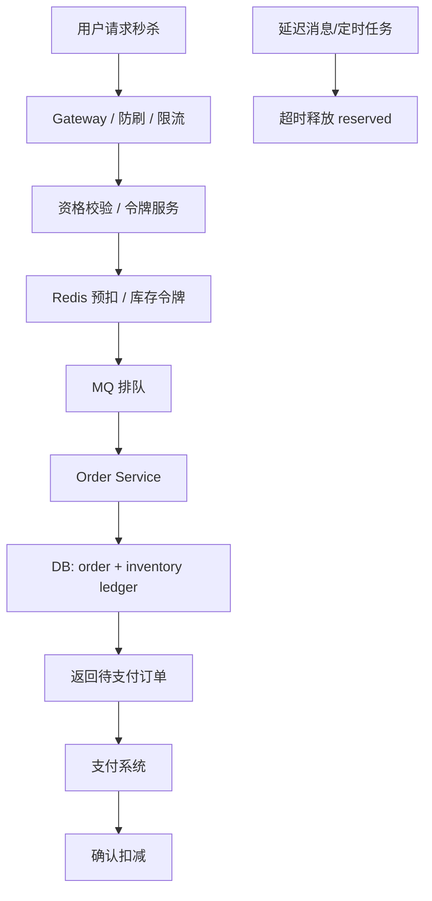

# 系统设计 - 案例 17：秒杀与库存系统真题模拟

## 题目

设计一个秒杀系统，支持：

- 活动商品秒杀
- 高并发下单
- 库存预占
- 支付确认
- 超时未支付自动释放

先不做：

- 复杂推荐
- 长链路营销活动
- 全球多区域库存共享

## 这题为什么常考

秒杀系统是最典型的“正确性优先 + 洪峰流量”题。  
它会同时考：

- 流量筛选
- 热点资源保护
- 防超卖
- 同步边界
- 幂等
- 延迟释放
- Redis 与数据库真相源关系

如果这题答顺了，说明你已经能把“高并发”和“高一致性”两种思路放在一起做权衡。

## 面试官视角：这题真正想考什么

这题通常想看：

1. 你会不会先定义库存不变量
2. 你知不知道秒杀不是所有请求都应该进交易主链路
3. 你会不会区分“前层流量筛选”和“后层真相落账”
4. 你能不能解释预占、超时释放和幂等补偿

## 结构化思考过程（可在面试里直接说出来的版本）

### 第一步：先澄清范围

我会先问：

1. 是单个爆款商品，还是多商品活动？
2. 用户是否允许排队？
3. 下单后是否必须在固定时间内支付？
4. 秒杀库存是不是独立库存池？
5. 是否有防刷、验证码、资格预热需求？

如果面试官不继续补充，我会主动收敛：

- 单商品爆款秒杀
- 用户允许排队
- 下单后 `15 分钟` 内支付
- 秒杀库存单独管理
- 默认需要基础防刷和资格校验

### 第二步：先定义不变量

这是这题最重要的一步。

我会先明确三条不变量：

1. 已确认占用的总量不能超过总库存
2. 同一用户同一请求不能重复生成订单
3. 超时未支付的锁定库存最终必须释放

一旦这三条说清楚，后面的设计就会更稳。

### 第三步：给一轮粗估算

假设：

- 秒杀开始 `10 秒`
- 进入系统的请求 `100 万`
- 实际库存 `10 万`

这意味着：

- 绝大多数请求注定失败
- 交易主链路不能接住所有流量
- 必须在前层做筛选、限流和资格控制

### 第四步：定义核心对象

我会至少拆四个对象：

1. `inventory`
   - `available`
   - `reserved`
   - `sold`

2. `reservation_token`
   - 用户资格/令牌

3. `order`

4. `stock_event`
   - 预占、确认、释放流水

### 第五步：搭高层架构

### 第六步：明确主链路

#### 秒杀主链路

1. 入口限流和防刷
2. 资格校验
3. 在 Redis/内存中做预扣或令牌控制
4. 拿到资格的请求进入 MQ 排队
5. Order Service 创建订单并记录库存预占
6. 返回“下单成功，待支付”

#### 支付完成链路

1. 支付成功回调
2. 幂等更新支付状态
3. 将 `reserved` 转成 `sold`

#### 超时释放链路

1. 订单超时未支付
2. 延迟消息或定时扫描触发关单
3. 将 `reserved` 释放回 `available`

### 第七步：主动深挖两个关键点

#### 深挖点 A：为什么 Redis 预扣不是最终真相

Redis 很适合做：

- 热点库存的前层筛选
- 把无效请求挡在交易主库外

但它不应该被讲成最终账务真相。  
更成熟的表达是：

- Redis 负责快
- 数据库/库存流水表负责准

因为：

- Redis 丢失或回滚语义弱
- 支付、释放、对账最终都需要一个可靠真相源

#### 深挖点 B：为什么要有 `available / reserved / sold`

如果只有一个库存数字，你很难清楚表达：

- 下单成功但未支付
- 支付成功后确认扣减
- 超时未支付需要释放

所以更成熟的库存系统几乎一定会显式建模中间状态。

## 参考答案（面试里可直接说的一版）

如果让我设计一个秒杀系统，我不会一上来先说 Redis，而会先定义三条不变量：总卖出不能超过总库存、同一请求不能重复生成订单、超时未支付的库存最终必须释放。  
这道题既是高并发题，也是正确性优先题，所以设计时要同时做流量筛选和库存真相保护。

容量上如果 10 秒内进来 100 万请求，而库存只有 10 万，那绝大多数请求本来就不应该进入交易主链路。  
所以我会把系统拆成两层：前层负责限流、防刷、资格校验和 Redis 预扣；后层负责真正的订单创建和库存真相落账。  
也就是说，Redis 更像前层流量筛选，而数据库或库存流水表仍然是真相源。

库存对象上，我会拆成 `available / reserved / sold` 三种状态。  
用户抢到资格并成功创建订单时，库存先从 `available` 转到 `reserved`；支付成功后再从 `reserved` 转成 `sold`；如果超时未支付，就通过延迟消息或定时任务把 `reserved` 释放回 `available`。

如果继续深挖，我会重点讲两个点。  
第一，为什么 Redis 预扣不能替代数据库落账，因为支付确认、超时释放、对账修复最终都需要可靠真相源。  
第二，为什么必须有中间的 `reserved` 状态，因为秒杀交易不是一步完成，支付和释放都依赖这个中间态。

如果再往下展开，我会继续补入口限流、防重幂等、消息重复消费、支付回调幂等，以及库存异常对账修复。

## 面试官可能继续追问什么

### 追问 1：为什么不直接全靠数据库条件更新

回答重点：

- 在极端洪峰下，数据库扛不住所有无效竞争
- Redis/令牌层是前置筛选，不是替代真相源

### 追问 2：为什么不直接给库存加分布式锁

回答重点：

- 热点资源上的全局锁吞吐太差
- 锁只是手段，不是架构主线
- 秒杀更适合“前层筛选 + 后层真相”

### 追问 3：支付回调重复怎么办

回答重点：

- 支付单号幂等
- 订单状态机校验
- 防止 `reserved -> sold` 被重复推进

### 追问 4：释放库存消息重复消费怎么办

回答重点：

- 释放动作必须幂等
- 状态机只允许合法状态转换
- 库存流水或事件去重表兜底

### 追问 5：如果 Redis 和数据库不一致怎么办

回答重点：

- 承认会有短暂不一致
- 最终以数据库/库存流水为准
- 通过对账和补偿任务修复

## 常见失分点

1. 一上来就说 Redis 扣库存，没有先定义不变量。
2. 没有解释为什么绝大多数请求不该进入交易主链路。
3. 只讲“防超卖”，没讲 `reserved` 和超时释放。
4. 把 Redis 当成永久真相源。
5. 不提支付回调幂等和库存对账。

## 总结

秒杀题最重要的一句话是：

`它不是简单高并发题，而是“前层筛选 + 后层真相”的正确性系统。`

只要你围绕这句话去讲：

- 先定义不变量
- 再讲流量筛选
- 再讲 `available / reserved / sold`
- 最后补幂等、释放和对账

这题就会非常完整。

## 自测问题

1. 如果不是秒杀，而是普通电商库存，你会把哪些设计简化掉？
2. 如果秒杀商品不止一个，令牌和库存预扣应该按什么粒度拆？
3. 如果支付成功但库存确认消息失败了，你会怎么保证最终一致？
4. 如果面试官说“既然 Redis 很快，为什么不把库存真相直接放 Redis”，你会怎么回答？
