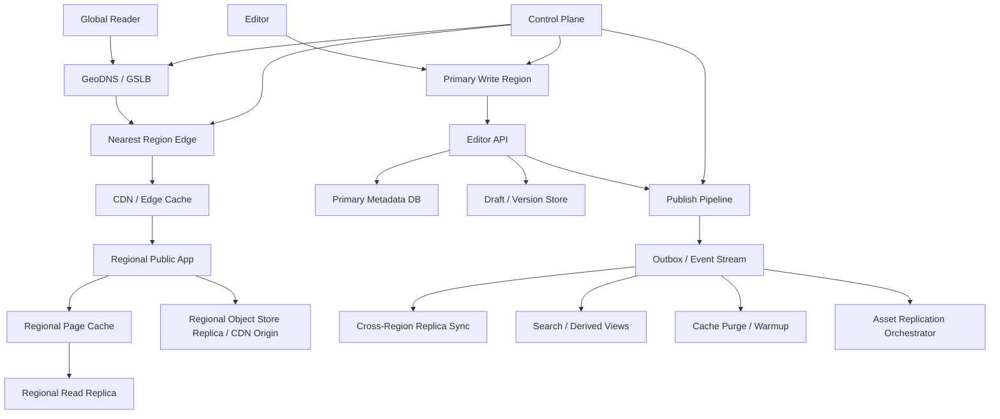

# 系统设计 - 案例 18：全球内容站多区域真题模拟

## 题目

设计一个全球内容站点，类似百科、文档中心或帮助平台，要求：

- 全球用户可低延迟访问
- 支持词条 / 文档编辑与发布
- 图片和附件可访问
- 系统可用性高
- 某个区域故障后仍能继续服务

先不做：

- 复杂协同编辑
- 同一篇文档的全球多主冲突合并
- 个性化推荐
- 复杂权限体系和私有文档分享

## 为什么这题值得深讲

这道题表面上像“把一个站点放到全球多区域”。

很多回答会很快滑向：

- 上 CDN
- 上 GSLB
- 做双活
- 跨区域复制

这些词当然都可能出现，但如果回答只停在这里，深度其实很有限。

因为这题真正难的地方，不是你知不知道 `active-active` 这个词，而是你能不能先把下面几件事说清楚：

- 我们为什么要做多区域，是为了低延迟、容灾、合规，还是三者都有
- 哪些数据必须全局语义清晰，哪些数据允许异步传播
- 公开读、编辑写、发布、附件下载、搜索，这几条链路是不是同一种系统
- 到底值不值得为了编辑写延迟，引入全球多主写的复杂度
- 故障切换以后，怎么避免双主
- 回切时为什么不能一句“切回来”就结束

这题很适合检验一个候选人到底是在“画大图”，还是在“设计系统”。

如果能把它讲深，你其实是在同时展示下面这些能力：

- 你会不会先用业务语义约束架构复杂度
- 你能不能把多区域问题拆成读、写、发布、复制、路由、控制面几个层次
- 你会不会定义不变量，而不是只会报组件
- 你能不能把故障切换、缓存失效、复制延迟和演练讲成一个完整体系

## 面试官真正想看什么

这题通常在看下面几件事：

1. 你会不会先澄清“全球内容站”的内容语义，而不是直接进入基础设施名词
2. 你能不能区分 `公开读`、`编辑保存`、`发布`、`附件分发`、`搜索索引` 这几条链路
3. 你会不会先用 `RTO / RPO / 延迟目标 / 可接受陈旧窗口` 给方案设锚点
4. 你能不能解释为什么这类系统通常优先考虑 `单主写 + 多区域读`
5. 你会不会把 CDN、对象存储复制、数据库副本、索引同步分层讲，而不是把它们混成“数据同步”
6. 你能不能回答故障切换、回切、脑裂风险和演练
7. 你会不会主动提到控制面和可观测性，而不是只讲数据面

## 一开始先别急着设计，先收敛题目语义

这题如果直接进入“多区域怎么搭”，很容易越讲越空。  
我会先主动澄清下面这些问题：

1. 这是公开内容站，还是登录后才可见的知识库？
2. 编辑量大吗？是否需要多人实时协同编辑？
3. 用户修改内容后，全球用户是否必须立刻看到新版本？
4. 文档是“边写边可见”，还是“草稿 / 发布”模式？
5. 同一篇文档是否允许多个编辑者同时修改？
6. 图片和附件是否公开访问？是否需要版本化？
7. 搜索结果和相关推荐是否要求和正文严格同步？
8. 是否存在某些区域必须本地存储、不能跨境复制的合规要求？
9. 故障时最重要的是保证读可用，还是写也必须不中断？

如果面试官不继续补充，我会主动把题目收敛成下面这个版本：

- 这是一个公开读的全球内容站
- 读写比大约在 `1000:1` 甚至更高
- 不做实时协同编辑
- 编辑先写草稿，只有发布后才对公众可见
- 同一篇文档默认不做全球任意多主写
- 文档发布后，全球公开访问允许 `秒级到几十秒级` 传播延迟
- 编辑者自己的读己之写通过主写区或版本化预览来保证
- 搜索索引和相关推荐允许最终一致
- 图片和附件默认公开访问，采用版本化对象 key
- 多区域的主要目标是 `全球低延迟读 + 区域级容灾`，不是“任何地方都能本地写”

这里面有几个非常关键的语义选择。

### 选择 1：先把“草稿”和“已发布版本”拆开

为什么这件事特别重要？

因为如果你不把它拆开，系统会立刻变得模糊：

- 编辑中的半成品能不能被读到？
- 缓存里到底该缓存草稿还是发布态？
- 复制到其他区域的是当前工作区内容，还是已发布版本？
- 搜索应该索引什么？

内容站这类系统最稳的语义通常不是：

- “编辑数据一写进去，公众立刻看到”

而是：

- 编辑操作作用在草稿
- 发布动作切换“公开真相源”指针

一旦这么定义，后面的缓存、复制、索引、回滚都清晰很多。

### 选择 2：公开读接受短暂旧读，但编辑读己之写不能丢

这也是多区域题里一个非常值得主动讲的成熟边界。

对于公开内容站，我通常会主动收敛成：

- 普通读者访问某篇文档时，短时间读到旧版本是可以接受的
- 但编辑者保存草稿后，自己不能读不到刚刚保存的内容

这意味着：

- 公开读流量可以就近读副本或缓存
- 编辑后台则更适合直连主写区，或者使用版本号精确读取

也就是说：

- “全球用户都低延迟” 和 “所有人都本地强一致写” 不是同一个目标

### 选择 3：默认不做同一篇文档的全球多主写

为什么？

- 编辑量本来不大
- 内容站更在意版本语义清晰，而不是全球写延迟极致最低
- 同一文档多地主写会马上引入冲突合并、操作排序、脑裂和回滚问题

如果题目没有明确要求，我会主动把边界收紧成：

- 同一文档默认只有一个主写真相源

这样不代表系统很弱，恰恰相反，这代表你知道复杂度该花在什么地方。

## 第一步：先判断这是一个什么类型的系统

我会先明确，这不是一个“所有链路都一样重要”的系统。

它通常有下面几个特征：

- `公开读远大于编辑写`
- 真正的大流量在内容阅读和附件分发，不在编辑保存
- 对读者最敏感的是访问延迟和可用性
- 对编辑者最敏感的是语义清晰、版本一致和发布可控
- 对平台最敏感的是区域故障时还能不能继续读、还能不能继续发布

这说明这题最该优先优化的是：

1. 公开读链路
2. 资产 / 附件分发链路
3. 发布后的缓存和复制链路
4. 区域故障时的切流与主写提升

很多人会把这题答成：

- “怎么把数据库复制到多个区域”

但真实系统里，更关键的往往是：

- 哪些请求根本不该再回主区
- 哪些数据可以放在边缘
- 发布后哪些缓存要 purge，哪些可以靠版本化 key 自然切换
- 故障时写权限怎么切

也就是说，这题的主战场不是“有没有多区域副本”，而是：

- `读路径分层`
- `发布语义`
- `控制面`

## 第二步：先做一轮容量估算，不然 trade-off 没锚点

我会先给一组面试里合理、足够锚定讨论的数字：

- 全球 DAU `5000 万`
- 日页面浏览量 `10 亿`
- 峰值公开页面请求 `15 万 QPS`
- 峰值附件 / 图片请求 `35 万 QPS`
- 峰值编辑保存请求 `300 QPS`
- 峰值发布请求 `30 - 100 QPS`
- 区域数先按 `3` 个主区域考虑：美洲、欧洲、亚洲

这组数字一出来，很多判断其实就定了：

1. 公开读是绝对主路径
2. 图片和附件带宽远大于元数据读写
3. 编辑与发布流量很低，不值得一上来为了它上全球多主写
4. CDN 和对象存储多区域复制几乎是刚需

再往下推几步。

### 文档正文与版本数据规模

假设：

- 有 `5000 万` 篇公开文档
- 每篇文档平均源内容 `16 KB`
- 平均保留 `5` 个历史版本

那么仅正文源内容的量级大概是：

- `5000 万 * 16 KB * 5 ≈ 4 TB`

再考虑：

- 标题、摘要、标签、发布时间、作者信息等元数据
- 索引、压缩、审计字段
- 草稿数据

正文与版本相关的数据，真实落盘量通常会再往上走一截。

这说明：

- 文档正文和版本并不是“小到可以随便放”的数据
- 但它也不是像图片 / 视频那样主要受带宽驱动
- 它更像“中等体量、强语义”的内容数据

### 资产与附件规模

再假设：

- 平均每篇文档关联 `2` 个图片或附件对象
- 平均每个对象大小 `300 KB`

那么对象体量大概是：

- `5000 万 * 2 * 300 KB ≈ 30 TB`

如果是帮助中心、百科、技术文档，这个量并不离谱。  
而如果附件里还有大图、压缩包、演示文档，增长会更快。

这立刻说明一件事：

- 附件和文档正文不能用完全一样的复制思路

因为：

- 正文更关心版本语义
- 附件更关心吞吐、带宽、分发和边缘缓存

### 流量与带宽压力

假设：

- 页面平均响应体积 `50 KB`
- 附件 / 图片平均响应体积 `200 KB`

那在峰值时：

- 页面链路带宽大概是 `15 万 * 50 KB ≈ 7.5 GB/s`
- 资产链路带宽大概是 `35 万 * 200 KB ≈ 70 GB/s`

这里只是粗算，但已经足够说明：

- 如果没有 CDN，这个系统的源站几乎不可能优雅地活着
- 如果所有公开读都回主区，这个系统的跨区域链路会非常难看

### 延迟目标

我会主动给一组合理目标：

- 公开页面读取：区域内 `P99 < 150 ms`
- 热门页面 CDN 命中：更接近 `几十毫秒`
- 编辑保存：`P99 < 300 ms`
- 发布确认：`P99 < 2 s`
- 搜索结果和派生视图：允许 `秒级到分钟级` 延迟收敛

### 恢复目标

多区域题如果不主动说 `RTO / RPO`，后面很容易漂。

我会先收敛成：

- 可用性目标 `99.99%`
- 主区域故障 RTO 目标 `5 分钟`
- 主区域故障 RPO 目标 `秒级`
- 公开读区域故障时，希望 `分钟级以内` 自动避开坏区域

这组目标的含义是：

- 我们不是在追求零复杂度
- 但也不是在追求“任何故障都零损失、零延迟、零切换时间”

## 第三步：先定义不变量，而不是先选技术

这一步非常重要，因为多区域题最容易被“组件名词”带跑。

我会先定义下面这些不变量：

1. 任意时刻，一篇文档只能有一个“当前公开发布版本”指针
2. 草稿和公开发布版本必须语义分离，读者不能读到半发布内容
3. 主写区域是文档发布真相源，不能长期存在两个区域同时对同一文档接受发布
4. 区域副本可以短暂滞后，但最终必须追平到某个已发布版本
5. 搜索索引和相关推荐允许延迟，但不能反向定义正文真相
6. 已发布文档引用的资源最终必须可访问，不能长期出现“正文已发布、附件永远 404”
7. 故障切换时，宁可短时间冻结发布，也不能把系统切成双主脑裂

这几条背后其实在说：

- 文档站最重要的不是“写得快”，而是“版本语义不能乱”

很多多区域事故真正可怕的地方，不是慢一点，而是：

- 有的人看到 A 版本
- 有的人看到 B 版本
- 搜索结果指向 B，但正文实际还是 A
- 旧主恢复后又开始接写，最终两边都觉得自己是最新的

所以这题的真正底线不是：

- “所有人都立刻看到最新内容”

而是：

- “系统必须始终知道哪个版本才是真相”

## 第四步：不要直接给最终方案，先走一遍真实设计推演

这一步我会像真的在做设计一样，一层一层把方案推出来，而不是一开口就是终局图。

## 第一轮思考：最朴素的方案是什么

最直观的方案是：

- 单区域部署
- 一个主数据库
- 一个对象存储桶
- 所有读写都回这个区域
- 再在前面加 CDN

这个方案有什么好处？

- 简单
- 发布语义最好讲
- 编辑保存和公开读取都只有一份真相源
- 小规模完全可用

但一旦把题目里的“全球访问”和“区域故障”认真看进去，问题马上就来了：

1. 欧洲和亚洲用户访问美洲源站，动态页面延迟很难看
2. 主区域故障时，整个站点都会受影响
3. 对附件来说，跨洋回源会造成带宽浪费和慢下载
4. CDN 只能帮一部分静态内容，帮不了所有动态元数据和编辑接口

所以第一轮方案可以作为：

- 最小可用系统

但绝不是多区域题该停下来的位置。

## 第二轮思考：先把公开读流量从主区挪出去

既然这题的主矛盾是全球读，我第二步会优先优化公开读路径：

- 用 GSLB / GeoDNS 把用户引到最近健康区域
- 每个区域部署公开读应用集群
- 为数据库提供区域只读副本
- 静态资源和附件走 CDN
- 热门页面在边缘和区域缓存中承接

这样做以后：

- 大多数读者不需要跨洋回主区
- 区域故障时，读流量也更容易切走
- CDN 和区域副本可以一起吸收大量公开流量

但这时又会立刻冒出几个新问题：

1. 文档发布后，各区域什么时候看到新版本？
2. 缓存怎么失效，才能避免一个区域看到新内容、另一个区域还是旧内容太久？
3. 如果某个区域副本延迟很大，要不要继续接流量？
4. 编辑后台是不是也应该就近写入？

所以第二轮方案仍然不够，还需要继续拆。

## 第三轮思考：把“编辑”和“发布”拆成两条链路

这一步是内容站题里非常关键的一步。

如果编辑操作直接修改“当前公开版本”，那你会立刻遇到：

- 读者可能看到半写入内容
- 搜索可能索引到未完成正文
- 多区域缓存根本不知道什么时候该切
- 回滚也会很痛苦

所以更成熟的做法通常是：

1. 编辑先写草稿
2. 发布时生成一个新的不可变版本
3. 用事务或原子更新把 `current_published_version` 指针切到新版本
4. 再异步触发缓存失效、区域复制、搜索索引和相关推荐更新

这样带来的变化是：

- 读者语义清晰
- 发布动作可审计、可回滚
- 多区域传播围绕“版本切换”进行，而不是围绕“正文字符流变化”进行

也就是说：

- 多区域内容站最关键的同步对象，往往不是“每一次键盘输入”
- 而是“某个确定版本被发布”

## 第四轮思考：把搜索和派生视图从正文真相源里拆出去

很多回答会把搜索也讲成“多区域数据库的一部分”。  
这通常不够成熟。

因为搜索索引、相关推荐、热门榜单这类数据，本质上都是：

- 派生数据

它们的特点通常是：

- 可重建
- 可延迟
- 查询形态和正文读取不同

所以更合理的边界通常是：

- 发布成功后发出事件
- 索引服务异步消费更新
- 热门榜单、相关推荐等也走自己的构建链路

这样做的本质是：

- 不让搜索延迟去绑架正文发布语义
- 不让正文数据库承担全文检索的职责

## 第五轮思考：多区域不是只有“数据复制”，还要有控制面

到这里，很多人已经会画出一张“主区 + 副区 + CDN”的图了。  
但如果停在这里，答案还是不够真实。

因为多区域系统还有一层经常被漏掉的关键部分：

- 控制面

它至少要负责：

- 区域健康判断
- 流量路由配置
- 主写角色配置
- 切流策略
- 发布冻结开关
- 故障演练和回切执行规则

如果没有这层，你画出来的只是“多区域部署图”，不是“可运行的多区域系统”。

## 第六轮思考：要不要直接上全球多主写

这时候面试官很可能会问一句：

- “既然是全球系统，为什么不做全球多主写？”

这正是我会主动拉开差距的地方。

我的判断通常是：

- 对公开内容站这种 `读极多、写较少、版本语义重要` 的系统，不应该默认上同一对象全球多主写

原因很简单：

1. 编辑量不大，收益有限
2. 冲突解决成本很高
3. 同一篇文档在多个区域同时发布，会把版本语义变复杂
4. 故障切换和回切风险显著上升

也就是说：

- 多主写不是“更高级”
- 它只是“更昂贵的一种选择”

## 多区域方案比较

走完前面的推演之后，我会顺手把几个主要方案摆出来，明确 trade-off。

### 方案 A：单区域部署 + 全球 CDN

做法：

- 所有编辑、发布、动态读取都回单一区域
- 静态资源靠 CDN 分发

优点：

- 最简单
- 真相源最清晰
- 发布语义最好维护

缺点：

- 全球动态页面延迟差
- 区域故障风险大
- 多区域题里明显不够

### 方案 B：单主写 + 多区域读副本

做法：

- 一个主写区域负责编辑和发布
- 多个区域承接公开读
- 文档元数据和当前发布指针异步复制到各区域
- 资产通过对象存储复制和 CDN 分发

优点：

- 很适合读多写少系统
- 语义清晰
- 全球读性能好
- 切换复杂度可控

缺点：

- 存在复制延迟
- 编辑后台跨区访问可能更慢
- 主区域故障时仍要做提升和切换

### 方案 C：按区域或租户分片的多写

做法：

- 不同区域只负责各自的数据子集写入
- 不是所有区域都能改同一篇文档

优点：

- 本地写延迟低
- 不必解决同文档全局冲突

缺点：

- 路由复杂
- 全局聚合更难
- 更适合按租户或业务边界清晰拆分的系统

### 方案 D：同一文档全球多主写

做法：

- 多个区域都能对同一篇文档接受写入
- 需要解决并发编辑冲突和最终版本收敛

优点：

- 理论上本地写最优

缺点：

- 冲突解决复杂
- 需要更强的时间序 / 操作日志语义
- 故障切换和回切最危险
- 对这类题通常明显过度设计

### 我在这个题里的选择

如果这是一个典型全球内容站，我会明确优先选：

- `单主写 + 多区域公开读 + CDN + 异步复制`

理由是：

1. 它最符合读写比
2. 它最符合“公开读可短暂旧、发布语义必须清晰”的业务特点
3. 它能把复杂度主要花在真正重要的地方：读链路、发布链路、缓存和故障恢复

## 顺手做个 sanity check：为什么“公开读不回主区”是硬要求

如果峰值公开页面请求是 `15 万 QPS`，哪怕只有 `10%` 的动态读请求因为缓存没命中而回主区，也有：

- `1.5 万 QPS`

如果这些请求来自全球多个区域，还会叠加：

- 跨区域 RTT
- 主区数据库压力
- 发布时的缓存抖动

这说明什么？

- 公开读路径不能以“回主区兜底”作为常态
- 回主区只能是异常 fallback，而不能是平时的主路径

## 第五步：真相源和数据分层怎么放

接下来我不会把所有数据都叫“内容数据”，而是会主动分层。  
这是多区域内容题里非常能体现成熟度的一步。

## 第一层：公开页面和静态构建产物

这一层包括：

- 预渲染 HTML
- JS / CSS
- 公共模板片段

这一层最适合：

- CDN
- 边缘缓存
- 版本化资源 key

这一层的特点是：

- 读远大于写
- 对带宽和边缘命中敏感
- 一旦做成版本化资源，失效成本会小很多

## 第二层：文档元数据和当前发布指针

这一层包括：

- `doc_id`
- `title`
- `status`
- `current_published_version`
- `published_at`
- `author`
- `etag / revision`

这一层通常是：

- 主写区强语义真相源
- 副区异步复制

这层数据量不算最大，但语义最重要。  
因为它回答的是：

- “现在公众应该看到哪个版本”

## 第三层：版本正文和草稿内容

这一层包括：

- 不可变版本正文
- 草稿正文
- 预览内容

这一层更像：

- 中等体量内容存储
- 与发布指针强相关

它对多区域的关键不是“每个字都同步得多快”，而是：

- 发布后，各区域能否围绕同一个版本号收敛

## 第四层：附件和图片对象

这一层包括：

- 图片
- 文档附件
- 下载对象

这一层最适合：

- 对象存储
- 跨区域复制
- CDN 分发

它的主矛盾是：

- 吞吐
- 带宽
- 缓存

而不是事务。

## 第五层：搜索索引和派生视图

这一层包括：

- 全文索引
- 热门词条
- 相关推荐
- 面包屑和导航视图

这一层的关键点是：

- 它们不是正文真相源
- 它们允许延迟
- 它们可以重建

## 第六层：控制面和路由配置

这一层包括：

- 区域健康状态
- GSLB / 路由策略
- 主写区域配置
- 故障切换状态
- 发布冻结开关

这一层虽然数据量小，但重要性极高。  
因为很多区域级事故，本质上不是数据坏了，而是：

- 流量没切对
- 角色没切对
- 切换状态没人看得懂

## 第六步：文档真相源存储怎么选

这里我不会直接说“上某某全球数据库”，而是先看访问模式和语义。

文档真相源至少要支持：

- 按 `doc_id` 点查
- 版本写入
- 发布指针原子切换
- 草稿保存
- 乐观并发控制
- 审计字段

这说明它虽然看起来像“内容数据”，但其实比纯 KV 更强调：

- 版本语义
- 原子更新
- 审计

所以我会比较两类方案。

## 主存储方案比较

### 方案 A：关系型数据库保存元数据和发布指针，正文独立存储

做法：

- `document`、`document_version` 等元数据和版本索引放关系型数据库
- 正文内容可以放大文本列，或放对象 / blob 存储后在表里存引用

优点：

- 发布指针切换语义清晰
- 乐观锁、审计、状态字段都很好表达
- 后台运营和治理更自然

缺点：

- 需要考虑跨区域复制延迟
- 如果把所有大正文都塞进主库，扩展会变差

### 方案 B：全球分布式文档数据库直接做真相源

优点：

- 看起来更“全球化”
- 局部场景可能更接近访问模式

缺点：

- 你还是得回答发布语义怎么保证
- 你还是得处理跨区域写冲突
- 成本和复杂度不一定值得

### 我在这个题里的回答方式

如果是这道题，我更倾向于回答成：

- 文档元数据、发布指针、版本索引由主写区的关系型存储负责
- 正文和大对象内容分离存放
- 各区域读副本和缓存承担公开读

原因不是“关系型数据库一定最好”，而是：

- 这个题更重要的是发布语义和运维可控性
- 不是“为了全球化而全球化”

## 第七步：把最终高层架构定下来

在前面几轮推演之后，一个更成熟的高层架构大概会长这样：

这张图里最值得强调的，不是组件本身，而是边界：

- 公开读和编辑写是分开的
- 发布是独立动作
- 搜索和缓存更新都围绕发布事件展开
- 多区域不只是副本，还有控制面

## 第八步：把 API 设计说清楚

如果我要把这题讲得更工程化，我会顺手定义一下主要 API。

### 公开读取文档

`GET /v1/docs/{doc_id}`

返回：

- `title`
- `rendered_content` 或内容引用
- `published_version`
- `etag`
- `last_modified`

### 读取指定版本

`GET /v1/docs/{doc_id}?version={version}`

这个接口很重要，因为它可以帮助：

- 编辑者预览某个确定版本
- 排查区域间副本是否追平
- 支撑回滚和审计

### 保存草稿

`PUT /v1/editor/docs/{doc_id}/draft`

请求字段：

- `base_version`
- `draft_content`
- `idempotency_key`

返回字段：

- `draft_id`
- `draft_version`
- `saved_at`

### 发布文档

`POST /v1/editor/docs/{doc_id}/publish`

请求字段：

- `draft_id`
- `base_published_version`
- `publish_message`

返回字段：

- `published_version`
- `publish_job_id`
- `published_at`

### 上传附件

`POST /v1/assets/init-upload`

`POST /v1/assets/complete-upload`

返回字段：

- `asset_id`
- `object_key`
- `checksum`

### 查询发布状态

`GET /v1/editor/publish-jobs/{job_id}`

返回：

- `publish_state`
- `replica_progress`
- `index_progress`
- `cache_purge_progress`

这个接口特别值得一提，因为它意味着：

- 发布不是“数据库一写就结束”
- 它其实是一个带后续分发状态的流程

## 第九步：把核心数据模型说深一点

### 文档主表

`document`

关键字段：

- `doc_id`
- `title`
- `status`
- `current_published_version`
- `latest_draft_version`
- `etag`
- `created_at`
- `updated_at`

这里最重要的是：

- `current_published_version` 是公开真相入口

### 文档版本表

`document_version`

关键字段：

- `doc_id`
- `version`
- `content_ref`
- `render_ref`
- `author_id`
- `created_at`
- `publish_state`

这里我会强调：

- 版本应尽量不可变
- 发布最好是“切指针”，而不是“覆盖当前内容”

### 草稿表

`document_draft`

关键字段：

- `draft_id`
- `doc_id`
- `base_version`
- `draft_content_ref`
- `editor_id`
- `saved_at`

### 发布任务表

`publish_job`

关键字段：

- `job_id`
- `doc_id`
- `target_version`
- `state`
- `cache_purge_state`
- `index_state`
- `replica_state`
- `created_at`

这个表体现了一个重要观点：

- 发布动作在工程上经常不是单点写，而是一串步骤的编排

### 附件表

`asset`

关键字段：

- `asset_id`
- `object_key`
- `checksum`
- `content_type`
- `size`
- `replication_state`
- `created_at`

### 文档资源引用表

`document_asset_ref`

关键字段：

- `doc_id`
- `version`
- `asset_id`
- `usage_type`

它的作用是：

- 把文档版本和附件版本绑定起来

### 区域复制水位表

`region_replica_watermark`

关键字段：

- `region`
- `last_applied_lsn`
- `last_applied_publish_ts`
- `lag_ms`

这张表很适合在多区域题里主动提，因为它能支撑：

- 故障切换时判断哪个区域更适合提升
- 判断某区域是否还能继续接公开流量

### 路由策略表

`routing_policy`

关键字段：

- `region`
- `healthy`
- `weight`
- `role`
- `config_version`

这里的关键不是数据量，而是：

- 路由配置必须可审计、可回滚、可追踪版本

## 第十步：真正把公开读主链路拆开来讲

如果这题想讲深，公开读链路一定要拆细。  
因为全球内容站的核心体验，大部分就体现在这里。

## 公开读链路的理想延迟预算

我会给一个大概预算：

- DNS / GSLB 决策：`几毫秒到十几毫秒`
- CDN / Edge 命中：`几十毫秒`
- 区域应用缓存命中：`1 - 5 ms`
- 区域只读副本查询：`5 - 20 ms`
- 跨区域回主区：尽量避免成为常态

这能说明一件事：

- 一旦公开读经常跨区域回主区，尾延迟会迅速变难看

## 公开读流程

1. 用户请求先进入 GeoDNS / GSLB
2. 根据地域、健康状态和权重，进入最近健康区域
3. 先命中 CDN / Edge 缓存
4. 如果是动态页面 miss，则进入区域公开读应用
5. 区域应用先查页面缓存或文档缓存
6. 未命中再查区域只读副本
7. 拿到 `current_published_version` 和对应内容后返回响应
8. 读链路中的日志、统计、埋点异步上报

这里我会特别强调两句话：

- 公开读路径应该尽量不依赖主区
- 统计和日志不应该阻塞正文返回

## 发布后马上读取怎么办

这也是一个经常被追问的小坑。

如果编辑者刚刚发布了一篇文档，但欧洲读者还命中了旧缓存，怎么办？

我的回答会是：

- 对公众公开读，短时间旧读是已接受 trade-off
- 对编辑者自己的验证和预览，可以走主写区或按版本号读取

也就是说：

- 不要拿“编辑者立即看到新内容”的需求，去绑架“全球所有公开读都强一致”

## 要不要让公开读在 miss 时回主区兜底

这个点很值得主动讲。

如果某区域副本落后了，最危险的默认行为往往是：

- 页面 miss 就直接跨区域回主区查询

为什么这很危险？

- 会把主区变成全球兜底
- 区域故障时更容易放大雪崩
- 发布或缓存抖动时，主区压力会飙升

所以更稳的策略通常是：

- 平时绝大多数读必须在本区域解决
- 当区域副本明显落后时，控制面可以把该区域权重降低或摘掉
- 而不是让它继续接流量并偷偷把请求都回主区

## 第十一步：全动态渲染、预渲染还是混合式

内容站题里，这个点非常适合拉开深度。  
因为很多人一说读取文档，就默认：

- 每次请求都动态查库渲染

这当然可以，但未必是最优。

## 方案 A：全动态渲染

做法：

- 每次请求都查当前发布版本
- 现场渲染页面

优点：

- 最灵活
- 渲染逻辑集中
- 发布后不需要额外生成静态页面

缺点：

- 应用层压力更大
- 区域缓存收益有限时，源站成本高
- 热门页面更依赖数据库和应用集群

## 方案 B：发布后预渲染静态化

做法：

- 发布后把页面渲染成静态 HTML 或片段
- 下发到对象存储 / CDN / 区域缓存

优点：

- 非常适合公开读
- 对边缘缓存友好
- 热门页面可极低成本承接

缺点：

- 发布链路更长
- 模板变化时需要重建
- 对个性化较弱的页面更合适

## 方案 C：混合式

做法：

- 热门公开页、模板稳定页优先预渲染
- 长尾或特殊视图按需动态渲染

优点：

- 兼顾灵活性和性能

缺点：

- 系统复杂度比单一方案高

## 我在这个题里的选择

对“全球内容站”这类题，我更偏向回答成：

- 公开已发布页面优先走 `预渲染 + CDN + 区域缓存`
- 编辑后台和少量特殊视图走动态读取

原因是：

1. 公开读才是主流量
2. 内容站通常比交易站更适合把读做成静态化或半静态化
3. 这样更容易把全球低延迟访问讲得落地

## 第十二步：把写链路和发布链路分开讲

这一步是整道题的语义核心。

## 编辑保存流程

我会先把编辑保存设计成：

1. 编辑请求统一进入主写区域
2. 读取当前草稿或基线版本
3. 通过 `base_version` 做乐观并发校验
4. 保存新草稿
5. 返回新的草稿版本号

这里我会主动说明：

- 不做实时协同编辑，不代表不考虑并发写

## 不做实时协同编辑时，怎么处理并发编辑

### 方案 A：悲观锁

做法：

- 某个编辑者打开文档后加锁

优点：

- 语义简单

缺点：

- 锁容易忘记释放
- 编辑体验一般
- 全球编辑场景下更容易出现误伤

### 方案 B：乐观锁 + 软锁提示

做法：

- 保存或发布时带上 `base_version`
- 如果版本已变化，则返回冲突
- 可选地加一个“有人正在编辑”的软提示

优点：

- 更灵活
- 更符合文档型系统

缺点：

- 需要前端和编辑流程配合处理冲突

### 我在这个题里的选择

如果题目不要求协同编辑，我通常会选：

- `乐观版本校验 + 软锁提示`

因为它已经足够支持大多数帮助中心、百科、文档站场景。

## 发布流程

发布动作我会拆成下面几步：

1. 校验草稿和 `base_published_version`
2. 校验所引用附件是否已经上传完成
3. 生成新的不可变 `document_version`
4. 原子更新 `current_published_version`
5. 写 `publish_job`
6. 通过 outbox / 事件流异步触发：
   - 区域副本同步
   - 搜索索引更新
   - 页面预渲染
   - CDN / 区域缓存 purge 或预热
   - 附件复制状态推进

这里最重要的设计点是：

- 发布本身必须定义清楚“哪个动作算成功”

我的默认定义通常会是：

- 主写区的版本写入和 `current_published_version` 切换成功，即可认为“发布成功”
- 其他区域副本、缓存、索引、页面构建通过异步任务追平

这样做的原因是：

- 不能让一个区域的索引延迟拖住整个发布主事务

## 为什么发布不能同步等待所有区域都完成

这也是一个很适合体现取舍感的点。

如果你要求：

- 所有区域副本追平
- 所有 CDN purge 成功
- 所有搜索索引更新完成

之后才算发布成功，那么你会得到：

- 一个非常脆弱的发布链路

更现实的做法通常是：

- 主区真相源写成功后立即返回
- 分发链路异步推进
- 后台可查看每个区域的追平状态

这对应的业务语义也很清楚：

- 发布是“全局收敛的起点”
- 不是“全球所有系统同一毫秒完成”

## 第十三步：把缓存设计讲成真正的设计，而不是一句“上 CDN”

内容站如果只说：

- “前面加 CDN”

这个答案其实还是太浅。

因为缓存至少要分三层：

1. 边缘 CDN 缓存
2. 区域页面缓存
3. 元数据 / 版本缓存

## 到底缓存什么

这题最值得缓存的通常不是单纯的数据库行，而是：

- 已发布页面渲染结果
- `doc_id -> current_published_version`
- 热门文档的轻量元信息
- 404 / 已下线文档的短 TTL negative cache

这里面最关键的是：

- 要缓存足够完成一次公开读取所需的最小闭包

## 为什么版本化 key 很重要

如果页面和附件都是：

- 固定 URL + 强依赖 purge

那发布时你会很痛苦。  
更稳的方式通常是：

- 把版本号或内容哈希体现在渲染结果引用的资源 key 里

这样一来：

- 新旧资源天然共存
- 边缘缓存可以更大胆
- 回滚也更容易

## CDN 缓存和区域缓存分别解决什么问题

### 只有 CDN

优点：

- 全局分发能力强

缺点：

- 对动态 miss 和区域内热读的承接不够细
- 对一些需要区域内渲染或区域只读副本兜底的页面帮助有限

### CDN + 区域缓存

优点：

- CDN 承接最外层全球流量
- 区域缓存吸收回源后的热点
- 可以更好地保护区域只读副本

缺点：

- 缓存失效和一致性管理更复杂

对这道题，我会明确认为：

- `CDN + 区域缓存 + 版本化资源` 是值得的

## 缓存失效怎么做

发布后要处理的，通常不是“一个 key 改了”，而是一串连锁动作：

- 页面缓存失效
- 热点文档缓存预热
- 搜索索引更新
- 相关推荐重算
- 资源引用版本切换

更稳的策略通常是：

- 页面本身使用版本感知
- `current_published_version` 的指针缓存做短 TTL 或主动删除
- 热门文档在发布后主动预热
- CDN purge 只做必要部分，而不是全站扫

## 要不要做 negative cache

我会说要，但 TTL 要短。

适用场景：

- 文档已删除
- 文档暂不可见
- 恶意探测不存在的页面

好处：

- 降低数据库和只读副本被 404 探测流量击穿的风险

风险：

- 刚刚新发布的文档，如果之前有 negative cache，短时间内可能读不到

所以更稳的做法是：

- negative cache TTL 很短
- 发布成功时主动清理对应 negative cache

## 第十四步：把附件和图片系统单独讲成一个系统

这是多区域内容题里很容易被忽略、但特别重要的一段。

因为文档正文和附件虽然都叫“内容”，但它们的工程属性非常不同。

## 附件上传流程

我会把它设计成：

1. 编辑后台向主写区申请上传
2. 主写区返回分片上传或直传对象存储凭证
3. 上传完成后回调 `complete-upload`
4. 记录 `asset_id / object_key / checksum / size`
5. 异步推进跨区域复制状态

这样做的好处是：

- 上传带宽不必经过应用服务
- 附件对象天然适合对象存储

## 附件为什么不和正文走完全同一套复制机制

因为它们的主要矛盾不同：

- 正文更关心“哪个版本是当前公开版本”
- 附件更关心“对象有没有复制完成、下载快不快、缓存够不够”

所以正文通常更适合：

- 围绕版本和发布事件同步

而附件更适合：

- 对象复制
- 校验和校验
- CDN 边缘缓存

## 发布时要不要等所有附件复制完

这要看题目要求，但默认我会收敛成：

- 发布至少要保证主区域对象可访问
- 其他区域通过异步复制 + CDN 回源逐步追平

为什么不是“等全世界都复制完再发布”？

因为那会让发布链路非常脆弱。  
更现实的方案通常是：

- 先保证主区和回源路径可用
- 再让全球逐步收敛

当然，如果某个附件非常大、跨区域复制慢，后台可以显示：

- 该版本已发布，但部分区域仍在预热

## 要不要把附件 key 做成不可变

我会偏向于：

- `object_key` 带版本号或哈希

这样做的好处非常多：

- CDN 更好缓存
- 回滚更简单
- 不容易出现“老页面引用了新对象内容”的混乱

## 第十五步：把搜索和派生视图讲成单独系统

如果第18章只讲正文和附件，还是不够像真实内容平台。

因为现实系统里通常还有：

- 搜索
- 热门词条
- 相关推荐
- 导航聚合页

这些都不应该绑死在正文主链路里。

## 搜索链路怎么拆

我会把它设计成：

1. 发布成功后发出 `document_published` 事件
2. 索引构建服务异步消费
3. 更新各区域搜索索引
4. 搜索查询优先查区域内索引集群

这样做的好处是：

- 搜索更新不会阻塞发布主事务
- 索引坏了可以重建
- 某个区域索引落后，不会破坏正文真相源

## 如果搜索落后了怎么办

这是一个很常见的追问。

我的回答会是：

- 搜索结果允许短暂旧数据
- 但只要文档 direct link 仍可访问，就不影响正文主语义
- 可以通过索引 lag 监控、回放事件、离线重建恢复

这里体现的是一个很重要的系统设计边界：

- 搜索是派生视图，不应反过来定义正文真相

## 第十六步：把可观测性和控制面讲进去，不然答案还停留在 PPT

多区域系统如果不讲控制面和可观测性，基本不算讲完。

## 至少要观测哪些东西

我会主动列下面几类信号：

- 区域健康状态
- 公开读 `P95 / P99`
- 各区域副本复制延迟
- 发布队列积压
- 搜索索引 lag
- CDN 命中率和回源率
- 附件复制进度
- 主写角色状态
- 路由配置版本

## 日志、指标、Trace 分别看什么

### 指标

适合看整体状态：

- 哪个区域 5xx 飙升
- 哪个副本 lag 变长
- 哪条发布流水线积压

### Trace

适合看请求到底走了哪条路径：

- 用户请求落到哪个区域
- 是否发生跨区域回源
- 哪个下游慢了

### 日志

适合做取证和复盘：

- 哪次切流是谁触发的
- 哪次主写提升用了哪套参数
- 某个发布为什么卡在缓存失效或索引更新

真正成熟的可观测性，不是“三件套都上了”，而是：

- 它们一起帮助你发现、定位和验证恢复

## 控制面为什么一定要单独提

很多人会觉得控制面只是“运维平台”，不属于系统设计。  
其实恰恰相反。

多区域内容站如果没有控制面，你就很难优雅回答下面这些问题：

- 哪个区域现在是主写区？
- 哪个区域因为 lag 太大被降权了？
- 什么时候冻结发布？
- 故障切换时配置变更怎么审计？

所以控制面其实是：

- 多区域架构能不能跑起来的关键一层

## 第十七步：故障切换、回切与演练

这一段是整个题最容易被讲浅、也最能体现成熟度的地方。

## 只读区域故障时怎么处理

如果某个只读区域故障：

- 控制面把该区域标记为不健康
- GSLB / 路由层逐步把流量引到其他健康区域
- CDN 继续服务已缓存内容
- 受影响的主要是该区域附近用户的延迟

这里我要主动强调：

- 只读区域故障和主写区域故障，不是同一等级的问题

## 主写区域故障时怎么处理

如果主写区域故障，处理会复杂很多。  
一个更真实的流程通常包括：

1. 健康系统确认主区不可用，不只是瞬时抖动
2. 冻结新的发布动作，避免角色未明时继续写入
3. 根据 `replica_watermark` 选择一个追平最好的候选区域
4. 提升该区域为新主写区
5. 更新编辑后台写路由
6. 更新控制面配置和审计记录
7. 必要时暂时降低某些追平较差区域的公开读权重

这里最重要的一句不是：

- “把流量拨过去”

而是：

- “确保不会同时存在两个还能接发布的主区域”

## 为什么我愿意短时间冻结发布

这也是一个很成熟的取舍点。

在主区故障时，我通常愿意接受：

- 短时间暂停发布

而不愿意接受：

- 两边都以为自己可以继续发布

原因很简单：

- 前者影响可控
- 后者会直接打碎版本真相

## DNS / GSLB 切流为什么不够

很多人会把故障切换讲成：

- 改 DNS

这远远不够。  
因为你还要处理：

- 主写角色切换
- 编辑后台连接重定向
- 副本追平判断
- 缓存和索引状态
- 控制面配置版本

DNS 只是流量入口层的一部分，不是全部。

## 回切为什么也很难

很多人只谈 failover，不谈 failback。  
但真实工程里，回切常常同样危险，甚至更危险。

为什么？

- 新主上已经产生了新数据
- 旧主恢复后不能直接再接受写入
- 需要先追平、验证、预热，再逐步切回

所以更稳的回切流程通常是：

1. 旧主恢复
2. 以只读或跟随者角色加入
3. 完成数据追平
4. 验证缓存、搜索、对象复制链路
5. 小流量灰度切回
6. 最终完成主写回迁

也就是说：

- failback 不是“把开关拨回去”
- 它本质上是第二次迁移

## 演练为什么必须提

多区域方案如果不演练，很多时候就只是心理安慰。

我会主动补下面这些演练：

- 只读区域摘流演练
- 主写区域故障提升演练
- 发布冻结与恢复演练
- 缓存 purge 失败演练
- 索引落后回放演练
- 旧主回切演练

因为你只有真的演练过，才能知道：

- RTO 是否达标
- RPO 是否达标
- 哪个 runbook 在真实压力下会失效

## 第十八步：如果题目升级到“编辑也要全球本地写”，我怎么讲

如果面试官继续追问：

- “那如果编辑者也全球分布，而且要求本地低延迟写呢？”

我不会直接把当前方案硬改成同文档全球多主。  
更现实的第一反应通常是先问：

- 是所有文档都必须全球任意多主写，还是只是某些区域 / 某些租户要本地写？

一个更稳的演进方向通常是：

- 按租户、站点、空间或业务边界做区域级写入所有权划分

也就是说：

- 可以升级成“分区多写”
- 但不轻易升级成“同一文档全球同时多主写”

这会显得你不是不会做复杂方案，而是知道先用更便宜的复杂度满足问题。

## 第十九步：如果继续演进，这个系统会怎么长大

真实系统不会从 Day 1 就是完全体。  
我会主动给出一个演进路径。

### 阶段 1：单区域主写 + CDN

适合：

- 早期产品
- 海外流量不大

特点：

- 先把语义和发布链路做清楚

### 阶段 2：多区域公开读 + 只读副本

适合：

- 全球流量明显增长
- 单区域动态读延迟开始成为问题

特点：

- 公开读就近
- 编辑仍集中主写

### 阶段 3：发布流水线产品化

适合：

- 发布频率提高
- 缓存和索引同步变复杂

特点：

- `publish_job`
- 事件驱动
- 区域追平可观测

### 阶段 4：自动化故障切换和回切

适合：

- 平台成熟
- RTO / RPO 要求更严格

特点：

- 控制面完善
- 演练常态化

### 阶段 5：针对合规或区域所有权做分区多写

适合：

- 某些租户或空间必须本地写
- 合规要求更复杂

特点：

- 写所有权按边界划分
- 不是所有文档都任意全球多主

这种“按阶段生长”的回答，比一开始堆满所有高级组件更像真实工程。

## 面试里我会怎么讲最终方案

如果让我设计一个全球内容站，我会先把语义收敛清楚：公开读是主流量，编辑量相对很小，不做实时协同编辑，文档采用草稿 / 发布模式，公开读允许秒级到几十秒级的跨区域传播延迟，但编辑后台需要清晰的读己之写语义。  
在这个前提下，我不会默认做同一文档的全球多主写，而会优先选择 `单主写 + 多区域公开读 + CDN + 异步复制`。

数据上我会分层处理。  
文档元数据和当前发布指针在主写区作为真相源，正文版本围绕发布动作产生不可变版本；公开页面优先预渲染并通过 CDN 和区域缓存分发；附件走对象存储多区域复制和边缘缓存；搜索、相关推荐等派生视图通过发布事件异步更新。  
读请求通过 GSLB 进入最近健康区域，尽量在边缘、区域缓存和区域副本内完成，不把跨区域回主区作为常态；写请求和发布请求统一进入主写区，保证版本语义清晰。

如果主写区域故障，我会优先保护“单主真相”而不是强行保证所有发布不中断。  
具体做法是通过控制面冻结新发布、依据复制水位提升最合适的副本区域、切换编辑后台写路由，再逐步恢复发布能力。  
我会特别强调回切和演练，因为多区域设计如果只讲 failover 不讲 failback，通常还停留在 PPT 层。

## 面试官如果继续追问，我会怎么答

### 追问 1：为什么不直接做全球多主写

回答重点：

- 读多写少系统收益有限
- 同一文档全球多主写会把版本语义变复杂
- 冲突解决、脑裂和回切成本太高

### 追问 2：发布后某个区域还读到旧版本怎么办

回答重点：

- 这是单主写多区域读的既定 trade-off
- 公开读允许短暂旧读
- 编辑验证走主区或按版本号读取
- 热门文档可做主动 purge 和预热

### 追问 3：DNS 切流为什么不够

回答重点：

- DNS 传播有延迟
- 还要处理主写角色切换、编辑后台路由、缓存和索引状态

### 追问 4：正文和附件为什么不走同一套复制

回答重点：

- 正文更偏版本语义和发布真相
- 附件更偏对象复制、带宽和边缘缓存

### 追问 5：搜索索引落后了怎么办

回答重点：

- 搜索是派生视图，可异步修复
- direct link 仍应依赖正文真相源可访问
- 可通过事件回放和离线重建恢复

### 追问 6：主区在发布过程中挂了怎么办

回答重点：

- 发布是否成功以主区真相源事务是否提交为准
- 未完成的分发任务可通过 `publish_job` 和 outbox 恢复
- 故障切换时宁可短时间冻结发布，也不要双主继续写

### 追问 7：欧洲编辑者访问主区延迟高怎么办

回答重点：

- 先区分“编辑保存体验”和“全球任意多主写”不是同一问题
- 可优化编辑后台接入、静态资源和草稿预览体验
- 真正需要本地写时，优先考虑按空间 / 租户分区多写，而不是同文档全球多主

## 常见失分点

1. 一上来就喊“双活”或 `active-active`，却没先定义 RTO / RPO 和可接受旧读窗口。
2. 不区分公开读、编辑保存、发布、搜索、附件，把所有链路混成“内容同步”。
3. 不定义草稿和已发布版本的边界，让读者可能读到半成品。
4. 只讲故障切换，不讲回切，也不讲怎么避免双主。
5. 只说“前面加 CDN”，不讲区域缓存、版本化 key 和缓存失效。
6. 把搜索索引当正文真相源，或者要求它和正文严格同步。
7. 默认所有区域都对同一文档多主写，却说不清冲突和回滚。

## 总结

全球内容站这道题真正考的，不是“你会不会说多区域名词”，而是：

`你能不能先把内容语义收紧，再围绕公开读主路径、发布语义、缓存、复制延迟、故障切换和控制面做一个真正能落地的方案。`

一个更成熟的回答，通常应该按这个顺序展开：

1. 先收敛题目语义，特别是草稿 / 发布、公开读旧读窗口和是否真的需要全球多主写
2. 再判断它是一个读远大于写、资产带宽远大于元数据写入的系统
3. 再走一遍从单区域到多区域单主写的设计推演
4. 最后讲发布链路、缓存、搜索、附件、故障切换、回切和演练

## 自测问题

1. 如果业务要求“编辑者在任何区域都必须本地低延迟写”，你会先追加哪几个澄清问题？
2. 如果某个区域副本长期 lag 很大，你会继续让它接公开读流量，还是直接摘流？为什么？
3. 如果发布已经成功，但 CDN purge 失败了，你会如何定义用户看到旧页面这件事的语义？
4. 如果主写区域恢复了，为什么不能立刻把流量切回去？
5. 如果合规要求欧洲空间的数据必须在欧洲本地写入和存储，你会先从哪一层开始改架构？
