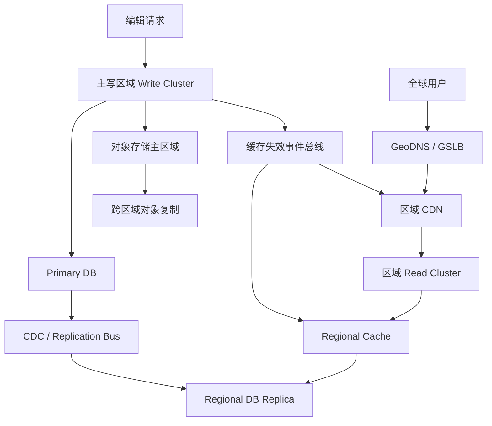

# 系统设计 - 案例 18：全球内容站多区域真题模拟

## 题目

设计一个全球内容站点，类似百科或全球文档平台，要求：

- 全球用户可低延迟访问
- 支持词条/文档编辑
- 图片和附件可访问
- 系统可用性高
- 某个区域故障后仍能继续服务

先不做：

- 复杂协同编辑
- 多主写冲突合并
- 个性化推荐

## 这题为什么常考

多区域系统题看起来“大”，但真正高分的人不会一上来就说“双活”。  
这题特别适合看出候选人是否真的理解：

- 低延迟和一致性的 trade-off
- RTO / RPO
- 单写多读 vs 双写多活
- 路由、切流、回切
- 容灾和可观测性

如果这题答得好，说明你不只是会设计单机房系统，而是知道跨区域后的问题会在哪里爆出来。

## 面试官视角：这题真正想考什么

这题通常想看：

1. 你会不会先问为什么需要多区域
2. 你知不知道 RTO/RPO 会直接决定方案
3. 你会不会对读多写少系统优先考虑 `单写多读`
4. 你能不能把切流、回切和监控演练讲出来

## 结构化思考过程（可在面试里直接说出来的版本）

### 第一步：先澄清范围

我会先问：

1. 用户是否全球分布？
2. 读写比例大概是多少？
3. 是否允许文档更新后几秒内不同区域短暂不一致？
4. 可用性目标和故障恢复目标是什么？
5. 是否有数据合规和驻留要求？

如果面试官不继续补充，我会主动收敛：

- 全球用户分布
- 读写比 `1000:1`
- 允许秒级复制延迟
- 目标可用性 `99.99%`
- 先不考虑特殊合规区域拆分

### 第二步：先定义架构目标

这题最重要的是先说出：

- 我为什么需要多区域
- 我的 RTO 和 RPO 是多少

我会假设：

- RTO `5 分钟`
- RPO `秒级，可接受极小窗口`

这会直接影响我不去默认做全球双向多主写。

### 第三步：定义核心对象

我会至少拆四类对象：

1. `article/document`
2. `article_version`
3. `media_object`
4. `cache_invalidation_event`

这一步特别重要，因为文本和图片/附件在复制和缓存上可能不是完全同一条链路。

### 第四步：搭高层架构

### 第五步：明确主链路

#### 读链路

1. 用户通过 GeoDNS 进入更近区域
2. 先查区域 CDN
3. 未命中则到区域读集群
4. 查区域缓存和区域副本数据库
5. 返回页面内容

#### 写链路

1. 编辑请求统一进入主写区域
2. 更新主数据库
3. 通过复制链路把数据同步到其他区域
4. 同步媒体对象到其他区域
5. 发布缓存失效事件

### 第六步：主动深挖两个关键点

#### 深挖点 A：为什么优先单写多读，而不是双写多活

对于全球内容站这类 `读多写少` 系统：

- 绝大多数压力在读
- 写频率远低于读
- 冲突编辑通常比全球低延迟写入更少见

所以更合理的方案通常是：

- 多区域承接读
- 写统一进主写区域
- 通过复制把内容扩散到各区域

这样做的好处是：

- 冲突少
- 架构简单
- 可用性和延迟都相对可控

#### 深挖点 B：图文不一致怎么办

这类题很容易被追问：

- 文字已经同步到从区域
- 图片对象还没复制完
- 用户看到页面里出现坏图怎么办

更成熟的做法通常是：

- 内容版本化
- 页面只引用已准备完成的媒体版本
- 或在从区域暂时回源主区域媒体
- 配合缓存失效和版本切换做原子发布感知

## 参考答案（面试里可直接说的一版）

如果让我设计一个全球内容站，我不会一上来直接说多活，而会先确认业务为什么需要多区域。  
对于这类系统，通常目标是：全球低延迟读取、区域级故障后的持续服务，以及可接受范围内的数据复制延迟。  
如果读写比在 1000:1 量级，我会优先考虑 `单写多读`，而不是同一份数据全球双向多主写。

高层上，我会让全球用户通过 GeoDNS 或 GSLB 进入最近区域，先读 CDN 和区域缓存，未命中再读区域副本数据库。  
而编辑请求统一进主写区域，由主写区域负责更新数据库和媒体对象，再通过 CDC/复制链路同步到其他区域，并通过缓存失效事件刷新各区域缓存。

如果继续深挖，我会重点讲两个点。  
第一，为什么内容站更适合单写多读，因为这类系统读远多于写，双写多活会把冲突、脑裂和运维复杂度带进来，但收益不一定值得。  
第二，图文同步问题怎么处理，因为文本和媒体复制常常不是同一时刻完成，所以我会用版本化或发布完成标记来保证页面只引用已准备好的媒体内容。

如果再往下扩展，我会补 RTO/RPO、故障切流与回切、复制延迟监控、区域健康探测和容灾演练。

## 面试官可能继续追问什么

### 追问 1：为什么不做全球双写

回答重点：

- 写冲突
- 脑裂
- 复制与合并复杂
- 对读多写少系统往往得不偿失

### 追问 2：用户刚编辑完，为什么在另一个区域还看不到

回答重点：

- 承认复制延迟存在
- 明确这是秒级最终一致
- 对编辑者自己可优先路由到主写区或提供读己之写保障

### 追问 3：区域故障时怎么切

回答重点：

- GeoDNS/GSLB 健康探测
- 切走坏区域读流量
- 如果主写区域故障，需要提升新主并控制写流量

### 追问 4：切回原区域怎么办

回答重点：

- 回切不是自动“按按钮”
- 需要确认数据追平、缓存预热、依赖就绪
- 回切通常应分批进行

### 追问 5：怎么证明你的容灾不是 PPT 容灾

回答重点：

- 有 runbook
- 有演练
- 有复制延迟和业务指标监控
- 有切流/回切验证

## 常见失分点

1. 一上来就说“双活”，却没先讲为什么需要多区域。
2. 不先讲 RTO/RPO。
3. 把内容系统和交易系统的数据语义混在一起。
4. 没讲切流，只讲平时架构。
5. 没讲回切、复制延迟和可观测性。

## 总结

全球内容站这题最重要的一句话是：

`多区域不是默认高分答案，目标和数据语义先于架构图。`

只要你围绕这句话展开：

- 先讲为什么需要多区域
- 再讲 RTO/RPO
- 再讲单写多读
- 最后补切流、回切和可观测性

这题就会非常有层次。

## 自测问题

1. 如果题目从“全球内容站”改成“全球电商交易系统”，你的写路径会怎么变化？
2. 如果图片复制比文本慢很多，你除了版本化还能做哪些兜底？
3. 如果某个区域健康检查时好时坏，你的切流策略应该更激进还是更保守？
4. 如果面试官问“你如何保证编辑者读己之写”，你会怎么设计？
