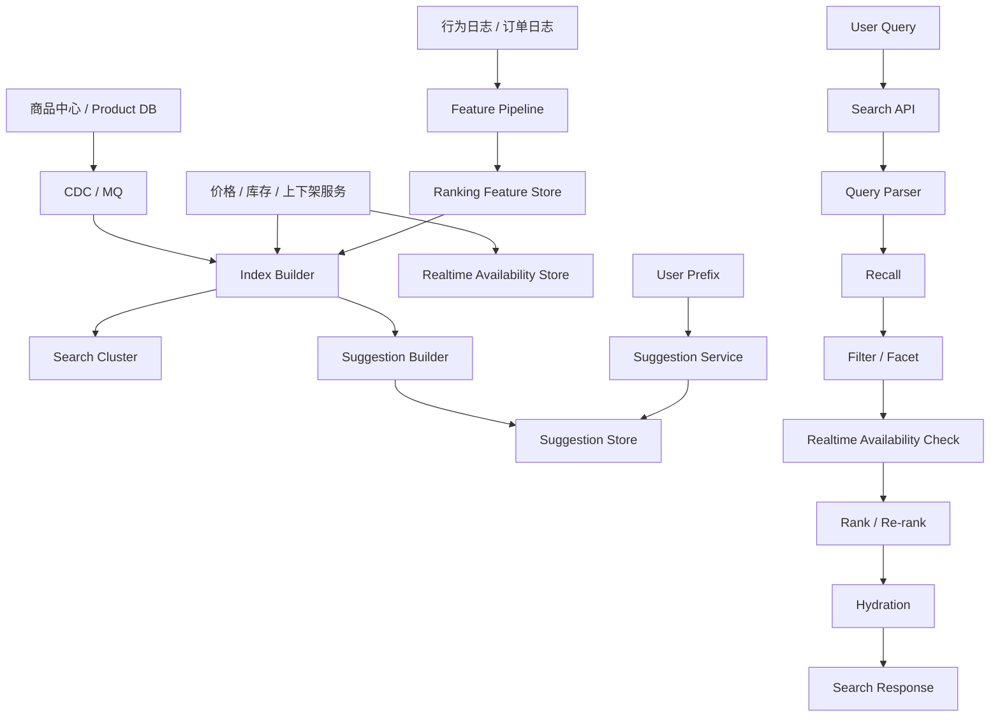

# 系统设计 - 案例 19：搜索系统真题模拟

## 题目

设计一个电商搜索系统，支持：

- 关键词搜索
- 类目、品牌、价格等筛选
- 排序
- 搜索结果分页
- 搜索建议

先不做：

- 复杂广告系统
- 多语言搜索
- 向量搜索和大模型问答

## 为什么这题值得深讲

搜索题很容易被答成：

- “上 Elasticsearch”

但真正的难点并不在会不会报组件名，  
而在你能不能把它讲成一个真实的“发现系统”。

这题实际上同时考：

- 你能不能把 `交易真相源` 和 `搜索派生视图` 分开
- 你会不会把 `写链路` 和 `读链路` 分开
- 你知不知道搜索不是一次查询，而是 `Query 解析 -> 召回 -> 过滤 -> 排序`
- 你能不能处理 `相关性`、`新鲜度`、`延迟` 三者的 trade-off
- 你会不会讲 `SPU / SKU`、搜索建议、热点 Query、索引重建这些真实问题

很多回答会停在：

- `MySQL + ES + MQ`

这不算错，但也不够好。  
成熟的回答，应该能讲清楚：

- 题目里哪些语义必须先收敛
- 哪些数据是真相源，哪些只是派生视图
- 为什么某些字段必须强新鲜，某些字段可以近实时
- 方案是怎么一步一步推出来的，而不是模板拼图

## 面试官真正想看什么

这题通常在看下面几件事：

1. 你会不会先判断“搜索不是数据库查询题”
2. 你能不能先定义结果页是按 `SPU` 还是按 `SKU` 展示
3. 你会不会把 `写链路`、`Query 解析`、`召回`、`过滤`、`排序` 拆开
4. 你能不能说明为什么 `价格/库存/上下架` 和 `标题/描述` 不是同一类新鲜度
5. 你会不会把搜索建议和主搜索当成两类不同系统
6. 你能不能说清索引为什么是派生视图，而不是真相源
7. 你会不会主动提热点 Query、缓存边界、索引重建和演进路径

## 一开始先别急着选搜索引擎，先收敛题目语义

我会先主动澄清下面这些问题：

1. 搜索对象是什么，是商品、店铺、内容还是文档？
2. 搜索结果页展示的是 `SPU` 还是 `SKU`？
3. 是否支持标题、品牌、类目、属性等多字段检索？
4. 是否需要返回品牌、类目、价格区间等筛选聚合？
5. 排序主要按文本相关性，还是要混入销量、CTR、CVR、上新时间？
6. 商品变更后，希望多久反映到搜索结果里？
7. 下架、缺货、价格变化的时效要求，是否比标题修改更严格？
8. 搜索建议是否要求前缀级实时响应？
9. 是否需要个性化，还是先按匿名通用排序回答？
10. 是否考虑全球多区域访问，还是先按单区域设计？

如果面试官不继续补充，我会主动把题目收敛成下面这个版本：

- 搜索对象是电商商品
- 结果页以 `SPU` 展示为主
- 交易和真实购买仍以 `SKU` 为准
- 支持标题、品牌、类目、属性搜索
- 支持品牌、类目、价格区间等筛选聚合
- 支持搜索建议
- 文本字段允许 `秒级到分钟级` 索引延迟
- 价格、库存、上下架要求 `秒级` 更快收敛
- 优先优化前几页体验，不把深分页当成主目标
- 暂不引入个性化、广告混排和向量搜索

这里有两个非常关键的产品选择。

### 选择 1：搜索展示以 `SPU` 为主，交易仍以 `SKU` 为准

为什么？

- 如果完全按 `SKU` 建文档，同一商品的不同颜色尺码会把结果页刷满
- 如果完全按 `SPU` 建文档，规格过滤和可售状态又会更难做
- 所以“展示单元”和“交易单元”是否一致，不是小细节，而是系统前提

如果题目没有特殊要求，我会默认：

- 搜索主文档按 `SPU`
- 文档中带上 `SKU` 的可售摘要，用于筛选和落地页补全

### 选择 2：下架和不可售优先于文本相关性

为什么？

- 用户搜到最相关商品，但点进去不能买，体验比“排序略不准”更糟
- 电商搜索最终还是服务交易
- 所以 `可见性`、`可售性`、`权限` 往往是强约束，相关性只是在约束内优化

换句话说：

- 排序分高低
- 过滤分生死

## 第一步：先判断这是一个什么类型的系统

我会先明确：

- 这是一个 `读远大于写` 的系统
- 但它不是简单点查，而是一个 `高 fan-out 的多阶段查询系统`
- 它的热点更多来自 `热门 Query`，不是单个商品 ID
- 它的写路径本质上是在维护一个 `派生索引视图`

这意味着：

1. 真正的主战场是查询链路，不是商品更新接口
2. 搜索索引的目标不是替代交易数据库，而是服务检索和排序
3. 查询延迟、字段新鲜度、排序效果不可能同时无限优化
4. 搜索系统和交易系统之间天然存在边界和延迟

## 第二步：先做一轮容量估算，不然 trade-off 没锚点

我会给一组面试中合理的假设：

- 商品 `SPU` 总量 `1 亿`
- 商品 `SKU` 总量 `3 亿`
- DAU `2000 万`
- 搜索请求峰值 `5 万 QPS`
- 搜索建议峰值 `10 万 QPS`
- 商品更新峰值 `3000 - 10000 QPS`
- 用户大多数只看前 `3 - 5` 页

### 索引数据规模

如果搜索主文档按 `SPU` 建：

- 文档数大约 `1 亿`

假设每个文档原始字段只有 `2 KB`，  
真正落到搜索引擎里还要加上：

- 倒排索引
- doc values
- 排序字段
- 聚合字段

综合下来每文档实际占用如果是 `5 - 8 KB`，那主索引主分片大概就是：

- `500 GB - 800 GB`

再加副本，很容易来到：

- `1 TB - 1.6 TB`

这说明：

- 搜索绝不是一个单机服务问题
- 分片、重建、灰度、冷热数据都得考虑

### 查询放大规模

搜索和普通 RPC 最大的不同，是一条查询通常会打到多个 shard。

所以外部看是：

- `5 万 QPS`

内部看到的可能是：

- 更高数量级的 shard-level 查询开销

这意味着：

- 搜索 API 不是唯一瓶颈
- 搜索集群本身的 CPU、内存、磁盘 IO 才是核心约束之一

### 延迟目标

我会给出一组比较合理的目标：

- 搜索接口 `P99 < 200 ms`
- 搜索建议 `P99 < 50 ms`
- 上下架状态在 `1 - 5 秒` 内收敛
- 价格和库存尽量做到 `秒级` 收敛
- 文本字段允许 `秒级到分钟级` 延迟
- 排序特征允许 `分钟级` 延迟

这个目标一旦定下来，后面很多设计就自然出来了：

- 不同字段必须分层处理
- 搜索建议不能完全塞进主搜索链路
- 不能把所有字段都押给“慢慢等索引刷新”

## 第三步：先定义不变量，而不是先调 BM25 参数

我会先定义下面这些不变量：

1. 商品中心或交易主库是真相源，搜索索引只是派生视图
2. 下架、封禁、区域不可售商品，不能长时间继续出现在可买结果里
3. 搜索结果允许近实时，但可售性正确性优先于排序漂亮程度
4. 价格和库存在搜索结果里可以有极短暂延迟，但下单和结算必须再走真相源校验
5. 搜索建议和主搜索不一定共享完全一样的数据结构和新鲜度
6. 深分页不要求和第一页一样强的一致性与性能保证
7. 总命中数和聚合数可以在大规模场景下做近似，但不可售结果不该错误曝光

这几条不变量背后的意思是：

- 搜索系统不是第二个交易系统
- 但它也不能对交易语义一无所知

## 第四步：不要直接给最终方案，先走一遍真实设计推演

这一步我不会直接甩最终架构图，  
而是像真的在设计系统一样，一步步推。

## 第一轮思考：最朴素的方案是什么

最直观的方案是：

- 商品都在 MySQL
- 用户输入关键词后做 `LIKE` 或关系库全文检索
- 再按销量、价格排序
- 顺手查品牌和类目聚合

这个方案有什么好处？

- 简单
- 功能闭环完整
- 小数据量、低并发场景下能用

但规模一上来，问题马上暴露：

1. 关系库不擅长大规模倒排检索和相关性排序
2. 多字段搜索 + 筛选 + 排序 + 分页成本很高
3. 同义词、拼写纠错、Query rewrite 很难做好
4. 搜索和交易会争抢同一套主库资源

所以第一轮方案可以是：

- 最小可用系统

但绝不是面试里应该停下来的位置。

## 第二轮思考：换成熟搜索引擎，但先别急着把主库整行搬进去

很多人这时候会说：

- “那我把商品表同步到 ES”

这比 MySQL `LIKE` 好很多，  
但仍然不够。

因为搜索文档通常不是商品主表的一行原样复制。  
真正的搜索文档会重新组织这些内容：

- 标题和副标题分词字段
- 品牌标准化值
- 类目路径
- 可聚合属性
- 用于排序的销量、CTR、CVR
- 可售状态摘要
- 价格区间

也就是说：

- 搜索文档是面向检索场景重建的数据模型
- 不是简单“同步一份数据”

## 第三轮思考：把交易真相源和搜索派生视图彻底拆开

再往下一步，我会把系统拆成两条主链路：

1. 商品更新 -> 构建搜索文档 -> 写入索引
2. 用户查询 -> Query 解析 -> 召回/过滤/排序 -> 返回结果

这一步非常重要，因为它决定了你是不是在“设计搜索系统”，而不是在“给数据库加一个旁路索引”。

我会强调：

- 商品中心负责真相源
- 搜索索引负责查询服务

这带来的直接好处是：

1. 可以接受搜索是 `near real-time`
2. 可以独立演进文档 schema
3. 可以做全量重建和灰度切换
4. 搜索故障不会直接拖垮交易主链路

## 第四轮思考：新鲜度不能一刀切，字段必须分层

这一步是搜索题最能拉开差距的地方之一。

我会把字段分成三类：

1. 文本和结构化检索字段
2. 强新鲜度字段
3. 排序特征字段

### 文本和结构化检索字段

比如：

- 标题
- 描述
- 品牌
- 类目
- 属性词

这类字段通常可以接受：

- `秒级到分钟级` 延迟

### 强新鲜度字段

比如：

- 上下架状态
- 区域可售状态
- 库存
- 价格

这些字段如果更新太慢，会直接导致：

- 搜到下架商品
- 缺货商品排在前面
- 价格不一致引发投诉

### 排序特征字段

比如：

- 销量
- CTR
- CVR
- 上新时间

这类字段通常允许：

- `分钟级` 延迟

因为它影响排序效果，但不直接决定“能不能卖”。

## 第五轮思考：别把搜索建议硬塞进主搜索集群

搜索建议看起来像“把用户前缀拿去搜一下”，  
但它和主搜索的目标并不一样。

主搜索要解决的是：

- 给定完整意图，返回结果集

搜索建议要解决的是：

- 用户意图还没输完时，尽快给出可能的 Query

所以搜索建议通常有几个特点：

- 延迟目标更严
- 热点更集中
- 数据结构更像前缀词典
- 不需要和主搜索共享完全一样的索引结构

到这里，一个比较成熟的系统轮廓就开始清晰了：

- 交易真相源单独存在
- 搜索文档独立建模
- 查询链路独立分层
- 强新鲜度字段单独保障
- 搜索建议单独成系统

## 第五步：搜索文档粒度怎么选

这一步非常关键。  
如果文档粒度选错，后面很多问题都会反复出现。

## 方案 A：以 `SKU` 为搜索文档

优点：

- 价格、库存、规格过滤天然精确
- 某个具体售卖规格的可售状态更好处理

缺点：

- 同一商品会在结果页大量重复
- 文档量更大
- 排序和聚合更容易失真

## 方案 B：以 `SPU` 为搜索文档

优点：

- 结果页更符合用户心智
- 去重天然
- 文档量更小

缺点：

- 规格维度筛选更难
- 需要额外带上可售摘要

## 方案 C：`SPU` 主文档 + `SKU` 可售摘要

做法：

- 搜索主文档按 `SPU`
- 文档中带上最低价、最高价、可售 SKU 数量、默认展示 SKU 等摘要信息

优点：

- 同时兼顾结果页体验和交易约束
- 不会像纯 `SKU` 模式那样把文档量拉太大

缺点：

- Builder 更复杂
- 某些复杂规格过滤仍要做额外处理

## 我在这个题里的选择

如果题目是通用电商搜索，我会优先选：

- `SPU` 作为搜索主文档
- `SKU` 信息作为可售摘要和落地补全数据

原因是：

1. 搜索结果页是给人看的，不是给数据库看的
2. 同商品多规格重复曝光通常弊大于利
3. 大多数商品搜索更适合围绕商品主实体排序

## 第六步：强新鲜度字段怎么做

这是搜索题里最值得展开的 trade-off 之一。

## 方案 A：所有字段都依赖搜索引擎的近实时更新

优点：

- 结构简单
- 查询时不用额外查别的系统

缺点：

- 高频库存和价格变化会拖累整体索引更新
- 一旦索引写入延迟抖动，下架和缺货就可能暴露错误结果

## 方案 B：查询时实时回查交易主库

优点：

- 新鲜度很好

缺点：

- 查询链路变重
- 会把交易系统拖进搜索热点流量
- 容易出现 N+1 和级联故障

## 方案 C：索引 + 实时可售层的混合方案

做法：

- 文本检索字段和大多数筛选字段进入搜索索引
- 价格、库存、上下架等强新鲜度字段进入快速更新通道
- 查询时在最终返回前，再用一层轻量的实时可售数据做校验或补全

优点：

- 查询链路不会过重
- 新鲜度能比纯索引方案更可靠
- 更符合真实电商场景

## 我在这个题里的选择

我会优先选：

- `索引 + 实时可售层混合`

也就是：

- 标题、描述、品牌、类目、属性进入搜索索引
- 价格、库存、上下架走快速更新或最终实时校验

## 第七步：把最终高层架构定下来

在前面几轮推演之后，一个比较成熟的系统会长这样：

这个架构里最关键的边界是：

- 商品中心是真相源
- 搜索集群是派生检索层
- 实时可售层负责强新鲜度校验
- 排序特征有独立的数据生产链路
- 搜索建议单独服务化

## 第八步：把 API 设计说清楚

### 搜索接口

`GET /v1/search`

常见请求参数：

- `q`
- `category_id`
- `brand_id`
- `price_min`
- `price_max`
- `sort`
- `page`
- `page_size`
- `cursor` 可选，用于深分页

常见返回字段：

- `items`
- `facets`
- `total_hits`
- `next_cursor`

### 搜索建议接口

`GET /v1/suggest?q=iph`

返回字段：

- `suggestions`

### 内部索引能力

系统内部通常还要具备：

- 全量重建
- 增量回放
- 双索引切换

这说明搜索系统不只是一个查询 API，  
还必须具备可维护和可重建能力。

## 第九步：把核心数据模型说深一点

### 商品真相源

`product_source`

关键字段：

- `spu_id`
- `sku_id`
- `title`
- `brand_id`
- `category_id`
- `attributes`
- `status`
- `price`
- `inventory`
- `version`

### 搜索主文档

`search_document`

关键字段：

- `spu_id`
- `title`
- `title_terms`
- `brand_id`
- `brand_name`
- `category_path`
- `searchable_attributes`
- `facet_attributes`
- `price_min`
- `price_max`
- `default_sku_id`
- `available_sku_count`
- `is_on_shelf`
- `sales_score`
- `ctr_score`
- `freshness_score`
- `doc_version`

### 实时可售层

`realtime_availability`

关键字段：

- `spu_id`
- `on_shelf`
- `blocked`
- `inventory_state`
- `price_min`
- `price_max`
- `availability_version`

### 排序特征

`ranking_feature`

关键字段：

- `spu_id`
- `ctr_7d`
- `cvr_30d`
- `sales_30d`
- `quality_score`
- `feature_version`

### 搜索建议词条

`suggestion_entry`

关键字段：

- `prefix`
- `suggestion`
- `source_type`
- `popularity_score`
- `updated_at`

这里最重要的一点是：

- 搜索文档不是商品库原表
- 而是经过规范化、扁平化、检索友好化之后的结果

## 第十步：真正把查询链路拆开来讲

搜索题如果想讲深，必须把查询主链路拆细。

## 查询链路的理想延迟预算

我会给一个大致预算：

- API 接入与鉴权：`5 - 10 ms`
- Query 解析：`5 - 15 ms`
- 召回与聚合：`50 - 100 ms`
- 实时可售校验：`5 - 20 ms`
- 排序 / 重排：`10 - 30 ms`
- 结果补全：`10 - 20 ms`

整体目标控制在：

- `P99 < 200 ms`

## Query 解析

查询链路第一步不是“去索引里搜”，而是先理解 Query。

我会做的事情通常包括：

- 分词
- 大小写归一
- 去停用词
- 拼写纠错
- 同义词扩展
- 品牌识别
- 类目识别
- 价格区间识别

为什么这一步重要？

- 因为用户输入通常不干净
- 同一个意图可能有多种表达
- Query 解析决定后面的召回空间和排序上限

## 召回

召回的目标不是直接给最终答案，  
而是：

- 在可控延迟内，尽量把相关候选找全

我会把召回分成几类来源：

1. 关键词倒排召回
2. 品牌 / 类目精确召回
3. 属性词召回
4. 同义词扩展召回
5. 运营兜底或热门召回

这一步我会主动强调：

- 召回追求的是覆盖率
- 排序才追求精细区分

## 过滤与 Facet

召回出来的候选集合不能直接返回，  
还要做过滤。

典型过滤条件包括：

- 上下架状态
- 区域可售状态
- 库存状态
- 品牌筛选
- 类目筛选
- 价格区间筛选
- 属性筛选

这里我会特别强调：

- 过滤不是排序的一部分
- 它首先是在执行“结果是否合法可展示”

电商搜索里，Facet 聚合本身也是体验的一部分。  
页面不仅要给结果，还要给：

- 品牌分布
- 类目分布
- 价格分布
- 属性分布

所以搜索题里不能只讲“返回结果列表”，  
还要主动提一句：

- Facet 也是主链路的一部分

## 排序

排序通常不会只做一次简单打分。  
更成熟的说法是：

- 先粗排
- 再精排
- 最后做业务规则调整

### 粗排

主要看：

- 关键词匹配度
- 字段权重
- phrase 命中
- 品牌 / 类目精确命中

### 精排

再把这些业务特征混进来：

- 销量
- CTR
- CVR
- 商品质量分
- 上新程度

### 规则调整

最后可能还会做：

- 去重
- 多样性控制
- 品牌或商家打散
- 极端低质商品降权

如果以后引入广告位或运营位，  
它们通常也应该插在这一层附近，而不是污染前面的召回逻辑。

## 结果补全与最终校验

排序完成后，我不会立刻把索引里的字段原样返回。  
更真实一点的做法是：

1. 取出 Top N 的 `spu_id`
2. 从轻量商品缓存或详情摘要服务补充展示字段
3. 对价格、库存、上下架做最后快速校验
4. 再返回结果

这样做的意义是：

- 保证最终曝光给用户的信息尽量新鲜
- 避免搜索索引里的陈旧值直接出现在页面上

## 分页怎么做

搜索分页不能只说：

- `offset + limit`

### 浅分页

如果用户只看前 `1 - 5` 页：

- `offset + limit` 通常还能接受

### 深分页

但如果翻得很深：

- 代价会迅速上升
- 很多引擎都要跳过大量结果

更适合的思路是：

- `search_after`
- cursor

所以我会主动说：

- 系统优先优化前几页
- 深分页不作为主目标

## 第十一步：把缓存设计讲成真正的设计，而不是一句“上 Query Cache”

搜索系统当然需要缓存，  
但“缓存什么”比“要不要缓存”更重要。

## 缓存到底缓存什么

我会优先考虑缓存下面几类东西：

- 热门 Query 的第一页结果
- 热门 Query 的 Facet 聚合结果
- 搜索建议结果
- 品牌、类目、同义词等词典
- 商品卡片摘要补全数据

注意：

- 我不会试图缓存所有 Query

因为搜索天然有很强的：

- 长尾性
- 组合爆炸

## 为什么不能缓存所有 Query

原因有几个：

1. Query 太长尾，命中率未必高
2. 过滤条件组合太多，key 空间爆炸
3. 排序特征和可售状态在变，缓存太重会放大陈旧问题
4. 个性化一旦加入，缓存复用率会进一步下降

所以更合理的做法通常是：

- 只对匿名且高频的热点 Query 做结果缓存

## 热门 Query 怎么办

搜索系统的热点不只是热门商品，  
更来自热门 Query。

常见做法包括：

- 热点 Query 检测
- Top Query 预热
- 结果缓存
- Suggest 缓存
- 独立读池或扩容策略

## 缓存失效怎么做

搜索缓存失效一般比短链缓存更难，  
因为它不是简单 key-value 映射。

比如某个商品下架了：

- 可能影响多个 Query
- 可能影响多个 Facet
- 可能影响多个排序结果

所以我更倾向于：

- 热点 Query 结果缓存使用较短 TTL
- 关键可售字段依靠最终实时校验兜底
- 不把“精确反向删所有缓存”做成系统主能力

## 第十二步：把搜索建议讲成单独系统

搜索建议虽然只有一个小接口，  
但它的系统形态和主搜索并不一样。

## 搜索建议的数据来源

我通常会把来源拆成几类：

1. 热门历史 Query
2. 商品标题里的高价值词
3. 品牌词
4. 类目词
5. 运营配置词

## 搜索建议的存储结构怎么选

### 方案 A：直接复用主搜索索引做前缀查询

优点：

- 架构简单

缺点：

- 前缀查询成本不一定低
- 热点更容易压到主搜索集群

### 方案 B：Trie / FST / 前缀词典

优点：

- 很适合前缀匹配
- 延迟低

缺点：

- 需要独立构建和更新逻辑

## 我在这个题里的选择

如果是标准电商搜索题，我会优先选：

- `前缀词典/FST + 热度分数`

因为这更符合搜索建议的访问模式。

## 第十三步：把写链路、增量更新和索引重建讲清楚

很多搜索题只讲查询，  
这是不够的。

因为搜索系统最核心的工程问题之一，恰恰是：

- 如何稳定地产生和维护索引

## 增量写链路

一个比较典型的增量写链路会是：

1. 商品主库或商品服务发生变更
2. 通过 CDC 或 MQ 捕获事件
3. `Index Builder` 拉取或拼装需要的商品数据
4. 生成新的 `search_document`
5. 批量写入搜索集群
6. 更新建议词条或热词统计

这里我会特别强调一句：

- Builder 不应该只是机械转发消息
- 它应该承担数据清洗、规范化、扁平化、特征拼装的职责

## 为什么不能每次都全量重建整份文档

如果库存、价格更新也每次都整份文档重建：

- 索引写入成本会很高
- refresh 压力会变大
- 高频字段会拖累低频字段

所以更成熟的做法是：

- 文本和结构字段走常规更新
- 强新鲜度字段尽量走部分更新或旁路快速通道

## 消息乱序和重复怎么办

搜索写链路通常绕不开：

- MQ 重复投递
- 事件乱序
- Builder 重试

我会用的通用思路是：

- 每个商品维护 `version`
- Builder 写索引时带上版本
- 新版本覆盖旧版本
- 旧事件到达时被丢弃或忽略

## 索引重建怎么办

搜索系统一定会有重建场景：

- 分词规则变更
- schema 变更
- 属性建模方式变更

我不会回答成：

- “那就直接重建”

更成熟的做法是：

1. 新建一套索引
2. 全量回放商品数据
3. 增量消息追平
4. 做灰度对比
5. 用 alias 切流
6. 保留回滚路径

## 第十四步：把异常路径与工程细节讲进去，不然答案还是不够真实

搜索系统真实难点，很多时候都在异常路径。

## 商品下架如何快速生效

如果题目是电商搜索，下架不及时会很致命。  
我会回答：

- 下架事件走快速通道
- 尽快更新实时可售层
- 同时触发搜索索引的部分更新
- 查询返回前再做一次轻量可售校验

这样即使索引正文还没完全刷新：

- 也不会长时间把下架商品暴露成可买结果

## 库存和价格瞬时变化怎么办

库存和价格可能在大促里频繁变化。  
如果完全依赖全文索引刷新：

- 延迟会不稳
- 刷新成本会升高

所以更合理的思路是：

- 搜索索引负责召回和粗筛
- 最终展示价格和可售状态尽量来自更快的数据层

## 搜索结果和详情页不一致怎么办

这是非常常见的真实问题。

比如：

- 搜索页价格还是旧的
- 详情页已经更新

我会回答：

- 详情页和下单页必须以真相源为准
- 搜索页尽量通过实时补全降低不一致窗口
- 系统接受极短暂不一致，但不能长期错误暴露

## 结果为空时怎么办

空结果不只是“返回空数组”。  
更真实一点的处理是：

- 拼写纠错建议
- 改写 Query 后重试
- 回退到类目或热门结果
- 返回相关搜索词

## 第十五步：如果题目升级到全球访问或大促场景，我怎么讲

如果面试官继续追问：

- “用户是全球分布的，或者大促流量会爆发，你怎么设计？”

我不会一上来就说：

- “全球多主写”

更现实的做法通常是：

### 写路径

- 商品真相源和索引构建仍然以主区域为主
- 增量消息通过流式链路复制到各区域
- 不轻易引入多主商品写入复杂度

### 读路径

- 各区域部署本地搜索集群或只读副本
- Query 就近接入
- Suggestion 也区域化部署

### 大促场景

我会重点强调：

- 实时可售层
- 热点 Query 缓存
- Suggest 服务扩容
- Top Query 预热

而不是把所有复杂度都堆到索引重建上。

## 第十六步：如果继续演进，这个系统会怎么长大

一个真实系统不会 Day 1 就是完全体。  
所以我会主动给出一个演进路径。

### 阶段 1：单搜索集群 + 基础 CDC

适合：

- 商品量和搜索量都还不算极端

### 阶段 2：Query 解析、Suggest、缓存分层

适合：

- 热门 Query 和建议服务开始成为热点

### 阶段 3：实时可售层 + 特征层 + 重建能力

适合：

- 价格、库存、上下架时效要求更高
- 排序开始深入业务

### 阶段 4：多区域读优化 + 多阶段排序

适合：

- 全球访问明显
- 大促和热点场景频繁

这种“按阶段长大”的回答，会比一上来堆满所有组件更像真实工程。

## 面试里我会怎么讲最终方案

如果让我设计一个电商搜索系统，我会先把题目语义收敛清楚：  
搜索展示主单元按 `SPU` 设计，交易仍以 `SKU` 为准；  
支持关键词搜索、品牌类目价格筛选、排序和搜索建议；  
标题和属性分词允许近实时更新，但价格、库存、上下架要更快收敛。  
这样一来，系统边界就很清晰了：商品中心是真相源，搜索索引只是面向检索场景构建的派生视图。

架构上我会把系统拆成写链路和读链路。  
写链路通过 `CDC / MQ -> Index Builder -> Search Cluster` 构建和维护搜索文档；  
读链路通过 `Query Parser -> Recall -> Filter / Facet -> Realtime Availability Check -> Rank -> Hydration` 返回结果。  
其中我不会把所有字段都用同一种更新策略处理：  
标题、描述、类目、属性这类检索字段进入索引；  
价格、库存、上下架这类强新鲜度字段走快速更新通道或实时可售层校验；  
搜索建议则拆成单独服务，因为它的延迟目标和热点模式都不同于主搜索。

如果继续深挖，我会重点讲四件事：  
第一，为什么搜索索引必须被看成派生视图；  
第二，为什么搜索要拆成 Query 解析、召回、过滤、排序多层；  
第三，为什么强新鲜度字段不能和文本字段用同一套更新节奏；  
第四，为什么真实系统必须具备热点 Query 治理、搜索建议拆分和双索引重建能力。

## 面试官如果继续追问，我会怎么答

### 追问 1：为什么搜索不是数据库查询题

回答重点：

- 需要倒排索引
- 需要相关性排序
- 需要 Query 解析和筛选聚合

### 追问 2：为什么结果页不直接按 `SKU` 展示

回答重点：

- 同商品多规格会造成重复曝光
- 结果页体验通常更接近商品发现而不是规格枚举
- 更合理的是 `SPU` 展示 + `SKU` 可售摘要

### 追问 3：为什么价格和库存不能完全依赖慢索引更新

回答重点：

- 这类字段和交易正确性强相关
- 索引刷新抖动会直接带来错误曝光
- 需要快速更新或查询时实时校验

### 追问 4：搜索建议为什么不直接复用主索引

回答重点：

- 访问模式不同
- 热点更集中
- 更强调前缀匹配和超低延迟

### 追问 5：如何处理深分页

回答重点：

- 主要优化前几页
- 深分页不用 `offset` 硬顶
- 用 `search_after` 或 cursor

### 追问 6：如果索引 schema 改了怎么办

回答重点：

- 新建索引
- 全量回放
- 增量追平
- 灰度对比
- alias 切流

## 常见失分点

1. 一上来只说“用 ES”，没有先收敛语义。
2. 不先定义结果页是按 `SPU` 还是按 `SKU`。
3. 只讲查询接口，不讲写链路和索引构建。
4. 不区分 `Query 解析`、`召回`、`过滤`、`排序`。
5. 不知道哪些字段要求强新鲜度。
6. 把搜索建议硬塞进主搜索服务。
7. 完全不提热点 Query、缓存边界和索引重建。
8. 把搜索索引讲成第二个真相源。

## 总结

搜索系统真正考的，不是：

- “你知不知道某个搜索引擎的名字”

而是：

`你能不能把交易数据重建成检索友好的派生视图，并在相关性、新鲜度、延迟、热点治理之间做出清晰而现实的分层设计。`

一个更成熟的回答，通常应该按这个顺序展开：

1. 先收敛产品语义，尤其是 `SPU/SKU` 展示单元和新鲜度要求
2. 再判断这是一个以派生索引为核心的查询系统
3. 再走一遍从朴素方案到成熟方案的推演
4. 最后讲 Query 解析、召回、过滤、排序、建议服务、重建与热点治理

## 自测问题

1. 如果题目从“电商商品搜索”换成“站内文档搜索”，你最先会改哪几层？
2. 如果要求“下架 1 秒内必须生效，但标题修改 5 分钟内生效即可”，你的写链路要怎么拆？
3. 如果某个热门 Query 在大促时打到 `20 万 QPS`，你优先缓存什么，优先扩哪一层？
4. 如果产品希望结果页展示更少重复规格，你会如何调整 `SPU` / `SKU` 文档建模？
5. 如果搜索结果里的价格和详情页价格偶发不一致，你会如何解释这个边界并缩小误差窗口？
