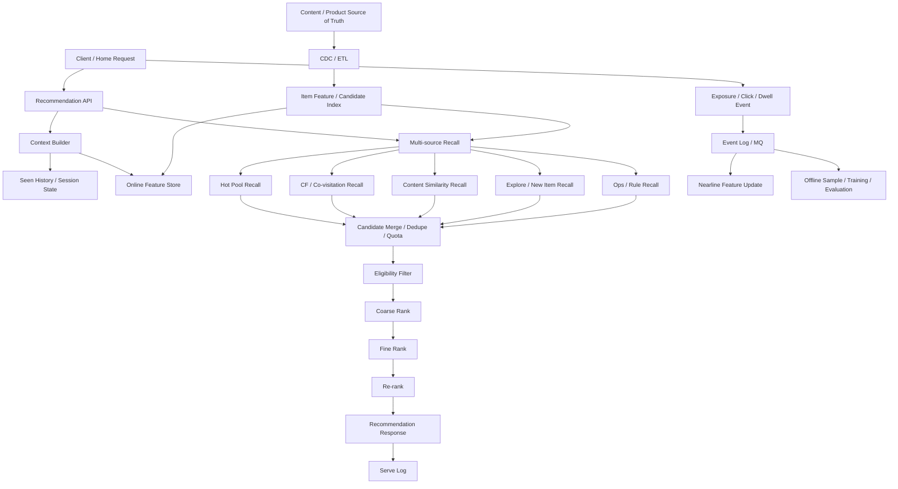

# 系统设计 - 案例 20：推荐系统真题模拟

## 题目

设计一个首页推荐系统，支持：

- 首页个性化推荐流
- 多路候选召回
- 基础粗排、精排、重排
- 曝光、点击、停留等反馈回流
- 基础冷启动、多样性和探索

先不做：

- 复杂实时在线训练
- 多臂赌博机和强化学习系统
- 广告竞价和商业化拍卖
- 超大模型直接生成整页推荐结果

## 为什么这题值得深讲

推荐系统最容易被答成：

- “用一个模型打分”
- “搞个协同过滤”
- “上特征平台和向量检索”

这些词本身不一定错。  
但如果回答只停在这里，通常说明你在讲“算法名词”，不是在讲“系统设计”。

推荐题真正难的地方在于：

- 它不是“求一个唯一正确答案”的系统
- 它是一个受强延迟预算约束的在线决策系统
- 它既有重计算，又有高 QPS
- 它既依赖离线训练，又依赖近线反馈
- 它不只追一个指标，还要平衡体验、业务目标和成本

也就是说，这题本质上是在考：

- 为什么不能从全库直接精排
- 为什么召回、粗排、精排、重排必须分层
- 为什么在线和离线必须拆开
- 为什么反馈日志会决定整个系统是否真的能闭环
- 为什么推荐结果不是“模型分数最高的 20 条”这么简单

很多候选人会在这题里直接说：

- `Feature Store`
- `召回 + 排序`
- `CTR 模型`

但真正成熟的答案应该能讲清楚：

- 题目里的产品语义要先怎么收敛
- 哪些是在线主路径，哪些必须异步
- 哪些数据是真相源，哪些只是派生视图
- 为什么有些一致性要强，有些只能最终一致
- 方案是如何一步步推出来的，而不是像组件清单一样平铺

## 面试官真正想看什么

这题通常在看下面几件事：

1. 你会不会先把题目收敛成一个具体场景，而不是泛泛谈“推荐”
2. 你能不能区分候选生成、排序决策和反馈闭环
3. 你会不会比较“全离线预计算”和“全实时计算”的 trade-off
4. 你能不能讲清 Feature Store 为什么存在，而不是把它当黑盒
5. 你会不会回答冷启动、多样性、探索和重复曝光这些真实问题
6. 你能不能把效果、延迟、成本、可解释性和治理一起讲
7. 你会不会处理降级、回退、日志丢失、模型故障这些工程细节

## 一开始先别急着选模型，先收敛题目语义

推荐系统里，很多坑不是模型坑，而是语义坑。  
如果题目语义没收敛，后面的所有设计都容易漂。

我会先主动澄清下面这些问题：

1. 推荐对象是什么，是短视频、文章、商品还是直播间？
2. 场景是什么，是首页首刷、下拉刷新，还是详情页相关推荐？
3. 目标是什么，主要看 CTR、停留时长、转化、GMV 还是留存？
4. 是否允许混入热门池、运营位、新内容探索位？
5. 是否要求强去重，用户刷新后能不能看到重复内容？
6. 用户一次行为变化，希望多久在推荐结果里体现出来？
7. 是否需要对作者、类目、商家、内容形态做多样性控制？
8. 是否要考虑内容安全、下架、库存、区域可见性等硬约束？
9. 用户是否全球分布，是否要做区域化推荐和区域化热榜？

如果面试官不继续补充，我会主动把题目收敛成下面这个版本：

- 推荐对象是首页内容流或商品流
- 每次请求返回 `20` 条
- 目标主要优化点击率和停留时长，同时兼顾长期体验
- 支持多路召回：个性化、热门、新内容、相似内容、运营池
- 支持基础去重、多样性和新内容探索
- 用户行为对结果是近实时生效，不追求毫秒级全局立刻收敛
- 不做复杂广告竞价，但要保留业务插槽和治理能力
- 下架、封禁、不可见内容不能继续返回

这里面有几个非常关键的产品选择。

### 选择 1：目标不是只优化 CTR

为什么？

- 只看 CTR，标题党和强刺激内容会被放大
- 页面内容会越来越单一
- 短期点击可能变高，但长期留存和满意度会变差

所以如果题目没说，我会主动把目标定义成：

- 点击和停留是强目标
- 多样性、新鲜度、体验稳定性是约束目标

这能体现你知道推荐不是一个单指标系统。

### 选择 2：推荐结果不是“全库最优”，而是“约束下的局部最优”

为什么？

- 候选集合不是全库
- 在线特征是不完整且有时延的
- 页面有去重、多样性、运营位和治理约束
- 系统必须优先满足延迟预算

也就是说：

- 推荐结果天然是一个受限优化问题

这句话在面试里非常有价值，因为它直接解释了：

- 为什么要分层
- 为什么不能全实时全局最优
- 为什么模型分数不能直接当最终页面顺序

### 选择 3：用户行为变化是近实时，不是瞬时强一致

为什么？

- 用户画像、热度计数、协同信号都依赖日志回流
- 行为采集、流处理、特征更新本身就有传输和计算延迟
- 强行追求毫秒级全局收敛，成本会非常高

所以更现实的语义通常是：

- 关键行为在秒级到分钟级逐步反映
- 推荐允许短时间内不是最优，但不能长期失真

## 第一步：先判断这是一个什么类型的系统

我会先明确：

- 这是一个高 QPS 的在线读路径系统
- 但和短链系统不同，它不是简单点查，而是请求时计算型系统
- 它有明显的离线、近线、在线三层协作
- 它的主矛盾不是写入吞吐，而是“有限延迟预算下的有效决策”

这意味着：

1. 真正要优化的是首页推荐请求链路
2. 不可能每次请求都对全库内容做复杂打分
3. 不能让在线服务临时去扫太多下游拿特征
4. 反馈日志必须完整，否则系统无法长期优化
5. 系统必须可降级，因为任何一个召回源或模型都可能失败

很多人会把这题答成：

- “设计一个模型服务”

但真正更准确的理解应该是：

- 推荐系统首先是一个在线分层决策系统
- 然后才是一个模型系统

## 第二步：先做一轮容量估算，不然很多 trade-off 没锚点

我会主动给一组面试里合理的假设：

- DAU `5000 万`
- 人均首页推荐请求 `8` 次 / 天
- 日推荐请求约 `4 亿`
- 峰值请求 `10 万 QPS`
- 每次返回 `20` 条
- 每次候选集合初始规模 `3000 - 10000`
- 在线推荐接口目标 `P99 < 150 ms`

再往下推几步。

### 内容规模

假设可推荐内容总量：

- `1 亿`

这马上说明：

- 绝不可能对 `1 亿` 内容做逐条在线精排

哪怕你只拿出其中 `1%`：

- 也还有 `100 万`

这仍然远远超出在线请求能承受的计算量。

### 候选评估规模

如果峰值 `10 万 QPS`，每次请求在粗排前有 `5000` 个候选，那么每秒要处理的候选规模大约是：

- `10 万 * 5000 = 5 亿 candidate eval / sec`

这还只是候选进入粗排前的量级。

这说明：

- 候选数量必须严格受控
- 召回源必须并行但不能无限扩张
- 粗排模型必须足够轻

### 曝光日志规模

如果每次返回 `20` 条，峰值 `10 万 QPS`：

- 每秒服务返回条目数是 `200 万`

这意味着：

- 只要你把“返回结果”直接等价成“曝光结果”，就会在统计上引入大量误差
- 反馈日志本身就是一个很大的系统，不是附属物

### 用户行为回流规模

假设：

- CTR `5%`
- 还有停留、点赞、收藏、转化等动作

那每秒除了大量曝光之外，还会有海量点击和互动事件回流。  
这些数据如果直接写主库或同步参与在线路径，系统很快就会失控。

### 延迟预算

我会给一组大致目标：

- 推荐接口 `P99 < 150 ms`
- 用户画像读取 `5 - 15 ms`
- 多路召回并行整体 `20 - 40 ms`
- 特征拼接 `10 - 25 ms`
- 粗排 `10 - 20 ms`
- 精排 `20 - 40 ms`
- 重排 `5 - 10 ms`
- 异步日志投递不阻塞主响应

这个预算一旦定下来，很多设计自然会推出：

- 不能请求时全量算
- 不能实时拉太多下游特征
- 必须分召回、粗排、精排、重排
- 必须有缓存和降级

## 第三步：先定义不变量，而不是先选技术

这是推荐题里非常容易被忽略，但最能拉开差距的一步。

我会先定义下面几个不变量：

1. 返回结果必须满足可见性和合规约束，不能把下架、封禁、不可见内容推荐出去
2. 推荐结果不是全库排序，而是候选集合上的分层决策结果
3. 服务返回结果不等于真实曝光，曝光必须通过客户端回执或渲染确认来定义
4. 点击、停留、转化等反馈日志必须可追溯、可回放，否则训练和评估会失真
5. 模型分数不是最终页面顺序，重排层仍然要处理去重、多样性和业务规则
6. 单个召回源、特征源或排序模型失败时，系统应降级而不是整体不可用
7. 用户行为对结果可以近实时生效，但不要求毫秒级强一致

这几条不变量背后的意思是：

- 推荐系统更像“受约束的连续决策”
- 结果质量和系统可用性同样重要
- 反馈链路和在线链路一样重要

很多候选人会一直谈：

- 模型 AUC
- 召回率
- 排序分数

但如果不先定义这些系统级不变量，答案通常还是不够工程化。

## 第四步：不要直接给最终方案，先走一遍真实设计推演

这一步是推荐题真正体现设计能力的地方。  
我不会一上来就把“多路召回 + Feature Store + 排序服务”直接端出来，而是像真的在设计系统一样，一步步推。

## 第一轮思考：最朴素的方案是什么

最直观的方案是：

- 请求到来时，拿用户画像
- 从全库内容里拉出候选
- 用一个模型对所有内容打分
- 直接选 Top 20 返回

这个方案的好处是：

- 概念上最直白
- 不需要分太多层
- 产品上也容易理解成“给每个内容算个分”

但规模一上去，问题会马上暴露：

1. 全库打分根本算不动
2. 在线特征拉取量会爆炸
3. 延迟预算完全不可能满足
4. 下架过滤、多样性、运营位都会搅在同一层里

所以这个方案可以帮助我们理解问题，但绝不是最终可落地方案。

## 第二轮思考：那我能不能全部离线预计算

很多人想到在线算不动之后，会立刻转向另一个极端：

- 离线为每个用户预先算好一个推荐列表
- 请求时直接把列表拿出来返回

这个思路有一定现实性，因为它确实能显著降低在线计算成本。

### 全离线预计算的优点

- 请求时延迟低
- 在线服务更轻
- 模型计算可以放在离线大集群里完成

### 但它的问题也很快会出来

#### 问题 1：新鲜度差

用户刚点了几个内容，或者刚跳过一个类目：

- 离线列表通常来不及立刻反映

内容本身也会变：

- 新内容上线
- 老内容下架
- 商品库存变化
- 风险内容被封禁

如果全靠离线列表，系统会显得“很钝”。

#### 问题 2：存储和维护成本高

假设：

- `5000 万` 用户
- 每个用户预生成 `500` 条候选

那就是：

- `250 亿` 条用户-内容关系

哪怕一条只存：

- `user_id`
- `item_id`
- `score`
- `rank`

真实存储和更新成本也很高。

#### 问题 3：上下文不灵活

推荐往往会受这些因素影响：

- 时间段
- 地域
- 设备网络
- 当前频道
- 最近几次交互

全离线列表很难把这些上下文都吃进去。

所以更成熟的结论不是：

- “预计算没用”

而是：

- 不能只靠预计算

## 第三轮思考：那就变成混合架构

推荐系统更现实的做法通常是：

- 部分信号离线算
- 部分信号近线更新
- 请求时只做有限范围内的在线决策

也就是说：

- 不是“全实时”
- 也不是“全离线”
- 而是“离线准备 + 近线更新 + 在线裁决”

这时候系统轮廓就开始清晰了：

1. 离线层负责大规模候选生成、模型训练和基础特征
2. 近线层负责热度、短期兴趣、行为汇总等快速变化信号
3. 在线层负责多路召回、分层排序和最终重排

这个结论非常关键。  
因为它直接决定了后面为什么会有：

- 多路召回
- Feature Store
- 反馈日志系统
- 重排层

## 第四轮思考：推荐为什么一定要先召回，再排序

如果不能全库打分，那就必须先把全库缩成可计算的候选集合。  
这就是召回层存在的根本原因。

召回层的目标不是：

- 绝对最准确

而是：

- 用很低的成本，尽量把“可能相关”的内容先找出来

也就是说：

- 召回更看重覆盖率和成本
- 排序更看重精度和最终效果

这个边界如果说不清，推荐题通常讲不深。

## 第五轮思考：为什么不能只做一层排序

哪怕召回之后只剩 `5000` 个候选，直接拿最复杂模型对 `5000` 个候选精排，仍然很贵。

所以工程上通常会继续分层：

1. 粗排
2. 精排
3. 重排

为什么？

### 粗排

目标：

- 以很低成本把 `5000` 缩到 `200 - 500`

特点：

- 模型轻
- 特征便宜
- 更强调吞吐和稳定性

### 精排

目标：

- 在更小的候选集合上做更准确打分

特点：

- 可以使用更多交叉特征
- 模型更复杂
- 但仍受在线预算约束

### 重排

目标：

- 不只是看分数，而是生成“可展示页面”

特点：

- 处理去重
- 处理多样性
- 处理新鲜度和探索
- 处理运营位和业务规则

这也是为什么我会主动说：

- 推荐系统首先是页面结果生成系统
- 模型分数只是中间信号，不是最终答案

## 第六轮思考：Feature Store 为什么会自然长出来

很多候选人知道有 `Feature Store`，但讲不清它为什么是推荐系统里非常自然的一层。

更真实的推导应该是：

- 在线决策需要用户特征
- 也需要内容特征
- 还需要一些交叉特征和统计特征

这些特征通常来自很多地方：

- 用户画像系统
- 行为日志系统
- 内容元数据系统
- 热度统计系统
- 风险和治理系统

如果每次请求都临时扫这些下游，会出现什么问题？

1. 延迟不可控
2. 依赖链路过长
3. 高峰期容易雪崩
4. 训练与在线使用的特征口径容易不一致

所以非常自然地就会长出一层：

- 在线特征服务 / Feature Store

它的价值不只是“存特征”，而是：

- 把高频特征服务化
- 把特征更新机制和版本管理清楚化
- 尽量缩小训练和在线服务之间的口径偏差

## 第七轮思考：反馈为什么不能只是“记个点击数”

推荐系统不是一次性算完就结束的系统。  
它本质上是一个闭环系统。

如果没有完整反馈链路，会发生什么？

- 你不知道用户真正看到了什么
- 你不知道哪个位置的内容被点击
- 你不知道停留时长和跳出情况
- 你没法做训练样本回放
- 你没法做效果评估和实验比较

所以反馈系统不能只做：

- `item_id click_count + 1`

而应该至少区分：

1. 服务返回了什么
2. 客户端真正曝光了什么
3. 用户真正做了什么动作

这是推荐题非常能体现深度的地方。

## 第五步：先把候选来源讲成真正的设计，而不是一句“多路召回”

如果我想把这题讲得更像真实系统，我会把多路召回拆开来讲。

## 常见候选来源有哪些

常见召回源包括：

- 热门池召回
- 协同过滤 / 共现召回
- 内容相似召回
- 关注关系 / 图召回
- 新内容探索召回
- 运营池 / 规则池

真正成熟的回答不只是报这些名字，而是要讲清：

- 每一路为什么存在
- 各自的优缺点是什么
- 最后为什么一定要混合

## 方案 A：只靠热门池

优点：

- 最简单
- 冷启动友好
- 延迟低
- 容易缓存

缺点：

- 个性化很弱
- 头部内容容易垄断
- 用户很快觉得“大家看到的都一样”

适合什么时候：

- 早期系统
- 新用户兜底
- 全局回退

## 方案 B：只靠协同过滤或行为相似

优点：

- 个性化更强
- 对成熟用户效果通常不错

缺点：

- 强依赖行为数据
- 新用户和新内容冷启动差
- 可能形成回音室效应

适合什么时候：

- 用户行为丰富
- 内容池相对稳定

## 方案 C：只靠内容相似召回

优点：

- 新内容更容易进入系统
- 内容理解能力强时效果可观
- 对 item cold start 更友好

缺点：

- 如果用户画像弱，个性化不够深
- 容易把“相似”误当成“想看”

适合什么时候：

- 内容特征比较强
- 新内容很多

## 方案 D：图召回或关注关系召回

优点：

- 社交信号强
- 可解释性好

缺点：

- 不适用于所有业务
- 覆盖不一定够

适合什么时候：

- 社交型产品
- 作者订阅型内容产品

## 方案 E：运营池和新内容探索池

优点：

- 可控
- 可插业务策略
- 给新内容留机会

缺点：

- 过多会损伤个性化体验
- 规则堆多了容易把系统变成“人工拼页面”

适合什么时候：

- 首页必须保留人工控制能力
- 需要新品扶持或活动位

## 我在这个题里的选择

如果题目只是一个常规首页推荐系统，我会明确选：

- 混合多路召回

因为单一路召回几乎一定不够。  
真实系统里通常会需要：

1. 个性化召回负责命中兴趣
2. 热门池负责冷启动和全局兜底
3. 内容相似和行为相似负责扩大覆盖
4. 新内容池负责探索
5. 运营池负责业务可控性

这时候我还会顺手补一句：

- 多路召回不是把所有候选简单拼起来就结束了

后面还要做：

- 去重
- 配额控制
- 每路候选上限
- 来源权重和熔断

## 每路候选要不要设 quota

这个点很实战。

如果不设 quota，会发生什么？

- 热门池可能吞掉大部分曝光
- 某一路召回一旦分数体系偏高，就会劫持全页
- 新内容和探索内容几乎没有机会进入后续排序

所以更现实的做法通常是：

- 每路召回先各自产出候选
- 合并前做上限控制
- 合并后再统一进入排序链路

也就是说：

- 排序前就已经在做结构化控制

## 第六步：把“全离线预计算”和“全实时计算”的 trade-off 讲透

推荐系统里一个很常见的深挖点就是：

- 到底应该离线预计算多少，在线实时算多少

## 方案 A：强依赖离线预生成用户推荐列表

优点：

- 请求时非常快
- 在线成本低

缺点：

- 对上下文不敏感
- 对新行为反应慢
- 列表失效和补位复杂

## 方案 B：几乎全实时召回和全实时排序

优点：

- 新鲜度高
- 更适合强上下文和强实时个性化

缺点：

- 成本高
- 延迟高
- 对下游依赖非常重

## 方案 C：混合式

做法：

- 离线预计算部分候选池和长期兴趣
- 近线维护热度、短期兴趣和轻量统计
- 请求时并行召回、轻量特征拼接、分层排序

优点：

- 新鲜度、成本、效果更平衡

缺点：

- 系统复杂度更高

如果这是面试题，我会非常明确地选：

- 混合式

因为推荐系统里最现实的答案几乎都是：

- 把重计算前置
- 把最终裁决留在请求时

## 第七步：把最终高层架构定下来

在前面几轮推演之后，一个比较成熟的推荐系统架构会长这样：

## 第八步：把 API 设计说清楚

如果我要讲得更工程化，我会把 API 也顺手定义一下。

### 首页推荐请求

`POST /v1/recommendations/home`

请求字段：

- `user_id` 或 `device_id`
- `session_id`
- `page_size`
- `cursor` 或 `refresh_token`
- `context`
  - `tab`
  - `network`
  - `device_type`
  - `region`
  - `client_ts`
- `client_seen_ids` 可选

返回字段：

- `request_id`
- `items`
  - `item_id`
  - `reason_code`
  - `tracking_token`
- `next_cursor`
- `model_version`
- `trace_id`

这里我会强调两个点：

1. `request_id` 很重要，因为后续所有曝光、点击、停留都要归因到这次推荐请求
2. 返回结果里最好带 `reason_code` 或来源信息，便于解释、调试和离线分析

### 曝光回执

`POST /v1/recommendations/exposure`

请求字段：

- `request_id`
- `session_id`
- `exposed_items`
  - `item_id`
  - `position`
  - `exposed_ts`

为什么要单独做这个接口？

因为：

- 服务返回了 20 条，不代表客户端真的渲染了 20 条
- 没有曝光回执，训练样本和效果评估都容易偏

### 行为反馈

`POST /v1/recommendations/action`

请求字段：

- `request_id`
- `item_id`
- `action_type`
  - `click`
  - `like`
  - `collect`
  - `share`
  - `purchase`
- `action_ts`
- `position`

### 调试和回放接口

`GET /v1/recommendations/requests/{request_id}`

这个接口不一定面向终端用户，但在工程上非常有价值，因为它意味着：

- 推荐系统必须支持线上问题回放
- 不然你很难解释“为什么用户看到了这 20 条”

## 第九步：把核心数据模型说深一点

### 用户画像快照

`user_profile_snapshot`

关键字段：

- `user_id`
- `long_term_interest`
- `short_term_interest`
- `demographic_tags`
- `region`
- `embedding`
- `updated_at`

这里我会强调：

- 长期兴趣和短期兴趣最好分开

因为：

- 长期兴趣更稳定
- 短期兴趣更容易被最近行为快速拉动

### 内容主表

`item_catalog`

关键字段：

- `item_id`
- `author_id`
- `status`
- `publish_at`
- `category`
- `quality_score`
- `safety_flags`
- `region_scope`

这里的重点不是把所有内容字段都塞进推荐服务，而是：

- 把推荐判断必需的可见性和治理字段明确出来

### 候选索引 / 召回索引

`candidate_index`

可能包括：

- 热门池索引
- 协同召回索引
- 相似内容索引
- 新内容池

这个对象很关键，因为它提醒你：

- 召回用的数据结构和在线 API 查询用的数据结构不一定相同

### 在线特征表

`online_feature_store`

关键字段：

- `entity_type`
- `entity_id`
- `feature_name`
- `feature_value`
- `feature_ts`
- `version`

### 推荐请求日志

`recommend_request_log`

关键字段：

- `request_id`
- `user_id`
- `session_id`
- `context`
- `candidate_set_summary`
- `ranked_items`
- `model_version`
- `served_at`

这个日志不是可有可无。  
它直接决定：

- 你是否能回放某次推荐
- 是否能做训练样本归因
- 是否能分析哪一路召回出了问题

### 行为反馈事件

`feedback_event`

关键字段：

- `event_id`
- `request_id`
- `item_id`
- `event_type`
- `position`
- `client_ts`
- `server_ts`
- `user_id`
- `device_id`

这里我会顺手强调两个点：

1. `request_id + item_id + event_type` 是非常重要的归因键
2. `position` 也很重要，因为位置偏差会直接影响训练和评估

## 第十步：把首页推荐主链路拆细来讲

推荐题如果想讲深，必须把在线主链路讲细。

## 推荐主链路的理想延迟预算

我会给一个大概预算：

- 接入层和鉴权：`2 - 5 ms`
- 上下文构建：`5 - 10 ms`
- 多路召回并行：`20 - 40 ms`
- 候选合并与资格过滤：`5 - 10 ms`
- 粗排：`10 - 20 ms`
- 精排：`20 - 40 ms`
- 重排：`5 - 10 ms`
- 返回与异步日志：不阻塞主响应

这能说明：

- 真正贵的是召回、特征和排序
- 任何一步都不能无限长
- 推荐系统必须天然支持降级

## 在线请求流程

1. 请求先到推荐 API
2. 构建用户上下文：
   - `user_id / device_id`
   - `session_id`
   - 当前 tab
   - region
   - 设备和网络环境
3. 读取最近已看历史或 session 去重状态
4. 并行触发多路召回
5. 合并候选并去重
6. 做资格过滤：
   - 下架
   - 不可见
   - 风险内容
   - 区域限制
   - 库存或业务约束
7. 拉取在线特征
8. 先做粗排，把候选压缩到更小规模
9. 再做精排
10. 最后做重排：
    - 多样性
    - 作者去重
    - 新鲜度
    - 运营位
    - 探索位
11. 返回结果
12. 异步写 serve log

这里我会明确强调：

- 返回主链路只负责“生成候选页面”
- 曝光和点击是后续异步反馈系统处理

## 为什么“服务返回”不等于“真实曝光”

这是推荐系统里非常适合体现深度的一个点。

如果服务返回 `20` 条：

- 用户可能只看到前 `5` 条就退出
- 客户端可能网络慢，没有真正渲染完
- 页面可能首屏和非首屏曝光时点不同

所以如果你把服务返回直接当曝光：

- 训练数据会偏
- 评估会偏
- 位置效果会偏

更成熟的设计应该区分：

1. served：服务返回了什么
2. exposed：客户端真正展示了什么
3. action：用户真正做了什么

## 第十一步：把排序系统讲成分层系统，而不是“一个大模型”

推荐系统如果想讲深，排序层必须拆开说。

## 粗排怎么理解

粗排的本质是：

- 在保证高吞吐和稳定性的前提下，快速筛掉明显不够优的候选

它通常会使用：

- 更轻的特征
- 更便宜的模型
- 更小的延迟预算

粗排不是越准越好。  
它的核心 trade-off 是：

- 用可接受的精度损失，换整体系统的可运行性

## 精排怎么理解

精排面对的是更小的候选集合。  
在这里我才会用：

- 更丰富的交叉特征
- 更复杂的模型
- 更细的个性化信号

但我会主动补一句：

- 即使是精排，也仍然是在线系统的一部分

所以：

- 不可能无限加特征
- 不可能无限加模型层数
- 不可能每个请求都做非常重的推理

## 重排为什么单独存在

很多候选人知道粗排和精排，但会漏掉重排。  
这通常会让答案显得不够成熟。

真实系统里，光按模型分数排，会出现这些问题：

- 连续多条同作者
- 连续多条同类目
- 新内容完全没机会
- 运营活动位插不进去
- 风险和体验规则难以表达

所以重排层天然要处理：

- 去重
- 多样性
- 新鲜度
- 探索配额
- 业务规则

这里主动说一句很有用：

- 模型分数是强信号，但不是最终页面结果

## 第十二步：把去重、多样性和探索讲进去，不然答案还是不够真实

推荐系统如果只讲“越高分越靠前”，很容易显得像实验室答案，不像真实产品答案。

## 为什么必须做去重

常见重复包括：

- 同一内容重复出现
- 同一作者连续刷屏
- 同一商品不同变体在一页里扎堆
- 用户刚看过的内容很快又被推回

所以去重至少要分：

1. 单页去重
2. 短 session 去重
3. 业务级去重，如作者或商家去重

### 单页去重

最简单，也最必要。

### Session 去重

更真实。  
用户连续刷新首页时，如果总是刷出刚才看过的内容，体验会很差。

这就意味着系统往往要维护：

- 近期已看集合
- 或短期布隆过滤 / seen history store

### 作者 / 类目去重

这不是严格“去重”，更像配额控制。  
例如：

- 连续两条以上同作者内容时降权
- 某个类目在首页占比不超过一定阈值

## 为什么必须做多样性

如果只按分数排，很容易形成：

- 一页里全是同类型内容
- 短期兴趣无限放大
- 用户越刷越窄

所以更成熟的系统通常会把这些约束交给重排层：

- 作者多样性
- 类目多样性
- 内容形态多样性
- 新旧内容比例

## 探索应该插在哪一层

这是面试里很常见的追问。

我通常会说：

- 探索更适合以“候选来源 + 重排配额”的方式进入系统

为什么？

- 如果完全在精排模型里做，控制感不强
- 如果完全在重排里硬插，可能脱离用户兴趣太远

更现实的做法是：

1. 先有专门的新内容或探索召回源
2. 在重排层给它一个可控配额

这样既有系统性，也有业务可控性。

## 第十三步：把冷启动讲成多个问题，而不是一句“上热门池”

推荐系统的冷启动至少要分三类：

1. 用户冷启动
2. 内容冷启动
3. 场景冷启动

## 用户冷启动

新用户没有历史行为时，系统拿什么做个性化？

常见做法：

- 热门池兜底
- onboarding 选择兴趣类目
- 注册信息或弱画像
- 地域和时间段热门
- 少量探索

这里我会强调：

- 新用户推荐不是“没有个性化”，而是“弱个性化”

## 内容冷启动

新内容没有点击和转化数据时，系统怎么给它机会？

常见做法：

- 使用内容特征做相似召回
- 给新内容单独探索池
- 用质量模型和安全模型先过滤掉明显低质内容
- 给新作者有限试流量

这时我会主动补一句：

- 新内容不能全靠“冷启动兜底逻辑”硬插
- 最好让它在召回和重排两侧都有进入机会

## 场景冷启动

例如：

- 新开频道
- 新地区
- 新业务 tab

这时候很多行为信号不完整，更需要：

- 规则池
- 热门池
- 可解释的业务策略

## 第十四步：把 Feature Store 讲成真正的系统分层

很多人会把 Feature Store 说成：

- “一个特征数据库”

这其实不够准确。

## 它为什么自然会长出来

在线推荐用到的特征通常包括：

- 用户长期兴趣
- 用户近期行为统计
- 内容热度
- 内容质量分
- 内容 embedding
- 用户 embedding
- 一些交叉特征

这些特征来自很多系统。  
如果不做统一特征层，会出现：

1. 每个推荐请求依赖一堆下游服务
2. 延迟难控
3. 不同模型口径不一致
4. 灰度和版本管理困难

所以更现实的设计通常是：

- 高频特征服务化
- 冷热特征分层
- 特征版本化

## 只靠实时查下游有什么问题

优点：

- 数据看起来新鲜

缺点：

- 延迟高
- 可用性差
- 依赖扇出大

## 只靠离线特征又有什么问题

优点：

- 成本低
- 系统简单

缺点：

- 新鲜度差
- 近实时兴趣变化反应慢

## 更现实的做法

- 长期稳定特征离线生成
- 热度和短期兴趣近线更新
- 在线只拉少量必须的实时上下文

这也是为什么我会把特征分成三层理解：

1. 离线批特征
2. 近线流式特征
3. 在线上下文特征

## 第十五步：把缓存讲成设计，而不是一句“缓存推荐结果”

推荐系统当然也会用缓存，但它的缓存策略和短链、商品详情不完全一样。

## 推荐系统最值得缓存什么

更值得缓存的通常是：

- 热门池候选
- 内容基础特征
- 热门内容 embedding
- 用户短期 seen history
- 模型和特征字典

而不是长时间缓存：

- 每个用户最终推荐结果

为什么？

- 最终结果对上下文敏感
- 去重状态会变化
- 新鲜度要求高
- 用户一旦互动，结果就可能需要调整

## 要不要缓存最终推荐结果

不是绝对不能，而是要看用途。

### 场景 A：短 TTL 结果缓存

适合：

- 用户重复请求同一页
- 网络重试
- 下拉分页 continuation

优点：

- 降低重复计算
- 保持翻页稳定

缺点：

- 结果可能变旧

### 场景 B：长 TTL 结果缓存

通常不太划算。

原因：

- 个性化收益会迅速衰减
- 去重和实时反馈很快让结果失效

所以更稳的做法是：

- 缓候选和特征为主
- 对最终结果只做短 TTL 或特定场景缓存

## 第十六步：把反馈系统讲成单独系统

我会明确说：

- 推荐系统不是“返回 20 条”就结束了
- 真正决定系统能不能持续变好的，是反馈闭环

## 反馈系统怎么拆

### 第一层：Serve Log

记录：

- 某次请求返回了哪些内容
- 排名位置是什么
- 使用了哪个模型版本
- 哪些召回源参与了

这层的价值是：

- 回放
- 调试
- 训练归因

### 第二层：Exposure Log

记录：

- 客户端真正展示了哪些内容
- 展示位置和展示时间是什么

这层的价值是：

- 建立更准确的曝光样本
- 避免把未展示内容当负样本

### 第三层：Action Log

记录：

- 点击
- 停留
- 点赞
- 收藏
- 转化

这层的价值是：

- 训练目标
- 效果评估
- 用户短期兴趣更新

## 反馈日志为什么必须可回放

因为推荐系统的很多动作都依赖历史事实：

- 模型训练
- A/B 实验对比
- 样本修正
- 线上事故复盘

如果日志不可回放，会发生什么？

- 你不知道一次推荐为什么效果异常
- 你没法重建训练样本
- 你无法稳定评估模型升级前后的差异

所以我会明确把反馈日志视为：

- 推荐系统的关键资产

## 近线更新和离线训练要分开

反馈回流后，我会把用途拆成两条：

### 近线更新

负责：

- 热度计数
- 短期兴趣
- 热门池更新
- seen history 更新

特点：

- 更快
- 更偏实时服务

### 离线训练

负责：

- 样本构建
- 模型训练
- 特征重算
- 效果分析

特点：

- 吞吐大
- 更偏批处理

这个拆分很重要。  
因为如果你把所有反馈都理解成“实时更新模型”，答案通常会显得不够落地。

## 第十七步：异常路径和降级怎么设计

推荐系统不是只有“效果好不好”的问题。  
它也是一个线上高 QPS 系统，所以必须讲异常路径。

## 如果某一路召回失败怎么办

推荐系统不应该因为一路召回失败就整体不可用。  
更成熟的策略是：

- 单路召回超时则降级
- 使用剩余召回源继续出结果
- 必要时提升热门池占比兜底

这说明：

- 召回层最好天然支持部分失败

## 如果 Feature Store 抖动怎么办

常见做法：

- 使用上一版本缓存特征
- 缺失特征回退默认值
- 切轻量模型

这时我会顺手强调：

- 推荐系统的可用性通常比“这一次绝对最优排序”更重要

## 如果精排模型超时怎么办

常见策略：

- 直接用粗排结果进入重排
- 切到轻量模型
- 缩小精排候选规模

这个降级路径很重要，因为它能体现你知道：

- 推荐系统是线上 API，不是离线实验

## 如果反馈日志积压怎么办

这会影响：

- 近线热度
- 短期兴趣
- 训练样本新鲜度

但通常不应该直接拖垮首页推荐主链路。  
因为反馈系统和推荐主链路应该是解耦的。

## 第十八步：治理和风控也要讲进去，不然答案还是不够真实

推荐系统不只是在“找用户喜欢的内容”。  
它同样要处理：

- 违规内容
- 低质量内容
- 刷量内容
- 风险账号

所以我会主动补下面几类治理能力。

## 内容资格过滤

在进入排序前就应该过滤：

- 下架
- 封禁
- 风险内容
- 区域不可见内容
- 库存不足商品

这意味着：

- 资格过滤是在线主链路的一部分，不是后台治理细节

## 防刷和反作弊

推荐系统容易被刷的地方包括：

- 刷点击
- 刷停留
- 伪造互动
- 批量账号抬内容

所以反馈链路里通常还需要：

- 去重
- 风险打标
- 可疑事件降权

这里不要把所有信任都给原始点击事件。

## 质量和体验约束

真实系统通常还会有：

- 标题党识别
- 低质内容打压
- 重复搬运识别
- 作者频控

这说明：

- 推荐不是“CTR 最高即最好”

## 第十九步：如果题目升级到全球用户访问，我怎么讲

如果面试官追问：

- “用户全球分布，怎么做？”

我不会一上来就说：

- “所有地区共享一套全局实时特征和全局模型服务”

更现实的做法通常是：

### 在线服务区域化

- 请求尽量在本地或近区域完成
- 区域热门池本地维护
- 区域内容合规和可见性本地生效

### 画像和特征最终一致复制

- 长期兴趣和批特征可以跨区域同步
- 短期兴趣和实时热度可以优先本地更新

### 训练可以更集中

- 原始日志汇总到中心训练平台
- 模型产物再分发到各区域服务

这体现的是一个很重要的思想：

- 推荐系统可以区域化服务，但不一定要上来就做全局强一致

## 第二十步：如果继续演进，这个系统会怎么长大

一个真实推荐系统不会从 Day 1 就是完全体。  
所以我会主动给出一个演进路径。

## 阶段 1：热门池 + 规则 + 基础画像

适合：

- 冷启动产品
- 数据量不大
- 先跑通首页推荐

特点：

- 规则多
- 个性化弱
- 但工程可落地

## 阶段 2：多路召回 + 粗排 + 基础反馈闭环

适合：

- 内容和用户规模开始增长
- 需要更强个性化

特点：

- 系统开始分层
- 反馈开始真正进入优化循环

## 阶段 3：Feature Store + 精排 + 近线更新

适合：

- 请求量更大
- 模型和特征复杂度提升
- 对新鲜度要求更高

特点：

- 工程化程度显著提升
- 训练和在线服务协作更成熟

## 阶段 4：多目标优化 + 探索体系 + 实验平台

适合：

- 大规模成熟推荐系统

特点：

- 不再只追单一指标
- 需要更完整的实验和治理体系

这种“按阶段演进”的回答，通常比一上来堆满所有高级名词更像真实工程。

## 面试里我会怎么讲最终方案

如果让我设计一个首页推荐系统，我会先把题目语义收敛清楚：推荐对象是首页内容流或商品流，每次返回 `20` 条，目标主要优化点击和停留，同时兼顾多样性、新鲜度和长期体验；系统支持个性化召回、热门池、新内容探索和运营位，用户行为对推荐结果是近实时生效，但不追求毫秒级强一致。

从系统类型看，这不是一个“单模型打分题”，而是一个受强在线延迟预算约束的分层决策系统。  
我不会对全库做精排，而是先做多路召回，把候选缩到几千条，再经过粗排、精排和重排逐层收缩。  
召回负责覆盖和低成本，粗排负责快速压缩候选，精排负责更准确的个性化排序，重排负责作者去重、多样性、新鲜度、探索位和运营规则。

在线主链路上，我会让请求先构建上下文和近期已看状态，再并行触发多路召回，合并候选后先做资格过滤，然后从在线特征层拉取高频特征进入粗排和精排，最后经重排生成最终页面。  
我会把高频在线特征沉到 Feature Store，把热度和短期兴趣放到近线更新链路，把模型训练和样本构建放到离线链路。  
反馈上，我会显式区分 serve log、exposure log 和 action log，因为服务返回不等于真实曝光；只有反馈日志完整且可回放，推荐系统才能真正闭环。

如果继续深挖，我会重点讲四件事：  
第一，为什么系统一定是“离线准备 + 近线更新 + 在线裁决”的混合架构；  
第二，为什么召回、排序和重排必须分层；  
第三，为什么 Feature Store 和反馈日志系统不是附属组件，而是核心基础设施；  
第四，为什么推荐目标不能只盯 CTR，而要把多样性、探索、治理和长期体验一起纳入设计。

## 面试官如果继续追问，我会怎么答

### 追问 1：为什么不能直接对全库做精排

回答重点：

- 内容规模太大
- 在线延迟预算不允许
- 特征拉取和模型计算成本都扛不住

### 追问 2：为什么不能只靠离线预生成用户推荐列表

回答重点：

- 新鲜度差
- 上下文不灵活
- 用户短期行为变化难及时反映
- 列表维护成本高

### 追问 3：为什么推荐系统一定要有重排

回答重点：

- 模型分数不能直接处理作者去重和多样性
- 新内容探索和运营位也需要重排层表达
- 最终页面是受约束的结果，不是单纯排序分数结果

### 追问 4：为什么 Feature Store 要独立

回答重点：

- 在线特征来源多
- 不能每次请求都扫很多下游
- 需要统一口径、缓存和版本管理

### 追问 5：为什么服务返回不能直接当曝光

回答重点：

- 用户不一定真的看到全部返回内容
- 客户端渲染和滚动位置会影响真实曝光
- 不区分的话训练和评估会偏

### 追问 6：如果用户冷启动怎么办

回答重点：

- 热门池兜底
- onboarding 兴趣
- 地域和时间段热门
- 少量探索

### 追问 7：如果新内容一直没有曝光怎么办

回答重点：

- 新内容探索召回
- 重排配额
- 质量模型先过滤明显低质内容

### 追问 8：如果精排模型超时怎么办

回答重点：

- 直接降级到粗排结果
- 切轻量模型
- 缩小精排候选集

## 常见失分点

1. 一上来就说“用某个模型排序”，没有收敛题目语义。
2. 不比较“全离线预计算”和“请求时实时计算”的 trade-off。
3. 只会说召回和排序，不讲重排。
4. 不区分服务返回、真实曝光和用户行为。
5. 把 Feature Store 当黑盒名词，不讲它为什么存在。
6. 完全不提冷启动、多样性、探索和去重。
7. 不讲资格过滤、内容治理和可见性约束。
8. 不讲异常路径和降级，把推荐系统说成一条永远理想运行的链路。

## 总结

推荐系统真正考的，不是“你知道几个模型名词”，而是：

`你能不能围绕一个受强延迟预算约束的在线页面生成问题，把候选、特征、排序、重排、反馈闭环和治理边界设计清楚。`

一个更成熟的回答，通常应该按这个顺序展开：

1. 先收敛产品语义和目标函数
2. 再判断它是一个离线、近线、在线协作的分层决策系统
3. 再走一遍从“全库打分”到“混合架构”的设计推演
4. 最后讲召回、排序、重排、Feature Store、反馈闭环和异常降级

## 自测问题

1. 如果产品要求“用户刚点完一个类目，下一次刷新必须明显变化”，你会优先改近线特征、召回，还是重排？
2. 如果线上延迟预算从 `150 ms` 压到 `60 ms`，你会优先削哪一层复杂度？
3. 如果业务要求“给新作者更多稳定曝光”，你会把策略放在召回、重排，还是两者都放？
4. 如果反馈日志丢了 `30` 分钟，你最担心的是近线效果退化、训练样本污染，还是实验评估失真？为什么？
