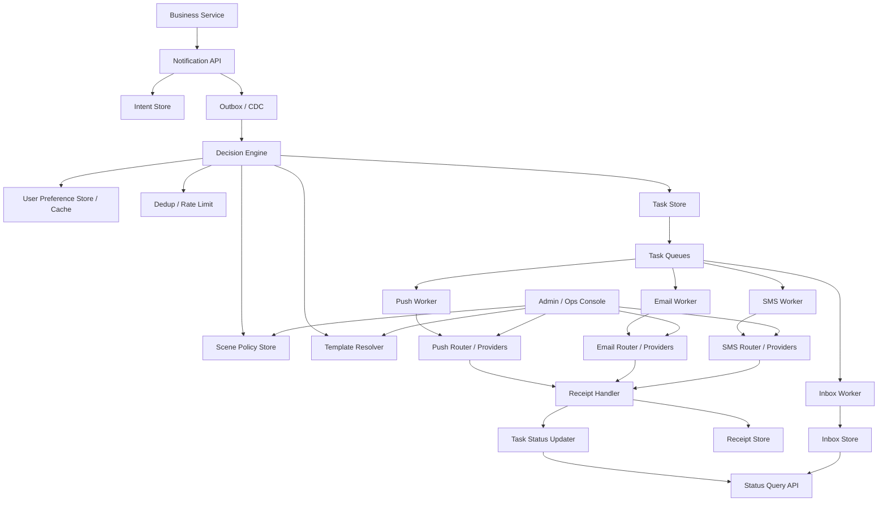

# 系统设计 - 案例 21：消息通知系统真题模拟

## 题目

设计一个统一消息通知平台，支持：

- 站内信
- Push 推送
- 邮件
- 短信
- 用户通知偏好配置
- 模板管理
- 重试与失败告警

先不做：

- 实时聊天
- 复杂营销自动化工作流
- 多租户计费结算

## 为什么这题值得深讲

通知系统最容易被答成：

- 业务方发个 MQ
- worker 调几个供应商
- 失败了重试一下

这套回答不能说错。  
但如果停在这里，说明你只看到了“发出去”，还没看到“平台”。

真正的通知平台，至少同时在处理下面几件事：

- 业务事件如何被抽象成稳定的通知意图
- 用户到底该不该被打扰
- 应该发哪些渠道，先发谁，失败后怎么兜底
- 模板、变量、多语言和审计怎么统一
- 外部供应商成功返回，到底算不算真正送达
- 为什么这类系统天然做不到严格 `exactly-once`
- 为什么站内信不只是“又一个渠道”，而是系统内收件箱

所以这题真正考的，不是：

- “你会不会接短信供应商 API”

而是：

- “你能不能把通知意图、策略决策、模板渲染、通道投递、回执状态和治理能力，组织成一个长期可演进的平台”

很多候选人会把这题答成：

- `MQ + Redis + Adapter`

这就像把短链题答成：

- `MySQL + Redis + Base62`

关键词没错。  
但成熟度还不够。

真正拉开差距的地方，通常是这些：

- 你会不会先定义语义，而不是先选渠道
- 你会不会识别主矛盾是“可靠异步编排 + 外部依赖不稳定”，而不是“怎么发一条消息”
- 你会不会把站内信和外部渠道分开讲
- 你会不会把偏好、频控、去重、兜底、回执讲成一个系统，而不是几个散点

## 面试官真正想看什么

这题通常在看下面几件事：

1. 你会不会先定义 `notification_intent`，而不是一上来就说短信、邮件、Push
2. 你能不能把 `创建`、`决策`、`渲染`、`投递`、`回执`、`治理` 这几条链路拆开
3. 你会不会区分站内信和外部渠道的系统语义差异
4. 你能不能讲清用户偏好、静默窗口、频控、去重、兜底之间的优先级
5. 你会不会回答幂等、重试、供应商切换、死信和回执乱序这些真实问题
6. 你能不能解释为什么通知系统通常只能追求 `at-least-once + 用户感知去重`
7. 你会不会按“系统怎么一步一步长大”来回答，而不是直接堆一张大图

## 一开始先别急着设计，先收敛通知语义

消息通知题里，最大的坑往往不是技术坑，而是语义坑。  
因为“通知”这个词太大了。

如果不先收敛题目边界，后面所有设计都会飘。

我会先主动确认这些问题：

1. 这套系统主要服务交易通知、系统通知，还是营销通知？
2. 是否存在必须触达的通知，比如支付、风控、安全登录？
3. 用户偏好是按用户全局配置，还是按场景、按渠道配置？
4. 是否支持静默窗口，比如晚上不发营销 Push？
5. 是否支持通知合并，比如评论汇总、日报摘要？
6. 业务方是只传场景，还是可以强制指定渠道？
7. 是否需要状态查询，区分 `accepted / delivered / clicked` 等状态？
8. 外部渠道是否允许多家供应商切换？
9. 用户是否全球分布，是否要考虑语言、时区、区域合规？
10. 站内信是否要求未读、已读、删除、分页、角标数？

如果面试官不继续补充，我会主动把题目收敛成下面这个版本：

- 以交易通知和系统通知为主，允许少量营销通知
- 支持站内信、Push、邮件、短信
- 业务系统提交通知意图，不直接决定最终发送渠道
- 用户可以按场景配置偏好和静默窗口
- 安全类、合规类通知允许平台规则覆盖用户偏好
- 支持模板变量渲染和模板版本管理
- 支持基础频控、去重、失败重试和状态查询
- 短信与邮件支持多供应商切换
- 写路径先按单区域设计，读和投递链路预留全球化扩展
- 站内信作为平台自控收件箱，而不是普通外部通道

这里面有两个非常关键的产品选择。

### 选择 1：业务方提交“通知意图”，不直接提交“发短信”

为什么？

- 同一个业务场景，真正使用哪些渠道，通常要受用户偏好、平台兜底、成本和时效共同影响
- 如果业务方直接写死“给用户发短信”，策略就会散落到所有业务里
- 一旦你后面要加 Push、邮件、站内信、供应商切换、静默窗口，就会变成全站改代码

所以更稳定的抽象应该是：

- 业务方表达“这个场景需要通知这个用户”
- 平台决定“最终通过哪些渠道、以什么顺序去投递”

也就是说：

- “发什么渠道”不应该是业务 API 的一等核心语义
- “为什么通知、通知级别是什么”才应该是

### 选择 2：站内信不是普通通道，而是平台自控收件箱

为什么？

- 站内信并不依赖外部供应商
- 它不仅要“发出去”，还要支持用户在产品内查看、已读、未读、删除、回查
- 它往往还是外部渠道失败时的留痕通道

如果你把站内信简单看成“另一个 adapter”，后面会很快遇到问题：

- 已读状态放哪
- 收件箱分页怎么做
- 未读角标怎么做
- 消息保留期怎么做
- 消息详情怎么查询

所以我会在一开始就把它定义成：

- 平台内收件箱域模型

而不是：

- 又一个普通投递通道

## 第一步：先判断这是一个什么类型的系统

我会先明确，这不是一道“简单发消息”的题。  
它本质上是一个：

- 高写入的异步编排系统
- 强依赖外部通道的集成系统
- 用户体验和成本都高度敏感的治理系统
- 很难做到严格一致性的最终一致系统

它的几个核心特征是：

1. 业务主链路只应该创建通知意图，不能被外部供应商时延拖慢
2. 平台内部会产生大量派生任务、回执事件、状态更新
3. 失败模型主要来自外部依赖，而不是内部数据库本身
4. 平台需要同时平衡“可靠触达”“避免打扰”“控制成本”三件事
5. 真正复杂的不是一个 API，而是整套异步状态机和策略决策

很多人会把这题答成：

- “如何把一条消息发送出去”

但更成熟的理解应该是：

- “如何把一条通知意图，在复杂约束下稳定地展开成多个可治理的投递任务”

这两个视角的差别很大。

前者更像：

- 工具函数

后者更像：

- 平台系统

## 第二步：先做一轮容量估算，不然 trade-off 没锚点

这题里很多关键选择，比如：

- 先落库还是先写 MQ
- 站内信是否单独建模
- 频控是在 Redis 里做还是在 DB 里做
- 回执要不要单独系统
- 渠道要不要拆队列

都跟规模强相关。  
所以我会先给一组面试中合理的假设。

假设：

- 日通知意图 `5 亿`
- 峰值通知创建 QPS `5 万 - 8 万`
- 大促或风控突发时瞬时峰值可能到 `15 万 QPS`
- 平均每个通知意图展开 `1.3` 个投递任务
- 日 `delivery_task` 规模大约 `6.5 亿`
- 站内信占比最高，Push 次之，邮件和短信量更低但成本更高
- 约 `1 亿 - 2 亿` 外部任务会产生异步回执或状态拉取
- 站内信要求秒级可见
- Push 希望秒级到数秒级接受
- 邮件和短信允许更长的供应商侧延迟
- 状态查询允许秒级到分钟级收敛

这组数字一旦摆出来，很多事就自然清楚了。

### 意图数据规模

如果每天有 `5 亿` 通知意图，一年大约就是：

- `5 亿 * 365 = 1825 亿`

假设一条 `notification_intent` 记录连同索引、状态、时间戳、扩展字段一起平均占 `200 - 300 B`，那么一年级别的原始数据量大概是：

- `36.5 TB - 54.75 TB`

这说明：

- 通知意图一定不是“随便一张小表”
- 分区、冷热分层、归档策略是早晚要面对的问题
- 不能把所有查询和所有历史都压在一套在线主库上

### 投递任务规模

如果平均每个意图展开 `1.3` 个任务：

- `5 亿 * 1.3 = 6.5 亿 / 天`

假设一条 `delivery_task` 连状态、供应商、重试信息等平均 `150 - 250 B`：

- 每天又是 `97.5 GB - 162.5 GB`

这说明：

- `intent` 和 `task` 最好从一开始就按两个层次建模
- 因为它们的生命周期、查询模式和状态更新频率并不一样

### 回执与状态数据规模

如果每天有 `1 亿 - 2 亿` 外部回执事件，且每条带：

- `provider_msg_id`
- 原始状态
- 标准化状态
- 回执时间
- 原始 payload 引用

按每条 `150 - 300 B` 粗估：

- `15 GB - 60 GB / 天`

这立即说明一件事：

- 回执不能只是“顺手更新一下 task 表”
- 原始回执和标准化状态最好拆开存

因为：

- 供应商字段不统一
- 回执可能重复、乱序、延迟到达
- 你往往还需要保留原始回执用于审计和排障

### 成本压力

通知系统跟很多纯内部系统不同的地方在于：

- 它不仅有算力和存储成本
- 还有实打实的通道成本

尤其是：

- 短信
- 国际短信
- 某些邮件供应商
- 厂商 Push 的配额或接入成本

这意味着平台的目标从来不只是：

- “尽量都发出去”

而更像是：

- “在对的时机，用对的渠道，尽量可靠地发出去，同时不要把成本打穿”

### 延迟目标

我会给出一组更接近真实平台的目标：

- 创建通知意图 API：`P99 < 100 ms`
- 高优先级通知从创建到进入投递队列：`P99 < 1 s`
- 站内信从创建到用户可见：`P99 < 3 s`
- Push 从创建到供应商接受：`P99 < 5 s`
- 邮件 / 短信从创建到供应商接受：`P99 < 10 - 30 s`
- 送达 / 点击 / 打开状态允许秒级到分钟级收敛

这些目标一旦明确，后面的架构方向就基本被锁定了：

- 业务 API 必须轻
- 决策与投递必须异步
- 站内信和外部通道必须解耦
- 回执状态不能阻塞发送主链路
- 不同优先级的通知要允许不同 SLA

## 第三步：先定义不变量，而不是先选技术

这题和很多真题一样，真正能拉开差距的，不是先说 Kafka 还是 Redis。  
而是先定义系统不变量。

我会先定义下面这些不变量：

1. `notification_intent` 是业务真相，`delivery_task` 是平台派生执行结果
2. 同一通知意图在同一去重窗口内，不应该让用户感知到无意义重复
3. 高优先级通知不能因为单个通道或单个供应商失败就被静默丢失
4. 偏好、静默窗口、频控、去重、兜底规则，必须在统一决策点收敛
5. 供应商 `200 OK` 不等于最终送达
6. 站内信的持久化与已读状态，不应依附在外部投递状态上
7. 系统可以容忍内部重复处理和最终一致，但不能长期停留在“无法解释的状态”
8. 平台可以 `at-least-once`，但必须尽量做到“用户感知上的去重”
9. 模板版本一旦用于关键通知投递，就应可追溯、可审计
10. 关键通知与营销通知，规则优先级不能混在一起

这几条不变量背后的核心意思其实是：

- 业务真相和执行过程要分开
- 用户体验和内部执行语义不能混为一谈
- 外部系统的“不可靠”必须被平台显式吸收

很多回答会一直围绕：

- 消息队列怎么用
- worker 怎么分

这些当然要讲。  
但如果没有上面这些不变量打底，方案很容易越讲越散。

## 第四步：不要直接给最终方案，先走一遍真实设计推演

这一章想对齐短链题的深度，关键就在这里。  
我不会一上来就甩最终大图，而是像真的在设计系统一样，一步步推。

## 第一轮思考：最朴素的方案是什么

最直观的做法通常是这样的：

- 业务服务直接调用通知平台
- 请求里写清楚要发短信、Push 还是邮件
- 平台把请求扔到一个 MQ
- 一个统一 worker 消费消息
- 按渠道调用对应供应商
- 成功或失败就更新一条状态记录

这个方案有什么好处？

- 简单
- 上线快
- 对小规模业务完全可用
- 业务方短期内很容易接入

但只要规模一上来，问题就会很快暴露：

1. 业务方直接指定渠道，策略会散落到各个业务服务里
2. 模板、偏好、静默窗口、去重和兜底规则没有统一入口
3. 一个大 worker 会把完全不同的通道语义揉成一团
4. 供应商抖动、限速、回执延迟，会把系统状态变得很难解释
5. 站内信会被错误地建模成“又一条外部发送任务”
6. 业务重试和平台重试叠在一起，重复通知风险会上升

所以第一轮方案更像是：

- 最小可用版本

而不是：

- 面试里应该停下来的成熟设计

## 第二轮思考：先把“通知意图”和“通道发送”拆开

既然问题的根子在于：

- 业务方不应该直接控制渠道细节

那第一步该做的事就是把模型改掉。

我会让业务方提交的，不是：

- “给用户发一条短信”

而是：

- “在某个业务场景下，需要通知某个用户一次”

这就是 `notification_intent`。

比如：

- 支付成功
- 发货提醒
- 密码修改
- 异常登录
- 评论回复
- 活动促销

这样改完之后，平台内部才有空间去做统一决策：

- 这个场景默认允许哪些渠道
- 用户有没有关掉某些渠道
- 这个时间点是不是静默窗口
- 这个场景是否允许合并或延迟
- 失败后是不是要切备用供应商
- 是否要站内信留痕

这一步的本质其实是：

- 把“业务语义”从“渠道执行”中剥离出来

一旦这一步做对，后面很多事情都会顺很多。

## 第三轮思考：同步边界应该放在哪

接下来要回答的，是业务主链路到底要走多深。

有两种典型思路。

### 方案 A：业务同步等到通道发送

做法：

- 业务请求进来
- 平台立刻查偏好、渲染模板、调供应商
- 等供应商返回后再给业务结果

优点：

- 业务方觉得“结果很直接”
- 接口表面上像一个同步 RPC

缺点：

- 外部供应商时延和抖动直接放大到业务主链路
- 一个供应商故障，可能把业务交易链路一起拖挂
- 回执、重试、兜底和降级逻辑都很难自然接进去

### 方案 B：业务只同步创建通知意图，后续异步处理

做法：

- 业务请求只负责创建 `notification_intent`
- 平台同步落真相源
- 后续决策、渲染、投递、回执都走异步链路

优点：

- 业务主链路稳定
- 平台可以独立控制重试、频控、降级和供应商切换
- 更符合通知系统“后处理平台”的本质

缺点：

- 业务调用方拿不到最终送达结果
- 平台状态机更复杂
- 需要额外的状态查询与审计能力

真实通知平台里，我会坚定选方案 B。  
因为通知平台的核心价值，本来就不是：

- 做一个同步发消息接口

而是：

- 做一个可靠的异步触达平台

## 第四轮思考：消息队列能不能直接当主状态源

这题里一个特别容易答浅的点是：

- API 到底是先写 MQ，还是先落库

很多人会说：

- 通知本来就是异步，业务直接把消息写 Kafka 不就行了？

这听起来很自然。  
但如果你再追问一步，就会发现问题很多。

### 方案 A：API 直接写 MQ，把队列当主真相

优点：

- 链路短
- 进入异步很快
- 对纯事件流系统很自然

缺点：

- 很难支撑强查询语义，比如按 `intent_id` 查状态
- 幂等、去重、补发、审计、人工干预都不自然
- 模板版本、偏好决策结果、最终任务展开都缺少稳定落点
- 业务方想知道“这条通知后来怎么样了”，会很难回答
- 一旦消费者逻辑升级，重放事件容易产生新旧语义不一致

### 方案 B：先落 `notification_intent` 真相源，再异步投递到 MQ

优点：

- 真相源清晰
- 状态查询、人工排障、补发、审计都有抓手
- 可以配合 outbox 或 CDC 稳定把事件送到后续链路
- 更适合做平台而不是单次消息转发

缺点：

- 链路多一步
- 对数据库写入和分区设计要求更高
- 需要处理“已落库未投递”的补偿问题

如果这是一个系统设计面试，我一定会明确说：

- MQ 负责解耦和异步削峰
- 但不应该天然承担“唯一业务真相源”的职责

也就是说：

- 队列是链路
- 不是答案本身

## 第五轮思考：站内信为什么不能和外部通道一锅炖

很多答案会把渠道列成这样：

- inbox
- push
- email
- sms

表面看对。  
但如果你真的按完全同样的模型处理，很快就会发现站内信不一样。

因为它至少多了下面这些需求：

- 用户登录后能看到历史消息列表
- 消息有未读/已读状态
- 可能支持删除、归档、置顶
- 需要支持分页查询
- 可能要支持角标数
- 外部通道失败时，站内信还能承担平台留痕

这意味着站内信除了“投递”之外，还带有：

- 产品内收件箱语义

所以我会更倾向于这样设计：

- `delivery_task` 仍然有 `channel=inbox`
- 但最终落的是独立的 `inbox_message` / `user_inbox_index`
- 已读、未读、删除、查询，走收件箱域模型
- 不是简单依附在 `delivery_task` 表上

这不是为了“设计得更复杂”。  
而是因为如果你不这样分，后面一定会补出第二套模型。

## 第六轮思考：偏好、静默窗口、兜底规则不能散在各处

再往下走一步，通知系统真正的复杂度会开始显露。

因为平台不是“有消息就发”。

它至少要回答这些问题：

- 这个用户这个场景到底该不该发
- 这个时间点该不该发
- 该发哪些渠道
- 哪个渠道先发
- 是否允许多通道并发
- 某个通道失败之后，是重试还是切备用渠道
- 营销通知和安全通知，谁可以覆盖用户偏好
- 是否需要站内信留痕

这说明平台必须有一个统一的决策层。  
如果这些规则散落在：

- 业务方代码
- worker 里
- 模板中心里
- 供应商适配器里

那系统最后会非常难维护。

所以这一步我会把架构再往前推一格：

- 业务服务提交 intent
- 决策引擎统一读取场景策略、用户偏好、静默窗口、频控和去重信息
- 决策结果展开成具体 `delivery_plan`
- 再由后续链路做渲染和投递

这一步非常关键。  
因为它决定了平台到底是在做：

- “消息转发器”

还是在做：

- “通知决策平台”

## 第五步：先把主状态源和事件链路定下来

前面几轮推演之后，我会先把系统里的“真相”和“事件”关系讲清楚。

更成熟的划分应该是这样：

- `notification_intent`：业务真相，表达“这件事应该通知用户”
- `delivery_task`：平台执行单元，表达“这个意图在这个渠道上的一次投递任务”
- `provider_receipt`：外部回执事实，表达“供应商反馈了什么”
- `inbox_message`：站内信收件箱事实，表达“用户在产品内能看到什么”
- MQ / Stream：链路中间件，负责解耦、异步和重试触发
- 报表 / 分析库：统计结果，不是主真相

这里我会非常明确地把状态职责划出来：

- “为什么要通知”看 `intent`
- “平台做了哪些执行尝试”看 `task`
- “外部世界反馈了什么”看 `receipt`
- “用户产品内看到了什么”看 `inbox`

一旦这样拆，后面的设计才不容易互相污染。

## 通知状态源方案比较

### 方案 A：一张大表记录所有通知和所有渠道状态

优点：

- 看起来简单
- 小系统早期开发快

缺点：

- 意图、任务、回执、站内信收件箱这几种生命周期完全不同
- 状态字段会越来越臃肿
- 查询模式冲突严重
- 一旦需要多次重试、多供应商、回执归一化，就会迅速失控

### 方案 B：intent / task / receipt / inbox 分层建模

优点：

- 语义更清楚
- 生命周期更清楚
- 不同层可以独立分区、独立归档、独立扩展
- 平台治理、人工补发、审计会容易很多

缺点：

- 模型更多
- 链路更长
- 对状态一致性设计要求更高

### 我在这个题里的选择

如果这是面试，我会明确选：

- `intent / task / receipt / inbox` 分层建模

原因是通知系统本来就不是一个“单表问题”。  
如果你为了表面简单把它硬揉在一起，后面一定会补更多修修补补的字段和脚本。

## 第六步：把最终高层架构定下来

在前面几轮推演之后，一个更成熟的架构会长这样：

这张图里我会特别强调几件事：

1. 业务 API 和实际发送链路是解耦的
2. 决策引擎是平台核心，不是旁支
3. 站内信和外部通道虽然都来自 `task`，但落地模型不同
4. 多供应商适配和回执处理是平台的一等公民
5. 状态查询依赖 `intent + task + receipt + inbox` 的组合，而不是单个地方

## 第七步：把 API 设计说清楚

如果我想把答案讲得更工程化，我会顺手把 API 也定义出来。

### 创建通知意图

`POST /v1/notification-intents`

请求字段：

- `scene`
- `user_id`
- `biz_id`
- `payload`
- `priority`
- `locale_hint` 可选
- `schedule_at` 可选
- `idempotency_key` 可选但推荐
- `channel_hint` 可选但不保证最终采用

返回字段：

- `intent_id`
- `status`
- `accepted_at`

这里的重点不是字段多少。  
而是我要借这个 API 明确表达：

- 业务创建的是意图，不是发送动作

### 查询通知状态

`GET /v1/notification-intents/{intent_id}`

返回：

- `intent_status`
- `decision_result`
- 各渠道 `delivery_task` 状态
- 最终回执摘要
- 站内信 `message_id` 可选

这个 API 很重要，因为它意味着：

- 平台是可观察、可审计的
- 不是一个“丢进 MQ 后就随缘”的黑盒

### 用户站内信收件箱

`GET /v1/users/{user_id}/inbox`

返回：

- 消息列表
- 分页 cursor
- `unread_count`

### 标记已读

`POST /v1/users/{user_id}/inbox/{message_id}/read`

这个 API 的存在也在提醒面试官：

- 站内信不是短信或邮件那样的一次性投递
- 它是产品内长期存在的消息对象

### 管理动作

例如：

- `POST /v1/admin/templates/publish`
- `POST /v1/admin/providers/{provider}/disable`
- `POST /v1/admin/intents/{intent_id}/replay`

这些管理动作不需要在面试里全部展开。  
但我会顺手点出来，因为这能体现：

- 通知平台一定伴随治理后台
- 不是只有一个发送接口

## 第八步：把核心数据模型说深一点

### 通知意图表

`notification_intent`

关键字段：

- `intent_id` 主键
- `scene`
- `user_id`
- `biz_id`
- `priority`
- `payload_ref` 或 `payload_snapshot`
- `idempotency_key`
- `dedup_key`
- `status`
- `policy_version`
- `schedule_at`
- `expire_at`
- `created_at`

我会重点解释几个字段。

`biz_id` 的作用：

- 把通知和业务实体绑定起来
- 后续做幂等、去重、追查时很有用

`idempotency_key` 的作用：

- 防止业务方因为超时重试，把同一请求反复创建成多个 intent

`dedup_key` 的作用：

- 解决“不同请求其实是同一类通知”的平台级去重问题

`policy_version` 的作用：

- 记录决策当时使用的是哪套策略
- 方便之后排障和审计

`expire_at` 的作用：

- 防止某些时效性通知在过期后还继续发送
- 比如验证码、异常提醒、短时运营消息

### 场景策略表

`notification_policy`

关键字段：

- `scene`
- `allowed_channels`
- `default_channels`
- `fallback_chain`
- `dedup_window`
- `quiet_window_behavior`
- `must_send_level`
- `rate_limit_rule`
- `template_binding`
- `provider_routing_rule`
- `status`

这张表非常关键。  
因为它其实定义了：

- 平台对一个场景的“官方解释”

如果没有它，很多逻辑就会散落到：

- 业务代码
- 模板系统
- worker
- 手工配置脚本

最后很难维护。

### 用户偏好表

`user_preference`

关键字段：

- `user_id`
- `scene`
- `enabled_channels`
- `muted_channels`
- `quiet_hours`
- `locale`
- `timezone`
- `marketing_opt_in`
- `updated_at`

我会强调两个点：

1. 用户偏好最好支持按场景粒度，而不是只做全局开关
2. `locale` 和 `timezone` 放在这里很自然，因为它们会影响模板和发送时机

### 模板表

`notification_template`

关键字段：

- `template_id`
- `scene`
- `channel`
- `locale`
- `version`
- `content`
- `variables_schema`
- `status`
- `published_at`

这里的关键不是“有个模板表”本身。  
而是：

- 模板一定要版本化
- 变量一定要可校验
- 不同语言最好不要靠业务方自己拼字符串

### 投递任务表

`delivery_task`

关键字段：

- `task_id`
- `intent_id`
- `channel`
- `provider`
- `provider_request_id`
- `task_status`
- `retry_count`
- `next_retry_at`
- `final_state`
- `rendered_content_ref`
- `created_at`
- `updated_at`

这里我会特别强调：

- `task` 不是“有没有发成功”这么简单
- 它是平台对一次渠道投递生命周期的抽象

### 外部回执表

`provider_receipt`

关键字段：

- `receipt_id`
- `task_id`
- `provider`
- `provider_msg_id`
- `raw_status`
- `normalized_status`
- `raw_payload_ref`
- `received_at`

这里最好把：

- 原始回执
- 标准化状态

都保留下来。

因为真实系统里，供应商经常会出现：

- 字段不统一
- 状态含义不一致
- 回执重复
- 回执顺序混乱
- 同一任务多次回调

### 站内信收件箱表

`inbox_message`

关键字段：

- `message_id`
- `user_id`
- `intent_id`
- `title`
- `content`
- `read_state`
- `deleted_state`
- `category`
- `deeplink`
- `created_at`

我会顺手补一句：

- 收件箱通常还会配一个按 `user_id + created_at` 排序的索引或读模型

因为它本质上是一个用户侧查询系统。  
不是简单后台状态表。

## 第九步：真正把创建主链路拆开来讲

通知系统里，业务真正关心的主链路通常不是“最终送达”。  
而是：

- 业务事件发生后，平台能不能稳定接住这个意图

所以我会把创建主链路单独讲出来。

## 创建链路的理想延迟预算

一个比较合理的预算可以是：

- 参数校验与鉴权：`5 - 10 ms`
- 幂等检查：`5 - 10 ms`
- 持久化 `intent`：`10 - 20 ms`
- 写 outbox / CDC 可见：`10 - 20 ms`
- 返回响应：整体 `P99 < 100 ms`

这个预算背后的意思是：

- 业务 API 不应该做太多重活
- 模板渲染、通道决策、供应商交互，都不应该压在同步路径里

## 创建流程

我会这样设计：

1. Notification API 收到业务请求
2. 做鉴权、字段校验、scene 校验
3. 基于 `caller + idempotency_key` 做幂等检查
4. 在同一个本地事务里落 `notification_intent`
5. 同时写一条 outbox 事件，或者依赖 CDC 把新 intent 推给后续链路
6. 立刻返回 `intent_id` 和 `accepted` 状态
7. 后续异步执行决策、渲染、任务展开和投递

这条链路最重要的设计点其实是：

- “接住意图” 和 “真正发出去” 分离

因为通知系统的大部分复杂性，都不适合放在业务同步路径里。

## 为什么我不建议在 API 里同步做完整决策

你可能会想：

- 决策只是查个偏好、查个模板，要不也同步做了？

我一般不会这么选，原因是：

1. 决策逻辑会越来越复杂
2. 频控、去重、静默窗口、兜底策略，本来就是可演进规则
3. 一旦同步做太多，业务 API 延迟和失败面都会上升
4. 以后如果要补定时发送、批量发送、营销合并，同步链路会很快失控

更现实的做法是：

- API 只保证意图入库成功
- 决策层异步消费 intent 事件，再展开后续动作

## 幂等到底防的是什么

这题里经常有人会说：

- “加个幂等键就行”

但我会再往下讲一步。

`idempotency_key` 主要防的是：

- 业务方同一次调用，因为网络超时或客户端重试，重复创建 intent

它防不了的是：

- 不同时间、不同请求，但实际上是同一类通知的重复触发

所以通知系统里通常需要两层机制：

1. 调用级幂等：防止 API 重复创建
2. 平台级去重：防止业务语义重复打扰用户

这两层不要混。

## 如果支持定时通知，我会怎么放

很多通知平台都会慢慢长出：

- 预约发送
- 定时提醒
- 活动开始前通知
- 账单到期前提醒

这时我会再多问一句：

- 决策和任务展开，是在创建时就做，还是到点再做？

### 方案 A：创建时就做完整决策并生成任务

优点：

- 实现直观
- 到点只需要简单调度任务

缺点：

- 用户偏好、模板、供应商策略在等待期间可能变化
- 很长时间后的任务容易带着陈旧决策进入执行

### 方案 B：只保存 `schedule_at`，到点再做决策和任务展开

优点：

- 更能反映发送时刻的最新策略和偏好
- 不容易把陈旧模板和过时路由带进执行

缺点：

- 调度系统更复杂
- 到点时的瞬时决策压力更大

### 我在这个题里的选择

如果定时跨度比较长，我更倾向于：

- 创建时只保存 `intent + schedule_at`
- 临近触发时间再做决策和任务展开

因为对通知平台来说：

- “按发送时的真实规则执行”

通常比：

- “很早之前就把一切算死”

更自然。

## 第十步：把决策系统讲成真正的系统，而不是一句“查一下偏好”

通知平台真正的中枢，通常不是发送 worker。  
而是决策系统。

因为平台最核心的价值，不是“会发”。  
而是“知道该不该发、怎么发”。

## 决策系统到底在决定什么

一个成熟的决策引擎，至少要统一回答下面这些问题：

- 这个 scene 当前是否启用
- 这个用户是否允许接收这个 scene
- 用户允许哪些渠道
- 这个时段是否处于静默窗口
- 这个通知是否命中去重窗口
- 这个通知是否触发频控
- 是否允许合并、延迟或转摘要
- 最终渠道集合是什么
- 各渠道优先级和 fallback 链是什么
- 是否要附带站内信留痕
- 用哪个模板版本、哪个 locale
- 对外部渠道选择哪家 provider

注意，这里我故意把：

- 偏好
- 频控
- 去重
- 兜底
- 模板绑定
- provider 路由

都放在同一层来讲。

因为在真实平台里，这些事情如果不在一个统一视角里做，就会互相打架。

## 决策结果最好是什么形态

我不会让决策层只返回一句：

- 能发 / 不能发

更好的做法是生成一个明确的 `delivery_plan`，里面至少包括：

- `intent_id`
- `final_channels`
- `fallback_chain`
- `suppressed_reason` 可选
- `template_binding`
- `locale`
- `priority`
- `delay_until` 可选
- `provider_hints`

这样做的好处是：

- 决策和执行之间有明确接口
- 排障时可以看到“平台当时是怎么想的”
- 以后规则升级时，不容易和 worker 强耦合

## 为什么要有“场景策略 + 用户偏好”两层规则

这一步是通知题里非常容易被答浅的地方。

### 只有用户偏好

优点：

- 看起来尊重用户

缺点：

- 安全通知、合规通知很难处理
- 不同场景的默认策略没法统一治理
- 业务方容易绕过平台自己发

### 只有平台固定规则

优点：

- 平台简单

缺点：

- 用户体验差
- 营销类通知容易打扰用户
- 缺乏个性化控制能力

### 双层规则 + 明确优先级

优点：

- 平台有统一治理能力
- 用户有合理控制权
- 高优先级通知还能被安全兜住

缺点：

- 规则系统更复杂
- 必须定义清楚优先级

### 我在这个题里的选择

我会明确选：

- 场景策略 + 用户偏好 两层规则
- 再配一套优先级模型

一个更现实的优先级顺序可以是：

1. 合规 / 安全 / 法务强制规则
2. 场景平台策略
3. 用户偏好
4. 静默窗口
5. 去重与频控
6. fallback 和成本路由

这意味着：

- 用户可以关掉营销 Push
- 但不能因为关偏好而完全屏蔽异常登录提醒
- 夜间静默可以延迟普通通知，但不应该吞掉高优先级安全通知

只要你把这个优先级讲清楚，面试官就会觉得你真的做过类似系统。

## 决策结果里的“抑制原因”为什么重要

如果平台最后决定不发，有两种常见坏结果：

- 业务方不知道为什么没发
- 运营和客服也查不出来

所以我会在 `delivery_plan` 或状态里保留：

- `suppressed_by_user_preference`
- `suppressed_by_quiet_window`
- `suppressed_by_rate_limit`
- `suppressed_by_dedup`
- `suppressed_by_invalid_contact`
- `suppressed_by_scene_disabled`

这类原因码。

这听起来像细节。  
但它其实非常关键，因为它关系到：

- 平台是不是一个可治理系统

## 第十一步：把模板系统讲成单独系统

如果这题只答到“模板中心存字符串模板”，还不够。  
因为通知模板系统真正复杂的地方，不在“有没有模板”。  
而在：

- 什么时候选模板
- 什么时候渲染
- 渲染结果怎么审计
- 多语言怎么处理
- 变量错了怎么办
- 模板更新会不会影响队列里未发送任务

## 模板系统到底解决什么问题

模板中心不是为了省几行业务代码。  
它更核心的价值是统一：

- 文案维护
- 多语言版本
- 占位变量校验
- 审核与发布
- 版本回滚
- 渠道差异化格式

比如同一个 scene：

- 站内信可能是富文本卡片
- Push 可能只有标题 + 简短摘要
- 邮件可能是完整 HTML
- 短信可能必须受字数和签名规则限制

如果你没有模板系统，业务方很快就会：

- 各自拼字符串
- 各自做多语言
- 各自适配渠道
- 各自处理文案变更

最后平台就名存实亡了。

## 模板渲染时机怎么选

这里有一个非常真实的 trade-off。

### 方案 A：创建 intent 时立刻渲染最终内容

优点：

- 内容冻结
- 之后重试和补发更稳定
- 排障时容易复盘“当时发的是什么”

缺点：

- 如果后面因为偏好或静默窗口决定不发，就白渲染了
- 不同渠道、多语言、多模板版本都可能导致前置渲染放大成本
- 模板更新策略会变得不灵活

### 方案 B：真正投递前再渲染

优点：

- 更灵活
- 不会为最终抑制的通知浪费太多渲染成本
- 渠道差异处理更自然

缺点：

- 如果模板在等待期间被更新，可能导致相同 intent 前后内容不一致
- 重试时如果不固定版本，内容可能漂移

### 我在这个题里的选择

更现实的方案通常是：

- 在决策 / 任务展开阶段就解析出 `template_id + version`
- 在生成 `delivery_task` 时固定模板版本
- 对关键外部通知，保存渲染快照或渲染结果引用
- 对站内信和需要强审计的内容，保留最终展示内容快照

这样做的好处是：

1. 模板版本可追溯
2. 内容不会因为模板热更新而漂移
3. 重试不会重新渲染出不一样的文案
4. 又不需要把所有渲染都压在最前面的 API 路径里

## 为什么模板变量校验不能省

很多线上事故并不是发送系统挂了。  
而是模板变量错了。

比如：

- 订单号为空
- 用户名字段拼错
- 日期格式和 locale 不匹配
- HTML 模板被注入未转义内容

所以模板系统最好能在发布前就做：

- 变量 schema 校验
- 预览渲染
- 敏感词 / 签名校验
- 渠道格式限制校验

运行时也要做：

- 缺失变量兜底
- 变量类型检查
- 渲染失败降级

否则平台即便“发出去了”，内容也可能是错的。

## 第十二步：把投递系统拆成真正的通道系统

通知系统的很多工程深度，其实都藏在投递层。

因为“站内信、Push、邮件、短信”虽然都叫通知。  
但它们的失败模式、时延模型、重试策略、成本和回执模型，差别都非常大。

## 为什么不能只有一个大 worker

### 只有一个统一 worker

优点：

- 实现快
- 调度简单

缺点：

- 不同通道的限速和重试策略会互相污染
- 短信供应商抖动可能拖慢站内信
- Push 的批量发送优化和短信的单条费用控制完全不一样
- 一个通道雪崩时，很容易把整个平台队列打坏

### 按通道拆 worker 和队列

优点：

- 隔离性强
- 可以为不同通道做不同的并发模型、重试模型和监控
- 容易做限流、熔断和优先级隔离

缺点：

- 架构更复杂
- 调度组件更多

### 我在这个题里的选择

我会明确选：

- 按通道拆队列和 worker
- 必要时再按优先级进一步拆分

例如：

- `inbox-high`
- `push-high`
- `push-normal`
- `email-bulk`
- `sms-critical`

这样做的核心原因不是“显得高级”。  
而是因为不同通道的工程语义真的不同。

## 各通道的真实差异

### 站内信

更像：

- 内部写存储
- 用户查询系统
- 未读状态系统

特点：

- 自控度高
- 成本低
- 可追溯性强
- 不依赖第三方供应商

### Push

更像：

- 设备在线与否强相关
- 依赖 APNs / FCM / 厂商 Push
- 可能被系统静默、设备关闭、权限关闭影响

特点：

- 时效通常较好
- 回执不一定完整
- token 生命周期复杂

### 邮件

更像：

- 外部 SMTP / 邮件服务提供商投递
- 有 accepted、delivered、open、click 等多层状态
- 可能进垃圾箱，真实送达不完全可控

特点：

- 适合长文本
- 成本相对可控
- 状态回执比短信丰富

### 短信

更像：

- 最高成本的外部强触达通道之一
- 供应商限流、模板审核、签名、国家地区规则都很多
- 常常用于关键通知兜底

特点：

- 贵
- 限制多
- 合规要求高
- 但某些场景触达强

这几类通道如果不拆开讲，答案很难显得真实。

## 供应商接入怎么做

### 单供应商

优点：

- 简单
- 对接成本低

缺点：

- 单点风险高
- 一旦限流或故障，没有兜底
- 不同国家、不同时段、不同成本策略无法优化

### 多供应商适配层

优点：

- 可以做故障切换
- 可以按国家、成本、送达率、时延做路由
- 可以把供应商差异收口在适配层

缺点：

- 适配成本更高
- 回执模型更复杂
- 路由逻辑需要治理

### 我在这个题里的选择

如果是交易通知平台，我会优先做：

- 邮件和短信的多供应商适配层
- Push 也要考虑平台级适配，但供应商模型略有不同

不过这里我会补一句非常关键的话：

- 多供应商并不等于每次多路并发发送

大多数时候更合理的策略是：

- 主路单发
- 失败后切备路
- 关键通知才考虑多通道兜底，而不是同通道多发

不然你很容易把成本打爆，还可能制造用户重复感知。

## 投递链路怎么拆

一个更成熟的投递链路通常会分成下面几步：

1. 消费 `delivery_task`
2. 根据 `channel + provider_routing_rule` 选 provider
3. 生成 `provider_request_id`
4. 做通道级限流与配额检查
5. 调用供应商接口
6. 记录立即结果，例如 `accepted` 或同步失败
7. 根据错误类型决定：
   - 直接成功
   - 可重试失败
   - 不可重试失败
   - 切备用 provider
8. 等待异步回执进一步收敛状态

这里我会特别强调：

- 投递层不是简单调用一下第三方 API
- 它本质上也是一个状态机

## 为什么 provider_request_id 很重要

在通知系统里，经常会发生这种事故窗口：

- 平台请求发出去了
- 但超时了
- 你不知道供应商到底收没收到

这时如果你直接重试，就可能造成重复发送。

所以更稳的做法是：

- 平台为每次投递尝试生成稳定的 `provider_request_id`
- 如果供应商支持幂等或去重字段，就把它带过去
- 这样即便请求超时或重复，也有机会降低重复发送概率

这不是绝对解决方案。  
但它是非常重要的一层减震器。

## 第十三步：把状态机、重试和 exactly-once 讲进去

这部分是通知系统最容易体现工程深度的地方。

## 一个更真实的任务状态机

我会把 `delivery_task` 的状态设计成比“成功/失败”更细一些，比如：

- `CREATED`
- `SUPPRESSED`
- `QUEUED`
- `CLAIMED`
- `SENDING`
- `ACCEPTED`
- `DELIVERED`
- `READ` 或 `CLICKED`
- `RETRY_SCHEDULED`
- `FAILED_FINAL`
- `EXPIRED`
- `DEAD_LETTER`

这里的关键点不是状态多。  
而是状态要能回答真实问题。

比如：

- `ACCEPTED` 说明供应商接了
- `DELIVERED` 说明送达了
- `CLICKED` 只对某些通道才有意义
- `FAILED_FINAL` 说明平台已经放弃继续尝试
- `DEAD_LETTER` 说明需要人工介入或离线修复

## 为什么通知系统很难做到严格 exactly-once

一个经典故障窗口是这样的：

1. 平台调用供应商成功
2. 供应商实际上已经接受请求
3. 平台在更新本地状态前崩溃了
4. 恢复后任务看起来像“未知”
5. 平台触发重试
6. 用户可能收到第二次通知

这时候就算你有 MQ 的 exactly-once，也不解决根问题。  
因为问题发生在：

- 外部副作用和本地状态之间

所以更现实的目标不是：

- 严格 exactly-once

而是：

- 平台内部 `at-least-once`
- 配合 `idempotency_key`
- 配合 `dedup_key`
- 配合 `provider_request_id`
- 配合频控和用户感知去重
- 尽量把重复触达概率压低

如果你把这层解释清楚，面试官通常会很认可。

## 可重试失败和不可重试失败要分开

不是所有失败都该重试。

### 可重试失败

例如：

- 网络抖动
- 供应商超时
- 临时限流
- 短暂 `5xx`

处理方式：

- 指数退避
- 重试次数上限
- 必要时切备用 provider

### 不可重试失败

例如：

- 手机号格式非法
- 邮箱地址无效
- 模板审核未通过
- 用户设备 token 无效
- 合规拒发

处理方式：

- 直接终态
- 记录明确错误原因
- 不要无意义重试

如果你不做这种区分，很容易出现：

- 系统拼命重试本不可能成功的任务

既浪费资源，又污染监控。

## 重试调度怎么做更合理

我通常不会建议：

- 失败后立刻不停重试

更好的做法是：

- 通道级配置退避策略
- 高频短退避 + 长尾长退避
- 关键通知和营销通知使用不同策略
- 超过上限后进 `DLQ` 或人工处理池

比如：

- Push：短时间内快速重试几次
- 短信：优先切 provider，再决定是否重试
- 邮件：可以允许更长的退避窗口
- 站内信：更多是内部写失败的补偿，而不是外部重试

## 为什么 expire_at 很重要

很多通知不是“只要最终发出去就行”。

比如：

- 登录验证码
- 风控异常提醒
- 秒杀开始提醒
- 限时优惠活动

如果它已经过了业务价值窗口，再继续重试发送，意义就很低了。  
甚至可能造成反效果。

所以我会把 `expire_at` 明确纳入状态机和重试系统：

- 任务在重试前先检查是否过期
- 过期后直接进入 `EXPIRED`
- 不再占用重试预算和供应商配额

这一步能很好体现：

- 你在按业务语义做系统
- 不是在机械做技术补偿

## 死信队列不是“失败就完了”，而是治理入口

很多人提到 `DLQ` 就停了。  
但更成熟的理解是：

- 死信是平台治理入口，不是垃圾桶

进入死信的任务，至少应该能回答：

- 为什么失败
- 失败在哪一层
- 是否允许人工补发
- 是否需要关闭某个 provider
- 是否说明模板或策略有系统性问题

这就是为什么通知平台通常还会配一套运维后台。  
否则出问题时只能靠查日志。

## 第十四步：把频控、去重、合并讲细，不然答案还是偏浅

通知系统如果只讲“幂等 + 重试”，仍然不够。  
因为大量用户体验问题，其实来自：

- 太多
- 太频繁
- 太重复

而不是“发不出去”。

## 频控到底控制什么

至少有四类频控是常见的：

1. 用户级频控：某个用户单位时间内最多收到多少条通知
2. 场景级频控：同一 scene 多久内最多发几次
3. 通道级频控：短信、Push、邮件各自的频率上限
4. 供应商级频控：某个 provider 账户的吞吐和配额限制

这几类频控不要混为一谈。

例如：

- 用户级是体验问题
- 供应商级是稳定性和成本问题

## 去重到底防的是什么

通知里的去重，和 API 幂等也不是一回事。

比如：

- 用户连点三次“发送验证码”
- 订单状态在一分钟内抖动两次
- 评论通知同一条内容被多次触发

这些场景里，业务方可能根本没带相同的 `idempotency_key`。  
但平台仍然应该能识别：

- 这几次通知在用户看来是不是重复的

所以更成熟的做法是：

- 为不同场景定义 `dedup_key`
- 再配 `dedup_window`

举例：

- 验证码类：`user_id + scene + 1 min`
- 订单异常类：`order_id + scene + 10 min`
- 评论汇总类：`user_id + scene + hour_bucket`

## 为什么只做调用幂等不够

### 只做 `idempotency_key`

优点：

- 实现简单
- 能防住客户端重试

缺点：

- 防不住业务语义上的重复通知
- 无法约束“不同请求但用户看来重复”的情况

### 做平台级去重 + 频控 + 合并

优点：

- 更接近用户真实感受
- 能显著减少重复打扰
- 对成本也更友好

缺点：

- 规则复杂
- 需要更多状态和缓存

### 我在这个题里的选择

我会明确说：

- 调用幂等是基础
- 平台级去重和频控才是通知平台的成熟度体现

## 合并和摘要窗口怎么做

有些通知不适合一条一条发。  
比如：

- 新评论
- 点赞
- 关注
- 运营活动提醒

更合理的策略是：

- 进入摘要窗口
- 按用户、按场景聚合
- 到窗口结束时生成一条汇总通知

这时通知平台就不只是“实时发送器”。  
而更像：

- 带调度和聚合能力的异步任务平台

如果面试官愿意继续深挖，我会说：

- 交易、安全通知通常直接发
- 营销、社交通知才更适合做 digest

## 频控状态放哪更合适

一个现实方案通常是：

- 热路径频控计数放 Redis
- 长期审计和离线分析进日志或明细表
- 关键规则命中结果写回任务状态或 decision result

为什么不直接全放数据库？

- 写放大大
- 高频检查延迟不稳定

为什么不全放缓存？

- 排障和审计很弱
- 数据容易因为 TTL 或失效丢解释力

所以我会更倾向于：

- Redis 做实时门禁
- 明细系统做事后追查

## 第十五步：把站内信收件箱讲深一点

这一步是很多通知题答案和真实系统之间的分水岭。

如果你只是说：

- `channel=inbox`
- worker 插一条库

那其实还没有真的进入收件箱系统设计。

## 站内信为什么值得单独展开

站内信至少会面临这些需求：

- 分页查询
- 按时间倒序
- 未读 / 已读
- 角标数
- 删除 / 归档
- deeplink 跳转
- 可能的富文本内容
- 内容保留期和清理策略
- 多端同步已读状态

这些需求和短信、邮件、Push 的模型明显不一样。

所以如果我在面试里想讲得更真实，我会单独强调：

- 通知平台里的“站内信”其实是一个轻量消息中心

## 站内信的核心查询模式

典型查询通常是：

- 按 `user_id` 查询最近消息
- 查询未读数
- 标记已读
- 拉取某个 `message_id` 详情

这说明最自然的读模型往往是：

- `user_id + created_at desc`

并配合：

- 独立的 unread counter
- 或按会话 / 分类聚合的未读计数

## 未读数为什么是个小坑

未读数看起来简单。  
但真实系统里会有几个问题：

- 消息插入和未读数增加是否强一致
- 标记已读时是否要逐条改状态
- 如果某次计数更新失败，如何修复
- 多端同时已读时怎么避免错乱

一个更现实的回答方式通常是：

- 收件箱消息明细和未读计数分开维护
- 在线路径尽量做增量更新
- 配异步 repair 任务做对账修复

这和很多 IM / inbox 类系统的思路是类似的。

## 为什么我不建议直接拿 delivery_task 当收件箱表

### 直接复用 `delivery_task`

优点：

- 少一张表
- 早期实现快

缺点：

- `task` 的语义是投递尝试
- 收件箱的语义是用户可见消息对象
- 已读、删除、分页、富文本、分类都会让 `task` 变形

### 独立建 `inbox_message`

优点：

- 用户侧语义清晰
- 更适合做查询和展示
- 不会污染外部通道任务模型

缺点：

- 一次 intent 可能同时生成 `task` 和 `message`
- 需要处理两类数据的关联

### 我在这个题里的选择

我会选：

- `delivery_task(channel=inbox)` 作为平台执行记录
- `inbox_message` 作为用户收件箱对象

这样两层都保留：

- 平台怎么执行的
- 用户最终看到了什么

## 第十六步：回执与状态系统为什么不能只靠“发送返回成功”

这是通知系统很容易被忽略的深度点。

因为很多人默认：

- 调供应商接口返回 `200` 就算完成了

但真实世界通常没这么简单。

## 发送成功和真正送达不是一回事

以短信或邮件为例：

- 平台请求成功
- 往往只代表供应商接受了任务
- 不代表用户真的收到
- 更不代表用户看到了

所以更完整的状态可能至少包括：

- `accepted`
- `sent`
- `delivered`
- `failed`
- `opened`
- `clicked`

并且不是所有通道都有全部状态。

比如：

- Push 可能只有 accepted，送达不一定完整
- 邮件可能有 open / click
- 站内信有 read
- 短信通常没有 opened，但可能有 delivered

## 为什么要做回执归一化

不同供应商可能会返回完全不同的字段和状态：

- `0` 表示成功
- `DELIVRD` 表示送达
- `accepted` 表示已接收
- `queued` 表示排队中
- `UNKNOWN` 甚至可能持续很久

如果平台不做统一归一化，业务方和运维方很快就会陷入：

- 每个 provider 都有一套解释

所以我会专门放一个 `receipt handler`：

- 校验签名
- 找到对应 `task`
- 记录原始 payload
- 映射成平台标准状态
- 判断是否要更新 `task.final_state`

## 回执为什么经常乱序、重复、延迟

这不是边缘问题，而是常态。

你会遇到：

- 同一条回执被回调两次
- `delivered` 早于 `accepted` 到达
- 任务已经超时重试，旧 provider 的回执才姗姗来迟
- 平台主动查询状态和供应商推送回执同时到来

所以回执系统必须是幂等的。  
并且要能处理：

- 重复
- 乱序
- 迟到

这也说明了为什么 `provider_receipt` 最好独立存。  
因为它本质上是外部事实流，不是简单状态覆盖。

## 哪些状态可以直接终态，哪些要继续等待

一个更成熟的回答方式是：

- `invalid_contact`、`rejected_by_policy` 这类可以直接终态
- `accepted` 通常不能算最终成功
- `delivered` 对某些通道可以视作最终成功
- `opened` / `clicked` 是更后置的行为状态，不一定要求主链路强追踪

如果你把这层讲清楚，面试官会感觉你对“状态系统”是有真实理解的。

## 第十七步：把可观测性和治理讲进去，不然平台不够完整

题目里既然明确提到了：

- 重试与失败告警

那我就不会只讲发送和回执。  
我还会讲平台怎么观测、怎么治理、怎么人工处理。

## 关键监控指标看什么

我通常会按层次看指标。

### API 层

- `intent` 创建成功率
- 创建 API 延迟
- 幂等冲突率
- scene 校验失败率

### 决策层

- 各类 `suppressed_reason` 命中率
- 频控命中率
- 去重命中率
- 模板解析失败率

### 投递层

- 各通道队列积压
- 各通道消费延迟
- 各 provider 成功率和时延
- 切 provider 频率
- 重试次数分布

### 回执层

- 回执到达延迟
- 回执解析失败率
- 状态乱序占比
- 状态查询 fallback 量

### 收件箱层

- 站内信写入延迟
- 未读计数修复次数
- 分页查询延迟

### 成本层

- 各渠道发送量
- 单位时间通道成本
- 高优先级通知的短信兜底占比

如果这些指标都不看，那平台就很难在大规模下稳定运营。

## 告警怎么打更有效

我不会只配置：

- “失败率 > x% 就报警”

更有效的做法通常是按风险来源分层告警：

- provider 故障告警
- 队列积压告警
- 模板渲染异常告警
- 回执丢失或延迟激增告警
- 死信突增告警
- 某 scene 抑制率异常升高告警

因为通知平台很多故障并不表现为“全挂”。  
而是：

- 某个供应商质量下降
- 某个模板发布出错
- 某个策略把大量通知压掉了

这些都需要更细粒度的监控。

## 治理后台至少要支持什么

一个更现实的通知平台通常至少要有这些管理能力：

- 查看某个 `intent_id` 的完整生命周期
- 查看某个用户近期收到的所有通知
- 重放某个 intent
- 重驱某个死信任务
- 下线某个 provider
- 调整 scene 策略或 fallback 链
- 审计模板版本变更

如果你把这层说出来，整道题就会从“技术设计”走向“平台设计”。

## 第十八步：如果题目升级到全球化、合规和成本优化，我怎么讲

通知平台做到一定规模之后，最先撞上的往往不是“代码怎么写”。  
而是：

- 不同国家供应商不同
- 不同时区发送时机不同
- 不同地区合规要求不同
- 不同通道成本差异很大

## 全球化下我会先怎么拆

### 写路径

如果题目没有强行要求多主，我一般会先讲：

- 写路径单区域或主区域收敛
- 这样场景策略、模板发布、平台治理更简单
- 高优先级通知也更容易统一管控

### 读和投递路径

投递可以逐步做得更本地化：

- 不同地区选择不同 provider
- 使用地区化路由策略
- 尽量让本地区 worker 调本地区供应商

原因是：

- 外部通道时延更贴近用户地区
- 合规和成本通常也跟地区强相关

### 模板与时区

用户偏好里如果有：

- `locale`
- `timezone`

那决策和模板层就可以更自然地支持：

- 多语言模板
- 夜间静默
- 本地工作时段发送

### PII 和合规

通知系统里经常会涉及：

- 手机号
- 邮箱
- 设备 token
- 用户偏好记录

这些通常都属于敏感信息。  
所以如果面试官追问更深，我会提：

- 联系方式加密或脱敏存储
- provider 调用前按需解密
- 不同地区的数据驻留与访问控制
- 营销退订与合规留痕

这些不需要展开成法务课。  
但点到为止会很加分。

## 成本路由怎么讲更真实

通知平台的另一个真实维度是成本。

比如：

- 短信比 Push 和站内信贵很多
- 国际短信又可能比国内短信贵很多
- 某些邮件供应商在不同量级下单价不同

所以 provider route 不应该只看“谁活着”。  
还应该综合：

- 国家 / 地区
- 当前成功率
- 当前延迟
- 配额余量
- 单次成本
- 通知优先级

例如：

- 普通营销通知尽量不走短信
- 关键安全通知在 Push 失败时可以升级到短信
- 站内信通常默认保底，因为它成本最低且最可控

如果你把这层讲出来，系统就更像一个真实平台，而不是课堂练习题。

## 第十九步：如果继续演进，这个系统会怎么长大

跟短链题一样，我也不会把最终复杂架构说成“一开始就全部上”。  
更好的回答方式是讲系统如何分阶段长大。

### 阶段 1：统一 API + intent 入库 + 基础异步发送

这个阶段的目标是：

- 先把业务和渠道解耦
- 提供统一创建意图 API
- 支持站内信、Push、邮件、短信基础发送
- 有基本重试和失败告警

这个阶段通常就能覆盖大部分中等规模业务需求。

### 阶段 2：补齐模板中心、用户偏好和站内信收件箱

这个阶段开始把“平台能力”做出来：

- 模板版本化
- 用户偏好和静默窗口
- 站内信收件箱模型
- 状态查询 API

做到这里，平台就不只是“发消息组件”了。

### 阶段 3：多供应商、回执归一化、频控去重和 DLQ 治理

这个阶段主要解决规模和稳定性：

- 多供应商适配与切换
- 回执处理系统
- 平台级去重、频控、摘要窗口
- 死信队列和人工治理后台
- 更完善的监控、报表和告警

这一步是通知平台从“能用”迈向“能扛”的关键。

### 阶段 4：全球化路由、区域合规和成本优化

当平台继续做大时，会逐渐进入：

- 多地区 provider route
- 区域化合规
- 多语言模板和时区调度
- 成本优化和智能路由
- 更复杂的营销编排和摘要通知

但如果这是一道面试题，我不会一上来就讲阶段 4。  
我会先把 1 到 3 讲稳，再根据面试官追问展开。

## 面试里我会怎么讲最终方案

如果让我现场设计一个统一消息通知平台，我会先把业务事件和渠道投递解耦。  
业务系统不直接决定“发短信还是发邮件”，而是创建一条 `notification_intent`，表达某个场景下应该通知某个用户。  
通知平台把 `intent` 作为业务真相源，同步入库后通过 outbox 或 CDC 异步进入决策链路，再根据场景策略、用户偏好、静默窗口、去重和频控，展开成一个或多个 `delivery_task`。

在执行层，我会把站内信和外部通道分开看。  
站内信落到独立的 `inbox_message` 收件箱模型，支持未读、分页和留痕；  
Push、邮件、短信则按通道拆队列和 worker，通过 provider adapter 做发送、重试、限流和故障切换。  
外部通道的发送成功不等于最终送达，所以我会加 `receipt handler` 做回执归一化，把 `accepted / delivered / clicked` 等状态异步收敛回来。

一致性上我不会追求严格 `exactly-once`，因为外部副作用和本地状态之间天然存在故障窗口。  
更现实的目标是：平台内部 `at-least-once`，配合 `idempotency_key`、`dedup_key`、`provider_request_id`、频控和用户感知去重，尽量降低重复触达。  
如果继续深挖，我会重点讲五个点：为什么 `intent` 和 `task` 要分层、为什么 MQ 不能直接当唯一真相源、为什么站内信要单独建模、为什么通知过期时间会影响重试策略，以及为什么通知平台的真正深度在决策、回执和治理而不在“调一下供应商 API”。

## 面试官如果继续追问，我会怎么答

### 追问 1：为什么业务系统不直接调短信或邮件服务

回答重点：

- 渠道逻辑会散落到各业务
- 模板、偏好、频控、去重、兜底难统一
- 一旦加新渠道或换供应商，改动面会非常大

### 追问 2：为什么 MQ 不能直接当通知平台的唯一真相源

回答重点：

- 状态查询、人工补发、审计、治理不自然
- 重放事件容易产生语义漂移
- `intent / task / receipt` 需要稳定的持久化锚点

### 追问 3：为什么通知系统很难做到严格 exactly-once

回答重点：

- 外部供应商调用成功和本地状态更新之间存在故障窗口
- 即便 MQ 支持更强语义，也解决不了外部副作用重复问题
- 更现实的是 `at-least-once + 幂等 + 去重 + 频控`

### 追问 4：用户明明关闭了 Push，为什么安全通知还可能发

回答重点：

- 通知平台要区分营销通知和强安全 / 合规通知
- 规则优先级通常是：强制规则高于用户偏好
- 但这种覆盖必须清晰、可审计、范围严格受控

### 追问 5：为什么不能把站内信当成和短信一模一样的通道

回答重点：

- 站内信不是一次性外部投递，而是平台内收件箱对象
- 它要支持查询、未读、已读、删除、角标等用户侧语义
- 所以通常要独立 `inbox_message` 模型

### 追问 6：供应商回执乱序或重复怎么办

回答重点：

- 原始回执单独存
- 用 `provider_msg_id` 和 `task_id` 做幂等
- 平台状态机定义哪些状态可推进、哪些状态忽略
- 接受延迟和乱序是常态，不要按理想顺序建系统

### 追问 7：为什么不能把所有通道都塞到一个 worker

回答重点：

- 通道时延、重试、限流、成本、回执模型差异太大
- 一个通道雪崩会拖坏其他通道
- 按通道甚至按优先级拆队列，隔离性更好

## 常见失分点

1. 把通知平台答成“发个 MQ，再接几个 provider”。
2. 不定义 `notification_intent`，直接让业务指定渠道。
3. 不讲用户偏好、静默窗口、频控和去重，只讲发送。
4. 不区分站内信和外部通道的语义差异。
5. 把供应商 `200 OK` 当成最终送达。
6. 假设通知系统可以严格 `exactly-once`。
7. 不讲多供应商、回执、DLQ 和治理后台。
8. 不讲系统如何分阶段演进，上来就堆满复杂组件。

## 总结

通知平台真正考的不是：

- “怎么把一条消息发出去”

而是：

- “如何把通知意图、规则决策、模板渲染、渠道投递、回执状态和用户体验治理，组织成一个可靠的异步平台”

更成熟的回答顺序通常应该是：

1. 先收敛通知语义，明确哪些是交易、安全、营销
2. 再定义 `intent`、`task`、`receipt`、`inbox` 的分层模型
3. 再讲同步与异步边界，以及为什么 MQ 不是唯一真相源
4. 再讲决策系统，包括偏好、静默窗口、频控、去重、兜底
5. 再讲按通道拆投递系统、多供应商适配和回执归一化
6. 最后解释为什么只能追求 `at-least-once + 用户感知去重`，以及系统如何逐步演进

如果你能按这个顺序展开，面试官通常会感觉你讲的不是：

- 一个发消息脚本

而是：

- 一套真正可运营、可治理、可扩展的通知平台

## 自测问题

1. 如果某类安全通知要求“Push 失败 30 秒内自动升级到短信”，你会把这条规则放在哪一层？
2. 如果营销通知支持晚间静默，但支付退款通知不能静默，你会如何设计规则优先级？
3. 如果业务方没有带 `idempotency_key`，但同一个订单状态在 5 分钟内重复触发多次，你会如何做平台级去重？
4. 如果短信供应商 A 成功率下降但还没完全挂，你会如何设计 provider route，避免在高峰期来回抖动？
5. 如果模板发布后才发现某个变量名写错了，你希望在哪些环节发现并阻断这个问题？
6. 如果回执里 `delivered` 比 `accepted` 先到，你的状态机应该怎么处理？
7. 如果某个用户有 10 万条站内信，你的收件箱查询和未读计数要如何避免慢查和错计？
