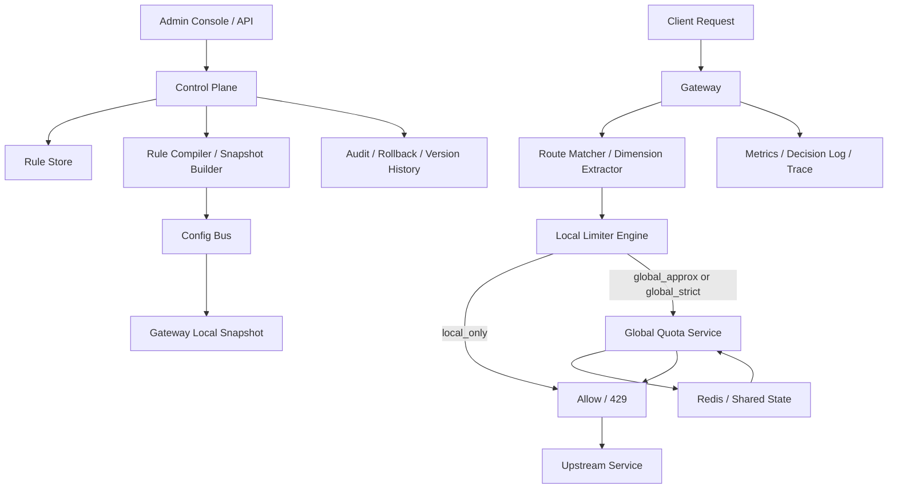

# 系统设计 - 案例 22：限流器系统真题模拟

## 题目

设计一个通用限流器系统，给公司的 API 服务统一使用。要求支持：

- 按 `用户`、`IP`、`API Key`、`接口路径` 等维度限流
- 支持不同时间窗口，如 `100 次/秒`、`1000 次/分钟`
- 支持突发流量
- 支持动态配置规则
- 被限流后返回标准错误码，并尽量附带剩余额度信息

先不做：

- 复杂计费系统
- 完整风控黑名单系统
- 完整 WAF 能力
- 复杂 AI 自适应流量调节

## 为什么这题值得深讲

限流器看起来像一道“小题”，但它其实是非常典型的基础设施题。

很多回答会停在：

- `Redis INCR + EXPIRE`

这不算错，但它只能说明你知道一个做法，说明不了你真的理解这个系统。

因为限流器真正难的，从来不只是“怎么计数”，而是下面这些更本质的问题：

- 限流语义到底是什么，是硬拒绝、软降级，还是只观测不拦截
- 限流状态应该放本地、放中心，还是做两级配额
- 为什么“支持突发”后，算法选择会明显变化
- 为什么“严格全局限额”不是一句 Redis 就能轻松解决
- 为什么规则传播、版本管理和回滚，跟算法本身一样重要
- 为什么限流器自己故障时，`fail-open` 还是 `fail-close` 会直接影响业务风险

这题特别适合区分两种回答：

第一种是：

- 我知道几个算法名
- 我知道可以用 Redis

第二种是：

- 我能先把业务语义收敛清楚
- 我知道这是一条超低延迟数据面链路
- 我知道控制面和执行面必须分开
- 我知道近似全局和严格全局的代价差异
- 我知道热点 key、时钟、配置失效、误杀和退化策略都是真问题

也就是说，这题表面上是“限流”，本质上考的是：

- 你会不会把一个平台能力，设计成一个可解释、可治理、可演进的系统

## 面试官真正想看什么

这题通常在看下面几件事：

1. 你会不会先定义限流语义，而不是一上来报算法名
2. 你能不能比较固定窗口、滑动窗口、令牌桶、漏桶的适用边界
3. 你会不会把 `控制面` 和 `执行面` 分开
4. 你知不知道全局共享状态是系统真正的复杂度来源
5. 你能不能说清 `严格全局限额` 和 `近似全局限额` 的 trade-off
6. 你会不会回答动态配置、热更新、回滚、观测模式这些工程问题
7. 你能不能处理热点 key、中心状态层瓶颈和故障退化
8. 你会不会把答案讲成“真实系统推演”，而不是“工具清单”

## 一开始先别急着选算法，先收敛题目语义

限流题和很多系统设计题一样，第一坑不是技术，而是语义。

因为你如果不先定义清楚：

- 到底要限制什么
- 限制得多严格
- 失败时怎么处理

那后面的算法、状态位置、架构拆分都会飘。

我会先主动澄清下面这些问题：

1. 限流是放在 `API Gateway`，还是允许业务服务内嵌使用？
2. 默认是 `硬限流` 直接拒绝，还是 `软限流` 只打标、降级或排队？
3. 是否必须支持 `突发流量`？
4. 是否要求 `严格全局限额`，还是大多数场景接受 `近似全局限额`？
5. 同一个请求如果命中多条规则，是全部都要通过，还是更具体规则覆盖更泛化规则？
6. 规则是否要求动态配置？多久内要生效？
7. 被限流时，是否要返回 `Retry-After`、`X-RateLimit-Remaining` 等头？
8. 限流器自身故障时，是统一 `fail-open`，还是按接口风险等级分别处理？
9. 路径维度是按原始 URL，还是按路由模板，如 `/users/{id}`？
10. 是否需要支持只观测不拦截的 `observe-only` 模式？

如果面试官不继续补充，我会主动把题目收敛成下面这个版本：

- 在 `Gateway` 层做统一入口限流
- 默认是 `硬限流`，被拒绝时返回 `429`
- 支持 `observe-only` 模式，便于新规则先观测后生效
- 支持 `user`、`IP`、`API Key`、`route template` 等维度
- 支持多个窗口组合，如 `100/s + 1000/min`
- 支持一定程度的 `burst`
- 规则需要在 `5 - 10 秒` 内动态生效
- 大多数规则接受 `近似全局限额`
- 少数高风险接口支持 `严格全局限额`
- 不同规则支持不同的 `fail-open / fail-close` 策略

这里面有三个很关键的产品/平台选择。

### 选择 1：绝大多数规则接受近似全局限额

为什么这句话很重要？

因为如果你默认：

- 所有规则都必须“全网所有节点加起来绝对不超过某个值”

那你实际上是在强行把这道题升级成：

- 每个请求都要经过强协调的配额系统

这会直接改变系统复杂度。

现实里很多 API 限流的真正目标是：

- 防止系统被打穿
- 控制单租户或单用户滥用
- 让整体流量保持在可承受范围内

这时候，允许少量近似误差，往往比为了“绝对精确”牺牲所有请求延迟更合理。

所以我会主动说：

- 普通接口优先近似全局
- 只有极少数高风险规则才做严格全局

### 选择 2：默认放在 Gateway 做统一入口限流

为什么？

- 限流天然适合做在统一接入层
- 这样规则口径更一致
- 可以避免每个业务服务各写一套 limiter
- 网关最容易拿到 IP、API Key、路由模板等公共维度

当然，这不代表业务服务内部不需要限流。

比如：

- 某个服务要保护昂贵下游
- 某个异步消费者要限制并发处理速率

它依然可能要做本地限流。

但在这道题里，我会先把主战场收敛成：

- Gateway 统一入口限流平台

### 选择 3：规则必须支持 observe-only

这点很多人会漏掉，但它非常实战。

因为限流规则一旦配置错：

- 不是“效果差一点”
- 而是可能直接误杀大量正常流量

所以成熟平台通常会支持：

- 新规则先以 `observe-only` 模式运行
- 只记录“如果生效会拦住多少请求”
- 验证无误后再切到 `enforce`

这会让整个平台从“能限流”，变成“能安全治理流量”。

## 第一步：先判断这是一个什么类型的系统

我会先明确：

- 这是一个 `inline` 数据面系统
- 它位于几乎所有请求的主链路上
- 它对延迟极其敏感
- 它会产生大量短生命周期运行态 key
- 它有少量极热点 key
- 它本质上是一个“算法 + 分布式状态 + 配置治理”的综合题

这意味着什么？

### 1. 执行面必须极轻

限流不是后台批处理任务。  
它是请求进来的第一时间就要做出判定的。

也就是说：

- 每个请求都要跑它
- 每加一次网络 RTT，都会放大到全量流量上

所以执行面设计的首要原则是：

- 默认路径必须足够轻

### 2. 这是一个高基数、短生命周期状态系统

你会看到很多运行态 key，比如：

- `user_id + route`
- `api_key + route`
- `ip + route`

这些 key：

- 数量可能非常大
- 大部分都不值得持久化
- 很多会在短时间内自然过期

这说明：

- 运行态状态更像缓存/临时状态，而不是数据库真相源

### 3. 中心化状态层一定会成为复杂度来源

只要你要求：

- 跨节点共享额度
- 严格全局限额
- 热点用户全局受控

就会立刻引入：

- 网络 RTT
- 热点 key
- 中心瓶颈
- 故障退化

也就是说，这题真正要回答的，不是“会不会 Redis”，而是：

- 中心状态层是否值得进入默认路径

### 4. 控制面和执行面必须分开

规则管理是：

- 低频写
- 强治理
- 要版本化
- 要审核和回滚

请求判定是：

- 高频读
- 极低延迟
- 不能依赖控制面稳定性

所以这两层如果混在一起，系统一定会难用。

### 5. 近似性不是偷懒，而是明确 trade-off

很多人一听到“近似全局”，就会觉得这是“不够正确”。

但限流器和账务系统不一样。

很多时候更合理的问题不是：

- 能不能绝对正确

而是：

- 为了更低延迟、更高稳定性，我们能接受多大的超放边界

这就是工程里的真实取舍。

## 第二步：先做一轮容量估算，不然 trade-off 没锚点

我会先给一组面试里比较合理的假设：

- 网关总峰值流量 `100 万 RPS`
- 平均日常流量 `20 万 - 30 万 RPS`
- Gateway 节点数 `200`
- 单节点平均负载 `5000 RPS`，高峰可更高
- 平台总规则数 `10 万`
- 活跃规则数 `5000 - 10000`
- 配置变更要求 `5 - 10 秒` 内生效
- 执行面判定延迟目标：
  - 本地路径 `P99 < 1 ms`
  - 含中心配额交互路径 `P99 < 3 - 5 ms`

然后我会继续往下推。

### 规则快照规模

假设一条规则包含：

- 匹配条件
- 维度定义
- 算法类型
- 阈值窗口
- 突发参数
- 模式
- 故障策略
- 优先级

如果编译后每条规则在内存里大约占：

- `500 B - 1 KB`

那 `10 万` 条规则的快照大概就是：

- `50 MB - 100 MB`

这说明：

- 规则快照完全可以常驻 Gateway 内存
- 数据面没有理由每次请求都去查配置中心

### 运行态 key 规模

真正大的不是规则表，而是运行态 key。

比如：

- `user_id + route`
- `ip + route`
- `api_key + route`

如果平台每天有大量不同用户和调用方，那分钟级别产生的 limiter key 很可能就是：

- 几百万
- 几千万

而且这些 key 的特点是：

- 生命周期很短
- 绝大部分几分钟后就不再活跃

这说明：

- 运行态状态应该天然带 TTL
- 不应该落到关系型数据库做持久真相源

### 中心状态层的压力 sanity check

这是很关键的一步。

如果你说：

- 所有请求都打中心 Redis 判定

那在 `100 万 RPS` 下，就意味着：

- 每秒 `100 万` 次跨网络状态判断

即使你用 Lua 把逻辑收进一条命令，也仍然意味着：

- 每个请求多一次网络 RTT
- Redis 集群承受海量 QPS
- 热点 key 可能打到单分片

而且这还没算上：

- 多窗口组合
- 多条规则命中
- 重试
- 统计埋点

所以这一步推导出来的结论很重要：

- 中心状态层不能作为所有规则的默认必经路径

### 热点 key 规模

不要只看总流量，还要看极热点。

真实系统里经常会出现：

- 某个大客户 API Key
- 某个热门登录接口
- 某个公共查询接口

在短时间内打到：

- 单 key `5 万 - 10 万 QPS`

这会带来两个直接问题：

1. 单 key 热点会把 Redis 单分片打得很重
2. 即便总集群容量够，热点仍然会形成局部瓶颈

所以热点 key 处理，是这题必须主动讲的加分点。

### 延迟预算

我会给一个比较具体的本地路径预算：

- 路由匹配：`0.1 - 0.3 ms`
- 维度提取与 key 构造：`0.1 - 0.3 ms`
- 本地规则匹配与 token 判定：`0.1 - 0.3 ms`
- 记录轻量 metrics：`0.05 - 0.1 ms`

如果需要访问中心共享额度层：

- 网络与服务开销：`1 - 3 ms`

这个预算一旦明确，很多设计自然就出来了：

- 默认判定必须本地化
- 中心访问必须尽量稀疏
- 规则快照必须内存化
- 算法和数据结构必须轻量

## 第三步：先定义不变量，而不是先选技术

这是这题最容易被忽略、但最能拉开差距的一步。

我会先定义下面这些不变量：

1. 在同一份规则快照下，相同请求上下文的规则匹配结果必须稳定
2. 数据面请求不能同步依赖规则数据库或配置中心
3. 命中的所有 `硬限流` 规则都必须通过，请求才能放行
4. `observe-only` 规则只能记录潜在拒绝，不能阻断流量
5. 对 `近似全局限额`，系统必须能明确说明超放边界来自哪里
6. 对高风险规则，故障时的 `fail-open / fail-close` 策略必须可配置
7. 配置更新必须版本化，且支持回滚到 `last good snapshot`
8. 被限流原因必须可解释，至少要能知道命中了哪条规则

这几条不变量背后的意思是：

- 规则匹配稳定性比“实现上差不多就行”更重要
- 数据面必须有自我封闭能力
- 近似不是模糊，而是要知道误差从哪来
- 平台治理能力不是附属品，而是主设计的一部分

很多候选人一上来就说：

- 我用令牌桶

但如果这几个不变量没先定义清楚，后面的答案大概率会越来越乱。

## 第四步：不要直接给最终方案，先走一遍真实设计推演

这一题如果想讲得像真正做过，我不会一上来就把最终架构甩出来。

我会像真实设计系统一样，一轮一轮推。

## 第一轮思考：最朴素的方案是什么

最简单的方案其实是：

- 每个 Gateway 节点自己在内存里维护计数器
- 用固定窗口做本地限流
- 命中规则就直接返回 `429`

这个方案有什么好处？

- 非常快
- 没有中心依赖
- 实现简单
- 对少量静态规则完全可用

如果系统规模很小，或者只是保护某个单实例服务，这个方案甚至已经能工作。

但只要把题目放回“统一 Gateway 平台”，问题马上就出来了：

1. 无法表达全局共享额度
2. 节点扩缩容会改变语义
3. 节点重启会让窗口状态丢失
4. 热点流量会在不同节点之间分散，导致整体超放不可控
5. 规则动态变更、版本回滚、平台治理都还没进入设计

所以第一轮方案只能作为：

- 最小可用思路

绝不能作为这题的最终回答。

## 第二轮思考：如果要跨节点共享额度，最直观的方案是什么

第二个很自然的想法是：

- 所有请求都去中心 Redis 判定
- 用 `INCR + EXPIRE` 或 Lua 脚本做窗口计数

这个方案的优点很明显：

- 语义统一
- 多节点共享状态
- 实现上比自己写分布式协调简单
- 很适合中低流量、规则不复杂的场景

这也是为什么很多人会本能地回答：

- `Redis INCR + EXPIRE`

但如果继续深想，这个方案的问题也会立刻暴露：

1. 每个请求都多一次网络 RTT
2. 中心 Redis 成为所有请求的公共依赖
3. 热点 key 可能把单分片打爆
4. 固定窗口本身存在边界抖动
5. 多窗口组合、多规则命中时，脚本复杂度会上升
6. Redis 抖动时，整个流量入口都会跟着抖

所以第二轮方案能说明一件事：

- 你知道怎么把状态共享起来

但它还不是一个成熟的平台级答案。

## 第三轮思考：先把限流算法和业务语义对齐

这一步也很关键。

因为很多候选人一说限流，就把算法当成“背诵题”。

其实正确顺序应该是：

- 先问业务语义要什么
- 再决定算法

## 限流算法比较

### 方案 A：固定窗口

做法是：

- 以整秒、整分钟为窗口
- 在窗口内累加请求数
- 超过阈值就拒绝

优点：

- 最简单
- 存储开销低
- 很容易在 Redis 或本地实现

缺点：

- 边界抖动明显
- 在窗口切换点可能瞬间打出两倍流量

适合：

- 要求不高的后台接口
- 低成本、快速上线场景

### 方案 B：滑动窗口日志

做法是：

- 记录窗口内每一次请求时间戳
- 每次判定时移除过期记录，再计算当前数量

优点：

- 精度高
- 语义直观

缺点：

- 存储成本高
- 计算成本高
- 在大流量下不划算

适合：

- 低流量但精度要求高的场景

### 方案 C：滑动窗口计数

做法是：

- 把窗口拆成若干小桶
- 近似表示滑动时间段内的请求量

优点：

- 精度和成本折中
- 比固定窗口更平滑

缺点：

- 逻辑比固定窗口复杂
- 仍然更偏“控制请求数”，对 burst 表达不自然

适合：

- 需要比固定窗口更平滑，但又不想维护完整日志的场景

### 方案 D：Token Bucket

做法是：

- 系统以固定速率补充 token
- 请求到来时消费 token
- token 不足则拒绝
- bucket 容量决定最大突发能力

优点：

- 能表达“平均速率 + 突发容量”
- 非常适合 API 限流
- 本地实现和中心实现都比较自然

缺点：

- 需要维护 token 补充逻辑
- 需要仔细处理时间与时钟

适合：

- 大多数 API 网关限流场景

### 方案 E：Leaky Bucket

做法是：

- 请求先进入桶
- 以固定速率流出

优点：

- 输出更平滑
- 适合做流量整形

缺点：

- 对允许 burst 的表达不如 Token Bucket 直接
- 更像“匀速排水”，不一定是 API 入口第一选择

适合：

- 希望整形输出速率的场景

### 我在这道题里的选择

如果题目明确要求：

- 支持突发流量
- 是 API Gateway 场景

我会优先选：

- `Token Bucket`

原因很直接：

- API 限流通常不是为了把流量绝对抹平
- 而是要允许合理 burst，同时约束长期平均速率

如果是一些简单后台接口，我也会补一句：

- 固定窗口未必不能用

但在这道题的主答案里，我会把核心执行算法定成：

- 默认 `Token Bucket`
- 必要时可扩展支持固定窗口或滑动窗口计数

这样回答会比“只会一个算法”更成熟。

## 顺手做个容量 sanity check：为什么不能默认所有请求都走中心判定

如果平台峰值是：

- `100 万 RPS`

而你默认所有请求都走中心 Redis / Quota Service 判定，那意味着：

- 每秒 `100 万` 次中心调用

如果一个热点租户独占 `10 万 QPS`，那又意味着：

- 单个 rule-key 可能打到 `10 万 QPS`

这说明：

- 不是 Redis 集群总吞吐够不够的问题
- 而是热点 key 和全量 RTT 让它不适合作为默认路径

所以这一步我会明确得出结论：

- 中心判定可以存在
- 但应该只服务于“确实需要共享额度”的部分流量

## 第五步：执行面状态到底放哪里

到这里，问题已经被压缩成一个非常核心的设计选择：

- 限流状态是本地放，中心放，还是两级放

## 执行面状态方案比较

### 方案 A：全本地

做法：

- 每个 Gateway 节点本地维护 bucket/计数器

优点：

- 极快
- 没有中心依赖
- 最容易保证低延迟

缺点：

- 不能表达严格全局共享额度
- 扩缩容会改变全局限流效果
- 节点重启状态丢失

### 方案 B：全中心 Redis / KV

做法：

- 每个请求都到中心状态层做判定

优点：

- 跨节点语义统一
- 更容易表达全局额度

缺点：

- 所有请求都多一次网络 RTT
- 中心状态层容易成为瓶颈
- 热点 key 问题明显
- 故障时所有流量都受影响

### 方案 C：两级方案，本地快速判定 + 中心共享额度

做法：

- 规则和快照本地化
- 本地优先做快速判定
- 只有需要全局共享额度的规则，才和中心配额层交互
- 甚至进一步做本地预分配 token

优点：

- 延迟更低
- 大幅减少中心调用频率
- 更符合真实流量分布

缺点：

- 实现复杂度更高
- 要接受一定近似性
- 需要明确超放边界

### 我在这个题里的回答方式

如果这是公司统一 Gateway，我不会只给一个单一模式。

我会把规则分成三类：

1. `local_only`
   - 只要求单节点保护
   - 纯本地 bucket 就够

2. `global_approx`
   - 要跨节点共享额度
   - 但允许近似误差
   - 采用本地 bucket + 中心配额租约

3. `global_strict`
   - 极少数高风险规则
   - 需要严格全局协调
   - 允许更高成本和更重路径

这比“全都本地”或“全都 Redis”都更像真实平台。

## 严格全局限额为什么是个隐藏难点

这一题如果想讲深，必须主动把这个点说出来。

因为面试官很喜欢追问：

- “如果我就是要求全平台所有节点加起来绝对不超过 1000 QPS 呢？”

很多候选人会轻描淡写地说：

- “那就放 Redis”

但其实这背后复杂得多。

### 方案 A：所有规则都做严格全局

听起来很干净，但问题非常明显：

- 所有请求都变重
- 中心状态层成了强依赖
- 跨区域时延会更差
- 热点 key 会非常难受
- 故障时退化空间很小

这会把一个本来应该“轻”的限流器，硬生生变成一个重协调系统。

### 方案 B：只有少数关键规则走严格全局

更现实的做法是：

- 普通查询接口走 `local_only` 或 `global_approx`
- 登录、短信发送、支付提交、敏感写操作等少数规则走 `global_strict`

这样做的好处是：

- 把复杂度控制在少数真正需要的地方
- 大多数流量仍然保持低延迟

### 我在这个题里的选择

我会明确说：

- `global_strict` 不是默认能力
- 它是高成本特性
- 只应该用于少量关键规则

这句话非常加分，因为它说明你知道：

- 工程系统不是功能越全越好
- 而是要把昂贵能力留给真正值得的场景

## 第六步：把最终高层架构定下来

在前面几轮推演后，一个比较成熟的架构会长这样：

这个架构里最重要的不是组件名，而是边界：

- `Control Plane` 负责规则生命周期和版本治理
- `Gateway Local Snapshot` 让数据面请求不依赖配置中心
- `Local Limiter Engine` 负责超低延迟默认路径
- `Global Quota Service` 只在需要共享额度时介入

## 第七步：把 API 和返回语义说清楚

如果我要把答案讲得更工程化，我会把 API 也顺手定义一下。

### 创建规则

`POST /v1/rate-limit/rules`

关键请求字段：

- `name`
- `scope`
  - `local_only / global_approx / global_strict`
- `match`
  - 服务名、路由模板、HTTP 方法、租户范围
- `dimensions`
  - `user_id`
  - `ip`
  - `api_key`
  - `route`
- `algorithm`
  - `token_bucket`
- `limits`
  - 例如 `[100/s, 1000/min]`
- `burst`
- `mode`
  - `observe / enforce`
- `failure_policy`
  - `fail_open / fail_close`
- `priority`
- `status`

### 更新规则

`PATCH /v1/rate-limit/rules/{rule_id}`

这里我会强调：

- 更新最好不是直接覆盖线上生效对象
- 而是生成新版本

因为限流规则是高风险配置。

### 发布规则版本

`POST /v1/rate-limit/snapshots/publish`

这个动作意味着：

- 控制面会把一组规则编译成新 snapshot
- 推送或通知 Gateway 拉取

### 查询规则命中情况

`GET /v1/rate-limit/rules/{rule_id}/stats`

用于查看：

- 命中次数
- 放行率
- 拒绝率
- observe-only 下潜在拒绝率

### 被限流后的返回

当请求被拒绝时，返回：

- 状态码 `429`

可选返回头：

- `Retry-After`
- `X-RateLimit-Limit`
- `X-RateLimit-Remaining`
- `X-RateLimit-Reset`
- `X-RateLimit-Rule-Id`

这里有个细节很适合加分：

- 如果一个请求命中多条规则，返回头不一定能表达所有规则

所以更现实的做法通常是：

- 返回“最先触发拒绝”或“最严格约束”的那条规则信息
- 更完整的命中细节进入日志和观测系统

## 第八步：把核心数据模型说深一点

### 规则表

`rate_limit_rule`

关键字段：

- `rule_id`
- `name`
- `scope`
- `service`
- `route_template`
- `http_method`
- `dimensions`
- `algorithm`
- `limits_json`
- `burst`
- `mode`
- `failure_policy`
- `priority`
- `status`
- `owner`
- `created_at`
- `updated_at`

这张表的本质是：

- 控制面配置真相源

### 规则快照表

`rate_limit_snapshot`

关键字段：

- `snapshot_id`
- `version`
- `compiled_blob`
- `checksum`
- `status`
- `published_at`
- `created_by`

这里我会顺手强调：

- 数据面最好消费“编译后快照”，而不是直接消费原始规则表

因为原始规则更适合人类编辑，未必适合请求路径高效匹配。

### 配额租约状态

`quota_lease`

这个不一定需要持久化到关系型数据库。  
更多时候它会存在：

- Redis
- Quota Service 内存
- 带 TTL 的临时状态存储

逻辑字段可以是：

- `rule_id`
- `limiter_key`
- `owner_node_id`
- `leased_tokens`
- `lease_expire_at`

### 决策日志

`limiter_decision_event`

通常不建议全量逐条持久化到主库。  
更合适的是：

- 抽样写日志
- 聚合指标
- 对拒绝请求做更高采样率

典型字段：

- `ts`
- `request_id`
- `rule_id`
- `limiter_key_hash`
- `decision`
- `remaining`
- `retry_after_ms`
- `snapshot_version`
- `gateway_id`

这里我会特别强调两点：

1. 决策日志是治理工具，不是在线真相源
2. 运行态状态天然短命，不要硬塞进强持久化体系

## 第九步：真正把数据面判定链路拆开来讲

限流器如果想讲深，必须把请求判定路径拆细。

## 判定链路的理想延迟预算

我会给一个大致预算：

- 路由模板匹配：`0.1 - 0.2 ms`
- 身份/维度提取：`0.1 - 0.2 ms`
- 本地规则选择：`0.1 - 0.2 ms`
- 本地 token 判定：`0.1 - 0.2 ms`
- 汇总结果并返回：`0.05 - 0.1 ms`

如果要访问中心共享额度层：

- 增量开销 `1 - 3 ms`

这说明：

- 默认路径必须是本地
- 中心路径必须是少数

## 判定流程

我会按下面这个顺序讲：

1. 请求进入 Gateway
2. 根据服务、路由模板、HTTP 方法匹配候选规则集
3. 从请求上下文提取维度：
   - `user_id`
   - `api_key`
   - `client_ip`
   - `route_template`
4. 对命中规则生成 `limiter_key`
5. 逐条执行本地判定：
   - `local_only` 规则直接在本地 bucket 判断
   - `global_approx` 规则优先消费本地已领取配额
   - `global_strict` 规则走中心协调
6. 如果任意 `enforce` 规则拒绝，请求返回 `429`
7. 如果只有 `observe-only` 规则会拒绝，则请求继续放行，但记录观测事件
8. 返回时附带必要的 `Retry-After / Remaining` 信息

这里最重要的两个语义是：

- 所有命中的 `enforce` 规则都要通过
- `observe-only` 只观测不阻断

这会让整个系统的行为非常清楚。

## 多窗口规则怎么判

如果一条规则同时配置了：

- `100/s`
- `1000/min`

那我会定义为：

- 同一条规则下的多个窗口是 `AND` 关系

也就是说：

- 秒级窗口限制短时爆发
- 分钟级窗口限制长期滥用

这样比“只保留一个窗口”更真实，也更符合平台能力。

## 第十步：把规则匹配和 key 设计讲成真正的设计，而不是一句“按用户/IP限流”

这一步是很多回答特别容易发虚的地方。

因为“按用户/IP限流”这几个字，真正落到系统里，其实全是细节。

## limiter key 到底怎么拼

我不会简单说：

- key = `user_id + route`

而会强调：

- key 必须带上 `rule_id`
- 维度值必须标准化
- 路由维度最好取 `route template`

比如：

- `rule_123:user:456:route:/v1/orders/{id}`

为什么一定要带 `rule_id`？

因为不同规则可能：

- 限制相同维度
- 但阈值、模式、窗口不同

如果 key 空间不隔离，就会串数据。

## 路径维度不能直接用原始 URL

这也是一个很实战的点。

如果你直接用：

- `/users/123`
- `/users/456`

那你会把路径维度变成：

- 高基数字段

结果是：

- 运行态 key 暴涨
- 限流语义也变了

更稳的做法应该是：

- 按网关路由模板，如 `/users/{id}`

这样你真正限制的是：

- 某类接口

而不是：

- 某个具体资源 ID

## IP 维度不能随便信任请求头

如果题目里有 `IP` 限流，我会主动补一句：

- IP 必须来自可信代理链
- 不能盲信任任意客户端传来的 `X-Forwarded-For`

否则用户可以伪造 IP，直接绕过规则。

这说明：

- 限流维度提取其实也有安全边界

## 用户维度和 API Key 维度的顺序

一些请求可能：

- 已完成鉴权
- 有稳定 `user_id`

另一些请求可能：

- 未登录
- 只有 `API Key`
- 或只能退回到 `IP`

所以我会说：

- 维度提取要和认证链路配合

常见顺序是：

1. 能拿到 `API Key` 的场景，优先按 `API Key`
2. 登录态请求按 `user_id`
3. 匿名请求回退到 `IP`

这样平台才能兼容不同流量类型。

## 多条规则同时命中时怎么处理

这个点也很容易被追问。

我会先给默认语义：

- 命中的 `enforce` 规则是叠加生效的
- 任意一条拒绝，请求就被拒绝

为什么默认用叠加，而不是互相覆盖？

因为真实系统经常需要同时存在：

- 全局租户限流
- 用户级限流
- 接口级限流

这些限制通常不是互斥关系，而是：

- 共同构成保护边界

如果业务确实需要覆盖关系，比如：

- 某些 VIP 租户豁免默认限流

我会通过：

- 更高优先级的 bypass 规则

来表达，而不是把整个系统默认做成“更具体规则覆盖更泛化规则”。

## 高基数和内存膨胀怎么控

因为 limiter key 很多，所以一定要控制：

- 维度数量
- 维度取值规范
- TTL

常见做法包括：

- 运行态 key 自动 TTL
- 避免把原始 URL、原始 Query 参数直接入 key
- 对 IP 做标准化
- 对不必要的 header 不做维度
- 对极高成本组合维度做准入限制

这一步很能体现你不是停留在概念层。

## 第十一步：把控制面讲成单独系统

限流器如果不讲控制面，会很像 demo。

因为真实公司里最难的往往不是：

- 第一个 limiter 写出来

而是：

- 怎么让几百条、几千条规则能安全上线

## 规则生命周期

一个成熟规则通常会经历：

1. `draft`
2. `observe`
3. `enforce`
4. `disable`
5. `archive`

这个生命周期设计的意义是：

- 新规则不必一上来就挡流量
- 先观测真实命中情况
- 再逐步生效

## 为什么要编译快照

控制台里的规则往往长这样：

- 比较适合人读
- 支持复杂匹配表达式
- 带大量治理元数据

但 Gateway 想要的是：

- 可快速匹配的数据结构
- 尽量少的运行时解析

所以更好的做法是：

1. 控制面把原始规则编译成 Gateway 友好的 snapshot
2. snapshot 带版本号和 checksum
3. Gateway 原子切换到新 snapshot

这样做的好处是：

- 数据面更轻
- 规则问题更容易回滚
- 版本追踪更清楚

## 配置传播怎么做

我会把传播链路设计成：

1. 控制台/API 修改规则
2. 规则写入中心存储
3. 编译服务生成新 snapshot
4. 通过配置总线通知 Gateway
5. Gateway 拉取新 snapshot，校验 checksum
6. 校验通过后原子替换本地快照

为什么不让 Gateway 每次请求都去查配置中心？

因为：

- 数据面和控制面必须解耦
- 配置中心抖动不能拖垮转发链路

## 原子热更新与回滚

这里我会主动讲两个工程细节：

### 1. active snapshot + last good snapshot

Gateway 至少保留：

- 当前生效版本
- 上一个稳定版本

如果新版本有问题：

- 可以快速回滚

### 2. 版本号与灰度发布

大型平台可以进一步做：

- 先让小部分 Gateway 吃新规则
- 观察拒绝率、错误率、误杀风险
- 再全量推广

这会让限流平台真正具备治理能力。

## 第十二步：把共享配额和热点 key 讲进去，不然答案还是不够真实

这部分是整题最像真实工程的地方之一。

## 热点 key 是怎么形成的

很常见的几个来源：

- 单个大客户 API Key
- 单个热门登录接口
- 短时间暴涨的公共查询接口
- 恶意攻击集中打某个路径

这些场景会让某条规则下的某个 limiter key 突然变成：

- 极热点

如果你让所有请求都去中心 Redis，那热点就会表现为：

- 单 key 热点
- 单分片压力集中

## 本地预分配配额为什么是核心设计

更高效的做法通常是：

- Gateway 不是每个请求都去中心拿 token
- 而是一次领取一小桶 token
- 在本地消费完再续领

也就是：

- `lease / prefetch` 模式

这样做的好处是：

- 中心访问频率从“每请求一次”下降到“每消耗一批额度一次”
- 热点 key 压力被明显摊薄
- 数据面大部分请求仍然走本地路径

## 配额批量大小怎么选

这背后有一个非常真实的 trade-off。

如果批量太小：

- 更精确
- 但中心访问更频繁

如果批量太大：

- 中心访问更少
- 但超放边界变大

所以批量大小本质上是在平衡：

- 精度
- 中心压力
- 延迟

## 一个简单的超放边界例子

假设一条全局近似规则是：

- `1000 QPS`

现在有：

- `10` 个 Gateway 节点

每个节点一次可以预取：

- `20` 个 token

那在最坏情况下，如果所有节点都刚领完 token，规则突然被关闭或流量同时冲上来，理论上可能多放的上界大约就是：

- `10 * 20 = 200`

再加上一点 in-flight 请求。

这就是为什么我前面说：

- 近似不是模糊
- 而是要知道误差边界来自哪里

## 中心共享状态层怎么实现

这部分我会分两种说法。

### 简化版回答

- `Global Quota Service + Redis`

其中：

- Redis 保存共享 token / 配额状态
- Quota Service 负责原子扣减、租约发放和隐藏脚本细节

### 更成熟的回答

我会强调：

- 不建议让所有 Gateway 直接各写各的复杂 Lua
- 用一个独立 Quota Service 把共享配额逻辑封装起来

好处是：

- 算法升级更容易
- 热点治理集中处理
- 规则分层更清晰

## 第十三步：时间和时钟也是隐藏难点

很多人讲 token bucket 时，会把时间问题完全跳过去。

但真实系统里，这其实很重要。

## 为什么固定窗口容易在边界出问题

比如规则是：

- `100 次/秒`

如果你按整秒固定窗口计数，就会出现：

- 在 `00:00:00.999` 打 100 次
- 在 `00:00:01.001` 再打 100 次

系统看起来每个窗口都合法，但短时间内其实放过了接近：

- `200` 次

这就是固定窗口的边界抖动问题。

## Token Bucket 的时间实现要注意什么

如果我在本地实现 token bucket，我会强调：

- 用单调时钟，而不是依赖系统 wall clock 做跳变计算

因为：

- wall clock 可能被 NTP 调整
- 向前跳和向后跳都可能影响补 token 逻辑

更稳的做法是：

- 以单调时间差计算补充量

## 中心状态层不要信任客户端时间

如果共享配额层需要时间相关计算，也更应该：

- 由服务端自己计算时间推进

而不是：

- 让 Gateway 把本地时间戳带过来决定补充逻辑

否则：

- 节点之间时钟偏差
- 错误重试
- 恶意参数

都会让状态变得更不可控。

这部分不是每次都必须讲很长，但你主动提一下，会非常像真实做过的人。

## 第十四步：把故障、退化和安全边界讲进去

限流器不是“有结果就行”的组件。  
它本身也是关键基础设施。

所以一定要讲：

- 它挂了怎么办
- 它误杀了怎么办
- 它部分失灵时怎么退

## 配置中心挂了怎么办

如果配置中心抖动，我不会让 Gateway 受影响。

更合理的行为是：

- 继续使用本地 `active snapshot`
- 新规则延迟生效
- 控制面告警

也就是说：

- 配置中心挂了，不应影响已加载规则继续执行

## Quota Service / Redis 挂了怎么办

这里不能给统一答案。

我会明确分级：

### 高风险接口

比如：

- 登录尝试
- 短信发送
- 密码找回
- 支付提交流量保护

更偏向：

- `fail-close`

因为放开后可能带来更高安全或成本风险。

### 普通查询接口

比如：

- 商品列表
- 普通详情页
- 一般数据查询

更偏向：

- `fail-open`

因为这类接口更看重可用性。

这比回答“全部 fail-open”或者“全部 fail-close”都成熟得多。

## Gateway 本地快照损坏怎么办

这也是个实战点。

更稳的做法是：

- snapshot 下载后先做 checksum 校验
- 校验不过不切换
- 保留 last good snapshot

这样问题不会从控制面直接炸到数据面。

## 限流器开始误杀大量请求怎么办

平台必须要有：

- 一键关规则
- 快速切回 observe-only
- 回滚上一版本 snapshot

否则真实线上一旦规则写错，恢复会非常痛苦。

## 重试和幂等怎么看

还有一个容易被忽略的小点：

- 同一个业务请求如果在客户端或网关层发生重试，可能会多消耗 token

这通常是可以接受的，因为限流器的目标是：

- 控制流量

而不是：

- 做精确计费

所以我会顺手讲一句：

- 限流器一般不保证“业务请求语义级别的 exactly once 扣额”

这能说明你知道它的边界。

## 第十五步：把可观测性讲成真正的平台治理，而不是一句“打监控”

限流器如果没有观测系统，就很容易变成：

- 配完规则后全靠猜

至少要有三层观测。

## 指标层

我会重点关注：

- 总放行率
- 总拒绝率
- 每条规则命中率
- 每条规则的 observe-only 潜在拒绝率
- `fail-open` 次数
- `fail-close` 次数
- Quota Service 延迟
- Redis 错误率
- 热点 key Top N

这些指标直接决定：

- 规则是否真的在起作用
- 规则是否误杀了正常流量
- 中心状态层是否健康

## 日志层

我不会建议全量逐条把所有放行记录都落到主日志里。

更现实的做法是：

- 对拒绝请求高采样
- 对放行请求低采样
- 记录规则 ID、key hash、remaining、snapshot version

这样既能查问题，又不会把日志量打爆。

## 追踪与排障层

对复杂问题，我希望能回答下面这些问题：

- 某个请求为什么被拒
- 命中了哪几条规则
- 最终是哪一条规则挡住了它
- 当时使用的是哪个 snapshot version
- 是否走了共享配额层

这些信息非常重要。

因为线上排障时，最怕的不是“规则不生效”，而是：

- 规则偶发误杀，但没人能说清为什么

## observe-only 为什么是治理利器

我会再次强调：

- `observe-only` 能让平台先看真实命中情况，再决定是否阻断

这在规则治理上非常重要。

因为很多限流规则，真正难的不是：

- 怎么实现拦截

而是：

- 怎么确认这条规则不会误伤正常业务

## 第十六步：如果题目升级到多区域部署，我怎么讲

如果面试官继续追问：

- “如果公司在多个地域部署 Gateway 呢？”

我不会一上来就说：

- 所有地域共享一个全球严格限流中心

因为这通常不现实。

更合理的做法是：

## 控制面

- 规则控制面仍然可以集中管理
- 但 snapshot 要分区域分发

这样可以保证：

- 规则口径统一
- 数据面就近生效

## 数据面

- 每个地域的 Gateway 都优先本地判定
- 区域内共享额度由本区域的 Quota Service / Redis 处理

这会让：

- 延迟更低
- 故障域更小

## 全球共享限额

这时候我会非常谨慎地说：

- 真正跨区域的严格全局限额代价非常高

更常见的工程做法是：

- 先给每个区域分配预算
- 区域内再做本地/区域级限流

也就是一种：

- `global budget -> regional budget -> local token`

的层级配额模型。

这样可以避免：

- 每个请求都跨地域协调

如果面试官再追问极致严格全球限制，我会明确说：

- 可以做，但只适合极少数关键规则
- 否则跨地域 RTT 和协调成本太高

## 第十七步：如果继续演进，这个系统会怎么长大

真实系统不会 Day 1 就是完全体。

所以我会主动给出演进路径。

### 阶段 1：单节点或少量网关，本地固定窗口

适合：

- 规则很少
- 流量不大
- 目标只是先做基础保护

### 阶段 2：Gateway 统一入口 + Redis 共享计数

适合：

- 开始需要跨节点共享状态
- 平台开始出现统一限流需求

### 阶段 3：编译快照 + 本地 Token Bucket + 中心配额租约

适合：

- 流量上来
- 热点 key 明显
- 对延迟更敏感

### 阶段 4：规则治理平台化

包括：

- observe-only
- 审核发布
- 灰度生效
- 快速回滚
- 命中观测看板

这一步意味着：

- 限流器从技术组件，长成平台能力

### 阶段 5：多区域层级配额

适合：

- 多地域流量明显
- 有跨区域预算控制需求

这种“按阶段演进”的回答，会比一上来堆满所有组件更像真实工程。

## 面试里我会怎么讲最终方案

如果让我设计一个通用限流器系统，我会先把题目收敛成 Gateway 统一入口限流平台：支持按 `user`、`IP`、`API Key`、`route template` 等维度做规则匹配，默认是硬限流返回 `429`，支持 observe-only 先观测后生效，支持多窗口和 burst。  
这道题的关键不是只选一种算法，而是先定义语义，再决定状态放在哪里。对大多数 API 来说，我不会默认追求严格全局限额，而是把规则分成 `local_only`、`global_approx` 和 `global_strict` 三类，避免把所有请求都拖进强协调路径。

在执行面上，我会优先使用本地编译后的规则快照和本地 `Token Bucket` 做超低延迟判定。  
对需要跨节点共享额度的规则，我会引入 `Global Quota Service`，但不会让每个请求都直接访问中心状态层，而是通过本地预分配 token 的方式把中心访问从“每请求一次”降成“每批额度一次”，以换取更低延迟和更好的热点承受能力。  
控制面上，规则会经过草稿、观测、强制生效等生命周期，并通过版本化 snapshot 分发到 Gateway，本地保留 `active snapshot` 和 `last good snapshot`，确保配置中心问题不会直接拖垮数据面。

如果面试官继续追问，我会重点展开几件事：为什么固定窗口不适合作为主方案、为什么路径维度必须用路由模板而不是原始 URL、为什么严格全局限额是高成本特性，以及限流器自身故障时为什么要按业务风险决定 `fail-open` 还是 `fail-close`。  
这样回答出来的限流器，就不只是“能计数”，而是一个可解释、可治理、可演进的平台系统。

## 面试官如果继续追问，我会怎么答

### 追问 1：为什么不直接用固定窗口

回答重点：

- 固定窗口实现简单
- 但边界抖动明显
- 在窗口切换点可能瞬间放出双倍流量
- 对支持 burst 的表达也不自然

所以：

- 它可以作为简单场景方案
- 但不是这道题的主答案

### 追问 2：为什么不能所有请求都打 Redis

回答重点：

- 所有请求都多一次网络 RTT
- 中心状态层会成为公共依赖
- 热点 key 会让单分片成为瓶颈
- 在百万 RPS 级别下，这个默认路径太重

所以：

- 中心状态层应该只服务于共享额度场景
- 不能作为全量默认路径

### 追问 3：为什么路径维度要用 route template，而不是原始 URL

回答重点：

- 原始 URL 容易把资源 ID 带进去
- 会导致 key 基数暴涨
- 语义也会从“限制接口”变成“限制某个具体资源”

所以更稳的选择是：

- 统一按路由模板限流

### 追问 4：如果同时要支持 `100/s` 和 `1000/min`，怎么做

回答重点：

- 把多个窗口放在同一条规则里
- 多窗口按 `AND` 生效
- 秒级窗口控制短时峰值
- 分钟级窗口控制长期滥用

### 追问 5：严格全局 `1000 QPS` 怎么保证

回答重点：

- 可以做
- 但成本明显更高
- 要更强的中心协调
- 可能牺牲延迟和可用性

所以我会建议：

- 只在极少数关键规则上启用严格全局

### 追问 6：限流器自身挂了怎么办

回答重点：

- 配置中心挂了，继续用本地 snapshot
- Quota Service / Redis 挂了，要按规则风险等级决定 `fail-open / fail-close`
- 平台要支持快速回滚和切回 observe-only

### 追问 7：如果某个大客户 API Key 形成热点 key，怎么处理

回答重点：

- 本地预分配额度，降低中心调用频率
- 热点规则前置本地快速拦截
- 做热点 key 监控与分级治理
- 必要时对区域预算进一步拆层

### 追问 8：规则热更新怎么保证安全

回答重点：

- 规则先编译成 snapshot
- Gateway 原子切换
- 保留 last good snapshot
- 新规则先 observe-only，再 enforce
- 支持灰度发布和快速回滚

## 常见失分点

1. 只会说 `Redis INCR + EXPIRE`，不比较算法边界。
2. 不先收敛语义，上来就说组件。
3. 不区分 `控制面` 和 `执行面`。
4. 不知道 `严格全局限额` 的代价。
5. 不会处理热点 key。
6. 不讲规则传播、版本管理和回滚。
7. 忽略 `observe-only`，把平台治理能力讲丢了。
8. 不回答限流器故障时的 `fail-open / fail-close`。
9. 路径维度直接用原始 URL，导致 key 基数爆炸。
10. 把限流器讲成“计数器”，没有讲成“流量治理平台”。

## 总结

限流器真正考的不是：

- “怎么做计数”

而是：

- 如何在一条超低延迟请求路径上，把算法、分布式状态、规则传播、热点治理和故障退化组织成一个可治理的平台能力

成熟回答通常应该按这个顺序展开：

1. 先定义限流语义
2. 再比较算法与状态位置
3. 再讲控制面 / 执行面分离
4. 再讲共享额度、热点 key 和故障策略
5. 最后补治理、观测和演进路径

这样讲出来的答案，才会像真的做过平台系统，而不是只背过几个算法名。

## 自测问题

1. 为什么我会把规则分成 `local_only`、`global_approx` 和 `global_strict` 三类，而不是全都统一实现？
2. 如果某条规则既要 `100/s` 又要 `1000/min`，你会如何在执行面组织这两个窗口？
3. 如果热点 key 把中心 Redis 单分片打爆了，你最优先会改哪一层？
4. 为什么说 `observe-only` 是限流平台里非常重要的能力？
5. 如果 Quota Service 挂了，哪些接口更适合 `fail-close`，哪些更适合 `fail-open`？
6. 如果面试官坚持“所有区域严格共享一个全球 1000 QPS”，你会提醒哪些代价？
7. 为什么 route 维度最好用路由模板，而不是原始路径？
8. 为什么说限流器里的“近似”不能只是嘴上说说，而要有明确的超放边界？
