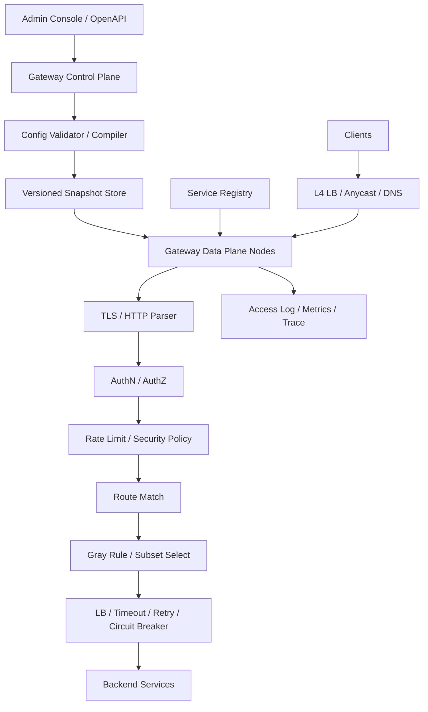

# 系统设计 - 案例 23：API Gateway 系统真题模拟

## 题目

设计一个 API Gateway，统一承接公司所有外部 API 流量。要求支持：

- HTTPS 接入
- 身份认证
- 路由转发
- 限流
- 灰度发布
- 监控日志和 Trace 透传

先不做：

- 完整 Service Mesh 替代
- 复杂业务编排
- 所有内部服务间流量治理

## 为什么这题值得深讲

API Gateway 这题表面上像是在考：

- 反向代理
- 路由转发
- 几个常见插件

但如果只答到这里，通常说明你知道“网关能做什么”，还没有真正回答“网关应该怎么设计”。

这题真正难的地方在于：

- 网关是全站统一入口，任何一个设计失误都会放大全站 blast radius
- 数据面极度追求低延迟，但控制面又必须支持复杂配置管理
- 认证、限流、灰度、重试、日志这些能力都想放在网关，但放多了网关就会变成巨石入口
- 配置必须热更新，但热更新不能把请求链路带崩
- 你既要讲清楚运行时性能，也要讲清楚平台治理能力

很多回答会停在：

- `Nginx / Envoy + 注册中心 + 配置中心`

这不算错，但也不够好。  
成熟的回答应该能讲清楚：

- 网关到底承接哪些职责，哪些事情坚决不做
- 为什么控制面和数据面必须拆
- 为什么配置要版本化快照，而不是请求时动态查
- 为什么认证、限流、灰度这些能力的执行顺序不能随便排
- 为什么网关设计本质上是在平衡“统一入口能力”和“入口层风险”

## 面试官真正想看什么

这题通常在看下面几件事：

1. 你会不会先定义 Gateway 的职责边界，而不是把它说成万能入口
2. 你能不能区分控制面和数据面，并解释为什么必须拆
3. 你会不会从请求主链路出发，而不是从配置后台出发
4. 你能不能比较认证、限流、灰度、服务发现这些能力分别该放哪
5. 你会不会处理配置热更新、快速回滚和控制面故障
6. 你能不能说明 Gateway、BFF、负载均衡、Service Mesh 的边界

## 一开始先别急着设计，先收敛题目语义

真实面试里，这题最大的坑之一是：

- 不先收敛语义，直接开始堆组件

所以我会先主动问下面这些问题：

1. 这是面向外部客户端的北南流量网关，还是内部服务接入网关？
2. 后端协议主要是 HTTP，还是也要支持 gRPC / WebSocket？
3. 认证方式有哪些，`JWT`、API Key、OAuth2、HMAC 还是混合？
4. 限流要求是单租户、单用户、单接口，还是还要全局共享额度？
5. 灰度规则按什么维度做，Header、Cookie、用户分群、地域还是比例？
6. 是否允许网关做业务聚合，还是只做通用流量能力？
7. 配置变更要求多快生效？是秒级、亚秒级，还是几十秒也能接受？
8. 峰值流量、延迟目标、可用性目标是什么？

如果面试官不继续补充，我会主动把题目收敛成下面这个版本：

- 这是一个面向外部客户端的统一 API Gateway
- 主要支持 HTTP/1.1、HTTP/2 和 gRPC
- 认证以 `JWT` 和 `API Key` 为主，预留 OAuth2/OIDC 接入
- 支持按 Header、用户分群、租户和比例做灰度
- 支持按用户、租户、API Key、接口维度做限流
- 网关只承接通用流量能力，不做复杂业务编排
- 配置允许秒级生效，但请求路径绝不能依赖控制面实时可用

这里面有三个关键产品边界，我会主动说出来。

### 选择 1：这是北南流量统一入口，不是所有流量治理中心

为什么？

- 北南流量是外部请求进入公司的第一跳
- 这层更关注认证、接入控制、统一观测和对外协议收口
- 内部服务之间的东西向治理，通常更偏 Service Mesh 或 SDK 侧能力

也就是说：

- Gateway 和 Mesh 有交集，但不应该被混成一个东西

### 选择 2：默认不在网关做复杂业务编排

为什么？

- 网关是共享入口，复杂逻辑会放大全站尾延迟
- 一旦把编排、聚合、降级拼装都塞进来，入口层会迅速失控
- 业务规则频繁变化，和稳定的入口层发布节奏是冲突的

所以如果题目没要求，我会主动把边界收紧成：

- 网关做通用能力
- 业务编排交给 BFF 或专门聚合服务

### 选择 3：控制面配置可以有短延迟，但数据面必须本地可判定

为什么？

- 网关是入口层，不能让每个请求都依赖控制面
- 配置中心哪怕抖几秒，如果请求链路受它影响，后果就是全站流量受损
- 网关请求量通常远高于配置变更量，本地化是必然选择

这意味着后面设计会自然偏向：

- 版本化配置
- 本地快照
- 原子切换

## 第一步：先判断这是一个什么类型的系统

我会先明确：

- 这是一个 `超低延迟` 的共享入口系统
- 同时也是一个 `配置驱动` 的平台型系统
- 它的核心矛盾不是“能不能转发”，而是“能不能在统一入口做很多事，同时还保持稳定和低延迟”

这意味着：

1. 数据面的主目标是低延迟、高吞吐和故障隔离
2. 控制面的主目标是配置正确性、审计、版本管理和回滚
3. 任何每请求都访问中心状态的设计都要非常谨慎
4. 网关真正的主链路不是后台管理，而是每一次请求的执行链

很多人会把这题答成：

- 一套路由配置 + 转发

但成熟回答应该先抓到两条主线：

- 请求主链路
- 配置变更链路

而且要明确：

- 请求主链路的优先级更高

## 第二步：先做容量估算，不然后面的 trade-off 没锚点

我会主动给一组比较合理的面试假设：

- 峰值外部流量 `50 万 RPS`
- 网关集群规模 `500 - 1000` 节点
- 路由规则数 `10 万`
- 上游服务集群数 `1 万`
- 配置变更频率每分钟几十到几百次
- 网关额外处理开销目标 `P99 < 10 ms`
- 可用性目标 `99.99%`

再往下推几步。

### 请求延迟预算

如果希望 Gateway 额外开销控制在 `P99 < 10 ms`，那就意味着：

- 路由匹配最好在 `1 ms` 左右解决
- 本地认证校验最好在 `1 ms` 级别
- 本地限流判定最好在 `1 ms` 内
- 可观测性记录必须异步化，不能同步重日志落盘

这马上说明一件事：

- 远程认证、远程限流、远程查配置，不可能默认放在请求同步主路径上

### 配置规模

如果有 `10 万` 路由规则，而且每条规则可能带：

- host
- path
- method
- auth policy
- limit policy
- timeout / retry
- 灰度规则
- upstream subset

那网关节点上的本地快照就绝不是一个“简单 JSON 配置文件”。

这说明：

- 配置需要预编译
- 匹配结构要为运行时优化
- 更新时要支持整体版本切换，而不是边写边用

### 日志和指标规模

如果日请求量按 `100 亿` 级别估算，哪怕每条访问日志只有 `300 B`：

- `3 TB / 天`

如果再带 trace id、tenant、status code、latency、user agent、error reason：

- 实际数据只会更大

这立刻能推出：

- access log 必须异步采集
- 高基数标签不能乱打
- 网关不应该把重日志处理放到同步链路

## 第三步：先定义不变量，而不是先选技术

这是这题最容易被忽视、但最能体现成熟度的一步。

我会先定义下面几个不变量：

1. 控制面故障不能直接拖垮数据面已有流量
2. 单个请求在处理过程中应只命中一个稳定的配置版本
3. 网关负责通用流量能力，不负责承载业务真相和复杂业务状态
4. 请求进入网关后，应被注入统一身份、trace 和审计上下文
5. 配置发布必须可回滚，且回滚不应要求重启整个集群
6. 限流、鉴权、路由和灰度可以有不同一致性要求，但请求转发正确性不能错

这几条不变量背后的意思是：

- 请求路径稳定性高于配置瞬时生效性
- 网关的职责边界高于“功能越多越好”
- 配置体系的核心不是存下来，而是能安全发布和安全回滚

很多候选人会把“配置实时生效”说得很重，但在 Gateway 里真正更重要的是：

- 生效过程不能让入口层抖动

## 第四步：不要直接给最终架构，先走一遍真实设计推演

这题如果想答得像真实系统，就不应该一上来把最终架构图甩出来。  
我会像真正做设计一样，一步步推。

## 第一轮思考：最朴素的方案是什么

最直观的方案是：

- 前面挂一个 Nginx / 网关进程
- 路由配置存在配置中心
- 网关收到请求后按配置转发
- 认证、限流、灰度都作为插件同步执行

这个方案有什么好处？

- 简单
- 功能闭环完整
- 小规模场景完全可以跑起来

但规模一上来，问题马上暴露：

1. 如果请求路径实时查配置中心，控制面抖动会直接影响流量
2. 如果所有认证都远程校验，认证中心会成为入口层隐形单点
3. 如果限流完全依赖中心 Redis，所有请求都多一次网络 RTT
4. 如果路由规则只做顺序扫描，规则一多匹配性能会明显劣化
5. 如果日志同步输出，网关尾延迟和磁盘压力都会失控

所以第一轮方案可以是最小可用系统，但绝不是这题该停下来的位置。

## 第二轮思考：先把控制面和数据面拆开

既然主矛盾是请求路径稳定性，我会优先拆：

- 控制面
- 数据面

### 控制面负责什么

- 路由、上游、认证、限流、灰度策略管理
- 配置校验
- 版本化存储
- 发布、回滚、审计

### 数据面负责什么

- TLS 终止
- 认证执行
- 限流判定
- 路由匹配
- 灰度选择
- 服务发现与负载均衡
- 转发与观测

为什么这一步这么关键？

- 因为配置管理和请求处理是两种完全不同的负载模型
- 一个是低频但追求正确性
- 一个是高频且极度追求低延迟

所以成熟系统一定是：

- 控制面写少读少但逻辑重
- 数据面写极少读极多而且路径极短

## 第三轮思考：配置不能实时查，必须快照化

控制面和数据面拆完后，下一个自然问题是：

- 配置到底怎么下发

真正要比较的是下面两类方案。

### 方案 A：数据面实时查询控制面

优点：

- 配置最实时
- 实现思路直观

缺点：

- 请求路径依赖控制面
- 控制面抖动会放大成流量故障
- 高并发场景下控制面扛不住请求级访问

### 方案 B：控制面生成版本化快照，数据面本地消费

优点：

- 请求路径更稳
- 控制面故障不直接影响已有流量
- 更适合预编译匹配结构

缺点：

- 配置不是毫秒级即时生效
- 发布链路更复杂

真实 Gateway 一定更偏方案 B。  
因为入口层的第一优先级从来不是：

- 配置要最实时

而是：

- 请求链路要最稳

这里我通常会主动补一句：

- 配置系统设计的重点不是“怎么存”，而是“怎么安全发布”

## 第四轮思考：请求执行顺序不能随便排

很多回答会说：

- 网关支持认证、限流、路由、灰度、日志

但如果问一句：

- 这些能力执行顺序是什么，为什么？

很多答案就开始乱了。

我会把顺序明确成：

1. TLS 终止和基础请求规范化
2. 基础安全检查和协议合法性检查
3. 身份认证
4. 权限判断和租户上下文注入
5. 限流与基础流量策略
6. 路由匹配
7. 灰度规则选路
8. 服务发现和负载均衡
9. 超时、重试、熔断等转发策略
10. 转发到上游
11. 异步记录日志、指标和 Trace

为什么认证要早于很多后续步骤？

- 因为很多限流和灰度规则依赖用户身份、租户、API Key

为什么限流又通常早于真正转发？

- 因为它本来就是为了保护后端

为什么日志放最后还要异步？

- 因为观测很重要，但不能抢主链路预算

## 第五轮思考：认证要尽量本地化，不要让认证中心拖挂入口层

这里我会把认证分成两类。

### 本地可校验认证

例如：

- JWT
- 带签名的 HMAC 请求

优点：

- 不依赖远程服务
- 延迟低
- 更适合高并发入口

缺点：

- 撤销和实时失效相对麻烦
- 密钥轮换要做好缓存刷新和双 key 过渡

### 远程校验认证

例如：

- opaque token introspection
- 某些需要强实时状态校验的会话令牌

优点：

- 撤销能力更强
- 中心状态控制更直接

缺点：

- 每次远程调用都会增加延迟和失败面
- 认证服务抖动会放大全站风险

所以我会明确表态：

- 外部 API Gateway 里，能本地校验就尽量本地校验
- 如果必须远程校验，要做缓存、超时、熔断和降级

这里的核心思想是：

- 不要让认证中心的可用性直接等于网关的可用性

## 第六轮思考：限流不能只答“Redis INCR”

API Gateway 题里，限流是高频追问点。  
如果只说：

- Redis 计数器

通常说明还没从请求路径角度思考。

我会先问自己：

- 这是严格全局限流，还是近似全局限流？
- 这是按租户、用户、API Key、接口还是组合维度？
- 这是硬性保护，还是业务友好型限额？

如果题目只是统一网关，我会优先给：

- 本地快速判定为主
- 中心状态为辅

更具体一点：

- 普通接口使用本地 Token Bucket 或滑动窗口计数
- 强共享限额场景再引入中心 quota

为什么？

- 因为每个请求都远程打中心存储，对高吞吐入口层代价太大
- 绝大多数限流场景并不值得为了“绝对精确全局”牺牲所有请求延迟

所以更现实的答案通常是：

- 大多数规则接受近似全局
- 少数高价值接口才做更严格的中心额度控制

## 第七轮思考：灰度的关键不是“能分流”，而是“能回滚”

很多人说灰度时只会说：

- 按比例转流量

这远远不够。

成熟的灰度设计至少要包含：

1. 按 Header、Cookie、用户分群、租户、地域、流量比例定义规则
2. 同一个用户在灰度期间尽量保持稳定命中同一版本
3. 新旧版本指标要分开观测
4. 规则变更必须秒级回滚

也就是说：

- 灰度能力的核心不是“把流量转出去”
- 而是“转得出去，也收得回来”

所以数据面不只是做一个随机分流，而是要支持：

- 一致性 hash
- subset 选择
- 版本指标分桶

## 第八轮思考：服务发现和负载均衡也要本地化

网关路由匹配完之后，通常还要做：

- 上游实例选择

这里很多人又会掉进同一个坑：

- 请求时实时查注册中心

这和实时查控制面本质上是同类问题。

更成熟的做法是：

- 数据面本地持有上游实例快照
- 服务发现变更通过 watch 或增量同步进入本地

这样做的好处是：

- 请求路径更稳
- 负载均衡可以完全在本地执行
- 注册中心抖动不会立刻放大全站故障

## 第五步：把最终高层架构定下来

在前面几轮推演之后，一个比较成熟的 API Gateway 架构会长这样：

## 第六步：把控制链路真正讲清楚

如果想把这题讲深，控制链路一定要展开。

## 控制面要管理哪些核心对象

我会把核心对象定义成下面几类。

### 路由对象

`route`

关键字段：

- `route_id`
- `host_match`
- `path_match`
- `method_match`
- `priority`
- `auth_policy_id`
- `limit_policy_id`
- `traffic_policy_id`
- `upstream_cluster_id`

### 上游对象

`upstream_cluster`

关键字段：

- `cluster_id`
- `service_name`
- `discovery_source`
- `subsets`
- `lb_policy`
- `timeout_policy`
- `retry_policy`

### 认证策略对象

`auth_policy`

关键字段：

- `policy_id`
- `auth_type`
- `issuer`
- `jwks_ref`
- `required_scopes`
- `consumer_binding_rule`

### 流量策略对象

`traffic_policy`

关键字段：

- `policy_id`
- `rate_limit_rule`
- `gray_rule`
- `circuit_breaker_rule`
- `header_rewrite_rule`

### 配置快照对象

`gateway_snapshot`

关键字段：

- `version`
- `created_at`
- `compiled_route_index`
- `compiled_policy_graph`
- `checksum`
- `rollback_from`

这里我会主动强调：

- 运行时真正使用的往往不是原始配置，而是编译后的快照结构

## 配置发布链路怎么设计

我会把配置发布设计成：

1. 平台侧提交路由、认证、限流、灰度等配置
2. 控制面先做语义校验和冲突校验
3. 编译成可供数据面直接加载的版本化快照
4. 快照写入快照仓库
5. 网关节点通过 push 或 pull 获得新版本
6. 在本地完成预热和校验后原子切换
7. 保留上一个稳定版本用于快速回滚

这条链路里有几个真实工程点。

### 工程点 1：为什么要“编译”配置

因为原始配置更适合人编辑，不适合机器高效执行。  
比如：

- 路由规则要编译成 Host + Method + Path 的索引结构
- Header 条件要预编译成匹配器
- 灰度规则要生成可执行的 predicate 链

### 工程点 2：为什么要原子切换

如果一边更新配置，一边处理请求，就可能出现：

- 一个请求前半段按旧规则认证，后半段按新规则选路

这会造成非常诡异的问题。

所以更稳的设计是：

- 单请求命中单版本
- 新版本准备好后整体切换引用

### 工程点 3：为什么必须可回滚

网关是全站入口，坏配置的破坏面极大。  
所以必须支持：

- 秒级回滚到上一个稳定版本

否则一次错误发布就可能变成全站事故。

## 配置下发是 push 还是 pull

这也是面试里很常见的追问。

### Push

优点：

- 生效更快
- 更容易做实时通知

缺点：

- 大规模节点下推送风暴更明显
- 控制面压力更集中

### Pull / Watch

优点：

- 节点更自主
- 更容易做失败重试和断线恢复

缺点：

- 生效时延可能略高

真实系统常常是：

- 控制面通知有新版本
- 数据面再主动拉取对应快照

这样做的好处是：

- 既避免每次全量 push 大对象
- 又能让节点自己控制重试与容错

## 第七步：把请求主链路拆细讲

API Gateway 题真正的主战场，是这一段。

## 请求链路的理想延迟预算

我会给一个大致预算：

- TLS 与协议解析：`1 - 2 ms`
- 本地认证校验：`< 1 ms`
- 本地限流判定：`< 1 ms`
- 路由与灰度匹配：`< 1 ms`
- 本地负载均衡决策：`< 1 ms`
- 日志与指标写入：异步，不占主路径预算

这个预算一摆出来，很多设计选择就自然出来了：

- 请求主路径尽量不访问中心依赖
- 认证尽量本地校验
- 限流优先本地判定
- 路由必须预编译

## 请求处理流程

1. 客户端请求先到 L4 LB 或 Anycast 接入层
2. Gateway 节点完成 TLS 终止与协议解析
3. 注入或透传 `request_id`、`traceparent`、`x-forwarded-for`
4. 做基础安全校验，如非法 Header、超大包体、协议异常
5. 执行身份认证
6. 注入用户、租户、consumer 等上下文
7. 执行限流和基础流量策略
8. 做路由匹配
9. 按灰度规则选择 upstream subset
10. 基于本地实例快照做负载均衡
11. 应用超时、重试、熔断等转发策略
12. 请求转发到上游
13. 异步记录 access log、metrics、trace 与审计字段

这里我会特别强调：

- access log 和 trace 很重要
- 但它们不能成为同步主路径的重负担

## 第八步：路由系统不能只说“按 path 匹配”

当规则少的时候，顺序匹配问题不大。  
但如果规则到 `10 万` 级别，路由匹配本身就是性能点。

我会主动讲下面几个点。

## 路由匹配结构怎么设计

更成熟的实现通常会做：

- 先按 `host` 分桶
- 再按 `method` 分桶
- 再对 `path` 使用前缀树、分层索引或预编译匹配器

这样做的原因是：

- Host 通常能先把规则集大幅缩小
- Method 又能进一步缩小集合
- Path 才是最后的细粒度匹配

如果路径规则很多，还要注意：

- 精确匹配优先级
- 前缀匹配优先级
- 通配符和正则的执行成本

这里我通常会主动补一句：

- 正则匹配能力要谨慎开放，因为它极容易把路由系统变成性能黑洞

## 路由冲突怎么处理

平台上常见的问题不是“匹配不到”，而是：

- 多条规则都能匹配

所以控制面要在发布前校验：

- 是否有优先级冲突
- 是否有覆盖关系
- 是否存在不可达路由

这体现一个关键点：

- 很多网关问题应该在发布时拦截，而不是等流量进来才发现

## 第九步：服务发现和负载均衡要讲到位

很多人会把这一段说得非常轻，但网关作为入口层，这里其实很关键。

## 上游实例信息怎么获取

常见有三类来源：

### 静态配置

优点：

- 简单

缺点：

- 不适合动态扩缩容

### DNS

优点：

- 通用

缺点：

- 变更感知慢
- 健康状态表达有限

### 注册中心 / 服务发现系统

优点：

- 更适合动态实例管理
- 能拿到更多元数据，如 zone、version、subset

缺点：

- 体系更复杂

对于公司统一 Gateway，我会更偏向：

- 注册中心或服务发现系统 + 数据面本地 watch 快照

## 负载均衡策略怎么选

### Round Robin

优点：

- 简单

缺点：

- 无法反映实例实时负载差异

### Weighted Round Robin

优点：

- 可以表达实例能力差异

缺点：

- 对瞬时负载不敏感

### Least Requests / Least Connections

优点：

- 更能反映实时负载

缺点：

- 维护成本更高

### Consistent Hash

优点：

- 适合会话粘性、灰度稳定路由

缺点：

- 分布和热点问题要额外关注

如果没有特殊要求，我会这样回答：

- 普通转发用加权轮询或 least requests
- 灰度稳定命中和会话粘性场景用 consistent hash

## 健康检查怎么做

成熟网关通常会结合：

- 主动健康检查
- 被动错误反馈

为什么两者都需要？

- 只做主动检查，故障感知可能慢
- 只做被动检查，冷启动实例和弱故障处理不够稳

## 第十步：认证和授权怎么设计得更像真实系统

如果想把这题讲深，认证不能只停在“支持 JWT”。

## JWT 为什么适合 Gateway

优点：

- 可本地校验
- 低延迟
- 无需每次调用认证中心

但我会主动补几个工程点：

1. JWK 公钥需要本地缓存
2. 密钥轮换要支持双 key 过渡
3. 过期时间不能无限长，否则撤销能力太弱
4. 高风险接口仍可能需要二次权限判断

## API Key 怎么处理

API Key 常见问题是：

- 是否每次都查数据库

更现实的设计是：

- Key 元数据做缓存或预加载
- 存储时只保存 hash，不保存明文
- 数据面拿到 key 后做快速匹配和 policy 查找

这里的关键点是：

- API Key 校验本质上不只是“有没有这个 key”
- 还包括它属于谁、允许访问哪些路由、额度是什么

## 如果必须远程 introspection 怎么办

我会主动说：

- 必须加本地缓存
- 必须设超时
- 必须设熔断
- 必须有故障策略

这里还会带出一个很重要的追问：

- fail-open 还是 fail-close

我的回答通常是：

- 普通接口在认证中心故障时要非常谨慎，默认更偏 fail-close
- 但内部管理接口或低风险接口可按业务要求定制

真正的关键不是唯一答案，而是：

- 你知道不同接口风险不一样，故障策略也不该一刀切

## 第十一步：限流系统要讲成分层设计

API Gateway 的限流很少是一个单点算法问题。  
更真实的问题是：

- 状态放在哪
- 规则怎么配
- 故障怎么退

## 运行时 key 怎么设计

限流 key 常常来自：

- 用户 ID
- 租户 ID
- API Key
- IP
- route_id
- method + path

我会主动提醒：

- 维度越多，key 爆炸风险越高
- 高基数限流要关注内存和热点

## 算法怎么选

如果题目明确要求支持突发流量，我会优先说：

- Token Bucket

因为它更自然地表达：

- 平均速率
- 突发容量

如果是简单后台接口，固定窗口也可能够。  
但在统一网关题里，我会更偏：

- Token Bucket 或滑动窗口计数

## 严格全局限额怎么做

如果面试官继续追问：

- 某个租户全站所有节点加起来绝对不能超过 `1000 QPS` 怎么办

我会明确说：

- 这比普通入口限流难很多

因为它意味着：

- 各节点之间要共享额度
- 扩缩容时额度要重新分配
- 网络抖动会直接影响判定精度

所以我会给一个更现实的回答：

- 大多数场景接受近似全局限额
- 少数高价值租户再做中心 quota 或租约式额度分发

这样比“一律严格全局”更符合真实工程。

## 故障策略怎么选

这是限流题里非常能体现成熟度的一点。

### fail-open

优点：

- 不会因为限流系统故障直接阻断业务

缺点：

- 后端可能被流量打穿

### fail-close

优点：

- 更能保护后端

缺点：

- 平台自身故障会直接放大为可用性事故

我的回答通常是：

- 核心写接口、昂贵接口、风控高风险接口偏 fail-close
- 普通读接口、低风险接口可偏 fail-open

也就是说：

- 故障策略应该按接口风险分级，而不是全局统一

## 第十二步：把灰度和回滚讲成平台能力

成熟的 Gateway 灰度不只是：

- route -> subset A / B

还要考虑下面这些问题。

## 灰度规则支持哪些维度

我通常会说支持：

- Header
- Cookie
- 用户 ID
- 租户 ID
- 地域
- 比例

然后补一句：

- 比例灰度最好配合一致性 hash，避免同一用户在多个版本间抖动

## 灰度链路怎么走

1. 请求进入并完成身份识别
2. 数据面拿到用户、租户、Header 等上下文
3. 执行灰度 predicate
4. 命中某个 upstream subset
5. 指标按 subset 维度分开打点

这最后一步非常重要。  
因为如果你不能按版本分开观测：

- 你其实没有真正的灰度能力

## 为什么回滚比发布更重要

因为灰度最怕的不是：

- 发不出去

而是：

- 发出去了，发现坏了，收不回来

所以控制面必须支持：

- 快速把 subset 权重打回
- 快速切回上一个快照版本

## 第十三步：可观测性为什么是网关核心能力

网关是天然的全站统一入口，所以最适合统一注入和采集：

- request id
- trace id
- tenant id
- consumer id
- route id
- upstream cluster
- status code
- latency bucket

如果没有这一层，后面会出现什么问题？

- 排障信息散落在各服务
- 很难知道请求到底经过了哪条路由
- 很难做跨服务的统一 SLA 视角

## Access Log 怎么做

我会明确说：

- 访问日志不能同步重写磁盘或远程发送

更合理的方式通常是：

- 异步写本地缓冲
- 批量刷到日志管道
- 故障时允许有限丢失或降级采样

原因很简单：

- 日志再重要，也不能把请求路径拖慢

## Metrics 怎么做

网关适合打：

- QPS
- 错误率
- P50 / P95 / P99
- 各 route / tenant / subset 维度指标

但我要主动提醒一个真实问题：

- 不要滥打高基数标签

因为：

- 高基数很容易把监控系统本身打爆

## Trace 怎么做

我会说：

- 网关应透传或生成 trace context
- 对下游服务统一传递 `traceparent` 或公司内部 trace header
- 采样策略可在网关做第一跳控制

## 第十四步：异常路径和工程细节一定要补

这题如果只讲正常链路，深度还是不够。  
网关题真正能拉开差距的地方之一，就是异常路径。

## 场景 1：控制面挂了怎么办

如果控制面挂了，我会要求：

- 现有网关继续用本地快照处理请求
- 不影响已加载配置的正常流量
- 新配置暂时不能发布，但旧流量不应受影响

这正是前面强调控制面和数据面分离的价值。

## 场景 2：发布了错误配置怎么办

做法通常包括：

- 发布前静态校验
- 小批量网关节点先灰度加载
- 健康指标异常自动暂停扩大发布
- 一键回滚到上一个稳定版本

也就是说：

- 配置发布本身也应该有灰度

## 场景 3：认证中心抖动怎么办

如果依赖远程认证：

- 本地缓存生效
- 超时快速失败
- 熔断避免把认证中心彻底打死
- 按接口风险执行 fail-open / fail-close

## 场景 4：限流中心或共享 quota 故障怎么办

如果用了中心额度系统：

- 普通规则退回本地近似判定
- 高风险规则进入保护模式
- 对热点租户或热点 route 做更强限制

## 场景 5：上游服务大面积故障怎么办

网关常见手段包括：

- 超时
- 重试
- 熔断
- outlier detection
- 快速摘除异常实例

这里我会补一句：

- 重试不是默认越多越好，因为入口层重试会放大整体流量

## 场景 6：热点接口把单个 route 打爆怎么办

我会考虑：

- route 级限流
- 租户级限流
- 优先级队列或差异化降级
- 日志采样提升，避免观测系统被一起打爆

## 第十五步：为什么网关不适合做复杂业务聚合

这几乎是这题的必追问。

我会这样回答：

- 网关是共享入口，任何重逻辑都会放大全站尾延迟
- 复杂聚合意味着更重的业务依赖、更复杂的失败面和更高的发布风险
- 业务规则变化快，而网关应该保持相对稳定

更适合承接复杂聚合的通常是：

- BFF
- 专门聚合服务
- 编排服务

也就是说：

- 网关负责统一能力
- BFF 负责面向具体客户端的组装

## 第十六步：Gateway、负载均衡、BFF、Mesh 的边界怎么讲

这是非常适合体现系统边界感的一段。

## Gateway 和 L4 / L7 LB 的边界

负载均衡更偏：

- 把流量分发到一组节点

Gateway 更偏：

- 在接入层做认证、限流、路由、灰度和统一观测

所以它们不是谁替代谁，而是：

- 常常叠加使用

## Gateway 和 BFF 的边界

Gateway 更偏：

- 通用接入能力

BFF 更偏：

- 针对某类客户端做接口聚合和体验定制

所以：

- 把复杂业务聚合硬塞给 Gateway，通常是在破坏边界

## Gateway 和 Service Mesh 的边界

Gateway 更偏：

- 北南流量

Mesh 更偏：

- 东西向流量治理
- 服务到服务认证、重试、观测和策略

它们可以共享一些理念，比如：

- 控制面 / 数据面分离
- 本地快照
- 策略驱动

但职责重点不一样。

## 第十七步：如果题目升级到 gRPC 和 WebSocket，我会怎么讲

如果面试官继续加码：

- 还要支持 gRPC
- 还要支持 WebSocket

我不会慌着重做整套架构，而是先讲哪些点要调整。

## gRPC

需要补充考虑：

- HTTP/2 长连接复用
- 方法级路由
- trailer 和状态码映射
- streaming 请求的超时和限流语义

这里最关键的是：

- 不能把 gRPC 仅仅当成“另一种 HTTP”

## WebSocket

需要补充考虑：

- 长连接内存占用
- 心跳与闲置回收
- 连接建立限流
- 连接迁移和断线重连

这时候我通常会主动说：

- 如果 WebSocket 规模很大，接入层和普通 API Gateway 可能要做分层设计

原因是：

- 长连接模型和普通短请求模型差异很大

## 第十八步：如果题目升级到多区域，我会怎么讲

如果面试官说：

- 全球用户访问，怎么做多区域部署？

我会分成两层回答。

## 接入层

- 通过 DNS、Anycast 或全球流量调度把用户导向最近区域

## 数据面

- 各区域 Gateway 节点本地处理请求
- 路由和策略快照按区域分发

## 控制面

这里我会比较谨慎。

更现实的做法通常是：

- 控制面主写集中
- 配置快照分区域复制

为什么我不会一上来就说多主控制面？

- 因为配置变更量远小于请求量
- 多主会显著增加配置冲突和审计复杂度

这体现一个很重要的思路：

- 不要为了看起来“高级”的架构，引入不必要的复杂度

## 第十九步：这个系统如何按阶段演进

真实系统不会从第一天就是完全体。  
所以我会主动给一个演进路线。

### 阶段 1：基础 Gateway

- 路由
- 认证
- 基础限流
- 日志与指标

适合：

- 业务初期
- 规则规模不大

### 阶段 2：控制面 / 数据面分离

- 本地快照
- 版本化配置
- 原子切换

适合：

- 团队和流量都开始上来

### 阶段 3：流量治理增强

- 灰度发布
- subset 路由
- 更成熟的限流与熔断
- 注册中心联动

适合：

- 微服务体系成熟

### 阶段 4：多区域与平台化能力

- 分区域快照分发
- 配置发布灰度
- 更完整的审计、权限、多租户隔离

适合：

- 公司级平台阶段

这种“按阶段演进”的回答，比一开始就把所有高级能力堆满，更像真实工程。

## 面试里我会怎么讲最终方案

如果让我设计一个 API Gateway，我会先把边界收敛清楚：它是面向外部客户端的统一流量入口，核心职责是 HTTPS 接入、身份认证、限流、路由、灰度和统一可观测性，而不是复杂业务编排。  
这道题最关键的是先拆控制面和数据面。控制面负责配置管理、校验、版本化、发布和回滚；数据面负责高性能请求处理，并且请求链路尽量只依赖本地快照，不在主路径上实时查控制面。

在数据面的请求链路上，我会按这个顺序处理：TLS 终止、基础安全检查、身份认证、上下文注入、限流、路由匹配、灰度 subset 选择、服务发现与负载均衡、转发到上游，同时异步输出 access log、metrics 和 trace。  
认证上优先选择本地可校验方案，如 JWT；如果必须远程 introspection，就一定要加缓存、超时和熔断。  
限流上我会优先本地快速判定，只在少数强共享额度场景引入中心 quota。  
配置体系上我会采用版本化快照、预编译匹配结构和原子切换，因为网关的第一优先级不是配置最实时，而是请求链路最稳定、坏配置可快速回滚。

如果继续深挖，我会重点讲四个点：  
为什么网关不能变成业务中心；  
为什么配置发布必须像代码发布一样支持校验、灰度和回滚；  
为什么灰度能力的核心不是分流，而是快速撤回；  
以及为什么在高吞吐入口层里，本地化判定几乎是所有关键能力的共同方向。

## 面试官如果继续追问，我会怎么答

### 追问 1：为什么不把所有逻辑都放到网关

回答重点：

- 共享入口层风险太高
- 尾延迟和失败面会被放大
- 业务逻辑应该放到 BFF 或聚合服务

### 追问 2：为什么控制面不能在请求路径上

回答重点：

- 控制面和数据面目标不同
- 请求路径不能依赖控制面实时可用
- 本地快照更适合高吞吐低延迟

### 追问 3：认证中心抖动怎么办

回答重点：

- 本地可校验优先
- 远程校验必须加缓存、超时、熔断
- 故障策略按接口风险分级

### 追问 4：严格全局限流怎么做

回答重点：

- 本质上更难，因为要共享额度
- 普通场景接受近似全局
- 少数高价值场景再做中心 quota

### 追问 5：灰度如何避免同一用户来回跳版本

回答重点：

- 用用户或租户做一致性 hash
- 基于 subset 保持稳定路由

### 追问 6：Gateway 和 Mesh 有什么边界

回答重点：

- Gateway 偏北南流量
- Mesh 偏东西向治理
- 两者可共享控制面 / 数据面理念，但职责不同

## 常见失分点

1. 把网关答成“一个反向代理 + 插件”。
2. 不区分控制面和数据面。
3. 让请求主路径实时查配置中心或注册中心。
4. 把认证、限流、灰度顺序说乱。
5. 灰度只会说按比例分流，不提指标隔离和快速回滚。
6. 把复杂业务聚合塞进网关。
7. 不提坏配置发布、回滚和控制面故障。
8. 只会说“支持日志和 trace”，不提异步化和高基数风险。

## 总结

API Gateway 真正考的，不是“会不会做一个转发器”，而是：

`如何把认证、限流、路由、灰度和可观测性这些全站共享能力，放到一个高性能、可回滚、边界清晰、故障可隔离的统一入口层里。`

一个更成熟的回答，通常应该按这个顺序展开：

1. 先收敛网关职责边界
2. 再拆控制面和数据面
3. 再讲请求主链路和配置发布链路
4. 最后讲认证、限流、灰度、服务发现和故障策略

## 自测问题

1. 如果路由规则从 `10 万` 涨到 `100 万`，你最先担心的是路由匹配、配置下发，还是观测成本？
2. 如果某个租户要求“所有节点加起来绝对不超过 `2000 QPS`”，你会怎么设计共享额度？
3. 如果认证中心故障 30 秒，哪些接口应该 fail-open，哪些应该 fail-close？
4. 如果灰度版本错误率升高，你的系统如何在几十秒内自动或半自动回滚？
5. 如果 WebSocket 连接量远高于普通 API 请求，Gateway 需要怎么分层？
