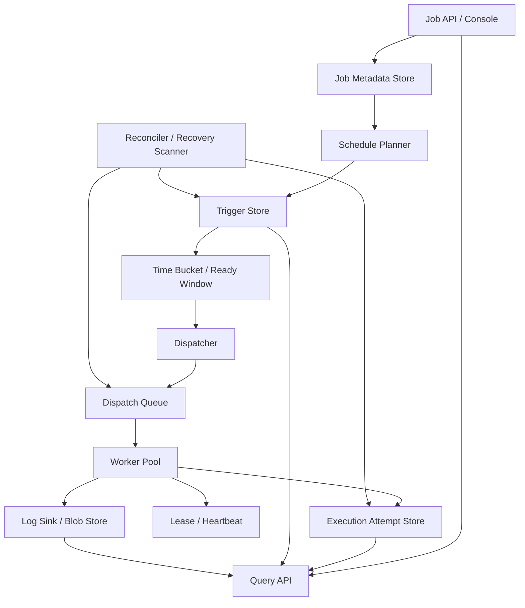

# 系统设计 - 案例 24：任务调度系统真题模拟

## 题目

设计一个分布式任务调度系统，给公司内部业务统一使用。要求支持：

- 一次性延迟任务
- 周期性任务
- 失败重试
- 执行日志和状态查询
- 多个 Worker 水平扩展

先不做：

- 复杂 DAG 工作流
- 大数据批处理平台
- 跨公司级别的多租户计费系统

## 为什么这题值得深讲

任务调度系统看起来像一道“会不会定时器”的题，但它其实很适合检验一个候选人是不是在真正做系统设计。

因为这题会同时考到：

- 时间语义怎么定义
- 触发和执行为什么必须拆开
- 为什么恢复语义比 happy path 更重要
- 为什么平均 QPS 没有意义，真正的问题是时间集中
- 为什么平台层几乎总是 `at-least-once`
- 为什么“状态查询”不是顺手记个日志那么简单

很多回答会停在：

- 每秒扫一遍数据库
- 到时间就发消息给 Worker

这不算错，但也不够好。  
成熟的回答应该能讲清楚：

- 哪些语义必须先收敛
- 哪些对象才是系统真相源
- 什么叫“一次应触发”和“一次实际执行”
- 为什么队列不是全部真相
- 为什么故障恢复必须靠状态机，不是靠“线程记忆”

## 面试官真正想看什么

这题通常在看下面几件事：

1. 你会不会先定义任务、触发实例、执行尝试这三层对象
2. 你能不能把调度触发层和 Worker 执行层拆开
3. 你会不会比较扫表、延迟队列、时间轮这些方案，而不是只报一个名词
4. 你能不能解释为什么 exactly-once 很难，甚至平台层通常不该承诺
5. 你会不会处理整点风暴、misfire、长任务续租这些真实问题
6. 你能不能讲清楚系统在调度器挂了、Worker 挂了、回写失败时如何恢复

## 一开始先别急着设计，先收敛题目语义

这类题里，很多坑不是技术坑，而是语义坑。  
任务调度系统尤其如此，因为“时间”和“执行”本身就有很多隐含选择。

我会先主动澄清下面这些问题：

1. 支持的任务类型是什么，是一次性延迟任务、Cron 周期任务，还是两者都要？
2. 调度精度要求是多少，是分钟级、秒级，还是亚秒级？
3. 任务可能执行多久，会不会有长任务、卡住任务、永远不回调的任务？
4. 是否允许重复执行？业务方是否能提供幂等保证？
5. 失败重试策略是什么，固定次数、指数退避，还是按错误类型区分？
6. 是否需要暂停、恢复、立即执行、补跑、取消等平台能力？
7. 同一个周期任务，如果上一次还没跑完，下一次到了怎么办？
8. 调度表达式是否带时区？是否需要考虑夏令时和本地时间语义？

如果面试官不继续补充，我会主动把题目收敛成下面这个版本：

- 同时支持一次性延迟任务和 Cron 周期任务
- 调度精度目标为秒级到 `10 秒` 级
- Worker 可能执行长任务，平台要支持超时、心跳和续租
- 平台默认语义是 `at-least-once`
- 业务方必须提供幂等能力，平台会传递稳定的幂等键
- 平台支持重试、暂停、恢复、手动补跑、立即执行和状态查询
- 周期任务默认支持可配置的并发策略和 misfire 策略
- 先按单区域高可用设计，不一上来做多区域多主

这里面有几个非常关键的产品/平台选择。

### 选择 1：平台默认承诺 `at-least-once`

为什么？

- 任务调度系统本质上要面对“执行成功但回写失败”的故障窗口
- Worker 失联并不等于任务没执行成功
- 如果平台假装自己天然能做到 exactly-once，后面的租约、超时、重试逻辑都会自相矛盾

所以更现实的收敛方式是：

- 平台负责尽量不丢任务
- 平台接受可能重复触发
- 业务方基于幂等键保证副作用不重复

### 选择 2：周期任务的“重叠语义”必须显式建模

很多人会默认认为：

- 到点了就再跑一次

但如果一个任务每 `5` 分钟跑一次，而单次执行可能跑 `30` 分钟，那这个问题就不是技术细节了，而是业务语义。

常见策略有三种：

- `Allow`：允许重叠并发执行
- `Forbid`：上次没跑完，这次直接跳过或延后
- `CoalesceLatest`：期间错过多次，只保留最新一次

也就是说：

- “长任务遇到下一次触发怎么办”不是实现细节，是平台必须暴露的策略

### 选择 3：周期任务不能无限预生成未来实例

为什么？

- 周期任务理论上是无限未来
- 如果创建任务时就把未来几年 trigger 全展开，存储和维护成本会非常夸张
- 调整 Cron、暂停任务、修改策略时，历史未来实例也会变得很难清理

所以更合理的方式通常是：

- 任务定义长期持久化
- 只滚动生成近未来时间窗口内的触发计划

### 选择 4：时区必须是显式字段，不要偷偷继承机器时间

这也是非常容易被忽略的一点。

如果一个任务定义是：

- “每天早上 9 点跑一次”

那它到底是：

- 按 UTC `09:00`
- 按业务所在地区本地时间 `09:00`
- 还是跟随某个租户/应用自己的时区

如果系统不显式建模 `timezone`，后面遇到：

- 海外业务
- 夏令时切换
- 迁移机房

语义就会彻底混乱。

## 第一步：先判断这是一个什么类型的系统

我会先明确：

- 这不是一个普通 CRUD 系统
- 它是一个“以时间为主索引”的协调系统
- 它同时包含控制面和执行面
- 它的热点往往不是某个 key，而是某个时间点

这意味着：

1. 真正的主矛盾不是“创建任务接口够不够快”，而是“到点触发能不能稳定扛住”
2. 调度器不应该直接干业务执行
3. 状态查询、执行日志、触发分发、Worker 运行时必须拆开
4. 故障恢复不是附加题，而是主设计题
5. 数据模型必须围绕状态机来设计，而不是围绕单表来设计

很多人会把这题答成：

- “有个表存任务，再起个线程轮询”

但如果真正进入生产，最先暴露的问题通常不是“能不能调度”，而是：

- 整点风暴怎么扛
- Worker 挂了怎么办
- 长任务失联怎么办
- 系统重启后怎么知道哪些任务该重试

## 第二步：先做容量估算，不然 trade-off 没锚点

我会主动给一组面试里合理的假设：

- 周期任务定义数 `100 万`
- 每天总触发量 `1 亿`
- 平均每秒触发量约 `1150+`
- 但整点、半点、凌晨批处理会造成明显突刺
- 峰值触发吞吐按平均的 `20 - 50` 倍考虑
- 调度延迟目标：`P99 < 5 秒`
- 执行成功率高，但仍要为失败重试预留 `10% - 30%` 的尝试放大

再往下推几步。

### 触发层的真实压力不是平均值

如果每天 `1 亿` 次触发平均摊开，听起来并不夸张：

- `100000000 / 86400 ≈ 1157`

但真实平台不会这么平。

假设有大量任务都配置成：

- `0 * * * *`
- `0 0 * * *`
- 每小时整点跑

那在某些时间点，可能会出现：

- `30 万 - 100 万` 个任务集中在几十秒内到期

这意味着瞬时触发吞吐可能达到：

- `1 万 - 5 万 / 秒`

所以这题的重点不是平均 QPS，而是：

- 时间桶的局部爆发

### 执行层的压力会转成并发数

如果峰值启动速率是：

- `2 万 / 秒`

平均任务执行时长假设为：

- `3 秒`

那系统需要承接的并发执行量大约就是：

- `6 万`

如果还有一部分任务是长任务，比如：

- 跑 `5 分钟`

那 Worker 运行时管理、租约、心跳、超时回收就会非常关键。  
也就是说：

- 调度系统不能只设计触发吞吐，还要设计执行生命周期

### 执行记录规模也不能忽略

如果每天有 `1 亿` 次 trigger，平均每次 `1.1` 次 attempt：

- 每天执行尝试约 `1.1 亿`

假设每条 attempt 摘要记录连同索引开销约 `500 B - 1 KB`：

- 大约是 `55 GB - 110 GB / 天`

这立刻说明：

- 执行明细日志和查询存储不能毫无分层地塞进一张热表
- 热状态和冷日志要拆

### 一组合理的延迟目标

我会给出类似下面这组目标：

- 创建/更新任务：`P99 < 200 ms`
- 到期触发延迟：`P99 < 5 秒`
- Worker 领取任务延迟：秒级
- 执行状态查询：近实时
- 历史日志查询：允许稍慢

这个目标一旦定下来，后面很多方案就自然出来了：

- 不能长期靠全表扫 due task
- 队列必须承担削峰作用
- 查询链路和调度主链路不能共用一切

## 第三步：先定义不变量，而不是先选技术

这一步和第 13 章一样，非常重要。  
系统成熟不成熟，很多时候就看你会不会先定义不变量。

我会先定义下面这些不变量：

1. `job_definition`、`trigger_instance`、`execution_attempt` 是三层不同对象，不能混为一谈
2. 对于同一个 `job_id + scheduled_time + schedule_version`，最多只能有一个规范的 trigger_instance
3. 对于同一个 trigger，在任意时刻最多只能有一个有效的 active lease
4. 平台允许多次 attempt，但 trigger 的最终状态必须可收敛为成功、失败、取消、跳过等终态之一
5. Worker 心跳丢失只能说明“平台失去确认能力”，不能证明“业务一定没执行”
6. 查询链路允许略有延迟，但调度正确性不能依赖离线补数
7. 队列负责运输和削峰，不应是唯一真相源

这几条不变量背后的意思是：

- “某个时间点本该跑一次”是一件事
- “这个 trigger 实际被执行了几次”是另一件事
- “平台现在认定它成功还是失败”又是第三件事

如果不把这三层拆清楚，后面几乎所有平台能力都会混乱：

- 重试不知道怎么记
- 补跑不知道怎么建模
- 查询不知道查哪个对象
- 恢复时不知道哪些该重推、哪些只是回写慢

## 第四步：不要直接给最终方案，先走一遍真实设计推演

和短链系统一样，我不会一开始就把“最终架构图”扔出来。  
我会像真实设计系统那样，一步步推导。

## 第一轮思考：最朴素的方案是什么

最直观的方案通常是：

- 一张 `job_definition` 表
- 表里有 `next_fire_time`
- 调度线程每秒扫一次 `next_fire_time <= now`
- 扫到后直接执行，或者简单丢给 Worker
- 执行结果回写到同一张表

这个方案有什么好处？

- 简单
- 早期小规模场景能跑起来
- 一张表就能闭环

但规模一上来，问题会马上暴露：

1. 周期任务多了以后，扫表成本很高
2. 整点集中触发时，单次扫描会形成尖峰
3. 调度器自己执行任务，长任务会阻塞触发线程
4. 重试和原始执行混在一起，状态很难解释
5. 调度器崩了以后，恢复边界不清晰

所以第一轮方案可以作为：

- 最小可用系统

但绝不是面试里应该停住的位置。

## 第二轮思考：先把“何时触发”和“如何执行”拆开

既然主问题不是“存任务”，而是“稳定到点触发并执行”，我会先做第一层拆分：

- 调度器负责判断哪些任务 due
- 调度器把 due task 投递到分发队列
- Worker 池负责真正执行业务逻辑

这样带来的好处是：

- 调度器不再被长任务阻塞
- 执行层可以独立扩容
- 队列可以承担削峰缓冲

但拆完后，新的问题会马上出现：

1. 调度器投递成功了，但还没更新 `next_fire_time` 就崩了，怎么办？
2. 队列里的一条消息到底代表“应触发一次”，还是“某次执行尝试”？
3. 重试是重新投同一条消息，还是新建一条消息？
4. 如果业务问“10:00 这次任务到底跑没跑”，该查哪层？

也就是说：

- “调度器 + 队列 + Worker”只是第一层拆分
- 还不够支撑可恢复、可追踪的平台语义

## 第三轮思考：把“应当触发一次”和“实际执行几次”彻底分开

这是任务调度题的核心拐点。

我会引入两个关键对象：

- `trigger_instance`
- `execution_attempt`

它们分别代表：

- 某个任务在某个计划时间点，本应被触发一次
- 这次触发实际发生了第几次执行尝试

例如一个 Cron 任务：

- `job_id = J100`
- 计划在 `10:00` 触发

那就会有一个：

- `trigger_instance(job_id=J100, scheduled_time=10:00)`

如果第一次尝试失败，第二次成功：

- `execution_attempt #1`：失败
- `execution_attempt #2`：成功

这样做之后，很多之前混乱的事情一下就清楚了：

1. 业务查询“10:00 那次到底执行了没”时，可以查 trigger_instance
2. 平台查看每次尝试日志时，可以查 execution_attempt
3. 重试不再覆盖原记录，而是新增新的 attempt
4. 补跑可以显式创建新的 trigger，而不是偷偷复用旧状态

但新的问题是：

- 如果周期任务无限未来，难道要无限生成 trigger_instance 吗

显然不能。

## 第四轮思考：周期任务不能无限展开，只能滚动生成近未来窗口

真实平台里，周期任务通常不会在创建时就生成未来几年所有 trigger。  
更成熟的方式是：

1. 持久化保存 `job_definition`
2. 维护 `schedule_cursor / next_fire_time`
3. 调度规划器只生成一个近未来窗口，比如未来 `5 - 15 分钟` 的 trigger_instance
4. 系统持续向前滚动填充这个窗口

这样做的本质是：

- 长期真相保存在任务定义
- 近未来执行计划物化成 trigger_instance

它的好处是：

- 存储成本可控
- 修改 Cron、暂停任务时更容易生效
- 系统恢复时只需要重建近未来窗口，而不是扫描无限未来

但窗口化之后，问题又会变成：

1. 窗口里的 trigger 如何高效按时间组织
2. 同一秒集中大量 trigger 时怎么扛
3. 调度器切主时如何避免重复物化

这就进入下一轮。

## 第五轮思考：这题真正的热点，不是单个任务，而是时间桶

短链题的热点是 key。  
任务调度题的热点通常是时间点。

也就是说，系统真正要面对的不是：

- 某个 job 很热

而是：

- 某个整点时间桶里，几万甚至几十万任务同时 due

所以我会把 near-future trigger 的组织方式设计成：

- 按时间桶切分
- 再按 shard/hash 切分

例如：

- `bucket_time = 2026-04-18 10:00:00`
- `bucket_shard = hash(job_id) % N`

这样做之后：

- 同一个时间点的任务可以被多个调度 shard 并行分发
- 触发扫描范围从“全量任务”收敛成“当前时间桶 + 当前分片”

同时我会开始考虑：

- 是否对允许抖动的周期任务加 `jitter`
- 是否按优先级做不同 dispatch queue
- 是否给大客户/关键任务单独资源池

因为一旦所有任务都卡在同一个时间点，你的瓶颈就不再是数据库，而是：

- 当前时间桶的 fan-out 能力

## 第六轮思考：不能把 MQ 当成唯一真相源

很多人设计到这里会说：

- 那就把 due task 全都丢进 MQ，不就好了

但如果把 MQ 当成唯一真相源，会有两个大问题：

### 问题 1：状态查询很弱

业务方会问：

- 这次任务是不是已经 dispatch 了？
- 是不是被 Worker 领走了？
- 重试了几次？
- 失败原因是什么？

单靠队列消息很难回答这些问题。  
消息系统擅长的是：

- 传输
- 削峰
- 广播或消费

它不擅长的是：

- 做复杂的任务状态机查询

### 问题 2：恢复语义不完整

如果系统在下面这些窗口里出问题：

- trigger 已生成，但消息还没发出去
- 消息发出去了，但调度器还没来得及标记
- Worker 已经执行完了，但结果还没回写

你需要一个稳定的地方来判断：

- 当前任务应该处于什么状态
- 是否需要补发
- 是否已经终态

所以更成熟的设计是：

- `trigger_instance` 和 `execution_attempt` 放在可查询的真相存储里
- MQ 只是 dispatch transport，不是最终状态真相

## 第七轮思考：故障恢复要依赖状态机、租约和对账，而不是靠“记得自己做过什么”

系统一旦进入生产，真正的难点不是“正常执行”，而是：

- 调度器切主
- Worker 进程崩溃
- 网络分区
- 业务执行成功但回写失败
- 控制台发了取消，但 Worker 还在跑

所以成熟的任务调度系统最后一定会走向：

- 状态机
- 租约
- 心跳
- 对账 / Reconciler

也就是说：

1. 调度器负责把 trigger 推进到可分发状态
2. Worker 负责领取并执行
3. 平台通过 lease 维护“当前谁在跑”
4. Reconciler 定期扫描不一致状态并修复

例如：

- `RUNNING` 但 `lease_expire_at < now`
- `DISPATCHING` 停留过久
- `PENDING_RETRY` 已到 `next_retry_at`

这些都说明：

- 系统不能只靠主流程推进
- 还需要后台恢复流程持续收敛

## 到点触发到底怎么做：几种方案真正怎么比较

前面是演进过程。  
这里我会把几种常见实现方式单独拿出来比较一下。

## 方案 A：数据库扫表

做法：

- 在 `job_definition` 或 `trigger_instance` 上建 `next_fire_time` 索引
- 调度器定时扫 `<= now` 的记录

优点：

- 实现最简单
- 关系型数据库天然支持条件查询和唯一约束
- 早期业务量不大时很好落地

缺点：

- 到点任务多时，扫描压力大
- 周期任务多时，调度器容易反复扫大量接近 due 的数据
- 整点爆发时，对单库或少量分片不友好

适合什么时候：

- 早期系统
- 中低规模平台
- 先做可用闭环，再逐步演进

## 方案 B：Redis ZSET / 延迟队列

做法：

- 用 `score = due_time`
- 到时间后从 ZSET 或延迟队列取出任务并投递

优点：

- 取最近 due task 很方便
- 近未来调度效率比数据库扫表高
- 实现起来比完整时间轮更直观

缺点：

- 持久化和恢复能力通常不如数据库自然
- 需要额外处理重建、主从切换、数据回补
- 如果把它当唯一真相源，状态管理会很别扭

适合什么时候：

- 作为 near-future ready queue
- 和持久化元数据存储搭配使用

## 方案 C：MQ 原生延迟消息

做法：

- 任务直接发成延迟消息
- 到时间由 MQ 投递给 Worker

优点：

- 接入方便
- 调度主链路看起来很简洁

缺点：

- 查询语义弱
- 很难表达复杂状态机
- 修改、暂停、取消、补跑、重试策略很快会变复杂
- 不同 MQ 的延迟精度、容量、消息生命周期约束差异很大

适合什么时候：

- 功能简单
- 更像“延迟通知”，不是统一任务平台

## 方案 D：持久化元数据 + 近未来时间桶/时间轮 + 分发队列

做法：

- 任务定义长期保存在元数据存储
- 调度规划器持续物化近未来 trigger_instance
- time bucket / time wheel 管理最近一段时间的 due trigger
- 到点后分发到 dispatch queue
- Worker 执行并回写 attempt / trigger 状态

优点：

- 恢复、查询、扩展都相对平衡
- 兼顾持久化真相和高效触发
- 很适合统一平台能力建设

缺点：

- 设计复杂度最高
- 需要处理窗口填充、分片、租约、对账、幂等写入

如果这是“公司内部统一任务调度平台”，我会优先选混合方案。  
因为：

- 元数据和状态查询必须有真相源
- 高效触发又不能长期靠全量扫表

## 第五步：把最终高层架构定下来

在前面几轮推演之后，一个比较成熟的架构会长这样：

这里每层分别承担不同职责：

- `Job Metadata Store`：保存任务定义、调度策略、版本等长期真相
- `Schedule Planner`：把周期定义滚动展开成近未来 trigger_instance
- `Trigger Store`：保存某次“应触发”的规范对象及其状态机
- `Time Bucket / Ready Window`：高效组织近未来 due trigger
- `Dispatcher`：把可执行 trigger 投递到队列
- `Dispatch Queue`：削峰和解耦
- `Worker Pool`：实际执行业务逻辑
- `Execution Attempt Store`：记录每次执行尝试
- `Lease / Heartbeat`：维护长任务归属
- `Reconciler`：修复主流程没能完整推进的异常状态

## 第六步：把 API 设计说清楚

如果我要把这题讲得更工程化，我会顺手把 API 也定义一下。

## 创建任务

`POST /v1/jobs`

请求字段建议包括：

- `name`
- `schedule_type`：`ONCE` / `CRON`
- `run_at`：一次性任务的执行时间
- `cron_expr`：周期任务表达式
- `timezone`
- `payload` 或 `payload_ref`
- `retry_policy`
- `timeout_sec`
- `concurrency_policy`
- `misfire_policy`
- `idempotency_key_template`
- `enable_jitter` 可选

返回字段：

- `job_id`
- `status`
- `next_fire_time`
- `created_at`

这里我会特意强调两个字段：

1. `timezone`
   - 不要偷偷继承服务器本地时间
2. `idempotency_key_template`
   - 平台至少要把稳定幂等键传给业务侧

## 暂停 / 恢复任务

`POST /v1/jobs/{job_id}/pause`  
`POST /v1/jobs/{job_id}/resume`

这两个接口很重要，因为它们意味着：

- 调度系统不仅要自动跑，还要支持平台控制动作

## 立即执行

`POST /v1/jobs/{job_id}/run-now`

这个接口通常不是简单“改 next_fire_time”，而是：

- 显式创建一个 `manual trigger_instance`

这样做的好处是：

- 手动执行和计划执行语义清晰分离
- 审计和查询更自然

## 查询任务和执行状态

`GET /v1/jobs/{job_id}`  
`GET /v1/jobs/{job_id}/triggers`  
`GET /v1/triggers/{trigger_id}`  
`GET /v1/triggers/{trigger_id}/attempts`

为什么要拆这些查询？

- 任务定义级别的信息和某次触发级别的信息不是一回事
- 面向控制台和排障时，这种层次非常重要

## 取消任务 / 取消某次触发

`POST /v1/jobs/{job_id}/cancel`  
`POST /v1/triggers/{trigger_id}/cancel`

这里也能体现成熟度：

- 取消未来触发，和取消已经在跑的某次 trigger，不是同一个动作

## 第七步：把核心数据模型说深一点

这一题如果只讲“有个 job 表”，深度会明显不够。  
更成熟的做法是把几个核心表/对象拆清楚。

## 任务定义表

`job_definition`

关键字段：

- `job_id`
- `name`
- `schedule_type`
- `cron_expr` / `run_at`
- `timezone`
- `payload_ref`
- `retry_policy`
- `timeout_sec`
- `concurrency_policy`
- `misfire_policy`
- `status`
- `version`
- `next_schedule_cursor`
- `created_at`
- `updated_at`

几个关键点：

1. `version` 很重要
   - 因为任务被修改后，旧的未来 trigger 可能要识别为过期版本
2. `next_schedule_cursor` 很重要
   - 它表示滚动物化未来 trigger 的进度
3. `payload` 更推荐做引用
   - 大 payload 不要直接塞进热路径行里

## 触发实例表

`trigger_instance`

关键字段：

- `trigger_id`
- `job_id`
- `schedule_version`
- `scheduled_time`
- `source`：`SCHEDULED` / `MANUAL` / `BACKFILL`
- `status`
- `ready_at`
- `attempt_count`
- `max_attempts`
- `next_retry_at`
- `dispatch_shard`
- `created_at`
- `updated_at`

关键索引：

- `UNIQUE(job_id, scheduled_time, schedule_version, source)`
- `INDEX(status, ready_at, dispatch_shard)`
- `INDEX(job_id, scheduled_time)`

这里最关键的是唯一约束。  
因为它能保证：

- 对于同一次规范触发，不会因为切主或重算而生成多个不同 trigger_instance

## 执行尝试表

`execution_attempt`

关键字段：

- `attempt_id`
- `trigger_id`
- `attempt_no`
- `worker_id`
- `lease_token`
- `lease_expire_at`
- `heartbeat_at`
- `status`
- `start_time`
- `end_time`
- `result_code`
- `error_category`
- `error_message`
- `log_ref`

关键索引：

- `INDEX(trigger_id, attempt_no)`
- `INDEX(worker_id, status)`
- `INDEX(status, lease_expire_at)`

这张表的意义是：

- 每次执行都留下可追踪记录
- 不用覆盖旧状态
- 对排障、补偿、SLA 分析都很重要

## 任务日志与结果存储

如果 Worker 有大量日志输出，我不会把全文日志都塞进 `execution_attempt`。  
更合理的方式是：

- `execution_attempt` 只存摘要和引用
- 详细日志写到对象存储或日志系统

原因是：

- 热状态查询要快
- 大日志要便宜
- 两者访问模式完全不同

## Worker 注册与租约

`worker_runtime`

关键字段：

- `worker_id`
- `host`
- `status`
- `last_heartbeat_at`
- `capacity`
- `labels`

这张表不是必须非常复杂，但很有用，因为它能支持：

- 基础运维视角
- Worker 可用性排查
- 按标签路由任务

## 第八步：真正把核心链路拆开讲

真正能拉开差距的，不是报组件，而是把链路拆细。

## 任务创建链路

业务方创建任务时，我会做下面几步：

1. 校验调度参数是否合法
   - Cron 是否可解析
   - 时区是否存在
   - 超时、重试策略是否合理
2. 生成 `job_definition`
3. 初始化 `next_schedule_cursor`
4. 如果是一次性任务，直接生成一个对应的 `trigger_instance`
5. 如果是周期任务，只生成近未来窗口内需要的 trigger

这里要主动说明：

- 周期任务创建成功，不代表未来所有 trigger 都已经落库
- 只是代表它的调度定义被平台接受，后续由 planner 持续展开

## 周期任务滚动推进链路

对于 Cron 任务，我会让 `Schedule Planner` 持续做这件事：

1. 找到需要向前填充窗口的 `job_definition`
2. 从 `next_schedule_cursor` 开始，计算未来若干次触发时间
3. 为窗口内的时间点插入 `trigger_instance`
4. 成功后推进 `next_schedule_cursor`

这个过程里要注意两个点：

### 点 1：插入 trigger 要幂等

因为 planner 可能切主、重试、重复扫描，所以：

- 插入 trigger_instance 不能靠“我认为自己没插过”
- 而是要靠唯一约束保证幂等

### 点 2：更新任务定义要有版本

如果用户修改了 Cron 表达式或者时区：

- 新 trigger 应该基于新版本继续生成
- 旧版本尚未执行的未来 trigger 可以标记为取消或过期

这也是为什么：

- `schedule_version` 这个字段很值得在面试里顺手提一下

## 到点触发链路

当某个时间桶到期时，`Dispatcher` 会做下面几步：

1. 只扫描当前时间窗口、当前 shard 中的 due trigger
2. 把满足条件的 trigger 从 `READY` 推进为 `DISPATCHING`
3. 生成投递事件并写入 `dispatch outbox`
4. 异步 publisher 把 outbox 推到 `Dispatch Queue`
5. 推送成功后，把 trigger 状态更新为 `DISPATCHED`

这里我会专门提一下 outbox。  
因为它能解释一个常见问题：

- “数据库改状态”和“发消息”之间没有分布式事务怎么办？

更稳的做法通常是：

- 把“待发送事件”先持久化成本地 outbox
- 再由异步 publisher 保证最终送达

这样即使 `Dispatcher` 在中途崩了：

- Reconciler 也能根据 outbox 补发

## Worker 领取与执行链路

Worker 从 `Dispatch Queue` 拿到消息后，不应该立刻默认“这次执行合法且唯一”。  
更稳的方式是：

1. 根据 `trigger_id` 读取 trigger 状态
2. 通过条件更新尝试领取执行权
3. 创建新的 `execution_attempt`
4. 写入 `lease_token` 和初始 `lease_expire_at`
5. 开始执行业务逻辑
6. 运行中持续心跳续租
7. 结束后回写 success/failure

这里的关键点是：

- 队列消息到达不代表一定要执行

因为有可能出现这些情况：

- trigger 已经被取消
- trigger 已经终态
- 另一台 Worker 刚刚成功领取了 lease
- 这是重复投递的旧消息

所以 Worker 领取阶段其实也是一个：

- 基于真相源做幂等校验和条件领取

## 失败重试链路

如果执行失败，我不会简单说一句“再投一次消息”。  
更成熟的表达应该是：

1. 当前 `execution_attempt` 标记失败
2. 根据 `retry_policy` 计算是否还能重试
3. 如果还能重试，则更新 `trigger_instance`：
   - `status = PENDING_RETRY`
   - `next_retry_at = now + backoff`
4. 等到 `next_retry_at` 到达，再重新进入 dispatch 流程
5. 每次重试对应新的 `execution_attempt`

这里非常重要的一点是：

- 重试不是新的 trigger
- 它是同一个 trigger 的下一次 attempt

这样语义才对：

- 这是“10:00 那次触发又试了一次”
- 不是“系统凭空产生了一次新的 10:03 任务”

## 长任务与续租链路

如果任务执行时间可能很长，Worker 不能只在开始时写一次“我开始了”。  
更稳的做法是：

- Worker 周期性心跳续租
- 平台用 `lease_expire_at` 判断执行是否失联

例如：

- lease TTL 是 `30 秒`
- Worker 每 `10 秒` 续租一次

如果平台发现：

- 当前 attempt 还在 `RUNNING`
- 但 `lease_expire_at < now`

那就说明：

- 平台已经不能确认这个 Worker 还活着

接下来该怎么做，不是“立刻认为一定失败”，而是：

- 把 trigger 转入待恢复状态
- 由 Reconciler 按策略重新调度

## 取消链路

取消也分两种：

### 取消未来触发

如果任务还没到期：

- 直接把未来 trigger 标记成 `CANCELED`

### 取消已在运行中的任务

这时通常只能做到：

- 平台发取消信号
- Worker 在可中断点主动检查并停止

也就是说：

- 任务取消经常是“协作式取消”，不是平台强杀就一定能成功

这也是为什么在面试里，如果能主动说出：

- “取消是控制语义，不一定是瞬时终止语义”

会显得很成熟。

## 第九步：把几个最容易被追问的难点讲透

## 为什么平台层几乎总是 `at-least-once`

最经典的故障窗口是：

1. Worker 已经把业务执行成功了
2. 但还没来得及回写成功状态
3. Worker 进程崩了，或者网络断了

平台此时能观察到的只有：

- lease 最终超时
- 没有 success 回写

为了不丢任务，平台通常只能：

- 重新调度

这就意味着：

- 从平台视角看，重复执行是无法彻底避免的

所以我会明确告诉面试官：

- 平台默认提供 `at-least-once`
- 想达到业务上的“等效 exactly-once”，必须依赖幂等键和业务侧去重

## 平台怎样帮助业务幂等

平台虽然不能单独保证 exactly-once，但可以帮业务做到更容易幂等：

- 为每个 trigger 提供稳定的 `trigger_id`
- 为每次 attempt 提供 `attempt_id`
- 默认把 `trigger_id` 作为业务幂等键的一部分传递
- 提供去重建议和重试可见性

这能把平台语义从：

- “我保证绝不重复”

变成：

- “我保证给你稳定身份，让你能正确去重”

## 同一周期任务上次没跑完，下一次到了怎么办

这是面试里非常高频的追问。

常见策略有：

### 允许重叠

优点：

- 吞吐最大
- 不阻塞后续触发

缺点：

- 对非幂等任务很危险
- 下游资源更容易被压垮

### 禁止重叠

优点：

- 更安全
- 适合很多批处理、对账、数据修复类任务

缺点：

- 会出现跳过或延后执行

### 合并最新一次

优点：

- 对“只关心最新状态”的任务很友好

缺点：

- 不是所有任务都适用

所以成熟回答通常不是说：

- “平台统一规定成某一种”

而是说：

- 平台把它建模为 `concurrency_policy`
- 默认值可以保守一点，但要允许任务级配置

## Misfire 怎么定义

所谓 misfire，就是：

- 某个任务理论上早该触发
- 但由于系统宕机、暂停、限流等原因，没有按时触发

例如：

- 任务应在 `10:00` 跑
- 系统 `10:05` 才恢复

这时候该怎么办？

常见策略有：

### 立即补跑所有错过的实例

优点：

- 不丢语义

缺点：

- 容易把系统和下游打爆

### 只补跑一次最新实例

优点：

- 更平滑

缺点：

- 牺牲部分精确语义

### 直接跳过

优点：

- 最稳

缺点：

- 对某些核心任务不可接受

所以我会明确说：

- `misfire_policy` 应该是任务定义的一部分
- 不要把它写死在平台实现里

## 整点风暴怎么处理

这题如果不讲整点风暴，会显得很浅。

应对方式通常包括：

### 方法 1：任务定义时加 jitter

对允许轻微漂移的周期任务，可以在：

- `0 * * * *`

这种“整点齐刷刷”任务上增加秒级抖动。

好处：

- 把原来挤在同一秒的流量拉平

但要注意：

- jitter 只能用于业务能接受漂移的任务
- 不能对强时效任务乱抖

### 方法 2：时间桶 + shard 并行分发

也就是前面说的：

- 同一时间点再按 hash 分成多个 shard

好处：

- 触发层可以水平扩展

### 方法 3：Dispatch Queue 削峰

把 due trigger 推到队列后：

- Worker 侧按能力平滑消费

这能避免触发层把执行层一下子打爆。

### 方法 4：优先级隔离

不要让所有任务共享同一套 Worker 池和同一条队列。  
更合理的方式是按：

- 业务优先级
- 资源标签
- SLA 等级

做资源隔离。

### 方法 5：限流和背压

如果下游服务本身扛不住，平台不能只顾着“全都按时发出去”。  
还要考虑：

- 单租户限流
- 单任务限流
- 下游错误率升高时暂缓重试

## 为什么队列确认时机很微妙

这也是非常适合体现深度的点。

如果 Worker：

- 一拿到消息就先 ack，再去执行

那一旦执行过程中宕机，任务可能丢失。

如果 Worker：

- 一定要执行完成后才 ack

那消息系统又可能因为消费超时而重复投递。

这进一步说明：

- 队列的 ack 机制并不能单独提供 exactly-once
- 真正的正确性要靠平台状态机 + 幂等领取 + 业务去重一起完成

## 日志和状态查询为什么不能只靠一张表

业务和运维会查很多不同问题：

- 当前有哪些任务处于失败状态
- 某个 trigger 重试了几次
- 某个 Worker 最近超时任务多不多
- 某类任务过去一周成功率如何

这些查询的访问模式差异非常大。

所以更成熟的做法是：

- 热状态：面向最近状态查询，放在 OLTP 存储
- 尝试摘要：结构化存储，支持排障查询
- 详细日志：日志系统或对象存储
- 统计报表：离线汇总

也就是说：

- “状态查询”不是某个附属小功能
- 它本身就是平台产品力的一部分

## 时间语义里的隐藏坑：时区和夏令时

这部分很多人完全不提，但其实很加分。

例如一个 Cron：

- “每天早上 9 点”

如果任务时区在有夏令时的地区，那么某些日期会出现：

- 本地时间不存在
- 本地时间重复出现两次

平台需要至少做两件事：

1. 任务定义时明确 `timezone`
2. 对 DST 的处理策略要有统一语义

例如可以规定：

- 以 cron parser 的时区语义为准
- 对不存在的时间点跳过
- 对重复出现的本地时间只触发一次或按标准库语义执行

你不一定要把 DST 规则讲得特别细，但只要主动提到：

- “时区和 DST 不能靠默认机器时间”

通常就已经比大多数回答深一层了。

## 为什么我不一上来就做多区域多主

这也是一个很容易跑偏的点。

任务调度系统是公司内部统一平台时，我通常会优先选择：

- 单区域写
- 多可用区高可用
- 调度器和元数据存储做主备或选主

原因是：

- 调度系统的核心难点在状态收敛和时间语义
- 多主多区域会显著放大一致性复杂度
- 如果没有跨洲低延迟的硬需求，先把单区域高可用做好更现实

也就是说：

- 这题的第一优先级通常不是全球多活
- 而是单区域内稳定调度、不乱重试、不丢状态

## 参考答案（面试里可直接说的一版）

如果让我设计一个分布式任务调度系统，我会先把问题拆成三层对象：任务定义 `job_definition`、触发实例 `trigger_instance` 和执行尝试 `execution_attempt`。  
任务定义描述“这个任务应该按什么规则跑”；触发实例描述“它在某个具体时间点本应执行一次”；执行尝试则描述“这次触发实际执行了几次、每次结果如何”。  
这三层对象必须分开，否则重试、补跑、查询和故障恢复都会混乱。

在架构上，我不会让调度器直接执行业务任务，而是拆成 `Schedule Planner + Trigger Store + Dispatcher + Dispatch Queue + Worker Pool`。  
周期任务不会无限预生成未来实例，而是只滚动展开近未来时间窗口内的 trigger；到点后由 Dispatcher 把 trigger 投递到队列，Worker 侧通过条件领取、租约和心跳来执行长任务。  
平台会记录每次 execution attempt，并由 Reconciler 定期修复 `lease 超时`、`dispatch 卡住`、`待重试已到期` 等异常状态。

我会明确告诉面试官，这个系统默认提供的是 `at-least-once`。  
因为在 Worker 执行成功但回写状态失败的窗口里，平台无法安全地断言“已经成功且绝不应重试”。  
所以正确做法不是假装平台天然 exactly-once，而是把 `trigger_id` 作为稳定幂等键传给业务侧，并在平台层把每次 attempt 记录清楚。

如果继续深挖，我会重点讲四件事：  
第一，为什么队列只能做运输，不能做唯一真相；  
第二，为什么整点风暴要用时间桶分片、jitter、队列削峰和优先级隔离；  
第三，为什么周期任务的并发策略和 misfire 策略必须显式建模；  
第四，为什么恢复逻辑一定要依赖状态机、租约和对账，而不是只靠主流程。

## 面试官如果继续追问，我会怎么答

### 追问 1：为什么不能只靠数据库扫表

回答重点：

- 早期能用，但扩展性有限
- 真实瓶颈是整点集中触发，不是平均 QPS
- 到了平台级场景，长期靠 due 扫描成本太高

### 追问 2：为什么要区分 trigger 和 attempt

回答重点：

- 一个“应执行一次”的触发，可能对应多次尝试
- 不拆这层，重试、补跑、查询语义都会混乱

### 追问 3：如果 Worker 执行成功但没回写怎么办

回答重点：

- 平台无法确定业务副作用是否已经落地
- 为了不丢任务，只能按 `at-least-once` 继续重试
- 业务必须靠幂等键保证等效去重

### 追问 4：为什么 MQ 不能当唯一真相

回答重点：

- MQ 擅长运输，不擅长复杂状态查询
- 恢复和控制动作需要稳定可查询的状态机真相源

### 追问 5：整点风暴怎么缓解

回答重点：

- jitter
- 时间桶 + shard
- Dispatch Queue 削峰
- 优先级隔离
- 背压和限流

### 追问 6：长任务怎么处理

回答重点：

- lease + heartbeat
- 超时和失联由 Reconciler 恢复
- 取消通常是协作式取消，不是强杀即成功

### 追问 7：如果用户修改了 Cron 表达式怎么办

回答重点：

- `job_definition` 增加版本号
- 新版本继续生成新 trigger
- 旧版本未执行的未来 trigger 可取消或标记过期

### 追问 8：时区和夏令时怎么处理

回答重点：

- `timezone` 必须是任务定义显式字段
- 调度语义要和 parser/平台规则绑定
- 不能依赖机器本地时区

## 常见失分点

1. 只说“定时扫数据库”，没有把时间语义、执行语义、恢复语义拆开。
2. 不区分 `job_definition`、`trigger_instance`、`execution_attempt`。
3. 让调度器自己直接执行任务。
4. 假装平台层可以轻松做到 exactly-once。
5. 不讲整点风暴、misfire、长任务续租和取消语义。
6. 把 MQ 当成唯一真相源，不讲状态机和恢复。
7. 完全忽略时区、Cron 修改后的版本问题和查询链路。

## 总结

任务调度系统真正考的，不是“会不会写一个定时器”，而是：

`如何围绕时间语义、执行语义和恢复语义，把任务定义、触发实例、执行尝试、分发队列、租约心跳和状态收敛边界设计清楚。`

一个更成熟的回答，通常应该按这个顺序展开：

1. 先收敛题目语义，尤其是 `at-least-once`、并发策略、misfire 和时区
2. 再判断这是一个“时间热点驱动”的协调系统，而不是普通 CRUD
3. 再做容量估算，锚定整点风暴和执行并发
4. 再一步步从朴素方案推到状态机 + 时间桶 + 队列 + Worker + Reconciler 的成熟架构
5. 最后讲 API、数据模型、故障恢复和平台 trade-off

## 自测问题

1. 如果同一个 Cron 任务每分钟触发一次，但单次执行可能跑 20 分钟，你会选择哪种 `concurrency_policy`，为什么？
2. 如果系统宕机 10 分钟后恢复，哪些任务应该补跑、哪些应该跳过，`misfire_policy` 该怎么设计？
3. 如果 Worker 执行成功但在回写前崩溃，你的平台层还能不能承诺 exactly-once？
4. 如果某个时间点有 `50 万` 个 trigger 同时 due，你最担心哪一层先成为瓶颈？
5. 如果用户修改了任务时区或 Cron 表达式，已经生成但尚未执行的未来 trigger 应该如何处理？
