# 系统设计 - 案例 25：支付系统真题模拟

## 题目

设计一个支付系统，服务于电商平台，支持：

- 创建支付单
- 用户发起支付
- 接入多种支付渠道
- 支付结果回调
- 查询支付状态
- 基础退款

先不做：

- 自建清结算网络
- 完整总账与财务系统
- 跨境多币种复杂结算
- 信贷、分期、风控评分模型

## 为什么这题值得深讲

支付系统是系统设计面试里非常经典、也非常容易暴露真实工程深度的一道题。

因为它不是一个单纯的“业务接口”题，而是一个同时受下面几件事约束的系统：

- 正确性优先
- 外部依赖很多
- 状态机复杂
- 幂等要求高
- 审计和追踪要求高

很多人会把支付题答成：

- 订单服务调第三方支付
- 成功后改订单状态

这个思路太浅了。  
真实系统里，支付问题的难点根本不是“怎么调渠道接口”，而是：

- 支付语义和订单语义为什么不能混在一张表里
- 为什么同步返回成功不等于最终支付成功
- 为什么回调、查询、补偿、对账必须同时存在
- 为什么支付系统几乎不能奢望 exactly-once，只能做状态机 + 幂等 + 对账收敛

如果短链系统考的是“极热读路径的主矛盾”，那支付系统考的就是：

- `高价值状态机在不可靠外部世界里的收敛能力`

## 面试官真正想看什么

这题通常在看下面几件事：

1. 你会不会先定义支付系统的范围，而不是把它和订单系统混为一谈
2. 你能不能把 `支付单`、`支付尝试`、`渠道交易`、`回调事件` 分开建模
3. 你会不会区分同步调用结果、异步回调结果和最终账务结果
4. 你能不能讲清状态机、幂等、重试、对账和补偿之间的关系
5. 你会不会比较“只靠回调”与“回调 + 主动查单”的 trade-off
6. 你能不能处理多渠道接入、退款、失败重试和审计追踪

## 一开始先别急着谈表结构，先收敛系统边界

支付系统面试里最常见的坑，是一上来就默认：

- “订单系统里加几个支付字段就行了”

这会立刻把后面的设计做浅。

我会先主动澄清下面这些问题：

1. 这是一个“商户接第三方支付渠道”的支付接入平台，还是一个完整 PSP？
2. 支付场景是单笔订单单次支付，还是支持多次支付尝试？
3. 是否支持多支付渠道，比如支付宝、微信、银行卡？
4. 订单和支付是强绑定，还是支付系统要独立服务多个业务线？
5. 支付成功是否以第三方回调为准？如果回调丢失怎么办？
6. 是否需要退款？退款是全额、部分，还是多次退款？
7. 是否需要支持支付超时、用户取消、重复点击支付？

如果面试官不继续补充，我会主动收敛成下面这个版本：

- 这是电商平台内部的统一支付系统，不自建清算网络
- 支持多个外部支付渠道
- 一个订单只允许最终成功一次支付，但允许有多次支付尝试
- 最终支付结果以“渠道成功 + 我方状态收敛”共同决定
- 回调可能丢失、延迟、重复，必须考虑主动查单和对账
- 支持基础退款

这里有两个边界非常关键。

### 边界 1：支付系统不是订单系统里的一个字段集合

订单系统关心的是：

- 买了什么
- 多少钱
- 履约到哪里

支付系统关心的是：

- 这笔钱有没有被渠道确认扣到
- 有多少次支付尝试
- 哪次尝试成功
- 回调和账是否一致

也就是说：

- 订单状态机和支付状态机不能混成一个状态机

### 边界 2：同步支付结果不是最终真相

用户点击支付之后，前端拿到的同步结果，可能只是：

- 已经拉起支付
- 渠道处理中
- 请求发送成功但最终未知

真正能作为最终收敛依据的，通常是：

- 异步回调
- 主动查单
- 对账结果

这也是为什么支付题如果不讲回调、查单、对账，通常都不算完整。

## 第一步：先判断这是一个什么类型的系统

我会先明确：

- 这是一个高价值、高正确性要求、外部依赖强的交易系统

它和 Feed、短链、搜索最大的不同是：

- 这里不是“慢一点问题不大”
- 这里是“错一次就很贵”

支付系统的首要目标不是“极致吞吐”，而是：

1. 状态不能乱
2. 幂等要稳
3. 失败要可恢复
4. 钱账要可对

这意味着架构上必须优先考虑：

- 状态机
- 审计日志
- 幂等键
- 外部依赖超时与未知态
- 最终一致收敛

## 第二步：先做一轮容量估算，不然讨论会漂

我会给一组面试里合理的假设：

- 平台日订单量 `3000 万`
- 其中需要在线支付的占 `60%`
- 日支付创建量 `1800 万`
- 支付峰值创建 QPS `3000 - 5000`
- 峰值回调 QPS `5000+`
- 峰值支付状态查询 QPS `1 万+`

这组数字最重要的不是总量，而是它说明：

1. 支付创建量不一定是全站最大，但它是高价值链路
2. 回调量和查单量可能并不小
3. 系统不能只设计“正向支付调用”，还必须设计“异步回流路径”

我还会顺手定义几个目标：

- 创建支付单 `P99 < 100 ms`
- 发起支付调用第三方时要有严格超时
- 支付最终结果允许通过回调/查单在秒级到分钟级收敛
- 金额正确性必须强于页面实时体验

## 第三步：先定义不变量，而不是先谈 MQ

这是支付题最关键的一步。

我会先定义下面这些不变量：

1. 同一个支付单最终最多只能成功一次
2. 同一个渠道回调事件被重复投递时，不能重复记账
3. 一个订单不能因为多次支付尝试被重复标记为“已支付”
4. 退款金额累计不能超过原支付成功金额
5. 金额计算必须使用最小货币单位整数，不能使用浮点数

再把它翻译成更工程化的话：

- `success` 是稀缺、不可重复消费的终态
- 所有重复请求、重复回调、重复补偿，都必须被状态机吸收

很多候选人会直接说：

- “加幂等就好了”

但幂等并不是一句口号。  
幂等的前提是：

- 你先把系统对象和状态边界定义清楚

## 第四步：先把对象拆出来，不然后面一定混

支付系统至少要拆成四层对象。

## 对象 1：支付单 `payment_order`

它表示：

- 平台内部的一次“待支付金额请求”

字段示意：

- `payment_order_id`
- `biz_order_id`
- `user_id`
- `amount`
- `currency`
- `status`
- `expire_at`
- `created_at`

这个对象的意义是：

- 平台内部统一表达“这笔业务要支付多少钱”

## 对象 2：支付尝试 `payment_attempt`

它表示：

- 用户或系统对同一支付单发起的一次具体支付尝试

字段示意：

- `attempt_id`
- `payment_order_id`
- `channel`
- `channel_request_id`
- `status`
- `client_context`
- `created_at`

为什么要单独拆 `attempt`？

因为真实支付里经常会出现：

- 用户第一次支付失败
- 又重新选了另一个渠道支付
- 或同一渠道重试了一次

如果不把尝试单独建模，后面就很难解释：

- 哪次尝试成功
- 哪次回调对应哪次支付
- 为什么有多个渠道交易号

## 对象 3：渠道交易 `channel_transaction`

它表示：

- 我方和某个外部支付渠道之间的一次实际交互记录

字段示意：

- `channel`
- `channel_txn_id`
- `attempt_id`
- `channel_status`
- `raw_payload`
- `last_sync_at`

这个对象的价值在于：

- 它是对外部世界的镜像

你可以把它理解为：

- “我们看到的渠道状态”

## 对象 4：回调事件 `payment_callback_event`

它表示：

- 外部渠道推送给我们的事件本身

字段示意：

- `event_id`
- `channel`
- `channel_txn_id`
- `signature_valid`
- `raw_body`
- `received_at`
- `processed_status`

为什么回调事件也要单独存？

因为它有两个很重要的价值：

1. 审计
2. 幂等处理

如果你只把“回调结果改成订单已支付”，而不保留原始回调，很难排障和重放。

## 第五步：不要直接给最终方案，先走一遍真实推演

这题如果想讲深，必须像真的在设计，而不是一上来画大图。

## 第一轮思考：最朴素的方案是什么

最朴素的方案通常是：

1. 订单服务创建订单
2. 订单服务直接调第三方支付渠道
3. 渠道同步返回成功
4. 订单服务把订单改成已支付

这个方案的好处是：

- 简单
- 小团队一开始常常就是这样做的

但它的问题非常快就会暴露：

1. 订单系统和支付渠道强耦合
2. 同步返回成功不代表最终资金状态稳定
3. 回调丢失、超时、重复很难处理
4. 多支付渠道接入会把订单服务变脏
5. 退款、对账、支付尝试都很难扩展

所以这个方案可以是一个起点，但绝不是成熟答案。

## 第二轮思考：先把支付从订单系统里拆出来

第一步优化，我会做的是：

- 新建独立的 `Payment Service`

让订单服务做的事情变成：

1. 创建订单
2. 创建支付单
3. 跳转到支付系统处理

这样带来的好处是：

- 订单系统不直接耦合所有支付渠道
- 支付状态机独立演进
- 后续退款、对账、多渠道接入有了统一入口

但这时仍然有问题：

- 如果支付系统里只建一张 `payment_order` 表，仍然不足以表达多次尝试

## 第三轮思考：必须拆出 payment_attempt

为什么？

因为支付不是一个“单次同步 RPC 结果”，而是：

- 用户可能失败重试
- 用户可能切换支付渠道
- 用户可能关闭页面后又回来
- 渠道可能第一次返回超时，后来又异步成功

一旦这些现实场景出现，只有一张 `payment_order` 表就会变得非常拥挤和含混。

所以自然会逼出：

- `payment_order`
- `payment_attempt`

这两个对象的拆分。

## 第四轮思考：同步返回为什么永远不够

支付系统和短链、Feed 最大的不同之一是：

- 外部渠道不可控

你调渠道接口时，可能遇到：

- 请求超时
- 渠道处理中
- 用户已完成支付，但你同步响应没拿到
- 渠道返回成功，但后续回调延迟

这说明：

- 同步调用结果不能直接当最终真相

这时系统自然会演进出：

1. 回调处理链路
2. 主动查单链路
3. 对账链路

如果一个支付设计没有这三层中的至少两层，它大概率是不完整的。

## 第五轮思考：为什么只靠回调仍然不够

很多人第二层设计会进步到：

- “有回调了，回调成功就改支付状态”

但这仍然不够稳，因为现实里：

- 回调可能丢
- 回调可能重复
- 回调可能伪造
- 回调顺序可能异常

所以更成熟的方案通常是：

- `回调 + 主动查单 + 对账`

三者配合收敛。

这不是过度设计，而是支付系统和外部依赖打交道的基本现实。

## 第六步：先把状态机讲清楚

支付题如果状态机讲不清，后面所有幂等和补偿都会飘。

## payment_order 状态机

一个比较合理的简化版是：

- `CREATED`
- `PAYING`
- `PAID`
- `FAILED`
- `EXPIRED`
- `CLOSED`
- `REFUNDING`
- `REFUNDED`

其中：

- `CREATED`：支付单刚建立，还没发起真实尝试
- `PAYING`：已有有效支付尝试在进行
- `PAID`：最终支付成功
- `FAILED`：某次尝试失败，但不一定意味着整个支付单关闭
- `EXPIRED/CLOSED`：超过支付时间或业务主动关闭

这里我会主动提醒：

- `FAILED` 和 `CLOSED` 不是一个意思

因为：

- 一次尝试失败，不代表整笔支付永远失败

## payment_attempt 状态机

每次尝试更适合单独建状态：

- `INIT`
- `REQUEST_SENT`
- `PENDING`
- `SUCCEEDED`
- `FAILED`
- `CANCELED`
- `UNKNOWN`

这里 `UNKNOWN` 很重要。  
因为外部渠道超时或网络断开时，系统最真实的状态往往不是“失败”，而是：

- “我不知道”

如果你把 unknown 直接当失败，后面很容易重复扣款或重复拉起。

## 第七步：把高层架构定下来

```mermaid
flowchart TD
    A["Order Service"] --> B["Payment Service API"]
    B --> C["Payment Order Store"]
    B --> D["Payment Attempt Store"]
    B --> E["Channel Adapter Layer"]
    E --> F["Alipay / WeChat / Card Channel"]

    F --> G["Callback Receiver"]
    G --> H["Raw Callback Store"]
    H --> I["Callback Processor"]
    I --> C
    I --> D
    I --> J["Outbox / Event Bus"]
    J --> K["Order Service Update"]

    L["Query / Polling Worker"] --> F
    L --> C
    L --> D

    M["Reconciliation Worker"] --> N["Channel Statement / Bill"]
    M --> C
    M --> D
```

## 第八步：把创建支付单链路讲细

### 创建支付单不等于立刻调渠道

这一步我会特别讲清楚。

订单系统创建支付单时，我会先做：

1. 校验业务订单状态是否允许支付
2. 固定本次支付金额和币种
3. 生成 `payment_order`
4. 记录幂等键

为什么金额要固定？

- 因为支付单一旦创建，金额不应该在支付过程中被随意改动

也就是说：

- 支付系统不应该依赖订单系统每次实时再告诉它“现在该付多少钱”

更成熟的做法是：

- 创建支付单时把金额快照固定下来

这本质上和订单快照的思想是一致的。

## 第九步：发起支付尝试链路怎么讲

用户点击“去支付”后，系统通常会：

1. 创建一条 `payment_attempt`
2. 分配内部 `attempt_id`
3. 选择支付渠道
4. 调用渠道适配层
5. 获得拉起参数、二维码、跳转链接，或进入处理中状态

这里面最重要的不是“怎么调接口”，而是两个细节。

### 细节 1：attempt 必须幂等

如果用户连点两次支付按钮，或者前端超时重试：

- 不能生成两笔无法关联的尝试

所以我会要求：

- 前端提交幂等键
- 或者对某段时间内同一支付单同一渠道做去重保护

### 细节 2：同步结果不应直接等于支付成功

很多渠道在同步发起支付时，只会返回：

- 请求已接受
- 用户待确认
- 扫码链接已生成

这类状态更接近：

- `PENDING`

而不是：

- `SUCCEEDED`

## 第十步：回调链路才是支付系统的主战场

支付系统和普通业务系统最大的差别之一，就是：

- 你的结果有很大一部分来自外部世界的回流

所以我会把回调链路设计得非常认真。

### 回调处理流程

1. 接收渠道回调
2. 校验签名和来源
3. 先把原始回调落库
4. 做事件去重
5. 根据 `channel_txn_id` 找到对应 `attempt`
6. 做状态迁移
7. 如果支付单最终成功，则写 outbox 事件通知订单系统

这里我要强调两个原则。

### 原则 1：先存原始回调，再处理业务状态

原因是：

- 便于审计
- 便于重放
- 回调处理失败时不会丢原始证据

### 原则 2：回调处理必须幂等

因为第三方回调重复发送是常态，不是异常。

幂等的常见做法是：

- 回调事件表去重
- 状态机只允许合法单向迁移
- 对已成功支付单再次回调成功时，不重复推进下游

## 第十一步：为什么只靠回调不够，还要主动查单

真实世界里，你会经常遇到这种情况：

- 你发起支付超时
- 用户其实支付成功了
- 但回调暂时没到

这时如果系统只会“等回调”，就会长期卡在不确定状态。

所以我会设计：

- `Polling / Query Worker`

它负责对：

- 长时间 `PENDING`
- `UNKNOWN`
- 高价值支付单

做主动查单。

这里的 trade-off 是：

- 查单会增加外部调用成本
- 但它能大幅降低“未知态长时间悬挂”的风险

所以不是每一笔都高频查，而是：

- 针对异常状态和关键状态做策略化查单

## 第十二步：为什么到这里还不够，还要对账

这是支付题最容易少讲的一层，也是最能拉开差距的一层。

回调和查单都只是：

- 在线收敛机制

但支付系统最终还需要：

- 离线或准实时对账

因为可能仍然存在：

- 回调丢失
- 状态更新失败
- 订单通知失败
- 渠道侧账单与我方状态不一致

所以我会有一个：

- `Reconciliation Worker`

它会拿：

- 渠道账单
- 我方支付单
- 我方 attempt

做对比，找出：

- 渠道成功但我方未成功
- 我方成功但渠道未成功
- 金额不一致
- 退款状态不一致

然后进入：

- 告警
- 补偿
- 人工处理

如果一个支付系统回答里没有对账，通常很难显得完整。

## 第十三步：把渠道适配层讲成真正的系统，而不是一层 interface

很多人会说：

- “做一个支付渠道接口，下面实现支付宝、微信就行”

这句话方向没错，但太浅。

更真实的设计是：

- 渠道适配层负责把内部统一模型映射成外部渠道差异化协议

这里的“统一”不要理解成：

- 所有渠道完全等价

因为真实世界里，不同渠道在下面这些方面差异很大：

- 同步返回语义
- 回调字段
- 签名方式
- 支付超时时间
- 退款能力
- 查单频率限制

所以我会明确说：

- 统一的是平台内部对象模型和状态机
- 不统一的是外部渠道原始语义

这能避免一种很常见的过度抽象：

- 为了“统一接口”，把渠道差异硬抹掉

## 第十四步：退款为什么值得单独讲

退款不是支付成功后的一个小尾巴。  
它本质上又是一条独立的状态机。

我会先收敛退款范围：

- 支持全额和部分退款
- 支持多次退款
- 退款最终不能超过原支付金额

然后定义对象：

- `refund_order`
- `refund_attempt`

为什么退款也要有自己的对象？

因为退款也有：

- 发起
- 渠道处理中
- 成功
- 失败
- 回调
- 对账

你不能只在 `payment_order` 上加一个 `refunded=true` 就结束。

### 退款最重要的不变量

1. 累计退款金额不能超过原支付成功金额
2. 同一退款请求不能重复执行
3. 渠道退款结果也需要回调/查单/对账收敛

## 第十五步：把 API 设计说清楚

### 创建支付单

`POST /v1/payment-orders`

请求字段：

- `biz_order_id`
- `user_id`
- `amount`
- `currency`
- `expire_at`
- `idempotency_key`

### 发起一次支付尝试

`POST /v1/payment-orders/{payment_order_id}/attempts`

请求字段：

- `channel`
- `client_context`
- `idempotency_key`

返回：

- `attempt_id`
- `redirect_url / qr_code / sdk_params`
- `attempt_status`

### 查询支付单状态

`GET /v1/payment-orders/{payment_order_id}`

### 渠道回调入口

`POST /v1/payment-callbacks/{channel}`

### 发起退款

`POST /v1/payment-orders/{payment_order_id}/refunds`

## 第十六步：金额、精度和审计，这些小点必须主动补

支付系统里，很多“很基础”的点其实非常重要。

### 金额用整数，不用浮点数

例如：

- `100.23 元` 存成 `10023 分`

这是支付系统必须养成的基本习惯。

### 币种固定

即使先不做多币种，也应该在模型里保留：

- `currency`

### 审计日志要全

至少要能追踪：

- 谁创建了支付单
- 谁发起了支付尝试
- 哪个渠道回调了什么
- 状态从什么变到什么

支付系统没有审计，等于系统没闭环。

## 第十七步：把异常路径讲进去，不然深度还是不够

## 场景 1：调用渠道超时

系统最真实的状态通常不是：

- 失败

而是：

- `UNKNOWN`

后续需要：

- 查单
- 等回调
- 或等待对账收敛

## 场景 2：回调重复

处理方式：

- 原始回调落库
- 去重
- 状态迁移幂等

## 场景 3：支付成功了，但通知订单系统失败

这时不能依赖同步 RPC 重试。  
更成熟的做法是：

- 支付系统内部落状态成功后写 outbox
- 后台异步可靠通知订单系统

这样就把：

- “支付成功”

和：

- “订单系统成功感知”

拆开了。

## 场景 4：订单系统超时关闭了订单，但支付晚到了

这是支付系统里非常现实的竞态。

我会先定义业务语义：

- 订单超时关闭后，晚到支付如何处理？

常见做法通常是：

- 支付系统仍然如实记录渠道成功
- 再由上层业务决定是自动退款，还是转人工处理

这里不要拍脑袋说“直接当失败”。  
渠道的钱可能已经扣走了，你不能因为业务希望失败，就假装支付没成功。

## 第十八步：为什么支付系统通常不能承诺 exactly-once

这是这题最值得主动讲清楚的结论之一。

典型故障窗口：

1. 我方调用渠道成功
2. 渠道也成功扣款
3. 但我方写状态或通知下游前崩了

这时你很难保证“所有系统只看到一次成功”。  
更现实的语义是：

- `at-least-once event delivery`
- `idempotent state transition`
- `reconciliation for final correctness`

也就是说：

- 支付系统不是靠 exactly-once 保证正确
- 而是靠状态机、幂等、查单、对账和补偿收敛正确

## 第十九步：如果继续演进，这个系统会怎么长大

### 阶段 1：单业务线支付接入

- 只有一个订单系统
- 只有一两个支付渠道

### 阶段 2：独立支付平台

- 服务多个业务线
- 多渠道适配统一
- 引入 attempt、callback、refund 模型

### 阶段 3：加强异步回流和对账

- 回调落库
- 查单 worker
- 对账 worker

### 阶段 4：引入更完整的资金账和结算系统

- 账务分层
- 清结算
- 商户分账

这里我会主动说明：

- 本题先不展开总账和结算
- 但支付系统设计时要给这层留边界

## 面试里我会怎么讲最终方案

如果让我设计一个电商平台的支付系统，我不会让订单服务直接去对接第三方渠道，而会先把支付能力独立成一个统一的 Payment Service。  
因为订单系统关心的是业务订单，支付系统关心的是资金状态，两者虽然关联，但状态机和外部依赖完全不同。  
我会先在支付系统里建立 `payment_order`，表示这笔业务要支付多少钱，再建立 `payment_attempt`，表示用户针对同一支付单的某一次具体支付尝试。

在正向链路上，订单服务先创建支付单，支付系统固定金额和币种，随后用户发起某个渠道的支付尝试。  
支付系统通过渠道适配层调用外部渠道，但我不会把同步调用结果直接当成最终支付成功，因为真实世界里会有超时、处理中和未知态。  
所以真正的收敛机制应该是三层：渠道回调、主动查单和对账。  
回调负责主流成功路径，查单负责处理中和未知态收敛，对账负责兜底发现遗漏和不一致。

状态上我会把 `payment_order` 和 `payment_attempt` 分开建模，并保证支付成功只能消费一次。  
回调先落原始事件，再做签名校验、幂等去重和状态迁移；  
支付单成功后，通过 outbox 可靠通知订单系统更新业务状态。  
退款我也不会挂一个布尔字段，而会单独建退款对象和状态机，并保证累计退款金额不超过原支付金额。

如果继续深挖，我会重点讲三个点：  
第一，为什么支付系统一定要把支付单和支付尝试拆开；  
第二，为什么同步结果永远不够，必须有回调、查单和对账；  
第三，为什么支付系统正确性不是靠 exactly-once，而是靠幂等状态机和最终对账收敛。

## 面试官如果继续追问，我会怎么答

### 追问 1：为什么支付系统不能只靠回调

回答重点：

- 回调可能丢、重复、延迟、伪造
- 必须有主动查单和对账兜底

### 追问 2：为什么一个支付单还要有 payment_attempt

回答重点：

- 用户可能多次尝试
- 可能换渠道
- 要能区分哪次成功、哪次失败

### 追问 3：如果同步调用渠道超时了怎么办

回答重点：

- 进入 `UNKNOWN` 或 `PENDING`
- 等回调或主动查单
- 不能直接假定失败

### 追问 4：订单超时关闭后支付成功了怎么办

回答重点：

- 渠道成功必须如实记录
- 业务层再决定自动退款或人工处理
- 不能因为业务想失败就假装支付没成功

### 追问 5：为什么支付系统还需要对账

回答重点：

- 在线链路不可能覆盖所有故障窗口
- 对账是最终发现和修正不一致的手段

### 追问 6：为什么金额不能用浮点数

回答重点：

- 浮点误差不可接受
- 统一用最小货币单位整数

## 常见失分点

1. 把支付系统答成“订单服务调第三方支付接口”。
2. 不区分支付单和支付尝试。
3. 把同步返回结果直接当最终成功。
4. 不讲回调落库、幂等和签名校验。
5. 不讲查单和对账。
6. 退款只说一句“把钱退回去”。
7. 以为 exactly-once 是支付正确性的核心。

## 总结

支付系统真正考的，不是“会不会对接一个第三方支付渠道”，而是：

`如何在一个受外部不确定性强约束的环境里，用支付单、支付尝试、状态机、回调、查单和对账，把高价值资金状态最终收敛正确。`

一个更成熟的回答，通常应该按这个顺序展开：

1. 先收敛支付系统边界
2. 再定义 payment_order / payment_attempt / callback_event
3. 再从朴素同步调用推到回调 + 查单 + 对账
4. 最后讲状态机、退款、幂等和异常路径

## 自测问题

1. 如果面试官要求“一个订单允许组合支付”，你最先要改哪几个对象模型？
2. 如果某个渠道回调极不稳定，但查单稳定，你会如何调整收敛策略？
3. 如果订单系统和支付系统对“超时关闭”语义有冲突，你会如何重新划边界？
4. 如果后面要接入完整账务总账，你会把哪些对象保留为支付域边界，哪些下沉到账务域？
