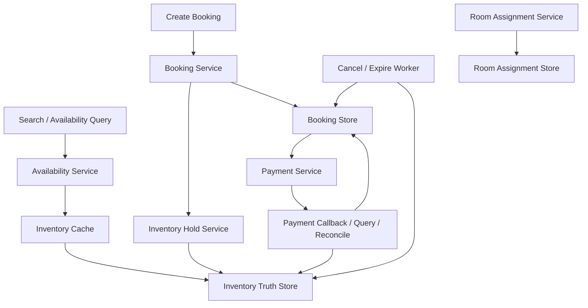

# 系统设计 - 案例 26：酒店预订系统真题模拟

## 题目

设计一个酒店预订系统，支持：

- 查询酒店和房型库存
- 选择入住/离店日期
- 创建预订订单
- 锁定房态
- 支付确认
- 超时未支付自动释放
- 订单取消

先不做：

- 复杂收益管理系统
- 航旅打包套餐
- 国际多时区多币种复杂结算
- 会员积分与营销推荐

## 为什么这题值得深讲

酒店预订题是系统设计面试里非常容易被答浅的一道题。  
很多人会把它答成：

- “就是库存系统”

这其实只答对了一半。

酒店预订真正难的地方在于，它同时混合了三类资源问题：

- 可数库存
- 唯一资源
- 时间段资源

也就是说，它既不像普通电商 SKU 那么简单，也不像演唱会座位那样只有唯一资源冲突。  
它真正的难点在于：

- 房型库存到底是按房间卖，还是按房型卖
- 预订跨多个晚上的时候，库存如何扣减
- 房态锁定和支付成功之间的边界怎么划
- 取消、改期、晚到支付、并发抢房和 overbooking 该怎么处理

如果支付系统考的是：

- `高价值状态机在不可靠外部世界里的收敛能力`

那酒店预订系统考的就是：

- `时间区间资源在高并发和复杂业务语义下的正确性边界`

## 面试官真正想看什么

这题通常在看下面几件事：

1. 你会不会先定义“卖的是房型库存还是具体房间”
2. 你能不能识别这是一个“跨日期区间资源”问题，而不是单日 SKU 减库存
3. 你会不会把库存查询、锁定、支付、确认入住几个阶段分开
4. 你能不能讲清 overbooking 是产品策略，不是数据库 bug
5. 你会不会处理超时释放、取消、改期、并发冲突和补偿
6. 你能不能比较“按房型聚合库存”与“按具体房间预分配”的 trade-off

## 一开始先别急着设计表，先收敛业务语义

酒店预订系统最容易答歪的地方，是根本没有先定义卖的是什么。

我会先主动澄清下面这些问题：

1. 平台卖的是“房型 + 日期库存”，还是用户能直接选具体房号？
2. 预订是按晚计算，还是按入住时刻到离店时刻精确到小时？
3. 是否允许 overbooking？如果允许，谁决定阈值？
4. 支付前是否必须锁房？锁房保留多久？
5. 取消政策是什么，是否允许免费取消到某个时间点？
6. 是否支持改期？改期是取消重订，还是原订单原地变更？
7. 查询库存需要多实时？允许几秒延迟吗？

如果面试官不继续补充，我会主动收敛成下面这个版本：

- 用户购买的是“房型在某个日期区间内的一间房晚资源”
- 不直接让用户选具体房号
- 库存按“房型 + 日期”维度管理
- 支付前需要锁定库存
- 锁定保留 `15 分钟`
- 默认不做复杂 overbooking，但预留策略接口
- 改期先按“取消 + 重建”处理，不直接在原订单上复杂修改

这里有两个非常关键的边界。

### 边界 1：卖的是房型库存，不是具体房号

大多数 OTA 或酒店预订前台售卖的其实是：

- 大床房
- 双床房
- 豪华房

而不是：

- 1808 房间

这意味着在预订阶段，系统更像在管理：

- `room_type x date`

的库存，而不是具体唯一房间。

### 边界 2：资源是跨日期区间的

电商 SKU 卖的是：

- 一件商品

酒店卖的是：

- 连续多个晚上的同一房型库存占用

这意味着你不能只扣一个数，而是要同时扣：

- 入住日
- 入住日 + 1
- ...
- 离店日前一天

这就是这题和普通库存题最大的结构性区别。

## 第一步：先判断这是一个什么类型的系统

我会先明确：

- 这是一个高一致性资源预订系统
- 本质不是“商品卖一件少一件”，而是“时间区间资源冲突”

它和普通电商库存相比，多了两个难点：

1. 一个预订会同时占用多个日期切片
2. 查询和下单看到的是聚合房型库存，而最终入住时又可能映射到具体房间

这意味着架构上要同时处理两层抽象：

- 销售库存层
- 履约分房层

如果这两层混在一起，系统会非常难讲清。

## 第二步：先做一轮容量估算，不然库存设计没有锚点

我会给一组面试里合理的假设：

- 平台覆盖 `5 万` 家酒店
- 平均每家酒店 `10` 个房型
- 每个房型未来 `365` 天可售
- 峰值库存查询 QPS `5 万+`
- 峰值下单创建 QPS `2000 - 5000`
- 平均入住 `2` 晚
- 热门节假日和热门城市会出现明显热点

先推几个很重要的数量级。

### 房型-日期库存格子规模

如果：

- `5 万 酒店 * 10 房型 * 365 天`

那未来一年需要维护的库存格子数量大约是：

- `1.825 亿`

这说明：

- `room_type_inventory_by_date` 会是一张非常大的核心表
- 但每个单元格的访问模式很简单：按主键点查和条件更新

### 查询和预订的流量差异

真实酒店系统里：

- 查库存的人远多于真下单的人

这说明：

1. 查询链路必须缓存化
2. 锁房和下单链路必须正确性优先

这其实和短链、搜索有一点像：

- 读路径和写路径目标完全不同

## 第三步：先定义不变量，不然库存和订单关系会乱

我会先定义下面这些不变量：

1. 任意日期、任意房型，`sold + reserved <= sellable_inventory`
2. 一笔预订订单在支付成功前，只能持有临时锁定库存
3. 超时未支付的锁定库存最终必须释放
4. 取消订单后，对应日期区间的库存最终必须回补
5. 退款、取消、改期都不能让同一份库存被重复释放

如果允许 overbooking，还要额外定义：

6. 超卖不是 bug，而是受控策略；其上限必须显式配置，而不是因为并发错误发生

这最后一句非常关键。  
因为现实酒店系统里确实可能允许超售，但那是：

- 收益管理策略

而不是：

- 系统把库存扣错了

## 第四步：先把核心对象拆出来

酒店预订系统至少要拆下面几层对象。

## 对象 1：酒店与房型

`hotel`

字段示意：

- `hotel_id`
- `city`
- `status`

`room_type`

字段示意：

- `room_type_id`
- `hotel_id`
- `capacity`
- `status`

这层是供给定义层。

## 对象 2：房型日期库存

`room_type_inventory_by_date`

字段示意：

- `hotel_id`
- `room_type_id`
- `biz_date`
- `sellable_inventory`
- `reserved_inventory`
- `sold_inventory`
- `overbooking_limit`

这是这题最核心的资源真相源之一。

它回答的是：

- 某个房型在某一天还能卖多少

## 对象 3：预订订单

`booking_order`

字段示意：

- `booking_id`
- `user_id`
- `hotel_id`
- `room_type_id`
- `check_in_date`
- `check_out_date`
- `guest_count`
- `amount`
- `status`
- `expire_at`

这个对象表达的是：

- 用户对某个日期区间的一次预订意图

## 对象 4：库存锁定记录

`inventory_hold`

字段示意：

- `hold_id`
- `booking_id`
- `hotel_id`
- `room_type_id`
- `date_list`
- `status`
- `expire_at`

为什么要单独有 hold？

因为：

- 锁房和最终卖出不是同一个状态

如果你只在订单表里放一个 `reserved=true`，后面释放、补偿、排障都会很乱。

## 对象 5：入住分房记录

`room_assignment`

字段示意：

- `booking_id`
- `hotel_id`
- `room_id`
- `assigned_at`

这个对象的价值在于：

- 它把“卖房型”和“分具体房间”拆开

这是很多人容易混掉的地方。

## 第五步：先走一遍真实设计推演，不直接给最终图

这题如果想讲深，必须先把几个朴素方案推翻。

## 第一轮思考：把酒店房型当成普通 SKU 行不行

最朴素的想法是：

- 大床房库存 20
- 用户下单就减 1

这个方案有什么好处？

- 简单
- 很像电商库存

但它立刻会遇到一个大问题：

- 酒店预订是跨日期区间的

用户订：

- `5 月 1 日入住`
- `5 月 3 日离店`

实际上占用的是：

- `5 月 1 晚`
- `5 月 2 晚`

所以你不能只减一个总库存。

也就是说：

- 酒店库存不是 `room_type -> stock`
- 而是 `room_type x date -> stock`

## 第二轮思考：那就按房号卖行不行

另一种极端是：

- 一开始就为每次预订分配具体房号

这个方案的好处是：

- 唯一资源冲突更直观
- 不容易超卖

但问题也很明显：

1. 前台销售阶段并不总能确定最终房号
2. 酒店运营会临时换房、维护、升级
3. 用户买的是房型承诺，不是具体房间承诺

所以对于大多数在线预订平台，太早绑定具体房间反而会让系统更僵硬。

这就逼出一个很关键的建模结论：

- 销售阶段先卖“房型日期库存”
- 履约阶段再做“具体房间分配”

## 第三轮思考：只管理已售库存够不够

如果用户下单后还没支付，我们是不是直接把库存减掉？

这又会遇到支付链路的老问题：

- 用户可能超时不付
- 用户可能支付失败
- 用户可能重复尝试支付

所以更成熟的模型一定会拆成：

- `available`
- `reserved`
- `sold`

也就是：

- 可售
- 锁定
- 已售

这和秒杀、支付题在状态机上的思路是一致的。

## 第六步：确定核心状态机

### booking_order 状态机

我会给一个合理的简化版：

- `CREATED`
- `HOLDING`
- `PENDING_PAYMENT`
- `CONFIRMED`
- `CANCELED`
- `EXPIRED`
- `CHECKED_IN`
- `COMPLETED`

这里最重要的是：

- `HOLDING / PENDING_PAYMENT`
- `CONFIRMED`

两者必须分开。

因为：

- 支付前只是锁住库存
- 支付成功后才真正把锁定转为已售

### inventory_hold 状态机

我会定义成：

- `ACTIVE`
- `RELEASED`
- `CONSUMED`
- `EXPIRED`

这里 `CONSUMED` 的意思是：

- 锁定库存已经被支付成功消化成已售

## 第七步：把高层架构定下来



## 第八步：查询链路和下单链路必须分开讲

酒店系统如果只讲“下单怎么扣库存”，还是不够。

## 查询链路

查询库存时，用户通常不会查具体某个库存格子，而是查：

- 某城市、某酒店、某房型，在某个入住/离店区间是否可订

这意味着查询时要做的事通常是：

1. 找到这个区间覆盖的所有日期
2. 读取对应 `room_type_inventory_by_date`
3. 取其中最小可售值，判断是否还能订

也就是说：

- 一个区间查询，本质上是多个日期格子的聚合最小值问题

这会直接带来一个设计重点：

- 查询链路非常适合缓存
- 但缓存只适合近实时，不适合当真相源

## 下单链路

用户点击预订时，才进入真正的高一致性路径：

1. 幂等校验
2. 再次校验日期区间库存
3. 为区间内每个日期执行锁定
4. 创建 `booking_order`
5. 创建 `inventory_hold`
6. 返回“待支付”

这里一定要主动说一句：

- 查询时看到可订，不代表创建订单时一定还能抢到

因为查询链路本来就是：

- 近实时读

而创建订单才是：

- 真正争抢资源的同步闭环

## 第九步：最关键的部分，如何锁定跨日期区间库存

这是整道题的主心骨。

### 锁定逻辑的本质

如果用户订：

- `5/1 入住`
- `5/4 离店`

那系统实际上要锁：

- `5/1`
- `5/2`
- `5/3`

这意味着只要其中任意一天库存不足，这次预订就必须失败。

### 最直接的实现思路

对区间内每个日期格子执行条件更新：

```sql
update room_type_inventory_by_date
set sellable_inventory = sellable_inventory - 1,
    reserved_inventory = reserved_inventory + 1
where hotel_id = :hotel_id
  and room_type_id = :room_type_id
  and biz_date = :date
  and sellable_inventory >= 1;
```

但问题在于：

- 这是多行、多日期更新

如果更新到一半失败怎么办？

这就会逼出两个处理方向。

## 方案 A：数据库事务里锁整个日期区间

优点：

- 语义直接
- 成功就是全部成功，失败就是全部失败

缺点：

- 区间越长，事务越重
- 热门房型和热门日期下竞争激烈

## 方案 B：先逐日锁定，再做补偿回滚

优点：

- 更灵活

缺点：

- 实现复杂
- 失败补偿要非常小心

如果是面试场景，我通常会先给出更稳的回答：

- 在单酒店、单房型、区间长度可控的前提下，优先采用数据库事务保护一整个区间锁定

因为这更容易解释正确性边界。  
如果面试官继续追大规模，我再往“分段锁定 + 补偿”演进。

## 第十步：支付和房态之间的边界怎么讲

酒店预订和支付题天然会连起来。

我会明确语义：

- 创建预订订单时先锁库存
- 支付成功后把锁定库存转成已售
- 超时未支付则释放锁定库存

这和秒杀库存题类似，但酒店场景多了一个“跨日期区间”。

### 为什么不能支付成功时再扣库存

因为那样会导致：

- 用户支付成功后却抢不到房

这是非常糟糕的业务体验。  
所以更合理的方式一定是：

- 先锁后付

### 锁定超时时间怎么定

如果锁太久：

- 库存周转低

如果锁太短：

- 用户支付体验差

所以这个值通常是：

- 产品策略
- 但系统必须支持自动释放

## 第十一步：自动释放和取消为什么不能只靠扫表一句带过

酒店预订里，超时未支付和用户取消都意味着：

- 要把多晚库存回补

所以我会明确设计：

- `Expire / Cancel Worker`

它负责：

1. 找到过期未支付订单
2. 将 `inventory_hold` 从 `ACTIVE` 迁移到 `EXPIRED/RELEASED`
3. 把区间内每一天的 `reserved_inventory` 减回去、`sellable_inventory` 加回去

这里依旧要强调：

- 释放也必须幂等

因为：

- 定时任务可能重跑
- 人工取消和超时释放可能打架

## 第十二步：overbooking 该怎么讲，不要回避

酒店系统和普通库存系统的一个真实差异是：

- 有些酒店业务上确实允许超售

比如：

- 预期会有一定 no-show
- 收益管理希望多卖一点

这里非常关键的一点是：

- overbooking 是显式业务策略，不是并发错误

所以如果面试官问到，我会这样回答：

### 不做 overbooking 的版本

- `sellable_inventory` 就是硬边界
- 系统严格不超卖

### 做 overbooking 的版本

- 每个 `room_type + date` 允许一个 `overbooking_limit`
- 可售上限变成：
  - `physical_inventory + overbooking_limit`

但这时系统仍然需要保证：

- `sold + reserved <= sellable_inventory + overbooking_limit`

也就是说：

- 即便允许超售，也必须是“受控超售”

## 第十三步：为什么查询库存和履约分房不能混成一个系统

预订阶段卖的是：

- 房型库存

入住阶段分的是：

- 具体房间

如果你在预订阶段就强绑定具体房号，会带来问题：

- 运营换房困难
- 脏房、维修房、升级房处理复杂

所以更成熟的做法是：

- 先卖房型库存
- 临近入住或入住当日再由 `Room Assignment Service` 分具体房间

这也是酒店系统比普通库存系统更像“供给编排系统”的原因之一。

## 第十四步：把 API 设计说清楚

### 查询房态

`GET /v1/hotels/{hotel_id}/availability?room_type_id=...&check_in=...&check_out=...`

返回：

- 是否可订
- 价格
- 可售数量或最低余量

### 创建预订

`POST /v1/bookings`

请求字段：

- `hotel_id`
- `room_type_id`
- `check_in_date`
- `check_out_date`
- `guest_count`
- `idempotency_key`

返回：

- `booking_id`
- `hold_expire_at`
- `amount`
- `status`

### 查询预订状态

`GET /v1/bookings/{booking_id}`

### 取消预订

`POST /v1/bookings/{booking_id}/cancel`

### 支付结果回流

由支付系统异步通知预订系统，不直接暴露给用户。

## 第十五步：缓存该怎么讲，才不像一句“加 Redis”

酒店预订里最适合缓存的是：

- 查询结果
- 房型静态信息
- 未来近窗口的可售摘要

但最不适合缓存成真相源的是：

- 锁房结果
- 最终库存扣减结果

我会明确区分：

### 查询缓存

用途：

- 扛高 QPS 搜索和详情页房态查询

特点：

- 允许短时间延迟

### 真相源库存表

用途：

- 下单锁定
- 取消释放
- 支付确认

特点：

- 必须正确

这点如果不讲清楚，就容易把酒店系统又答成“Redis 扣库存”。

## 第十六步：把异常路径讲进去，不然还是不够真实

## 场景 1：查询时有房，下单时没房

这不是 bug，而是：

- 查询结果本来就是快照
- 下单才是真正资源竞争点

正确做法是：

- 创建预订时再次校验并锁定
- 失败则明确返回售罄

## 场景 2：锁房成功，但创建订单失败

这时如果不处理，会产生悬挂 hold。

解决思路：

- 同事务内写 `booking_order + inventory_hold`
- 或者失败后立即补偿释放

这里如果能用事务包住，通常更稳。

## 场景 3：支付成功晚于订单超时关闭

这和支付题非常像。

可能出现：

- 预订订单已标记过期
- 但支付渠道晚到成功

这时系统不能假装钱没扣到。  
更现实的处理是：

- 如实记录支付成功
- 再由业务策略决定是恢复预订、自动退款，还是转人工处理

## 场景 4：区间中的部分日期更新成功，部分失败

这是跨日期锁定最危险的错误之一。

正确处理要么：

- 整体事务失败回滚

要么：

- 补偿释放已经锁定成功的那些日期

这里不能留下半锁状态。

## 第十七步：为什么这题不能轻易承诺“绝不超卖”

这里要分两层讲。

### 系统层面

如果不做 overbooking，系统当然应该尽量保证：

- 逻辑上不超卖

### 业务层面

但酒店行业里，业务可能主动允许：

- 受控超售

所以更准确的说法不是：

- “绝不超卖”

而是：

- “系统不会出现未授权的错误超卖；如果存在超售，那必须是显式策略”

这句话比单纯喊“不超卖”成熟很多。

## 第十八步：如果继续演进，这个系统会怎么长大

### 阶段 1：单酒店或小平台

- 房型库存表
- 预订订单表
- 支付回流

### 阶段 2：多酒店、多城市平台

- 查询缓存
- 按酒店或酒店组分片
- 热点节假日保护

### 阶段 3：引入收益管理和 overbooking 策略

- 动态价格
- 动态超售阈值
- 取消/no-show 预测

### 阶段 4：引入更复杂履约系统

- 房间分配
- 保洁状态
- 维修封房

这里我会主动说明：

- 本题重点仍然放在“预订与锁房”
- 不把履约运营细节展开太远

## 面试里我会怎么讲最终方案

如果让我设计一个酒店预订系统，我会先把问题定义成“房型日期库存的时间区间预订问题”，而不是普通电商 SKU 库存问题。  
用户买的通常不是具体房号，而是某个房型在某个入住到离店区间内的一段房晚资源，所以核心真相源应该是 `room_type + biz_date` 维度的库存表，而不是一个简单的总库存数字。

在正向链路上，我会把查询和预订彻底拆开。  
查询链路以缓存和聚合最小值为主，负责回答“这个区间是否还有房”；  
而预订创建链路才是真正的高一致性闭环：对区间内每个日期做库存锁定，创建 `booking_order` 和 `inventory_hold`，返回待支付状态；  
支付成功后，再把锁定库存转成已售，超时未支付则通过 worker 自动释放。  
也就是说，这套系统的核心状态机不是“有房/没房”，而是 `sellable -> reserved -> sold/released` 在一段日期区间上的迁移。

如果继续深挖，我会重点讲三个点：  
第一，为什么酒店库存必须按 `房型 x 日期` 管，而不是单总数；  
第二，为什么销售库存和具体房间分配要拆开；  
第三，为什么 overbooking 如果存在，也必须是显式策略而不是系统错误。  
如果再往支付异常和取消策略追问，我会把它和支付系统一样，讲成状态机、幂等释放和最终收敛问题。

## 面试官如果继续追问，我会怎么答

### 追问 1：为什么不直接卖具体房号

回答重点：

- 预订阶段卖的是房型承诺
- 具体房间通常在更后面的履约阶段分配
- 这样更灵活，适合换房、维修和升级

### 追问 2：为什么不能把酒店库存当普通 SKU 扣减

回答重点：

- 它是跨日期区间资源
- 一笔订单要同时占多个日期格子

### 追问 3：如果区间很长，事务会不会很重

回答重点：

- 会
- 先用事务保证正确性最直观
- 规模再大时再讨论分段锁定和补偿

### 追问 4：查询时显示可订，但下单失败是不是系统错了

回答重点：

- 不是
- 查询是快照，创建预订才是真正争抢资源

### 追问 5：overbooking 怎么控制

回答重点：

- 必须有显式阈值
- 属于业务策略
- 不能是并发错误导致的意外超卖

### 追问 6：支付成功晚到但订单已经过期怎么办

回答重点：

- 如实记录支付成功
- 再按业务策略恢复订单、自动退款或人工处理

## 常见失分点

1. 把酒店库存答成普通 SKU 库存。
2. 一上来就绑定具体房号。
3. 不讲跨日期区间锁定。
4. 不拆查询链路和预订链路。
5. 不讲锁定库存、已售库存和释放状态。
6. 回避 overbooking 这个真实业务问题。
7. 不讲支付晚到、取消、超时释放这些异常路径。

## 总结

酒店预订系统真正考的，不是“怎么做一个下单接口”，而是：

`如何把房型库存、日期区间、支付锁定、取消释放和履约分房这些不同层次的资源语义拆清楚，并让系统在高并发下仍然保持正确。`

一个更成熟的回答，通常应该按这个顺序展开：

1. 先收敛“卖房型还是卖房号”
2. 再识别这是 `房型 x 日期` 的时间区间资源问题
3. 再从普通 SKU 思路推到区间锁定状态机
4. 最后讲支付、释放、overbooking 和异常收敛

## 自测问题

1. 如果面试官要求支持“改期”，你会先改订单状态机还是库存锁定模型？
2. 如果用户预订 30 晚长住，区间事务变得很重，你会怎么继续演进？
3. 如果酒店希望开放受控 overbooking，你最先要新增哪个字段或策略层？
4. 如果系统后来要支持“选具体房间”，你会在哪一层增加建模，而不破坏现有销售库存层？
