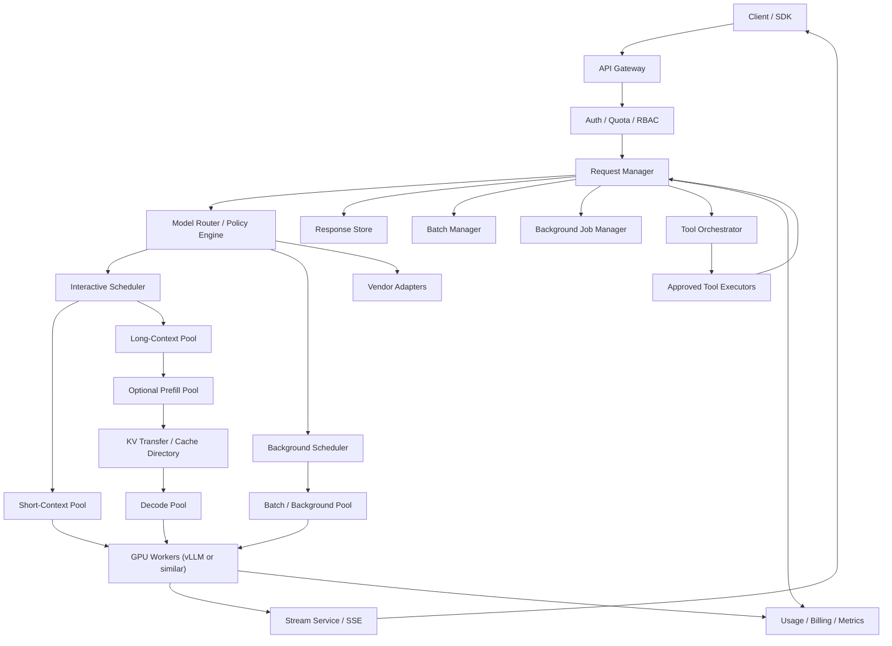

# 系统设计 - 案例 27：大模型推理系统真题模拟

## 题目

设计一个面向企业开发者的大模型推理平台，要求支持：

- 同步文本与代码生成
- 流式返回
- JSON Schema 结构化输出
- 基础 tool calling
- 长上下文请求
- 后台长任务
- 离线批处理
- 多租户鉴权、配额和计费

先不做：

- 模型训练与微调平台
- 向量数据库和 RAG 编排
- 完整 Agent 工作流平台
- 音视频生成
- 全球多区域部署

---

## 为什么这题值得深讲

这题是 AI 时代最典型、也最容易被答浅的一道系统设计题。

很多回答会停在：

- `API Gateway + GPU Worker + Redis + Kafka`

这不算错，但也远远不够。  
因为大模型推理系统和普通 Web 服务有几个根本不同：

1. 它不是纯粹的 `request -> db -> response`，而是一个 `高算力 + 高状态 + 高成本` 的系统
2. 一个请求不是一个简单 RPC，而是一个有生命周期的任务：`排队 -> prefill -> decode -> 可能等工具 -> 继续 decode -> 完成`
3. 系统瓶颈不是单一的 QPS，而是 `输入 token、输出 token、KV cache、活跃序列数、TTFT、ITL`
4. `同步对话`、`后台长推理`、`批处理` 之间会直接争抢同一批 GPU
5. 现代平台已经不只是“吐一段文本”，而是要支持 `streaming`、`structured outputs`、`tool use`、`background mode`、`batch mode`

如果一个候选人真的理解这题，他不应该只是背几个组件，而应该能讲清：

- 为什么要把 `sync / background / batch` 拆开
- 为什么现代推理系统的主缓存不是 Redis，而是 `prompt/prefix/KV cache`
- 为什么 `长上下文` 会把 prefill 变成主矛盾
- 为什么 `structured outputs` 和 `tool calling` 会改变 API 形状和状态机
- 为什么推理平台通常会走向 `统一 API + 混合后端 + 多种计算池`

---

## 面试官真正想看什么

这题通常在看下面几件事：

1. 你会不会先收敛业务边界，而不是一上来就讲 GPU 型号
2. 你是否理解 `prefill` 和 `decode` 是两种完全不同的负载
3. 你会不会把 `同步请求`、`长推理后台任务`、`批处理` 分开设计
4. 你能不能说出 `自托管`、`转发第三方`、`混合后端` 的 trade-off
5. 你能不能把 `长上下文、缓存、批调度、队列、公平性` 讲成一个系统
6. 你有没有意识到 `tool calling`、`schema`、`reasoning` 会让响应变成一个状态机，而不是一段字符串
7. 你是否有成本意识，知道 AI 平台真正要优化的是 `token 吞吐、缓存命中、排队延迟、单位成本`

---

## 一开始先别急着选技术，先收敛题目边界

如果面试官只说“设计一个大模型推理平台”，我会先澄清：

1. 这是给内部业务团队用，还是直接对外开放给第三方开发者？
2. 是只支持在线对话，还是还要支持后台长任务和离线批处理？
3. 是只支持一个模型，还是多模型统一网关？
4. 我们是完全自托管，还是允许转发第三方模型？
5. 是否要求严格的结构化输出？
6. tool calling 是只返回工具调用意图，还是平台负责执行工具？
7. 是否支持非常长的上下文，例如代码库分析、长文档分析？
8. 是否有强数据隔离、零保留、审计、配额和计费要求？

如果面试官不继续补充，我会主动把题目收敛成下面这个版本：

- 这是一个面向企业内部开发团队的统一推理平台
- 提供统一 API，支持多模型，但不是所有模型都等价
- 支持同步流式请求、后台长任务、离线批处理
- 支持 JSON Schema 结构化输出
- 支持基础 tool calling，平台负责执行经过审批的工具
- 长上下文是重要场景，但不是所有请求默认都走长上下文池
- V1 允许混合后端：高频稳定流量可自托管，部分前沿能力可转发外部模型
- 强调多租户隔离、配额、计费和可观测性

这里有三个我会主动做出的关键产品选择。

### 选择 1：把 `Response` 而不是 `Chat` 当作一等对象

为什么？

- 现代推理请求不只是“发一个 prompt，回一段文本”
- 它可能要流式输出
- 可能中间发出工具调用
- 可能转成后台任务，稍后轮询结果
- 可能要求严格 JSON Schema

所以平台的核心对象应该是：

- 一个有生命周期的 `response`

而不是：

- 一次性的“聊天接口”

### 选择 2：`sync / background / batch` 从第一天就分开

为什么？

- 交互式聊天要看 `TTFT`
- 后台复杂推理可以接受分钟级完成
- 批处理要的是便宜和吞吐，不是秒级响应

如果三者不分，从第一天就会互相拖垮。

### 选择 3：不强迫所有流量一开始都自托管

为什么？

- AI 系统里“要不要自建推理层”本身就是第一层 trade-off
- 小规模或快速试验时，直接走模型供应商往往更合理
- 高频、稳定、可标准化的流量，才更适合逐步自托管

所以真实世界更常见的答案不是：

- “全自建”  

而是：

- “统一 API 层 + 混合后端”

---

## 第一步：先判断这是一个什么类型的系统

我会先明确，这不是普通意义上的“API 服务”，而是一个：

- `计算密集`
- `状态密集`
- `混合工作负载`
- `按 token 计价`
- `对尾延迟极敏感`

的系统。

它至少有四个主矛盾。

### 主矛盾 1：`prefill` 和 `decode` 不是一种负载

一个 LLM 请求通常可以拆成两段：

1. `Prefill`
   - 处理输入上下文
   - 成本主要受输入 token 数影响
   - 直接决定 `TTFT`
2. `Decode`
   - 逐 token 生成输出
   - 成本主要受输出长度影响
   - 直接决定 `ITL` 和总完成时间

这意味着：

- “长输入短输出”的请求和“短输入长输出”的请求，压力根本不一样

比如：

- 长文档问答、代码库分析、工具定义很长的 Agent 请求，往往是 `prefill-heavy`
- 连续生成、长代码输出、长报告生成，往往是 `decode-heavy`

### 主矛盾 2：`同步聊天` 和 `后台长推理` 的目标完全冲突

同步聊天要的是：

- 第一秒就见到 token

后台长推理要的是：

- 不超时
- 能可靠完成
- 可以断线后继续查结果

批处理要的是：

- 更低成本
- 更高吞吐

这三者的目标函数不一致，所以不能只靠一个统一队列。

### 主矛盾 3：LLM 平台真正的容量单位不是 `request/s`

普通系统可以大致看 QPS。  
推理平台不行。

你至少要看：

- `input tokens/s`
- `output tokens/s`
- `active sequences`
- `KV cache bytes`
- `queue wait time`
- `TTFT`
- `ITL`
- `cached tokens`

只看请求数，会把系统看得过于简单。

### 主矛盾 4：缓存不是“可选优化”，而是架构主线

现代推理场景里，很多请求都带有很长的共享前缀：

- 系统提示词
- 工具定义
- few-shot 示例
- 大段固定上下文
- 长对话历史

如果每次都完整重算 prefill，成本和延迟都会很差。  
所以现代推理系统里，缓存已经不是“上 Redis 提升命中率”，而是：

- `provider prompt cache`
- `engine prefix cache`
- `KV cache reuse`

这类一等能力。

---

## 第二步：先做容量估算，但这次要按 token 来估

为了在面试里把 trade-off 讲清楚，我会先给一组假设：

- 峰值交互式请求到达率：`120 req/s`
- 其中同步交互请求占 `80%`
- 后台长任务提交占 `20%`
- 平均输入：`8k tokens`
- P95 输入：`64k tokens`
- 约 `2%` 的请求会超过 `200k tokens`
- 平均输出：`700 tokens`
- P95 输出：`4k tokens`
- 约 `20%` 的请求要求 `structured output` 或 `tool calling`
- 约 `15%` 的请求共享一个很长的静态前缀，如工具定义、系统提示词和公共上下文
- 夜间离线批处理规模：`300 万` 个抽取或分类任务

先算交互式主路径的量级：

### 输入 token 压力

如果峰值 `120 req/s`，平均输入 `8k tokens`：

- `120 * 8000 = 96 万 input tokens/s`

这已经能说明一个问题：

- 交互式负载的主压力往往首先出现在 `prefill`

### 输出 token 压力

如果平均输出 `700 tokens`：

- `120 * 700 = 8.4 万 output tokens/s`

这意味着在这组假设下：

- 输入 token 压力大约是输出 token 的 `11 倍`

当然，不能简单把它理解成“prefill 就一定比 decode 贵 11 倍”，因为两者算子行为和 batching 方式不同。  
但它足以说明：

- 长上下文系统里，真正的主矛盾往往首先是 `TTFT`

### 为什么长上下文会非常危险

如果 `2%` 的请求是 `200k tokens` 级别：

- `120 * 2% = 2.4 req/s`
- `2.4 * 200000 = 48 万 input tokens/s`

也就是说，哪怕比例不高，长上下文流量也会吃掉巨量 prefill 预算。

这直接推导出一个架构结论：

- 长上下文请求不能和普通聊天请求共享完全同一套队列和池子

### Prompt Cache 的收益 sanity check

如果：

- `15%` 请求共享 `6k tokens` 的静态前缀
- 其中 `80%` 能打中缓存

那每秒节省的大致是：

- `120 * 15% * 6000 * 80% = 86400 tokens/s`

这不是“小优化”，而是值得单独设计路由和 prompt 组织策略的主线优化。

### 一个很关键的结论

到这一步我会主动告诉面试官：

- 这个系统不能靠“每秒多少请求”做容量规划
- 正确的规划维度应该至少是：
  - `prefill tokens/s`
  - `decode tokens/s`
  - `active sequences`
  - `KV cache footprint`

GPU 数量要在选定模型、精度、并行方式之后，通过基准测试反推。  
面试里我会给出容量方法，而不是假装手里有精确 GPU benchmark。

---

## 第三步：先定义不变量，不然后面会越讲越散

我会先定义这几个不变量：

1. 一个 `response_id` 的状态必须单调推进，不能从 `completed` 回到 `running`
2. 同一个 `idempotency_key` 不能重复计费、重复执行有副作用的工具
3. 同步交互池不能被后台任务和批处理流量饿死
4. 标记为“严格结构化输出”的请求，结果必须是：
   - 符合 schema
   - 或显式失败
   - 不能静默返回非法 JSON
5. tool execution 发生在模型外部，模型本身不能直接拥有副作用权限
6. Prompt cache 和 KV cache 必须遵守租户边界和数据保留策略
7. 流式输出可以部分到达客户端，但最终计费、用量和完成状态必须在平台侧收敛

这些不变量非常重要，因为它们决定了：

- 我们不会把流式输出系统讲成简单 SSE
- 我们不会把 tool calling 讲成“模型自己调函数”
- 我们不会把结构化输出讲成“让模型尽量输出 JSON”

---

## 第四步：先比较大方向，别默认一定要自建推理集群

这是 AI 题和传统系统设计题很不一样的地方。  
真实世界里，你首先要回答：

- 我们到底是在设计“模型平台”，还是只是在设计“统一接入层”？

### 方案 A：纯转发第三方模型

做法：

- 统一 API 层只负责鉴权、限流、计费、模型选择、审计
- 真正推理完全交给外部模型供应商

优点：

- 上线快
- 运营复杂度低
- 能快速获得最新 frontier model 能力
- 不需要自己扛 GPU、模型加载、调度和高可用

缺点：

- 成本不稳定
- 对底层调度、缓存、TTFT 没有完全控制权
- 数据保留、合规、区域约束受供应商能力影响
- 很难对高频流量做到极致成本优化

### 方案 B：纯自托管

做法：

- 自己管理模型、推理引擎、GPU 池、调度、缓存

优点：

- 对成本和性能有更强控制
- 能做更细的调度和缓存优化
- 数据边界更清晰
- 稳定高频流量规模够大时，通常更有经济性

缺点：

- 需要很强的 MLOps 和推理基础设施能力
- 模型迭代快，维护成本高
- 前沿模型和复杂能力未必总能第一时间跟上

### 方案 C：混合后端

做法：

- 上层对外暴露统一 API
- 一部分流量自托管
- 一部分流量路由到第三方模型
- 在策略层做能力路由、成本路由和故障兜底

优点：

- 工程上最现实
- 可以逐步演进
- 高频、稳定、便宜的流量自己扛
- 前沿、高价值、低频或稀有能力用外部模型承接

缺点：

- 路由逻辑复杂
- 计费和语义对齐更难
- 不同后端的流式事件、schema、缓存语义可能不一致

### 我在这题里的选择

如果这是一个企业推理平台题，我会优先选：

- `统一 API 层 + 混合后端`

原因是这最符合现实演进：

1. `V1` 先解决平台接入、鉴权、限流、计费和调用规范统一
2. `V2` 把高频稳定流量逐步迁到自托管池
3. `V3` 再做更深的缓存、批调度和长上下文优化

也就是说：

- 这题的重点不是“全不全自建”
- 而是“怎么把平台层和推理层正确拆开，并允许后端逐步演进”

---

## 第五步：不要直接给最终方案，先走一遍真实设计推演

接下来我不会直接把“最终架构图”甩出来。  
我会像真的在设计这个系统一样，一步步推。

### 第一轮思考：最朴素的方案是什么

最朴素的方案是：

- 一个 `API Gateway`
- 后面挂一个 `Model Service`
- 再后面是一组 `GPU Workers`

请求进来之后：

1. 做鉴权
2. 把请求转发到某个模型 worker
3. worker 直接流式吐 token
4. 请求结束后记录用量

这个方案有什么好处？

- 简单
- 最快可用
- 适合 PoC 和小规模内部试验

但问题会非常快暴露：

1. `sync / background / batch` 混在一起
2. 长上下文会直接拖慢短请求
3. 没有多租户公平性
4. 没有 prompt cache 的显式设计
5. tool calling 没有状态机和幂等边界
6. 流式连接一断，任务状态就很难管理

所以第一轮方案只是“能跑”，远远不够“能做平台”。

### 第二轮思考：先把控制面和数据面拆开

一个更成熟的平台，应该先拆成两层：

1. `Control Plane`
2. `Data Plane`

#### Control Plane 负责什么

- 租户、API Key、RBAC
- 模型注册表
- 能力声明，如是否支持：
  - streaming
  - json schema
  - tools
  - long context
  - background
- 路由策略
- 计费与配额
- Batch 作业管理
- 后台任务状态管理
- 策略配置、灰度、审计

#### Data Plane 负责什么

- 请求接入
- 请求分类
- 调度
- prompt/prefix cache 相关路由
- 推理 worker 执行
- token streaming
- tool orchestration 的热路径状态推进

为什么这一步很重要？

因为：

- 控制面是“低频变更、高价值配置”
- 数据面是“高频请求、极致延迟敏感”

不拆开的话：

- 策略更新、计费逻辑、后台任务管理都会侵入最热链路

### 第三轮思考：API 应该围绕 `response` 状态机设计

如果平台要支持：

- 流式输出
- 后台任务
- tool calling
- schema 约束
- 中途取消

那 API 不能只剩一个：

- `POST /chat`

它更应该长成：

- `POST /v1/responses`
- `GET /v1/responses/{id}`
- `POST /v1/responses/{id}/cancel`
- `POST /v1/batches`
- `GET /v1/batches/{id}`

一个请求对象里，我会让调用方显式声明：

- `model`
- `mode: sync | background`
- `stream: true | false`
- `response_format`
- `tools`
- `idempotency_key`
- `metadata`
- `prompt_cache_key` 或平台自己生成的等价概念

为什么要这么做？

因为在现代推理平台里：

- 一次请求已经不是单纯“文本进文本出”

它是一个有状态的执行单元。

### 第四轮思考：所有请求不能进同一个池

到了这里，我会把请求至少分成四类：

1. `Interactive / Short Context`
   - 目标是低 TTFT
   - 面向常规聊天、代码补全、简单抽取
2. `Interactive / Long Context`
   - 目标是尽量控制长 prompt 下的 TTFT
   - 面向长文档问答、代码库分析
3. `Background / Long Reasoning`
   - 目标是可靠完成
   - 面向复杂规划、长链路工具调用、重推理请求
4. `Batch / Offline`
   - 目标是吞吐和成本
   - 面向夜间抽取、分类、Embedding 前处理等

如果四类请求共用一套队列，会发生什么？

- 一个很长的 prefill 会阻塞一堆本来 1 秒内可返回的聊天请求
- 批处理会吃掉活跃序列预算
- 背景任务会把同步流式请求的 TTFT 拉爆

所以第二个关键架构结论是：

- 必须做 `request classification + multi-pool scheduling`

### 第五轮思考：调度不该只看请求数，要看 token、KV 和缓存驻留

现代推理调度至少要关心这些输入：

- 模型 ID
- 请求类别
- 输入 token 长度
- 预估输出长度
- 是否长上下文
- 是否需要 schema / tools
- 当前队列长度
- 当前池子的活跃序列数
- 当前 KV cache 占用
- 目标 worker 上是否已有该前缀缓存
- 租户优先级和 quota 使用情况

也就是说，调度器不是“随机找个空闲 worker”。

它更像是在做：

- `capability-aware`
- `cache-aware`
- `tenant-aware`
- `workload-aware`

的路由。

### 第六轮思考：缓存的主角不是 Redis，而是 prompt/prefix/KV

这是这题最容易和传统系统设计混淆的地方。

在大模型推理里，缓存至少有三类：

#### 第一类：Provider 侧 Prompt / Context Cache

如果你路由到托管模型，平台需要理解供应商的缓存语义。

现实里已经出现非常明显的趋势：

- OpenAI 有自动 `prompt caching`
- Anthropic 有 `prompt caching` 与 `cache_control`
- Gemini 有 `implicit` 和 `explicit context caching`

这说明一件事：

- prompt 结构本身已经成为架构问题，而不只是 prompt engineering 问题

#### 第二类：自托管引擎侧 Prefix / KV Cache

如果是自托管模型，像 vLLM 这类引擎已经把：

- `PagedAttention`
- `automatic prefix caching`

这类能力做成一等公民。

也就是说：

- 你真正要优化的不是 Redis 命中率
- 而是共享前缀能否命中 GPU 上已经存在的 KV 结果

#### 第三类：应用结果缓存

只有极少数任务适合做最终结果缓存，比如：

- 完全确定性的短分类
- 固定输入、固定 schema、固定模型版本的重复请求

但对于开放式生成，大多数情况下：

- 结果缓存不是主角

### 为什么这一步会改变系统设计

如果前缀缓存是主线能力，那么平台必须：

1. 规范 prompt 组织
   - 静态内容尽量放前面
   - 动态内容尽量放后面
2. 做 cache-aware routing
   - 让相同前缀尽量落到同一后端或同一 worker
3. 把 cache isolation 设计成租户能力
4. 把缓存命中率变成一等观测指标

### 第七轮思考：长上下文多了以后，要不要拆 `prefill` 和 `decode`

这是这题真正拉开差距的地方。

#### 方案 A：统一 worker 同时处理 prefill 和 decode

优点：

- 最简单
- 不需要跨实例传 KV
- 调度实现容易

缺点：

- 长 prompt prefill 会直接打到 decode 尾延迟
- 很难分别优化 `TTFT` 和 `ITL`
- 长上下文流量一多，短请求体验急剧变差

#### 方案 B：Prefill / Decode 分离

做法：

- 让一组实例专门做 prefill
- 另一组实例专门做 decode
- 中间传递 KV 或等价中间状态

优点：

- 可以分别针对 `TTFT` 和 `ITL` 调优
- 更适合长 prompt、共享前缀明显的场景
- 更容易控制 decode 尾延迟

缺点：

- 架构复杂度显著上升
- 需要处理 KV 传输、调度、回收和失败恢复
- 不是所有流量都值得这么做

#### 我在这题里的回答

我不会一上来就说：

- “必须分离 prefill / decode”

更现实的回答是：

1. `V1`
   - 统一 worker
   - 先做多池隔离和 continuous batching
2. `V2`
   - 对长上下文池单独优化
   - 必要时引入 `prefill/decode disaggregation`
3. `V3`
   - 当长 prompt 占比更高、TTFT 尾延迟成为主痛点时，把分离方案扩到更多池

这会显得你是在做工程演进，而不是背论文结论。

### 第八轮思考：`structured outputs` 和 `tool calling` 会改变执行语义

很多人会把这两件事讲轻了。  
但实际上它们会直接改变 API、状态机和失败恢复。

#### Structured Outputs

最原始的做法是：

- 用 prompt 强调“请输出 JSON”

问题是：

- 它不可靠
- 失败时只能重试
- 重试会进一步放大延迟和成本

更成熟的做法是：

- 使用 provider 原生 schema 能力
- 或自托管引擎上的 constrained decoding / guided decoding

这样平台才能对上层业务承诺：

- 结果要么合法
- 要么明确失败

而不是：

- “模型大概率会给你一个像 JSON 的东西”

#### Tool Calling

tool calling 不是“模型自己直接调函数”。  
真实系统里应该是：

1. 模型输出 tool call 意图
2. 平台验证工具权限和参数
3. Tool orchestrator 调真实工具
4. 工具结果回灌给模型
5. 模型继续生成

这意味着响应状态机至少会出现：

- `waiting_tool`

也意味着要单独处理：

- 工具超时
- 工具副作用幂等
- 重试时是否重复执行工具
- 工具调用预算
- 最大 hop 数

到这里，系统已经不再是“流式 token 服务”，而是：

- “带执行状态机的推理平台”

---

## 第六步：把最终高层架构定下来

前面几轮推下来，一个更成熟的架构应该长这样：

这里我会把系统拆成几块来讲。

### 1. API Gateway

负责：

- API Key 校验
- 基础限流
- 请求签名和审计

它不应该直接做复杂的推理路由决策。  
复杂路由应该放在后面的 `Request Manager + Model Router`。

### 2. Request Manager

它是整个平台的中心对象层，负责：

- 生成 `response_id`
- 幂等去重
- 记录请求状态
- 持久化响应元信息
- 决定这是同步、后台还是批处理

如果是同步流式：

- 它会把请求交给调度器

如果是后台模式：

- 它只返回 `response_id`
- 实际执行由后台管理器接管

### 3. Model Router / Policy Engine

它负责：

- 解析调用方指定的模型或能力要求
- 判断是路由到自托管还是第三方
- 判断是否需要长上下文池
- 判断是否必须支持 tools / schema
- 根据 tenant policy 决定能否启用缓存、后台模式等能力

它不是简单的“if else 选模型”，而是平台的策略核心。

### 4. Schedulers

我会至少拆成：

- `Interactive Scheduler`
- `Background Scheduler`

交互调度优先看：

- TTFT
- cache residency
- queue delay

后台调度优先看：

- 吞吐
- 完成率
- 资源利用率

### 5. GPU Workers

这是最热的数据面。

它要负责：

- 模型加载
- continuous batching
- prefix cache / KV cache 管理
- prefill / decode 执行
- 流式 token 事件输出
- schema / tool 相关解码能力

### 6. Tool Orchestrator

它必须和模型 worker 解耦。

原因是：

- 工具调用会访问数据库、搜索、代码执行器、HTTP 服务
- 这类 IO 和模型推理是两种完全不同的资源模型
- 不能让 GPU 线程一边等外部工具，一边占着最贵的算力资源

### 7. Usage / Billing / Metrics

这是 AI 平台的必备部分。  
很多人会讲到最后忘了成本，但平台团队最在乎的往往正是：

- 这个租户花了多少
- 哪个模型最贵
- 缓存到底省了多少 token
- 批处理是否真的比同步便宜

---

## 第七步：把 API 设计讲清楚

如果我要让这个平台更像真实系统，我会定义如下 API。

### 创建一个响应

`POST /v1/responses`

请求字段示例：

- `model`
- `input`
- `stream`
- `mode`
- `response_format`
- `tools`
- `metadata`
- `idempotency_key`

其中：

- `mode = sync | background`
- `response_format` 可以是：
  - `text`
  - `json_schema`

### 查询响应状态

`GET /v1/responses/{response_id}`

返回：

- 当前状态
- 是否完成
- usage 信息
- 最终输出或错误

### 取消响应

`POST /v1/responses/{response_id}/cancel`

这很重要，因为：

- 长推理和后台任务必须支持取消

### 创建批处理

`POST /v1/batches`

请求内容：

- 输入文件引用
- 使用的模型
- 处理模式
- 回调或结果文件位置

### 查询批处理状态

`GET /v1/batches/{batch_id}`

返回：

- 总任务数
- 已完成数
- 失败数
- 结果文件位置

---

## 第八步：把核心数据模型说深一点

### `model_registry`

关键字段：

- `model_id`
- `backend_type`
  - `self_hosted`
  - `vendor`
- `capabilities`
  - `streaming`
  - `tools`
  - `json_schema`
  - `long_context`
  - `background`
- `max_input_tokens`
- `max_output_tokens`
- `pricing_profile`
- `status`

这张表的意义是：

- 平台路由要按“能力”而不是只按名字选模型

### `inference_request`

关键字段：

- `response_id`
- `tenant_id`
- `model_id`
- `mode`
- `request_class`
- `state`
- `idempotency_key`
- `schema_hash`
- `tool_budget`
- `prompt_cache_key`
- `created_at`
- `updated_at`

### `tool_invocation`

关键字段：

- `response_id`
- `hop`
- `tool_name`
- `args_hash`
- `status`
- `dedupe_key`
- `started_at`
- `finished_at`

为什么这里要有 `dedupe_key`？

因为工具可能有副作用。  
比如：

- 创建工单
- 写数据库
- 发消息

如果请求重试，不能盲目重放。

### `batch_job`

关键字段：

- `batch_id`
- `tenant_id`
- `input_file_ref`
- `result_file_ref`
- `state`
- `submitted_count`
- `completed_count`
- `failed_count`

### `usage_record`

关键字段：

- `response_id`
- `tenant_id`
- `input_tokens`
- `cached_input_tokens`
- `output_tokens`
- `reasoning_tokens`
- `tool_calls`
- `billable_amount`

这里我会顺手强调：

- AI 平台的 usage 不是“请求计数”那么简单
- 需要把缓存命中的 token、reasoning token、batch 折扣等维度考虑进去

---

## 第九步：真正把主执行链路拆开来讲

## 同步流式请求链路

1. 请求到达 API Gateway
2. 完成租户鉴权、粗粒度限流
3. Request Manager 创建 `response_id`
4. 根据模型能力和请求属性做分类：
   - short-context
   - long-context
   - tools
   - schema
   - background
5. Model Router 选择后端和目标池
6. Scheduler 根据：
   - token 长度
   - queue 状态
   - cache residency
   - tenant 优先级
   做入队
7. GPU worker 执行 prefill / decode
8. 流式输出事件进入 Stream Service
9. 客户端通过 SSE 接收增量事件
10. 最终完成后写入 usage_record 和 response final state

### 为什么我会偏向 SSE

对于纯服务端单向流式输出：

- SSE 简单
- 兼容性好
- 对大部分文本生成场景足够

我不会一上来就说 WebSocket。  
除非题目明确要求：

- 双向低延迟音频
- 浏览器实时协作

否则 WebSocket 不是必须。

### 流式事件要不要持久化

我会这么回答：

- 不需要永久保存每个 token event
- 但需要在短期窗口内保留足够的 event 或最终聚合结果，以支持断线恢复、问题排查和计费收敛

也就是说：

- `response 元信息` 要持久化
- `细粒度 token delta` 通常只需要短期保留

## 后台长任务链路

1. 客户端提交 `mode=background`
2. 平台快速返回 `response_id`
3. 后台管理器把任务放入专用队列
4. 调度器把它路由到后台推理池
5. 任务执行期间，客户端可以轮询状态或接收 webhook
6. 完成后写最终结果和 usage

这里的核心思想是：

- 对长任务，连接生命周期和任务生命周期必须解耦

## 批处理链路

1. 客户端上传任务清单文件
2. 创建 `batch_job`
3. 平台把 batch 拆成大量独立 request item
4. 进入批处理专用执行池
5. 结果异步写到结果文件
6. 调用方按 job 维度查询

我会明确告诉面试官：

- 批处理不要伪装成“同步接口多次重放”
- 它应该是单独的一等能力

---

## 第十步：把调度和资源隔离讲成真正的设计

这是这题最核心的部分之一。

## 为什么“一个大队列 + 先来先服务”不行

因为不同请求对资源的消耗差异太大：

- 一个 `2k input / 200 output` 的请求
- 和一个 `200k input / 2k output` 的请求

根本不是同一种负载。

如果都放一个 FCFS 队列：

- 长请求会阻塞短请求
- 高优租户和低优租户互相污染
- 背景任务会把交互式流量的 TTFT 拉高

## 一个更合理的做法

我会采用：

- 多队列
- 每队列独立 admission control
- 队列内 continuous batching
- 队列间 weighted fair scheduling

### 具体上怎么拆

至少拆成：

- `interactive_short_queue`
- `interactive_long_queue`
- `background_queue`
- `batch_queue`

每个队列设置不同目标：

- `interactive_short_queue`
  - 目标：`TTFT` 最优
- `interactive_long_queue`
  - 目标：控制尾延迟，不影响短请求
- `background_queue`
  - 目标：完成率和吞吐
- `batch_queue`
  - 目标：成本和夜间吞吐

## 调度器看哪些指标

我会至少看：

- 当前队列等待时长
- 目标 worker 的活跃序列数
- 目标 worker 的 KV 占用
- 目标 worker 是否已有前缀缓存
- 当前租户并发占用
- 当前模型池的 TTFT / ITL 实时表现

## 公平性怎么做

AI 平台里公平性不能只按请求数做。  
更合理的是：

- 按 `token budget`
- 按 `active sequence slots`
- 按 `KV footprint`

去限制租户。

例如：

- 一个普通租户不能同时开很多个 `200k context` 的后台任务，把整池子吃满

所以我会在 admission control 里至少加入：

- 单租户最大并发请求数
- 单租户最大活跃长上下文请求数
- 单租户单位时间最大输入 token
- 单租户单位时间最大输出 token

---

## 第十一步：把缓存讲成现代 AI 系统的主线

## 先明确：不要把“缓存”理解成 Redis 缓存最终答案

在 LLM 推理里，真正重要的是：

1. `Prompt / Context Cache`
2. `Prefix / KV Cache`
3. 少量确定性任务的结果缓存

### OpenAI 这类托管平台的启发

从官方文档看，现代托管模型平台已经把 prompt caching 作为一等能力：

- OpenAI 的 prompt caching 会自动工作，并强调：
  - 静态内容放前面
  - 动态内容放后面
  - 可以用 `prompt_cache_key` 影响路由和命中率
- OpenAI 还区分：
  - 默认内存缓存
  - 更长保留时间的 extended retention

这意味着平台层应该理解：

- 请求路由不只是“找可用模型”
- 还要考虑“相同前缀是否更可能命中缓存”

### Anthropic 这类平台的启发

Anthropic 的 prompt caching 更明确地把：

- `tools`
- `system`
- `messages`

作为缓存层级的一部分，并提供显式或自动的 cache breakpoint。

这说明现代 AI 平台要理解：

- 工具定义和系统提示词本身就是缓存对象

### Gemini 的启发

Gemini 官方文档已经区分：

- implicit caching
- explicit caching

而且显式缓存可配置 TTL。

这进一步说明：

- “上下文缓存”已经不是某一家供应商的特殊技巧，而是行业主流方向

### 自托管引擎的启发

如果走自托管，vLLM 这一类系统已经把：

- `PagedAttention`
- `automatic prefix caching`

做成了核心能力。

这意味着在自托管场景里，你的设计重点变成：

1. 前缀能不能规范化
2. 能不能把相同前缀路由到更可能命中的实例
3. 命中率、KV 占用和回收是否可观测

## 这一步最终导出的工程结论

1. 要有统一的 prompt builder，避免每个业务方随意拼装 prompt
2. 静态前缀必须前置
3. 工具定义、schema、固定 few-shot 示例尽量稳定
4. 路由层要有 cache-aware 策略
5. 缓存必须按租户或策略隔离，不能默认跨租户复用

---

## 第十二步：长上下文和 prefill/decode 分离到底怎么落

这一步我会讲得更工程化一点。

## 什么时候我会考虑引入分离式 prefill

当出现下面几个信号时，我会认真考虑：

1. 长上下文请求占比越来越高
2. `TTFT P95/P99` 被长 prompt 明显拉坏
3. decode 池经常因为插入大 prefill 而出现尾延迟抖动
4. 共享前缀非常多，prefill 复用价值很高

## 为什么这不是第一天就该上的东西

因为它会带来新复杂度：

- prefill 实例和 decode 实例如何配对
- KV 如何传输
- 失败时能否重建
- cache 在哪一侧持有
- 流量变化时如何调配 prefill / decode 比例

所以我更愿意把它描述成：

- “在长上下文和 reasoning 流量增长后的第二阶段优化”

这样回答更真实。

## 一个渐进的演进路径

### V1

- 统一 worker
- 短长请求拆池
- continuous batching
- prompt cache / prefix cache

### V2

- 对 long-context 池增加更强的 admission control
- 对超长请求默认转 background

### V3

- 在 long-context / reasoning 池引入分离式 prefill
- 优先把 `prefill-heavy` 请求送到该池

### 为什么这样讲更好

因为你不是在追求“最先进”，而是在回答：

- “我什么时候才值得为这套复杂度买单”

这就是系统设计里的成熟感。

---

## 第十三步：structured outputs 和 tool calling 怎么设计边界

## Structured Outputs

### 方案 A：纯 prompt 约束

优点：

- 简单
- 通用

缺点：

- 格式不稳定
- 需要大量重试
- 无法给业务方强保证

### 方案 B：平台提供严格 schema 模式

做法：

- 如果后端供应商原生支持 schema，就用原生能力
- 如果是自托管模型，就走 guided decoding / constrained decoding

优点：

- 稳定
- 业务方可依赖
- 减少重试与解析错误

缺点：

- 可能对吞吐有影响
- 并不是所有模型或引擎都支持同样程度的约束

### 我在这题里的选择

我会把 `strict schema` 做成平台显式能力：

- 请求要么显式要求严格 schema
- 要么走普通文本模式

而不会默认让所有请求都走严格约束。  
因为：

- 并不是所有请求都值得付出额外解码成本

## Tool Calling

### 我会怎么拆

1. 模型负责“提出工具调用意图”
2. 平台负责：
   - 验证工具白名单
   - 参数校验
   - 幂等去重
   - 权限控制
   - 真实执行
3. 工具结果回灌模型
4. 模型继续生成

### 为什么这一步要平台负责

因为 tool call 可能有副作用。  
平台必须掌控：

- 能调什么
- 调几次
- 超时怎么办
- 是否允许重试

### 一个我会强调的点

很多人会说：

- “工具失败就让模型再试一次”

这很危险。  
如果工具是：

- 创建支付
- 创建工单
- 发消息

盲目重试可能造成重复副作用。

所以正确做法是：

- 对每个 tool invocation 生成独立 `dedupe_key`
- 幂等边界放在工具执行层

---

## 第十四步：后台模式和批处理为什么已经变成标配

这是“结合最新进展”必须要讲到的一点。

## 后台模式

随着 reasoning 模型越来越强，很多任务已经不是几秒能完成的：

- 大规模代码修复
- 长文档综合分析
- 多轮工具调用
- 复杂规划和报告生成

这类任务如果还强塞在同步 HTTP 连接里，会遇到：

- 前端超时
- 连接断开
- 客户端重试带来重复执行

所以现代平台越来越把：

- `background mode`

做成一等能力。

这对架构的影响是：

1. 请求对象必须可持久化
2. 任务和连接生命周期必须解耦
3. 要支持轮询、回调或结果拉取
4. 要支持取消和超时治理

## 批处理

批处理也已经不是“以后再说”的功能。

因为很多 AI 工作负载天然是离线的：

- 全量分类
- 文档抽取
- 数据集评估
- 离线 embedding
- 大规模重处理

现代供应商也已经把 batch 作为独立、且通常更便宜的能力。

所以一个成熟的平台应该从一开始就明确：

- 批处理不和同步聊天抢资源
- 批处理可以有更宽松的完成时间
- 批处理有单独的价格和资源池

---

## 第十五步：多租户、计费与数据治理

如果这是一个平台题，我一定会讲这一部分。  
因为没有它，这就只是一个“模型服务”，不是平台。

## 多租户隔离

我会至少做三层隔离：

1. `鉴权隔离`
   - API key / service account / project 维度
2. `资源隔离`
   - 并发数
   - token budget
   - 长上下文配额
   - batch 并发
3. `数据隔离`
   - 日志保留策略
   - 缓存隔离
   - 是否允许 prompt cache

## 为什么缓存隔离要单独讲

因为 AI 平台里的缓存不是普通缓存。  
它可能复用的是：

- prompt prefix
- tool definitions
- conversation context

这些都可能含有租户敏感信息。  
所以我的默认策略会是：

- 缓存按租户或更细粒度隔离

只有在明确允许的共享前缀场景下，才做更大范围的复用。

## 计费

我会把计费粒度设计成至少包括：

- input tokens
- cached input tokens
- output tokens
- reasoning tokens
- batch discount
- tool execution surcharge

为什么要把 `cached input tokens` 单独记出来？

因为这会直接影响：

- 成本解释
- 优化效果评估
- 对业务方的反馈闭环

## 数据保留策略

平台要支持：

- 默认保留
- 短期保留
- 近零保留或严格受限模式

而且这些策略会反过来影响：

- 能不能开 prompt cache
- 能不能开 background mode
- 日志里能记录多少 payload

也就是说：

- 治理策略不是“最后加个开关”
- 它会直接改变系统能力矩阵

---

## 第十六步：把故障和异常路径讲进去，不然答案还不够真实

## 场景 1：GPU worker 在流式输出中途挂了

我会怎么处理？

- 同步请求：
  - 如果已经开始流式返回，一般不能透明重试成“完全一样的流”
  - 返回明确错误，由调用方决定是否基于同一 `idempotency_key` 重试
- 后台任务：
  - 如果还没进入副作用工具执行，可以尝试重新调度
  - 如果已经经过 tool boundary，则从最近安全边界恢复

这里的重点是：

- 不要轻易承诺“中途失败完全无感恢复”

因为对生成式任务来说，这通常并不真实。

## 场景 2：Prompt Cache 大量失效，TTFT 暴涨

可能原因：

- prompt builder 改版
- schema 顺序变化
- tools 定义频繁变化
- 路由没有保持前缀亲和

所以我会强调：

- Prompt cache 命中率是一个必须观测的核心指标

## 场景 3：长上下文洪峰冲进来

做法：

- admission control
- 长上下文队列独立限流
- 超过阈值时自动降级到 background
- 保留 interactive short pool 的保底容量

## 场景 4：工具调用超时或执行失败

做法：

- Tool orchestrator 写 invocation 状态
- 有副作用工具必须幂等
- 模型继续执行前，把失败作为显式 tool result 回灌，而不是静默吞掉

## 场景 5：某个供应商后端故障

如果是混合后端平台，我会支持：

- capability-aware fallback

但我不会承诺所有请求都能无损切换。  
因为：

- 不同模型的输出风格
- schema 能力
- tools 语义

不一定完全一致。

更现实的说法是：

- 平台可以在能力兼容时做 fallback
- 否则显式失败并告知调用方

---

## 第十七步：观测指标应该怎么设计

普通系统只看 QPS 和错误率不够。  
推理平台至少要有下面这些指标：

## 请求维度

- request rate by model
- request rate by class
- success / failure / cancel rate
- schema validation success rate
- tool call success / timeout / retry rate

## 延迟维度

- queue wait time
- `TTFT`
- `ITL`
- end-to-end latency
- background completion time
- batch turnaround time

## 资源维度

- prefill tokens/s
- decode tokens/s
- active sequences
- KV cache occupancy
- KV eviction rate
- worker utilization

## 缓存维度

- cached input tokens
- prompt cache hit ratio
- prefix cache hit ratio
- cache miss by model / tenant / route

## 成本维度

- cost per tenant
- cost per model
- cost per successful response
- cache saving
- batch discount utilization

到这里我会强调一句：

- AI 平台不是只监控“服务可用”，还要监控“每单位智能输出的成本”

---

## 第十八步：结合 2025-2026 的主流进展，这题该怎么升级理解

如果这题放到 2023 年，很多人回答“统一 API + GPU 服务”就差不多了。  
但放到 2025-2026，明显已经不够。

### 进展 1：Prompt / Context Caching 已经变成行业共识

OpenAI、Anthropic、Gemini 都已经把缓存能力产品化。  
这说明：

- prompt 结构和路由策略已经不是边缘优化，而是架构主线

### 进展 2：长推理任务推动 `background mode` 成为一等能力

推理模型越来越强，也越来越可能跑很久。  
所以：

- “请求等连接”

这套旧心智已经不够。  
平台要把任务状态、取消、轮询和后台执行当作内建能力。

### 进展 3：`batch` 已经成为标准产品面

OpenAI 和 Anthropic 官方都在强化 batch 这类能力。  
这说明：

- AI 平台应该默认区分在线和离线工作负载

### 进展 4：开源推理引擎已经不只是“起个模型服务”

以 vLLM 为代表的开源栈已经把：

- PagedAttention
- prefix caching
- speculative decoding
- structured outputs
- tool calling
- disaggregated prefill

这类能力纳入主线能力集。  
所以自托管推理平台的讨论，也已经不该停在“怎么把模型加载到 GPU”。

### 进展 5：长上下文让 prefill 成为新的系统设计中心

以前很多系统设计都在围绕 decode 吞吐。  
现在长文档、长代码库、Agent 工具定义和多模态上下文让：

- `TTFT`
- `prefill scheduling`
- `cache-aware routing`

变得越来越关键。

### 一个我会主动给出的结论

所以今天回答这题，如果还只说：

- `网关 + 队列 + GPU`

就已经明显偏浅。  
更成熟的回答，至少应该主动补上：

- `response object`
- `sync/background/batch`
- `prompt/prefix cache`
- `long-context pool`
- `tool/schema state machine`
- `hybrid backend`

---

## 如果面试官继续追问，我会怎么答

## 追问 1：什么时候值得做 prefill/decode 分离？

回答要点：

- 当长上下文占比上升
- TTFT 尾延迟显著恶化
- decode 被长 prefill 干扰
- 有足够高的 prefix reuse

不要回答成：

- “先进所以一定要上”

## 追问 2：为什么不全走第三方模型？

回答要点：

- V1 完全可以多走第三方
- 但高频、稳定、可标准化流量长期会有明显成本压力
- 数据边界、低延迟和更强可控性也会推动部分自托管

## 追问 3：Redis 在这个系统里还有用吗？

有，但不是主角。

它更适合做：

- 元数据缓存
- quota / rate limit 状态
- 短期 response 状态加速读取

而不是：

- GPU 级 prefix / KV 主缓存

## 追问 4：tool calling 和后面的 Agent 平台是什么关系？

我会回答：

- 这里的平台只负责“单次 response 生命周期内的工具调用”
- 更复杂的多步规划、记忆、任务编排，是后续 Agent 平台的话题

这样边界就很清楚。

## 追问 5：怎么支持多模态？

我的回答会是：

- V1 先把接口对象和调度模型设计成可扩展
- 图像、PDF、音频这类输入需要单独的预处理和 tokenization 预算
- 多模态流量最好单独分类和池化，而不是直接混进文本池

---

## 这题最容易失分的地方

1. 只会说“API Gateway + GPU + Redis + MQ”
2. 仍然只按 QPS 估容量，不按 token、KV、TTFT 来看
3. 不区分 `sync / background / batch`
4. 完全不提 prompt cache、prefix cache、长上下文
5. 把 structured output 讲成“让模型输出 JSON”
6. 把 tool calling 讲成“模型自己调函数”
7. 不讲多租户、公平性、计费和数据治理
8. 一上来就追求最复杂的 prefill/decode 分离，却不讲什么时候才值得上

---

## 最后总结

这题如果想答深，关键不在于你能不能背出某个推理引擎的名字，而在于你是否真正理解：

- 大模型推理系统是一个 `按 token 计量、按状态推进、按工作负载分池` 的平台

真正成熟的主线应该是：

1. 先收敛边界，明确这是统一推理平台，不是训练平台
2. 把 `response` 作为一等对象，而不是只做一个聊天接口
3. 把 `sync / background / batch` 拆开
4. 把 `long context`、`prefill/decode`、`prompt cache` 作为主矛盾来设计
5. 把 `schema`、`tools`、`幂等`、`计费`、`治理` 补进去，形成真正的平台答案

如果一句话总结：

- 现代大模型推理系统，本质上是“带有缓存亲和调度和执行状态机的 AI 平台”，而不是“后面挂着 GPU 的普通 API 服务”。

---

## 参考资料

下面这些是一手资料，适合和本章一起看：

- [OpenAI Prompt Caching](https://platform.openai.com/docs/guides/prompt-caching)
- [OpenAI Background Mode](https://platform.openai.com/docs/guides/background)
- [OpenAI Batch API](https://platform.openai.com/docs/guides/batch/)
- [OpenAI Latency Optimization](https://platform.openai.com/docs/guides/latency-optimization)
- [Anthropic Prompt Caching](https://docs.anthropic.com/en/docs/build-with-claude/prompt-caching)
- [Anthropic Context Windows](https://docs.anthropic.com/en/docs/build-with-claude/context-windows)
- [Anthropic Batch Processing](https://docs.anthropic.com/en/docs/build-with-claude/batch-processing)
- [Gemini Context Caching](https://ai.google.dev/gemini-api/docs/caching)
- [vLLM Automatic Prefix Caching](https://docs.vllm.ai/en/latest/examples/offline_inference/automatic_prefix_caching/)
- [vLLM Disaggregated Prefilling](https://docs.vllm.ai/en/v0.10.0/features/disagg_prefill.html)
- [vLLM Tool Calling](https://docs.vllm.ai/en/stable/features/tool_calling/)
- [vLLM Structured Outputs](https://docs.vllm.ai/en/v0.9.2/features/structured_outputs.html)
- [PagedAttention Paper](https://arxiv.org/abs/2309.06180)
- [P/D-Serve Paper](https://arxiv.org/abs/2408.08147)
