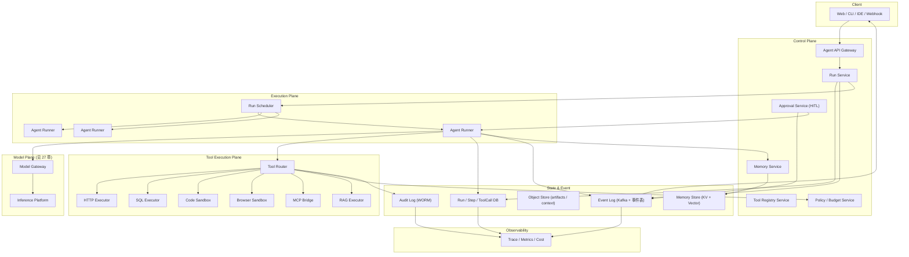

# 系统设计 - 案例 29：Agent 执行平台真题模拟

## 题目

设计一个面向企业研发团队的 Agent 执行平台，支持：

- 用户提交一个高层目标，由一个 Agent 自主规划并执行多步任务
- Agent 能调用一组受治理的工具（HTTP API、数据库查询、代码执行、内部服务、RAG 检索）
- 支持流式返回中间步骤与最终答案
- 支持后台长任务：Agent 执行时间可能从秒级到数十分钟
- 支持人在回路：高风险动作需要人工批准
- 支持子 Agent 和并行工具调用
- 支持中断、恢复与重放（replay）
- 多租户隔离、配额、审计、成本追踪

先不做：

- 模型训练与微调
- 多模态生成（图像 / 音频 / 视频）
- 全球多区域主主部署
- 面向非技术终端用户的低代码 Agent 构建 UI

---

## 为什么这题值得深讲

Agent 执行平台是 2025–2026 年 AI 系统设计里最容易答浅、也最容易答歪的一题。

很多回答会停在：

- `调 LLM -> 让它输出工具名 -> 执行工具 -> 再调 LLM -> 循环`

这不算错，但完全不是一个“系统设计”答案。  
因为 Agent 平台和普通推理平台、普通任务平台，至少有下面几个根本不同：

1. 一个请求不是一次 RPC，而是一个可能持续数十分钟的 **有状态 run**
2. 一个 run 内部是一连串 **steps**，每一步都可能失败、超时、重试、被人工干预
3. 系统瓶颈不是 QPS，而是 **并发活跃 run 数 × 每 run 的 token / tool 调用开销**
4. 失败模式是新型的：**幻觉工具调用、死循环、预算耗尽、工具副作用、越权执行**
5. 它天然是一个 **长任务 + 事件流 + 状态机** 的复合系统，而不是一个简单的 API
6. 安全边界从“API 鉴权”扩展到“**每个工具调用都要重新鉴权与审计**”

如果一个候选人真的理解这题，他不应该只是背几个组件，而应该能讲清：

- 为什么 `run` 必须是一等对象、必须能持久化、必须能 replay
- 为什么 `tool registry` 和 `permission manifest` 必须从第一天就有
- 为什么“工具调用的 side effect” 是整个系统的核心风险面
- 为什么同步流式和后台 run 本质上是同一个对象的不同消费模式
- 为什么 Agent 平台的主缓存不是 Redis，而是 **step-level cache + tool result cache + context compression**
- 为什么 **可观测性 / tracing** 在这类系统不是锦上添花，而是主链路的一部分

---

## 面试官真正想看什么

这题通常在看下面几件事：

1. 你会不会先收敛“Agent 是什么”的边界，而不是一上来就画 ReAct 循环
2. 你是否把 `run` 和 `step` 当作一等对象，而不是“一次聊天”
3. 你会不会把 `tool registry`、`policy`、`sandbox`、`audit` 拆开讲
4. 你能不能说清 `同步流式`、`后台 run`、`子 Agent`、`人工审批` 之间的关系
5. 你能不能把 `记忆` 和 `上下文窗口管理` 讲成两个不同的问题
6. 你有没有意识到 Agent 平台的失败模式是新型的，不能用普通重试兜底
7. 你有没有意识到 **可观测性、成本核算、replay** 是 Agent 平台必须要有的能力
8. 你能不能回答“和单纯的工作流引擎（Airflow / Temporal）有什么本质区别”

---

## 一开始先别急着设计，先收敛题目语义

Agent 是一个非常容易被当作“玄学词”的概念。  
我会先主动澄清下面这些问题：

1. 我们说的 Agent，是 **single-agent** 还是支持 **multi-agent / sub-agent**？
2. Agent 的工具是 **平台托管执行**，还是只负责 **返回工具调用意图** 由调用方执行？
3. 是否支持 **人在回路**（high-risk action 需要人工批准）？
4. 运行模式是 **同步流式** 为主，还是以 **后台 run** 为主？两者是否都要？
5. 是否支持 **中断 / 暂停 / 恢复**？是否支持 **replay**？
6. 是否需要支持 **MCP** 等外部工具协议？
7. 记忆要到什么粒度？**session 级**、**user 级**、还是 **项目级**？
8. 工具执行是否需要 **沙箱**（代码执行、浏览器、Shell）？
9. 是否有 **强多租户**、**审计**、**零数据保留** 要求？

如果面试官不继续补充，我会把题目收敛成下面这个版本：

- 面向企业内部研发团队，不对外
- 以 **后台 run 为一等公民**，同步流式只是 run 的一种消费模式
- 工具 **由平台执行**，所有工具必须在 `tool registry` 注册并有 manifest
- 支持 **sub-agent** 和 **并行工具调用**，但不做复杂的 multi-agent 协商协议
- 支持 **HITL**：每个工具可以声明是否需要人工审批
- 支持 **中断、恢复、replay**
- 支持 **MCP** 作为工具来源之一
- 记忆只到 **session + user** 级，长期项目记忆先不做
- 代码执行、Shell、浏览器类工具走 **独立沙箱服务**
- 强多租户，审计 / 成本 / 配额齐备

这里有三个我会主动说清的产品选择。

### 选择 1：`run` 是一等对象，不是“一次聊天”

为什么？

- 一次 Agent 调用不是一次 RPC，它可能有几十步、数十分钟、被人工打断、被工具失败拖住
- 同一个 run 可能被多个客户端消费（Web UI、CLI、IDE 插件、Webhook）
- 可观测性、成本核算、审计全部以 `run` 为单位
- 重放和调试也必须以 `run` 为单位

所以 `run` 必须是：

- 持久化
- 可枚举
- 可订阅事件流
- 可中断 / 恢复 / 重放

### 选择 2：同步流式是 run 的一种消费模式，而不是单独的一种请求

为什么？

- 同步流式的数据流，本质就是“从第 0 步开始订阅这个 run 的事件”
- 后台 run 的查询，本质就是“从第 N 步开始订阅这个 run 的事件”
- 统一成同一个对象，可以避免两套状态机

这和 27 章的 `response object` 是同一个设计哲学：

- **让对象生命周期和客户端订阅方式解耦**

### 选择 3：工具平台托管执行，而不是只返回意图

为什么？

- 如果只返回意图让调用方执行，平台无法做：
  - 审计
  - 权限边界
  - 沙箱
  - 频控
  - 成本核算
  - replay
- 只有平台托管执行，才能把 Agent 系统当作一个有安全边界的系统
- “返回意图”更适合 SDK/API 场景，不适合面向企业的平台

---

## 第一步：先判断这是一个什么类型的系统

我会先明确，这不是一个普通的 API 服务，而是一个：

- `长任务`
- `强状态`
- `事件驱动`
- `多租户`
- `有安全边界`
- `按 token + tool 调用计价`

的系统。

它同时具备下面几个特征：

1. **任务生命周期远长于一次请求**：单个 run 可能 30 分钟以上
2. **事件量远大于请求量**：一个 run 可能产生 50+ 事件（step start / llm call / tool call / tool result / step end / reflection）
3. **写远多于读 + 读又要实时性**：事件要落盘审计，又要实时推给订阅方
4. **工具调用的副作用是外部的**：平台必须假设每次工具调用都可能失败、产生外部影响、不可回滚
5. **绝大多数成本来自 LLM 调用，而不是平台本身**：但平台决定了每个 run 调用多少次 LLM

这些特征意味着系统的主矛盾不是“高 QPS 高吞吐”，而是：

- 如何 **正确、可观测、可控地** 执行长时间、多步骤、带副作用的任务
- 如何把 **LLM 调度、工具调用、状态持久化、事件推送、审计** 拆成可独立演进的 plane

---

## 第二步：先做一轮容量估算，不然 trade-off 没锚点

我会主动给一组面试中合理的假设：

- 平台对接 `100` 个业务团队，共 `10 万` 开发者
- 日活 Agent 用户 `2 万`
- 平均每人每天发起 `20` 个 run
- 即日 run 数量 `40 万`
- 峰值并发活跃 run `5000 - 10000`
- 平均每个 run `10 - 30` 步
- 平均每个 run 产生 `30 - 80` 个事件
- 平均每个 run 调用 LLM `5 - 15` 次，调用工具 `5 - 20` 次

### 事件规模

每天事件数：

- `40 万 run * 50 事件 ≈ 2000 万事件`

峰值事件速率（按 2 小时高峰估）：

- `2000 万 / 7200 秒 ≈ 3000 事件 / 秒`
- 峰值可能是平均的 3–5 倍，即 `1 万 / 秒`

这说明 **事件链路** 必须独立：

- 不能用数据库主表直写
- 至少要走一条 append-only 事件流

### 活跃 run 的状态

假设单个 run 的活跃状态（上下文 + 中间产物）平均 `200 KB`，峰值 `1 万` 活跃 run：

- `1 万 * 200 KB = 2 GB`

这个量本身不吓人，但意味着：

- 活跃状态可以放 **有限容量的内存 / 内存型 KV**
- 归档状态要落 **对象存储 + 元数据 DB**

### LLM 调用量

- `40 万 run * 10 次 = 400 万次 LLM 调用 / 天`
- 平均每次 `2000` 输入 token + `500` 输出 token
- 即 `80 亿输入 token + 20 亿输出 token / 天`

这是一个相当大的 LLM 消费量，意味着：

- 平台必须有 **按 run / 按用户 / 按 tenant 的预算和限流**
- 平台必须接入一个已有的推理平台（27 章那一层），而不是自己造
- `prompt cache / prefix cache / step-level cache` 是省钱的主要手段

### 工具调用量

- `40 万 run * 10 次 = 400 万次工具调用 / 天`
- 峰值 `1000 - 2000 调用 / 秒`

其中：

- HTTP / 内部 API 类工具：**延迟 50ms – 2s**
- 代码执行 / Shell：**延迟 1s – 30s，需要沙箱**
- 浏览器类：**延迟 5s – 60s，需要长驻 session**

这马上说明：

- **工具执行器不能是一种**，必须是一个 **工具执行平面**，按工具类型路由到不同 executor
- **代码 / 浏览器类必须有独立沙箱集群**，不能和普通服务混部

### 延迟目标

- 同步流式下，**首个 step 事件 P99 < 1s**
- step 之间的事件 `P99 < 200ms`（不含实际工具 / LLM 耗时）
- 后台 run 的查询：**P99 < 100ms**
- 整个 run 的端到端延迟：**取决于工具和 LLM**，平台本身不是瓶颈

---

## 第三步：先定义不变量，而不是先选技术

这题最容易被忽略、但最能拉开差距的是不变量。

我会先定义下面几个不变量：

1. **每个 run 有且只有一个权威事件序列**。所有客户端看到的事件顺序必须一致。
2. **每个工具调用都必须经过 policy 检查和审计记录**。不存在“内部调用免审计”。
3. **任何步骤的恢复 / 重放，必须基于持久化的事件 + 输入，而不是基于服务内存**。
4. **一个 run 不能越过 tenant 边界访问任何资源**。工具、数据、模型、配额都按 tenant 隔离。
5. **带副作用的工具调用，同一 step 只允许执行一次**，即使 run 被恢复或 replay。
6. **LLM 调用的预算、token、金额记账必须和 run 强绑定**，不能“事后对账”。
7. **HITL 批准的决定是权威的**，一旦被批准或拒绝，Agent 不能再尝试绕过。
8. **任何 run 必须能被中断**。中断是一等操作，不是“杀进程”。

这几条背后的意思是：

- **执行正确性 > 执行效率**
- **审计可追溯 > 实现简单**
- **tenant 边界 > 共享优化**

很多候选人会先讲“怎么让 Agent 变聪明”，但在系统设计里，那通常不是第一优先级。  
Agent 变聪明是 **模型 + prompt** 的问题，不是平台的问题。  
平台的问题是：**让一个可能不够聪明的 Agent，以受控、可观测、可恢复的方式运行。**

---

## 第四步：从朴素方案一步步推演

## 第一轮思考：最朴素的方案

最直观的方案是：

- 前端发请求进来
- 服务进程里起一个循环
- 循环调用 LLM、解析工具调用、执行工具、把结果拼回 prompt
- 流式输出给客户端
- 请求结束，进程释放

这个方案有什么好处？

- 简单
- demo 好写
- 小规模完全可用

但只要把规模 / 需求提上来，问题立刻暴露：

1. **服务重启会丢掉所有运行中 run**
2. **长任务不能和短请求共用一类进程**
3. **工具执行副作用没有审计**
4. **没法做 replay、中断、恢复**
5. **HITL 根本无处挂钩**
6. **并发活跃 run 上升后，单进程内存撑不住**

所以第一轮方案只能当成“能跑”，但绝不是面试应该停下来的位置。

---

## 第二轮思考：把 run 从进程里抽出来

主矛盾是 **run 的生命周期远长于一次请求**。  
所以第一件事就是：

- 把 `run` 的状态 **持久化到存储**
- 把 `run` 的执行 **从 API 进程里抽出来**，放到专门的 **Agent Runner** 服务

这样的变化是：

1. API 层只负责 **创建 run、查询 run、订阅 run 事件**
2. Runner 层负责 **推进 run 的一步一步执行**
3. 客户端的同步流式，本质是 **订阅一个 run 的事件流**
4. 服务重启不丢 run，只是当前活跃的 step 可能要重新调度

这一步一做完，系统就从“一个长请求”变成了“一个带状态机的任务”。

但还会出现新问题：

1. **谁决定哪个 runner 推进哪个 run？**
2. **一个 run 被多个 runner 同时推进怎么办？**
3. **LLM 调用和工具调用如何复用底层平台？**
4. **事件如何高效推送给订阅方？**

这就是下一轮要解决的。

---

## 第三轮思考：引入调度和租约

Agent Runner 很像一个 **任务调度系统**（见 24 章），但又不一样：

- 任务调度系统的任务通常是 **无状态、短周期、幂等重跑**
- Agent run 是 **有状态、长周期、不完全幂等**

但它们有一个共同点：**任何 run 在任意时刻只能由一个 runner 推进**。

所以引入：

1. **Run Lease（租约）**：某个 runner 持有某 run 的租约才能推进
2. **Scheduler / Dispatcher**：负责把 pending run 派发给 runner
3. **Heartbeat**：runner 定期刷新租约，超时则释放
4. **Resumption**：run 被抢占 / 重分配时，从最后一个 committed step 继续

这里有一个很关键的工程选择：

- **step 级的 commit** 必须在 **执行工具副作用之前** 完成意图登记，**在执行完成之后** 登记结果

这样一旦 runner 挂在工具执行中间，新的 runner 可以：

- 看到有一个“已启动但未完成的工具调用”
- 决定是 **幂等重跑** 还是 **视为失败**（取决于工具 manifest）
- 不会盲目地重复产生副作用

这就是 Agent 系统里最核心的一条不变量：

- **step 必须 two-phase：intent → effect → result**

---

## 第四轮思考：事件流是主干，不是副产品

很多答案会把“事件”当作“日志”，这是一个典型的设计失误。

在 Agent 平台里，事件流 **就是** 系统的主干：

- 客户端流式消费事件
- 审计系统消费事件
- 可观测性系统消费事件
- Replay 系统消费事件
- HITL 订阅事件等待审批
- 计费系统消费事件

所以事件必须：

1. **Append-only**
2. **有序**（单个 run 内严格顺序）
3. **持久化**
4. **可从任意 offset 订阅**
5. **有明确的事件 schema**

常见选择：

- **单 run 内事件表（shard by run_id）**：简单、强一致，但订阅推送要自己实现
- **MQ（Kafka / Pulsar）+ 快照**：吞吐好，订阅方便，但需要处理消费位点和存档
- **Event Store 型**（如专门的 event store）：语义最贴合，但运维复杂

在面试里我会说：

- V1 用 **事件表 + 消息总线（Kafka）** 的组合：事件表是真相源、总线是推送通道
- 客户端订阅时，先从事件表回放已发生事件，再切换到总线增量
- 这样既保证了持久化和一致性，又保证了低延迟推送

---

## 第五轮思考：工具执行必须独立成一个 plane

到这里，Agent Runner 其实已经能跑一个完整 run 了。  
但工具执行还埋着一个大雷：

- **不同工具的副作用、延迟、依赖、安全模型完全不一样**

如果把它们都塞进 runner 进程：

- 沙箱类工具会把 runner 拖住数十秒
- 某些工具的依赖会污染 runner 进程
- 权限 / 审计 / 频控 逻辑会和 runner 纠缠在一起

所以要再拆出一个 **Tool Execution Plane**：

- `Tool Registry`：工具定义、manifest、版本
- `Tool Router`：按工具类型分发到对应 executor
- `Executor 集群`：不同工具类型（HTTP、RAG、SQL、Code、Browser）有独立 executor
- `Policy Engine`：每次工具调用前做 ACL / 频控 / 敏感参数检查
- `Audit Log`：每次工具调用都落审计

这个 plane 独立出来以后：

- Agent Runner 专注于 **推进状态机**
- 工具执行的细节和安全边界不会污染 runner
- Executor 可以按工具类型独立扩缩容

这是 Agent 平台和普通“函数调用”最大的区别：

- **函数调用是一次 RPC**
- **工具调用是一条完整的受治理的子链路**

---

## 核心对象模型

到这里，系统的核心对象已经自然浮现出来了。我会把它们一一定义清楚。

### 对象 1：`Agent`

- Agent 的 **模板定义**
- 字段：
  - `id`
  - `name`
  - `system_prompt`
  - `model_preference`
  - `allowed_tools`
  - `memory_policy`
  - `budget_policy`
  - `safety_policy`
  - `version`

注意：Agent 定义是 **可版本化** 的，一个 run 必须绑定到一个具体的 Agent 版本。

### 对象 2：`Run`

- 一次 Agent 的完整执行
- 字段：
  - `id`
  - `agent_id` + `agent_version`
  - `tenant_id`
  - `user_id`
  - `input`（初始目标）
  - `status`（见状态机）
  - `budget`（token / 金额 / 时间 / 步数 上限）
  - `created_at` / `started_at` / `finished_at`
  - `parent_run_id`（如果是 sub-agent）
  - `trace_id`
  - `policy_snapshot`（创建时生效的策略）

### 对象 3：`Step`

- run 内的一步
- 字段：
  - `id`
  - `run_id`
  - `index`
  - `type`（`plan` / `llm_call` / `tool_call` / `observation` / `reflection` / `final`）
  - `status`（`pending` / `in_flight` / `waiting_approval` / `succeeded` / `failed`）
  - `input_ref` / `output_ref`（通常指向对象存储）
  - `cost`（token + 美元）
  - `started_at` / `finished_at`
  - `attempt`

### 对象 4：`ToolCall`

- 一次具体的工具调用
- 字段：
  - `id`
  - `step_id`
  - `tool_id` + `tool_version`
  - `args_hash`（用于幂等与缓存）
  - `idempotency_key`
  - `status`
  - `result_ref`
  - `duration_ms`
  - `error`
  - `approved_by`（HITL）

### 对象 5：`Memory`

- Agent 的记忆条目
- 字段：
  - `id`
  - `scope`（`session` / `user` / `project`）
  - `kind`（`fact` / `preference` / `summary` / `artifact`）
  - `content`
  - `embedding_ref`
  - `created_by_run_id`
  - `ttl` / `expire_at`

### 对象 6：`Event`

- run 生命周期里的每个事件
- 字段：
  - `run_id`
  - `seq`（单 run 内单调递增）
  - `type`
  - `payload`
  - `ts`

---

## Run 的状态机

这是这题的核心。

```
created
  └─> queued          （等待调度）
        └─> running    （runner 持有租约）
              ├─> waiting_tool        （等 tool executor）
              ├─> waiting_approval    （HITL）
              ├─> waiting_subagent    （等 sub-run）
              └─> suspended           （被用户暂停）
        └─> failed / cancelled / completed
```

注意几个关键点：

1. `running` 不是终态的父状态，而是被 `waiting_*` 包住的活跃状态
2. `waiting_*` 的语义是“runner 放开租约，直到某个外部事件把 run 推回 queued”
3. `suspended` 是 **用户主动暂停**，不同于 `waiting_*`
4. `cancelled` 是 **不可恢复的终态**
5. 所有 `waiting_*` 状态都必须有 **超时回收**，否则会永久卡住

## Step 的状态机

```
pending
  └─> in_flight
        ├─> succeeded
        ├─> failed
        └─> waiting_approval（HITL）
              ├─> approved -> in_flight
              └─> rejected -> failed
```

Step 级的这个状态机就是前面说的 **two-phase**：

- `pending -> in_flight` 必须先 commit 到事件表
- `in_flight -> succeeded/failed` 必须再 commit 结果

这确保了：

- 任何 runner 抢占后，都能明确“这一步到底有没有执行过”
- 带副作用的工具调用不会被重复执行

---

## 最终高层架构



几个要点：

1. **Control Plane** 负责定义、查询、治理，不负责执行
2. **Execution Plane**（Runner）专注推进状态机
3. **Tool Plane** 独立承担工具执行和安全边界
4. **Model Plane** 直接复用 27 章那套推理平台
5. **Event Log** 是客户端、审计、观测的统一数据源

---

## API 设计

我会把 API 设计成“以 run 为核心，以事件为主要消费方式”。

### 创建 run

`POST /v1/runs`

请求：

```json
{
  "agent_id": "coding-assistant",
  "input": { "goal": "修复登录接口 500 错误" },
  "context": { "repo": "...", "branch": "..." },
  "budget": { "max_steps": 30, "max_usd": 2.0, "max_duration_s": 1800 },
  "mode": "background",
  "idempotency_key": "..."
}
```

返回：

```json
{
  "run_id": "run_01HN...",
  "status": "queued",
  "stream_url": "/v1/runs/run_01HN.../events"
}
```

### 查询 run

`GET /v1/runs/{run_id}`

返回 run 的状态、成本、budget 剩余、最新 step、最近错误。

### 订阅 run 事件

`GET /v1/runs/{run_id}/events?from_seq=0`

- SSE / WebSocket / long poll 都可以
- 同步模式就是 `mode=blocking` + 立刻订阅 `from_seq=0`
- 后台模式就是稍后订阅 `from_seq=N`

### 中断 / 暂停 / 恢复 / 取消

- `POST /v1/runs/{run_id}/cancel`
- `POST /v1/runs/{run_id}/suspend`
- `POST /v1/runs/{run_id}/resume`

这些都是一等公民 API。

### HITL 审批

- `GET /v1/approvals?run_id=...`
- `POST /v1/approvals/{approval_id}/decide` body `{ "decision": "approve" | "reject", "reason": "..." }`

### Replay

`POST /v1/runs/{run_id}/replay`

- 创建一个新的 run，使用原 run 的输入、同一 Agent 版本
- 可选 `from_step`：从某一步起重放
- 可选 `override_tools`：覆盖某些工具实现（用于调试）

### 工具注册

`POST /v1/tools`

- 需要 manifest：参数 schema、权限声明、副作用标记、执行器类型、是否需要审批、成本估计
- 只有被注册的工具才能被 Agent 使用

---

## 数据模型

### `runs`

```
run_id PK
agent_id, agent_version
tenant_id, user_id
status
input_ref  (object store)
budget_json
policy_snapshot_json
parent_run_id
trace_id
created_at, updated_at, started_at, finished_at
cost_tokens_in, cost_tokens_out, cost_usd
last_step_index
last_error
```

索引：

- `(tenant_id, user_id, created_at)`
- `(status, updated_at)`（给调度器扫描用）
- `(parent_run_id)`

### `steps`

```
run_id + index PK
type, status
input_ref, output_ref
started_at, finished_at
attempt
cost_tokens_in, cost_tokens_out, cost_usd
error
```

### `tool_calls`

```
tool_call_id PK
run_id, step_id
tool_id, tool_version
args_hash, idempotency_key
status
result_ref, error
duration_ms
approved_by, approved_at
```

索引：

- `(run_id, step_id)`
- `(idempotency_key)` 唯一
- `(tool_id, created_at)`

### `events`

```
run_id + seq PK
type
payload_ref
ts
```

注意：`events` 是 run 级的真相源，Kafka 只是推送通道。

### `memories`

```
memory_id PK
tenant_id, user_id, session_id, project_id
scope, kind
content_ref
embedding_ref
created_by_run_id
expire_at
```

索引：

- `(tenant_id, user_id, scope)`
- 向量索引（HNSW / IVF）

### `audit_log`

- WORM（Write Once Read Many）
- 每次工具调用、策略决策、HITL 决策、预算变更都写一条
- 独立存储，通常是对象存储 + 索引

---

## 核心链路：一次 run 到底怎么跑

我会把主链路拆成几个阶段讲清。

### 阶段 1：接入与创建

1. 客户端调用 `POST /v1/runs`
2. API Gateway 做鉴权、租户归属、配额预检、idempotency 检查
3. Run Service：
   - 生成 `run_id`
   - 写 `runs` 表（status=created）
   - 写首个事件 `run.created`
   - 快照当时生效的 policy（避免策略热更新影响进行中 run）
   - 调度器接收
4. 返回 `run_id` 和事件流 URL

### 阶段 2：调度

1. Scheduler 扫描 `queued` 状态的 run
2. 按租户公平性、优先级、资源画像派发给某个 Runner
3. Runner 拿到租约（`run.lease_acquired` 事件）
4. 更新状态为 `running`

调度层的细节和 24 章任务调度类似：租约 + 心跳 + 超时回收 + 抢占策略。

### 阶段 3：Runner 推进一步

Runner 的主循环其实是一个状态机推进器：

```
while run 未终结:
    plan_step  = build_next_plan(run, memory, last_observation)
    commit_event("step.planned", plan_step)

    if plan_step.kind == "llm":
        call_model_plane(...)
    elif plan_step.kind == "tool":
        invoke_tool_plane(...)
    elif plan_step.kind == "subagent":
        spawn_subrun(...)
    elif plan_step.kind == "final":
        commit_final(...)
        break

    commit_event("step.completed", result)
    check_budget()
    check_policy()
```

这里有几个关键点：

1. **每一步的 `commit_event` 都是持久化点**，runner 崩溃也能恢复
2. **check_budget / check_policy 必须在每一步之间做**，不能只在入口做
3. **LLM 调用、工具调用、子 run 都是异步的**，runner 不占住线程空等

### 阶段 4：工具调用

工具调用是最容易出错、最容易被答浅的地方。我会按下面展开：

1. Runner 把工具调用意图提交给 Tool Router
2. Tool Router 先做：
   - 工具存在性 + 版本检查
   - 参数 schema 校验
   - Policy 检查（ACL / 频控 / 敏感参数拦截）
   - 副作用标记：是否需要 **审批**、是否 **幂等**
3. 如果需要审批：
   - 写 `waiting_approval` 事件
   - Runner 释放当前步的租约（但保留 run 的租约）
   - 等 Approval Service 写入 decision 事件后再继续
4. 执行阶段：
   - 先写 `tool_call.intent` 到 DB（带 idempotency_key）
   - Router 按工具类型路由到 Executor
   - Executor 执行并返回结果
   - 写 `tool_call.result` 到 DB 和事件
5. 如果 Runner 在中途挂掉：
   - 新 Runner 发现存在“intent 已写但 result 未写”的 tool_call
   - 根据工具 manifest 决定：
     - `idempotent=true` → 重发
     - `idempotent=false` → 视为失败，让 Agent 决定下一步
     - `check_first=true` → 先查询外部系统状态再决定

这一套机制是 Agent 系统和普通异步任务系统最本质的差别。

### 阶段 5：LLM 调用

LLM 调用本身复用 27 章那层推理平台，但 Agent 平台要额外做：

1. **Prompt 组装**：system + agent config + memory + history + tool observations
2. **Context 压缩**：超预算时做 summarization / 裁剪
3. **Step-level 缓存**：同一 run 内相同输入的 LLM 调用可缓存（debug / replay）
4. **Prefix 缓存命中**：主动构造 prompt 前缀稳定的格式，提升推理平台的 prefix cache 命中率
5. **成本登记**：调用返回后立即把 token / 美元记账到 run / user / tenant

### 阶段 6：记忆更新

Agent 决策过程中可能产生新的记忆条目：

- 短期 session 摘要（用于下一个 step 压缩上下文）
- 中期 user 偏好（如“用户偏好 Python 3.12”）
- 项目级事实（如“这个项目的 lint 规则是 XXX”）

Memory Service 负责：

- 写 memory 条目（带 scope + kind + embedding）
- 支持按 scope 检索
- 过期与淘汰

注意：**记忆写入必须是显式动作**，不能把所有对话都塞进 memory，否则很快就会污染。  
我会主动说：“Memory 不是对话历史，Memory 是经过提炼的、可跨 session 复用的知识。”

### 阶段 7：事件推送与客户端订阅

- 每个 commit_event 会同时写 `events` 表和 Kafka
- 客户端订阅 `/runs/{id}/events?from_seq=N`：
  - 服务先从 `events` 表回放 `[N, current]` 的事件
  - 然后切换到 Kafka 消费增量
- 对多 replica 订阅，Gateway 负责广播

这条链路保证：

- **断线续连** 不丢事件
- **后接入的消费者** 能看到完整历史
- **事件顺序** 在单 run 内严格

### 阶段 8：终结

- `completed` / `failed` / `cancelled` 都会写 `run.finished` 事件
- 终结后：
  - 计费数据汇总
  - 日志归档到对象存储
  - 活跃状态从内存 / 热存储清理
  - Memory 相关条目（如果标记了持久化）固化到长期存储

---

## 工具注册表与 manifest 设计

很多答案会把工具当作“一个函数签名”。这是典型的浅答。

真正的 tool manifest 必须包含：

1. **基本信息**：id、version、name、description（给 LLM 看的）
2. **参数 schema**：JSON Schema，平台用来校验
3. **执行器类型**：`http` / `sql` / `code` / `browser` / `mcp` / `rag`
4. **副作用标记**：`read_only` / `idempotent` / `non_idempotent` / `destructive`
5. **审批策略**：`no_approval` / `approval_required` / `approval_by_role(...)`
6. **成本估计**：每次调用大约多少时间、多少钱
7. **权限声明**：需要哪些 scope、能访问哪些资源
8. **速率限制**：QPS / 并发 / 日配额
9. **失败语义**：可重试？最大重试次数？
10. **回滚能力**：是否有配套 `undo` 工具

### 为什么这些字段一定要有

- 没有 **副作用标记**，系统无法决定“runner 崩溃是否能重跑”
- 没有 **审批策略**，HITL 无处挂钩
- 没有 **成本估计**，预算控制就是空的
- 没有 **权限声明**，ACL 退化成“事后审计”
- 没有 **回滚能力**，高风险工具组合起来就是事故
- 没有 **失败语义**，runner 只能瞎重试

### 典型反例

- 一个 `send_email` 工具没有标 `non_idempotent`，runner 重试发了 3 封
- 一个 `delete_file` 工具没有标 `destructive`，Agent 连续删了 10 个文件
- 一个 `query_db` 工具没有 scope 限制，Agent 跨租户读数据
- 一个 `execute_code` 工具没有沙箱限制，执行了 `rm -rf /`

这些不是理论问题，都是 2024–2025 年业界真实出过的事故。

---

## 沙箱与代码 / 浏览器执行

代码执行、Shell、浏览器 是 Agent 平台里最难的一类工具。  
我会明确说：

- 它们必须走 **独立沙箱服务**，不和 runner / 其他 executor 混部

### 沙箱的核心要求

1. **强隔离**：容器 / microVM / Wasm 沙箱
2. **无状态默认**：每次调用用全新环境，除非显式声明 long-lived session
3. **网络隔离**：默认无公网，出口必须白名单
4. **文件系统隔离**：只读根 + 可写临时目录
5. **资源限制**：CPU / 内存 / 磁盘 / 执行时间
6. **凭证注入**：平台按租户注入临时凭证，不让 Agent 看到长期密钥
7. **成品产出**：所有生成文件通过明确 API 上传到对象存储

### 浏览器沙箱的特殊性

浏览器工具（Chrome DevTools / Playwright 类）通常需要：

- **会话粘性**：同一 Agent 的多步浏览器操作要在同一个浏览器实例内
- **超时回收**：空闲超过阈值释放
- **Cookie 隔离**：每个 session 独立 profile
- **截图与追踪**：每步操作留截图，便于 replay 和审计

在 2025–2026 业界实践里，这类能力常见两种选择：

- **自建 + 托管浏览器集群**：控制力强、成本高
- **接入外部 browser-as-a-service**：速度快、安全边界要谨慎

平台层的统一抽象是：

- 把浏览器暴露为一组工具（`browser.open`、`browser.click`、`browser.read`、`browser.fill`）
- 对 Agent 屏蔽底层是哪个实现

### 代码沙箱的典型选型

- **容器 + seccomp**：通用，启动几秒
- **microVM（Firecracker / Kata）**：启动毫秒级，隔离强
- **Wasm 沙箱（Wasmtime）**：启动极快、内存小，但语言生态受限

在面试里，我会根据场景给推荐：

- **短生命周期、高并发**：microVM 或 Wasm
- **长会话、复杂依赖**：容器
- **强隔离、多租户共享**：microVM

---

## 记忆与上下文窗口管理

这是 Agent 系统最容易答成玄学的部分。  
我会先把两个概念彻底分开：

- **记忆（Memory）**：跨 session / 跨 run 可复用的知识，显式写入
- **上下文（Context Window）**：当前 run / 当前 step 的工作集，每步都可能被裁剪

### 记忆的分层

1. **Episodic memory**：具体事件的记录（“上次你修改了 auth.py”）
2. **Semantic memory**：抽象知识（“这个项目用 pytest，不用 unittest”）
3. **Procedural memory**：操作习惯（“用户喜欢先跑 lint 再跑测试”）

### Memory Service 的关键设计

1. **显式写入**：Agent 通过专门的 `remember` 工具写入，不自动收纳所有对话
2. **分 scope 检索**：session 级 / user 级 / project 级的查询入口分开
3. **命中即消费**：检索到的 memory 要记录“被用过”，便于衰减
4. **冲突合并**：同主题的 memory 会被合并，不无限增长
5. **过期与淘汰**：带 TTL，冷 memory 降级到长期存储
6. **可审计**：用户可以查看 / 删除 / 编辑 memory（GDPR 类要求）

### 上下文窗口管理

每一步 LLM 调用前，runner 必须构造 prompt，但 prompt 不是无限长的：

1. **预算约束**：每步 prompt + completion 不超过模型窗口，并且不超过 budget
2. **分层构造**：
   - 固定头（system + agent config）
   - 中期摘要（过去 N 步的压缩）
   - 最近 K 步全量（细节）
   - 检索到的 memory / RAG 结果（带相关性过滤）
3. **压缩策略**：
   - 按 step 摘要
   - 按 tool result 重要性排序
   - 丢弃超低价值 observation（“已确认目录存在”）
4. **Prefix cache 友好**：固定头放最前，保证 27 章的 prefix cache 命中

### 长上下文的诱惑

有人会说：“现在模型窗口都几百万 token 了，直接塞进去不就完了？”

答案是：

- **能塞进去 ≠ 应该塞进去**
- 上下文越长，**成本越高、延迟越高、注意力越稀释**
- 长上下文可以缓解窗口瓶颈，但 **不能替代摘要和检索**
- 从系统设计角度，平台必须 **可调**：同一个 Agent 可以在不同配置下选择激进塞入 / 积极压缩

---

## 并行工具调用与子 Agent

### 并行工具调用

现代 LLM 已经能一次输出多个工具调用。Runner 应该：

1. 解析出多个 tool calls
2. 按工具的 **并发安全性** 决定：
   - 若都是 read-only → 完全并行
   - 若有 non-idempotent → 顺序执行
   - 若有冲突资源 → 加锁顺序
3. 任何一个失败，按 Agent 的策略决定是否中断其他

### 子 Agent（sub-agent）

Agent 可能会启动另一个 Agent 执行一个子任务。  
系统层的抽象是：

- **子 run 就是 run**，只是 `parent_run_id` 非空
- 子 run 有独立的 budget，但从父 run 的 budget 中扣除
- 子 run 有独立的工具权限集（可以比父更严格，但不能更宽）
- 子 run 的事件可选冒泡到父 run 的事件流

这让“多层 Agent 协作”变成一个自然的递归结构，而不是一个特殊机制。

### Multi-agent 协作

完整的 multi-agent（比如多个 Agent 互相辩论）要不要做？  
我会主动说：

- 平台提供的原语是 **run + sub-run + 共享 memory / workspace**
- 具体的协作协议（ReAct、Debate、Reflection、Tree-of-Thoughts）是 **应用层** 的事
- 平台不应该把某一种协作协议固化下来

这是一种“机制 vs 策略分离”的经典做法。

---

## MCP（Model Context Protocol）集成

2024 年底开始，MCP 成为工具协议的事实标准。一个成熟的 Agent 平台必须支持它。

平台层的做法：

1. **MCP Bridge** 作为一种 executor 类型
2. 平台维护一组受信任的 MCP server 列表（按租户）
3. MCP 暴露的工具在平台里 **映射为普通工具**，仍需注册和 manifest
4. 调用 MCP 工具时，平台负责：
   - 凭证注入
   - 参数 / 结果 schema 校验
   - 审计 / 预算 / 频控
   - 流式结果转发

关键点：**不能因为用了 MCP 就绕过平台的治理**。MCP 只是工具的一种来源，不是一条新的 bypass 通道。

---

## 人在回路（HITL）

### 触发条件

- 工具 manifest 声明 `approval_required`
- 工具参数命中敏感规则（如 `amount > 1000`）
- 预算即将耗尽时的追加请求
- 策略引擎判定高风险操作

### 流程

1. runner 写 `step.waiting_approval` 事件
2. Approval Service 生成 approval 记录
3. 通知审批人（Slack、邮件、平台内通知）
4. 审批人在 UI 上看到：
   - 完整的 run 上下文
   - 即将执行的 tool call 参数
   - 预计副作用
   - 批准 / 拒绝 / 要求改写
5. 审批人决策写入事件
6. runner 重新被调度，根据决策继续

### 工程细节

1. **审批有超时**：默认超时后视为拒绝或进入人工队列
2. **审批决策不可变**：一旦 approve，不能再 approve 第二次
3. **审批必须绑定到具体 step**：不能“一次性批准所有后续”——那是另一种产品形态，需要显式设计
4. **审批人权限**：审批人必须有对应的角色权限，不能越权批准

---

## 中断、恢复与 replay

### 中断

- 用户主动中断（`cancel`）：立即尝试回收正在执行的工具（若可回滚）
- 系统中断（预算耗尽、超时、策略违反）：按 manifest 决定是否回滚

### 恢复

- runner 崩溃：新 runner 根据事件 + 最后已 commit 的 step 状态继续
- 可能需要执行 `recover` 子步骤：查询外部系统确认之前的副作用是否已生效

### Replay

Replay 是 Agent 平台最被低估的能力，也是调试与评测的基础。

Replay 的语义：

- 使用原 run 的输入，重新执行一遍
- 可以选择：
  - **严格 replay**：使用原 run 的每一次 LLM / tool 响应（从事件日志回放）
  - **混合 replay**：原 tool 响应 + 新 LLM 响应（测试提示词变化）
  - **完全重算**：只固定输入，全部重新执行（测试模型或工具升级）

要支持 replay，平台必须：

1. 事件日志足够详细
2. 输入 / 输出 / 参数都可持久化检索
3. 工具层支持“假装执行”模式（拿历史结果返回）

---

## 可观测性：Tracing、Metrics、Cost

Agent 平台的可观测性不是锦上添花，而是主链路。

### Trace 结构

一个 run 对应一个 `trace`，每个 step 是一个 `span`，每个 tool call 是 span 的 child span。  
遵循 OpenTelemetry 的 GenAI 语义约定：

- `gen_ai.system` / `gen_ai.request.model`
- `gen_ai.usage.input_tokens` / `gen_ai.usage.output_tokens`
- `gen_ai.tool.name` / `gen_ai.tool.call.id`
- `gen_ai.prompt.*` / `gen_ai.completion.*`（按需脱敏）

### 核心指标

1. **系统指标**：活跃 run 数、调度延迟、runner CPU / mem
2. **行为指标**：平均步数、平均 tool 调用数、循环率（进入循环的 run 占比）
3. **质量指标**：成功率、失败类型分布、HITL 拒绝率
4. **成本指标**：每 run 成本分布、按 tenant / user / agent / tool 的成本 breakdown

### 成本追踪

- 每次 LLM 调用：记 token + 单价
- 每次 tool 调用：记执行时间 + 工具单价（可配置）
- 每次 sandbox 使用：记 CPU-秒 + memory-GB-秒
- 汇总到 run 级：run.cost_usd
- 汇总到用户 / tenant：日 / 月 报表
- 预算检查在每步之间做（见前面的 state machine）

---

## 安全与治理

### 租户隔离

1. **数据隔离**：每个 tenant 的 run / memory / audit 物理或逻辑隔离
2. **资源隔离**：沙箱按 tenant 分配，不跨租户复用
3. **凭证隔离**：工具使用的凭证绑定到 tenant，由平台按需注入
4. **模型隔离**：不同 tenant 可能走不同模型（如企业自有模型）

### Prompt 注入防护

Agent 平台天生暴露在注入风险下：用户输入、工具返回、RAG 结果都可能包含恶意指令。

防护思路：

1. **结构化 prompt**：清晰划分 system / developer / user / tool 消息，让模型知道哪些是“数据”哪些是“指令”
2. **输出过滤**：tool 返回结果在进入 prompt 前做一次检查，剥离可疑指令
3. **Policy 层兜底**：即使模型被“说服”发了危险工具调用，policy 层仍会拦
4. **敏感工具强制审批**：写类 / 删除类 / 对外通信类默认需要 HITL 或再次鉴权
5. **最小权限**：Agent 只暴露它完成当前任务必须的工具

### 数据保留与 GDPR

1. **Input / Output 存储分层**：可配置零保留 / 短期保留 / 长期保留
2. **PII 标记与脱敏**：存储前自动识别
3. **用户删除请求**：按 user_id 清除 runs / memory / audit（audit 通常保留更久，但做不可读化）
4. **Audit 不可变**：但必须支持“合法删除标记”（GDPR right to erasure）

---

## 多租户资源管理与配额

Agent 平台最容易被“同租户内的奇葩 run”把资源打爆。  
所以必须有多层配额：

1. **Tenant 级**：日 token / 日美元 / 并发 run 上限
2. **User 级**：日 run 数 / 日美元
3. **Agent 级**：单 run 步数 / 单 run 成本 / 单 run 时长
4. **Tool 级**：QPS / 日配额 / 敏感工具白名单

每一步 commit 后都要 check 配额，超限直接把 run 终止并写清楚原因。

---

## 和已有系统的对比

面试里最容易被追问的对比是：

### 和工作流引擎（Airflow / Temporal）

- 相同点：都是有状态、长周期、可恢复的任务系统
- 不同点：
  - 工作流的 DAG 是 **人定义的**，Agent 的“DAG”是 **模型动态决定的**
  - 工作流的每一步是 **固定代码**，Agent 的每一步是 **LLM 决策 + 工具调用**
  - 工作流强调 **确定性**，Agent 面对 **非确定性** 的模型输出

可以借鉴工作流引擎的：**事件源、租约、恢复语义、重试策略**。  
但不能直接把 Agent 做成工作流的一个任务——因为 **步数不固定、分支动态、失败语义模糊**。

### 和 27 章推理平台

- 推理平台负责“一次模型调用”
- Agent 平台在推理平台之上构造“多次调用 + 工具调用 + 状态机”
- Agent 平台是推理平台最重要的上层客户之一

### 和 28 章 RAG 系统

- RAG 是 Agent 的一种“工具”
- Agent 可以调用 RAG executor 拿检索结果
- 但 Agent 的上下文管理和记忆比 RAG 的“上下文拼接”更复杂

### 和 24 章任务调度

- Agent 平台内部的 Run Scheduler 和任务调度非常相似
- 可以直接复用租约、心跳、misfire 处理、重试策略的工程套路

---

## 工程细节的几个坑

这里列几个真实会被追问的、容易答错的点。

### 1. Idempotency Key 到底放在哪一层

- **客户端创建 run**：防止重复创建同一 run
- **工具调用**：防止重复副作用
- **LLM 调用**：一般不需要，因为 LLM 可以重算

不是所有层都需要，但 **不能没有**。

### 2. Budget check 放在哪里

- **调用前**：预扣（reserve）
- **调用后**：结算（commit）
- 两者都要，否则并发场景会超支

类似预扣库存 + 实际扣减的 pattern。

### 3. 事件 payload 多大

事件表存完整 payload 还是存引用？

- **短 payload**：直接存事件表
- **长 payload**（完整 prompt / 完整文件内容）：存对象存储，事件表只放引用
- 经验阈值：单事件 `> 64KB` 就应该引用化

### 4. 如何防止 Agent 自己循环

- **硬上限**：`max_steps`
- **软检测**：最近 N 步都是同一个工具调用 / 同一个错误 → 触发循环检测
- **规划反思**：定期让 Agent 做 reflection，判断是否跑偏
- **人工干预**：循环检测触发后进入 HITL

### 5. 工具变更如何处理进行中 run

- 工具有版本号
- run 启动时锁定工具版本
- 版本升级后，新的 run 用新版本，老的 run 继续用老版本
- 兼容期结束后可强制 migrate

这和 API 版本化是一样的思路。

### 6. Runner 的进程模型

- 一个 Runner 能同时跑多少个 run？
- 单进程协程模型：百级并发 run
- 单进程多线程：受限于 GIL / 资源竞争
- 多进程 / 多实例：水平扩展

真实工程里，Runner 通常是 **高并发 IO 密集型**，协程 / async 模型最合适。

---

## 全球 / 跨区域的考虑

题目说 V1 不做全球部署，但如果面试官追问：

1. **写路径**：run 创建集中在主区域
2. **读路径 / 事件订阅**：可以按地域做 edge 节点
3. **工具 plane**：可以按租户数据驻留合规要求就近部署
4. **模型**：按区域接入本地推理平台
5. **数据主权**：某些租户要求数据不出境，需要独立部署 cell

这里的关键思想同 18 章：**不要一上来就多主写**。

---

## 演进路径

不可能从 Day 1 就做完所有功能。我会给一个现实演进路径：

### 阶段 1：单 Agent、同步流式、少量受控工具

- 单服务进程内跑 ReAct 循环
- 工具硬编码
- 事件放进程内存
- 没有 HITL、没有沙箱

适合：Demo、早期内测

### 阶段 2：run 一等对象 + 事件持久化

- 把 run 抽出进程
- 事件落盘 + Kafka
- 支持后台 run
- Tool Registry 上线

适合：小规模生产

### 阶段 3：工具 plane 独立 + 沙箱

- 工具按类型分 executor
- 代码 / 浏览器走沙箱
- Policy 引擎上线
- HITL 基础流程

适合：多团队共用平台

### 阶段 4：子 Agent、并行工具、完整观测

- Sub-run、MCP bridge
- OTel GenAI trace
- 成本报表、预算控制

适合：企业级平台

### 阶段 5：replay、评测闭环、模型升级管控

- Run replay
- 回归评测集
- 模型 / 提示词灰度
- 多 cell 部署

适合：成熟产品

---

## 面试里我会怎么讲最终方案

如果让我设计一个 Agent 执行平台，我会先把语义收敛清楚：面向企业研发团队，以后台 run 为一等公民，同步流式只是它的一种消费模式；工具由平台托管执行，所有工具都必须在 tool registry 注册；支持 HITL、sub-agent、并行工具调用、中断恢复和 replay。

系统的核心对象是 `run` 和 `step`，每个 run 是一个持久化、可订阅的长任务；每个 step 走 two-phase commit（intent → effect → result），这是保证“带副作用工具在崩溃恢复后不被重复执行”的关键不变量。

架构上我会分五个 plane：控制面负责 run / tool / memory / policy 的定义与查询；执行面（Agent Runner）专注推进 run 的状态机；工具面独立承担工具执行和安全边界；模型面直接复用 27 章那套推理平台；事件面是所有客户端 / 审计 / 观测 / replay 的统一数据源。

关键链路上，runner 每推进一步都经过 plan → act → observe → reflect，每一步都做 budget 检查、policy 检查、事件持久化；工具调用经过 Tool Router 做 schema + policy + manifest 校验后分发到对应 executor；LLM 调用复用 27 章的推理平台，平台层主要做 prompt 组装、上下文压缩和 prefix cache 友好化。

如果要继续挖深，我会重点讲工具 manifest 的副作用标记、沙箱隔离、HITL 流程、replay 语义、成本/预算、以及 Agent 平台和工作流引擎的本质区别——工作流是“人定义 DAG，系统保证确定性”，而 Agent 平台是“模型动态决定 DAG，系统保证受控和可观测”。

---

## 面试官如果继续追问，我会怎么答

### 追问 1：如果 runner 在工具执行到一半挂掉，怎么办

回答重点：

- step 的 two-phase commit（intent 已写 / result 未写）是设计的关键
- 新 runner 接手后，看 `tool_calls` 表有 intent 无 result 的记录
- 根据工具 manifest 的 idempotency 决定：重发 / 查询确认 / 失败
- `idempotency_key` 保证即使重发，外部系统也不会产生重复副作用
- 这是为什么工具 manifest 必须有 `idempotent` 标记——不是锦上添花

### 追问 2：Agent 进入死循环了怎么办

回答重点：

- 硬上限 `max_steps` / `max_duration` / `max_usd`
- 软检测：最近 N 步行为相似度 / 重复 tool call 检测
- 主动 reflection 步骤定期触发
- 严重情况进入 HITL
- 平台层保证：**再怎么循环也不会超预算**

### 追问 3：为什么不直接用 Temporal 做 Agent

回答重点：

- Temporal 擅长 **人定义的、确定性 DAG** 的任务
- Agent 的步数、分支、工具调用都是动态的
- Temporal 的 activity 重放要求代码确定性，但 LLM 输出不确定
- 可以借鉴 Temporal 的 **事件源、租约、重试** 机制，但直接套是错的
- 真实工程里有团队会用 Temporal 做 run 的底层调度，但 step 级状态机仍需自己设计

### 追问 4：长上下文是不是让 Agent 不需要 Memory 了

回答重点：

- 长上下文缓解了“塞多少”问题，但没解决“哪些有价值”
- 成本和延迟仍然线性于上下文
- 跨 session 的记忆仍然需要显式存储
- Memory 是 **经过提炼的知识**，不是 **原始对话历史**
- 长上下文和 Memory 是互补的，不是替代

### 追问 5：工具调用的权限怎么做

回答重点：

- 工具 manifest 声明需要的 scope
- 用户 / Agent / run 三层权限求交集
- 每次工具调用前由 Policy 引擎决定是否允许
- 敏感工具默认需要 HITL
- 凭证由平台按 tenant 注入，Agent 永远看不到长期密钥

### 追问 6：Multi-agent 协作怎么设计

回答重点：

- 平台只提供 **run + sub-run + 共享 memory** 的原语
- 具体协作协议（Debate / Reflection / Supervisor）是应用层的事
- 平台不固化任何一种协作模式
- 这是“机制 vs 策略”分离

### 追问 7：怎么做 replay 和回归测试

回答重点：

- 事件日志是基础
- 三种 replay 模式：严格 / 混合 / 完全重算
- 回归集由一批 “输入 + 期望结果” 组成
- 每次模型升级 / 提示词变更前，跑回归集
- 评测指标：成功率、平均成本、平均步数、HITL 触发率

### 追问 8：如果某工具返回了恶意 prompt 怎么办

回答重点：

- 结构化 prompt 明确区分 tool 消息和 user 消息
- tool 输出进入 prompt 前做一次过滤
- 敏感工具即使模型发出调用也需要 policy 拦截
- 最小权限：Agent 只能用它必须的工具
- 监控异常行为模式

### 追问 9：如何做 Agent 的 A/B 测试

回答重点：

- Agent 是可版本化的
- 按用户 / 租户分流到不同版本
- 对比指标：成功率、满意度、成本、步数
- 共享同一套回归集和生产 trace
- 模型升级、提示词改写、工具集变化都可以走 A/B

### 追问 10：冷启动一个新 Agent 怎么办

回答重点：

- Agent 定义可复用模板
- 工具可以从已有池里挑选（ACL 校验通过）
- 先灰度到小范围
- 用 replay / eval 集验证行为
- 再全量

---

## 常见失分点

1. 把 Agent 直接答成“LLM + 循环”，没有提到 run / step 这两个一等对象
2. 把事件当作日志，而不是主干
3. 把工具当作函数签名，没有 manifest 的完整字段
4. 没有 two-phase commit 的概念，无法解释“挂掉恢复后副作用不重复”
5. 没有 HITL 挂钩点，所有“高风险”都停留在口头
6. 把 Memory 和 context window 混为一谈
7. 以为 MCP / 长上下文能直接解决大部分问题
8. 把 Agent 平台答成普通工作流，忽视非确定性
9. 没有 replay 概念，导致无法做评测和调试
10. 没有按 run / user / tenant / tool 分层的配额和成本

---

## 总结

Agent 执行平台真正考的，不是 "怎么让模型调用工具"，而是：

`如何围绕一个长时间、多步骤、非确定性、带副作用的任务对象，把执行、工具、记忆、事件、安全、观测、成本一起设计成一个受控平台。`

一个更成熟的回答，通常应该按这个顺序展开：

1. 先收敛语义（run 是一等对象、工具平台托管、支持 HITL / replay）
2. 再判断系统类型（长任务 + 强状态 + 事件驱动）
3. 再定义不变量（step two-phase、租户隔离、副作用一次性）
4. 再走一遍朴素到成熟的推演
5. 再把工具 plane、执行 plane、模型 plane、事件 plane 分开讲
6. 最后回答工程细节：沙箱、Memory、HITL、replay、成本、观测

---

## 自测问题

1. 如果一个 Agent 需要同时调用 5 个只读 API 和 1 个写 API，你的 runner 怎么调度这 6 个 tool call？顺序、并行还是混合？为什么？
2. 如果模型输出了一个“不在 tool registry 里”的工具名，系统应该怎么反应？是当作失败还是当作自由文本？
3. 如果某租户要求“所有 Agent 输出都必须经过人工审批才能返回”，你会在哪一层加这个开关？
4. 如果一个 run 已经跑了 20 分钟，突然模型升级了，你会让它用新模型继续还是老模型继续？为什么？
5. 如果某工具的执行时间从 1 秒突变为 60 秒，你的 runner 和调度层会怎么变化？会不会自动降级？
6. 如果平台要支持“用户上传一个脚本作为工具”，你会怎么设计审核、沙箱、凭证、计费？
7. 如果两个 sub-agent 同时写了相互冲突的 memory，系统应该怎么处理？
8. 如果要给 Agent 平台做一个“月度成本归因报表”，你需要从哪些数据源拉数据？每个字段从哪里算？
