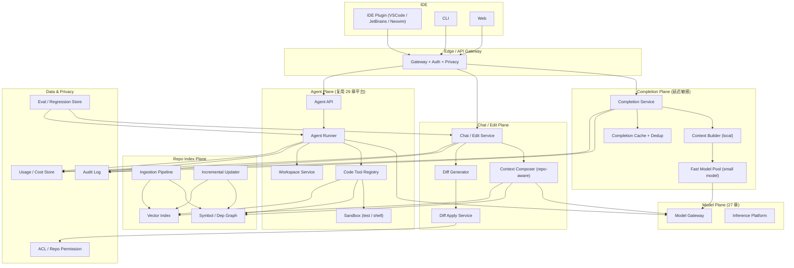

# 系统设计 - 案例 30：AI Coding 助手系统真题模拟

## 题目

设计一个面向企业研发团队的 AI Coding 助手系统，要求支持：

- **Inline completion**：在 IDE 里边打字边出灰字补全
- **Chat / Edit 模式**：开发者问问题、让它改一段代码、多文件重构
- **Agent 模式**：给一个目标（修 bug、跑测试、写新功能），让它自己规划并执行
- 仓库级上下文：不仅看当前文件，还要看相关符号、依赖、历史提交
- 支持多语言（至少 Python / TypeScript / Go / Java）
- 严格尊重用户和仓库权限，不越权读代码
- 开发者的代码默认 **不用于训练**
- 支持私有化部署和 SaaS 两种形态

先不做：

- 代码托管 / 代码审查平台（Git host）本身
- 大规模模型训练
- 自动发布上线
- 面向非技术用户的“自然语言生成完整应用”

---

## 为什么这题值得深讲

AI Coding 助手看起来是一道“典型的 AI 产品题”，但它在系统设计面试里其实很能区分人。

很多回答会停在：

- `IDE 插件 -> 网关 -> LLM -> 回流代码片段`

这是在画架构图，不是在做系统设计。  
因为 AI Coding 助手和普通 LLM API 有几个根本不同：

1. **三种负载的延迟目标差三个数量级**：completion `< 300ms`，chat `< 3s`，agent `几分钟`
2. **上下文组装本身就是一个检索系统**：跨文件、跨仓库、跨符号
3. **输出是要落到代码里的**，所以要处理 diff 应用、冲突、撤销、格式化
4. **合规和隐私是入口级约束**，不是“以后再加的开关”
5. **评测不靠 BLEU 这种指标**，要靠 `单元测试通过率`、`SWE-bench 类回归`、`人类接受率`
6. **和 IDE、Shell、Git、CI、PR 工具链都深度耦合**，API 边界比普通 AI 平台复杂

如果一个候选人真的理解这题，他不应该只是背几个组件，而应该能讲清：

- 为什么 completion 和 chat 要 **走两套完全不同的后端**
- 为什么仓库级索引不是“向量库就够了”
- 为什么 agent 模式是 29 章那套平台的 **一种特例**，不应该重造一遍
- 为什么 `接受率` 是这个系统最重要的业务指标
- 为什么私有化和 SaaS 的区别不只是“装在哪”

---

## 面试官真正想看什么

这题通常在看下面几件事：

1. 你会不会先识别这是三个（其实是四个）不同负载的组合系统
2. 你能不能把 `completion` 的延迟、缓存、取消、代价讲透
3. 你能不能说清仓库级索引：**符号图 + 依赖图 + 语义向量** 的组合
4. 你会不会把 `diff 应用` 当作一个独立难点，而不是“模型直接返回代码”
5. 你能不能把 `sandbox 执行 + 验证回路` 讲成一个真实的子系统
6. 你有没有在设计里留出 **隐私、合规、不训练承诺、零保留** 的位置
7. 你会不会把 **评测** 当作一等公民，而不是事后补丁
8. 你能不能回答“和 GitHub Copilot / Cursor / Windsurf / Claude Code 的差异”，并讲清你这套设计的取舍

---

## 一开始先别急着设计，先收敛题目语义

AI Coding 助手是一个产品语义极其发散的题。我会先澄清：

1. **形态边界**：我们是只做 IDE 插件，还是也做 CLI、Web、CI 插件？
2. **模型策略**：自托管、走第三方、还是混合？企业客户可以选自己的模型吗？
3. **交互模式**：completion、chat、edit、agent 都要吗？还是先做哪几个？
4. **上下文边界**：只看当前文件、打开的 tabs、还是整个仓库？跨仓库呢？
5. **执行能力**：Agent 能跑命令吗？能修改文件系统吗？能发 Git 操作吗？
6. **权限模型**：怎么确定用户可以看哪些代码？和代码托管的 ACL 怎么联动？
7. **数据政策**：prompts / completions 是否允许保留？是否可用于改进？
8. **部署形态**：SaaS、VPC、on-prem air-gap？
9. **评测和灰度**：需要吗？粒度到用户还是到功能？

如果面试官不继续补充，我会把题目收敛成下面这个版本：

- 主要形态是 **IDE 插件 + CLI + Web**，Web 用于对话与 agent 任务面板
- 模型走 **混合后端**：常用模型自托管，前沿能力可转发（27 章那套推理平台）
- **completion / chat / edit / agent 四种模式都要支持**，但延迟和资源池分开
- 默认看 **当前文件 + 打开的 tabs + 仓库索引**；agent 模式可以完整访问仓库
- agent 执行能跑 **测试、lint、build、git diff**，但不能 **push / 发 PR / 修改 CI 配置**，这些需要人工确认
- 权限 **硬绑定** 到代码托管的 ACL（GitHub/GitLab/Bitbucket 或自建 Git host）
- **prompts 和 completions 默认不用于训练，零保留或短期保留可配**
- 同时提供 **SaaS** 和 **VPC/私有化** 两种部署
- 有回归评测和灰度能力，粒度到功能 + tenant + user

这里有三个我会主动说清的关键选择。

### 选择 1：把四种模式当作 **四类负载**，而不是“一个接口 mode 不同”

为什么？

- Completion 是 **延迟敏感 + 极高 QPS + 廉价**：大部分请求会被用户抛弃（打字继续了）
- Chat 是 **延迟中等 + 高质量 + 中等 QPS**：用户在等待，多轮
- Edit 是 **低 QPS + 高准确率 + 要落盘**：输出必须是可应用的 diff
- Agent 是 **极低 QPS + 长任务 + 昂贵**：本质是 29 章那套 Agent 平台

如果一套接口硬塞所有这些，会出现：

- completion 排队被 agent 拖住
- chat 被 completion 的超轻量模型占资源
- agent 没法用专门的 sandbox 池

所以必须按负载拆。

### 选择 2：**agent 模式不是新平台**，而是 Coding 助手在 29 章 Agent 平台上的一个应用

为什么？

- Agent 的通用机制（run 一等对象、two-phase commit、HITL、replay、预算）都能复用
- Coding 只是额外引入：**仓库 workspace 作为一等资源**、**代码相关工具集**、**diff 应用能力**
- 不重复造 Agent 平台，也不是“我们没 Agent”，而是 **这是 Agent 平台的一个 vertical**

这种复用关系会在架构图里清楚体现。

### 选择 3：把 **仓库索引** 当作独立 plane

为什么？

- 仓库级上下文不是“最后一秒拼出来的”，而是一个持续维护的索引系统
- 它既要服务 completion 的 sub-millisecond 检索，又要服务 agent 的 multi-hop 检索
- 它的数据模型比 28 章 RAG 的通用文档索引更强：**符号 + 依赖 + 历史 + 语义向量 + 权限** 五层合一
- 所以必须独立，不能寄生在任何一种模式里

---

## 第一步：先判断这是一个什么类型的系统

我会先明确，这不是一个普通的 AI API 产品，而是一个：

- `多负载`
- `延迟分层`
- `强隐私`
- `强权限`
- `强评测`
- `强 IDE 集成`

的系统。

它同时具备下面几个特征：

1. **极端不对称的请求分布**：completion 占 99%+ 请求数，但可能只占 20% 收入
2. **上下文是最重要的输入**：同一个模型在好上下文 vs 差上下文下，表现差距巨大
3. **输出必须可用**：一段“看起来对”的代码，如果连编译都不过就是负资产
4. **用户反馈极稠密**：每次 accept / reject / 修改都是训练级信号
5. **合规是第一道闸**：很多企业客户对代码外泄极度敏感，方案连不通就别谈了

这些特征意味着主矛盾是：

- 如何用一条可扩展的架构，同时满足 completion 的超低延迟 / chat 的高质量 / agent 的复杂执行 / 合规与评测要求

---

## 第二步：先做一轮容量估算

我会主动给一组面试中合理的假设：

- 企业服务 `10 万` 开发者，日活 `3 万`
- 平均每个活跃开发者每天：
  - 触发 `2000` 次 completion 请求
  - 发起 `20` 次 chat
  - 发起 `5` 次 edit
  - 发起 `1-2` 次 agent
- 日 completion 请求：`3 万 * 2000 = 6 千万`
- 日 chat：`60 万`
- 日 edit：`15 万`
- 日 agent：`5 万`

### Completion 速率

6 千万 / 天 按均匀分布：

- `~700 QPS` 平均
- 工作时段集中（8 小时活跃），峰值 `3x`：`~2000 QPS`
- **取消率极高**：用户继续打字会触发 cancel，大约 `50-70%` 的请求不返回给用户
- **接受率**：典型 `20-35%`

### Chat / Edit 速率

- Chat 平均 `~7 QPS`，峰值 `20-30`
- Edit `~2 QPS`，峰值 `~10`

这些数字单看不夸张，但每次请求 **拼上仓库级上下文** 后，token 量非常大。

### Agent 并发

- 日 5 万，平均每个运行 `5-15 分钟`
- 峰值并发：`5 万 * 10 分钟 / 8 小时 ≈ 1000 并发`，峰值 x3 `3000 并发`
- 每个 agent run 消耗：`10-30 次 LLM 调用 + 5-20 次工具调用`

### Token 规模

- Completion：平均输入 `4000 token`，输出 `200 token`
  - 日输入：`2.4 万亿 token`，日输出 `120 亿 token`
- Chat：平均输入 `20000 token`（带仓库上下文），输出 `1500`
  - 日输入：`120 亿`，输出 `9 亿`
- Edit：平均输入 `15000`，输出 `3000`
- Agent：平均每 run `100k token`

这是个天文数字。立刻能得出的结论：

- 必须有 **prefix cache** / **prompt cache**（27 章那套）
- 必须有 **completion 专用的小型快速模型**
- 必须有 **按用户 / 租户的成本控制**，否则一个公司跑几个月账就爆了

### 索引规模

- 每家客户仓库数 `100 - 10000` 不等，代码规模 `GB 级`
- 全体客户代码量：数百 TB 级
- 符号数量：每个中型仓库 `百万级 symbol`
- 向量维度 `768 - 1536`，平均每个 chunk 一个向量
- 单仓库向量数 `百万级`，存储 `~4-8 GB`

这意味着：

- 索引不能是全局统一的，必须 **按 tenant / 按仓库分片**
- 向量索引要做 **ANN + filter（按路径 / 语言 / 分支 / 权限）**

### 延迟目标

- **Completion**：P50 `~200ms`，P95 `< 500ms`（这是产品成败线）
- **Chat TTFT**：P50 `< 1s`，P95 `< 3s`
- **Edit**：P50 `< 5s`（多文件更慢可接受，要有进度）
- **Agent**：没有严格首 token 延迟，但状态流延迟 `< 500ms`

---

## 第三步：先定义不变量

我会先定义下面几个不变量：

1. **上下文构造永远不能突破用户权限**。未授权的代码不能出现在 prompt 里。
2. **Completion 请求在用户继续打字时必须被立即取消**，且不浪费已用 token 之外的资源。
3. **Edit / Agent 产出的代码变更必须以 diff 形式交付**，不能直接覆盖写盘。
4. **所有改动在合入前必须经过用户同意**。Agent 自动运行时，**破坏性操作需要 HITL**。
5. **Prompt 和 completion 不默认进入任何训练 pipeline**，除非用户明确 opt-in。
6. **同一段代码的索引与权限视图必须一致**。不能出现“索引里能查到但用户没权限”的反向。
7. **评测集在任何时候都是独立数据**，不能被线上 prompt 污染。
8. **Completion 的可观测性采样可以降级**，但 Chat / Edit / Agent 必须 100% trace。

这些背后的意思是：

- **隐私 > 性能**
- **可控 > 聪明**
- **评测独立性 > 方便**

---

## 第四步：从朴素方案一步步推演

## 第一轮：最朴素方案

- IDE 插件 → 后端 → LLM → 回传
- 上下文 = 当前文件 + 前后 N 行
- 没有取消、没有索引、没有 diff、没有 agent

问题会立刻暴露：

1. 跨文件重构做不了
2. 补全延迟差，用户频繁打字会堆积旧请求
3. Chat 质量依赖仓库理解，但没有任何仓库上下文
4. 合规控制没有抓手
5. 评测不存在

这是个能跑的 demo，但不是系统。

## 第二轮：把 completion 拉出来

主矛盾是 completion 的延迟和取消。  
所以第一件事：

- **completion 走独立链路 + 独立模型 + 独立 SLA**
- 支持 **请求取消传播**：IDE 端 abort → 网关传播 → 模型端早停
- 上下文限定为 **前后若干行 + 同文件符号**，不等待跨文件索引
- 大量 **前缀缓存 + 投机解码**

Chat / Edit / Agent 走另一条链路，更重的上下文组装。

这一步后系统已经开始像个真的 coding 助手。

## 第三轮：引入仓库索引

Chat 和 Edit 没有仓库级理解就只是“文件级小聪明”。  
加入 **Repo Indexer**，索引三层：

1. **符号图（Symbol Graph）**：函数、类、变量、引用关系
2. **依赖图（Dependency Graph）**：文件 / 模块之间的 import 关系
3. **语义索引（Vector Index）**：按代码块 + 注释 + 结构化说明

这三层合起来，才能回答：

- “这个函数在哪些地方被调用？”
- “修改这个接口要改哪些文件？”
- “和 X 功能相关的代码在哪里？”

索引必须是 **增量的、跟随 Git 的**，不能每次都重建。

## 第四轮：把 Edit / Agent 的输出规范化

Edit 和 Agent 的输出要落到代码里，必须：

- 以 **标准 patch / diff** 格式返回
- 在后端就能 **apply 到 workspace 快照**，保证自洽
- 有 **冲突检测**（用户本地已改动）
- 有 **undo / 回滚**

不能让模型“直接写一段 code 贴上去”，这是 2023 年的老做法，放在企业场景会事故。

## 第五轮：Agent 模式复用 29 章平台

Agent 模式本质就是：

- 一个 Coding 语境下的 Agent run
- 工具集是代码相关的：`read_file`、`grep`、`run_tests`、`apply_patch`、`git_diff`、`shell`（沙箱）
- Workspace 是 sub-run 共享的一等资源

这里我会**明确复用 29 章的 Agent 平台**，而不是重造：

- run / step / event / HITL / replay 全部复用
- 仅在 Coding 场景补充：workspace service、code tool registry、diff apply service

---

## 核心对象模型

几个新增的一等对象（在 29 章基础上补）：

### `Workspace`

一次 Coding 请求依赖的工作副本，通常是 Git 仓库的某个 commit + 未提交改动。

- `id`
- `repo_id` / `commit_sha` / `branch`
- `tenant_id` / `user_id`
- `mount_mode`: `readonly` / `editable`
- `lifetime`: session / run / persistent
- `acl_snapshot`

Workspace 是 **agent 的沙箱**，也是 **edit 的落盘目标**，所有改动都相对于 workspace。

### `RepoIndex`

一个仓库的多层索引。

- `repo_id` + `commit_sha`
- `symbol_graph_ref`
- `dep_graph_ref`
- `vector_index_ref`
- `coverage`（哪些文件 / 语言成功索引）
- `last_indexed_at`

### `Edit`

一次“让 AI 改代码”的动作。

- `id`
- `workspace_id`
- `input`（自然语言需求 + 选中范围）
- `diff_ref`（生成的 patch）
- `status`: `proposed` / `applied` / `rejected`
- `applied_by` / `applied_at`

### `CompletionRequest`

一次 inline completion（不持久化大部分内容，仅采样抽取用于评测与可观测）。

- `id`
- `user_id`
- `file_hash` / `cursor_pos_hash`
- `latency_ms`
- `accepted`（后续用户是否接受）
- `cancel_reason`

这个对象只做 **轻量观测**，不写进主数据库，走专门的 analytics 链路。

### `CodingAgentRun`

29 章 run 的 subtype，字段额外含 `workspace_id`、`allowed_tools_preset`、`repo_scope`。

---

## 最终高层架构



几个要点：

1. **Completion Plane** 独立，为了保延迟，不依赖任何重服务
2. **Chat/Edit Plane** 走重上下文，用 Repo Index
3. **Agent Plane** 直接复用 29 章平台，只加了 workspace + code tool registry
4. **Repo Index Plane** 独立维护，为 Chat/Edit/Agent 共同服务
5. **ACL** 在 Gateway 和 Diff Apply 都有卡点，不能只在一处

---

## API 设计

### Completion

`POST /v1/completions`

```json
{
  "file_uri": "...",
  "cursor": { "line": 42, "col": 10 },
  "prefix": "...",
  "suffix": "...",
  "language": "python",
  "client_context_id": "..."
}
```

返回 SSE：

- `text_delta`
- `done`
- 可以被 abort（HTTP-level abort / WebSocket close）

要点：

- 支持 **speculative 发送**：IDE 可以连续发，后端去重取最后一个
- `client_context_id` 用来做 dedup 和 cancel propagate

### Chat

`POST /v1/chat/conversations` + `POST /v1/chat/conversations/{id}/messages`

- 流式返回
- 可以附带“相关文件引用”，让 Context Composer 优先考虑
- 返回时带 `citations`（引用的文件 + 行号）

### Edit

`POST /v1/edits`

```json
{
  "workspace_id": "...",
  "scope": { "files": ["..."], "selection": [...] },
  "instruction": "...",
  "apply_mode": "preview"
}
```

返回：

- `diff`（unified diff 格式）
- `summary`
- `confidence` / `risks`（比如触碰了哪些高风险文件）

第二步 `POST /v1/edits/{id}/apply` 真正落盘，支持部分 hunk 接受。

### Agent

直接用 29 章 `POST /v1/runs`，但 `agent_id` 指定 coding agent 模板。

---

## 仓库索引到底怎么做

这是本题最容易被答浅的点。我会按四个维度讲。

### 1. 符号图（Symbol Graph）

- 按 **Tree-sitter / LSP** 解析出：
  - 定义点（definition）
  - 引用点（reference）
  - 继承 / 实现关系
  - 类型信息（尽量）
- 存储为图：`symbol_id -> { def_loc, refs[], kind, parent }`
- 查询：
  - “X 函数在哪被调用”
  - “这个接口的所有实现”
  - “某文件导出的 API 面”

符号图必须 **按语言** 分实现，但对上层查询暴露统一接口。

### 2. 依赖图（Dependency Graph）

- 文件 / 模块 / 包之间的 import 关系
- 语言特定的构建系统信息（`go.mod`、`package.json`、`pyproject.toml`、`pom.xml`）
- 同样建图，支持 BFS / 反向 BFS

依赖图的核心价值：

- 修改 X 会影响哪些下游
- 新功能需要读哪些相关模块

### 3. 语义向量索引（Vector Index）

- 按 **结构化 chunk** 切分（函数级 / 类级 / block 级），**不是按行数切**
- Embedding 包含：代码 + 前置注释 + 文档字符串 + 所在文件路径
- 每个 chunk 存额外元数据：`path`、`language`、`commit_sha`、`symbol_id`、`acl_tag`
- 查询时 **hybrid**：向量 + BM25（符号名 / 文件路径）+ 过滤（语言 / 路径白名单 / ACL）

这里的关键点：

- **代码的向量不能和普通文档一样**：切分要按 AST 结构，不然会把函数切开
- **Embedding 模型要针对代码**，通用 embedding 模型在代码检索上效果差

### 4. 历史信息

- Git blame + commit 信息可以作为补充维度：
  - 最近修改过这段代码的人是谁（用于 code ownership）
  - 某段代码是为什么加入的（commit message）
- 历史信息可以融入 prompt，也可以作为 agent 工具调用

### 增量更新

索引必须增量，不然不可持续：

- Git push / PR 合并触发增量索引任务
- IDE 里未提交的改动用 **dirty overlay**：索引主干是 commit_sha，未提交改动在内存 /  会话级覆盖
- 大重命名 / 大重构用文件级 diff 快速判断是否要重 chunk

### 权限嵌入

每个索引条目必须带上权限标签：

- `tenant_id` + `repo_id` + `acl_tag`
- 查询时 **先过滤后排序**，不是“先检索再过滤”，因为后者可能把不该看的东西喂进上下文

---

## Context 构造：把“好上下文”做成一个子系统

Chat / Edit 的核心不是调模型，而是给模型喂什么。我会把 Context Composer 讲成一个子系统，大致流程：

1. **问题理解**：
   - 是修 bug、加功能、解释代码、还是重构？
   - 影响范围估计
2. **种子集合**：
   - 当前光标位置 / 选中文件
   - 用户在 chat 里 @ 的文件 / 符号
   - 最近打开的 tabs
3. **扩展**：
   - 符号图：这些种子符号的定义、被调用处、相关类型
   - 依赖图：上下游文件
   - 向量：语义相似的其他位置
4. **裁剪**：
   - 每个文件只保留相关片段
   - 过长的文件按 ranker 截断
5. **排序**：
   - 近距离 > 远距离（AST / 文件距离）
   - 高相关性 > 低
   - 新鲜度（最近修改的优先）
6. **压缩**：
   - 多个文件生成一个 layout（带行号，用 fence 包起来）
   - 超长时做摘要

这一串流程每一步都有 trade-off，不能简单“检索 top-k 塞进去”。

### 为什么不直接靠长上下文

长上下文确实可以塞更多，但：

1. **成本线性增加**，completion 延迟会炸
2. **模型注意力会稀释**，反而找不到重点
3. **没有引用** 的上下文对用户透明性差
4. **prefix cache 命中率下降**：长上下文变化大

所以 **好上下文 > 多上下文**。

---

## Diff 生成与应用

### 为什么模型不应该“直接写代码”

早期产品让模型吐完整文件覆盖写，结果：

- 文件末尾被截断
- 和用户本地未提交改动冲突
- 无法局部接受
- 没法做 undo

所以标准做法是：

- 模型输出 **unified diff**（或者等价的 edit script）
- 后端做 **diff apply**
- 支持 **逐 hunk 接受 / 拒绝**

### Diff 格式选择

| 格式 | 优点 | 缺点 |
| --- | --- | --- |
| unified diff | 人类和工具都熟 | 模型容易搞错行号、漂移 |
| search/replace blocks | 不依赖行号，模型输出更稳 | 需要自己 parser，格式模型容易犯错 |
| AST edit script | 结构化，严谨 | 跨语言复杂，模型很难稳定输出 |

业界实践里 **search/replace blocks** 用得越来越多（因为大模型对它错误率最低），但后端要做：

- 查找失败的 **fuzzy match 回退**
- 多处命中的 **disambiguation**
- 空白 / 缩进敏感

无论哪种格式，后端的 **Diff Apply Service** 都要做：

1. 相对当前 workspace 快照解析
2. 冲突检测（用户在等待期间修改过）
3. 格式化（按仓库的 formatter 重格式化）
4. lint 可选预检
5. 落盘生成 patch 对象
6. 可撤销（保留前一版本）

### 冲突处理

- 如果 apply 失败：返回 `conflict` 状态和原因
- 给用户选择：手工合并、重新生成、放弃
- Agent 模式下，自动把冲突作为新的 observation 让 Agent 下一步处理

---

## 沙箱与验证回路

Coding 助手的强大之处在于能 **跑测试、跑 lint、跑编译** 验证自己的改动。这部分要严肃设计。

### Sandbox 要求

- 每个 run 独立容器 / microVM
- 文件系统只能看 workspace 挂载
- 网络出站默认禁止，白名单可配（某些测试需要访问内部 registry）
- 凭证由平台按需注入，不传给 Agent 本身
- 时间 / CPU / 内存 / 磁盘配额

### 启动速度

Agent 会频繁跑测试，沙箱启动速度直接影响 iteration 速度：

- 预热池 + 快照恢复
- Copy-on-write 文件系统
- 依赖缓存（npm / pip / go mod / maven 仓库 mirror）

典型目标：沙箱启动 `< 1s`，带完整项目依赖。

### 验证工具

Agent 可用的代码相关工具：

- `read_file`、`read_directory`
- `search_code`（grep / 符号 / 向量）
- `apply_patch`（diff apply）
- `run_tests`（按项目约定的命令）
- `run_shell`（白名单命令）
- `run_linter` / `run_type_check`
- `git_diff` / `git_log` / `git_blame`

**`run_shell` 是最危险的工具**，必须：

- 白名单命令集
- 无法访问外部网络
- 所有输入 / 输出审计
- 超时强制 kill
- 高风险操作需要 HITL

### 验证回路的节奏

Agent 典型循环：

1. 读相关文件
2. 提出 patch
3. Apply 到 workspace
4. 跑相关测试
5. 如果失败，读错误 / 再改
6. 成功后生成 PR 草稿（但不自动合并）

这个回路有几个工程细节：

- 只跑 **受影响测试**（按依赖图 / test impact analysis），不跑全量
- 测试失败 stack trace 要做 **压缩**，不要把几百行 trace 整段喂进模型
- 超过 N 轮改不对，主动 escalate 给用户

---

## 取消、重试、幂等

Completion 的核心工程难点是取消。

### Completion 的取消

IDE 每次打字都会触发新请求，旧请求在后端可能已经：

- 正在调模型
- 已经消费 prompt cache
- 即将返回

理想处理：

- 客户端 abort → HTTP/2 RST_STREAM → Gateway 传播 → 推理平台早停
- 后端 **cancellation token** 一路传播
- 如果已经有部分输出并可归因，可以仍然记录（用于评测）

### Chat / Edit 的重试

- 用户点“重试”是常见操作
- 必须有 **deterministic replay**（相同 input + seed + cache 应该能复现，或至少能回放事件）
- 相关对话节点的 ID 要稳定，不要每次重试生成新 thread

### Agent 的中断与恢复

直接复用 29 章的 run 机制。

### 幂等

- Completion：幂等通过 `client_context_id` 实现，避免重复计费
- Edit：apply 必须幂等，同一 diff 重复 apply 不应产生二次更改
- Agent：每个工具调用有 idempotency_key

---

## 隐私、合规、不训练承诺

这是 Coding 助手进企业的闸，不是“以后再加”。

### 数据流边界

三类数据，要分清：

1. **Prompt**（包含源码片段）
2. **Completion**（模型输出）
3. **Telemetry**（延迟、接受率、错误）

对企业客户默认：

- **Prompt + Completion**：短期保留（调试用），X 天内删除；不用于训练
- **Telemetry**：长期保留，但不含源码内容
- opt-in 才能“贡献数据改进模型”

### Zero Retention 模式

对极敏感客户：

- Prompt 不落盘，只在内存处理
- Completion 不落盘
- 只保留聚合指标（数量、长度分布）
- 审计仍然需要，但脱敏到只留 hash

### 数据驻留

- SaaS：按区域分集群，欧盟 / 美国 / 亚太数据不互跨
- 私有化：所有数据在客户 VPC 内，控制面 metadata 可选上报

### PII / 密钥识别

- prompt 进入模型前做 **secret scanning**（API key、token、密码）
- 命中后：模糊掉 / 拒绝 / 告警

### 安全供应链

- Agent 生成的代码可能引入恶意依赖
- 对 `package.json` / `requirements.txt` 等的变更要做特殊检查
- 建议集成现有 SCA（Software Composition Analysis）工具

### 合规承诺

- Coding 助手对企业最重要的承诺之一是“你的代码不会用来训练”
- 平台必须从 **架构上** 保证：prompt / completion 走独立队列，**不进入训练 pipeline**
- 这条必须写成规则而不是 SOP

---

## 评测：这才是 coding 助手的命门

AI Coding 助手最容易吹出来的指标是“HumanEval pass@1”。它重要但远远不够。

### 指标分层

| 层级 | 指标 | 采集方式 |
| --- | --- | --- |
| 模型级 | HumanEval / MBPP / LiveCodeBench | 离线 |
| 产品级 | 接受率 / 编辑后保留率（retain rate） / 建议长度分布 | 线上埋点 |
| 任务级 | SWE-bench / 内部 issue 回归集通过率 | 离线 + 偶尔线上 canary |
| 满意度 | 主动反馈、🥲 率、session 时长变化 | 埋点 + 问卷 |

### 接受率 / 保留率

接受率是 coding 助手最重要的单一指标：

- **Accept rate**：completion 返回后用户保留原样的比例
- **Retain rate**：X 小时 / X 天后这段代码仍在工作拷贝里的比例

保留率比接受率更有价值，因为：

- 用户可能接受了但几秒后发现不对删了
- 保留率更接近 **真实价值**

### 回归集

- 从内部真实 bug / issue / PR 中挑选代表性任务
- 每个任务有 **初始状态 + 期望补丁 + 测试**
- 每次模型升级 / 提示词变更都跑
- 业界标杆：SWE-bench / Verified

### 线上实验

- A/B 按用户分桶
- 指标对比：接受率、保留率、吐出长度、单次成本
- 不仅看 mean，看 **tail**：底部 10% 用户的体验是否崩

### Eval 数据隔离

- 回归集永不进入 prompt（避免模型过拟合）
- 训练模型的团队和评测集的所有权必须分开

---

## 和 IDE / Git / CI 的集成边界

### IDE 协议

- VSCode、JetBrains、Neovim 都有各自插件框架
- 用 **LSP 扩展** 或 **专属插件** 通信
- 核心暴露：completion、chat、edit、diff apply、agent run 状态
- 插件通常薄，不能把业务逻辑塞到插件里

### Git 集成

- 读：通过 Git host API 或本地 Git 命令
- 写：Agent 可以生成 commit / branch / draft PR，但合入需要人
- 不应该自动 push 到 main

### CI 集成

- Agent 可以读 CI 状态（比如上次失败的 log）
- 但修改 CI 配置默认需要 HITL
- CI 触发的 AI review 场景属于另一个入口（类似机器人账号），权限独立

---

## Agent 模式在 Coding 场景的特化

Agent 模式在 Coding 场景有几个特别之处：

1. **工具集偏代码**（见前面的沙箱部分）
2. **上下文是 workspace**，而不是自由对话
3. **典型任务模板**：
   - 修 bug（给一个失败测试 / 一个 issue）
   - 加功能（给一段需求）
   - 重构（“把所有用 X 的地方换成 Y”）
   - 升级（“升级到 Node 22”）
4. **评测集明确**（SWE-bench 类）
5. **循环节奏高**：一个 run 可能 20-50 步

其他都直接复用 29 章：run / step / event / HITL / replay / 成本 / 观测。

---

## Completion 链路的工程细节

### 小模型与大模型的分工

- Completion 用 **小模型 / FIM（Fill-in-Middle）专用模型**
- Chat / Edit 用 **通用模型**
- Agent 用 **推理 / 工具使用最强的模型**

小模型的理由：

- Completion 需要 `< 300ms`，大模型难做到
- 大部分 completion 场景是短补全，小模型效果已经不差
- 成本低得多

### Prefix cache + FIM

- Completion 的 prompt 有稳定前缀（文件路径、项目信息、前若干行）
- 27 章那套 prefix cache 能把很多 token 复用
- FIM 模型能同时看 prefix + suffix，精度更高

### 投机解码与反投机

- 投机解码能显著降低 completion 延迟
- 但客户端 IDE 通常也会做客户端 cache + predictive typing
- 两边要协同，避免重复工作

### Dedup

- 同一个 cursor 位置短时间多次请求要 dedup
- 用 `client_context_id + prefix_hash` 标识
- 命中 dedup 直接返回上一个结果

### 流式 vs 一次返回

- Completion 通常只吐几十 token，一次返回常常够快
- 如果要做 streaming，IDE 必须支持逐 token 接受体验（避免闪烁）

---

## 多语言与多仓库

### 多语言

- 每种语言有独立的：Tree-sitter grammar、LSP、formatter、linter、test runner
- 抽象为 **Language Pack**，平台按语言加载
- 新增语言支持 = 实现这套 pack，不动核心

### 多仓库

- 企业常有 **monorepo + 微服务多仓库** 混合
- 跨仓库引用：比如微服务 A 调用微服务 B 的 proto 定义
- 支持 **仓库组（repo group）** 概念，组内可跨仓索引 / 跨仓上下文
- ACL 仍然按单仓库，组只是逻辑上的上下文聚合

---

## 多租户与部署形态

### SaaS

- 标准多租户：物理共享、逻辑隔离
- 小客户直接用
- 资源池按 tenant 配额

### VPC / 私有化

- 整套系统部署到客户 VPC 里
- 控制面 metadata（非代码）可上报到厂商（可选）
- 模型可选：厂商托管、客户自有、混合
- 部署难度大，但对企业来说是关键入口

### Air-gap

- 完全断网部署
- 模型二进制 + 权重预先同步
- 评测集 / 模型升级走离线通道

### 混合部署的权衡

- 控制面在厂商、数据面在客户 VPC：折中方案
- 好处：客户省运维，数据不出去
- 风险：控制面挂会影响可用性，延迟也会增加

---

## 演进路径

### 阶段 1：单一 completion 产品

- 只做 completion，抄 Copilot 那种
- 小模型 + 前后缀 + prefix cache
- 最小可卖产品

### 阶段 2：Chat + 仓库理解

- 上线 chat，接入仓库索引
- 开始收集接受率 / 保留率

### 阶段 3：Edit + Diff Apply

- 支持多文件 edit、diff 流程
- 引入评测回归集

### 阶段 4：Agent 模式

- 复用 29 章 Agent 平台
- 引入 sandbox、tool registry、HITL

### 阶段 5：企业化

- VPC / on-prem、zero retention、SSO、审计、合规认证
- 多模型选择 + 模型灰度

### 阶段 6：多语言 / 多平台扩展

- 更多语言 pack
- Web / CLI / CI 插件扩展

---

## 面试里我会怎么讲最终方案

如果让我设计一个 AI Coding 助手，我会先把语义收敛清楚：支持 completion / chat / edit / agent 四种负载，IDE / CLI / Web 多入口，严格尊重仓库 ACL，prompts 默认不用于训练，支持 SaaS 和私有化部署。关键判断是：这四种模式的延迟、资源、模型、风控都不同，必须按四类负载分开设计，而不是“同一接口 mode 参数不同”。

架构上我会分五个 plane：Completion Plane 用小模型 + prefix cache 扛超低延迟；Chat / Edit Plane 走重上下文和 Diff Apply；Agent Plane 直接复用 29 章的 Agent 平台，workspace 和 code tool registry 是这一层的补充；Repo Index Plane 独立维护符号图 / 依赖图 / 语义向量三层索引，给 Chat / Edit / Agent 共同服务；Model Plane 是 27 章那套推理平台，提供多模型路由。

不变量上，我会强调四条：ACL 永不被 prompt 突破；Edit / Agent 的改动必须以 diff 形式交付并人工确认；prompt 默认不进入任何训练 pipeline；评测集数据永远独立。

如果继续深挖，重点讲 Context Composer（种子 → 扩展 → 裁剪 → 排序 → 压缩）、Diff Apply（search/replace blocks + fuzzy match + 冲突处理）、沙箱（microVM + 预热 + test impact analysis）、隐私（zero retention、数据驻留、secret scanning），以及评测（接受率、保留率、SWE-bench 回归、A/B 灰度）。最后我会说清这套系统相对 Copilot / Cursor / Claude Code 的取舍：如果目标是企业场景，合规 + 评测 + 可私有化是比“模型更聪明一点”更决定成败的事。

---

## 面试官如果继续追问，我会怎么答

### 追问 1：Completion 的 P95 预算怎么分配

- 网络 RTT（IDE ↔ edge）：~30ms
- Gateway / 鉴权 / 预算：~10ms
- Context Builder：~20ms
- Model prefill + 首 token：~150ms
- Decode 20-50 tokens：~50-100ms
- 返回 + IDE 渲染：~20ms
- 合计在 300ms 边界内

### 追问 2：仓库 10GB，百万符号，增量索引怎么扛

- Git push hook 触发增量
- 按 `commit_sha` 做索引版本
- 只对变化文件重算 symbol / chunk / embedding
- 用 Merkle-like 结构做文件级 hash 判断
- Dirty overlay 处理未提交改动

### 追问 3：用户未提交的本地修改怎么参与上下文

- 插件把 dirty buffer hash + 大小发送
- Context Composer 优先使用 dirty buffer 内容，覆盖已索引版本
- 不把 dirty buffer 写入持久索引，只在本次请求有效

### 追问 4：如果模型生成了错的 diff，apply 失败

- 返回结构化 `conflict` 错误，带每个 hunk 的 match 结果
- 用户侧给“重新生成”选项，Agent 模式下自动 observation
- 不应该“部分 apply 一部分放弃”，apply 必须原子

### 追问 5：怎么保证不训练承诺

- 架构隔离：prompt / completion 队列 → 生产 DB（短期） → 按 TTL 删；训练 pipeline 的数据源只从 opt-in 人工标注集 / 开源数据拉
- 合规流程：每次训练数据清单需审计
- 客户侧：合同条款 + 可审计日志 + SOC2 / ISO 认证

### 追问 6：Agent 一跑几十分钟，怎么控制成本

- 每 run budget（token / 美元 / 时间 / 步数）
- 每步 budget check
- 循环检测
- 超预算自动进入 HITL

### 追问 7：为什么不直接用通用 Agent 平台做 Coding Agent

- 本质上就是复用，我们只加了三个东西：workspace、code tool registry、diff apply
- 这是“vertical”的概念，不是重造平台

### 追问 8：小客户没有自己的代码安全团队，出了事怎么办

- 产品侧默认安全开关全部开启（secret scanning、敏感命令拒绝、PR 非自动合并）
- 审计日志默认打开并保留 90 天
- 文档和模板上提供“推荐配置”，让小客户一键应用

### 追问 9：多个开发者同时改同一文件，AI 回答之间会不会“脏读”

- Context 基于 **用户会话 snapshot**，不是全局最新
- Edit apply 之前做冲突检测（基于 base_sha）
- Chat / completion 是只读的，不影响一致性

### 追问 10：Agent 写错代码把 tests 都破坏了，怎么回滚

- Workspace 有版本快照
- Agent run 结束时保留整 run 的 diff
- 用户可以一键“放弃所有改动”
- 对 Git workspace，可以回到 run 开始前的 HEAD

---

## 常见失分点

1. 一上来就说“IDE → LLM → 返回”，没有拆 completion / chat / edit / agent
2. 说 completion 要低延迟，但没有讲怎么做：小模型 / prefix cache / 取消传播 / dedup 一个都没提
3. 把仓库索引答成“向量库就行”，没有符号图 + 依赖图
4. 没有讲 Diff Apply，让模型直接覆盖写代码
5. 没有沙箱设计，Agent 能随便跑命令
6. 没有隐私承诺的架构落地，只是口头说“我们不训练”
7. 没有接受率 / 保留率 / SWE-bench 这类评测
8. 重造 Agent 平台，没意识到可以复用 29 章
9. 没区分 SaaS 和 VPC 部署的差异
10. 没讲多语言 / 多仓库的抽象

---

## 总结

AI Coding 助手真正考的，不是 "让 LLM 写代码"，而是：

`如何围绕四类差异极大的代码任务负载，把仓库级上下文、diff 应用、沙箱验证、隐私合规、评测闭环组织成一个可演进、可私有化、可评估的平台。`

一个更成熟的回答，通常应该按这个顺序展开：

1. 先收敛语义（四类负载、部署形态、合规边界）
2. 再判断系统类型（多负载 + 延迟分层 + 强隐私 + 强评测）
3. 再定义不变量（ACL、diff-only、零训练、评测独立）
4. 再走一遍朴素到成熟的推演
5. 再把五个 plane 分开讲（Completion / Chat-Edit / Agent / Repo Index / Model）
6. 最后讲 Context 构造、Diff Apply、沙箱、隐私和评测

---

## 自测问题

1. 如果 completion 的 P95 突然从 300ms 飙到 1s，你会先查哪三条链路？
2. 用户在 dirty buffer 中写了一行 API key，Agent 模式要跑 shell，你的系统应该在哪一步拦截？
3. 如果要从 SaaS 扩展到 air-gap 部署，需要改哪些部分？哪些部分基本不用动？
4. 一个 Edit 要改 30 个文件，生成了 60 个 hunk，你的 Apply 策略是一起提交还是分批？为什么？
5. 如果模型升级后接受率掉了 5%，你怎么判定是模型问题还是 Context Composer 问题？
6. 跨仓库依赖的 index，怎么处理一个仓库改了接口导致另一个仓库失效？
7. Agent 跑出一个绿灯方案，但用户说“这个方案不对”，你的回归集要怎么捕获这种情况？
8. 如果客户要求 prompt 全部在 VPC 内处理但又希望用最强的闭源模型，你怎么设计 trade-off？
