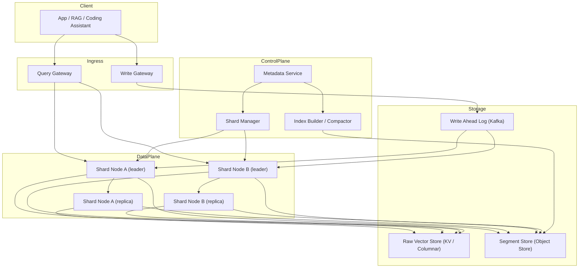

# 系统设计 - 案例 31：向量数据库 / ANN 检索引擎真题模拟

## 题目

设计一个面向企业多租户的向量数据库系统，要求支持：

- 大规模向量存储和近似最近邻（ANN）检索
- 向量维度从 128 到 4096 不等
- 支持元数据过滤（filter-aware search）：按 tenant、时间、tag 等
- 支持增量写入、更新和删除
- 支持快速数据重建和版本切换（换 embedding 模型时）
- 支持混合检索（hybrid：向量 + 关键词）
- 提供持久化、复制、灾备
- 对单请求 P95 < 50ms（在 1–10 亿向量、topK = 50、filter 命中率合理的前提下）
- 多租户隔离、配额、可观测

先不做：

- 全球多区域主主写
- Embedding 模型本身
- 图神经网络 / 自定义图上检索
- 非常低端单机嵌入式模式（比如 SQLite 向量扩展）

---

## 为什么这题值得深讲

向量数据库在 2023-2024 年被讲得极多，但系统设计面试里常常答得很浅。很多回答会停在：

- `HNSW / IVF 简单提一下 -> 说 Milvus / Pinecone / Qdrant`

这只是报名词，不是做设计。因为向量数据库和普通数据库的几个根本差别：

1. **数据结构不是 B-tree，而是 ANN 图 / 倒排**，更新代价、一致性模型、分片策略都完全不同
2. **检索不是“精确找”而是“近似找”**，召回、精度、延迟是三角 trade-off
3. **写入会劣化索引**：删除往往是墓碑，长时间不重建索引质量会退化
4. **过滤 + 向量** 的组合非常坑：要么先过滤再搜、要么搜后再过滤、要么两者融合，后果差很多
5. **Embedding 模型升级** 意味着整个数据集要重嵌入，这是系统级事件
6. **硬件是主要成本**，内存 / SSD / GPU 的选型直接决定架构

如果一个候选人真的理解这题，他不应该只是报算法名，而应该能讲清：

- 为什么写入和检索要走两个 plane
- 为什么 filter-aware search 有三种做法，各自坏在哪
- 为什么 HNSW 在高写入场景会慢慢垮
- 为什么 `pre-filter` / `post-filter` / `hybrid filter` 要按 selectivity 动态选
- 为什么 embedding migration 是这类系统的“发版仪式”
- 为什么 scalar quantization / product quantization 不是“随便压”

---

## 面试官真正想看什么

这题通常在看下面几件事：

1. 你能不能先澄清“向量数据库的定位”：是 KV 还是分析型？是独立系统还是搜索引擎扩展？
2. 你能不能把 HNSW / IVF / IVF-PQ / DiskANN / ScaNN 讲清 trade-off，而不只是报名
3. 你会不会把 **filter** 当作一等问题，而不是“最后 where 一下”
4. 你能不能说清增量写 / 删除 / 重建之间的关系
5. 你会不会把 embedding migration 和灰度、回滚一起讲
6. 你能不能把 **分片 + 副本 + 一致性** 按真实的访问模式设计
7. 你有没有意识到向量库的成本模型基本上是 **内存成本**
8. 你能不能回答“什么时候应该在 Elasticsearch / OpenSearch 里做向量，什么时候要独立向量库”

---

## 一开始先别急着设计，先收敛题目语义

向量数据库题目很容易发散，必须先澄清：

1. **规模**：向量数、每条向量的维度、topK、filter selectivity
2. **写入模式**：批量导入为主，还是持续小写入流？
3. **更新频率**：一个向量的 upsert / delete 常不常见？
4. **延迟目标**：P95 / P99 到底是多少？不同租户要不要差异化？
5. **一致性要求**：是不是要求写后立即可查？是不是能接受秒级新鲜度？
6. **多租户**：租户数量、单租户大小、是否需要严格数据隔离
7. **查询类型**：只有 topK + filter？还是还要做 range、聚合、reranking？
8. **Embedding 模型策略**：多套模型并存？会不会频繁换模型？
9. **部署形态**：SaaS 多租户，还是单租户独立集群，还是嵌入式？

如果面试官不继续补充，我会把题目收敛成下面这个版本：

- 服务 `1000` 个企业租户，总体 `10 亿` 规模向量
- 维度默认 `1024`，范围 `128–4096`
- 写入：每租户每天 `百万级`，峰值 `1 万 写 QPS`
- 读：总体 `1 万 QPS`，单租户峰值 `2000 QPS`
- topK 一般是 `20–200`
- filter 常命中率 `10-30%`，极端情况 `0.01%` 或 `>90%`
- 延迟目标：P95 `< 50ms`，P99 `< 150ms`
- 一致性：**写后 1 秒内可查**（不是强一致，但不能分钟级）
- 支持 **按模型版本** 分命名空间，一套表里能并存多个 embedding 版本
- SaaS 多租户，强逻辑隔离；大客户支持独立集群部署

### 关键选择

这里我会主动说清三个选择。

#### 选择 1：向量数据库是 **专用系统**，不是通用数据库的扩展

为什么？

- 向量索引的数据结构、写放大、重建需求、硬件画像都和 KV / 关系数据库不一样
- 通用数据库加一个 vector 类型可以跑但难扩规模（> 亿级通常不够）
- **当你需要的是“ANN 索引作为一等引擎”** 时，应该上专用系统

但我不会一味推“独立向量库”：

- **小规模 + 以文本检索为主**（百万级 / 千万级）→ 搜索引擎的向量扩展往往够用（ES / OpenSearch / SolrCloud 的 KNN）
- **大规模 + 向量为主 + 多租户** → 独立向量库

#### 选择 2：**filter-aware** 从第一天就做，不是后加

- Filter 不是“把结果过滤一遍”，而是要深度参与索引遍历
- 否则会陷入“先 ANN 搜回 1000 个，filter 后只剩 3 个，召回烂到没法看”

#### 选择 3：数据与索引 **分开** 管理，支持 **多索引版本并存**

- 原始向量 + 元数据是 source of truth
- 索引是派生对象，可以重建、替换、A/B
- 这让“换模型 / 换索引算法 / 改参数”变成 **不 downtime 的运维操作**

---

## 第一步：先判断这是一个什么类型的系统

我会先明确，这是一个：

- **写放大高**（更新索引代价大）
- **内存成本主导**（索引必须放内存或大部分放内存）
- **近似而非精确**（正确性有容忍度）
- **读延迟敏感**
- **多租户 + 强隔离**
- **周期性重建** 是常态

的系统。

它同时具备几个特征：

1. **访问模式极其单一**：绝大多数查询是 `top-K ANN + filter`，少量是 `by_id get`
2. **写入和读取共用数据结构**：不像 LSM 那样写内存、后台 compact 成本稳定
3. **索引退化** 是一个独立问题：长时间增删后，HNSW 图质量下降，IVF 的 centroid 不再最优
4. **硬件画像**：要么纯内存（贵）、要么 SSD + 内存混合（DiskANN 这类）、要么有 GPU 辅助
5. **非平凡的多租户分配**：大租户可能独占分片，小租户要多租共享

这些特征意味着主矛盾不是“搜索速度”，而是：

- 如何在 **写入、更新、过滤、重建、租户隔离** 交织的真实工作负载下，保持可用延迟和召回，并且成本可控

---

## 第二步：先做一轮容量估算

### 向量规模与内存

- 10 亿 × 1024 维 × float32 = `10 亿 × 4KB = 4 TB` 原始向量
- 若纯内存 HNSW，索引本身还要图边（每节点 M=16–48 邻居）：额外 `0.5–1.5 倍`
- 所以全内存方案约 `6–10 TB` 内存

这立刻说明：

- 全内存不现实，除非用非常 **激进的量化**
- 或者做 **SSD-backed**（DiskANN 类）

### 量化后的容量

- 如果用 **PQ（Product Quantization）** 压到 `32 字节 / 向量`：
  - `10 亿 × 32B = 32 GB` —— 戏剧性下降
  - 但召回率明显下降，要和 reranking 搭配
- 如果用 **scalar quantization int8**：
  - `10 亿 × 1024 × 1B = 1 TB`，召回几乎不下降
- **二进制量化 + hamming** 极端压缩到 `128 字节`，但牺牲大

所以真实工程里常见分层：

1. 粗检索用 **压缩索引**（PQ / 二进制）
2. 精排用 **原始 float32**（或 int8）做距离精算

### 读写 QPS 与并发

- 读：1 万 QPS，P95 50ms → 要求 500 在途查询
- 写：1 万 QPS，峰值 3 万
- 每秒写 3 万 = 每天 25 亿，需要 **分片 + 批量化**

### 分片

- 每分片目标 `5 千万 - 1 亿` 向量（单 shard 容易维护）
- 10 亿总规模 → 10-20 分片
- 多租户下，分片既可以 **水平切（按 hash）** 也可以 **按租户切（tenant-colocated）**

### 索引构建时间

- HNSW 建 1 亿向量，单机约 **几小时到一天**
- 如果支持 embedding migration，需要重建，规划“后台构建 + 原子切换”

---

## 第三步：先定义不变量

1. **原始向量和元数据是真相源**，索引可以重建、替换、降级
2. **同一 collection 内，相同 id 的向量只有一个当前有效版本**（删除 / 更新语义清晰）
3. **filter 不能被跳过**：任何返回结果都必须满足 filter 条件
4. **查询不能跨租户**：无论系统多忙，不可能把 A 的向量返回给 B
5. **索引降级可以影响召回，但不能影响正确性**：压缩 / 量化 / 重建中，返回的结果仍是“有效数据”的子集
6. **写后新鲜度有上限**：默认 `< 1s`（可配置）
7. **删除是权威的**：一旦删除，即使索引里还没清，查询必须过滤掉

这些不变量背后是：**“正确性 > 召回率 > 延迟 > 成本”**。

---

## 第四步：从朴素方案一步步推演

## 第一轮：最朴素方案

- 向量直接存进 PostgreSQL，某表一列 vector
- 查询时全表扫描算余弦相似度 topK
- filter 在 SQL where 里

问题：

- 线性扫描 O(n)，十万数据已经慢
- 数据库索引无法加速
- 无法多租户规模化

这是 demo，不是系统。

## 第二轮：加 ANN 索引

- 用 HNSW 或 IVF 建内存索引
- 写入时既更新底表又更新索引
- 查询时直接打索引

问题：

- 索引构建慢，更新更慢
- 重启数据要重新加载（内存索引无持久化）
- 多租户共享一个大索引，任何一个租户都会拖慢别人
- Filter 怎么做还没考虑

## 第三轮：数据 / 索引分离 + 分片

- 原始向量 + 元数据持久化到 **columnar / KV**
- 索引是派生对象，按 **shard + 副本** 管理
- 每个 shard 独立构建自己的 HNSW 或 IVF
- 查询在 coordinator 做 scatter-gather

这开始像一个真实向量库。  
但还要解决：

1. 写入 / 索引构建如何协同
2. filter 怎么做
3. 副本一致性
4. 重建和切换

## 第四轮：写入管线化

- 写入走 append-only log（类似 WAL）
- 数据进入 **memtable**（待索引的新向量）
- 达到阈值后构建 **segment**（小 HNSW 或 IVF）
- 后台 **compact**（合并 segment、重建 HNSW）

这是 LSM 思想在向量上的复刻。

- 查询时 **查询所有 active segment + memtable**，合并 topK
- 删除用 **tombstone**，查询时过滤
- 定期 **compact** 减少 segment 数量

## 第五轮：filter 和向量融合

- 按 filter selectivity 分三种策略：
  - **高选择率**（> 50%）：向量优先，后过滤
  - **中选择率**：在 HNSW 遍历过程中做 dynamic filter
  - **低选择率**（< 1%）：先 filter 后向量（甚至退化成全量 kNN）
- 系统要 **运行时判断走哪条**

## 第六轮：分片策略与租户隔离

- 小租户共享分片（多租共享节点）
- 大租户独占分片
- 每个 collection 有自己的分片方案

## 第七轮：Embedding migration

- 支持多模型版本并存
- 新增字段：`embedding_version`
- 一个 collection 的查询可以指定 version
- 后台重嵌入 + 构建新版本，绿灯后切流量

至此系统算是成熟。

---

## 核心对象模型

### `Collection`

- 逻辑上的向量集合
- 字段：
  - `id`、`name`、`tenant_id`
  - `schema`：维度、metric（cos / L2 / dot）、元数据字段
  - `active_index_version`
  - `shard_count` / `replica_count`
  - `quota`

### `Segment`

- 不可变的索引片段
- 字段：
  - `id`、`collection_id`、`shard_id`
  - `vector_count`
  - `tombstones`
  - `index_algo`（HNSW / IVF / IVF-PQ / Flat）
  - `storage_ref`（文件 blob）

### `Memtable`

- 当前可写分片的活跃段
- 字段：
  - `shard_id`
  - `vectors[]`（未索引或简单暴力索引）
  - `size`

### `Tombstone`

- 删除标记
- 字段：
  - `collection_id`、`vector_id`、`deleted_at`

### `IndexVersion`

- 一个 collection 当前的索引版本配置
- 字段：
  - `version`
  - `algo` / `params`（M、efConstruction、nlist 等）
  - `embedding_model`
  - `status`（building / ready / retired）

### `RawVectorStore`

- 真相源
- 按 collection 分表，按 id 点查
- 通常是 KV 或列式存储

---

## 最终高层架构



几个关键点：

1. **WAL + replication**：写入先进 WAL，再由 shard leader 应用，副本从 WAL 同步
2. **Segment Store 是共享的对象存储**：这让节点重启后不需要重新构建索引
3. **Index Builder** 独立服务：既负责实时 segment 的后台 compact，也负责全量重建
4. **Metadata Service**：存 collection / shard / version / tenant，Raft 保证一致

---

## API 设计

### 写入

`POST /v1/collections/{c}/vectors`

```json
{
  "vectors": [
    {
      "id": "doc_1#chunk_3",
      "vector": [...],
      "metadata": { "tenant": "...", "tag": "...", "ts": "..." },
      "embedding_version": "e5_v3"
    }
  ]
}
```

- 默认 upsert 语义
- 返回 `commit_ts`（可用于等待可见性）

### 查询

`POST /v1/collections/{c}/search`

```json
{
  "vector": [...],
  "top_k": 50,
  "filter": { "tenant": "...", "ts": { "$gt": 1700000000 }, "tag": { "$in": ["x", "y"] } },
  "embedding_version": "e5_v3",
  "search_params": { "ef": 128 },
  "return_vectors": false
}
```

返回：

```json
{
  "hits": [
    { "id": "...", "score": 0.87, "metadata": {...} },
    ...
  ]
}
```

### 删除

- `DELETE /v1/collections/{c}/vectors/{id}` 单条
- 或 `POST /v1/collections/{c}/vectors:deleteByFilter`

### Collection 管理

- `POST /v1/collections` 创建：指定 schema、metric、分片
- `POST /v1/collections/{c}/indexes` 创建索引版本
- `POST /v1/collections/{c}/indexes/{v}/activate` 激活

---

## ANN 索引算法的 trade-off

这是本题最容易被记混的部分。我会给结构化的对比。

### HNSW（Hierarchical Navigable Small World）

- **原理**：多层 small-world 图，上层稀疏快导航，下层密集精找
- **优点**：召回高、查询快、参数少
- **缺点**：内存占用大（存图）、构建慢、**不擅长高频更新**（删除是墓碑、更新是删+插，图劣化）
- **参数**：`M`（每节点邻居数，通常 16-48）、`efConstruction`（构建时搜索广度）、`ef`（查询时搜索广度）
- **适合**：读多写少、高召回要求

### IVF（Inverted File Index）

- **原理**：先 k-means 分簇（centroid），查询时找最近的若干簇，在簇内做 brute force
- **优点**：内存小（只存 centroid + 倒排），构建快，**更新友好**
- **缺点**：召回依赖 nprobe（查多少簇），centroid 老化要 retrain
- **参数**：`nlist`（簇数）、`nprobe`（查询时走几簇）
- **适合**：数据大、更新频、召回容忍

### IVF-PQ（IVF + Product Quantization）

- **原理**：在 IVF 基础上，每簇内向量用 PQ 压缩
- **优点**：内存极小
- **缺点**：召回显著下降，需要 rerank
- **参数**：`m`（子空间数）、`nbits`（每子空间比特数）
- **适合**：极大数据、内存受限

### DiskANN（SSD-backed）

- **原理**：一种优化的图索引（Vamana），主要存 SSD，内存只 cache 少量元数据
- **优点**：把向量规模和内存解耦，百亿规模可行
- **缺点**：SSD 带宽是瓶颈，查询延迟略高
- **适合**：超大规模 + 成本敏感

### ScaNN

- **原理**：Google 的混合方案，anisotropic 量化 + 分层搜索
- **优点**：在合理召回下延迟非常低
- **适合**：Google 生态友好，集成到 Vertex / BigQuery

### Flat（Brute Force）

- **原理**：不建索引，暴力算
- **优点**：100% 召回，简单
- **缺点**：O(n)
- **适合**：小数据、rerank 阶段

### 我的典型选择

- **V1 主力**：HNSW（内存）+ 原始 float32，保证高质量
- **大数据**：IVF-PQ 粗检 + HNSW/Flat 精排（两阶段）
- **海量 + 冷数据**：DiskANN
- **内存极限优化**：int8 / 二进制量化 + rerank

---

## Filter-aware search 的三种策略

Filter 是向量数据库的难点，也是面试最能区分深度的地方。

### 策略 1：pre-filter（先过滤后搜）

- 先用元数据索引筛出候选集
- 在候选集上做向量比较（brute force）
- **适合 selectivity 很低**（命中很少）的场景
- **问题**：如果候选集大（几百万），暴力算就崩了

### 策略 2：post-filter（先搜后过滤）

- ANN 搜回 `k*` 个候选（比 top_k 大）
- 对每个候选检查 filter
- 保留满足 filter 的前 top_k
- **适合 selectivity 很高**（命中多）的场景
- **问题**：如果 selectivity 低，可能 ANN 回来 1000 个也只命中 2 个，召回急剧下降

### 策略 3：in-search filter（融合在 ANN 遍历中）

- 在 HNSW 图遍历时，只扩展满足 filter 的邻居
- **适合 selectivity 中等** 的场景
- **问题**：如果 filter 使图的 reachability 被破坏（某些区域全被过滤），会出现“搜不出来”
- 需要 fallback 机制

### 怎么选

- **基于 selectivity 运行时决策**：
  - 估算 selectivity（元数据索引统计）
  - Selectivity < 1%：pre-filter
  - Selectivity 1%–50%：in-search filter
  - Selectivity > 50%：post-filter
- **degrade 路径**：in-search filter 搜不够结果时，自动转 pre-filter 补齐

这一套机制是成熟向量库才有的，面试里能讲出来就很加分。

### Filter 的建模

- 支持常见谓词：`=`, `!=`, `in`, `range`, `contains`
- 不支持无限灵活的表达式（那会拖慢一切）
- 常用 filter 字段建 **辅助索引**（倒排 / bitmap）
- tenant_id 作为强制 filter，由系统注入

---

## 分片策略

### 按 hash 分片

- 向量 id hash 分 shard
- 均匀负载
- 但同租户向量分散在所有分片，每次查询都要 scatter-gather 全分片

### 按 tenant 分片

- 租户 co-located 到特定分片
- 查询只打相关分片（负载轻）
- 但大租户可能扛不住单分片，需要进一步子分

### 混合

- 大租户独享多分片
- 小租户 colocate 到共享分片
- 系统自动检测 tenant 体积并调度

实际系统（如 Pinecone、Qdrant）基本走混合。

### Scatter-gather 的 coordinator

- 每次查询：coordinator 发请求到相关 shard，收集 topK，再合并
- 超时策略：某 shard 慢，可选“降级返回”（带 `partial` 标记）

---

## 副本与一致性

### 写入流程

1. 客户端 → Write Gateway → **WAL（Kafka）**
2. Shard leader 消费 WAL，更新 memtable + raw store
3. Replica 从 WAL 同步（或从 leader 拉）
4. Ack 给客户端：`WAL 写成功` 或 `leader apply 完成`（可选）

### 读一致性

- 默认 **eventual**：memtable 刷入可能有轻微延迟
- **read-your-own-write**：用 `commit_ts` 作 watermark，查询时指定“至少看到 ts 之前的数据”
- **强一致读**：路由到 leader 且等 apply 完成（罕见需求）

### Replica failover

- Leader 挂：shard manager 选新 leader（raft or coordinator)
- 新 leader 从共享 segment store + WAL 恢复
- 恢复时 **只加载 segment**，不重建索引

---

## 写入路径与后台 compact

### 写入阶段

1. 写入 WAL（持久化）
2. 写入 raw vector store
3. 进入 memtable（待索引）
4. Memtable 达到阈值，flush 成 segment

### Segment flush

- 小段建小 HNSW（或 flat）
- 小段数量增多查询变慢（要查每个 segment）
- 后台定期 compact：合并多个小段为大段，重建索引

### Compact 策略

- 大小分层（类似 LSM level）
- 按 tombstone 比例触发（墓碑太多影响召回）
- 后台限流，避免挤占查询资源

### Tombstone 清理

- Compact 时真正删除被标记的向量
- 之前查询要全程过滤墓碑

---

## Embedding migration

这是向量库的“发版仪式”，面试里会被重点问。

### 为什么会发生

- 团队从 `text-embedding-ada-002` 换到 `text-embedding-3-large`
- 或者内部模型升级到新版
- 不同模型的向量不兼容，不能混在一起

### Migration 流程

1. 声明新 `embedding_version`
2. 后台任务重算所有文档的 embedding（通常通过 27 章推理平台 batch）
3. 写入新版本向量（带 version tag）
4. 新旧并存期间，查询选择 version
5. 新版本索引构建完成，ready
6. 切流：
   - 灰度：部分查询走新版本
   - 比对：并行查新旧，对召回 / 满意度做 A/B
7. 全量切换，旧版本标记 retired
8. 清理

### 要点

- 系统必须允许 **多版本并存**
- 查询必须能 **按版本路由**
- 评测集要覆盖 **版本对比**
- 存储要算好 **双倍成本** 的过渡期

---

## Hybrid 检索（向量 + 关键词）

纯向量不够的场景：关键词命中、符号匹配、稀有实体。

### 两路融合

- 并行跑 BM25 / 倒排 和 向量
- 用 Reciprocal Rank Fusion（RRF）或学习型融合模型合并

### 学习型融合

- 用小模型学 `[bm25_score, vector_score] -> final_score`
- 需要标注数据

### 混合建模

- 有些系统（ColBERT、SPLADE）把稀疏和稠密合一做

我的推荐（面试里）：

- V1 用 **BM25 + Vector + RRF**：工程简单，效果好
- 大规模可做 rerank 模型（cross-encoder）精排
- 复杂检索才上 ColBERT / SPLADE

---

## 多租户隔离与配额

### 隔离维度

- **逻辑**：每个 collection 带 tenant_id，强制 filter
- **物理**：大租户独占 shard 甚至节点
- **资源**：CPU / 内存 / 查询 QPS 配额

### 配额

- 每 tenant 向量数、存储大小、QPS 限制
- 满额：写拒绝、查限流

### Noisy neighbor

- 一个租户的高频慢查可能拖慢共享节点
- 做 **每租户查询队列 + 公平调度**
- 极端情况下隔离到独占节点

---

## 观测与成本

### 指标

- 写 QPS、读 QPS、延迟分布（P50/P95/P99）
- Memtable 大小、segment 数
- 压缩积压
- 召回率（通过 **金标查询集** 持续评估）
- 每查询的 **访问节点数**、**扫描向量数**
- 内存 / 磁盘使用

### 召回率监控

- 维护一个 **ground truth 查询集**（用 brute force 算 top_k）
- 定期回放，比对 ANN 结果 top_k
- 设阈值报警（召回跌破 95% 报警）

### 成本构成

- 主要是 **内存**（放索引）
- 其次是 **CPU**（查询计算）
- 存储便宜但量大（raw + segment）
- GPU 可选（加速 build / batch search）

### 成本优化手段

- 量化（int8 / PQ / 二进制）
- 冷热分层（热数据内存，冷数据 DiskANN）
- 共享租户（小租户拼 shard）
- 索引参数精细化（低维数据不需要高 M）

---

## 和 Elasticsearch / OpenSearch 的对比

什么时候用 ES 的向量扩展，什么时候独立向量库？

### ES + KNN 更合适

- 你已经有一个 ES 集群在跑文本检索
- 向量量中等（百万到亿级）
- 需要强大的全文检索 + 向量的混合能力
- 团队更熟悉 ES 生态

### 独立向量库更合适

- 向量数十亿级
- 对 P99 延迟有硬要求
- 需要先进索引（DiskANN、多版本、热重建）
- 团队愿意运维专用系统

### 面试里稳妥答法

- “如果规模不超过亿级、主业务是文本检索、向量只是辅助，我会优先评估 ES/OS 的向量扩展；如果向量是核心、量级超过十亿、或对多租户 / 多模型版本有复杂要求，才上独立向量库。”

---

## 演进路径

### 阶段 1：小规模

- 直接用 PG + pgvector / ES + KNN
- 百万到千万向量

### 阶段 2：独立向量库

- 单集群，HNSW，简单 shard
- 亿级数据

### 阶段 3：工程化

- 写 WAL + 副本、segment compact、filter-aware
- 多租户配额

### 阶段 4：多索引 / 多版本

- 支持 multi-index version、embedding migration
- 冷热分层（HNSW + DiskANN 混合）

### 阶段 5：跨区域 / 高可用

- 多区域复制
- 灾备和演练

---

## 面试里我会怎么讲最终方案

如果让我设计一个向量数据库，我会先把语义收敛清楚：10 亿级向量、多租户 SaaS、P95 50ms、写后 1 秒可见、支持 filter、支持多 embedding 版本并存。

核心判断是：向量库是专用系统，它的主矛盾不是“搜索快”，而是“在写入 / 过滤 / 重建交织的真实负载下，保持召回、延迟、成本三者平衡”。所以架构上数据和索引必须分离：原始向量 + 元数据是真相源，索引是可重建、可替换、可多版本并存的派生对象。

系统沿着 WAL → memtable → segment → compact 的 LSM 思想组织写入；查询时在 coordinator 做 scatter-gather，落到 shard 上执行。Filter 按 selectivity 动态选 pre-filter / in-search filter / post-filter 三条路径，是这类系统和“向量库玩具”最大的区别。

索引算法我会默认 HNSW + float32 / int8 作主力；超大规模走 IVF-PQ 粗检 + rerank 精排；成本极限场景上 DiskANN 做 SSD-backed。Embedding migration 被设计成一次可灰度、可回滚的发版仪式，多版本并存 + 查询按版本路由。

如果继续深挖，重点讲 filter-aware 的 selectivity 估计、segment compact 策略、副本与一致性（默认 eventual，可选 read-your-own-write via `commit_ts`）、多租户的 hash + tenant 混合分片、以及召回率监控和金标查询集。

---

## 面试官如果继续追问

### 追问 1：HNSW 高频更新劣化怎么办

- 删除是 tombstone，查询时过滤
- 定期 compact 真正物理删除并重建相关局部图
- 极端情况下重建整个分片（低峰期）

### 追问 2：selectivity 非常低（万里挑一）怎么办

- 自动切 pre-filter：先用元数据索引（bitmap / 倒排）筛出候选，再暴力向量
- 如果候选仍很大（几十万），用 IVF-PQ 粗检 + Flat 精排

### 追问 3：多个租户同时批量导入怎么不互相影响

- 写入队列按租户分开
- 配额限制每租户写 QPS
- Compact 按租户优先级 / 公平调度

### 追问 4：在线搜索时 Compact 抢资源怎么办

- Compact 和查询分进程 / 分线程池
- 自动限流（检测查询 P99 升高就降 compact 速率）
- 优先级：查询 > compact > 全量重建

### 追问 5：怎么保证召回率不退化

- 维护金标查询集
- 每分钟抽样跑，回比 ANN 结果 top_k 与 ground truth
- 报警阈值：召回 < 0.95 告警，< 0.9 触发应急重建

### 追问 6：Embedding 迁移期间成本太高怎么办

- 分批重嵌入，不一次性
- 旧版本保留只读
- 灰度放量，新版本达到目标召回再下掉旧版本

### 追问 7：多维度（混合检索）怎么工程化

- BM25 + 向量并行
- 小模型 RRF 融合
- 成熟后用 cross-encoder rerank top-K

### 追问 8：你说的 P95 50ms，怎么分配这个预算

- 网络 + gateway：5ms
- Coordinator fan-out：5ms
- Shard HNSW 搜索：20ms
- Rerank / Filter：10ms
- 回传：10ms

### 追问 9：如果某个 shard 一直慢，系统怎么反应

- Coordinator 观察到 P99 超，标记该 shard 为 degraded
- 查询返回时标注 `partial_result`
- 后台告警 + 运维介入

### 追问 10：写入一次失败怎么办

- 如果 WAL 写失败，直接返回失败（客户端重试）
- 如果 WAL 成功但 leader 未 apply 成功，replica 仍会从 WAL 补
- 客户端可用 `commit_ts` 确认可见性

---

## 常见失分点

1. 把向量数据库答成“加个 HNSW”，没说 WAL / segment / compact / multi-version
2. Filter 一笔带过，没讲三种策略的 trade-off
3. 没有金标召回监控
4. 不区分 embedding 模型升级的系统级流程
5. 没讲租户隔离的物理 + 逻辑两层
6. 硬推独立向量库，不承认 ES/OS 也能解决很多场景
7. 量化 / 压缩只报名词，没讲精度牺牲和 rerank 搭配
8. 没有成本模型，谈不出“为什么贵”
9. 没讲 scatter-gather 及 shard 失败处理
10. 忘了写入 / 读取使用相同数据结构带来的资源竞争

---

## 总结

向量数据库真正考的不是“哪个索引算法最快”，而是：

`如何在十亿级、持续写入、元数据过滤、多租户、多模型版本并存的真实负载下，把召回、延迟、成本、正确性平衡成一个可运营的系统。`

一个更成熟的回答，通常应该按这个顺序展开：

1. 先收敛规模和访问模式
2. 再判断是不是真的需要独立向量库
3. 再定义不变量（正确性 > 召回 > 延迟 > 成本）
4. 再走一遍朴素到成熟的推演（WAL / memtable / segment / compact）
5. 再把 filter-aware、分片、副本、多版本串起来
6. 最后讲成本、观测、migration、演进路径

---

## 自测问题

1. 如果用户要求 100% 召回，你的系统能做什么、不能做什么？
2. 一个租户突然要导入 10 亿向量，你系统要怎么应对？
3. Filter 条件是 `ts > now - 1h`，selectivity 通常 < 0.1%，你选哪种过滤策略？为什么？
4. Embedding 模型从 1024 维升级到 3072 维，整个 migration 过程你要设计几个阶段？
5. 如果集群里一个节点宕机，replica 还在，是否需要立刻重建索引？从哪里恢复？
6. 如果要把最热 10% 的数据放内存，其余放 SSD，你会怎么改架构？
7. 为什么删除向量要用 tombstone 而不是立即移除？立即移除的代价在哪里？
8. 多租户共享 shard 时，如何防止某个大租户查询把其他租户拖垮？
