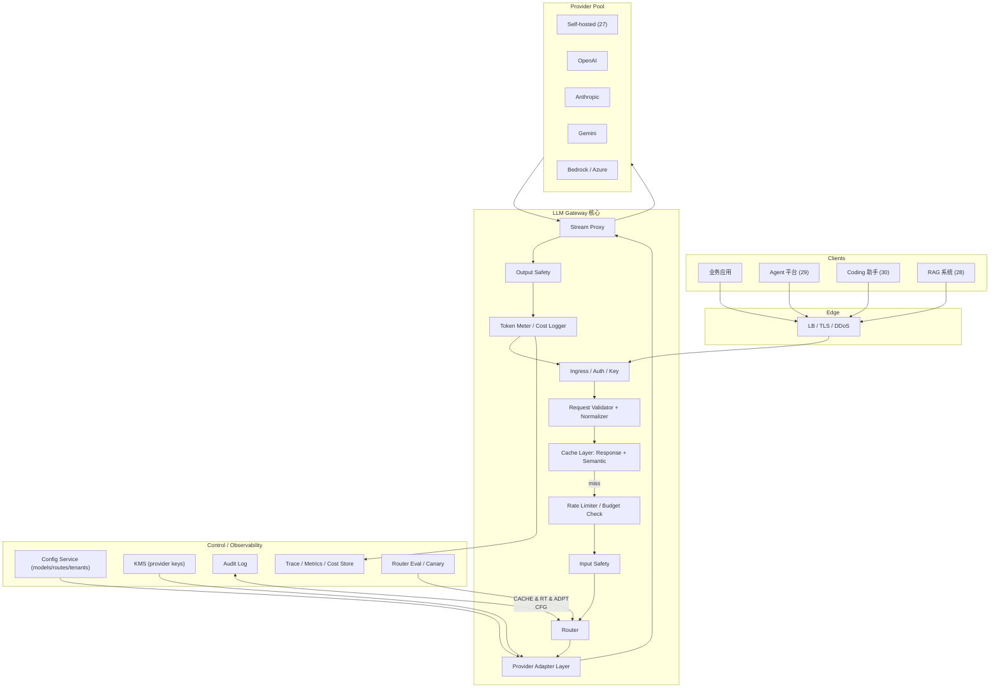

# 系统设计 - 案例 32：LLM 网关 / 多模型路由与编排平台真题模拟

## 题目

设计一个面向企业所有 AI 应用的 LLM 网关（LLM Gateway）系统，作为所有业务方调用大模型的统一入口，要求：

- 统一 API：对业务方隐藏底层各家模型差异（自托管、OpenAI、Anthropic、Google、AWS Bedrock、Azure、国内厂商等）
- 路由：按能力、成本、延迟、可用性在多模型间选择
- 失败转移：某模型 / 区域故障时自动降级
- 缓存：prompt cache / response cache / semantic cache
- 配额 / 计费 / 审计 / 内容安全 / 密钥管理
- 可观测：trace、metrics、成本归因到租户和应用
- 流式返回、支持取消、长连接
- 支持 tool use、structured output、vision、embeddings、reranking 等多种能力

先不做：

- 模型训练 / 微调
- Agent 执行（走 29 章）
- 推理资源底层调度（走 27 章 / 40 章）
- 完整 RAG 编排（走 28 章）
- 业务 Prompt 管理（走 33 章）

---

## 为什么这题值得深讲

在 2025–2026 的企业 AI 栈里，LLM 网关已经是仅次于“推理平台”的第二根承重梁。很多答案会停在：

- `反向代理 + API 适配 + 鉴权 + 配额 + 缓存`

这不算错，但只是一个 API Gateway 的复刻。  
LLM 网关和普通 API 网关有几个根本不同：

1. **协议复杂**：它处理的不是纯 HTTP，是 **流式、部分成功、token 逐步到达、tool call 插入、文本 + 图像 + 结构化混合** 的长生命周期响应
2. **路由不是静态的**：要根据请求特征（能力需要、长度、成本、延迟）动态决定后端
3. **缓存是语义级的**：普通网关是“URL 命中”，LLM 网关是 **prompt prefix / embedding / response** 三层缓存
4. **计费是按 token 的**：每请求结束才知道花了多少，要把“预扣 + 结算”做精确
5. **内容安全要前置 + 后置**：输入和输出都要过滤，这影响延迟和流式体验
6. **失败转移不简单**：同一请求中途切换模型可能语义不等价，要有“只在特定阶段切”的策略
7. **和 27 章推理平台不是同一层**：推理平台负责“我自家模型怎么跑”，网关负责“所有业务方如何统一消费多厂商模型”

如果一个候选人真的理解这题，他不应该只是把它画成 API Gateway 加几个模型，而应该能讲清：

- 为什么统一 API 不是“抄 OpenAI 协议”这么简单
- 为什么 response / prompt / semantic 缓存各自适用于不同层
- 为什么流式响应的 fail-over 比非流式难十倍
- 为什么 **成本归因** 必须比 token 级更细（到 step / 到应用 / 到用户）
- 为什么 **密钥管理** 是这系统的隐形灾区

---

## 面试官真正想看什么

这题通常在看下面几件事：

1. 你能不能把 **网关** 和 **推理平台（27 章）** 的边界讲清
2. 你能不能设计一个 **能覆盖多种能力差异** 的统一 API，同时承认“全部兼容”的代价
3. 你能不能讲清三种缓存的 trade-off，并说明什么时候用哪种
4. 你会不会把 **路由策略** 设计成可插拔，而不是硬编码
5. 你能不能说清 **流式下的失败转移** 和 **部分结果** 的处理
6. 你能不能把 **密钥 / 凭证管理** 当作系统级问题，而不是“放 secret manager”一句话
7. 你能不能把 **计费 / 成本归因 / 租户隔离** 做成一个闭环
8. 你有没有意识到网关是 **所有 AI 应用的共同单点**，高可用和降级必须是第一优先级

---

## 一开始先别急着设计，先收敛题目语义

LLM 网关这题最容易答发散。我会先澄清：

1. **网关的角色**：纯代理，还是带编排（multi-step、retry、fan-out）？
2. **API 形状**：是自定义协议，还是对外兼容 OpenAI 格式？
3. **路由目标**：能力优先（能不能做）、成本优先（最便宜）、延迟优先（最快），还是可配置？
4. **模型池**：自托管多少？外部厂商多少？是否支持客户自带模型 BYOM？
5. **缓存策略**：默认开还是默认关？命中语义是精确字符串还是模糊？
6. **数据政策**：数据是否落盘？保留多久？能否转发到第三方 provider？
7. **内容安全**：谁提供（自研 / 第三方 / provider 自带）？硬拦还是仅标注？
8. **多租户边界**：一个网关集群多少租户？大客户是否独占？
9. **全球**：是否多区域部署？请求按区域就近路由？

如果面试官不继续补充，我会把题目收敛成下面这个版本：

- 网关以 **代理 + 轻编排** 为主：支持 retry / fallback / fan-out，但不做多 step Agent（那是 29 章）
- API **外部兼容 OpenAI 协议**（降低业务迁移成本），**内部再包一层** 以支持 Anthropic / Gemini / 自托管的差异
- 路由支持 **可配置策略**，默认按 `能力 → 可用性 → 成本 → 延迟` 顺序挑选
- 模型池：自托管常用模型（来自 27 章推理平台） + OpenAI / Anthropic / Google / Bedrock / 国内厂商
- 缓存默认开 **prompt cache**（利用 provider 自带）和 **response cache**（平台自研），**semantic cache** 是可选 opt-in
- 数据默认 **短期保留（X 天）**，可配置零保留；**不默认转发给外部厂商用于训练**
- 内容安全：输入 + 输出双向过滤，拦截严重违规，其他仅标注
- 强多租户，大客户可独占 pool
- 全球多区域部署，按 **租户所在区域 + 模型可用区域** 双维路由

### 关键选择

#### 选择 1：网关是 **代理 + 轻编排**，不是 Agent

- Agent（29 章）有 run 生命周期、工具调用、HITL
- 网关没有持久化 run，只处理 **单请求** 或 **一次性 fan-out**
- 这个边界不收紧，系统会膨胀成“半个 Agent 平台”

#### 选择 2：对外兼容 OpenAI 协议

- OpenAI 协议是事实标准，客户端 SDK 普遍兼容
- 内部加一层抽象，把 Anthropic 的 `messages`、Gemini 的 `generateContent` 都映射到同一对象模型
- 这样业务方可以 **零改造迁移** 到网关

但我会主动说：**不会强行 100% 兼容**。一些能力（比如 Anthropic 的 `computer use`、Gemini 的某些 grounding）有独家语义，我们允许通过 **扩展字段** 暴露，这是 9 成兼容 + 1 成扩展的务实路线。

#### 选择 3：**Prompt cache / response cache / semantic cache** 三层分开

- **Prompt cache（prefix cache）**：利用 provider 侧（或自托管侧）的前缀缓存，网关只要 **构造 prompt 时前缀稳定**
- **Response cache**：完全相同 request 命中直接返回
- **Semantic cache**：基于 embedding 的相似度命中

三者处理不同层次的重复，不应混淆。

---

## 第一步：先判断这是一个什么类型的系统

我会先明确，这不是一个普通 API 网关，而是一个：

- **代理 + 轻编排**
- **长连接 + 流式**
- **多后端 + 多协议**
- **语义级缓存**
- **按 token 计费**
- **高可用单点**

的系统。

特征：

1. **单点效应强**：所有业务调模型都经它，挂一下全体 AI 应用受损
2. **请求生命周期长**：chat 常常 5-30s，流式期间要保持连接并可能中途切换
3. **失败模型不是 500 这么简单**：可能是 **quality degraded**（模型返回了胡话）、**partial**（流到一半断）
4. **成本是第一位 ROI 杠杆**：合理路由 / 缓存能给公司省 30-70% 的模型账单
5. **合规面大**：数据去哪里、保留多久、是否会用于训练、国家 / 区域法规

---

## 第二步：先做一轮容量估算

假设：

- 公司内部 `200` 个应用方接入（Web、App、Agent、RAG、Coding）
- 日请求：`10 亿`（包括 completion / chat / embedding）
- 其中 `80%` 是 completion / embedding 小请求，`20%` 是 chat / tool 调用
- 峰值 QPS `3 万 - 5 万`
- 流式长连接并发：峰值 `10 万`
- 日 token 量：输入 `15 万亿`，输出 `2 万亿`

### 延迟分布

- Embedding：P95 < 50ms
- Chat TTFT：P95 < 2s
- 流式总延迟：取决于模型，不由网关决定

### 连接数

- 峰值 10 万流式长连接，单机按 5 万连接，需要 **至少 2-4 台入口机器 + HA**
- 选型：Envoy / Nginx + 自研，或完全自研 async runtime

### 缓存命中率

- Response cache：平均 10-20%（企业内应用有不少重复问答）
- Prompt cache：50%+（尤其是 RAG 和 Coding 场景，system prompt 固定）
- Semantic cache：0-15%（取决于场景）

### 成本

- 日输入 token 费用：按 `$3/M tokens` 估 → `15 万亿 * $3/M = $45M / 日`
- 输出 token：`2 万亿 * $15/M = $30M / 日`
- 合计 `$75M / 日`（这是粗估上限）
- 缓存命中 20% → 节省 `$15M / 日`（足够论证网关价值）

这些数字是网关 ROI 的主论据：**不是加速，不是统一，是省钱**。

---

## 第三步：先定义不变量

1. **同一个请求不能重复扣费**：幂等必须做到 token 级
2. **缓存命中不能泄漏跨租户数据**：语义缓存尤其危险
3. **流式期间中途切换后端，必须对客户端透明**（但行为可能变化，要记录）
4. **内容安全一旦命中必拦**（硬规则），次要违规可以记号
5. **密钥不能出现在日志 / 错误信息 / trace 中**
6. **请求数据默认不被厂商用于训练**（架构层保证，不是口头）
7. **网关挂了要能快速切到 standby**，RTO 分钟级
8. **成本归因必须到应用 + 用户 + 租户三级**

---

## 第四步：从朴素方案一步步推演

## 第一轮：最朴素方案

- Nginx + Lua 转发请求
- 根据 model 字段查配置，直接转到对应 provider
- 响应透传回来

问题：

1. 协议不统一
2. 没有失败转移
3. 没有缓存
4. 没有成本
5. 没有多租户
6. 密钥放配置里

这是 POC。

## 第二轮：统一协议 + 路由

- 定义内部请求对象（`UnifiedRequest`）
- Adapter 层把 OpenAI / Anthropic / Gemini / 自托管 的 API 抽象成 `Provider`
- Router 按 model id + tenant 配置挑选 Provider

解决了统一性，但：

1. 缺失败转移
2. 缺缓存 / 成本 / 审计

## 第三轮：加缓存 / 失败转移 / 成本

- 请求进来先查 **response cache** / **semantic cache**
- Miss 则进 Router，选 Provider
- 调用 Provider，流式或 full response
- 响应流过时做 **内容安全**、**token 计数**、**缓存回填**
- 失败时按路由策略 fallback

这开始像个真网关。

## 第四轮：成本归因 + 多租户 + 密钥

- 每租户有独立配额 / 成本预算
- 每应用有 API key 与 rate limit
- Provider 的访问凭证在 **KMS** 管理
- 请求日志 + token 账单写入 Cost Service

## 第五轮：可观测 + 合规

- Trace：请求 → Router → Provider → 响应
- Metrics：QPS、命中率、延迟、错误率、成本
- Audit：敏感操作（密钥管理、路由变更）可追溯

## 第六轮：高可用 + 全球

- 多区域部署，DNS / 负载均衡就近路由
- 跨区域 failover
- 缓存区域内，不跨区同步（避免脑裂）

---

## 核心对象模型

### `UnifiedRequest`

- 业务方提交的统一请求
- 字段：
  - `id`、`tenant_id`、`app_id`、`user_id`
  - `kind`：chat / embedding / rerank / vision / audio
  - `messages` 或 `input`
  - `capabilities`：`tools`、`structured_output`、`long_context`、`vision`
  - `model_preference`：可以点名 model、也可以 tag（`cheap_chat`、`frontier_coding`）
  - `cache_policy`：`default` / `off` / `force_refresh`
  - `budget`：max token、max usd
  - `region_preference`
  - `metadata`

### `ProviderCall`

- 网关对某 Provider 的一次实际调用
- 字段：
  - `request_id`、`provider_id`、`model_id`、`attempt`
  - `started_at` / `finished_at`
  - `input_tokens` / `output_tokens` / `cost_usd`
  - `status`、`error`、`fallback_reason`

### `Provider`

- 一个 model provider 的定义
- 字段：
  - `id`、`kind`（openai / anthropic / gemini / bedrock / self_hosted）
  - `endpoint`、`auth_ref`（密钥引用，不存明文）
  - `region`
  - `rate_limit`（RPM / TPM）
  - `capabilities_matrix`
  - `cost_table`

### `Model`

- 逻辑模型定义
- 字段：
  - `id`（如 `frontier_chat_v3`）
  - `provider_id` + `provider_model_name`（如 `openai:gpt-4o-2024-08-06`）
  - `capabilities`：能力矩阵
  - `unit_cost`（输入 / 输出 token 单价）
  - `context_window`
  - `latency_profile`（历史 P50/P95 统计）

### `RoutePolicy`

- 路由策略（按租户 / 应用 / 模型 tag）
- 字段：
  - `selector`：match 条件
  - `preference`：`capability > availability > cost > latency` 顺序
  - `fallback_chain`：有序 fallback provider 列表
  - `region_strategy`

### `CacheEntry`

- `type`：response / semantic
- `key_hash` or `embedding_ref`
- `payload_ref`
- `ttl` / `hit_count`
- `tenant_id`（强制隔离键）

### `Budget` / `Quota`

- 租户 / 应用 / 用户的额度
- 字段：
  - `subject`
  - `window`（日 / 小时 / 当前在途）
  - `token_limit` / `usd_limit` / `qps_limit`
  - `current`

---

## 最终高层架构



几点：

- **缓存在路由前**：命中就不走后端
- **预算 / 限流 / 输入安全** 在路由前
- **Provider Adapter** 把统一对象翻成各家 API
- **Stream Proxy** 是核心：保持长连接、转发 SSE、触发中途切换
- **输出安全 + Token Meter** 在响应流上做

---

## API 设计

### Chat

完全对外兼容 OpenAI 的 `/v1/chat/completions` 协议（含 tools、structured outputs、stream）。

内部扩展：

- `x-llmgw-model-tag`：用 tag 而非具体 model
- `x-llmgw-cache`：`default | off | force_refresh`
- `x-llmgw-fallback-policy`：覆盖默认 fallback 链
- `x-llmgw-budget`：临时覆盖 budget
- `x-llmgw-region`：指定 region（默认自动）

### Embeddings / Rerank

对齐 OpenAI `/v1/embeddings`、Cohere `/v1/rerank` 形态。

### Streaming

SSE 为主，WebSocket 可选。响应在末尾附 `usage` 元数据（token 数、成本、命中缓存与否、实际使用 model）。

### Admin API

- `POST /admin/models`
- `POST /admin/providers`
- `POST /admin/routes`
- `POST /admin/tenants/{id}/budget`

这些是控制面，严格 RBAC。

---

## 核心链路：一次请求到底怎么走

我会按阶段讲，每个阶段都标注 **为什么存在、挂了怎么办**。

### 1. Ingress + Auth

- 解析 API key（租户 + 应用）
- 校验签名、来源 IP 白名单
- Abuse 检测（简单的基于 key 的异常模式）
- 路由到区域（按租户 primary region）

失败：立即 `401/429`。

### 2. Validate + Normalize

- Schema 验证（兼容 OpenAI 字段）
- 规范化：model tag → model id、messages 合并、默认 params 填充
- 请求体超大截断或拒绝
- 敏感字段标记（供后续脱敏）

### 3. Cache lookup

三层缓存依次查：

1. **Response cache**：key = hash(messages + params + model)
2. **Semantic cache**：若开启，embedding 查询 + 阈值过滤
3. **Prompt cache**：不在网关查，而是 **命中 provider 自己的 prefix cache**（网关只要保持 prompt 前缀稳定）

命中则直接返回（**仍然走 output safety 和 meter**，因为合规和审计不能跳）。

### 4. Rate limit + Budget

- 租户 / 应用 / 用户三级限流
- 预扣 budget（按模型 unit cost × 估算长度）
- 超限返回 `429` 或 `402` 并含原因

### 5. Input safety

- 检测 prompt 是否包含：
  - 严重违规内容（平台政策）
  - 可能的 prompt injection 特征
  - 敏感信息（视 policy 决定脱敏 / 拒绝）
- 内容安全模块应该 **可插拔**，让企业选：自研 / Azure AI Content Safety / Moderation API / 无

内容安全对延迟敏感，通常用：

- **轻量分类器**：几 ms 级
- **重型 LLM 审核**：仅用于关键场景

### 6. Router

- 输入：UnifiedRequest + RoutePolicy + 实时 provider 状态
- 输出：有序 provider 列表（fallback chain）
- 判断依据：
  - **能力**：是否支持请求的 capability（tools、vision 等）
  - **可用性**：provider 健康 / 限流余量
  - **成本**：按 unit cost 排
  - **延迟**：历史 P95
  - **数据合规**：某些租户禁止路由到某些 provider

Router 必须是 **可插拔策略** + 可热更新配置。

### 7. Provider Adapter

- 把 UnifiedRequest 翻成 provider 特定协议
- 处理差异：
  - Anthropic 的 system message 独立字段 vs OpenAI 在 messages 里
  - tool schema 的 JSON 差异
  - stop sequences 的位置
  - multimodal payload 的格式
- 注入凭证（从 KMS 拉取短期 token，不缓存长期密钥在进程内）

### 8. Stream Proxy

这是网关最难的部分。

- 建立到 provider 的长连接（HTTP/2、SSE、或 Anthropic 的原生流）
- 逐 chunk 转发给客户端
- 同时：
  - 持续统计 tokens
  - 过滤敏感内容（output safety 可能需要 chunk 级审核）
  - 记录 trace 事件

特殊情况：

- **客户端断开**：立即 abort 到 provider（停止计费）
- **provider 中断**：尝试 fallback（见下）
- **慢 stream**：超时保护，防止挂死连接

### 9. Output safety

- 输出流上做内容过滤
- 违规片段可以：
  - 阻断（立即停止流）
  - 替换（打码）
  - 标注（metadata 打标，不干预流）

实现细节：

- 按 **滑动窗口** 审核，不是每 token 都跑一次
- 必要时做 **完成后一次性审核**（对非流式请求）

### 10. Token meter + cost logger

- 每请求结束 commit 成本
- 写入：
  - Trace span（含 input/output token、cost、cache hit）
  - Usage store（供计费和报表）
  - Budget 实际扣减

---

## 路由策略的深度设计

Router 是网关最值钱的一部分，单独细讲。

### 路由维度

1. **Capability match**：请求要 `tools`？某 provider 不支持，直接过滤
2. **Context length**：请求 prompt `> 100k token`？只有少数 provider 能接
3. **Region / Data residency**：欧盟租户禁止路由到美区
4. **Cost tier**：租户配置了“只能用 cheap tier” → 过滤高端模型
5. **Availability**：实时健康分（基于最近 1 分钟成功率）
6. **Latency**：历史 P95，按请求类型（短 prompt / 长 prompt）分桶
7. **Cost**：单价低优先（但不一定绝对低，配合延迟）

### 策略示意

```
candidates = list(Models)
candidates = filter(candidates, by capability, data residency, availability)
if len(candidates) == 0:
    return error("no provider can serve")

score(c) = weight_cost * normalize(1 / c.cost) +
           weight_latency * normalize(1 / c.p95) +
           weight_quality * normalize(c.quality_score)

ordered = sort by score desc
return ordered as fallback chain
```

### 质量分

- 质量不是写死的
- 通过 **在线 A/B** 和 **离线 eval** 持续更新每个 model 的 quality_score（按任务类型分桶）
- 例如：`code_generation` 用一套分数，`summarization` 用另一套

### 路由 Canary

- 新 model 上线先给 1% 流量
- 对比 P95 延迟、错误率、成本
- 达到健康阈值才升级权重
- 这是一个专门的 Canary 子系统

### 路由决策的可观测

- 每请求记录：
  - 候选列表
  - 选中哪个 + 原因
  - 是否 fallback、fallback 几次
- 便于事后分析“为什么这次用了贵的模型”

---

## 失败转移与流式降级

这是 LLM 网关最容易答浅的点。

### 非流式失败转移

简单：失败 → 切下一个 provider → 重试。注意：

- 幂等：相同请求重试不能双计费
- 超时：总超时预算，避免串行 retry 超过客户端等待

### 流式失败的复杂性

几类失败：

1. **首 token 前失败**：最干净，直接切下一个 provider 再发
2. **流到一半连接断开**：
   - 已产生的部分内容已发送给客户端
   - 切换 provider 重发，会得到 **从头开始的新回答**，不连续
3. **流到一半内容质量差 / 命中 safety**：停止并返回错误

### 常见选择

- **Safe fallback**：仅在 **首 token 之前** 允许切 provider
- **Best-effort continuation**：切 provider 时把已有内容附到 prompt 让新 provider 续写 — 但这不保证连续性，风险大，一般不默认做
- **Fast fail**：中途失败就返回错误让客户端自己重试

我会推荐：**默认 safe fallback + fail 往前**，特殊场景允许 best-effort。

### 重试策略

- 幂等键：以 `request_id` 确保不双重计费
- 指数退避
- 按 provider 维度错误计数，触发熔断（短期避开）
- 熔断恢复走慢放量

---

## 缓存策略深讲

### Response cache

- **Key**：hash(messages + params + model + user_scope)
- **Value**：完整响应 payload
- **TTL**：取决于场景，一般 1h–24h
- **Scope**：默认 **按租户 / 按应用**，不允许跨
- **When to use**：FAQ、文档摘要、确定性任务（temperature=0 或 seed 固定）

风险：

- 随机性响应不能缓存（temperature > 0 without seed）
- 时间敏感内容容易过期
- 实体化回答（包含用户姓名）不应共享缓存

### Semantic cache

- **Key**：prompt 的 embedding
- **Lookup**：近似最近邻 + 相似度阈值
- **Hit**：返回缓存的响应
- **When to use**：常见问题检索（“公司 WiFi 密码怎么设？”和“WiFi 密码是多少？”）

风险：

- **最危险的功能**：相似 prompt 可能有 **完全不同** 的正确答案
- **跨租户泄漏**：必须强制 tenant scope 作 filter
- **幻觉传染**：错误回答被缓存复用多次

我的态度：**默认关闭，显式 opt-in**。只在低风险场景（FAQ、客服、文档检索）开启。

### Prompt cache（prefix cache）

- 这是 **provider 侧** 功能
- 网关要做的是 **prompt 构造稳定**：
  - 固定头放最前
  - 不在头部插入变化内容（时间戳、request_id）
- 正确利用可以 省 50%+ token 成本

### 三层缓存的命中顺序

1. Response cache（最严格，命中率 10-20%）
2. Semantic cache（可选，命中率看场景）
3. 如果以上都 miss，把请求发 provider，让 provider 内部做 prompt cache

---

## 密钥与凭证管理

### 为什么是独立问题

- 多 provider 各有自己的密钥体系（API key、IAM role、Azure AD、OAuth）
- 企业不希望业务方 **直接持有 OpenAI key**
- 密钥泄漏 = 巨额账单 + 数据风险

### 设计原则

1. **进程内零明文**：调用时从 KMS / Vault 按需取
2. **短期凭证优先**：能用 STS / 临时 token 就不用长期 key
3. **按租户隔离**：大租户自带 key（BYOK），小租户共享网关自有 key
4. **审计**：每次密钥使用都记录，定期轮换

### BYOK（Bring Your Own Key）

- 企业客户希望 **账单归自己**、**不经过厂商** 的场景
- 平台持有 **代表客户调用** 的能力，但账单直接走客户 provider 账户
- 需要 **隔离调用**：不把客户 key 和平台自己的 key 混用

---

## 多租户、配额与计费

### 多租户隔离

- 逻辑：每请求带 tenant_id，缓存 / 日志 / 成本强制隔离
- 物理（可选）：大客户独占一套 gateway 进程 / 区域
- 配置：每租户独立 route policy、budget、content policy

### 配额层级

- **QPS / RPM**（每分钟请求）
- **TPM**（每分钟 token）
- **USD / day / month**
- **concurrent streams**
- 这些都要能按 tenant / app / user 配

### Budget 预扣与结算

- 请求进来：按 `context + estimated_output` 预扣
- 请求结束：按真实 token 结算（refund 差额）
- 失败：全额 refund

### 账单归因

- 每请求记：tenant / app / user / model / provider / tokens / usd / cache_hit
- 汇总：日报、月报
- Dashboard 按应用 / 用户 / 模型分组

### 计费精度

- 币种：usd 存小数 6 位（避免精度丢失）
- 多币种：按结算时汇率锁定
- Provider 的价格变化：以 **调用时刻** 的价格为准，历史账单不回溯

---

## 可观测性

### Trace

- 每请求一个 trace
- span：gateway-ingress、cache-lookup、router、provider-call、output-safety、egress
- 遵循 OpenTelemetry GenAI 约定
- **prompt / response 可选脱敏落 trace**（默认只记 hash）

### Metrics

- QPS 按 (tenant, app, model, status) 分
- 延迟 (TTFT, total) 按 provider / model
- Cache hit rate
- Error rate（含 provider 错误分类：5xx / 429 / safety）
- Budget 使用率

### Cost observability

- 实时 burn rate
- 按应用 / 用户 top N
- 预算报警（阈值 50% / 80% / 100%）

### Eval 回路

- 离线评测集持续跑
- 对比不同 model 在同任务上的表现
- 结果喂回 router 的 quality_score

---

## 内容安全

### 输入安全

- PII 检测（必要时脱敏）
- 违禁内容分类（暴力 / 极端 / 未成年人等）
- Prompt injection 检测（基于启发式 + 分类器）
- 按租户政策决定：拒绝 / 记号 / 继续

### 输出安全

- 同类分类
- 可以做 **chunk 级审核**（流式）或 **完成后审核**（非流式）
- 违规严重时中断流并返回错误

### 合规要求

- 不同司法区的额外规则（例如德国 / 法国的特殊要求）
- 行业特定（医疗、金融）

### 安全模块的可替换性

- 抽象接口：`Safety.check(input|output, policy) -> Decision`
- 实现：自研分类器、OpenAI Moderation、Azure Content Safety、Perspective API
- 可组合：多实现并发跑，取并集 / 交集

---

## 高可用与全球部署

### 单集群 HA

- Gateway 水平扩展无状态
- Cache 走分布式（Redis cluster + 本地缓存）
- Config 从 control plane 拉取 + 订阅变更
- KMS 高可用

### 多区域

- 按租户 primary region 部署
- 每区域独立配置 / 缓存 / 日志
- 跨区域 failover：primary 挂，secondary 接管（**数据不跨境**）
- DNS + health check 切流

### 灾备

- 全区域挂：无网关可以 **业务方直连 provider**（有紧急 escape hatch，但会损失合规 / 缓存）
- 平时要定期演练

---

## 和 27 章推理平台的边界

这是面试里必问的。

| 维度 | 27 章推理平台 | 32 章 LLM 网关 |
| --- | --- | --- |
| 目标 | 运行**自家模型** | 统一调用**所有模型**（自家 + 外部） |
| 计算 | GPU 调度、prefill/decode、KV cache | 不做 GPU，只做 HTTP / stream 转发 |
| 能力 | 同步 / 批 / background | 代理 + 轻编排 |
| 缓存 | prompt / prefix cache（模型级） | response / semantic（应用级） |
| 关键技术 | 连续批处理、PagedAttention、Speculative decode | Stream proxy、多 provider 路由、Cost |
| 关系 | 推理平台是网关的 **其中一个 provider** | 网关消费多个推理平台 + 外部 API |

面试里一句话总结：

- **推理平台管“模型在哪张卡上”**
- **网关管“请求去哪个提供方”**

---

## 和 API Gateway 的区别

这也是常被问的。

- API Gateway：协议级、同步、无语义缓存、无流式（或简单流式）、按请求计费
- LLM Gateway：协议兼容 + 抽象、大量长连接流式、语义缓存、按 token 计费、模型路由

可以说 LLM 网关是 **一种特殊形态的 API 网关**，但它的核心问题几乎都是通用 API 网关不处理的。

---

## 演进路径

### 阶段 1：内部透明代理

- 只做鉴权、限流、基础审计
- 单 provider

### 阶段 2：多 provider + 路由

- Adapter 抽象
- 静态 route policy
- 非流式 fallback

### 阶段 3：缓存 + 成本

- response cache
- cost meter + 账单

### 阶段 4：流式 + 全链路可观测

- stream proxy
- OTel trace + metrics + cost dashboard

### 阶段 5：智能路由 + canary + BYOK + content safety

- Router 插件化
- 灰度机制
- 内容安全接入
- BYOK for enterprise

### 阶段 6：全球 + DR

- 多区域 + 灾备演练
- 语义 cache + eval 反馈 router

---

## 面试里我会怎么讲最终方案

如果让我设计一个 LLM 网关，我会先把语义收敛清楚：这是一个“代理 + 轻编排”层，外部兼容 OpenAI 协议，内部抽象多 provider，路由按能力 / 可用性 / 成本 / 延迟综合决策；支持三层缓存（response / semantic / prompt）；强多租户、按 token 计费、输入输出双向内容安全。

架构上我会分五层：Ingress（auth + rate）、Validate + Normalize、Cache、Router + Adapter、Stream Proxy + Output Safety + Meter。关键不变量：缓存不跨租户、密钥进程零明文、流式失败默认 safe fallback、数据默认不被用于训练、成本归因到租户/应用/用户三级。

我会强调网关 ROI 的主论据不是加速，而是省钱和合规：合理的路由 + 三层缓存可以节省 30-70% 模型账单；统一鉴权 + 审计 + 内容安全是企业 AI 的准入门槛。

继续深挖会讲：Router 的可插拔 + quality_score 反馈、流式 fallback 的边界（首 token 前才切）、semantic cache 的泄漏风险与强制 tenant scope、BYOK 的账单归属、以及和 27 章的边界（网关不做 GPU）。

---

## 面试官如果继续追问

### 追问 1：为什么不直接用 OpenAI 协议做就够了，为什么要自己搞网关

- OpenAI 协议是客户端协议，不处理：多 provider、路由、成本归因、合规、缓存
- 网关是 **消费 OpenAI 协议** 的服务端，内部做更多事
- 业务方可以保持 SDK 不变，网关把“不简单”的部分抽出来

### 追问 2：流式过程中 provider 挂了怎么办

- 如果首 token 之前挂：切 fallback 重发，客户端无感
- 如果已开始流：默认返回错误让客户端重试；或 best-effort continuation（默认关）
- 对客户端标注 `fallback_reason`，便于调试

### 追问 3：semantic cache 会不会把 A 的答案给 B

- 强制 tenant_id 作为 filter
- 跨租户必须严格不共享
- 建议只在单租户或同 app 内开
- 默认关闭，opt-in

### 追问 4：如何防止企业客户的 prompt 被 OpenAI 用于训练

- Provider 侧合同条款 + API 参数（如 OpenAI 的 Business plan 明确不训练）
- 网关侧：记录调用流向、定期审计
- 极端场景可 route 到 **零保留自托管模型**

### 追问 5：怎么估计一次请求的预扣成本

- `prompt tokens` 可以准确算
- `output tokens` 只能估（按 max_tokens 或历史均值）
- 预扣用保守估计；实际结算时 refund

### 追问 6：一个请求要 100 万 token prompt，怎么 handle

- 先 validate：是否超过最贵 provider 的 window
- 路由时过滤：只保留支持 long context 的 model
- 如果都不支持：拒绝 + 提示
- 不要偷偷截断

### 追问 7：全球部署时数据驻留怎么做

- 租户声明 primary region
- 路由时强制 region filter
- 日志 / 缓存本区存储
- 跨区查询不允许

### 追问 8：怎么做 router 的 canary

- 新路由规则先 shadow（影子流量，不返回）
- 对比延迟 / 错误 / 成本 / 质量
- 通过阈值后 1% → 10% → 50% → 100%
- 随时 rollback

### 追问 9：密钥泄漏怎么应急

- 立即 **disable** 该 key（control plane）
- 审计 **最近使用** + 成本异常检测
- 通知安全团队
- 轮换新 key 并通知客户

### 追问 10：如何防止一个应用把预算耗尽拖累其他应用

- 硬配额
- 实时 burn rate 监控
- 达到 80% 预警
- 达到 100% 自动降级或切到更便宜的模型（按 policy）

---

## 常见失分点

1. 把 LLM 网关答成普通 API Gateway，没讲流式、路由、多 provider
2. 缓存一句话“加 Redis”，没分 response / semantic / prompt
3. 流式失败转移没讲清首 token 前 / 后的区别
4. 密钥管理一句 “放 KMS” 就带过
5. 没讲内容安全的输入 + 输出双向
6. 成本归因没到应用 / 用户级
7. 和 27 章推理平台边界讲不清
8. 没讲 semantic cache 的跨租户风险
9. 没讲 Router 的 canary 和 quality_score 反馈
10. 高可用只讲单集群，没讲多区域

---

## 总结

LLM 网关真正考的不是“加个代理”，而是：

`如何在多 provider、多租户、多区域、流式长连接、按 token 计费的现实下，把统一 API、语义缓存、可插拔路由、失败转移、密钥管理、成本归因、内容安全、观测审计组合成一个对业务方透明但对平台可控的系统。`

一个更成熟的回答，通常应该按这个顺序展开：

1. 先收敛“代理 + 轻编排”的边界
2. 再判断系统类型（长连接 + 多后端 + 语义缓存 + 高可用单点）
3. 再定义不变量（跨租户、密钥、不训练、成本归因）
4. 再走一遍朴素到成熟的推演
5. 再把 Router、Adapter、Stream Proxy、Safety、Meter 分开讲
6. 最后讲全球、BYOK、Canary、灾备

---

## 自测问题

1. 如果某个常用 provider 连续 30 秒 5xx，你的熔断和 fallback 各应该怎么动？
2. 一个 40k token 的 prompt 该走哪条路由？如果只有一家模型能接但它今天很慢呢？
3. 当 semantic cache 命中率意外从 10% 涨到 40%，你会怀疑什么？
4. 一个租户抱怨账单翻倍，你怎么定位是哪个应用 / 哪个 model 消耗最大？
5. BYOK 客户要求“自己的 key 绝不离开自己的 account”，你要怎么设计调用路径？
6. Router 里新加一个 model，怎么确保它不会影响现有流量质量？
7. Content Safety 把某类合法请求误杀，怎么快速 rollback 规则？
8. 你的网关要撑 10 万流式并发，单机 5 万连接，怎么做水平扩展 + 连接迁移？
