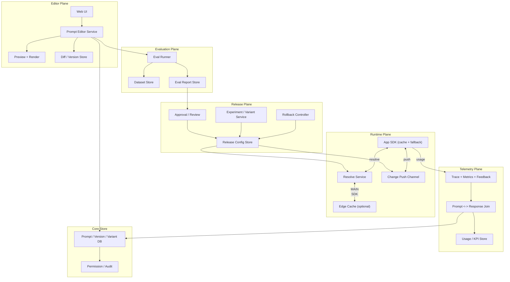

# 系统设计 - 案例 33：Prompt 管理与版本化平台真题模拟

## 题目

设计一个企业级 Prompt 管理与版本化平台，服务公司内所有使用大模型的业务应用，要求：

- Prompt 是 **一等资产**，可以被版本化管理（类似代码仓库）
- 支持模板（变量 / 部分 / 条件 / 循环），不是简单字符串
- 支持 **版本 + 变体**（A/B 测试 / 多模型适配）
- 支持 **评测集 + 回归测试**：改 prompt 前能验证效果
- 支持 **灰度发布**（按用户 / 租户 / 流量分桶）
- 支持 **回滚**：出问题能秒级切回旧版本
- 支持 **权限 / 审批**：重要 prompt 必须经过审核才能上线
- 支持 **在线运行时 resolve**：应用按 `prompt_key + version` 拿到模板和推荐模型
- 支持 **trace**：每次实际调用记录用了哪个 prompt 版本
- 支持多模型适配（同一个任务在不同模型下 prompt 不一样）

先不做：

- 模型训练 / 微调（数据集由评测模块消费但不训练）
- 模型路由（走 32 章网关）
- Agent / RAG 业务逻辑（走 29 / 28 章）
- 完整数据标注平台

---

## 为什么这题值得深讲

Prompt 管理这题在 2024–2026 年越来越重要，但大部分面试回答停在：

- `Git 管 prompt 就行了`

或者：

- `LangChain PromptTemplate + DB 存一下`

这都是把它当成“文本管理”。真实企业里，prompt 管理的工程难度远超这个，原因：

1. **Prompt 是代码**：输出质量直接影响产品，改一句可能带来 10% 的指标变化
2. **Prompt 是配置**：发版比代码快得多，不能每次都走 CI/CD
3. **Prompt 是合约**：业务代码 + prompt + 模型版本 是一个 **三元组**，改一个都要回归
4. **Prompt 是实验**：需要 A/B、分流、quality feedback
5. **Prompt 和模型版本强耦合**：同一任务在 GPT-4 / Claude 3.5 / Gemini 2 下写法差很大
6. **Prompt 需要审计**：改错了谁背锅、上线前谁批的，必须有据可查

如果一个候选人真的理解这题，他应该能讲清：

- 为什么 Prompt 需要“代码一样的版本化” + “配置一样的热更新”
- 为什么评测集必须和 prompt 强绑定
- 为什么灰度要按 **prompt 变体** 而不是应用版本
- 为什么 **运行时 resolve** 是这个系统最核心的一条路径
- 为什么和 32 章 LLM 网关一起，才构成一个完整的模型调用闭环

---

## 面试官真正想看什么

这题通常在看：

1. 你能不能把 Prompt 当作 **有 schema、有版本、有变体、有指标** 的一等对象
2. 你能不能把 **编辑态（作者视角）** 和 **运行态（应用视角）** 分开设计
3. 你能不能把 **评测** 当作上线门槛而不是可选功能
4. 你会不会把 **prompt ↔ 模型版本 ↔ 评测数据集** 看成三维矩阵
5. 你能不能回答 “为什么不直接用 Git”
6. 你能不能把 **灰度** 做成**和业务代码发版解耦**
7. 你有没有意识到 Trace 必须能从 **产线 Response** 反查到 **具体 prompt 版本 + 变量值**
8. 你能不能把 **权限 / 审批 / 审计** 嵌到主流程

---

## 一开始先别急着设计，先收敛题目语义

我会先澄清下面这些问题：

1. **使用者**：只有工程师，还是产品 / 运营 / 客服也要编辑 prompt？
2. **规模**：平台管多少 prompt？每 prompt 多少变体？日调用多少次？
3. **发布方式**：热更新（秒级生效）还是走 CI/CD（分钟级）？
4. **变体策略**：按用户画像 / 按流量百分比 / 按模型 ？
5. **评测**：每次改动强制跑？还是只是 PR check？
6. **权限**：是否需要分角色（作者 / 审核 / 运营）？
7. **合规**：prompt 本身是否含敏感信息？是否是 IP 资产？
8. **多语言 / 多地区**：是否要按语言 / 地区存多个版本？
9. **回滚**：需要做到多快？秒级、分钟级、小时级？
10. **SDK**：应用如何拿到 prompt？HTTP / SDK cache / CDN ？

如果面试官不继续补充，我会把题目收敛成下面这个版本：

- 使用者：工程师为主、产品 / 运营可以编辑低敏感 prompt
- 规模：管理 `5000` 个 prompt，每个平均 `10` 个历史版本，日总调用 `10 亿`
- 发布：**配置级热更新**（秒级），重要 prompt 需审批
- 变体：按 **版本 + 变体 + 实验** 三轴切
- 评测：上线前 **强制跑回归集**，阈值不过线不能上
- 权限：Admin / Editor / Reviewer / Readonly 四类
- 合规：prompt 视为公司 IP，加密存储，按租户 / 项目隔离
- 多语言：每 prompt 有独立多语言字段，同一版本多语言共存
- 回滚：**秒级**，和发版按钮一样快
- SDK：客户端 SDK 拉取并缓存，长轮询 / webhook 同步变更

### 关键选择

#### 选择 1：Prompt 是“代码 + 配置”的双重体

- 代码特性：版本、diff、评测、PR 工作流、审计
- 配置特性：热更新、无代码部署、多变体快速切
- 任何一个单独都不够

#### 选择 2：`prompt_key` 是业务应用的 **稳定契约**

- 应用代码只写 `prompt("ticket_summary")`，永远不写“第 7 版那段文本”
- 版本切换对应用透明
- 这让 prompt 运营和应用开发可以 **并行节奏**

#### 选择 3：**评测是上线门槛**，不是上线后的监控

- 修改 → 本地预览 → 自动跑评测集 → 达标 → 审批 → 灰度 → 全量
- 没有评测，灰度就是“赌”

---

## 第一步：先判断这是一个什么类型的系统

我会先明确，这不是“一个 Prompt CMS”，而是一个：

- **CMS + 版本控制 + 实验平台 + 评测平台 + 配置下发** 的复合系统

特征：

1. **读远多于写**：写操作是人工编辑，读是每次模型调用都可能发生
2. **写必须严格**：每次变更要有作者、时间、原因、评测分
3. **读必须极快**：不能让 prompt lookup 成为应用调用链的瓶颈
4. **版本组合爆炸**：prompt × 变体 × 模型 × 语言，需要良好的寻址
5. **强审计**：有多少个旧版本被哪些请求用过，必须可查
6. **合规受控**：prompt 是企业资产，不可泄漏

这些特征决定主矛盾是：

- 如何把 **编辑态（严谨、慢、可审批）** 和 **运行态（极快、可热更新、可回滚）** 组合成同一个对象的两个视角

---

## 第二步：先做一轮容量估算

- 5000 prompt × 10 版本 = **5 万条 prompt 版本**
- 每条 prompt 平均 4 KB → **200 MB 级** 存储（可忽略）
- 评测集每 prompt 约 50–500 条案例 → `250 万` 评测案例
- 日调用 10 亿：prompt resolve 请求量是 **日 10 亿** 的量级
- 客户端 SDK 缓存命中 99%+ → 实际拉新 / 长轮询 `千万级` / 日
- 变更写入：日 `几百 - 几千次` 修改

### 缓存架构

- **客户端 SDK 内缓存**：进程内，`TTL + etag + push`
- **边缘 CDN 缓存**：不敏感 prompt 可走 CDN
- **中心服务缓存**：Redis / 内存

这样 Resolve 99.9% 命中在本地，中心服务扛的是变更扩散。

### 评测成本

- 每 prompt 跑一次评测集 = 50-500 次模型调用
- 若一天 100 个 prompt 变更，都跑一次评测 = 5k-50k 次调用
- 对内部使用量不算什么，但需要按优先级调度

### 变更扩散

- 变更即时推送到订阅 SDK，目标 < 3 秒全量
- 依赖 push（WebSocket / 长轮询）+ pull（兜底）

---

## 第三步：先定义不变量

1. **同一个 prompt_key 在同一时刻只有一个“生产默认版本”**（或一个明确的灰度配置）
2. **每次 prompt 变更必须有完整 lineage**：作者、reviewer、评测分、原因
3. **被已知 trace 引用过的 prompt 版本不能物理删除**（至少归档保留）
4. **评测集本身是资产**，有版本，有权限，评测案例不能被 prompt 作者随意改
5. **灰度规则不能影响审计可追溯性**：必须能从一次 Response 反查出用的哪个变体
6. **权限不被 Resolve 快路径绕过**：应用拿到 prompt 内容时，身份必须已验证
7. **回滚路径和正向发布路径对称**：任何时候能一键回到上一个生产版本

---

## 第四步：从朴素方案一步步推演

## 第一轮：Prompt 丢 Git

- Prompt 写在 yaml 文件里
- 业务代码加载本地 yaml
- 改 prompt 要改代码 → 走 CI/CD → 分钟级上线

问题：

1. 非工程师不能改
2. 发版慢
3. 没有变体 / A/B
4. 没有评测闭环
5. Trace 里只有“文件内容 hash”，不知道是哪个版本

适合早期阶段，但不能撑团队扩大后的需求。

## 第二轮：Prompt 放专用服务

- Prompt 存在 DB 里
- 应用通过 API 拿 prompt
- 支持在线编辑

问题：

1. 每次调用都 HTTP 拿 prompt，增加延迟 + 耦合
2. 版本 / 变体 没考虑
3. 评测仍然没有

## 第三轮：SDK 客户端缓存 + 版本标识

- SDK 预加载 prompt
- 带 `prompt_key + version + etag`
- 变更时 push 通知 SDK 拉新

这已经解决了性能问题，但需要补：

1. 版本生命周期：draft / staging / production / archived
2. 变体：基于标签 / 百分比
3. 评测上线门槛

## 第四轮：完整编辑/运行分离

**编辑态**：
- Web UI
- 编辑 + 预览 + diff
- 评测集自动跑
- 审批流
- Merge 到 production

**运行态**：
- SDK resolve
- Push 变更
- Trace / Usage 反馈

这两态共享同一真相源，但是 **数据模型和 API 分开**。

## 第五轮：引入实验 / 灰度

- 同一 prompt_key 可以有多个 **变体（variant）**
- 变体在 **实验（experiment）** 下按规则分流
- 分流维度：user_id hash / tenant / traffic percentage
- 实验有生命周期：ongoing / conclude / rolled out

## 第六轮：评测 + 反馈闭环

- 评测集是 prompt 的依赖
- 线上 trace 采样 → 回灌评测集
- prompt 改动前跑老集 + 新加入 case

## 第七轮：权限 + 审计 + 多租户

- 项目级权限
- 敏感 prompt 加审批
- 审计日志独立

---

## 核心对象模型

### `Prompt`

稳定对外暴露的 key，不带内容。

- `id`、`key`（如 `support.ticket_summary`）
- `project_id`、`tenant_id`
- `description`
- `owner`
- `schema`（变量定义：名字、类型、是否必填）
- `default_model`
- `tags`

### `PromptVersion`

一个版本的内容。

- `prompt_id`、`version`（数字或 semver）
- `content`（模板字符串 / MessagesTemplate / structured）
- `model_affinity`（针对哪些模型优化）
- `variables_bound`
- `created_by`、`created_at`
- `status`：`draft` / `staging` / `production` / `archived`
- `eval_report_ref`
- `approval_refs`

### `Variant`

在同一 prompt 下，运行时可以被分流的变体。

- `prompt_id`、`name`
- `version` 或 `content_override`
- `traffic_rule`（% / user filter / tenant filter）
- `active_experiment_id`

### `Experiment`

A/B 或多臂实验。

- `id`、`prompt_id`
- `variants[]`
- `metric_goals`
- `duration`
- `status`

### `EvalDataset`

评测集。

- `id`、`prompt_id`（可共享）
- `cases[]`：`{ input, expected, metadata, weights }`
- `version`
- `owner`

### `EvalRun`

一次评测执行。

- `id`、`prompt_version_id`、`dataset_id`
- `model_id`
- `metrics`（accuracy / BLEU / 自定义 scoring）
- `comparison_to`（上一版本）

### `ResolveContext`

运行时 resolve 请求的上下文。

- `prompt_key`
- `tenant_id`、`user_id`、`app_id`
- `locale`
- `model_id`（可选）
- `experiment_scope`

### `Audit Entry`

- 时间、主体、动作、对象、原因

---

## 最终高层架构

要点：

1. **编辑态 / 评测态 / 发布态 / 运行态 / 观测态** 五个 plane 分离
2. **运行态走 SDK 缓存 + push**，不阻塞调用链
3. **发布态** 是连接两端的枢纽，Release Config Store 决定 Resolve 实际返回什么
4. **观测态回流** 给编辑态作为下一次评测补充案例

---

## API 设计

### 编辑态

- `POST /prompts`：创建 prompt（key、schema、owner）
- `POST /prompts/{key}/versions`：新增版本（content、model_affinity、draft）
- `POST /prompts/{key}/versions/{v}:submit`：进入评测
- `POST /prompts/{key}/versions/{v}:approve`
- `POST /prompts/{key}/versions/{v}:promote`（staging → production）
- `POST /prompts/{key}:rollback`（回滚到上一个 production）
- `GET /prompts/{key}/diff?from=X&to=Y`

### 实验 / 变体

- `POST /experiments`：新建实验
- `POST /experiments/{id}:start/stop`
- `POST /prompts/{key}/variants`：添加变体
- `POST /prompts/{key}/release`：生效灰度规则

### 评测

- `POST /datasets`：创建数据集
- `POST /datasets/{id}/cases`：添加测试用例
- `POST /evals`：跑一次评测（指定 prompt version + model + dataset）
- `GET /evals/{id}/report`

### 运行态（SDK 最常用）

- `GET /resolve?key=X&ctx=...`：返回当前生效的 prompt 内容 + 变量 schema + 推荐 model
- `GET /changes?since=etag`：增量拉
- `WS /stream`：push 变更
- 返回体里包含 **`resolved_version_id`**，供 trace 回填

### 观测反馈

- `POST /traces/link`：应用把 trace_id ↔ resolved_version_id 关联
- `POST /feedback`：业务侧把用户反馈（👍 / 👎 / 自定义 score）关联到某次 resolve

---

## 核心链路：一次 prompt 生命周期

### 1. 创建与编辑

- 作者在 UI 上写 prompt，带 **变量 schema**（如 `{ticket_id: string, user_locale: string}`）
- 可以选模型（或“多模型”模板）
- 内置 **预览**：用样例 input + 指定 model 渲染，立即看效果
- **版本 diff**：和上一个版本比对

### 2. 提交评测

- 提交后触发 EvalRun
- 用 **当前 dataset（固定版本）** 跑 prompt × model
- 打分：accuracy、precision、召回率、语义相似度、人评分、成本
- 评测报告附在版本上

### 3. 审批

- 重要 prompt 走审批流
- Reviewer 看：diff、评测分变化、作者说明
- 通过 → 允许 promote

### 4. Promote 到 staging

- Staging 环境的流量可以使用新版本
- 生产流量不受影响
- 可跑内部真实流量验证（shadow mode）

### 5. 发布（Release）

- 决定 Production 的生效规则：
  - 立即替换（新版本全量）
  - 灰度（5% → 50% → 100%）
  - 变体（A/B 长期并存）
  - 按用户 / 租户定向

### 6. SDK Resolve（线上每次调用）

- 应用调用 `resolve(key, ctx)`
- SDK 走 **本地缓存 + tenant/variant rules**
- 若缓存过期 / 刚收到变更 push，再拉
- 返回：`content`（模板）+ `variables_schema` + `resolved_version_id` + `recommended_model`

### 7. 应用构造 prompt 并调模型

- 用 resolve 得到的内容 + 本地变量渲染
- 把 `resolved_version_id` 传给 32 章 LLM 网关
- 网关把 `prompt_version_id` 打进 trace

### 8. Trace 回流

- 网关 / 应用把真实 Response 关联到 prompt version
- Telemetry Plane 聚合：
  - 每个版本的成功率、成本、用户满意度
  - 反哺排名
- 某些场景下 Response 可回灌评测集（新 case）

### 9. 回滚

- 一键：把 Release 配置切回上一个 production
- SDK 在 3 秒内收到新配置
- 不影响代码部署

---

## 为什么不直接用 Git

这个问题几乎一定会被问。

- **Git 很好，但只是“版本化”**，缺少：
  - 结构化的模板（变量 schema、messages、parts）
  - 评测自动化
  - 灰度发布
  - 运行时热更新
  - 权限控制（非工程师编辑）
  - 分模型 / 分语言的组合矩阵
- Prompt 平台 **本质上借鉴了 Git 的版本化语义**，再补了上面的能力
- 实践里：**底层可以用 Git 做存储**，但上层需要一套专门的服务和 UI

所以正确的答法是：“Git 是好的基础，但不够。”

---

## 评测：上线门槛的具体设计

评测不做，整个 Prompt 管理是残缺的。

### 评测集的层次

1. **单元测试**：明确输入 / 期望输出的小量 case
2. **回归集**：历史 bug / 关键场景
3. **随机真实流量样本**：从线上 trace 采样，定期补充
4. **人评（LLM-as-judge + 人工抽样）**

### 评测指标

- **任务特定**：分类准确率、抽取 F1、翻译 BLEU
- **通用**：LLM-as-judge 分（正确性、相关性、简洁性）
- **成本**：每次评测的 token / 美元
- **延迟**：TTFT 分布

### 评测运行

- 批量跑（走 32 章网关的 batch mode 或 27 章的 batch）
- 每 case 独立重试逻辑，稳定性保证
- 成本上限防止跑飞

### 门槛策略

- 关键指标不能回退超过 X%
- 总体加权分不能低于上一个 production 版本
- 低于门槛禁止 promote
- 可以 manual override（需高权限 + 记录理由）

### 评测和实验的关系

- 评测是 **上线前** 的 offline 保障
- 实验是 **上线后** 的 online 比对
- 两者互补

---

## 实验 / 灰度的深度设计

### 分流维度

- `user_id hash`（稳定，避免同一用户看到不同版本）
- `tenant_id`
- `traffic_percentage`
- `feature_flag`
- `locale / region`

### 一致性

- 同一用户在同一实验期内应该稳定分到同一变体
- 实验开始时间和结束时间明确

### 多实验并行

- 多个实验可能同时作用于同一 prompt
- 需要 **实验优先级** 和 **冲突检测**
- 建议：避免同一 prompt 同时跑多个高层次实验

### 结果判定

- 收集 KPI：用户满意度、任务成功率、成本
- 显著性检验
- 达标 → 让胜者成为 production

### 回滚

- 实验中发现异常 → 一键回滚 variant 分流 → 恢复原 production
- 回滚本身也是一个 Release 动作

---

## Prompt × 模型版本 × 数据集的三维矩阵

企业里常常存在：

- 同一 prompt 用在 GPT-4 和 Claude 3.5 上要改写法
- 模型升级时要重新评测
- 数据集不同版本，评分不能混比

管理上：

- Prompt Version 带 `model_affinity`
- 一个 Prompt 下可以有 **“多模型变体”**：同 key、同语义、不同 body
- 评测报告明确：`(prompt_version × model × dataset)` 三元组
- UI 上提供 **矩阵视图**：一眼看“这个 prompt 在哪些组合下最优”

---

## SDK 与运行时

### SDK 的职责

- 本地缓存所有订阅的 prompt
- 支持 `resolve(key, ctx)`，本地决定 variant
- push / pull 同步
- 回灌 trace 关联

### 缓存策略

- 进程启动时 eager load
- etag + 增量
- 缓存 TTL + 超时兜底
- 中心服务挂时，使用缓存继续服务（graceful degradation）

### 超时与失败

- Resolve 必须 **永远不阻塞业务**
- 最差回退：用最后已知成功版本
- 再差回退：用编译时 fallback（代码里写的默认 prompt）

### 多语言 SDK

- Python / TypeScript / Go / Java 都要有
- API 对齐：`prompts.get(key).render(vars)`

---

## 权限与审批

### 角色

- **Admin**：全控制
- **Editor**：编辑 draft / staging
- **Reviewer**：审批 promote
- **Readonly**：只能看

### 审批规则

- 生产 prompt 变更必须至少 1 reviewer
- 关键 prompt（标记为 critical）必须多人审批
- 审批通过后才能 release

### 审计

- 每次变更记日志
- 可查：谁改了什么、什么时候、为什么
- 合规导出 WORM 存储

---

## 合规与数据安全

### Prompt 作为 IP

- 加密存储
- 按项目 / 租户隔离
- 不允许越权查看
- 导出需审批

### 敏感信息

- Prompt 中不应硬编码密钥 / PII
- 静态扫描：检测 prompt 内疑似密钥
- 运行时变量提供入口，不在 prompt 体内

### 合规跨境

- 多区域部署
- 按租户 region 存储
- 跨区读只读缓存，不同步原始

---

## 和 32 章 LLM 网关的协作

这两个系统是黄金搭档。

- Prompt 平台负责：**拿到正确的 prompt**
- 网关负责：**把 prompt 发到正确的模型**

典型调用链：

1. 应用 `prompts.get("ticket_summary").render({...})`（Prompt SDK 本地 resolve）
2. 带 `prompt_version_id` 调 32 章网关
3. 网关 Router 选 provider、注入密钥、流式返回
4. 网关 trace 里记录 `prompt_version_id`
5. 结果反馈给 Prompt 平台的 Telemetry

两个平台 **通过 `prompt_version_id` 和 trace 关联**，不直接互调。

---

## 演进路径

### 阶段 1：Git + YAML

适合：5 人团队，十几个 prompt。

### 阶段 2：独立 Prompt Service

- DB + UI + SDK
- 简单版本

### 阶段 3：评测 + 实验

- 引入评测集、A/B

### 阶段 4：审批 + 审计 + 合规

- 企业化

### 阶段 5：多模型适配 + 全球部署

- 模型矩阵、多区域

---

## 面试里我会怎么讲最终方案

我会先收敛：这是一个把 Prompt 当作“一等资产”的平台，既像代码（版本、diff、评测、PR）又像配置（热更新、灰度、回滚），同时是实验平台（A/B、变体、分流）和评测平台（上线门槛）。它的主矛盾是：把严谨慢的编辑态和快速热更新的运行态统一到同一个对象模型下。

架构上分五个 plane：编辑态（Web UI + 版本 / diff）、评测态（Dataset + EvalRunner）、发布态（审批 + 实验 + Release Config）、运行态（SDK cache + Resolve Service + Push），观测态（Trace + Feedback）。编辑态写入 Core Store，发布态产出 Release Config，运行态消费它，观测态回流作为下一次评测的输入。

关键不变量：每次变更有 lineage（作者 / reviewer / 评测分）、被 trace 引用的版本不物理删、灰度不打破审计可回溯、评测集本身是受控资产、回滚和正向发布同步对称。

继续深挖会讲：Prompt × Model × Dataset 的三维矩阵、评测上线门槛、SDK 本地缓存和 push / pull、实验一致性（user hash）、和 32 章网关的协作（通过 `prompt_version_id` 关联）。

---

## 面试官如果继续追问

### 追问 1：为什么不直接 Git + CI/CD

- Git 没有灰度、没有评测、没有运行时热更新
- 非工程师不能编辑
- 发布慢
- Prompt 平台 **借鉴** 了版本化，但补了运行态 / 实验 / 评测

### 追问 2：一次 Resolve 能多快

- SDK 本地缓存命中时 `< 1ms`（纯内存）
- Cache miss 时 `< 50ms`（中心服务）
- 中心服务挂了回退到本地缓存，最差回退到编译时默认

### 追问 3：推送变更到全网多快

- WebSocket / 长轮询 push
- 目标：< 3 秒全量到达
- 兜底：30s 轮询

### 追问 4：A/B 同用户一定是同变体吗

- 对，`user_id hash + experiment_id` 稳定分流
- 实验期间不重新洗牌
- 实验结束后可以重新分配

### 追问 5：改错 prompt 导致线上炸了怎么办

- 一键回滚：把 Release Config 切回上个 production 版
- SDK 在 3 秒内全网生效
- 事后：在审计日志里追责 + 回归集补充 case

### 追问 6：评测跑飞（token 爆了）怎么办

- 评测有预算上限
- 按优先级调度
- 达到上限自动暂停并告警

### 追问 7：某 prompt 包含了 PII，怎么办

- 静态扫描 + 发布前检查
- 运行时变量替代
- 对已泄漏版本强制 archive 并审计

### 追问 8：怎么处理多模型适配

- 同一 Prompt key 下多个 version with `model_affinity`
- Resolve 时根据请求中指定的 model 返回对应版本
- 如果未指定，按 prompt 默认

### 追问 9：评测集怎么持续增长

- 从线上 trace 采样加入（人工标注）
- 用户反馈（👍👎）直接作为新 case
- 定期整理过时 case

### 追问 10：如何防止员工把 prompt 泄漏出去

- 权限 + 导出审批
- 审计每次读取
- 敏感 prompt 水印
- 企业 DLP 扫描

---

## 常见失分点

1. 把 Prompt 管理答成“Git 存 yaml”
2. 没分编辑态和运行态
3. 没把评测当作上线门槛
4. 灰度 / A/B 一笔带过
5. 没讲 SDK 本地缓存和 push / pull
6. 没讲 prompt × model × dataset 三维
7. 没讲回滚的秒级要求
8. 不讲和 32 章网关的协作
9. 审计 / 权限空口号
10. 没讲多区域 / 合规

---

## 总结

Prompt 管理平台真正考的不是“存 prompt”，而是：

`如何把 Prompt 当作一等工程资产，既保留代码的版本化 / 评测 / 审批严谨，又保留配置的热更新 / 灰度 / 回滚敏捷，并和 LLM 网关、评测集、线上 trace 组成闭环。`

正确顺序：

1. 先收敛编辑态 vs 运行态
2. 判断复合型系统（CMS + 版本控制 + 实验 + 评测 + 下发）
3. 定义不变量（lineage、评测门槛、变更审计、回滚对称）
4. 朴素（Git）→ 专用服务 → 编辑/运行分离 → 实验 → 评测 → 全链路
5. 强调和 32 章网关通过 `prompt_version_id` 关联

---

## 自测问题

1. 如果两个团队改了同一个 prompt，分别评测都通过，合并后效果下降，为什么？怎么防？
2. 一个 prompt 在 GPT-4 上好、在 Claude 3.5 上差，你会怎么组织版本？
3. 线上发现新版本 prompt 导致严重错误，回滚路径每一步都是什么？
4. 一个评测集从 50 case 扩到 5000 case，成本和门槛该怎么调整？
5. 一个 prompt 同时参与三个实验，会出什么问题？
6. 低权限用户怎样才能 safely 编辑 prompt 而不影响 production？
7. 如果 prompt 内容太大（几十 KB），SDK cache 该怎么做？
8. 出差期间 push 系统挂了，应用会失败吗？你怎么保证不失败？
