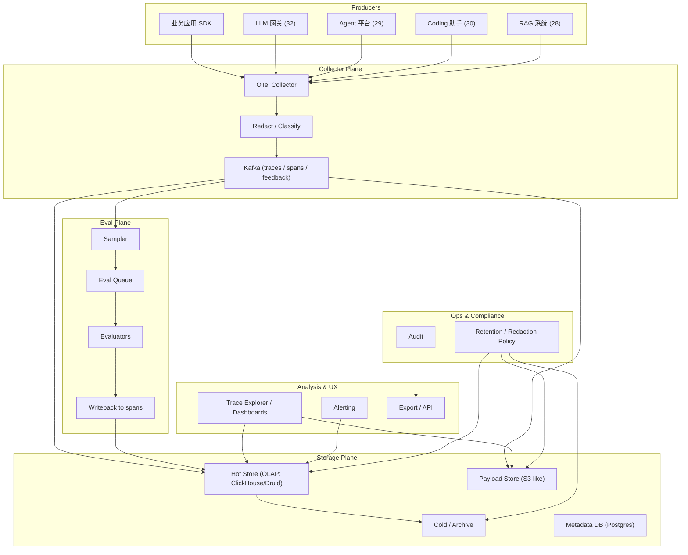

# 系统设计 - 案例 34：AI 可观测性 / Trace 与评测平台真题模拟

## 题目

设计一个企业级 AI 可观测性与评测平台，为公司所有 AI 应用提供：

- 统一的 **trace**（追踪从用户请求 → prompt → 模型调用 → 工具调用 → 响应的完整链路）
- 统一的 **metrics**：延迟、成功率、token、成本、命中率
- 统一的 **成本归因**：到租户 / 应用 / 用户 / prompt 版本 / 模型
- **Online eval**：线上样本持续抽检，自动打分
- **Offline eval**：发版前跑回归集
- **用户反馈闭环**：👍👎、自定义 scoring 汇入指标
- **异常检测与告警**：质量、成本、延迟异常
- **数据治理**：prompt / response 敏感字段脱敏、保留周期、合规导出

先不做：

- 基础设施级 APM（用已有的 Datadog / Prometheus 做 host / k8s 指标）
- 模型训练数据采集
- 完整 A/B 实验决策（走 33 章）
- 安全治理（走 39 章）

---

## 为什么这题值得深讲

AI 可观测性在 2024–2026 年几乎成了 AI 工程能否上生产的分水岭。很多回答会停在：

- `打日志 / 用 Langfuse 或 LangSmith`

这是报工具名，不是做设计。因为 AI 可观测性 **不是把普通 APM 套在 LLM 请求上那么简单**：

1. **主角不是 QPS 和延迟，而是 token / cost / quality / safety**
2. **单请求是一棵树**：prompt 渲染 → LLM 调用 → tool 调用 → sub-agent → 结构化输出解析
3. **质量不能靠 HTTP 200 判断**：返回一段胡话，技术上也是 200
4. **数据敏感**：prompt / response 常含 PII、业务秘密，采集 / 存储 / 脱敏都是问题
5. **评测是主链路的一部分**，不是事后分析工具
6. **数据量巨大但价值不均**：不采样扛不住，但错误采样会错过关键信号
7. **需要时间感**：模型 / prompt / tool 每天都在变，观测必须回答“是什么改动导致了这个问题”

如果一个候选人真的理解这题，他应该能讲清：

- 为什么 GenAI trace 不能直接复用普通 distributed tracing
- 为什么 online eval + offline eval 要分开
- 为什么成本必须 per-span 归因，而不是总账单
- 为什么“质量下降”这个指标本身需要一套子系统
- 为什么数据保留策略是这类平台的合规基石

---

## 面试官真正想看什么

1. 你能不能把 **GenAI trace 模型** 讲清，包括关键 span 类型和 attributes
2. 你能不能说明 **online eval** 的工程实现：采样、评分、反馈
3. 你会不会把 **成本归因** 设计到 span 级
4. 你能不能讲清 **数据脱敏** 在 pipeline 中的位置
5. 你会不会把 **质量异常检测** 和普通告警区分
6. 你能不能把 **用户反馈** 拉回 trace
7. 你有没有意识到 **回归评测集** 必须持续增长且有版本
8. 你能不能把 27 / 28 / 29 / 30 / 32 / 33 产生的 trace 汇到同一个平台讲清楚

---

## 一开始先别急着设计，先收敛题目语义

澄清问题：

1. **覆盖面**：公司 AI 应用有多少？全托管？还是包括业务自建？
2. **采样**：全量 trace 是否可行？还是必须采样？
3. **存储周期**：trace / prompt / response 各保留多久？
4. **评测成本**：Online eval 用什么模型？占多少预算？
5. **合规**：是否需要地区 / 租户级数据隔离？
6. **用户反馈**：是从终端产品 API 拿，还是平台主动问？
7. **集成**：平台使用 OTel 协议，还是自定义 SDK？
8. **报警通道**：Slack / PagerDuty / 内部工单？
9. **面向对象**：开发者 / 运维 / 数据科学家 / 业务 PM 谁来用？

如果面试官不继续补充，我会把题目收敛成：

- 覆盖公司 **所有** AI 应用（通过 32 章网关 / 29 章 Agent 平台自动接入）
- **采样**：100% metadata、按策略采样 payload
- **保留**：metadata 90 天、payload 14 天（可配置零保留）
- Online eval：每 app 抽样 1–5%，走 LLM-as-judge + 规则评分
- 合规：按租户 primary region 存储
- 协议：**OTel + GenAI 语义约定**
- 受众：开发者 + 数据科学家 + 业务 PM 都用，提供不同视图

### 关键选择

#### 选择 1：以 OTel GenAI 语义约定为骨架

- OTel 已经在 2024 年发布了 GenAI 语义约定草案（`gen_ai.system`、`gen_ai.request.model`、`gen_ai.usage.*`、`gen_ai.tool.*`）
- 选标准协议，避免 vendor lock，也方便接第三方 SDK
- 但要做 **扩展**：prompt 版本、variant、workspace、run_id、feedback

#### 选择 2：trace 和 eval 共享同一数据底座

- Eval 样本就是 trace 的抽样
- 评测结果作为 span attribute 回写
- 这让“我昨天上线的 prompt 效果如何”变成一个 trace 查询

#### 选择 3：成本是 **一等指标**，per-span 归因

- 成本不是日终报表计算出来的
- 每个 LLM span / tool span 自带 `cost_usd`、`tokens_in/out`
- 在 span 写入前计算好
- 聚合到多个维度可以实时查

---

## 第一步：先判断这是一个什么类型的系统

我会先明确这不是普通 APM，而是：

- **分布式追踪 + 实时指标 + 在线评测 + 反馈闭环 + 合规存储** 的复合系统

特征：

1. **多生产者**：所有 AI 应用都产 trace
2. **极大写入**：日亿级 span，峰值百万级 TPS
3. **Payload 大**：prompt / response 几十 KB 级别常见
4. **需要分析**：查询既有实时看板又有离线分析
5. **合规严格**：PII / 业务秘密需脱敏
6. **读者多样**：工程师、DS、产品、合规、安全

主矛盾：

- 如何把 **高吞吐采集** 和 **高质量分析** 放进同一平台，同时保持合规

---

## 第二步：容量估算

### Trace 数量

- 日请求 10 亿（32 章网关的估计）
- 每请求平均 5 个 span（1 个 root + 1 LLM + 2 tool + 1 safety）
- **日 50 亿 span**
- 峰值 `~600k spans/s`

### Payload 大小

- Span metadata：~1 KB
- Prompt payload：平均 5 KB，长的 50–500 KB
- Response payload：平均 2 KB，长的 50 KB

### 存储

- Metadata + 聚合指标：`50 亿 × 1 KB = 5 TB / 日`
- Payload 全量：百 TB / 日 — 不可接受，必须采样

### 采样策略

- 错误 / 异常 / 用户反馈 👎 的请求：**100% 采 payload**
- 正常请求：按 app 策略采（1–10%）
- 高敏感应用：支持零保留（只保 metadata hash）

### 查询

- 每日查询：`数十万级`
- 用户面板、报警、调试、评测分析

### 评测

- Online eval 抽样 5%：`5000 万次 / 日`
- 使用便宜的评测模型（Haiku / GPT-4o mini / 自研），约 `$0.001 / 次`
- 每日成本 `$50k`，可接受

---

## 第三步：先定义不变量

1. **任何一次模型调用的 trace 不能丢失 metadata**（哪怕 payload 被采样掉）
2. **敏感数据在离开源头前必须脱敏**（网关 / 应用层的 SDK 负责）
3. **成本数字必须和账单对账**，误差 < 0.5%
4. **Eval 结果作为 span attribute**，可追溯到评测模型和评测时刻
5. **用户反馈必须能关联到 span**，即使反馈晚一天到达
6. **Trace 采样不能依赖日志时间**：必须基于业务维度（app、tenant、error）
7. **数据保留策略必须可配置且可审计**
8. **查询不能超租户**：任何面板、告警、导出都严格隔离

---

## 第四步：从朴素方案一步步推演

## 第一轮：日志堆里捞

- 每个 AI 应用打自己的日志
- SRE 用 ES / Loki 查
- 有问题靠 grep

问题：

1. 没有全局视图
2. 成本追踪做不到
3. Prompt 和 Response 散在不同日志
4. 格式不统一
5. 合规脱敏随意

## 第二轮：统一 SDK + OTel

- 所有 AI 调用通过统一 SDK
- SDK 输出 OTel trace，走 OTel collector
- 中心平台接收 + 存储

解决了一致性，但：

1. Payload 太大，吞吐扛不住
2. 没有 eval
3. 成本仍然离线算

## 第三轮：采样 + 分层存储

- Metadata 全量
- Payload 采样 + 对象存储
- 热存（7 天）+ 温存（30 天）+ 冷存（归档）

## 第四轮：引入 Online Eval

- 采样 trace 进入 eval 队列
- 跑评分
- 结果回写 span
- 指标流实时聚合

## 第五轮：反馈闭环

- 产品端 👍👎 API 关联 trace_id
- 异常自动入评测集（新增 case）
- Prompt 平台（33 章）消费

## 第六轮：异常检测 + 报警

- 基于指标流做检测
- 多信号融合（延迟 + 错误 + eval 分 + 反馈）
- 按 prompt version / model 分组

## 第七轮：合规 + 多区域

- 按租户 region 分集群
- 保留策略、数据删除、审计导出

---

## 核心对象模型

### `Trace`

一次用户请求的完整链路。

- `trace_id`、`tenant_id`、`app_id`、`user_id`
- `entry_point`（完整请求的入口：API / Agent run / job）
- `started_at` / `finished_at`
- `status`
- `root_span_id`
- `sampled_payload`（bool + 原因）

### `Span`

trace 下的一个操作节点。

- `span_id`、`trace_id`、`parent_span_id`
- `kind`：`llm_call` / `tool_call` / `prompt_render` / `safety_check` / `cache_lookup` / `embedding` / `rag_search` / `sub_run`
- `name`
- `started_at` / `finished_at`
- `status`
- `attributes`：OTel + GenAI 扩展
- `payload_ref`：引用对象存储（可空）
- `cost_usd`、`tokens_in`、`tokens_out`
- `eval_scores`：可多个，来自不同评测器

### `Feedback`

来自用户或自动评测。

- `id`
- `subject_ref`：trace_id / span_id / run_id
- `source`：`end_user` / `reviewer` / `auto_eval` / `product_metric`
- `score_type` / `score`
- `comment`
- `labeler`
- `ts`

### `EvalJob`

离线或在线评测任务。

- `id`、`dataset_id`（可空，在线评测直接用 trace）
- `evaluator_id`（某个 LLM-as-judge 或规则）
- `subject`：`trace_id[] | span_id[]`
- `status` / `cost` / `duration`
- `result_refs`

### `Dataset`

回归集 / 评测集。

- `id`、`owner`、`version`
- `cases[]`
- `source`：`manual` / `imported_from_traces` / `synthetic`
- `tags`

### `Evaluator`

评测器定义。

- `id`、`name`、`type`：`llm_judge` / `regex` / `code_eval` / `programmatic`
- `model_id`（对 llm_judge）
- `prompt_id`（33 章 prompt）
- `output_schema`：如何解析输出为 score

### `Metric` / `Alert`

- 时序指标及报警规则

---

## 最终高层架构



要点：

- **Collector Plane** 做脱敏 / 分类
- **Hot Store** 是 OLAP，做 trace / metric 查询
- **Payload Store** 用对象存储，引用式
- **Eval Plane** 是独立的 worker 池
- **Retention Policy** 统一控制全链路数据生命周期

---

## GenAI Trace 模型

面试深度最能体现在这一节。

### 标准 Span kinds

- **`chain.run`**：整个业务请求的根 span
- **`prompt.render`**：prompt 模板渲染（关联 33 章 prompt_version_id）
- **`llm.call`**：一次模型调用
- **`tool.call`**：一次工具调用（关联 29 章 tool_id）
- **`retrieval.search`**：RAG 检索（关联 28 章）
- **`safety.check`**：内容安全检查
- **`cache.lookup`**：32 章缓存
- **`agent.step`**：29 章 Agent 的一步
- **`sub_run`**：sub-agent

### LLM Span 的核心 attributes（OTel GenAI）

- `gen_ai.system`: `openai` / `anthropic` / `gemini` / `self_hosted`
- `gen_ai.request.model`: `gpt-4o-2024-08-06`
- `gen_ai.request.temperature`, `top_p`
- `gen_ai.request.max_tokens`
- `gen_ai.usage.input_tokens`
- `gen_ai.usage.output_tokens`
- `gen_ai.response.finish_reason`

### 扩展 attributes（我们自己加）

- `llmgw.route_reason`: 路由命中的原因
- `llmgw.cache.hit`: 是否命中 response cache
- `prompt.version_id`: 33 章 prompt 版本
- `prompt.variant_name`
- `agent.run_id` / `agent.step_index`
- `tool.id` / `tool.version`
- `safety.decision`: `allow` / `block` / `redact`
- `cost.usd`: per-span 金额
- `eval.score.<evaluator>`

### Payload 引用

Payload 不直接放 span（大）——放对象存储，span 里只存：

- `payload.input_ref`
- `payload.output_ref`

引用格式：`s3://traces/<tenant>/<date>/<span_id>.json.gz`。

### 树结构示例

一个典型 Agent 请求：

```
chain.run (trace root)
├─ prompt.render
├─ agent.step[0]
│   ├─ llm.call (plan)
│   ├─ tool.call (rag.search)
│   │   └─ retrieval.search
│   └─ llm.call (decide)
├─ agent.step[1]
│   ├─ safety.check
│   ├─ tool.call (apply_patch)
│   └─ llm.call (summarize)
└─ safety.check (final output)
```

每一步都是一个 span，cost / tokens / eval 分别归属。

---

## 脱敏与敏感数据处理

### 脱敏时机

- 在 SDK 或 Gateway **出站前** 做
- 默认规则：
  - email / phone / credit card → mask
  - 已知密钥格式 → redact
  - 自定义字段 → pattern config
- 敏感操作：
  - 对高敏感租户启用 **零保留**（只记 metadata、payload hash）

### 脱敏实现

- **Inline 脱敏**：Collector 把 payload 过一遍 regex / classifier 再写入
- **延迟脱敏**：写入时保存原始，读取时按权限显示
- 推荐：**Inline 优先**，因为合规更清

### 分类

- 每条 span 带 `data_class`：`public` / `internal` / `pii` / `regulated`
- 不同 class 有不同存储 + 保留策略

### 数据删除（Right to erasure）

- 按 user_id 批量删除相关 trace / payload
- 执行时生成 audit record

---

## Online Eval（主链路的一部分）

### Sampler

- 从 Kafka trace stream 按规则抽样
- 规则：
  - `X% 普通流量`
  - `100% 错误 / safety block / 用户差评`
  - `100% 高价值 tenant`

### Evaluator

- 包含多种：
  - **LLM-as-judge**：用便宜模型对“这个答案好不好”打分
  - **Regex / keyword**：格式 / 关键字检查
  - **结构化校验**：schema 合规？JSON 解析？
  - **一致性**：多次请求答案一致性
- 评测结果写回 span 的 `eval.score.*`

### Eval 的负载管理

- 独立 worker 池
- 有独立预算
- 超预算停评
- 优先级：错误 trace > 高价值流量 > 普通流量

### Online vs Offline

- **Online**：持续、覆盖生产流量，快速发现 regression
- **Offline**：固定回归集、发版前跑
- 共享 Evaluator 定义，共享指标

---

## 用户反馈闭环

### Feedback 来源

- 产品端 👍👎 按钮
- 显式打分
- 行为信号（用户点选 / 编辑 / 撤销）
- 后续用户动作（例如用户改写了 AI 给的代码 → 视为负反馈）

### Feedback 关联

- 产品端在展示 AI 结果时记录 `trace_id / span_id`
- 用户反馈时通过这个 ID 回写
- 异步聚合到 metrics

### Feedback → Eval

- 差评样本可 **自动进入评测集** 待人工标注
- 好评样本作为 positive baseline

---

## 指标 / Metrics

### 主要指标

- **QPS / concurrency / latency (P50/P95/P99)**
- **Error rate**（按 error type）
- **Cost**（tenant / app / model / prompt_version 维度）
- **Token usage**
- **Cache hit rate**
- **Eval score 分布**（per prompt_version / per model）
- **Feedback score**
- **Safety block rate**

### 指标 backbone

- 流式：Kafka → ClickHouse materialized view
- 聚合维度：tenant × app × model × prompt_version × hour
- 实时查询 < 1s

### 对账

- 每日和 32 章网关 Usage Store 对账 cost，差异 > 0.5% 报警
- 评测预算、告警预算独立对账

---

## 异常检测与报警

### 触发信号

- 延迟 P95 飙
- 错误率上升
- Eval 分下降
- 用户反馈恶化
- 成本 burn rate 异常
- Safety block 比例异常

### 多信号融合

- 单一信号不触发大报警
- 多个信号同时异常才升级为严重
- 避免噪声

### 归因

- 自动比对 change log：
  - Prompt 版本切换（33 章）
  - Model 切换（32 章）
  - Tool 版本（29 章）
  - Retrieval index 更新（28 章 / 31 章）
- 给出可疑变更列表

### 报警通道

- 实时：Slack / PagerDuty
- 汇总：日 / 周报

---

## 数据保留 / 合规

### 分层保留

- Metadata：90 天（支持审计）
- Payload：14 天默认，可配
- 归档：按租户配置，S3 Glacier 一类存 1–7 年

### 访问控制

- 工程师：只能看自己 app 的 payload（tenant 隔离）
- DS：可看聚合 + 受控原始样本
- 合规 / 安全：全访问 + 审计

### 导出

- 支持租户自主导出（审批制）
- 支持监管 / 审计导出（带审计记录）

### Geo 合规

- 按租户 region 存储
- 不跨境
- 数据删除请求按 region 处理

---

## 面向不同角色的视图

### 开发者

- 单 trace 查看（trace explorer）
- Prompt / Response diff
- 同一 prompt_version 的 cost / latency / quality 趋势

### 数据科学家

- 聚合视图：按 prompt_version / model / user segment
- Eval 分对比
- 回归样本管理

### 产品 PM

- 业务指标：用户采纳率、满意度
- Segment 分析
- 和业务 KPI 的关联

### 合规 / 安全

- 数据保留、脱敏报告
- 访问日志
- 异常模式检测

---

## 和其他 AI 系统的协作

| 合作方 | 我们提供 | 我们接收 |
| --- | --- | --- |
| 27 推理平台 | 成本 / 延迟 / 错误指标 | 推理 request/response trace |
| 28 RAG | 检索 span + ACL 审计 | 检索 trace |
| 29 Agent | run / step / tool span、replay 数据 | run 事件流 |
| 30 Coding | 接受率 / 保留率 vs trace | completion / edit trace |
| 31 向量库 | 召回率监控指标反馈 | search trace |
| 32 网关 | 成本对账 / 路由分析 | trace + cost |
| 33 Prompt | prompt_version 指标回流 | resolve 事件 |

实际上 34 是这些系统的 **数据总线**。

---

## 演进路径

### 阶段 1：OTel + ES + 简单面板

### 阶段 2：OLAP + 成本归因 + 基础告警

### 阶段 3：Online Eval + Feedback 闭环

### 阶段 4：异常归因 + 多区域 + 合规

### 阶段 5：AI for AI Ops（用模型自动诊断问题）

---

## 面试里我会怎么讲最终方案

我会先收敛：这不是把普通 APM 套在 LLM 上，而是一个 **Trace + Metrics + Eval + Feedback** 四位一体的平台，主角是 token / cost / quality / safety 而不是 QPS。

架构上分六个 plane：Producers（所有 AI 系统的 SDK/Collector）、Collect（OTel + 脱敏 + Kafka）、Storage（OLAP 热 + 对象存储 payload + 归档）、Eval（Sampler → Worker → Writeback）、Analysis（UI + 告警 + 导出）、Ops（保留策略 + 审计）。

关键不变量：任何 LLM 调用都有 metadata，payload 按采样策略保留；脱敏在源头；成本 per-span 归因；用户反馈能跨时间回关联；trace 不跨租户查询；保留策略可审计。

我会强调 GenAI trace 模型：以 OTel GenAI 语义约定为骨架，扩展 prompt_version / route_reason / eval_score / agent_step / tool_id 等字段，payload 引用到对象存储。

继续深挖我会讲：Online Eval 的采样策略 + 预算控制、用户反馈 → 评测集回灌、异常检测的多信号融合 + 归因到 change log、合规保留（零保留模式、跨境、删除权）、以及这个平台作为 27/28/29/30/31/32/33 的数据总线的角色。

---

## 面试官如果继续追问

### 追问 1：全量 trace 存不下，怎么采样

- Metadata 全量
- Payload 按 tenant / app 配策略
- 错误 + 反馈 👎 + 高价值 tenant 100%
- 普通 1–10%

### 追问 2：LLM-as-judge 会不会偏

- 多评测器 ensemble（不同模型 + 规则）
- 人工抽检校准
- 偶尔自检：给 judge 已知答案，检查是否保持一致

### 追问 3：成本如何和网关账单对账

- 网关 32 章的 cost 是主账
- 可观测平台把 trace 成本聚合应该 ≈ 账单 ±0.5%
- 每日对账，差异报警

### 追问 4：怎么把用户反馈关联到 trace

- 产品展示 AI 结果时记录 trace_id
- 用户点 👎，产品 API 带这个 id
- Feedback 写入 → 关联 → 指标聚合

### 追问 5：prompt 含密钥怎么办

- Redact SDK 在源头扫
- 检测到 → mask + 标注
- 对已泄漏 trace 快速批量删除

### 追问 6：异常归因怎么做

- 事件流接入 change log（prompt / model / tool / index）
- 异常时间窗和 change log 对齐
- 给出 ranked 可疑变更

### 追问 7：为什么不用 LangSmith / Langfuse 等现成产品

- 工具很好，但企业级要：
  - 自有数据驻留
  - 自定义脱敏
  - 和内部其他系统深度集成
  - 合规 + 多租户
- 起步可以用第三方，规模上来通常自建核心

### 追问 8：怎么支持零保留租户

- payload 永不落盘
- 只存 metadata 和 payload 的 hash
- 审计仅证明“调用发生过”

### 追问 9：多区域如何做

- 每区域独立集群
- 只跨区同步 **聚合指标**，原始数据不出境
- 跨区故障隔离

### 追问 10：trace 查询高峰扛不住

- OLAP 按时间 + tenant 分区
- 热数据单独 cluster
- 限流长查询
- 预计算常见视图

---

## 常见失分点

1. 把 AI 观测答成普通 APM
2. 没把 online eval / feedback 拉进来
3. payload 全存，没采样
4. 成本不 per-span
5. 脱敏是事后做
6. 告警只看延迟 / 错误
7. 没讲和 27–33 的协作
8. 合规 / 多区域缺失
9. 没讲归因 / change log
10. 没区分开发者 / DS / PM 的视图

---

## 总结

AI 可观测性平台真正考的不是“加日志”，而是：

`如何围绕 token / cost / quality / safety 这四个主角，把全链路 trace、在线评测、用户反馈、异常归因、合规保留组合成一个 AI 系统的中央数据总线。`

正确顺序：

1. 先收敛覆盖面与合规边界
2. 判断复合系统（Trace + Metric + Eval + Feedback）
3. 定义不变量（metadata 全量、脱敏源头、成本 per-span、反馈回关联）
4. 朴素 → 分层 → 在线评测 → 反馈 → 异常检测 → 合规
5. 强调平台作为 27-33 的数据总线

---

## 自测问题

1. 一个 Agent run 产生了 80 个 span，payload 总大小 2MB，你会如何采样与存储？
2. 某 prompt 上线后 eval 分没变，用户反馈变差，你会怎么查？
3. 成本对账差异 3%，首先怀疑哪几个环节？
4. 如何在不保留 payload 的前提下，仍然能回答“这个用户遇到了什么错误”？
5. 一个 tenant 要求自己的 trace 只在法兰克福存储并在 72 小时后自动删除，怎么做？
6. 如果 online evaluator 挂了，系统应该退化到什么状态？
7. 异常报警 false positive 太多，怎么改信号融合规则？
8. Trace 查询高峰时段用户抱怨慢，你会优先做什么优化？
