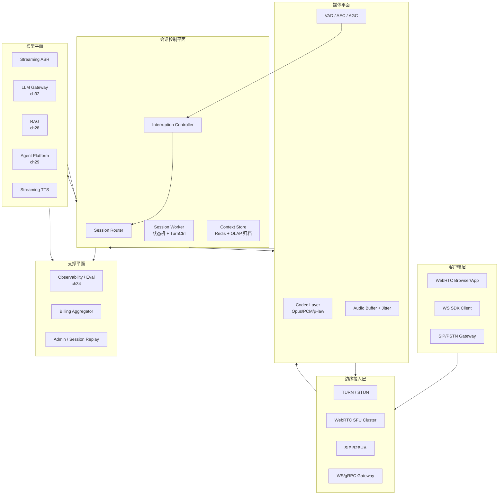

# 35. 实时语音 / Realtime AI 对话系统真题模拟

## 题目

> 设计一个面向全球用户的 **实时语音 AI 对话系统（Realtime Voice Assistant / Realtime API Platform）**：
>
> - 用户通过手机、网页、车机、耳机、电话（PSTN / SIP）等入口，和一个 AI agent 以“语音对话”的方式交互；
> - 系统需要支持 **全双工对话**：用户可以随时打断模型的语音（barge-in / interruption），模型要立即停下来听；
> - 目标端到端延迟：用户说话结束 → 模型开始出声（first audio byte）应在 **500 ms 以内**（良好体验），最差不超过 **1s**；
> - 需要对接 27 章的大模型推理平台、28 章的 RAG、29 章的 Agent 平台、32 章的网关；
> - 需要记录通话给 34 章的可观测性与评测平台用于分析和评测。
>
> 请按系统设计面试的标准完整方案：从语义收敛、容量估算、核心不变量、方案推演、核心对象模型、高层架构、API 设计、数据模型、核心链路、演进路径、追问、失分点、自测一步步讲清。

这道题在 2025-2026 已经是实战题，OpenAI Realtime API、Gemini Live、豆包语音、讯飞实时对话、手机厂商的“AI 语音助理”都在打这个方向。它很容易被面到的原因是——它把“流式 + 全双工 + 多模态 + 实时调度 + 成本”这五件事逼到同一条链路上。

---

## 为什么这题值得深讲

这题并不是“ASR + LLM + TTS 串起来”。真正的难点在于：

1. 延迟预算要同时容下 **ASR 增量识别、LLM 首 token、TTS 首段音频、网络 RTT** 四段时间，任何一段超预算都会让用户感受到卡顿；
2. 全双工对话带来的 **interruption（barge-in）语义**：用户打断时，LLM 和 TTS 都必须能立即取消，并且下一轮对话要正确接续上下文；
3. 状态机不再是“请求-响应”而是“长会话 session”，session 内要维护音频缓冲、当前回合 turn、VAD 状态、中断次数、累计时长、计费口径；
4. 音频比文本“贵”得多：带宽、编解码、模型调用都是连续流量，不是按 QPS 算，而是按 **并发会话数 × 秒数** 算；
5. 端侧能力参差不齐：网页要 WebRTC，电话要 SIP，手机要 WebSocket + OpusCodec，车机可能只支持 PCM；不同入口的丢包、抖动、延迟完全不同；
6. 评测维度比文本多：不仅要评 LLM 的正确性，还要评 **识别准确率（WER）、语音自然度（MOS）、打断响应时间、合成可懂度**，并且要把这些指标反馈给 34 章。

能把这五件事串起来讲，说明候选人真正理解“实时”系统而不是“请求响应”系统。

---

## 面试官真正想看什么

- 能不能快速拆出 **入口平面（PSTN/WebRTC/WS） / 媒体平面（音频流 / VAD / 编解码） / 模型平面（ASR / LLM / TTS） / 控制平面（session / turn / router）** 四条独立链路？
- 能不能说清 **端到端延迟预算**，并把每一段（采集、上行、VAD、ASR 增量、LLM 首 token、TTS 首段、下行、播放）都算出数字？
- 遇到 interruption，能不能给出一个 **明确的状态机**：什么时候截断 TTS、什么时候丢弃 LLM 输出、什么时候接着上一轮？
- 面对“并发 10 万路会话”的容量，能否估算出 GPU 数量、带宽、编解码 CPU？
- 能不能把可观测性、评测、计费作为**一等公民**同步设计，而不是事后补？

这五个点构成答题主骨架。

---

## 收敛题目语义

面试时第一件事是跟面试官把边界讲清，否则你会掉进“要不要端侧模型 / 要不要 ASR 自建”这种跑题陷阱。

1. **我们做的是“语音到语音”的平台**：输入输出都是音频流，文本只是中间结果之一。
2. **我们的“会话”是一个长期存在的资源**，不是一次请求。它有 `session_id`、有起止时间、有 turn 序列、有成本、有事件流。
3. **我们不自研核心模型**，ASR / LLM / TTS 统一通过 32 章的网关和 27 章的推理平台调用；我们只拥有“会话编排、媒体管道、实时状态机”。
4. **我们支持至少三类入口**：WebRTC（浏览器 / 移动 App）、WebSocket + 音频帧（移动 App 原生 SDK）、SIP / PSTN（电话呼入）。
5. **我们不做“视频通话”**：即使未来扩展，视频 track 的处理也归另一条链路，不在本题核心。
6. **计费口径是“会话秒 × 档位 + 模型调用量”**，不是“token 量”。

这几条是所有后续讨论的前提。

---

## 容量估算

先把数字口径定住，避免后面用“感觉”讨论架构。

- 全球同时在线会话：峰值 10 万路；
- 每路平均会话时长 3 分钟 → 每天新发起会话数约 `10万 × 24 × 60 / 3 × 峰谷比0.3` ≈ **1.4 亿次 / 天**；
- 每路上行音频 16 kHz × 16 bit = 256 kbps，Opus 压缩后约 **24 kbps**；下行 TTS 音频 24 kHz × 16 bit = 384 kbps，Opus 压缩后约 **32 kbps**；
- 10 万路并发 × 上下行合计 56 kbps ≈ **5.6 Gbps** 实时音频流；
- ASR：10 万路并发都要跑流式识别，单路约 0.02 RTF（实时因子），GPU 上一张卡能扛 30-50 路 → 需要 **2000-3000 张 ASR GPU 卡**（若用蒸馏后的小模型或 CPU 化可以大幅降低）；
- LLM：每路平均每分钟 1.5 个 turn，每 turn 输入 300 tokens、输出 150 tokens，峰值总 TPS ≈ `10万 × 1.5 / 60 × 450` ≈ **110 万 tokens/s**；这部分由 32 网关 + 27 推理平台承担；
- TTS：每路每 turn 输出 4 秒音频，流式合成，GPU 上一张卡扛 40-80 路 → 需要 **1500-2500 张 TTS GPU**（若用更小的神经声码器 + 端侧合成可以显著降低）；
- 存储：每路会话音频 3 分钟，合计 ~1 MB（Opus 压缩），每天 140 GB；文本转写 + 事件日志每会话约 5 KB，每天 700 GB；
- 峰值 GPU 总算力大致在 **5k-7k 张**（视模型选型和量化而定），这是真正决定“这题能不能做大”的核心。

关键结论：**实时语音的主要成本来自“连续流量”和“GPU 长期占用”，而不是“单次请求”**。所以架构要围绕“怎么让一张 GPU 尽量同时服务更多 session”来展开。

---

## 不变量

写方案之前把不变量列清楚，后面所有权衡都要以这几条为底线。

1. **每个 session 的 turn 编号单调递增**，同一 turn 内 ASR / LLM / TTS 的中间事件必须带上 `turn_id`，用于前端对齐和服务端防串话；
2. **interruption 必须可抢占**：新的用户语音到达时，正在进行中的 LLM 和 TTS 必须能在 **50 ms 内** 被标记为作废，不再向下游推送音频；
3. **TTS 播放音频必须与 session 的 turn 对齐**：客户端只播放“当前有效 turn”的音频，作废 turn 的音频即使提前到达也要丢弃；
4. **session 的真相源是服务端**：客户端只负责采集和播放，任何“我现在应不应该说话”的判断都由服务端的 VAD/编排决定；
5. **会话事件流是第一等公民**：所有 ASR partial/final、LLM delta、TTS chunk、interrupt、error 都要以事件形式落到 34 章的可观测平台；
6. **所有音频片段都要带时间戳**：采集时间戳、发送时间戳、播放时间戳，后面 debug 延迟必须靠它们。

这几条里第 2、3 条是本题真正的“正确性”核心：不满足就会出现**模型一直说个不停、用户想打断打不断、不同 turn 的声音混在一起**这类典型 bug。

---

## 方案推演

### 方案 A：`ASR → LLM → TTS` 串行请求（naive）

客户端把一段完整音频发过来，服务端依次调 ASR、LLM、TTS，拿到完整音频后一次性下发。

- 优点：实现简单，容易接入现有“请求-响应”基础设施；
- 致命问题：
  - 延迟完全不可用：ASR 至少要等用户说完 + 再处理一次 → 1-2s；LLM 再 1-2s；TTS 再 2-3s；端到端 5-8s；
  - 无法 interruption：用户说话时模型完全听不见；
  - 无法做增量反馈：用户看不到“正在识别”，会怀疑是不是卡了；
- 结论：不是实时语音系统，只是“异步语音转录 + 回答”。不能答这个方案，但要在回答里主动划清边界。

### 方案 B：流式 ASR + 流式 LLM + 流式 TTS（pipeline）

三个模型都改成流式：

- ASR 输出 partial（部分识别）和 final（句末识别）两种事件；
- 在用户说话过程中，当 VAD 判定“说话开始”时，服务端就开始准备上下文；
- 当 VAD 判定“说话结束”或 ASR 给出 final 时，立刻触发 LLM；
- LLM 一边生成 token，TTS 一边把 token 拼成句子做流式合成；
- TTS 生成的音频小包一出来就立即下发，不等整段合成完。

这种 pipeline 是 **目前所有生产级语音助手的标准做法**，延迟能压到 500 ms 左右。

但它只是“延迟可用”，还没解决：

- interruption：用户在 TTS 播放过程中开口，怎么让系统立刻停？
- 并发：一个 session worker 怎么不把 CPU/带宽拖死？
- 失败：任一环节失败（ASR 断流、LLM 超时、TTS 中断），怎么让会话继续不要挂？

### 方案 C：**Session-Oriented Realtime Pipeline**（本题目标方案）

把会话升级为**“带状态机的媒体管道”**，在方案 B 基础上补齐三件事：

1. **Session State Machine**：明确四种状态 `IDLE → LISTENING → THINKING → SPEAKING`，每种状态允许的事件只有几个；
2. **Interruption Controller**：一个独立组件，订阅 VAD 的“用户开口”事件，一旦检测到就把当前 turn 标记为 `CANCELLED`，取消下游请求；
3. **Turn-scoped Request IDs**：每个 turn 一个 `turn_id`，所有下游调用（ASR decoder handle / LLM request / TTS request）都带这个 id，服务端在 router 层做 **cancel-by-turn**；
4. **Shared Media Plane**：媒体（音频流）和逻辑（事件流）分离，音频走 WebRTC/SIP，逻辑走 WebSocket 或 gRPC 双向流。

这是我们真正要答的方案。它的核心想法是：**把“音频”当成一个可抢占的数据通道，把“会话”当成一个可恢复的状态机**。

---

## 核心对象模型

面试里这段是关键，能把对象模型讲清楚就能顺利推进。

```
Session
├─ session_id
├─ user_id / tenant_id
├─ started_at / ended_at
├─ input_codec (opus/pcm)
├─ output_codec
├─ state (IDLE / LISTENING / THINKING / SPEAKING / CLOSED)
├─ current_turn_id
├─ context_window (最近 N 轮文本 + 引用)
├─ config (voice, language, temperature, tools, system_prompt)
└─ metrics (accum_latency, interrupt_count, tokens_in/out, seconds)

Turn
├─ turn_id
├─ session_id
├─ started_at / ended_at
├─ state (ASR_ING / LLM_ING / TTS_ING / DONE / CANCELLED / ERROR)
├─ asr_partials[] / asr_final
├─ llm_request_id / llm_tokens[]
├─ tts_request_id / tts_chunks[]
├─ tools_invoked[]
└─ cancel_reason (user_interrupt / timeout / server_abort)

MediaStream
├─ direction (up / down)
├─ codec
├─ frames (timestamped)
└─ rtp_ssrc / ws_conn_id

Event
├─ type (asr.partial / asr.final / llm.delta / llm.done / tts.chunk / tts.end / vad.start / vad.end / turn.cancel / error)
├─ session_id / turn_id
├─ ts_server / ts_client
└─ payload
```

有几个关键的建模选择要在面试里强调：

- `Session` 和 `Turn` 是**两级一等对象**，不能合并：session 是连接级的，turn 是问答级的；interruption 作用于 turn 而不是 session；
- `Event` 是“内外两用”的对象：对客户端是状态回推，对服务端是可观测性日志（34 章数据总线的主要输入）；
- `MediaStream` 和 `Event` **分开传输**：音频走 RTP/WebRTC，事件走 WebSocket/gRPC，有两条通道是因为音频对抖动敏感，但事件对可靠性敏感，混在一起会互相拖累；
- `current_turn_id` 是 session 里唯一的“写时必锁字段”：切换 turn 的那一刻必须原子发生，否则会产生跨 turn 串话。

---

## 最终高层架构



几个在面试里要特别强调的边界：

1. **SFU 只转发媒体不理解语义**：上行到服务端这一段才是“音频帧 + 编解码 + VAD”；下行反过来；SFU 做这一层的原因是**允许横向扩容，且允许同一个会话的“听”和“说”被不同 worker 处理**；
2. **Session Worker 是 sticky 的**：一个 session 绑定一个 worker（至少一段时间内），因为状态机不能在多节点间抖动；但音频可以路由到附近 SFU，worker 和 SFU 不必同机；
3. **模型平面通过网关调用，不直接访问**：这样可以复用 32 章的多模型路由、缓存、熔断、限流；
4. **Interruption Controller 订阅 VAD 事件**：它是一个轻量、单一职责的组件，专门负责“发现打断 → 作废 turn → 通知下游 cancel”。独立出来是为了低延迟（不卷入业务逻辑）和可测试。

---

## API 设计

Realtime API 不能只设计 REST，需要 **WebSocket / gRPC 双向流** 为主，REST 为辅。

### WebSocket 会话协议（简化）

**客户端 → 服务端事件**

```json
// 建立会话
{ "type": "session.create", "config": {
    "voice": "alloy-zh", "language": "zh-CN",
    "system_prompt": "你是客服助手...",
    "tools": [{...}], "modalities": ["audio","text"] } }

// 音频帧（也可走 WebRTC）
{ "type": "input_audio.append", "audio": "<base64 opus>" }

// 手动结束一个 turn（不靠 VAD）
{ "type": "input_audio.commit" }

// 客户端侧取消当前 turn
{ "type": "turn.cancel" }

// 文本输入（例如车机键盘）
{ "type": "input_text", "text": "..." }
```

**服务端 → 客户端事件**

```json
{ "type": "session.created", "session_id": "...", "turn_id": "t-001" }
{ "type": "vad.speech_started", "turn_id": "t-001", "ts": 1718000000123 }
{ "type": "asr.partial", "turn_id": "t-001", "text": "你好我想问一下" }
{ "type": "asr.final",   "turn_id": "t-001", "text": "你好我想问一下退款" }
{ "type": "llm.delta",   "turn_id": "t-001", "delta": "好的，我来..." }
{ "type": "tool.call",   "turn_id": "t-001", "name": "get_order", "args": {...} }
{ "type": "tts.chunk",   "turn_id": "t-001", "audio": "<base64 opus>", "seq": 17 }
{ "type": "turn.done",   "turn_id": "t-001" }
{ "type": "turn.cancelled", "turn_id": "t-001", "reason": "user_interrupt" }
{ "type": "error", "turn_id": "...", "code": "asr_timeout" }
```

几个关键设计点：

- `turn_id` 出现在每一个事件上，客户端只接受“当前 turn”的 `tts.chunk`；
- `turn.cancelled` 是状态机的正式转移信号，客户端收到后必须立即停止播放、清空下行音频缓冲；
- `input_audio.commit` 允许“按键说话”场景绕开 VAD；
- 客户端的 `turn.cancel` 和服务端 VAD 引发的 cancel 是两条路径，最终都走同一套取消逻辑。

### REST 管理面

```
POST   /v1/sessions                 创建会话（获取 ws url + token）
GET    /v1/sessions/{id}            查会话状态
POST   /v1/sessions/{id}/config     热更新 voice / prompt / tools
DELETE /v1/sessions/{id}            关闭会话
GET    /v1/sessions/{id}/transcript 查文本转写
GET    /v1/sessions/{id}/events     查事件流（用于调试 / 评测）
POST   /v1/sessions/{id}/replay     重放会话用于评测
```

REST 面主要用于“带外控制”和“事后调试”，不是实时链路。

---

## 数据模型

把关键字段钉住，容易体现工程成熟度。

```sql
-- 会话
CREATE TABLE sessions (
  session_id      UUID PRIMARY KEY,
  tenant_id       BIGINT NOT NULL,
  user_id         BIGINT NOT NULL,
  started_at      TIMESTAMP NOT NULL,
  ended_at        TIMESTAMP,
  entry_type      ENUM('webrtc','ws','sip'),
  codec_in        VARCHAR(16),
  codec_out       VARCHAR(16),
  voice           VARCHAR(32),
  language        VARCHAR(16),
  config_snapshot JSONB,
  state           ENUM('active','closed','error'),
  seconds_used    INT,
  tokens_in       BIGINT,
  tokens_out      BIGINT,
  interrupt_count INT DEFAULT 0,
  cost_usd        NUMERIC(10,6)
);
CREATE INDEX ON sessions(tenant_id, started_at);

-- 回合
CREATE TABLE turns (
  turn_id      UUID PRIMARY KEY,
  session_id   UUID REFERENCES sessions,
  seq          INT NOT NULL,
  started_at   TIMESTAMP,
  ended_at     TIMESTAMP,
  state        ENUM('asr','llm','tool','tts','done','cancelled','error'),
  asr_text     TEXT,
  llm_text     TEXT,
  tool_calls   JSONB,
  cancel_reason VARCHAR(32),
  first_audio_latency_ms INT,
  e2e_latency_ms INT
);
CREATE UNIQUE INDEX ON turns(session_id, seq);

-- 事件（走 Kafka / OLAP，不入 OLTP）
-- event_type | session_id | turn_id | ts_server | ts_client | payload(jsonb)

-- 音频归档：对象存储中按 session 存两个文件
--   s3://../audio/{session_id}/in.opus
--   s3://../audio/{session_id}/out.opus
-- 并配一个 manifest.json 描述切片和时间戳
```

几个要点：

- `turns` 表必须有 `(session_id, seq)` 唯一索引，保证 turn 顺序不乱；
- `first_audio_latency_ms` 和 `e2e_latency_ms` 是两个“关键质量指标”，直接落表便于聚合；
- 事件流不写 OLTP（写爆，且没有意义），统一走 Kafka → 34 章的 OLAP；
- 音频原始流默认 7 天过期（合规和成本）；敏感行业（金融、医疗）可能要求留档 30 / 90 天，单独走冷存储。

---

## 核心链路

真实面试里能把这几条链路一段段讲清楚，就已经胜过 70% 候选人。

### 1. 会话建立

1. 客户端 `POST /v1/sessions`，服务端分配 `session_id` 和一个 **短时 token**；
2. 客户端拿 token 建 WebSocket；同时从 WS 得到一个 TURN/SFU 地址，建立 WebRTC 通道；
3. `Session Router` 通过一致性哈希（按 `session_id`）选一个 `Session Worker`；
4. Worker 从 `CtxStore` 加载用户画像、历史上下文摘要、配置快照；
5. 状态进入 `IDLE`，开始监听音频；服务端发出 `session.created`。

> 这里要讲清一件事：**为什么用两条连接（WS + WebRTC）？** —— 因为音频对延迟和抖动敏感，文本事件对可靠性敏感，混在一起任何一边都会拖累另一边；而且 WebRTC 天然支持 UDP 优化，WebSocket 天然是可靠流，职责不一样。

### 2. 一次正常对话 turn

1. 用户开口，SFU 转发 RTP 音频到 `Codec → VAD`，VAD 检测到 `speech_started`；
2. `Session Worker` 状态从 `IDLE → LISTENING`，分配一个新的 `turn_id`；
3. ASR 引擎开启流式 decoder，每 200ms 输出一次 `asr.partial`；
4. VAD 检测到 `speech_ended`（或 ASR 给出 final），Worker 把 `asr.final` 和历史上下文组合成 prompt；
5. Worker 状态变为 `THINKING`，调用 32 章网关，带上 `turn_id` 作为 cancel key；
6. LLM 开始流式返回 token，Worker 把 delta 推给客户端（用于字幕），同时喂给 TTS；
7. TTS 流式生成音频，切块下发给 SFU → 客户端；此时 Worker 状态为 `SPEAKING`；
8. TTS 全部下发完毕、客户端播放结束，Worker 状态回到 `IDLE`，turn 标记 `DONE`。

注意“LLM delta 同时喂 TTS”这一步并非整段文本给 TTS，而是**按句切分**：

- 维护一个 TTS buffer，遇到句号、问号、逗号（根据语言设定）就 flush 一段给 TTS；
- 这样可以让 TTS 提前开始合成，**首音频延迟** 被压到 200-400 ms。

### 3. Interruption / barge-in

这是最容易被追问的部分，必须背熟：

1. 用户在 `SPEAKING` 状态下再次开口，VAD 抢先触发 `speech_started`；
2. `Interruption Controller` 立刻：
   - 标记当前 `turn.state = CANCELLED`，`cancel_reason = user_interrupt`；
   - 发 `turn.cancelled` 给客户端，客户端立即清空未播放音频缓冲；
   - 调用 32 章网关的 `POST /cancel/{turn_id}` 取消 LLM；
   - 调用 TTS 服务的 `cancel`；
   - 通知 SFU 停止往下行推送这一 turn 的音频（靠 `turn_id` 过滤）；
3. Worker 生成一个新的 `turn_id`，状态回到 `LISTENING`；
4. 新 turn 的 prompt 包含“上一 turn 被用户打断了（只说到一半：xxx）”这个上下文，让模型不要傻傻重复。

关键点：**取消要同时发到四个地方：模型网关、TTS、SFU、客户端**。漏一个都会出现“说完了没停”“声音叠加”“模型还在继续消耗 token”这类 bug。

### 4. 工具调用 / RAG / Agent

当 LLM 决定调工具时：

1. LLM 输出 `tool_call`（function calling），Worker 暂停 TTS（因为还没有最终答案）；
2. 如果工具是“查知识库”→ 走 28 章的 RAG；
3. 如果工具是“多步操作”→ 切到 29 章 Agent 平台的 run/step 模型，Worker 成为 Agent 的“调用者”，通过 webhook 或轮询获取 Agent 结果；
4. 工具结果回填进 LLM，LLM 继续生成，进入 TTS；
5. 在等工具结果的这段时间（可能几百 ms 到几秒），Worker 可以选择插播一段预录 TTS（“正在为您查询...”），或者保持沉默，这是 **产品策略** 不是技术问题。

### 5. 失败路径

| 故障 | 处理 |
| --- | --- |
| ASR 超时 / 断流 | 切换到备用 ASR，或回退到“按 VAD 切段 + 批量 ASR”，同时给客户端 `error` 事件 |
| LLM 超时 / 限流 | 网关层 fallback 到备用模型（32 章职责），或降级 system_prompt 长度 |
| TTS 卡住 | 切换备用 TTS；极端情况下降级到文字（客户端 TTS，或只显示字幕） |
| SFU 网络抖动 | Jitter buffer 补偿；WebRTC 自动 NACK / FEC；极端抖动下降低音频码率 |
| Worker 崩溃 | 同 session 立即 re-route 到新 worker，重放 `CtxStore` 里的上下文；当前 turn 作废，下一 turn 继续 |
| 客户端断网 | session 保留 30 秒，等客户端重连；超时就关闭；重连后从 `last_event_id` 断点续传事件流 |

> 这里面 **“Worker 崩溃能恢复”** 是加分项，很多候选人忘了。答案是：只把轻量、必要的状态放在 Worker 本地，关键上下文、turn 序列、事件流都持久化到 `CtxStore`（热）和 Kafka（冷），崩溃时重建。

---

## 延迟预算

面试里能报出具体预算数字，比讲多少 high-level 架构都加分。

| 段 | 目标 | 手段 |
| --- | --- | --- |
| 采集 + 编码 | 10-20 ms | Opus 20ms 帧 |
| 客户端 → SFU（上行） | 30-60 ms | 同区域接入 + UDP |
| VAD 触发 | 20-50 ms | 客户端侧 VAD + 服务端双 VAD |
| ASR 增量 final | 100-200 ms | 流式 CTC / RNN-T，end-of-turn detection |
| 上下文拼装 | 5-10 ms | 内存操作 |
| LLM 首 token | 150-400 ms | 小模型 + prompt cache（27 章）+ 就近推理 |
| 首句 TTS 合成 | 80-200 ms | 流式 neural vocoder，首句优先 |
| SFU → 客户端（下行） | 30-60 ms | 同区域 |
| 解码 + 播放 | 10-20 ms | |
| **合计（良好）** | **~500 ms** | |
| **合计（可接受）** | **~800 ms** | |

面试可以反问：“延迟预算里你觉得哪一段最容易超？” —— 90% 情况下是 **LLM 首 token**。对应手段：

- 用更小的模型做“首次响应”，后面切大模型续写（双模型接力）；
- Prefix cache（系统 prompt 命中率高）；
- Speculative decoding；
- 就近推理节点（每大洲一个 region，减少跨洋）。

---

## 演进路径

把演进讲成四个阶段，比一次性上 10 条路更有说服力。

**阶段 1：单区域 MVP**

- 一个 region、一个 SFU 集群、一个 Worker 集群、直连内部 ASR/LLM/TTS；
- 支持 WebRTC 和 WebSocket 两个入口；
- 不支持 SIP，不做多语言；
- 实现完整的 session/turn 状态机和 interruption；
- 目标：让 1000 并发会话跑稳。

**阶段 2：多模型 + 多入口**

- 接入 32 章网关，支持多 LLM、多 TTS 路由；
- 加入 SIP / PSTN 入口（通过 B2BUA 转 RTP）；
- 支持多语言（语言 → ASR 模型 + TTS 音色 + LLM 系统 prompt）；
- 加入 Agent / RAG 集成（走 29/28）；
- 目标：1 万并发，全功能。

**阶段 3：多区域 + 高可用**

- 每大洲一个 region，DNS 就近路由；
- Session 在单 region 内保持 sticky，但跨 region failover 支持“新 session 接续历史上下文”；
- 引入“模型就近 + 缓存就近”策略；
- 目标：10 万并发，跨洋延迟可控。

**阶段 4：端侧协同 + 评测闭环**

- 端侧做 VAD、AEC、端侧 ASR first-pass，服务端做 second-pass，进一步压延迟；
- 引入 34 章的评测平台，对 MOS、WER、打断响应时间、转人工率做持续评测；
- 引入 33 章的 prompt 管理做 A/B 实验；
- 目标：不再追延迟，而是追质量和成本。

这四个阶段是**独立可上线**的，每一步都不会破坏前一步的系统。

---

## 面试讲法

实际面试建议按下面顺序开口，控制在 25-30 分钟。

1. **收敛语义（1 分钟）**：“我理解这是语音到语音、长会话、可打断的实时系统，不是转录 + 回答；不自研模型，用网关；支持 WebRTC/WS/SIP 三种入口”；
2. **容量和延迟预算（2 分钟）**：先给 10 万并发 + 500 ms 的数字，然后拆 GPU、带宽、存储；
3. **不变量（1 分钟）**：turn 单调 + 可抢占 + 音频按 turn 对齐 + 服务端是真相源；
4. **方案推演（3 分钟）**：方案 A naive 不可用 → 方案 B 流式 pipeline → 方案 C session-oriented；
5. **对象模型（3 分钟）**：Session / Turn / MediaStream / Event 四件套；
6. **架构图（5 分钟）**：画出四个平面 + 各个组件，重点讲“媒体和逻辑双通道”和“worker sticky”；
7. **核心链路（6 分钟）**：建立会话 → 正常 turn → interruption → 工具调用 → 失败；
8. **延迟预算（3 分钟）**：报表格，主动指出 LLM 首 token 是主矛盾；
9. **演进（2 分钟）**：四阶段路线；
10. **主动提追问**（2 分钟）：交给面试官。

关键的“口头技巧”：

- **主动报数字**：并发、GPU、带宽、延迟每段 ms，全部报出来；
- **主动画状态机**：IDLE/LISTENING/THINKING/SPEAKING + 取消转移；
- **主动讲失败路径**：不等追问就讲，显得工程成熟度高；
- **主动提评测与成本**：不要只谈功能，要谈“这平台上线后怎么持续改进”。

---

## 常见追问

**Q1：如果用户同时有背景噪音（车内、街上），VAD 老误触怎么办？**

答：分三层：客户端一层（SDK 内置轻量 VAD + AEC）、服务端一层（更强的神经 VAD）、LLM 一层（拿到短识别结果后发现“像是噪音”则忽略）。三层级联，阈值可在 33 章 prompt / 配置平台里做 A/B 调优。

**Q2：打断以后模型重复念上一段已经说过的话怎么办？**

答：上一 turn 被 cancel 时，把“已经 TTS 出来的文字”作为上下文喂给下一 turn 的系统 prompt（类似 `assistant_said_so_far`），并加指令 “下面回答如果与之前内容相同请直接跳过”。也可以在上下文里记“中断位置”让模型续写而不是重答。

**Q3：10 万并发 GPU 不够，怎么省？**

答：四个方向：

- ASR 小模型化、蒸馏化，CPU 能跑就不上 GPU；
- TTS 用“首句神经 + 后续拼接”或完全端侧 TTS（高端机型）；
- LLM 复用 27 章的 prompt cache、prefix cache、batching；
- 对低优先级用户（免费版）使用更小、更快、更便宜的模型，在网关层按 tenant 路由。

**Q4：SIP 电话接入和 WebRTC 差异在哪？**

答：编码不同（μ-law / G.711 vs Opus），带宽不同（8 kHz vs 16/24 kHz），抖动和丢包策略不同，回音消除更关键（电话回路长），且对 DTMF 信令有特殊处理。架构上我们用 B2BUA（Back-to-Back User Agent）把 SIP 转为内部 RTP 再入 SFU，之后链路一致。

**Q5：怎么做会话评测？**

答：会话结束后由 34 章的离线评测触发：

- ASR 质量（WER、实时因子）；
- TTS 质量（MOS 抽样、可懂度抽查）；
- LLM 答案（正确性、安全、风格一致）；
- 端到端体验（首音频延迟、打断响应时间、每 turn 耗时、用户满意度 / 评分）；
- 对回归场景，会用 “playback mode” 重放音频到新版本模型，比 A/B；评测结果反过来成为 33 章上线门槛。

**Q6：出现一个“声音一直出不来”的 bug 你怎么查？**

答：按事件流倒查：

1. 检查事件表，看是否有 `tts.chunk` 产生 → 没产生 → LLM 卡或 TTS 卡；
2. 看 `llm.delta` 是否正常 → 没有 → 网关层超时或限流；
3. 看 `asr.final` → 没有 → 要么 VAD 没触发 speech_end，要么 ASR 断流；
4. 看 `vad.*` 事件 → 没有 → 上行音频没到；
5. 看 RTP 统计 → 还没到 → 网络；
6. 每一步都有 `turn_id`，所以能精准定位断点。

这就是为什么事件流（34 章数据总线）是一等公民。

**Q7：多模态扩展（视频 + 语音）怎么办？**

答：视频 track 和音频 track 是 WebRTC 天然分开的，上行到服务端后走“视频理解平面”（VLM），再把视频识别结果（物体 / 动作 / 文字）作为 **context patch** 合入 LLM prompt。不破坏现有会话架构，只多一条支路。

**Q8：隐私和合规？**

答：音频原始数据默认短期保留（7 天）并加密存储；跨境调用前做租户级白名单判断；儿童、医疗行业走专有 region；支持“不录音模式”（只存事件流不存音频）；删除请求落到 `CtxStore` 和音频归档两处；模型调用链路全部走 32 章网关，统一日志和红线策略。

**Q9：同一个 session 里切换模型可以吗？**

答：可以，但只能在 **turn 边界**切换，turn 内部不允许切。切换走“软切”：新模型的 system prompt 包含前 N 轮摘要。面试里讲清这种“切换点必须是幂等边界”，得分。

**Q10：为什么不让前端自己直接调 LLM？**

答：因为 LLM 不支持流式音频双向，TTS 也不是 LLM 内部能力；即便有支持（OpenAI Realtime API），我们作为平台也要统一做会话状态管理、多入口适配、SIP 接入、计费、合规、评测，这些都不能下沉到客户端。

---

## 常见失分点

- **把实时语音答成“ASR + LLM + TTS 串起来”**：没有流式，没有 interruption，直接失分；
- **只讲架构不讲延迟预算**：没有 ms 级数字，面试官会认为候选人没有做过实时系统；
- **忽略 interruption**：全双工是这题的灵魂，答不出 cancel 传播四个地方 = 没做过；
- **把 session 和 turn 混为一谈**：interruption 无法讲清；
- **音频和事件用同一通道**：暴露没做过实时音视频；
- **不讲失败路径**：ASR 断流 / Worker 崩溃 / 模型超时 / 网络抖动，每一个都要有对应策略；
- **不讲成本**：GPU 长时间占用是这题的主要成本，答题不提成本显得不面向生产；
- **把 SFU 讲成可选**：在 10 万并发场景里，没有 SFU 是不可能的；
- **写 API 时不带 turn_id**：每个事件没有 turn_id，就没法做正确的客户端对齐和服务端取消。

---

## 总结

这道题不是“AI 应用题”，而是“实时系统 + 流式 AI + 媒体编排”的综合题。核心要表达的是三件事：

1. **把会话变成状态机**：Session + Turn 双层一等对象，interruption 是 turn 的抢占语义；
2. **把音频和事件分开**：媒体平面走 WebRTC/SIP，事件平面走 WS/gRPC，两条通道不干扰；
3. **把延迟当工程目标**：每段都有预算，每段都能被度量，失败都有 fallback。

这三件事做对了，实时语音系统就从“一个 demo”变成了“能跑 10 万并发的平台”。

---

## 自测问题（口头回答）

1. 你画得出来 IDLE / LISTENING / THINKING / SPEAKING 四个状态之间的完整转移图吗？每条边上的事件是什么？
2. 当 interruption 发生时，“取消”要同时发到哪 4 个地方？漏掉任何一个会出现什么现象？
3. 为什么 session 和 turn 要拆成两级对象，而不是用“每次请求一个 session”？
4. 为什么音频和事件要走两条不同的连接？如果合并成一条会发生什么？
5. 10 万并发、500 ms 延迟预算下，你最担心哪一段会超？手段是什么？
6. `turn_id` 为什么要出现在几乎每一个事件上？客户端用它做什么？服务端用它做什么？
7. Worker 崩溃如何恢复？需要持久化哪些信息？哪些可以丢？
8. SIP 接入和 WebRTC 接入在媒体平面有什么差异？
9. 会话结束后，你会把哪些指标发给 34 章的评测平台？上线 A/B 门槛怎么设？
10. 如果产品侧要求再降一半成本，你会先动哪块？为什么？
