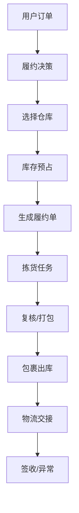
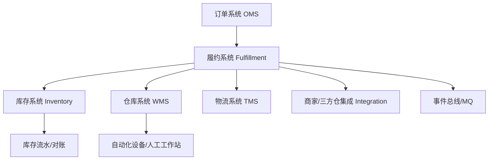
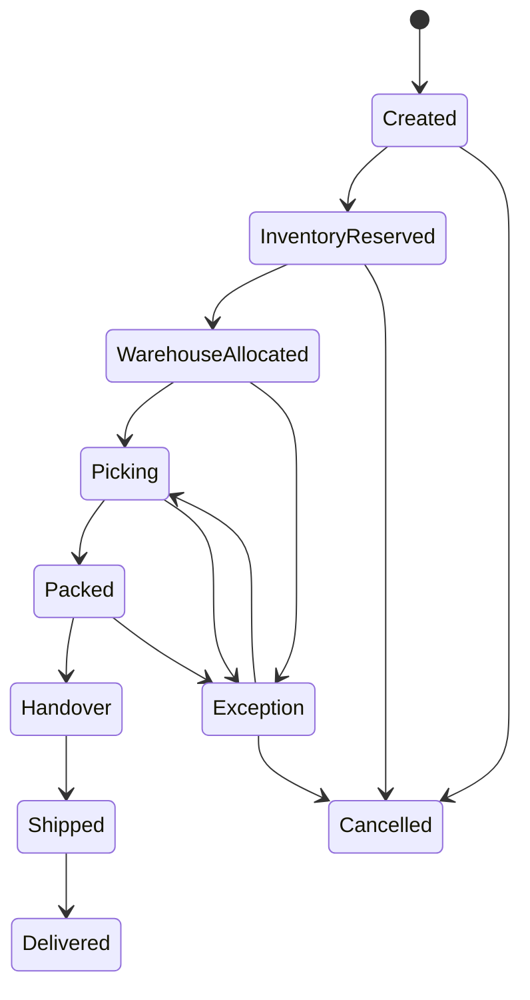
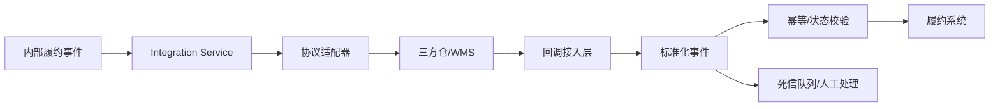

# 系统设计 - 第 37 课：Shopee SBS 供应链后端面试：业务知识与系统设计

## 学习目标（本节结束后你能做到什么）

1. 能把 JD 里的 `SBS / 供应链 / 仓配 / 履约 / 本地化 / 自动化设备` 翻译成后端系统里的核心业务域。
2. 能讲清楚电商仓配链路里的核心对象：商家、SKU、仓库、库位、库存、履约单、入库单、拣货任务、包裹、物流单。
3. 能围绕库存一致性、履约状态机、三方仓接入、自动化设备接入、跨国家本地化，组织出系统设计回答。
4. 面试时能从业务目标、核心链路、状态建模、一致性、性能稳定性、演进取舍几个层次展开，而不是只堆组件名。

## 0. 重要说明

这份文档基于截图里的岗位描述和通用电商供应链系统抽象整理，用于后端面试准备，不代表 Shopee 内部真实实现。

截图里的关键信息可以翻译成一句话：

> 这个岗位不是普通电商 CRUD 后端，而是面向 Shopee 官方仓配服务 SBS，解决商家入仓、库存管理、订单履约、跨国家本地化、流程自动化和成本效率优化的一组供应链后台系统。

所以你面试时不要只说“我会写接口、会用 Redis、会用 MQ”。更应该表现出：

- 你理解电商履约链路，不只是订单表增删改查。
- 你知道库存是强一致业务，不能随便缓存当真相源。
- 你知道供应链系统有大量异步状态推进、外部系统接入和异常补偿。
- 你能把流程、算法、架构和线上稳定性结合起来讲。

## 1. 先把 SBS 业务讲明白

`SBS` 在截图里写的是 `Serviced By Shopee`，可以理解为 Shopee 为商家提供官方仓配履约服务。商家把商品提前放到 Shopee 自营仓或合作仓，用户下单后由平台负责从仓库拣货、打包、交接物流、更新履约状态。

它和普通 marketplace 模式的差异在于：

| 模式 | 商家自己发货 | SBS 官方仓配 |
| --- | --- | --- |
| 库存位置 | 商家仓库 | Shopee 自营仓/三方合作仓 |
| 履约控制 | 商家控制发货节奏 | 平台控制仓内作业和物流交接 |
| 用户体验 | 依赖商家能力，时效不稳定 | 平台可承诺更稳定的履约 SLA |
| 系统重点 | 订单通知、商家发货回传 | 入库、库存、拣货、打包、出库、物流、对账 |
| 技术难点 | 商家接入差异 | 全链路状态机、一致性、自动化、三方系统集成 |

从业务上看，SBS 的核心目标通常是：

1. 更快：缩短从用户下单到出库、揽收、送达的时间。
2. 更稳：库存准确、履约状态准确、异常可追踪。
3. 更优质：减少错发、漏发、破损、延迟发货。
4. 更低成本：仓内作业效率更高，人工路径更短，自动化设备利用率更好。
5. 更可扩展：不同国家、不同仓库、不同三方物流商的差异能被系统承接。

面试开场可以这样表达：

> 我理解这个岗位面向的是电商供应链里的仓配履约系统。核心不是单纯订单 CRUD，而是把商家入仓、库存可售、订单分仓、仓内作业、包裹出库、物流回传和异常补偿串成一个可靠的履约网络。这个场景既要求高吞吐，也要求库存和状态不能错。

## 2. 供应链履约的主链路

SBS 可以分成两条主线：入库链路和出库履约链路。

### 2.1 入库链路：商品怎么进入仓库并变成可售库存

典型流程是：

1. 商家创建入库计划或 ASN（Advanced Shipping Notice）。
2. 商家预约到仓时间，平台确认仓库和容量。
3. 货物到仓，仓库收货。
4. 验货/QC，检查数量、破损、条码、效期、批次。
5. 上架到具体库位。
6. 系统把实物库存转换为可售库存。

可以把它理解成：


这里面后端要关心的不是“新增一条入库单”这么简单，而是每一步都有状态、数量、异常和审计：

- 少收：计划 100 件，实际到仓 97 件。
- 多收：计划 100 件，实际到仓 105 件。
- 破损：部分商品不能变成可售库存。
- 条码不匹配：商品无法识别。
- 质检冻结：暂时不能销售。
- 上架失败：库位容量不足或设备任务失败。

### 2.2 出库履约链路：用户订单怎么变成包裹

典型流程是：

1. 用户下单后，订单系统生成订单。
2. 履约系统判断是否走 SBS 仓配。
3. 选择履约仓库：考虑库存、地理位置、时效、成本、仓库产能。
4. 库存预占：确保不会被其他订单抢走。
5. 生成履约单。
6. 下发仓内作业：波次、拣货、复核、打包。
7. 生成包裹和面单。
8. 交接物流商。
9. 回传发货、揽收、运输、签收状态。

主链路可以这样画：



这里最重要的工程事实是：订单、履约、库存、仓内作业、物流不是一个数据库事务能包住的。它天然是长流程状态机，需要幂等、事件驱动、补偿和对账。

## 3. 你必须掌握的核心业务对象

### 3.1 商家与商品

- `Merchant`：商家，可能有不同国家、不同店铺、不同结算主体。
- `Shop`：店铺，一个商家可能有多个店铺。
- `SPU`：标准产品，比如 iPhone 15。
- `SKU`：库存单位，比如 iPhone 15 黑色 256G。
- `SellerSku` 与 `PlatformSku`：商家自己的 SKU 编码和平台统一 SKU 编码可能不同，需要映射。

面试容易被问：

> 为什么不能只用商品 ID 管库存？

回答要点：

- 库存真正落到 SKU 维度，因为不同规格不能混卖。
- 仓库还会关心批次、效期、序列号、库位、库存状态。
- 商家侧 SKU 和平台侧 SKU 可能需要映射，否则三方商家/三方仓对接会混乱。

### 3.2 仓库与库位

- `Warehouse`：仓库。
- `Zone`：库区，比如收货区、存储区、拣货区、异常区。
- `Aisle/Rack/Bin`：巷道、货架、库位。
- `Workstation`：打包台、复核台、自动化设备工作站。

仓储系统里，“库存在哪”非常重要。电商前台只关心某 SKU 是否可售，仓库作业系统还要知道它在几号库区、哪个货架、哪个库位，甚至是否适合自动化设备处理。

### 3.3 库存

供应链系统里的库存通常不是一个数字，而是一组状态。

| 字段/概念 | 含义 |
| --- | --- |
| `on_hand` | 实物在仓数量 |
| `available` | 可售数量 |
| `reserved` | 已被订单预占但未出库 |
| `allocated` | 已分配到具体作业任务 |
| `picked` | 已拣货 |
| `packed` | 已打包 |
| `shipped` | 已出库 |
| `frozen` | 冻结库存，如质检、风控、盘点 |
| `damaged` | 残损库存 |

一个成熟的表达是：

> 我不会把库存设计成单一 stock 字段。对履约系统来说，至少要区分实物库存、可售库存、预占库存、作业中库存和异常冻结库存。前台可售关心 available，仓内作业关心库存所在库位和状态，审计则依赖库存流水。

### 3.4 单据与任务

- `InboundOrder`：入库单。
- `ReceivingRecord`：收货记录。
- `PutawayTask`：上架任务。
- `FulfillmentOrder`：履约单，承接用户订单到仓内作业。
- `PickTask`：拣货任务。
- `PackTask`：打包任务。
- `Package`：包裹。
- `Shipment`：物流单/运单。
- `InventoryLedger`：库存流水。

单据解决“业务事实”，任务解决“谁去执行”。不要把它们混成一张表。

## 4. 领域边界怎么拆

一个合理的后端服务拆分可以这样理解：



各系统边界：

| 系统 | 职责 | 不应该做什么 |
| --- | --- | --- |
| OMS | 用户订单、支付状态、售后入口 | 不直接管理仓内库位和拣货 |
| Fulfillment | 分仓、履约单、履约状态机、协调下游 | 不保存所有库存细节 |
| Inventory | 库存余额、预占、扣减、释放、流水 | 不做复杂仓内作业编排 |
| WMS | 收货、上架、拣货、复核、打包、库位 | 不决定用户订单商业规则 |
| TMS | 物流商、面单、轨迹、揽收、签收 | 不决定库存是否可售 |
| Integration | 三方仓/商家/设备适配、协议转换 | 不成为业务真相源 |

面试里你要主动强调：

> 服务拆分不是为了微服务而微服务，而是因为订单、库存、仓内作业和物流的状态变化频率、数据模型和一致性要求不同。拆分后要通过事件、幂等和对账解决跨系统一致性。

## 5. 系统设计题一：设计 SBS 库存系统

### 5.1 先定义不变量

库存题最重要的是先讲不变量：

- 可售库存不能小于 0。
- 同一个订单不能重复预占库存。
- 订单取消或超时后，预占库存必须最终释放。
- 支付/发货成功后，预占库存必须最终转为已售/已出库。
- 所有库存变化必须有流水，能对账、能追溯。

### 5.2 数据模型

可以用两个核心表表达：

`inventory_balance` 保存当前余额：

| 字段 | 含义 |
| --- | --- |
| `warehouse_id` | 仓库 |
| `sku_id` | SKU |
| `on_hand` | 实物数量 |
| `available` | 可售数量 |
| `reserved` | 预占数量 |
| `frozen` | 冻结数量 |
| `version` | 乐观锁版本 |

`inventory_ledger` 保存流水：

| 字段 | 含义 |
| --- | --- |
| `ledger_id` | 流水 ID |
| `biz_type` | 入库、预占、释放、扣减、盘点 |
| `biz_id` | 订单号/入库单号/盘点单号 |
| `warehouse_id` | 仓库 |
| `sku_id` | SKU |
| `delta_available` | 可售变化 |
| `delta_reserved` | 预占变化 |
| `idempotency_key` | 幂等键 |
| `created_at` | 发生时间 |

余额表用于快速查询，流水表用于审计和重放。面试时要说：

> 余额是当前视图，流水是真相证据。库存系统必须能解释每一次库存为什么变化。

### 5.3 预占库存怎么防超卖

核心做法是条件更新：

```sql
update inventory_balance
set available = available - :qty,
    reserved = reserved + :qty,
    version = version + 1
where warehouse_id = :warehouse_id
  and sku_id = :sku_id
  and available >= :qty;
```

如果影响行数是 1，表示预占成功；如果是 0，表示库存不足或并发冲突。

但只更新余额还不够，还要在同一个本地事务里写入库存流水和订单预占记录：

1. 校验 `idempotency_key`，防止重复预占。
2. 条件更新库存余额。
3. 写入 `inventory_ledger`。
4. 写入 `reservation` 记录，记录订单占用了哪些 SKU 和数量。
5. 通过 Outbox 发出库存已预占事件。

### 5.4 为什么不用 Redis 当库存真相源

Redis 可以用于热点 SKU 的快速预检、限流、缓存可售数量，但不适合作为最终库存真相源。原因：

- Redis 数据丢失或主从切换会影响正确性。
- 库存需要完整审计和对账。
- 库存变化来自订单、入库、盘点、冻结、退货，不只是秒杀扣减。
- 复杂仓配系统需要库位、批次、冻结、残损等状态，不能靠一个计数器表达。

稳妥回答：

> 我可以用 Redis 做前置削峰和读缓存，但库存最终真相会放在事务型存储里，并且每次变化写流水。缓存错了最多影响展示或提前失败，不能导致真实库存错账。

## 6. 系统设计题二：设计履约状态机

履约系统的关键不是接口数量，而是状态机。

一个简化的履约状态可以是：



设计状态机时要注意：

- 每个状态谁有权限推进：订单系统、库存系统、WMS、TMS、人工运营。
- 哪些状态可以取消：已打包未交接、已交接未揽收、已发货之后规则不同。
- 每个状态变化都要有事件和审计。
- 外部回调可能重复、乱序、延迟，不能直接盲目覆盖当前状态。

比如 WMS 回调 `PICKED` 到达时，系统要判断当前履约单是否处于允许进入 `Picking/Picked` 的状态。如果当前已经 `Cancelled`，不能因为迟到回调把状态改回已拣货。

面试表达：

> 我会把履约单设计成显式状态机，每个外部事件先做幂等校验，再做状态迁移校验。状态只能按允许的边推进，不能被乱序消息随意覆盖。异常状态要保留原因码，方便运营介入和后续对账。

## 7. 系统设计题三：设计三方仓/商家接入

截图里提到“自营/三方商家入仓”和“不同国家的本地化供应链诉求”，这类岗位非常可能关注集成能力。

三方仓接入的核心挑战：

- 协议不同：HTTP API、SFTP、消息队列、Webhook、文件批量同步。
- 字段不同：SKU 编码、仓库编码、物流商编码、状态码不统一。
- 时效不同：有的实时回调，有的 T+1 文件同步。
- 质量不同：重复回调、乱序回调、缺字段、超时、接口限流很常见。
- 国家不同：地址格式、电话格式、语言、时区、节假日、物流商规则不同。

一个可靠的 Integration 架构：



关键设计：

1. 内部领域模型统一，外部差异通过 Adapter 处理。
2. 所有外部请求有 `request_id` 和 `idempotency_key`。
3. 回调先落库，再异步处理，避免回调接口失败导致外部无限重试。
4. 对重复、乱序、缺失事件做状态机校验。
5. 定时对账：用三方仓库存快照、订单状态快照和内部数据比对。
6. 每个国家/仓库的差异用配置、规则和适配层承接，避免写满 if else。

面试可以这样说：

> 三方接入我会避免让外部协议污染内部核心模型。内部先定义标准履约事件和标准库存事件，外部仓库通过 Adapter 做字段映射、状态码映射和协议转换。所有回调先落库，之后做幂等、状态机校验和异步推进。对于外部系统不可靠的问题，靠重试、死信、对账和人工补偿兜底。

## 8. 系统设计题四：设计仓内作业与自动化设备接入

JD 提到“引入自动化设备”，这说明业务不只是后台订单系统，还会碰到仓内作业效率。

### 8.1 仓内作业为什么复杂

用户订单是一行“买了几个商品”，仓库看到的是一组具体任务：

- 去哪个库位拿货。
- 一次拣一个订单，还是多个订单合成一个波次。
- 拣完送到哪个复核台。
- 哪些商品可以自动化设备处理，哪些必须人工处理。
- 如果设备失败，任务如何转人工。

核心对象：

- `Wave`：波次，把多个订单合并成一批作业。
- `PickTask`：拣货任务。
- `WorkstationTask`：工作站任务。
- `DeviceTask`：自动化设备任务。
- `TaskAssignment`：任务分配给人、设备或工作站。

### 8.2 波次和拣货的设计思路

波次生成不是随便 batch，而是要平衡：

- SLA：快超时的订单优先。
- 路径：库位相近的订单合并，减少行走距离。
- 商品属性：大件、小件、易碎、冷链、危险品可能不同作业流程。
- 仓库产能：某个工作站或设备是否拥堵。
- 物流截单时间：某个物流商的交接时间快到了，要优先处理。

面试不一定要讲复杂算法，但可以讲出框架：

> 我会先把波次生成建成可配置规则加评分模型。基础版本按 SLA、仓库区域、物流截单时间分组；后续再根据库位距离、工作站负载和历史作业时长优化。这样比一开始就上复杂算法更可落地。

### 8.3 自动化设备接入

设备接入要关注：

- 设备状态：在线、离线、忙碌、故障、维护。
- 任务生命周期：创建、下发、接收、执行中、完成、失败、取消。
- 超时处理：设备无响应时如何重试或转人工。
- 幂等：重复下发任务不能重复执行。
- 可观测：能看到设备处理耗时、失败率、积压任务。

设计上可以把设备当成一种特殊下游系统：

- 内部任务服务维护任务真相。
- 设备网关负责协议适配。
- 任务下发走异步队列。
- 设备回调先落库，再推进任务状态。
- 超时扫描器处理卡住的任务。

## 9. 跨国家本地化要怎么讲

Shopee 是东南亚和拉美等多市场业务，截图也提到“不同国家的本地化供应链诉求”。这类系统设计里，本地化不是翻译文案，而是业务规则差异。

常见差异：

- 地址格式：国家、省、市、区、邮编规则不同。
- 时区和节假日：履约 SLA 要按当地时间计算。
- 物流商：每个国家可用物流商和截单时间不同。
- 商品限制：禁运品、类目限制、税务/海关要求不同。
- 仓网结构：有的国家中心仓为主，有的国家多区域仓。
- 支付/售后规则：COD、退货地址、逆向物流规则不同。

架构原则：

1. 核心模型保持稳定，比如订单、履约单、库存、包裹。
2. 国家差异放到配置中心、规则引擎、策略接口。
3. 不同国家的三方集成通过 Adapter 隔离。
4. 时间都用 UTC 存储，展示和 SLA 计算按业务时区转换。
5. 状态码内部统一，外部映射独立维护。

一句面试口径：

> 我会把跨国家差异看成策略和配置问题，而不是在核心流程里写大量国家判断。核心履约状态机保持统一，国家差异主要体现在仓库选择、物流服务、SLA 计算、地址校验、税务/禁运规则和外部系统适配。

## 10. 一致性、幂等、补偿：这个岗位的高频追问

### 10.1 为什么供应链系统大量使用事件驱动

履约链路很长，很多动作不能同步等待：

- 仓库拣货可能需要几分钟到几小时。
- 物流轨迹来自外部回调。
- 三方仓接口可能不稳定。
- 自动化设备可能异步完成任务。

所以系统常见形态是：

- 同步接口只完成关键状态落库。
- 通过 Outbox/MQ 发布领域事件。
- 下游消费者幂等处理。
- 失败进入重试、死信或人工队列。
- 定时对账兜底最终一致。

### 10.2 Outbox 为什么重要

典型问题：

> 履约单状态已经更新成功，但发送 MQ 失败怎么办？

回答：

- 在同一个本地事务里更新业务表和写 Outbox 表。
- 后台任务或 CDC 把 Outbox 事件可靠投递到 MQ。
- 消费端用事件 ID 做幂等。
- 即使投递重复，也不能重复推进业务。

### 10.3 回调重复和乱序怎么处理

处理顺序：

1. 回调事件先落库，保留原始报文。
2. 用外部事件 ID 或业务组合键做幂等。
3. 标准化成内部事件。
4. 检查当前状态是否允许迁移。
5. 如果是迟到事件，记录但不覆盖更高级状态。
6. 如果是缺失前置状态，可进入待补偿队列或触发状态拉取。

### 10.4 怎么做对账

供应链对账至少包括：

- 库存对账：内部库存余额 vs WMS 库存快照。
- 订单履约对账：内部履约状态 vs 仓库作业状态。
- 物流对账：内部包裹状态 vs 物流商轨迹。
- 财务/费用对账：仓储费、操作费、物流费是否一致。

对账不是失败才补，而是系统设计的一部分。面试里能讲对账，会显得你理解真实系统。

## 11. 线上问题排查怎么讲

JD 里写了“快速响应，处理解决线上问题”。供应链系统常见线上问题：

- 订单卡在某个履约状态。
- 库存可售为负或前台显示有货但下单失败。
- 三方仓回调延迟导致状态不更新。
- MQ 积压导致出库状态延迟。
- 某个仓库作业任务大量失败。
- 某个物流商面单生成失败。

排查框架：

1. 先确认影响范围：单订单、单 SKU、单仓、单国家、单物流商，还是全局。
2. 看主状态：订单状态、履约单状态、库存预占状态、仓内任务状态、包裹状态。
3. 查事件链路：Outbox、MQ、消费日志、回调原始报文。
4. 查下游依赖：WMS/TMS/三方仓接口成功率、延迟、错误码。
5. 查积压：队列 lag、重试队列、死信队列、任务扫描器。
6. 先止血：暂停某个仓库/物流商、切换人工处理、限流、补偿重放。
7. 再修复：补事件、重放任务、修库存流水、补对账差异。

面试表达：

> 我排查这类问题会先按业务维度缩小范围，再按状态机和事件链路定位断点。供应链问题不能只看接口日志，因为很多状态是异步推进的，所以我会同时看业务单据、MQ、外部回调、死信和对账结果。

## 12. 可观测性指标

业务指标：

- 入库及时率。
- 收货差异率。
- 库存准确率。
- 订单履约成功率。
- 从下单到出库的耗时。
- 拣货/打包/交接各阶段耗时。
- 取消率、异常率、超时率。

技术指标：

- API P95/P99 延迟。
- MQ lag。
- 消费失败率。
- 外部依赖成功率和错误码分布。
- 回调延迟。
- 死信数量。
- 定时任务扫描积压。
- 数据库慢 SQL、锁等待、热点 SKU 更新冲突。

关键思想：

> 供应链系统的监控不能只有 CPU、内存、接口耗时，还必须有业务状态监控。比如“卡在待拣货超过 30 分钟的履约单数量”比单纯 QPS 更能说明系统是否健康。

## 13. 面试系统设计回答模板

如果面试官问：“设计一个 SBS 仓配履约系统”，可以按这个顺序答：

### 第一步：澄清需求

- 是只设计库存，还是完整履约？
- 是否包括入库、出库、退货？
- 是自营仓，还是三方仓也要接入？
- 是否多国家、多仓库？
- 峰值订单量、SKU 数、仓库数大概多少？
- 对库存准确性、出库时效、系统可用性的要求是什么？

### 第二步：定义核心目标

- 库存不能超卖。
- 履约状态可追踪。
- 外部系统不稳定时能重试和补偿。
- 多仓、多国家可扩展。
- 仓内作业效率可优化。

### 第三步：画主链路

订单进入履约系统，履约系统做分仓和库存预占，生成履约单，下发 WMS，WMS 推进拣货打包，TMS 生成面单和物流轨迹，最终回传订单状态。

### 第四步：讲服务拆分

- Fulfillment：履约编排和状态机。
- Inventory：库存余额、预占、扣减、释放和流水。
- WMS：仓内作业。
- TMS：物流面单和轨迹。
- Integration：三方仓、物流商、自动化设备适配。
- Event Platform：领域事件、Outbox、重试和死信。

### 第五步：讲关键一致性

- 库存预占用条件更新 + 本地事务 + 流水。
- 跨系统用事件驱动和最终一致。
- 外部回调用幂等和状态机校验。
- 异常靠补偿、重试、死信、对账。

### 第六步：讲性能和稳定性

- 热点 SKU 做缓存预检、限流和队列削峰。
- 读模型可以为运营查询、订单追踪单独构建。
- MQ 按仓库、SKU 或履约单分区，减少乱序影响。
- 关键依赖有熔断、降级和人工兜底。
- 业务监控覆盖卡单、库存差异、回调延迟、队列积压。

### 第七步：讲演进

- 初期可以单仓/单国家，核心服务少一些，先保证库存和履约状态正确。
- 多仓后引入分仓策略和仓库产能模型。
- 三方仓增加后引入 Integration Adapter 和标准事件模型。
- 订单量增长后做分库分表、读写分离、事件回放和更完善的对账平台。
- 仓内效率瓶颈出现后，再引入波次优化、路径优化和自动化设备调度。

## 14. 高频面试问答

### Q1：OMS、WMS、TMS 分别是什么？

OMS 负责订单，WMS 负责仓内作业，TMS 负责物流运输。履约系统在中间做编排，把用户订单转换成仓库能执行的任务，并把仓库和物流状态回传给订单系统。

### Q2：库存服务如何防止超卖？

先定义库存不变量。核心扣减或预占使用数据库条件更新，保证 `available >= qty` 才能成功；同一事务写库存流水和预占记录；请求用幂等键防重复；缓存只能做加速，不能做库存真相；异常通过释放、补偿和对账兜底。

### Q3：为什么要库存流水？

余额只告诉你现在有多少，流水告诉你为什么变成这样。供应链系统里库存变化来源很多：入库、出库、取消、退货、盘点、冻结、残损。如果没有流水，就无法审计、对账和修复。

### Q4：WMS 回调重复或乱序怎么办？

回调先落库，用外部事件 ID 或组合键做幂等；再转换成内部标准事件；推进状态前检查当前状态是否允许迁移。迟到事件只记录不覆盖，缺失事件进入补偿或主动拉取状态。

### Q5：如果某个物流商接口挂了怎么办？

先判断是否影响主链路。如果是面单生成失败，可以把订单放入待重试队列，并对该物流商熔断，必要时切换备选物流商或人工处理。所有失败保留错误码和原始请求，方便重放和对账。

### Q6：多国家本地化怎么设计？

核心履约模型统一，国家差异通过配置、规则和 Adapter 承接。比如地址校验、SLA 计算、物流商选择、禁运规则、税务字段、状态映射都不应该写死在主流程里。

### Q7：如何衡量仓配系统优化是否有效？

看业务指标而不是只看接口性能：下单到出库耗时、准时出库率、库存准确率、订单异常率、拣货效率、人均处理件数、设备利用率、物流交接成功率、卡单数量。

## 15. 你可以准备的项目迁移表达

如果你过去项目不是供应链，也可以把经验迁移过来：

- 做过订单/支付/考试/题库系统：强调状态机、幂等、异步任务、对账。
- 做过 RAG/知识库/后台任务：强调任务编排、失败重试、可观测性。
- 做过 AWS 商户入驻：强调长流程、外部依赖、Step Functions/状态机思维。
- 做过高并发接口：强调限流、缓存、队列削峰、热点隔离。

一个可用表述：

> 我之前虽然不是直接做仓配，但做过类似的长流程后台系统。比如一个业务单据会经历多个状态，依赖外部服务，并且需要失败重试、幂等和补偿。我理解供应链履约也是类似思路，只是业务对象换成了库存、履约单、仓内任务和物流状态。面试这个岗位时，我会重点把状态机、一致性、异步事件和对账能力讲清楚。

## 16. 最容易踩的坑

1. 一上来只讲 Redis、Kafka、MySQL，不先讲业务链路。
2. 把库存当成一个简单数字，没有区分可售、预占、冻结、实物库存。
3. 把订单状态和履约状态混在一起。
4. 忽略三方仓、物流商、自动化设备这些外部系统的不可靠性。
5. 只讲正常流程，不讲重复、乱序、超时、失败和补偿。
6. 不讲对账。真实供应链系统一定需要对账。
7. 多国家本地化只想到语言，没有想到地址、时区、物流、规则和合规差异。

## 小结（3-5 条关键点）

1. SBS 仓配后端的核心是“商家入仓 + 库存准确 + 订单履约 + 仓内作业 + 物流交接”的长链路系统。
2. 库存系统必须用状态和流水建模，不能只靠一个 `stock` 字段，更不能让缓存成为最终真相。
3. 履约系统本质是状态机和事件驱动系统，要处理重复、乱序、超时、失败、补偿和对账。
4. 三方仓、物流商、自动化设备都应该通过适配层接入，内部保持标准领域模型。
5. 面试表达要先讲业务目标和不变量，再讲服务拆分、数据模型、一致性、稳定性和演进取舍。

## 检查站：请回答以下问题

1. 如果让你设计 SBS 库存系统，你会如何解释 `on_hand / available / reserved / frozen` 的区别？
2. 为什么履约单状态不能被 WMS 回调直接覆盖？你会怎么防止重复和乱序？
3. 如果用户订单已经预占库存，但 WMS 下发失败，你会如何补偿？
4. 三方仓接入时，为什么要有 Adapter 层和标准内部事件模型？
5. 多国家供应链系统里，哪些差异应该配置化，哪些差异不应该污染核心状态机？
