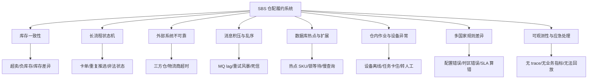
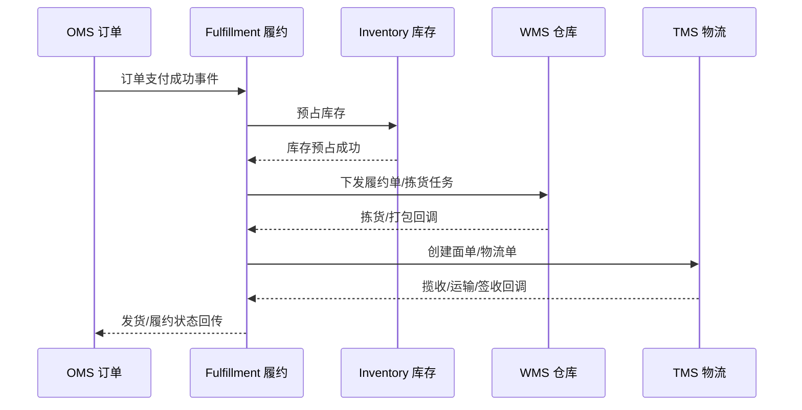
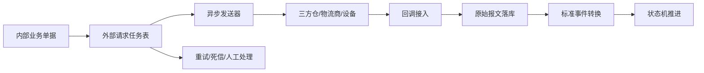
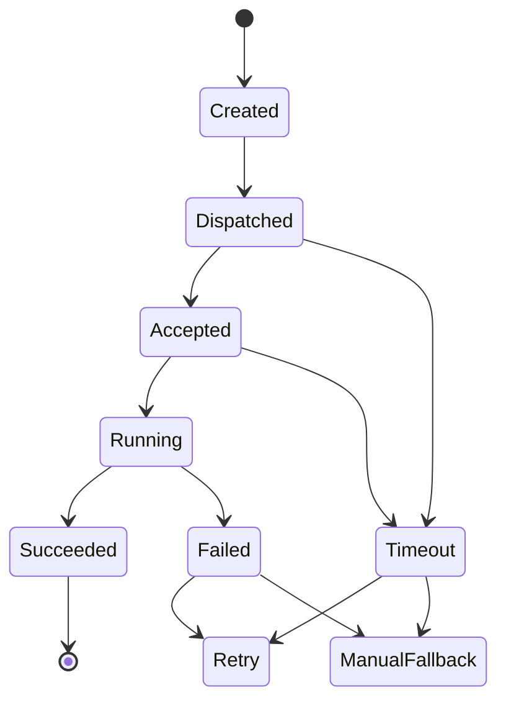

# 系统设计 - 第 38 课：Shopee SBS 供应链后端面试：技术挑战、生产问题与处理方案

## 学习目标（本节结束后你能做到什么）

1. 能在第 37 课的业务模型基础上，说清 SBS 仓配履约系统真正难在哪里。
2. 能把生产问题分成库存、履约状态、外部依赖、消息积压、数据库热点、仓内设备、多国家配置几类来分析。
3. 能按“现象 -> 根因 -> 止血 -> 修复 -> 长期治理”的方式回答线上故障处理。
4. 能在面试里体现生产意识：监控、告警、灰度、降级、对账、补偿、回放、人工兜底。

## 0. 这一节和第 37 节的关系

第 37 节解决的是“这个业务是什么、系统应该怎么拆、主链路怎么设计”。  
第 38 节解决的是另一个更贴近生产的问题：

> 这套系统上线后，哪里最容易出事故？出了事故怎么定位、怎么止血、怎么补偿、怎么避免再发生？

面试官问这类问题时，通常不是想听你背组件，而是想判断你有没有真实后端生产经验。尤其是供应链系统，它和普通内容类系统不一样：状态错了会导致库存不准、包裹卡住、仓库作业混乱、商家投诉、用户收不到货，甚至影响成本和履约 SLA。

所以你回答时要有一个基本姿态：

> 我不会只看接口是否返回 200，而会看业务单据有没有推进、库存是否平、消息是否积压、外部回调是否延迟、异常单是否可补偿。

## 1. SBS 仓配系统的技术挑战总览

如果把 SBS 仓配系统抽象成一张技术风险地图，大概是这样：

你可以把这些挑战归成三类：

1. 正确性挑战：库存不能错，状态不能乱，单据不能丢。
2. 稳定性挑战：外部系统会慢、会挂、会重复、会乱序。
3. 扩展性挑战：多仓、多国家、多三方系统、多设备、多峰值流量。

面试里的高级感，不是说“用 Kafka、Redis、MySQL”，而是能说：

> 哪些链路必须强保护，哪些链路允许最终一致；哪些状态可以自动补偿，哪些必须人工介入；哪些问题靠同步接口解决不了，必须靠对账和回放兜底。

## 2. 挑战一：库存一致性不是一个 stock 字段能解决

### 2.1 生产中会遇到什么问题

库存相关问题通常最敏感，常见现象有：

- 前台显示有货，但用户下单时失败。
- 前台显示无货，但仓库实际有货。
- `available` 变成负数。
- 同一个订单重复预占库存。
- 订单取消后库存没有释放。
- WMS 实物库存和平台库存余额对不上。
- 盘点后库存差异很大，但系统解释不清差异来源。

这些问题会直接影响 GMV、用户体验和商家信任。

### 2.2 常见根因

库存错账通常不是单点 bug，而是多个边界没守住：

- 预占库存没有幂等，订单重试导致重复扣。
- 余额更新和流水写入不在同一个事务里。
- 取消订单、支付超时、仓库缺货等反向链路漏了库存释放。
- MQ 消费失败后没有重试或死信处理。
- WMS 回调延迟，平台库存长时间没有同步。
- 人工改库存没有写流水，导致余额和流水对不上。
- 缓存可售库存和数据库真相源不一致。

### 2.3 如何止血

如果生产发现库存异常，第一步不是马上写脚本乱修，而是先止血：

1. 按影响范围定位：单 SKU、单仓、单商家、单国家，还是全局。
2. 对异常 SKU 暂停售卖或降低可售库存，避免继续扩大影响。
3. 冻结相关库存调整任务，防止补偿任务和人工修复互相打架。
4. 查库存流水、订单预占记录、WMS 库存快照，确认差异来源。
5. 对明确漏释放的订单做补偿释放；对不确定的库存进入人工审核。

止血时要记住一个原则：

> 供应链库存宁可临时少卖，也不要继续错卖。

### 2.4 长期治理

库存系统要补齐几类机制：

- 余额更新和库存流水必须同事务。
- 预占、释放、扣减都要有幂等键。
- 库存变化只能通过库存服务入口发生，禁止绕过服务直接改表。
- 缓存只做展示或预检，不能成为库存真相源。
- 定期做库存对账：平台库存余额 vs WMS 库存快照 vs 库存流水重算结果。
- 所有人工调整必须走调整单和审批，并写库存流水。
- 对热点 SKU 做单独隔离，例如逻辑分片、队列串行化、热点限流。

### 2.5 面试口径

你可以这样回答：

> 库存问题我会优先保护正确性。生产中如果出现可售为负或 WMS 与平台库存不一致，我会先按仓库和 SKU 缩小影响范围，必要时冻结该 SKU 的可售，防止继续超卖。然后通过库存流水、预占记录和 WMS 快照定位差异来源。长期上，我会保证余额和流水同事务、所有库存操作幂等、缓存不作为真相源，并建立库存日常对账和差异修复流程。

## 3. 挑战二：履约长流程容易卡单和状态错乱

### 3.1 生产中会遇到什么问题

履约系统最常见的问题叫“卡单”。比如：

- 订单已经支付，但没有生成履约单。
- 履约单已经生成，但没有成功预占库存。
- 预占库存成功，但没有下发 WMS。
- WMS 已拣货，但平台状态还停在待拣货。
- 包裹已出库，但 OMS 没有收到发货状态。
- 用户取消订单，但仓库已经打包甚至交接物流。

这类问题很麻烦，因为它们跨越 OMS、Fulfillment、Inventory、WMS、TMS 多个系统。单看一个服务日志，很容易看不出全貌。

### 3.2 常见根因

- 状态机没有严格校验，迟到事件覆盖了新状态。
- 某个中间事件发送失败，比如履约单已创建但 Outbox 没投递。
- 消费者处理失败进入死信，但没有告警。
- 外部回调成功了，但内部处理失败。
- 订单取消和仓库作业并发，缺少状态冲突处理。
- 状态拆分不清，订单状态、履约状态、包裹状态互相覆盖。

### 3.3 处理卡单的标准路径

排查卡单可以按一条“业务链路时间线”看：

排查顺序：

1. 查订单状态：订单是否支付成功，是否取消或退款。
2. 查履约单：是否创建，当前状态是什么，最后更新时间是什么。
3. 查库存预占：是否有 reservation，是否释放过。
4. 查 Outbox/MQ：关键事件是否发出，是否被消费，是否进入死信。
5. 查 WMS 原始回调：外部是否已经处理，平台是否收到。
6. 查状态迁移日志：是否因为非法状态迁移被拒绝。
7. 根据当前事实选择补偿：补发事件、重放回调、重新下发任务、取消并释放库存、转人工。

### 3.4 长期治理

- 所有状态迁移必须记录 `from_state / event / to_state / reason`。
- 外部回调先落库，异步推进内部状态。
- Outbox 事件可重放，消费者幂等。
- 建立“卡单扫描器”：比如停留在某状态超过阈值自动告警。
- 对取消、缺货、拣货失败、物流失败等异常状态设计明确出口。
- 给运营后台提供安全的补偿入口，避免直接改数据库。

### 3.5 面试口径

> 履约链路是典型长流程，生产中最怕卡单和非法状态推进。我会把履约单、库存预占、仓内任务、包裹物流拆成不同状态，但用统一 trace 串起来。排查时沿着订单到履约、库存、WMS、TMS 的时间线找断点。治理上通过状态机校验、Outbox 可重放、回调落库、卡单扫描和运营补偿后台来保证最终收敛。

## 4. 挑战三：三方仓、物流商和设备都不可靠

### 4.1 生产中会遇到什么问题

外部依赖问题非常常见：

- 三方仓接口超时，但实际已经创建任务。
- 物流商面单接口失败，导致包裹不能出库。
- WMS 回调重复发送几十次。
- 三方仓状态码变更，内部映射失败。
- 某个国家的物流商临时限流。
- 自动化设备离线，任务一直卡在执行中。
- 外部系统返回成功，但字段缺失或格式变了。

### 4.2 为什么不能直接同步依赖外部系统

如果主链路强依赖外部同步接口，会出现几个问题：

- 外部系统慢会拖垮内部接口。
- 超时结果不确定，不能简单认为失败。
- 重试可能导致外部重复创建任务。
- 不同国家和供应商接口质量差异很大。
- 很难统一监控和补偿。

更稳的方式是：

### 4.3 处理策略

对外部依赖，要把“不可靠”当成默认条件：

- 请求外部系统时生成内部 `request_id`，支持幂等重试。
- 同步调用只确认“请求已提交”，最终结果以回调、查单或对账为准。
- 超时进入 `UNKNOWN` 或 `PENDING`，不能直接判失败。
- 对不同外部系统设置独立超时、重试、熔断和限流。
- 回调先落原始报文，再异步标准化。
- 外部状态码通过 Adapter 映射到内部标准状态。
- 对关键外部系统建立主动查单和对账任务。

### 4.4 面试口径

> 三方仓和物流商不能当成本地函数调用。我的设计会把外部交互任务化，内部先落请求任务，再异步发送；回调先落库，再推进状态。超时不直接当失败，而是进入未知态，通过重试、查单和对账收敛。不同供应商通过 Adapter 做协议和状态映射，避免污染内部核心状态机。

## 5. 挑战四：消息积压、重复消费和重试风暴

### 5.1 生产中会遇到什么问题

事件驱动是履约系统的常态，但 MQ 本身也会带来生产问题：

- 某个 consumer 版本发布后消费失败，MQ lag 快速增长。
- 下游 WMS 慢，发送任务队列积压。
- 重试没有退避，瞬间打爆外部系统。
- poison message 一直失败，占住分区。
- 单个热点仓库或热点 SKU 让某个分区堆积严重。
- 消息重复消费，导致状态重复推进或库存重复释放。

### 5.2 处理积压的第一原则

不要一看到 lag 就盲目扩容 consumer。先判断：

- 是消费能力不足，还是下游依赖变慢？
- 是全局积压，还是某个 topic/partition/key 积压？
- 是所有消息都慢，还是某类 poison message 卡住？
- 消费是否幂等，能不能安全并行扩容？
- 消息是否要求同一个履约单内有序？

如果下游已经故障，盲目扩容 consumer 只会把失败放大。

### 5.3 止血方案

- 暂停非核心消费，比如报表、搜索索引、通知。
- 对失败消息进入延迟重试，不要立即无限重试。
- poison message 进入死信队列，避免阻塞正常消息。
- 对特定仓库/物流商熔断，积压请求转入待处理任务。
- 如果幂等保证充分，可以临时扩容消费者。
- 对热点 key 做拆分或旁路处理，但要注意同单据顺序。

### 5.4 长期治理

- 消费端必须幂等。
- 重试要有退避和最大次数。
- 死信队列必须有告警和处理台。
- 按业务维度设计分区键，比如 `warehouse_id`、`fulfillment_id`，并理解顺序边界。
- 监控不仅看 lag，还要看最老消息年龄、失败率、重试率、死信率。
- 重要事件支持回放，回放也要有速率控制。

### 5.5 面试口径

> MQ 积压我不会只看 lag 后直接扩容，而会先判断瓶颈在 consumer 还是下游依赖。如果是下游故障，先熔断和延迟重试；如果是 poison message，先进死信；如果是消费能力不足且幂等安全，再扩容。长期上要有幂等消费、退避重试、死信处理、分区键设计和事件回放能力。

## 6. 挑战五：数据库热点、锁等待和分库分表

### 6.1 生产中会遇到什么问题

供应链系统里数据库问题经常集中在几类表：

- 库存余额表：热点 SKU 高频预占和释放。
- 履约单表：大量状态更新和查询。
- 任务表：WMS 任务、设备任务频繁扫描。
- Outbox 表：高频写入和投递扫描。
- 回调原始报文表：写入量大、保留时间长。

常见现象：

- 库存更新出现锁等待。
- 单个 SKU 抢购导致数据库 CPU 飙升。
- 任务扫描 SQL 慢，影响在线写入。
- 大表索引不合理，按状态查 pending 任务越来越慢。
- Outbox 表堆积，投递延迟增加。

### 6.2 热点库存怎么处理

库存正确性优先，不能为了快就放弃一致性。可以分层处理：

1. 前置限流：热点商品限制下单入口流量。
2. 缓存预检：明显无货的请求提前失败，但不作为最终判断。
3. 条件更新：数据库仍是最终扣减点。
4. 排队串行：对极热点 SKU 按 SKU 维度串行化库存预占。
5. 分桶库存：把一个 SKU 的可售拆成多个 bucket，降低单行热点，但要处理汇总和分配复杂度。
6. 活动库存隔离：大促库存和常规库存分开链路，避免拖垮日常履约。

分桶库存不是银弹。它降低单行写热点，但带来 bucket 分配、库存碎片、回补和对账复杂度。面试里要能讲这个 trade-off。

### 6.3 任务表怎么避免越跑越慢

任务表常见问题是“扫描 pending 任务”越来越慢。治理方式：

- 按状态和下一次执行时间建联合索引。
- 只扫描小批量，拿到任务后用租约/状态 CAS 抢占。
- 任务完成后归档到历史表。
- 按仓库或任务类型分表，降低单表压力。
- 避免每次全表扫描 `where status = pending`。
- 对执行失败任务设置 `next_retry_at`，避免每次都被扫描出来。

### 6.4 Outbox 表怎么治理

Outbox 是可靠事件的关键，但也容易变成大表：

- 业务事务内只插入 Outbox，不同步发 MQ。
- 投递器按 `status + next_retry_at` 扫描小批量。
- 成功投递后标记状态，定期归档。
- 投递失败增加重试次数和下次重试时间。
- 对积压和最老未投递事件告警。

### 6.5 面试口径

> 数据库热点我会先按业务对象定位，比如库存余额、任务表、Outbox 表。库存热点不能简单用缓存解决，因为最终要保护不超卖。我会用前置限流、缓存预检、条件更新和必要时 SKU 维度串行化或分桶库存。任务和 Outbox 这类表则重点靠索引、租约、小批量扫描、归档和积压监控治理。

## 7. 挑战六：仓内作业和自动化设备会把软件问题变成现场问题

### 7.1 生产中会遇到什么问题

仓内系统不只是线上接口，往往会影响仓库现场：

- 拣货任务重复下发，工作人员重复拣货。
- 设备任务下发成功但设备无响应。
- 自动化设备执行失败，任务没有转人工。
- 波次生成过大，某个工作站拥堵。
- 面单打印失败，包裹无法出库。
- 扫码复核发现商品不匹配，履约单进入异常。
- 某个库区网络不稳定，手持设备同步延迟。

这类问题的特点是：影响的不只是系统状态，还有人和设备的真实动作。

### 7.2 设备任务怎么设计

设备任务必须有完整生命周期：

关键字段：

- `task_id`：内部任务 ID。
- `device_id`：设备 ID。
- `idempotency_key`：防止重复执行。
- `status`：任务状态。
- `attempt`：尝试次数。
- `lease_until`：任务租约。
- `timeout_at`：超时时间。
- `fallback_reason`：转人工原因。

### 7.3 现场问题处理

如果设备离线或任务卡住：

1. 先判断是否是单设备、单库区、单工作站，还是设备网关全局问题。
2. 停止继续向异常设备派发新任务。
3. 对已派发但未确认的任务标记为未知态，不直接判成功。
4. 对超过阈值的任务转人工或重派到其他设备。
5. 保留设备回执和内部任务状态，防止设备恢复后迟到回调覆盖人工结果。
6. 复盘设备心跳、网关日志、任务超时配置和现场操作记录。

### 7.4 面试口径

> 自动化设备接入时，我会把设备看成不可靠异步执行器，而不是同步接口。内部任务服务维护任务真相，设备网关只负责协议适配。任务要有租约、心跳、超时、重试和转人工机制。设备恢复后的迟到回调也必须经过状态机校验，不能覆盖已经人工完成的结果。

## 8. 挑战七：多国家本地化问题常常不是文案，而是规则事故

### 8.1 生产中会遇到什么问题

多国家供应链里，配置错误非常容易造成生产事故：

- 时区配置错，导致 SLA 提前或延后超时。
- 节假日配置漏了，导致承诺发货时间不准确。
- 地址校验规则错，导致某些地区无法下单或无法生成面单。
- 物流商截单时间配置错，导致大量包裹错过交接。
- 禁运规则没有生效，导致无法发货。
- 国家 A 的状态码映射被错误复用到国家 B。
- 灰度发布只测了一个国家，另一个国家规则被影响。

### 8.2 规则和配置如何治理

多国家不是到处写 `if country == ...`。更合理的是：

- 规则配置有版本号。
- 配置变更要审批和灰度。
- 配置有生效时间和回滚版本。
- 关键规则有 dry-run，用历史订单回放验证影响。
- 配置中心按国家、仓库、物流商、品类维度隔离。
- 核心状态机保持统一，差异放在策略层。
- 所有 SLA 计算保留输入参数和规则版本，方便追溯。

### 8.3 面试口径

> 多国家供应链的风险不只是语言，而是地址、时区、节假日、物流商、禁运和 SLA 规则差异。我会把这些差异放到版本化配置和策略层，发布前用历史数据 dry-run，发布时按国家或仓库灰度，出问题可以快速回滚。核心履约状态机尽量保持统一，避免被国家规则污染。

## 9. 挑战八：可观测性要围绕业务状态，而不只是机器指标

### 9.1 为什么普通监控不够

CPU、内存、QPS、接口 P99 当然重要，但供应链系统更需要业务监控。因为可能出现这种情况：

- 接口都正常，但履约单大量卡在待下发。
- MQ 没报警，但最老消息已经延迟 2 小时。
- 数据库没挂，但某个仓库库存对账差异扩大。
- WMS 回调接口 200，但内部状态迁移失败。
- 面单接口成功率 98%，但失败集中在一个大仓，现场已经堵住。

所以监控要按业务链路设计。

### 9.2 必须有的业务指标

履约指标：

- 支付成功到履约单创建耗时。
- 履约单各状态停留时间。
- 卡在每个状态超过阈值的单量。
- 下单到出库 P50/P95/P99。
- 出库准时率。

库存指标：

- 库存预占成功率。
- 库存释放延迟。
- 可售为负数量。
- WMS 库存差异数量。
- 库存对账差异金额或件数。

外部依赖指标：

- 三方仓接口成功率和延迟。
- 物流商面单成功率。
- 回调延迟和重复率。
- 主动查单成功率。
- 死信数量。

仓内作业指标：

- 拣货任务积压。
- 打包任务积压。
- 工作站负载。
- 设备在线率。
- 设备任务失败率。

### 9.3 Trace 设计

一次用户订单到出库，至少要能用同一个 trace 或业务关联 ID 串起来：

- `order_id`
- `fulfillment_id`
- `reservation_id`
- `warehouse_task_id`
- `package_id`
- `shipment_id`
- `external_request_id`
- `message_id`

面试里可以强调：

> 对供应链系统来说，trace 不只是技术链路追踪，还要有业务维度的关联 ID。否则订单卡住时，你很难从订单一路查到库存预占、WMS 任务、物流面单和外部回调。

## 10. 生产故障处理模板

遇到生产问题，可以按这个模板回答。

### 10.1 第一步：定级和止血

先问：

- 影响用户下单吗？
- 影响出库吗？
- 影响库存正确性吗？
- 是单仓、单 SKU、单国家，还是全局？
- 有没有继续扩大的风险？

常见止血动作：

- 暂停异常仓库或物流商。
- 冻结异常 SKU 可售。
- 暂停非核心任务。
- 熔断外部依赖。
- 限流或关闭某个入口。
- 将设备任务转人工。

### 10.2 第二步：定位断点

不要只看报错日志，要沿业务链路查：

1. 单据当前状态。
2. 最近一次状态变更。
3. 关联库存流水。
4. Outbox/MQ 投递和消费情况。
5. 外部请求和回调原始报文。
6. 死信、重试、卡单扫描结果。
7. 最近发布、配置变更、依赖变更。

### 10.3 第三步：恢复和补偿

恢复方式取决于问题类型：

- 漏发事件：重放 Outbox。
- 消费失败：修复消费者后重放死信。
- 外部超时：主动查单，再决定重试或补偿。
- 状态卡住：按状态机补发合法事件。
- 库存差异：通过库存调整单修复，不能直接改余额。
- 设备任务卡住：转人工或重派，并屏蔽迟到回调。

### 10.4 第四步：复盘和长期治理

复盘至少回答：

- 为什么监控没有更早发现？
- 为什么影响范围没有被隔离？
- 为什么重试没有自动收敛？
- 为什么需要人工查库？
- 能否通过状态机、对账、灰度、配置校验、压测避免？

## 11. 典型生产问题案例

### 案例一：订单支付成功后大量卡在待下发 WMS

现象：

- 支付成功订单增加。
- 履约单已创建，但停留在 `InventoryReserved`。
- WMS 没收到任务。

排查：

- 查库存预占是否成功。
- 查履约下发 Outbox 是否生成。
- 查 MQ lag 和 consumer 错误。
- 查 WMS 接口成功率。

可能根因：

- Fulfillment consumer 发布 bug。
- WMS 接口限流。
- 某类订单字段导致序列化失败。

处理：

- 暂停新版本 consumer 或回滚。
- 对失败消息进死信，避免阻塞正常消息。
- 修复后按履约单重放 Outbox。
- 对超过 SLA 的订单标记运营关注。

长期：

- 增加卡单扫描。
- 增加按错误类型聚合告警。
- 消费者发布前做回放测试。

### 案例二：某个 SKU 可售变负

现象：

- `available < 0`。
- 用户投诉下单后缺货取消。

排查：

- 查该 SKU 最近库存流水。
- 查是否有重复预占。
- 查订单取消释放是否重复或漏掉。
- 查是否有人工调整绕过库存服务。

处理：

- 冻结该 SKU 可售。
- 找出重复扣减或漏释放订单。
- 通过库存调整单修正，不直接改余额。
- 对受影响订单转缺货补偿或运营处理。

长期：

- 条件更新保证 `available >= qty`。
- 库存操作统一幂等。
- 人工调整必须走审批和流水。
- 增加可售为负实时告警。

### 案例三：物流商面单接口大面积失败

现象：

- 打包完成的包裹无法出库。
- 面单创建失败率升高。
- 仓库现场包裹堆积。

排查：

- 是否单物流商、单国家、单仓库。
- 错误码是限流、认证、参数错误，还是服务不可用。
- 最近是否更新物流商配置。

处理：

- 熔断该物流商面单请求。
- 如果业务允许，切换备选物流商。
- 对已失败包裹进入待重试队列。
- 通知仓库暂缓对应线路出库或转人工。

长期：

- 物流商维度限流和熔断。
- 面单创建异步化和可重试。
- 物流配置灰度和回滚。
- 关键物流商建立主动健康检查。

### 案例四：WMS 回调乱序导致状态回退

现象：

- 履约单已经 `Packed`，后来被更新回 `Picking`。
- 用户侧发货状态闪烁或错误。

根因：

- 回调处理直接覆盖状态，没有状态机校验。
- 外部回调延迟，旧事件晚到。

处理：

- 暂停该类回调直接写状态。
- 回滚到状态机校验版本。
- 找出被错误回退的履约单，按 WMS 当前状态修复。

长期：

- 状态迁移必须校验合法边。
- 回调事件保留外部事件时间和接收时间。
- 迟到事件只记录，不覆盖终态或更高阶状态。

## 12. 面试回答结构：讲“技术挑战”时怎么不发散

如果面试官问：

> 这个 SBS 供应链后端在技术上最大的挑战是什么？

可以按 5 点回答：

1. 库存一致性：库存有可售、预占、冻结、实物等多个状态，必须防超卖、可对账、可追溯。
2. 长流程状态机：履约横跨订单、库存、仓库、物流，必须处理卡单、取消并发、状态乱序。
3. 外部系统不可靠：三方仓、物流商、设备会超时、重复、乱序，需要异步任务化、幂等、查单和对账。
4. 高峰和热点：大促、爆款 SKU、单仓拥堵会带来流量和数据库热点，需要限流、队列、热点隔离。
5. 生产可恢复：系统不能只保证正常流程，还要有监控、死信、重放、补偿、运营后台和人工兜底。

完整面试口径：

> 我认为 SBS 供应链后端最大的挑战不是单点 QPS，而是长链路正确性和可恢复性。库存要保证不超卖且能对账；履约单要通过状态机处理订单、仓库和物流之间的异步推进；三方仓和物流商都不可靠，所以外部交互要任务化，回调要先落库再幂等推进；高峰期还会遇到热点 SKU、单仓拥堵和 MQ 积压。生产治理上，我会重点建设业务监控、卡单扫描、死信处理、事件重放、库存对账和运营补偿入口，保证系统出问题后能止血、能定位、能恢复。

## 13. 技术挑战速查表

| 挑战 | 典型现象 | 核心处理 |
| --- | --- | --- |
| 库存不一致 | 超卖、负库存、WMS 差异 | 条件更新、流水、幂等、冻结、对账 |
| 履约卡单 | 状态长时间不推进 | 状态机、Outbox、卡单扫描、补偿 |
| 回调乱序 | 状态回退、重复推进 | 回调落库、事件幂等、合法迁移校验 |
| 外部超时 | WMS/TMS 不确定成功 | UNKNOWN 态、查单、重试、对账 |
| MQ 积压 | lag 增大、延迟出库 | 熔断、延迟重试、死信、扩容、回放 |
| DB 热点 | 锁等待、慢 SQL | 限流、串行化、分桶、索引、归档 |
| 设备异常 | 任务卡住、现场拥堵 | 心跳、租约、超时、转人工 |
| 配置事故 | SLA 算错、面单失败 | 版本化配置、dry-run、灰度、回滚 |
| 缺少观测 | 查不到断点 | 业务 trace、状态停留指标、原始报文 |

## 小结（3-5 条关键点）

1. SBS 仓配系统的生产难点集中在库存正确性、履约状态机、外部依赖不可靠、消息积压、数据库热点和多国家规则差异。
2. 线上处理要先止血，再定位，再补偿，最后复盘治理；不要一上来直接改数据库。
3. 供应链系统必须建设业务可观测性：卡单、库存差异、回调延迟、死信、任务积压比单纯 CPU/QPS 更关键。
4. 外部系统要任务化、幂等化、可重试、可查单、可对账，不能当成本地函数调用。
5. 面试讲技术挑战时，要从“正常链路设计”升级到“异常链路如何收敛”，这会明显拉开和普通 CRUD 回答的差距。

## 检查站：请回答以下问题

1. 如果某个 SKU 的 `available` 变成负数，你会如何止血、定位和修复？
2. 如果大量履约单卡在“库存已预占但未下发 WMS”，你会按什么顺序排查？
3. 三方仓接口超时但实际可能已经成功，你为什么不能直接重试？应该怎么设计？
4. MQ lag 突然升高时，为什么不能第一反应就是扩容 consumer？
5. 如果一个自动化设备离线，已经下发的任务应该如何处理？
6. 多国家配置发布前，你会如何降低配置事故风险？
