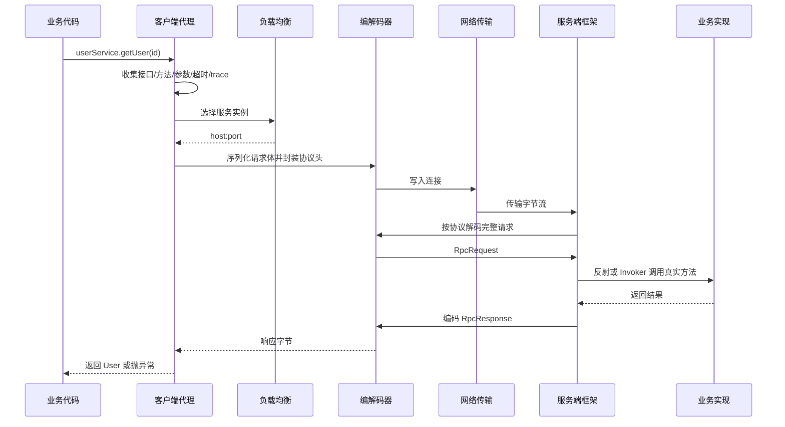
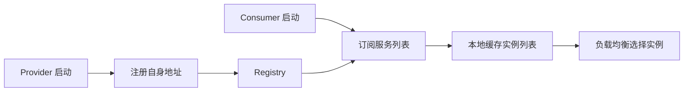

# 系统设计 - 案例 39：RPC 框架系统设计真题模拟

## 题目

设计一个类似 Dubbo / gRPC 的 RPC 框架，让业务方可以像调用本地接口一样调用远程服务。

要求支持：

- 客户端透明调用
- 序列化与通信协议
- 网络传输
- 服务注册与发现
- 负载均衡
- 超时、重试和容错
- 可插拔扩展

先不做：

- 完整服务治理平台
- 跨语言生态的全部兼容细节
- Service Mesh 数据面替代 RPC SDK
- 多租户计费和复杂权限中心

## 为什么这题值得深讲

RPC 框架题很容易被答成一句话：

`动态代理 + 序列化 + Netty + 注册中心 + 负载均衡。`

这句话方向没错，但深度不够。

真正的 RPC 框架不是把几个组件拼起来，而是要解决一条远程调用链路里的几个核心问题：

1. 业务代码为什么看起来像本地调用
2. Java 对象如何变成网络可传输的字节
3. TCP 字节流如何切分成一条条完整消息
4. 客户端如何知道该调哪台服务端
5. 多台服务端如何选择一台
6. 失败、超时、重试、重复执行如何治理
7. 框架未来如何替换序列化、注册中心和负载均衡算法

这题的关键不是“会不会用 Netty”，而是：

`能不能把一次远程方法调用拆成代理、编码、传输、路由、执行、治理和扩展几个边界清晰的模块。`

## 面试官真正想看什么

这题通常在看下面几件事：

1. 你是否知道“像本地调用”只是 API 体验，不代表远程调用真的具备本地语义。
2. 你是否能解释动态代理拦截了什么信息。
3. 你是否能讲清序列化和协议头分别解决什么问题。
4. 你是否知道 TCP 粘包/半包本质上是消息边界问题。
5. 你是否能把注册中心、本地服务列表缓存、负载均衡、健康检查串起来。
6. 你是否知道重试必须和幂等、超时预算一起设计。
7. 你是否能讲出 SPI 插件化扩展，而不是把实现写死。

## 一开始先收敛题目语义

我会先问几个问题：

1. 主要语言是 Java，还是要支持跨语言？
2. 调用模型只支持同步阻塞，还是也要支持异步 Future / Callback？
3. 底层协议是 HTTP/2、HTTP/1.1，还是自定义 TCP 协议？
4. 服务发现依赖 Zookeeper / Nacos / etcd，还是要框架自己实现？
5. 默认重试策略是什么？哪些方法可以重试，哪些不能重试？
6. 服务端执行是共享线程池，还是按服务/方法隔离线程池？
7. 需要灰度、路由标签、权重、熔断、限流这些治理能力吗？

如果面试官不继续补充，我会把题目收敛成：

- Java SDK 内部 RPC 框架
- 默认同步调用，同时预留 Future 异步接口
- 自定义 TCP 协议 + Netty NIO
- Protobuf 或 Hessian 作为默认序列化，JSON 用于调试
- 注册中心使用 Nacos / Zookeeper
- 客户端本地缓存服务实例列表
- 默认负载均衡为加权随机或轮询
- 默认容错为 Failfast，幂等读接口可配置 Failover
- 框架通过 SPI 支持序列化、注册中心、负载均衡和容错插件

## 第一步：先纠正一个误区

RPC 框架常说“让远程调用像本地调用一样简单”，但这句话只能说一半。

客户端代码确实可以写成：

```java
User user = userService.getUser(userId);
```

但远程调用和本地调用在语义上完全不同：

- 本地调用通常没有网络失败
- 远程调用有超时、丢包、连接断开
- 本地调用异常基本确定已经执行或未执行
- 远程调用超时后，你往往不知道服务端是否已经执行
- 本地调用成本很低
- 远程调用要消耗连接、线程、序列化、反序列化和网络资源

所以一个成熟的 RPC 框架应该做到：

- API 层尽量让调用体验简单
- 治理层必须暴露远程调用的不确定性

也就是说：

`框架可以隐藏传输细节，但不能假装网络不存在。`

## 第二步：一次 RPC 调用的完整链路

一个典型调用链路如下：



这条链路可以拆成 7 个模块：

1. 代理层
2. 请求模型
3. 序列化与协议
4. 网络通信
5. 服务注册与发现
6. 负载均衡与容错
7. 扩展与治理

## 第三步：动态代理解决“怎么无感调用”

客户端注入的 `userService` 不是真实实现，而是一个代理对象。

代理对象负责拦截方法调用，并收集这些信息：

- service name，例如 `UserService`
- method name，例如 `getUser`
- parameter types
- arguments
- version / group
- timeout
- request id
- trace id
- attachments，例如用户态标签、灰度标签、调用方信息

请求对象可以抽象成：

```text
RpcRequest
- request_id
- service_name
- service_version
- method_name
- parameter_types
- arguments
- timeout_ms
- attachments
```

响应对象可以抽象成：

```text
RpcResponse
- request_id
- status_code
- result
- error_type
- error_message
- server_timestamp
```

这里 `request_id` 很关键。

因为一个 TCP 连接上可能同时有多个请求在飞，客户端必须通过 `request_id` 把响应匹配回对应的 Future。

## 第四步：序列化解决“怎么说”

网络不能直接传 Java 对象，只能传字节。

序列化模块负责：

- 把请求对象编码成二进制
- 把响应二进制解码成对象
- 处理字段新增、删除、默认值和版本兼容

常见选择：

| 方案 | 优点 | 代价 | 适合场景 |
| --- | --- | --- | --- |
| JSON | 可读性好，调试方便 | 体积大，性能一般，类型约束弱 | 调试、低 QPS 管理接口 |
| Hessian / Kryo | Java 生态接入快 | 跨语言弱，兼容性要小心 | Java 内部系统 |
| Protobuf | 体积小，跨语言，schema 明确 | 需要 IDL 和代码生成 | 多语言、高性能 RPC |

如果是面试里的默认答案，我会倾向：

- 内部 Java 框架可以先用 Hessian 或 Kryo 快速落地
- 如果目标是跨语言或长期平台化，优先 Protobuf

## 第五步：协议头解决“怎么分”

只序列化还不够。

TCP 是字节流，不是消息流。连续发送两个请求时，接收端看到的可能是：

- 一个请求被拆成两半
- 两个请求被粘在一起
- 半个 A + 一个 B + 半个 C 混在同一次 read 中

这就是粘包/半包问题。

解决方式是定义协议头，明确每条消息的边界。

一个简单协议结构可以是：

```text
+----------------+--------------------+
| Header         | Body               |
+----------------+--------------------+
| magic          | serialized bytes   |
| version        |                    |
| message_type   |                    |
| serializer_id  |                    |
| request_id     |                    |
| body_length    |                    |
+----------------+--------------------+
```

核心字段：

- `magic`：快速判断是不是本协议消息
- `version`：协议演进
- `message_type`：request / response / heartbeat
- `serializer_id`：选择序列化器
- `request_id`：请求响应配对
- `body_length`：按长度读取完整 body

接收端逻辑就是：

1. 先读取固定长度 header
2. 从 header 里拿到 `body_length`
3. 再读取指定长度 body
4. 反序列化成请求对象

这比“读到多少算多少”可靠得多。

## 第六步：网络层为什么通常选 Netty

最朴素的做法是 BIO：

- 一个连接一个线程
- read 阻塞
- 写入也可能阻塞

在连接数和并发请求变高时，这种模式会很快遇到线程爆炸和上下文切换成本。

Netty 的价值在于：

- 基于 NIO 非阻塞 I/O
- Selector 多路复用大量连接
- EventLoop 线程模型清晰
- ByteBuf 池化减少内存分配和 GC
- Pipeline 容易插入编解码、心跳、统计等处理器

一个典型客户端结构是：

```text
RpcClient
- ConnectionPool
- EventLoopGroup
- PendingRequestMap<request_id, CompletableFuture>
- Encoder / Decoder
- HeartbeatHandler
- ReconnectHandler
```

客户端发送请求时：

1. 从连接池拿连接
2. 写入请求字节
3. 把 `request_id -> Future` 放入 pending map
4. 等响应回来后完成 Future
5. 超时任务负责清理没有响应的 Future

这里最容易漏的是超时清理。

如果请求超时但 pending map 不清理，系统会慢慢积累内存泄漏。

## 第七步：服务注册与发现解决“去哪找”

没有注册中心时，客户端只能写死服务端地址：

```text
UserService -> 192.168.1.10:8080
```

这在扩容、缩容、故障切换时都不可接受。

更合理的链路是：



注册中心至少要保存：

```text
ServiceInstance
- service_name
- version
- group
- host
- port
- weight
- metadata
- status
- last_heartbeat_time
```

关键点不是“用了注册中心”四个字，而是：

- 服务端启动时注册
- 服务端定期心跳或租约续期
- 客户端订阅变更并维护本地缓存
- 注册中心短暂不可用时，客户端仍可基于本地快照继续调用
- 实例下线要有优雅摘除，避免流量打到正在关闭的进程

## 第八步：负载均衡解决“选哪台”

客户端拿到的是一组实例，不是一台机器。

常见负载均衡策略：

| 策略 | 特点 | 适合场景 |
| --- | --- | --- |
| 随机 | 简单，长期分布均匀 | 实例能力接近 |
| 轮询 | 简单直观 | 实例能力接近 |
| 加权随机/轮询 | 支持不同机器容量 | 新老机器混部 |
| 最少活跃调用 | 避开当前慢实例 | 调用耗时差异大 |
| 一致性哈希 | 同一个 key 尽量打到同一实例 | 有本地缓存或会话亲和 |

我会默认选择：

- 通用接口：加权随机或加权轮询
- 有状态亲和或本地缓存强相关接口：一致性哈希
- 耗时波动明显接口：最少活跃或结合 EWMA 延迟

但要主动强调：

`负载均衡不是只看均匀，还要看实例健康、权重、延迟和业务亲和性。`

## 第九步：容错策略不能只说“失败重试”

RPC 最危险的地方是：

- 客户端超时了
- 但服务端可能已经执行了业务逻辑

所以重试必须非常谨慎。

常见容错策略：

| 策略 | 行为 | 适合场景 |
| --- | --- | --- |
| Failfast | 失败立即报错 | 写操作、非幂等接口 |
| Failover | 失败后换节点重试 | 幂等读接口 |
| Failsafe | 失败只记录日志，不抛出 | 日志、监控、非关键通知 |
| Failback | 失败后台异步重试 | 弱依赖、可最终补偿场景 |

我会这样设计默认规则：

1. 默认不重试写接口。
2. 只有明确声明幂等的方法才允许重试。
3. 每次调用有总超时预算，而不是每次重试都重新拿一个完整超时。
4. 重试要避开同一故障实例。
5. 重试次数、退避、熔断要可配置。

一个配置例子：

```text
MethodConfig
- timeout_ms: 200
- retry_count: 1
- retry_policy: failover
- idempotent: true
- load_balance: weighted_random
```

如果没有幂等语义，重试只会把一次不确定失败变成多次不确定副作用。

## 第十步：服务端执行链路

服务端收到请求后，不应该直接在 I/O 线程里执行业务逻辑。

原因是：

- 业务方法可能阻塞
- 数据库调用可能慢
- 如果占住 EventLoop，会影响所有连接的读写

更合理的服务端结构：


这里要考虑：

- 按服务或方法配置线程池隔离
- 慢接口不能拖垮所有接口
- 服务端也要有超时、并发限制和拒绝策略
- 异常要被转换成可识别的 RPC 错误响应

## 第十一步：SPI 插件化扩展

RPC 框架不能把所有东西写死。

典型可插拔点：

- Serializer
- Registry
- LoadBalance
- FaultTolerance
- Filter / Interceptor
- Router
- Codec

可以定义标准接口：

```java
interface Serializer {
    byte[] serialize(Object value);
    <T> T deserialize(byte[] bytes, Class<T> type);
}

interface LoadBalance {
    ServiceInstance select(List<ServiceInstance> instances, RpcRequest request);
}

interface Registry {
    void register(ServiceInstance instance);
    List<ServiceInstance> subscribe(String serviceName);
}
```

业务方想从 JSON 换 Protobuf，或者从随机负载均衡换一致性哈希，只需要：

1. 实现接口
2. 在配置文件中声明实现
3. 框架按 SPI 加载

这就是“核心不动，外围可插拔”。

## 第十二步：治理能力放在哪

成熟 RPC 框架通常会有过滤器链：

```text
Client Filter Chain
- TraceFilter
- MetricsFilter
- TimeoutFilter
- RetryFilter
- RateLimitFilter
- AuthFilter
- RoutingFilter
```

服务端也会有：

```text
Server Filter Chain
- Decode
- Auth
- RateLimit
- Metrics
- Invoke
- ErrorMapping
```

这些能力不要写进业务逻辑里。

否则每个服务都要重复处理超时、日志、追踪、鉴权和指标，框架就没有价值了。

## 第十三步：如何观测 RPC 框架是否健康

RPC 框架必须内建观测能力。

关键指标：

- 调用 QPS
- 成功率 / 错误率
- P50 / P95 / P99 延迟
- 超时数
- 重试次数
- 熔断打开次数
- 连接数
- pending request 数
- 序列化耗时
- 服务端线程池队列长度

Trace 里至少要带：

- service
- method
- request_id
- trace_id
- remote_address
- retry_attempt
- timeout_ms
- error_type

否则线上排查“为什么这个接口慢”时，RPC 框架本身就会变成黑盒。

## 方案取舍总结

| 设计点 | 轻量方案 | 平台化方案 | 取舍 |
| --- | --- | --- | --- |
| 代理 | JDK 动态代理 | JDK + CGLIB / 字节码增强 | 接口代理简单，类代理更灵活 |
| 序列化 | JSON / Hessian | Protobuf | 易用 vs 性能和跨语言 |
| 协议 | HTTP | 自定义 TCP / HTTP2 | 生态 vs 性能和控制力 |
| 网络 | BIO | Netty NIO | 简单 vs 高并发 |
| 注册中心 | 配置文件 | Nacos / Zookeeper / etcd | 手动维护 vs 动态发现 |
| 容错 | Failfast | Failfast + Failover + 熔断 | 简单 vs 治理能力 |
| 扩展 | 写死实现 | SPI 插件 | 快速落地 vs 长期演进 |

## 面试版回答

如果让我设计一个 RPC 框架，我会先把目标收敛为：让业务方调用远程服务时 API 上像本地接口，但框架层必须显式处理网络超时、服务发现、负载均衡和失败语义。

客户端侧我会用动态代理拦截方法调用，把接口名、方法名、参数、超时、trace 等信息封装成 `RpcRequest`。请求会经过序列化模块转成二进制，再加上自定义协议头，协议头里包含 magic、版本、序列化类型、request id 和 body length，用来解决 TCP 字节流粘包/半包和请求响应匹配问题。

网络层我会用 Netty NIO，客户端维护连接池和 pending request map，服务端 I/O 线程只负责收发和编解码，真正业务执行交给业务线程池。服务端启动时把自己的地址、版本、权重和元数据注册到注册中心，客户端订阅服务列表并缓存在本地，注册中心短暂不可用时仍可基于本地快照调用。

调用前客户端通过负载均衡选择实例，默认用加权随机或轮询，有会话亲和时用一致性哈希。容错上默认 Failfast，只有明确幂等的读接口才允许 Failover 重试，并且重试受总超时预算约束。最后，序列化、注册中心、负载均衡、容错策略都通过 SPI 插件化，保证框架核心稳定，外围可扩展。

## 高频追问

### 追问 1：为什么不能所有失败都重试

因为超时不代表服务端没执行。非幂等写接口如果重试，可能导致重复下单、重复扣款、重复发券。重试必须和幂等键、方法语义、总超时预算一起设计。

### 追问 2：TCP 粘包/半包怎么解决

用协议头描述消息边界，最关键的是 `body_length`。接收端先读固定长度 header，再按 body_length 读取完整 body，最后反序列化。

### 追问 3：注册中心挂了怎么办

客户端不能每次调用实时查注册中心。它应该订阅并缓存服务实例快照。注册中心短暂故障时，客户端继续用本地快照调用；同时服务端健康检查和优雅下线要避免把流量打到坏实例。

### 追问 4：为什么服务端业务执行不能放在 Netty I/O 线程

业务方法可能阻塞。如果 I/O 线程被业务逻辑占住，其他连接的读写也会受影响。正确做法是 I/O 线程负责网络和编解码，业务线程池负责真正调用。

### 追问 5：SPI 的价值是什么

SPI 让序列化、负载均衡、注册中心、容错策略可以替换。框架核心只依赖接口，不依赖具体实现。这样未来从 JSON 换 Protobuf、从随机换一致性哈希，不需要改核心代码。

## 常见失分点

1. 只背“动态代理 + Netty + 注册中心”，没有完整请求链路。
2. 把序列化和协议头混为一谈。
3. 不讲 `request_id` 和 pending Future，解释不了并发请求如何匹配响应。
4. 默认所有失败都重试，不区分幂等和非幂等。
5. 客户端每次调用都查注册中心。
6. 服务端在 I/O 线程里直接执行业务逻辑。
7. 不讲超时、指标、trace 和插件化扩展。

## 自测问题

1. 一个 RPC 请求从业务方法调用到服务端真实方法执行，中间经过哪些模块？
2. 协议头里的 `body_length` 和 `request_id` 分别解决什么问题？
3. 如果客户端超时了，服务端可能已经执行成功，框架该如何设计重试策略？
4. 注册中心短暂不可用时，客户端为什么仍然应该可以继续调用？
5. 为什么 SPI 是 RPC 框架走向平台化的关键？
