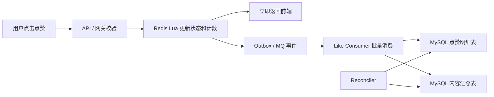
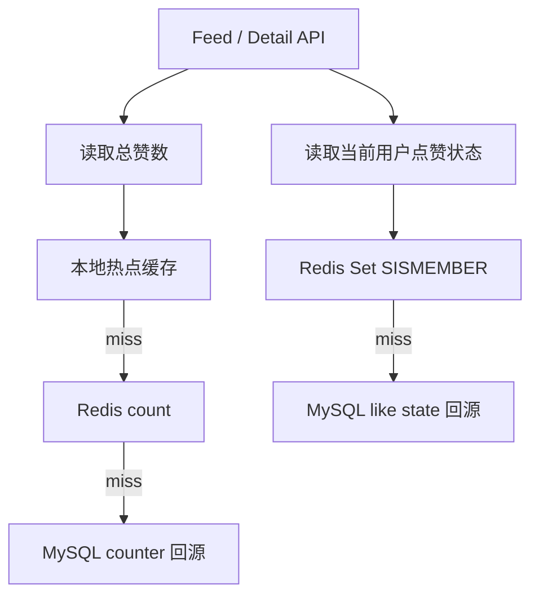

# 系统设计 - 案例 40：点赞系统真题模拟

## 题目

设计一个点赞系统，支持文章、视频或动态的点赞和取消点赞。

要求支持：

- 用户点赞 / 取消点赞
- 前端展示用户是否已点赞
- 展示内容总点赞数
- 高并发热点内容
- 异步持久化到数据库
- 可恢复、可对账

先不做：

- 复杂推荐排序
- 反作弊画像全量系统
- 多端实时推送点赞动画
- 跨国家多活强一致计数

## 为什么这题值得深讲

点赞看起来是一个很小的功能：

- 点一下亮
- 再点一下灭
- 数字加一或减一

但在大流量内容系统里，点赞是典型的高频读写场景。

它同时有两类压力：

1. 写压力：大量用户对热点内容点赞或取消点赞。
2. 读压力：每次刷内容都要展示总赞数和当前用户是否点过赞。

如果每次点赞都同步写 MySQL，每次展示都实时查 MySQL，那么热点内容很容易把数据库打成热点行或热点索引。

这题真正考的是：

`如何把高频交互放到内存层快速完成，同时把最终状态可靠、可恢复地落到持久化存储。`

## 面试官真正想看什么

这题通常在看下面几件事：

1. 你能不能把“点赞状态”和“点赞计数”分开建模。
2. 你是否知道 Redis Set 适合判断用户是否点赞。
3. 你是否知道大流量下 `SCARD` 不一定是最优计数方式。
4. 你是否能把 Redis 写入、MQ、批量落库、幂等消费串起来。
5. 你是否能处理点赞和取消点赞乱序、重复、重试。
6. 你是否知道大 V 热点 key 会打爆单点 Redis。
7. 你是否能说明 Redis 丢失或 MQ 积压时如何恢复。

## 一开始先收敛题目语义

我会先问：

1. 点赞对象是什么，是文章、评论、视频，还是多种资源？
2. 总赞数需要强实时吗？允许延迟几秒吗？
3. 用户点赞状态必须强一致吗？
4. 是否允许同一用户重复点击导致最终以最后一次为准？
5. 需要点赞明细永久保存吗？
6. 热点内容峰值可能到多少 QPS？
7. 取消点赞是否要保留审计记录？

如果面试官不继续补充，我会收敛成：

- 支持文章点赞和取消点赞
- 同一用户对同一文章最终只能有一个状态
- 前端按钮状态要求尽量实时
- 总点赞数允许秒级最终一致
- MySQL 保存点赞明细和内容汇总结果
- Redis 承接在线读写
- MQ 异步批量落库
- 对热点内容使用本地缓存和聚合写保护 Redis

## 第一步：先定义两个核心对象

点赞系统至少有两类数据：

### 1. 点赞状态

表示某个用户是否点过某个内容。

```text
LikeState
- target_type
- target_id
- user_id
- status: liked / unliked
- updated_at
```

这类数据回答的是：

- 当前用户有没有点过赞？
- 用户取消点赞以后，按钮是否要变灰？
- 重复点击是否应该幂等？

### 2. 点赞计数

表示某个内容当前有多少赞。

```text
LikeCounter
- target_type
- target_id
- like_count
- updated_at
```

这类数据回答的是：

- 页面上显示多少赞？
- 热榜或排序是否使用点赞数？
- 计数允许延迟多久？

这两个对象不要混在一起。

状态关注“谁点过”，计数关注“多少个”。

## 第二步：为什么不能同步打 MySQL

朴素方案：

1. 用户点赞
2. MySQL 插入一条点赞记录
3. MySQL 更新文章点赞数
4. 页面查询时从 MySQL 查状态和总数

问题很明显：

- 热点文章会形成热点写入
- 点赞数那一行会被高频更新
- 查询“用户是否点赞”会打到明细表索引
- 同步链路慢，用户点击反馈不够快
- DB 抖动会直接影响前端交互

所以这题的第一原则是：

`在线交互层不要把 MySQL 当作每次点击的同步主路径。`

## 第三步：Redis 存储模型

### 方案 A：只用 Set

```text
Key: article:likes:10086
Type: Set
Value: user_id
```

操作：

- 点赞：`SADD article:likes:10086 user_a`
- 取消点赞：`SREM article:likes:10086 user_a`
- 判断是否点赞：`SISMEMBER article:likes:10086 user_a`
- 获取总赞数：`SCARD article:likes:10086`

优点：

- 模型直观
- 判断用户状态很快
- 天然防重复点赞

缺点：

- 大 V 内容 Set 可能非常大
- `SCARD` 虽然是 O(1)，但热点 key 本身仍可能成为单点压力
- 只靠 Set 表达计数，在极端场景下不方便做聚合优化

### 方案 B：Set 保存状态，String 保存总数

更通用的设计是：

```text
Key: article:likes:10086:users
Type: Set
Value: user_id

Key: article:likes:10086:count
Type: String
Value: 123456
```

点赞时：

- 如果 `SADD` 返回 1，说明从未点赞，计数 `INCR`
- 如果 `SADD` 返回 0，说明重复点赞，计数不变

取消点赞时：

- 如果 `SREM` 返回 1，说明确实取消，计数 `DECR`
- 如果 `SREM` 返回 0，说明之前没点赞，计数不变

这样状态和计数都可以保持幂等。

## 第四步：Redis 操作要用 Lua 保证状态和计数一致

如果点赞流程拆成两步：

1. `SADD`
2. `INCR`

中间进程崩溃，就可能出现：

- 状态写了
- 计数没加

所以更稳的方式是用 Lua 把状态变更和计数变更包在一次 Redis 原子执行里。

点赞逻辑：

```lua
-- KEYS[1] = like users set
-- KEYS[2] = like count key
-- ARGV[1] = user_id

local added = redis.call('SADD', KEYS[1], ARGV[1])
if added == 1 then
  redis.call('INCR', KEYS[2])
  return 1
else
  return 0
end
```

取消点赞逻辑：

```lua
local removed = redis.call('SREM', KEYS[1], ARGV[1])
if removed == 1 then
  redis.call('DECR', KEYS[2])
  return 1
else
  return 0
end
```

这个设计的价值是：

- 重复点赞不会多加计数
- 重复取消不会多减计数
- 状态和计数在 Redis 层保持一致

## 第五步：写链路设计

点赞写链路可以这样设计：



在线链路只做：

1. 参数校验
2. 登录态校验
3. Redis 原子更新
4. 发送事件
5. 快速返回

持久化链路做：

1. 批量消费点赞事件
2. 幂等写点赞明细表
3. 聚合更新内容汇总表
4. 失败重试和死信处理
5. 周期对账

## 第六步：为什么要 MQ 异步落库

点赞系统里，MySQL 更适合保存长期事实，不适合承接每一次点击的同步峰值。

MQ 的价值是：

- 前端点击毫秒级响应
- 写入洪峰被 MQ 缓冲
- 消费者按数据库能力平稳写入
- 支持批量 insert / upsert
- 失败可以重试或进死信

但要注意：

`MQ 不是正确性的全部，最终还要靠幂等写、对账和补偿。`

## 第七步：MySQL 怎么建模

### 点赞明细表

```text
content_like
- target_type
- target_id
- user_id
- status
- updated_at
- event_id

unique key (target_type, target_id, user_id)
```

这个唯一键非常重要。

它保证同一用户对同一内容只有一条最终状态。

### 内容汇总表

```text
content_counter
- target_type
- target_id
- like_count
- version
- updated_at
```

这张表保存可查询的汇总结果。

不要在每次点赞时同步 `like_count = like_count + 1`，否则热点内容会把这一行打爆。

更常见的是：

- 消费者批量聚合同一内容的增量
- 每隔很短时间批量更新一次汇总表
- 或者离线/准实时任务从明细重算校正

## 第八步：事件怎么设计才能幂等

事件可以设计成：

```text
LikeEvent
- event_id
- target_type
- target_id
- user_id
- action: like / unlike
- event_time
- state_version
```

关键是 `state_version` 或 `updated_at`。

因为用户可能快速操作：

1. 点赞
2. 取消点赞
3. 再点赞

如果消息乱序到达，消费者不能让旧事件覆盖新状态。

消费者写库时应使用类似语义：

```sql
UPDATE content_like
SET status = ?, updated_at = ?
WHERE target_id = ?
  AND user_id = ?
  AND updated_at < ?
```

或者用版本号保证：

- 只接受更新版本更高的事件
- 老事件到达时直接丢弃

## 第九步：读链路怎么设计

页面展示通常需要两个值：

1. 当前用户是否已点赞
2. 内容总点赞数

读路径：



总赞数可以容忍秒级延迟，所以可以：

- 本地缓存热点计数
- Redis 保存准实时计数
- MySQL 作为兜底

用户是否点赞更接近交互状态，通常优先读 Redis Set。Redis miss 时可以从 MySQL 回填。

## 第十步：大 V 热点 key 怎么处理

最大风险是：

- 某个明星内容成为热点
- 所有请求都打同一个 `article:likes:xxx` key
- 单 Redis 分片被打满

常见治理手段：

### 1. 本地缓存读热点

把热点内容的总赞数放在应用本地缓存中，短 TTL，例如 1 到 2 秒。

这样 Feed 页展示总数时，不必每次都打 Redis。

代价是：

- 计数会有短时间延迟
- 多实例本地值不完全一致

点赞数通常可以接受这种延迟。

### 2. 本地聚合写增量

对于极热点内容，可以把点赞增量先在应用内存中聚合：

```text
Server A: +50
Server B: +30
```

然后每 1 到 2 秒合并写一次 Redis。

这种方案适合计数，但要谨慎处理点赞状态。

用户状态不能只存在本地，否则换一台服务器就看不到。

### 3. 分桶 Set

如果一个 Set 太大或单 key 太热，可以按用户 ID hash 分桶：

```text
article:likes:10086:bucket:0
article:likes:10086:bucket:1
...
article:likes:10086:bucket:63
```

判断用户是否点赞时：

- 根据 `hash(user_id) % 64` 找对应 bucket

总数可以：

- 单独维护 count key
- 或异步聚合各 bucket

分桶可以降低单 key 压力，但会增加读写复杂度。

## 第十一步：Redis 丢数据怎么办

点赞系统通常会把 Redis 当在线工作集，而不是唯一真相源。

恢复策略：

1. MySQL 保存点赞最终状态。
2. MQ 或日志保存一段时间内的事件。
3. Redis 故障恢复后，可以从 MySQL 热点数据回灌。
4. 对热点内容，优先回灌近期活跃内容和大 V 内容。
5. 周期对账修正 Redis count 和 MySQL counter。

如果业务对点赞绝对不能丢，则需要：

- 先可靠记录事件，再更新缓存
- 或者 Redis 更新和事件写入通过 Outbox/事务消息衔接

但这样会牺牲交互延迟。

面试里要说明这个 trade-off。

## 第十二步：一致性边界

点赞系统通常不追求强一致。

更合理的目标是：

- 用户刚点完，自己看到的按钮状态要尽快正确。
- 总赞数允许短暂不一致。
- 数据库最终状态和 Redis 最终状态要能对齐。
- 重复点击、消息重复、消费者重试不会造成计数漂移。

可以把一致性分层：

| 数据 | 一致性目标 | 原因 |
| --- | --- | --- |
| 当前用户按钮状态 | 尽量实时 | 直接影响交互反馈 |
| 总点赞数 | 秒级最终一致 | 用户可容忍短暂波动 |
| MySQL 明细 | 最终正确 | 审计和恢复需要 |
| 排行榜/推荐特征 | 分钟级或更慢 | 派生数据 |

## 第十三步：监控和对账

关键指标：

- 点赞接口 QPS
- Redis Lua 成功率和耗时
- Redis 热点 key QPS
- MQ 积压
- 消费失败和死信数量
- MySQL 批量写耗时
- Redis count 与 MySQL counter 差异
- 重复事件比例
- 乱序丢弃事件数

对账可以分两类：

1. 明细对账：按内容聚合 MySQL 明细，校正汇总表。
2. 缓存对账：用 MySQL 汇总或明细结果回填 Redis count。

## 面试版回答

如果让我设计点赞系统，我会先把数据拆成两类：一类是用户是否点赞的状态，另一类是内容总点赞数。在线交互不能每次都同步打 MySQL，否则热点内容会形成热点写和热点读。

我会用 Redis 承接在线读写。对于点赞状态，用 `article:likes:{id}:users` 这样的 Set 保存 user_id；对于总数，用单独的 String counter 保存。点赞时用 Lua 原子执行：如果 `SADD` 成功才 `INCR`，重复点赞不加计数；取消点赞时如果 `SREM` 成功才 `DECR`，重复取消不减计数。这样 Redis 层状态和计数不会因为重复请求漂移。

Redis 更新成功后，接口立即返回，同时发送点赞事件到 MQ。消费者按数据库承载能力批量写 MySQL 点赞明细表和内容汇总表。明细表用 `(target_type, target_id, user_id)` 做唯一键，事件里带 `event_id` 和 `updated_at/version`，避免重复消费和乱序覆盖。

读路径上，Feed 或详情页读取总赞数优先走本地热点缓存和 Redis，用户是否已点赞走 Redis `SISMEMBER`，miss 时从 MySQL 回源。遇到大 V 热点内容时，可以用本地缓存保护读、用本地聚合保护计数写，必要时对点赞 Set 分桶。最终通过对账任务修正 Redis、MySQL 明细和汇总表之间的差异。

## 高频追问

### 追问 1：为什么不用 MySQL 同步写

点赞是高频交互，热点内容会形成热点行、热点索引和同步链路延迟。MySQL 更适合做长期真相和恢复兜底，不适合承接每次点击的同步峰值。

### 追问 2：Set 和 String counter 为什么都要

Set 适合判断某个用户是否点赞，String counter 适合快速读取总数和做聚合优化。小规模时可以用 `SCARD`，大规模热点时单独 counter 更灵活。

### 追问 3：消息乱序怎么办

事件带版本或更新时间。消费者只接受新版本覆盖旧版本，旧消息即使延迟到达也不能把最新状态改回去。

### 追问 4：Redis 热点 key 怎么办

总赞数可以本地短 TTL 缓存，写增量可以本地聚合后批量刷新。用户点赞状态可以按 user_id hash 分桶，降低单 key 压力。

### 追问 5：Redis 和 MySQL 不一致怎么办

Redis 是在线工作集，MySQL 明细和事件日志用于恢复。通过消费者重试、死信处理、周期对账和缓存回灌最终修正。

## 常见失分点

1. 把点赞状态和点赞计数混成一个字段。
2. 每次点赞都同步写 MySQL，没有识别热点写问题。
3. 只说 Redis Set，不考虑计数、持久化和恢复。
4. 不处理重复点赞、重复取消和消息重复消费。
5. 不处理用户连续点击导致的消息乱序。
6. 不讲大 V 热点 key。
7. 把 Redis 当唯一真相源，但又没有恢复方案。

## 自测问题

1. 为什么点赞系统通常要把状态和计数分开建模？
2. Redis 中 `SADD + INCR` 为什么最好用 Lua 原子执行？
3. 点赞事件乱序到达 MySQL 消费者时，如何避免旧状态覆盖新状态？
4. 大 V 内容的单 key 热点可以从哪些层面缓解？
5. Redis 丢失部分点赞缓存后，系统如何恢复？
