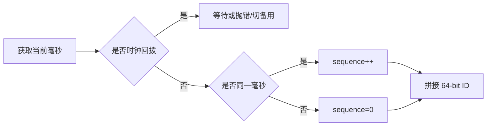

# 系统设计 - 案例 41：分布式 ID 发号器真题模拟

## 题目

设计一个分布式 ID 发号器，给订单、短链、消息、用户行为等业务生成全局唯一 ID。

要求支持：

- 全局唯一
- 高并发低延迟
- 趋势递增
- 高可用
- 多业务隔离
- 可观测和可运维

先不做：

- 严格连续无空洞 ID
- 全局按业务发生时间完全排序
- 跨全球多区域强一致发号
- 对外暴露可猜测的业务编号

## 为什么这题值得深讲

分布式 ID 看起来很小，但它是很多系统的底座：

- 订单 ID
- 支付流水 ID
- 消息 ID
- 短链映射 ID
- 分库分表主键
- 事件日志 offset 或 trace 关联键

这题容易被答成：

- 用 UUID
- 用 Redis 自增
- 用 Snowflake

但面试官真正想听的是：

`你是否能围绕唯一性、趋势递增、性能、可用性、数据库索引友好性和故障边界做取舍。`

## 面试官真正想看什么

这题通常在看下面几件事：

1. 你是否知道 UUID 不适合作为大多数 MySQL 聚簇索引主键。
2. 你是否知道数据库自增在分库分表后不再天然全局唯一。
3. 你是否能讲清 Snowflake 的位段结构和时钟回拨问题。
4. 你是否能讲清数据库号段模式为什么不是“每次查 DB”。
5. 你是否知道双 Buffer 预加载如何提高可用性。
6. 你是否能根据场景选择本地算法还是中心化号段服务。
7. 你是否能接受 ID 空洞，并解释为什么严格连续通常不值得。

## 一开始先收敛题目语义

我会先问：

1. ID 用作数据库主键，还是只用于外部展示？
2. 是否要求趋势递增？
3. 是否允许 ID 有空洞？
4. 是否按业务线隔离号段？
5. 峰值发号 QPS 是多少？
6. 单机还是多机房？
7. 是否能接受依赖本地时钟？

如果面试官不补充，我会收敛成：

- Java 后端内部发号服务
- ID 是 64-bit long
- 要全局唯一、趋势递增
- 允许空洞，不要求严格连续
- 单业务峰值百万级 QPS
- 主要服务单区域多可用区
- 默认提供 Snowflake 和数据库号段两种实现，由业务按场景选择

## 第一步：先明确目标不是“越短越好”

一个好的分布式 ID 至少要看 5 个维度：

1. 唯一性  
   任何时候不能重复。

2. 趋势递增  
   对数据库 B+ 树更友好，减少随机插入导致的页分裂。

3. 高性能  
   发号不能成为业务写入瓶颈。

4. 高可用  
   发号系统挂了不能拖垮全站核心写链路。

5. 可治理  
   机器 ID 分配、时钟回拨、号段耗尽、监控告警都要可控。

严格连续通常不是目标。

因为：

- 重试会消耗 ID
- 预分配会浪费 ID
- 失败回滚会造成空洞
- 为了无空洞付出的锁和一致性成本过高

所以面试里可以直接说明：

`我追求全局唯一和趋势递增，不追求严格连续。`

## 第二步：为什么不推荐 UUID 做数据库主键

UUID 的优点是：

- 本地生成
- 几乎不会冲突
- 不依赖中心服务

但作为 MySQL 聚簇索引主键，问题很明显：

- 随机分布导致 B+ 树随机插入
- 页分裂更多
- 索引体积大
- 对缓存局部性不友好
- 排查和口头沟通不方便

所以 UUID 更适合：

- 外部 trace
- 幂等 key
- 安全随机 token
- 不作为主聚簇索引的唯一标识

订单、流水、分片主键这类场景，通常更偏向 long 型趋势递增 ID。

## 第三步：方案一，Snowflake

Snowflake 的核心思想是：

`把一个 64-bit long 按位切成时间、机器和序列号。`

典型结构：

```text
0 | timestamp(41 bits) | worker_id(10 bits) | sequence(12 bits)
```

含义：

- 最高位固定为 0，保证正数
- 41 位时间戳，通常是当前毫秒减去自定义 epoch
- 10 位机器 ID，最多 1024 个 worker
- 12 位毫秒内序列号，单机每毫秒最多 4096 个

生成流程：



优点：

- 本地内存生成，延迟极低
- 不依赖 DB / Redis
- 趋势递增
- 吞吐非常高

缺点：

- 强依赖机器时钟
- worker_id 分配不能冲突
- 同一毫秒序列号用完要等待下一毫秒
- 多机房时 worker_id 和时间治理更复杂

## 第四步：Snowflake 的时钟回拨怎么处理

时钟回拨是 Snowflake 的核心风险。

如果上一次生成 ID 的时间是 `10:10:00.100`，这次系统时间变成 `10:10:00.050`，就可能生成和过去重叠的 ID。

常见处理策略：

1. 小幅回拨，等待  
   如果回拨小于阈值，例如 5ms，线程 sleep 到安全时间。

2. 中等回拨，切备用 worker id  
   使用预留 worker id 或逻辑时钟段规避冲突。

3. 大幅回拨，拒绝发号  
   直接抛异常或降级到中心化发号服务。

4. 运维治理  
   禁止大幅手动改时钟，使用 NTP 平滑校时，并监控回拨事件。

伪代码：

```java
if (currentTime < lastTime) {
    long diff = lastTime - currentTime;
    if (diff <= maxTolerateMs) {
        waitUntil(lastTime);
    } else {
        throw new ClockMovedBackwardsException(diff);
    }
}
```

面试里不要只说“等待一下”。

要说明：

- 等待只适合小幅回拨
- 大幅回拨必须告警或切备用方案
- 时钟治理是 Snowflake 的工程前提

## 第五步：worker_id 怎么分配

worker_id 冲突会直接导致 ID 冲突。

常见方案：

1. 手工配置  
   简单，但运维风险高。

2. 启动时向注册中心申请  
   例如 Zookeeper / etcd / Nacos 分配唯一 worker id。

3. 基于机房、机架、机器编号组合  
   更适合基础设施规范的大团队。

4. K8s 环境用 StatefulSet ordinal  
   pod 编号稳定时可以映射 worker id。

无论哪种方式，都要保证：

- 同一时间 worker_id 不重复
- 实例下线后 worker_id 不要立刻危险复用
- 分配记录可审计

## 第六步：方案二，数据库号段模式

很多人一听“数据库发号”，会以为：

- 每生成一个 ID，都查一次 DB

这当然扛不住。

号段模式的核心是批发：

1. 发号服务向数据库申请一个号段，例如 `[1, 1000]`
2. 发号服务把号段缓存在内存
3. 业务请求来时，从内存 AtomicLong 递增分配
4. 当前号段快用完时，异步加载下一个号段

号段表可以设计成：

```text
id_segment
- biz_tag
- max_id
- step
- version
- updated_at
```

申请号段时：

```sql
UPDATE id_segment
SET max_id = max_id + step,
    version = version + 1
WHERE biz_tag = ?
  AND version = ?;
```

更新成功后，本次拿到的号段就是：

```text
(old_max_id, new_max_id]
```

## 第七步：双 Buffer 机制

单 Buffer 的问题是：

- 当前号段用完时才去 DB 申请
- 如果 DB 此时慢或抖动，发号会卡住

双 Buffer 的思路是：

```text
Buffer A: 当前使用 [1, 1000]
Buffer B: 预加载备用 [1001, 2000]
```

当 Buffer A 用到一定阈值，例如剩余 20% 时：

- 后台线程异步申请 Buffer B
- Buffer A 用完后无缝切到 Buffer B
- 再为下一轮预加载新的备用 Buffer

这样：

- 大部分请求只访问本地内存
- DB 只承担低频批量申请
- DB 短暂故障时，服务还能靠本地缓存撑一段时间

## 第八步：号段模式为什么高可用

号段模式的可用性来自：

- 多个发号服务实例
- 每个实例都有本地号段缓存
- 每个实例提前预加载备用号段
- DB 短暂故障时，已加载号段仍可继续服务

它的代价是：

- 会有 ID 空洞
- 不同实例之间整体趋势递增，但不保证请求级严格单调
- DB 是号段分配真相源，需要高可用部署
- step 配置太小会频繁打 DB，太大会浪费更多 ID

这类空洞通常可以接受。

因为 ID 的核心职责是唯一和索引友好，不是做财务流水号连续审计。

## 第九步：Snowflake 和号段模式怎么选

| 维度 | Snowflake | 数据库号段 |
| --- | --- | --- |
| 性能 | 极高，本地生成 | 很高，本地号段内生成 |
| 外部依赖 | 依赖时钟和 worker_id | 依赖号段 DB |
| 趋势递增 | 是 | 是 |
| 时钟回拨风险 | 有 | 无 |
| ID 紧凑性 | 较紧凑 | 更紧凑 |
| 多业务隔离 | 需要规划 worker 或附加字段 | biz_tag 天然隔离 |
| 运维重点 | 时钟和 worker_id | DB 高可用和号段预加载 |
| 适合场景 | 高吞吐、低依赖、可治理时钟 | 核心业务、希望弱化时钟依赖 |

我的选择通常是：

- 普通高吞吐业务：Snowflake
- 金融、交易、核心订单：号段模式或公司统一发号服务
- 短链生成：分布式 ID + Base62
- 外部不可猜测 token：不要直接暴露递增 ID，另做随机码或混淆

## 第十步：短链为什么常用 ID + Base62

短链系统里，短码常见做法是：

1. 发号器生成全局唯一数字 ID
2. 把十进制 ID 转成 Base62
3. 得到短码后缀

Base62 字符集：

```text
0-9, a-z, A-Z
```

容量：

```text
62^6 = 56,800,235,584
```

6 位短码理论上能表示约 568 亿个不同值。

这里要注意：

- Base62 是编码方式，不是唯一性来源
- 唯一性来自前面的分布式 ID
- 如果业务要求不可枚举，需要再加随机化、混淆或风控

短链详细设计已经放在案例 13，这里只强调发号器和短码生成的关系。

## 第十一步：API 设计

可以提供两类接口：

### 单个发号

```text
GET /v1/ids/next?biz_tag=order
```

返回：

```text
{
  "id": 1234567890123456789
}
```

### 批量发号

```text
POST /v1/ids/batch
{
  "biz_tag": "message",
  "count": 100
}
```

返回：

```text
{
  "start": 100001,
  "end": 100100
}
```

批量接口要谨慎：

- count 要限额
- 请求方要说明业务场景
- 避免无意义浪费号段

## 第十二步：监控指标

Snowflake 关注：

- 当前 worker_id
- 每秒发号量
- 序列号耗尽次数
- 时钟回拨次数和回拨毫秒数
- 等待下一毫秒次数

号段模式关注：

- 每个 biz_tag 当前号段剩余比例
- Buffer 预加载成功率
- DB 申请号段耗时
- DB 更新冲突次数
- 发号服务本地缓存剩余可支撑时间
- 号段耗尽告警

通用指标：

- QPS
- P99 latency
- error rate
- duplicate detection
- ID 生成异常日志

## 面试版回答

如果让我设计一个分布式 ID 发号器，我会先明确目标：全局唯一、趋势递增、高性能和高可用，允许 ID 有空洞，不追求严格连续。因为严格连续会显著增加锁和一致性成本，通常不值得。

我会提供两类实现。第一类是 Snowflake，本地按 64 位 long 生成 ID，结构通常是 1 位符号位、41 位毫秒时间戳、10 位 worker id、12 位毫秒内序列号。它的优点是本地生成、无网络 IO、吞吐极高，缺点是依赖本地时钟和 worker id 分配。工程上要处理小幅时钟回拨等待、大幅回拨拒绝或切备用，并通过注册中心或基础设施保证 worker id 不冲突。

第二类是数据库号段模式。不是每次生成 ID 都查数据库，而是发号服务一次向数据库申请一段号段，例如 `[1,1000]`，之后在本地内存用 AtomicLong 分配。当前号段用到阈值时，后台线程预加载下一个号段，也就是双 Buffer 机制。这样大部分请求都是内存操作，数据库只承担低频批发号段，短暂故障时也能靠本地缓存继续服务。

选择上，如果是普通高吞吐业务，我会优先 Snowflake；如果是核心交易链路，希望弱化时钟回拨风险，我会优先统一发号服务的号段模式。短链这类场景可以用分布式 ID 再做 Base62 编码，但 Base62 只是编码，唯一性来自 ID 发号器本身。

## 高频追问

### 追问 1：为什么 UUID 不适合做 MySQL 主键

UUID 随机插入会导致 B+ 树页分裂更多，索引体积更大，缓存局部性差。它适合 token 或 trace，不适合大多数聚簇索引主键。

### 追问 2：Snowflake 时钟回拨怎么办

小幅回拨可以等待，大幅回拨要拒绝发号、告警或切备用方案。还要通过 NTP 平滑校时和运维规范减少回拨发生。

### 追问 3：号段模式会不会依赖数据库

会依赖，但不是每次发号都依赖。它通过本地号段缓存和双 Buffer 把 DB 访问频率降到很低，DB 短暂不可用时仍可继续服务一段时间。

### 追问 4：为什么允许 ID 空洞

重试、预加载、实例宕机都会造成空洞。只要 ID 用于唯一标识和索引，空洞通常不影响业务。为了无空洞付出强一致锁成本通常不划算。

### 追问 5：短链用 Base62 会不会冲突

Base62 本身只是进制转换，不会引入冲突。是否冲突取决于输入数字 ID 是否唯一。如果用哈希截断生成短码，才需要特别处理冲突。

## 常见失分点

1. 一上来只说 UUID，不考虑数据库索引代价。
2. 只说 Snowflake，不讲时钟回拨和 worker_id 分配。
3. 把号段模式误解成每次都查 DB。
4. 追求严格连续 ID，却没有解释成本。
5. 把趋势递增说成全局严格递增。
6. 短链场景里把 Base62 当成唯一性来源。
7. 不讲监控和故障边界。

## 自测问题

1. 分布式 ID 为什么通常追求趋势递增，而不是随机 UUID？
2. Snowflake 的 41/10/12 位分别表示什么？
3. 时钟回拨为什么会导致 Snowflake 重复 ID？
4. 数据库号段模式的双 Buffer 如何减少发号抖动？
5. 为什么严格连续 ID 在大多数系统里不是好目标？
