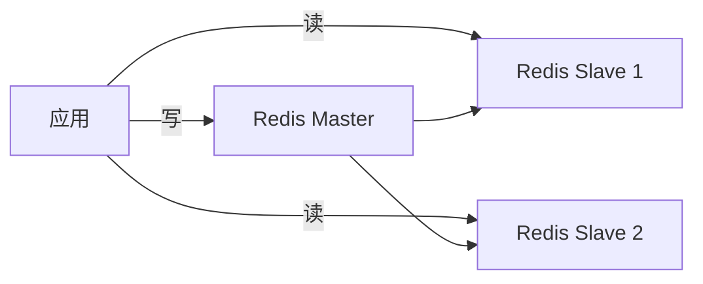

# 系统设计 - 案例 42：突发流量治理与 Redis 扩展真题模拟

## 题目

如果系统 QPS 突然提升 10 倍，你会怎么处理和设计？

进一步追问：

- 如果 10 倍流量只是临时洪峰，如何先保命？
- 如果 10 倍流量变成常态，架构如何演进？
- 如果单 Redis 节点扛不住，怎么扩展？

## 为什么这题值得深讲

这题不是在问“你知道哪些组件”。

它真正考的是：

`你能不能先判断流量问题落在哪一层，再按紧急止血、短期扩容、长期演进三个阶段处理。`

很多回答会直接说：

- 加机器
- 加缓存
- 上 MQ
- 分库分表

这些都可能对，但如果没有顺序，就不像真实生产处理。

真实线上系统遇到 10 倍 QPS，第一反应通常不是“立刻重构”，而是：

1. 先保核心链路不挂
2. 再定位瓶颈层
3. 再按读、写、存储、缓存、网络分层治理
4. 最后把临时手段沉淀成长期架构

## 面试官真正想看什么

这题通常在看下面几件事：

1. 你是否知道先止血，再优化。
2. 你是否能区分临时洪峰和长期增长。
3. 你是否能区分读流量、写流量、计算流量和连接流量。
4. 你是否知道限流、降级、扩容、缓存、MQ、分库分表各自解决什么。
5. 你是否知道 Redis 读写分离和 Redis Cluster 的区别。
6. 你是否知道 Redis Cluster 解决分片，不自动解决单热点 key。
7. 你是否能把措施和指标闭环起来。

## 第一步：先判断 10 倍 QPS 是什么类型

我会先问：

1. 是读请求涨了，还是写请求涨了？
2. 是全站均匀增长，还是单接口、单租户、单商品、单 key 热点？
3. 是真实用户，还是爬虫、攻击、重试风暴？
4. 是持续增长，还是大促、营销、热点事件导致的短时洪峰？
5. 当前瓶颈在哪：网关、应用、线程池、Redis、DB、MQ、第三方依赖？
6. 哪些功能是核心，哪些可以降级？

这一步决定后面方案。

10 倍读流量和 10 倍写流量是两道完全不同的题。

## 第二步：第一阶段，紧急止血

如果系统已经接近崩溃，第一阶段目标是：

`牺牲一部分体验，保护核心业务可用。`

### 1. 入口限流

在 CDN、WAF、API Gateway 或服务入口做限流：

- 全局 QPS 限流
- IP 限流
- 用户限流
- 租户限流
- 资源维度限流，例如商品、文章、短链、活动

限流后的语义要明确：

- 非核心请求返回 429 或“稍后再试”
- 秒杀/排队类请求进入队列
- 攻击流量直接拦截

### 2. 业务降级

快速关闭非核心能力：

- 推荐
- 评论实时展示
- 积分发放
- 个性化排序
- 非关键埋点
- 实时统计面板

保留核心能力：

- 登录
- 查询核心详情
- 下单
- 支付
- 库存预占

降级的重点不是“少做一点”，而是：

`把有限资源让给系统真正不能丢的链路。`

### 3. 熔断慢依赖

如果某个下游变慢，继续调用会拖垮上游。

要快速设置：

- 超时预算
- 慢调用熔断
- 失败率熔断
- fallback

例如优惠券推荐服务慢了，可以降级为不展示推荐券，但不能拖垮下单主链路。

### 4. 快速扩容

如果瓶颈在无状态应用层，可以水平扩容：

- K8s HPA / 手动扩容
- 增加应用实例
- 增加网关实例
- 扩消费者处理能力

但扩容不是万能的。

如果瓶颈在数据库热点行、Redis 单 key、第三方接口限额，加应用机器只会把后端打得更狠。

### 5. 防止重试风暴

10 倍流量里经常夹着重试放大。

需要检查：

- 客户端是否无脑重试
- 网关是否重试
- RPC 是否重试
- MQ 消费是否失败后立即重试

紧急阶段要把重试次数、退避和超时收紧。

## 第三步：第二阶段，定位瓶颈

止血后必须看指标，而不是靠猜。

关键指标：

- 入口 QPS、拒绝率、限流率
- 接口 P95/P99
- 应用 CPU、线程池、连接池
- Redis QPS、慢查询、热点 key、网络流量
- DB QPS、锁等待、连接数、慢 SQL
- MQ backlog、消费延迟、死信
- 下游依赖错误率和超时率

可以把瓶颈分成四类：

| 瓶颈类型 | 典型现象 | 方向 |
| --- | --- | --- |
| 读热点 | Redis / DB 被大量读打满 | 多级缓存、读写分离、热点隔离 |
| 写洪峰 | DB 写入、锁冲突、MQ backlog | 排队削峰、批量写、分片 |
| 计算热点 | CPU 打满、排序/聚合慢 | 缓存中间结果、异步预计算 |
| 连接热点 | 连接数耗尽、线程阻塞 | NIO、连接池、长短连接治理 |

## 第四步：如果 10 倍读流量变成常态

读流量治理核心是：

`缩短访问路径，减少回源。`

典型演进：


### 1. CDN 和静态化

适合：

- 图片、CSS、JS
- 静态页面
- 公共内容
- 下载资源

它解决的是：

- 源站带宽
- 地域延迟
- 静态资源请求放大

### 2. 应用本地缓存

适合：

- 热点配置
- 热门对象摘要
- 短 TTL 计数
- 极少量热点 key

价值：

- 不经过网络
- 延迟可以到微秒级
- 显著降低 Redis 压力

代价：

- 多实例不一致
- 需要 TTL 和容量控制
- 不能存权威状态

### 3. Redis 分布式缓存

适合：

- 共享热点对象
- 会话状态
- 计数器
- 读多写少映射

但 Redis 也会遇到：

- 单节点 QPS 上限
- 单 key 热点
- 网络带宽瓶颈
- 大 key

### 4. 数据库读写分离

当读压力先大于写压力，可以加从库：

- 主库负责写
- 从库负责读

但要讲代价：

- 复制延迟
- 读己之写问题
- 主从切换复杂
- 从库不适合承接强一致读

## 第五步：如果 10 倍写流量变成常态

写流量治理核心是：

`把瞬时写洪峰变成系统可承受的平稳写入，同时减少单点写热点。`

常见手段：

### 1. MQ 排队削峰

适合：

- 点赞持久化
- 日志采集
- 通知发送
- 秒杀后续下单
- 搜索索引更新

不适合：

- 必须同步确认的支付扣款
- 必须立即返回权威结果的余额更新

### 2. 批量写

把大量单条写合并成批量写：

- 批量 insert
- 批量 update
- 聚合计数
- micro-batch

点赞、日志、统计类场景尤其适合。

### 3. 幂等和去重

写流量暴涨时，重复请求也会暴涨。

必须有：

- idempotency key
- 唯一约束
- 状态机合法迁移
- 消费幂等

否则扩容只是扩大错误写入速度。

### 4. 分库分表

当单表数据量、索引大小、单机写入吞吐或备份恢复都到瓶颈，才进入分片。

分片不是第一步。

它解决容量和单机写吞吐，但引入：

- 跨分片查询
- 跨分片事务
- 全局 ID
- 扩容迁移
- 路由治理

## 第六步：单 Redis 节点扛不住怎么办

Redis 扩展要先判断：

- 是读压力大
- 是写压力大
- 是单 key 热
- 是总数据量大
- 是网络带宽满

不同问题对应不同方案。

### 方案一：读写分离

结构：



优点：

- 扩展读能力
- 主节点专注写
- 适合读多写少场景

缺点：

- 主从复制有延迟
- 写压力仍在 Master
- 主节点仍可能成为写瓶颈
- 故障切换要谨慎

适合：

- 商品详情缓存
- 用户资料缓存
- 短链映射读取

不适合单独解决：

- 单热点 key
- 写入极高
- 数据量需要横向分片

### 方案二：Redis Cluster 分片

Redis Cluster 把 key 分到 16384 个 hash slot。

路由逻辑：

```text
slot = CRC16(key) % 16384
```

每个 master 节点负责一段 slot：

```text
Node A: 0 - 5460
Node B: 5461 - 10922
Node C: 10923 - 16383
```

优点：

- 数据横向分片
- 请求分散到多个 master
- 可水平扩容
- 每个 master 可挂 slave 做高可用

代价：

- 客户端要支持 smart routing
- 跨 slot 多 key 操作受限
- reshard 迁移有复杂度
- 单 key 热点仍然打到一个 slot

### 方案三：本地缓存保护极热点

如果问题是单个热点 key，例如：

- 大 V 点赞数
- 热门短链
- 爆款商品详情

Redis Cluster 也只能把这个 key 放在一个 slot 上。

这时更有效的是：

- 应用本地短 TTL 缓存
- 请求合并 singleflight
- 热点 key 预热
- 计数类请求本地聚合
- 对大 key 做拆分

### 方案四：key 拆分

例如计数器：

```text
counter:article:10086:0
counter:article:10086:1
...
counter:article:10086:63
```

写入时随机或按用户 hash 到不同分片 key。

读取时：

- 实时求和，成本高
- 或异步聚合成总数 key

适合：

- 点赞数
- PV/UV 粗计数
- 热点活动计数

不适合：

- 强一致余额
- 需要单次读取绝对准确值的状态

## 第七步：负载均衡也要分层

10 倍流量常常会暴露入口层瓶颈。

常见负载均衡：

| 类型 | 代表 | 优点 | 缺点 |
| --- | --- | --- | --- |
| DNS 负载均衡 | 多 IP 解析 | 简单、地域调度 | 感知实时状态弱，缓存影响切换 |
| CDN | 边缘节点 | 降低延迟、减轻源站 | 更适合静态和可缓存内容 |
| 软件负载均衡 | Nginx / Envoy | 灵活、成本低、可治理 | 需要机器资源和运维 |
| 硬件负载均衡 | F5 | 性能强、稳定 | 成本高，扩展不灵活 |

大多数业务会组合使用：

```text
DNS / CDN -> L4/L7 LB -> API Gateway -> Service
```

不要把所有流量治理都压在某一层。

## 第八步：长期架构演进顺序

如果 10 倍流量从偶发变成常态，我会按这个顺序演进：

1. 明确核心链路和降级开关。
2. 完成容量估算和瓶颈定位。
3. 静态资源 CDN 化。
4. 热点读引入多级缓存。
5. 派生写和非关键写进入 MQ。
6. 数据库读写分离。
7. Redis 从单节点演进到主从或 Cluster。
8. 对热点 key 做本地缓存、拆分或聚合。
9. 数据库按主访问模式分片。
10. 建立压测、限流阈值、容量水位和演练机制。

## 面试版回答

如果系统 QPS 突然提升 10 倍，我不会第一时间说重构，而会先分阶段处理。第一阶段先保命：在网关和服务入口做限流，识别攻击、爬虫和重试风暴；降级推荐、评论、积分、实时统计等非核心功能；给慢依赖设置超时和熔断；如果瓶颈在无状态应用层，再快速水平扩容。

止血后我会看指标定位瓶颈，区分是读流量、写流量、计算流量还是连接流量。如果 10 倍读流量变成常态，就重点缩短读路径：静态资源上 CDN，热点对象进本地缓存，公共数据进 Redis，数据库用读写分离分担读压力。如果 10 倍写流量变成常态，就重点削峰和分散写热点：允许异步的写入进 MQ，消费者按下游能力批量写；强一致写保留同步链路，用幂等键和状态机防重复；当单库单表到达容量或写入瓶颈，再做分库分表。

如果单 Redis 扛不住，我会先判断是读压力、写压力、数据量还是单 key 热点。读多写少可以做 Redis 主从读写分离；数据量和整体 QPS 需要横向扩展时用 Redis Cluster，基于 16384 个 slot 分片。但 Cluster 不能自动解决单热点 key，这时要用本地缓存、请求合并、计数分桶或聚合写来保护热点。

## 高频追问

### 追问 1：为什么不能只靠扩容

如果瓶颈在无状态应用，扩容有效；如果瓶颈在数据库热点行、Redis 单 key、第三方限额，扩容应用只会把后端打得更快。

### 追问 2：什么时候用 MQ

当写请求允许异步完成、用户只需要“已受理”或“处理中”语义时，MQ 适合削峰。支付扣款、余额变更这类必须同步确认的权威状态不能随便 MQ 化。

### 追问 3：Redis 主从和 Cluster 有什么区别

主从主要扩读和高可用，写仍在主节点。Cluster 通过 slot 把数据和请求分片到多个 master，解决容量和整体吞吐扩展。

### 追问 4：Redis Cluster 能解决热点 key 吗

不能。单 key 只会落到一个 slot 和一个 master。热点 key 要靠本地缓存、请求合并、key 拆分、计数聚合或业务限流解决。

### 追问 5：QPS 10 倍后什么时候分库分表

当索引体积、单表数据量、单机写吞吐、锁冲突或备份恢复窗口成为瓶颈时才分片。分片不是第一步，它会引入跨分片查询和事务复杂度。

## 常见失分点

1. 一上来就分库分表，不先止血和定位瓶颈。
2. 把读流量和写流量混在一起回答。
3. 认为加缓存能解决所有高并发。
4. 认为 Redis Cluster 自动解决热点 key。
5. 降级只说“关闭一些功能”，不说明保哪些核心链路。
6. 不讲重试风暴。
7. 不把措施和指标闭环起来。

## 自测问题

1. 突发 QPS 10 倍时，哪些动作属于止血，哪些属于长期架构演进？
2. 读流量 10 倍和写流量 10 倍分别应该优先治理哪几层？
3. Redis 主从读写分离和 Redis Cluster 分别解决什么问题？
4. 为什么单热点 key 不能靠 Redis Cluster 自动解决？
5. 什么时候该把写请求放进 MQ，什么时候不该？
