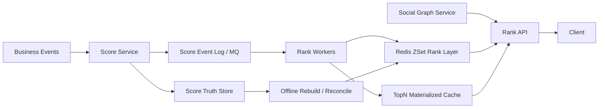
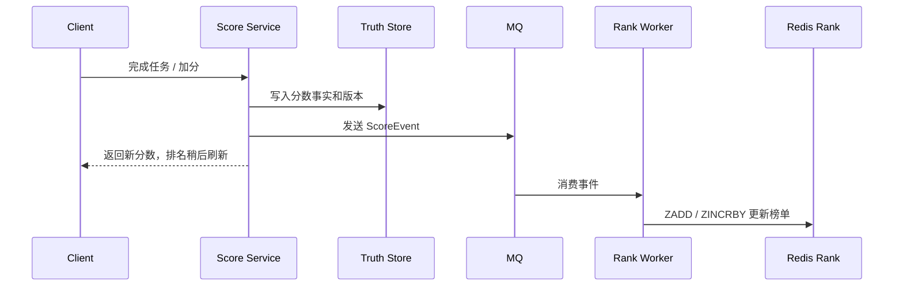

# 系统设计 - 案例 44：排行榜系统真题模拟

## 题目

设计一个排行榜系统，支持游戏积分、直播打赏、学习刷题或活动积分榜。

要求支持：

- 全局榜 TopN
- 用户自己的当前分数和名次
- 用户附近的排名
- 好友榜
- 分段榜，例如青铜 / 白银 / 黄金、地区榜、学校榜、赛季榜
- 亿级用户规模
- 高并发分数更新和榜单读取

进一步追问：

- Redis `ZSet` 能不能直接放 1 亿用户？
- Redis Cluster 能不能自动把一个超大 `ZSet` 拆开？
- 好友榜是不是也要给每个用户维护一个 `ZSet`？
- 全局精确排名太贵时，怎么做分片排行榜和近似排名？

## 为什么这题值得深讲

排行榜是 Redis `ZSet` 的经典场景，但面试里只答：

- `ZADD`
- `ZINCRBY`
- `ZREVRANGE`
- `ZREVRANK`

只能说明你会用命令。

真正有区分度的是：

`你知道单个 ZSet 很适合中小规模实时榜，但到了亿级用户、好友榜、分段榜、全局精确排名时，问题会从命令使用变成分片、热点、近似、缓存和数据恢复。`

这题最容易被追问的点是：

- 一个大榜是不是一个 key
- Redis Cluster 是否能拆单个大 key
- 全局 TopN 和任意用户排名是不是同一种查询
- 好友榜是实时算还是预计算
- 分段榜如何避免全局榜成为唯一瓶颈
- Redis 是否是最终真相源

## 面试官真正想看什么

这题通常在看下面几件事：

1. 你是否知道 `ZSet` 适合做实时 TopN、名次和分数查询。
2. 你是否知道单个超大 `ZSet` 是 big key，也会成为单 Redis 分片热点。
3. 你是否知道 Redis Cluster 按 key 分槽，不能自动拆开同一个 `ZSet`。
4. 你是否能把全局榜、分段榜、好友榜拆成不同读模型。
5. 你是否能区分精确排名和近似排名的成本。
6. 你是否能用分片榜做全局 TopN 合并。
7. 你是否知道 Redis 排行榜需要数据库、事件日志或 OLAP 兜底恢复。

## 一开始先收敛题目语义

我会先问：

1. 排行分数是累计积分、最高分、最近一次成绩，还是多因子热度？
2. 榜单周期是日榜、周榜、月榜、赛季榜，还是永久榜？
3. 全局榜需要展示前多少名？
4. 用户自己的名次是否必须精确？
5. 好友数量通常是多少，是否存在大 V 或超大关注列表？
6. 分段是按地区、等级、学校、游戏段位，还是活动房间？
7. 排名更新延迟能接受多少，毫秒级、秒级还是分钟级？

如果面试官没有继续补充，我会收敛成：

- 支持赛季维度全局榜、分段榜和好友榜
- 分数更新后榜单允许 1 到 5 秒最终一致
- TopN 和高排名用户尽量精确
- 长尾用户可以展示近似排名或百分位
- Redis 承接在线排行榜查询
- MySQL / 事件日志 / OLAP 保存最终事实和可恢复数据

## 第一步：先定义核心读写场景

排行榜不是一个查询，而是一组查询。

### 1. 写入分数

用户完成一次行为后产生分数变化：

```text
ScoreEvent
- event_id
- user_id
- delta_score
- absolute_score
- season_id
- segment_id
- event_time
- version
```

分数可以是增量，也可以是最终绝对值。

面试里要说清楚：

- 如果是增量，消费者必须幂等，否则重复消费会加分两次。
- 如果是绝对值，要用版本号或更新时间避免旧分数覆盖新分数。

### 2. 全局榜 TopN

例如：

```text
Top 100 players in season 2026s2
```

这是非常热的读，一般会被缓存。

### 3. 用户自己的排名

例如：

```text
user_123 当前第几名
```

这比 TopN 更难，因为它可能发生在任意用户上。

### 4. 附近排名

例如：

```text
第 100234 到 100244 名
```

单个 `ZSet` 很容易做，分片后会变难。

### 5. 好友榜

例如：

```text
我和我的好友中谁分数最高
```

它的主约束不是全局排序，而是先取好友集合，再按分数排序。

### 6. 分段榜

例如：

```text
黄金段位榜
上海地区榜
清华大学榜
2026 第二赛季周榜
```

分段榜天然是对全局榜的切分，也是排行榜扩展性的重要抓手。

## 第二步：小中规模用 Redis ZSet 怎么设计

如果规模还没有到亿级，一个榜一个 `ZSet` 是非常合适的。

```text
Key: rank:global:season:2026s2
Type: ZSet
Member: user_id
Score: score
```

常见操作：

```text
ZADD rank:global:season:2026s2 12880 user_123
ZINCRBY rank:global:season:2026s2 20 user_123
ZREVRANGE rank:global:season:2026s2 0 99 WITHSCORES
ZREVRANK rank:global:season:2026s2 user_123
ZREVRANGE rank:global:season:2026s2 999 1009 WITHSCORES
```

分段榜也是类似：

```text
rank:segment:gold:season:2026s2
rank:region:shanghai:season:2026s2
rank:school:tsinghua:season:2026s2
```

这时 Redis 的价值很明确：

- `member -> score` 查分数快
- `score -> ordered range` 查 TopN 快
- 写入和排名查询都是 `O(log n)` 量级

但这个方案有一个前提：

`单个榜的 key 不要大到成为内存、迁移、慢操作和热点风险。`

## 第三步：为什么亿级用户不能只靠一个大 ZSet

一个 1 亿用户的 `ZSet` 有几个问题。

### 1. 它是 big key

`ZSet` 底层维护字典和跳表，内存开销不只是 `user_id + score`。

1 亿个 member 会带来：

- 大量内存占用
- RDB / AOF 重写压力
- 主从同步压力
- 故障恢复时间长
- 迁移和扩容困难

### 2. Redis Cluster 不能拆一个 key

Redis Cluster 是按 key 映射到 slot。

也就是说：

```text
rank:global:season:2026s2
```

这个 key 只能落到一个 slot，再落到一个主节点。

Cluster 可以把很多 key 分散到不同节点，但不能把同一个 `ZSet` 的内部元素自动拆到多个节点。

所以：

`一个超大 ZSet 本质上仍然是单分片问题。`

### 3. 全局榜会变成热点

全局榜 TopN 很热，用户查自己名次也可能很热，所有写入也都打同一个 key。

读热点可以用缓存挡一部分，但写热点仍然会集中到单节点。

### 4. 任意用户精确排名成本很高

单 ZSet 的 `ZREVRANK` 很方便。

但如果为了扩展把榜单拆成多个分片，要回答“某个用户全局第几名”，就不再是一次命令能解决。

## 第四步：总体架构

排行榜系统可以分成三层：



核心分工：

| 层 | 作用 |
| --- | --- |
| Score Service | 校验业务事件，计算分数变化 |
| Event Log / MQ | 承接异步更新、重放和恢复 |
| Truth Store | 保存用户最终分数、赛季分数、分段归属 |
| Rank Worker | 消费分数事件，更新 Redis 榜单 |
| Redis ZSet | 在线实时榜、TopN、分段榜、局部排名 |
| Materialized Cache | 缓存热门 TopN、榜单页、候选集 |
| Offline Rebuild | 从事实数据重建 Redis，做对账修正 |

关键判断：

`Redis 是在线排名层，不是唯一真相源。`

如果 Redis 丢数据或重建，需要能从事实表或事件日志恢复。

## 第五步：分段榜是第一层扩展

不要一开始就把所有人塞进全局榜。

很多业务天然有分段：

- 游戏段位
- 地区
- 学校
- 活动房间
- 租户
- 赛季
- 周期窗口

例如：

```text
rank:mode:solo:segment:gold:season:2026s2
rank:mode:solo:segment:diamond:season:2026s2
rank:region:us-west:season:2026s2
rank:tenant:t_001:week:2026w23
```

分段榜的好处：

1. 单榜规模下降。
2. 查询更符合用户心智。
3. 热点可以按段位或地区隔离。
4. 榜单过期和归档更容易。

分段归属要单独维护：

```text
UserRankProfile
- user_id
- season_id
- segment_id
- region_id
- school_id
- current_score
- updated_at
```

如果用户从黄金升到铂金，要处理迁移：

```text
ZREM rank:segment:gold:season:2026s2 user_123
ZADD rank:segment:platinum:season:2026s2 12880 user_123
```

这类跨榜迁移最好由 Rank Worker 用同一个事件驱动，保证最终收敛。

## 第六步：分片排行榜怎么做

当一个全局榜还是太大，就需要逻辑分片。

常见方式是按 `user_id` hash 分片：

```text
shard_id = hash(user_id) % 1024

rank:global:season:2026s2:shard:0001
rank:global:season:2026s2:shard:0002
...
rank:global:season:2026s2:shard:1023
```

每个分片内部仍然是精确 `ZSet`。

### 写入

更新用户分数时，只写用户所在分片：

```text
ZADD rank:global:season:2026s2:shard:0421 12880 user_123
```

如果还要维护分段榜，也写对应分段榜：

```text
ZADD rank:segment:gold:season:2026s2:shard:0421 12880 user_123
```

这样写入压力会被摊到多个 Redis key 和多个 Redis 节点。

### 查询全局 TopN

不能直接 `ZREVRANGE` 一个大 key。

做法是：

1. 从每个分片取局部 TopK。
2. 在应用层或聚合服务做 k-way merge。
3. 得到全局 TopN。
4. 把结果写入物化缓存。

例如要取全局 Top100，有 1024 个分片：

```text
每个 shard 取 Top100 候选
合并 1024 * 100 个候选
产出全局 Top100
缓存成 rank:global:season:2026s2:top:100
```

这个查询不适合每次用户请求实时 fanout。

更常见的做法是：

- Rank Aggregator 每 1 到 5 秒刷新一次全局 TopN
- API 直接读物化结果
- 对实时性要求极高的前几名，可以提高刷新频率或增量维护

### 查询用户全局精确排名

如果用户在分片 `s`，他的分数是 `score`。

全局排名可以这样算：

```text
rank = 1 + sum(每个 shard 中 score 大于当前用户 score 的人数)
```

Redis 可以对每个分片执行 `ZCOUNT <shard-key> (score +inf`，这里 `(score` 表示只统计严格高于当前分数的用户。

如果业务要求同分严格排序，还要再统计“同分但 tie-breaker 排在当前用户前面”的人数；如果业务接受同分并列，只统计更高分人数即可。

但这意味着：

- 要访问所有分片
- 分片数越多，查询越贵
- 高 QPS 下不能每个用户请求都这么算

所以这个方案只适合：

- 低频精确查询
- 后台任务异步刷新
- 高价值用户或前排用户
- 用户点击“查看精确名次”时再计算

### 查询附近排名

单个 `ZSet` 可以用 `ZREVRANGE rank-5 rank+5`。

分片后，“全局附近的人”变得很贵，因为你需要知道跨分片排序后的邻居。

常见处理是：

- TopN 精确展示
- 用户所在分段内精确展示
- 用户附近排名做近似
- 或者只展示“你超过了 93.2% 的用户”

这就是面试里要说的 trade-off：

`分片提高写入和容量，但牺牲任意用户全局精确邻居查询的便宜程度。`

## 第七步：近似排名怎么做

亿级用户下，长尾用户不一定需要每次都看到精确名次。

近似排名的目标是：

`用更低成本回答用户大概排在哪里。`

### 方案 A：分数直方图

把分数按区间分桶：

```text
score 0 - 99
score 100 - 199
score 200 - 299
...
```

维护每个桶里有多少人：

```text
rank:histogram:season:2026s2
bucket_0000 -> 3829000
bucket_0100 -> 2193000
bucket_0200 -> 943000
```

用户分数是 `235` 时：

```text
近似排名 = 高于 300 分的所有桶人数 + 200-299 桶内估计位置
```

桶越细，误差越小，但更新和存储成本越高。

这个方案适合展示：

- 约第 12.4 万名
- 超过 93.2% 的用户
- 处于 Top 1%

### 方案 B：TopN 精确 + 长尾近似

真实产品里最常见的是混合策略：

| 用户范围 | 排名策略 |
| --- | --- |
| Top 1 万 | 精确排名 |
| Top 100 万 | 分片聚合或周期刷新 |
| 长尾用户 | 近似排名 / 百分位 |

原因很简单：

- 前排用户最在意精确名次
- 普通用户更在意大概位置和成长反馈
- 产品上也常展示“超过 xx% 用户”而不是精确到个位数

### 方案 C：周期性快照

离线任务每隔一段时间生成全量排名快照：

```text
rank_snapshot
- user_id
- season_id
- exact_rank
- score
- computed_at
```

在线请求读最近快照，再叠加近期增量做修正或提示：

```text
当前约第 123456 名，排名每分钟刷新
```

这个方案适合：

- 日榜 / 周榜
- 精确性要求不强
- 用户规模特别大
- 离线计算资源充足

## 第八步：好友榜怎么做

好友榜不要本能地给每个用户维护一个 `ZSet`。

如果有 1 亿用户，每个用户一个好友榜 key，会产生：

- 海量 key
- 更新放大
- 好友关系变化时维护复杂
- 某个用户加分后，要更新所有好友的榜，写放大不可控

更常见的方式是读时计算。

### 读时计算好友榜

流程：

1. 从社交关系服务取用户好友列表。
2. 按好友 `user_id` 所在榜单分片分组。
3. 批量查询这些好友的分数，例如 `ZMSCORE`。
4. 应用层排序。
5. 加上当前用户自己。
6. 返回前 N 名。

```text
friends = SocialGraph.getFriends(user_id)
scores = RankStore.batchGetScores(friends + self)
sort(scores desc)
return topN
```

这个方案成立的前提是：

- 普通用户好友数量有限
- 可以批量查询
- 好友榜允许几十毫秒到几百毫秒延迟
- 结果可以短 TTL 缓存

### 好友很多怎么办

如果好友或关注对象很多，例如几万、几十万：

- 限制好友榜只看互关好友或最近互动好友
- 对大 V / 超大图用户做异步预计算
- 缓存好友榜结果
- 分页查询时只返回 TopN，不支持任意深翻
- 使用近似策略或离线快照

面试里可以这样说：

`好友榜的关键不是 Redis ZSet，而是避免把每个用户的好友榜预先物化成一个独立榜单。普通用户读时算，大图用户预计算或降级。`

## 第九步：榜单周期和过期怎么处理

排行榜一般不是永久累积一个 key。

常见周期：

```text
rank:global:day:20260609
rank:global:week:2026w24
rank:global:month:202606
rank:global:season:2026s2
```

一次分数事件可能要更新多个窗口：

```text
ZINCRBY rank:global:day:20260609 20 user_123
ZINCRBY rank:global:week:2026w24 20 user_123
ZINCRBY rank:global:season:2026s2 20 user_123
```

工程上常用异步 worker 统一更新，避免业务接口同步打太多 Redis 命令。

过期策略：

- 日榜保留 7 到 30 天
- 周榜保留若干周
- 赛季榜赛季结束后归档
- 热门历史榜可以落库或落对象存储

如果榜单只展示 TopN，可以周期性 `ZREMRANGEBYRANK` 裁剪长尾。

但要注意：

`如果裁剪长尾，就不能再用这个 ZSet 回答所有用户的精确排名。`

## 第十步：同分排序怎么处理

同分是排行榜绕不开的问题。

常见规则：

- 同分并列
- 同分时先达到该分数的人靠前
- 同分时最近活跃的人靠前
- 同分时按 user_id 稳定排序

Redis `ZSet` 的 score 是浮点数，同分时会按 member 字典序排序。

可以有几种做法：

### 方案 A：接受同分并列

最简单，也最稳。

产品展示时可以显示：

```text
第 100 名，和 3 人并列
```

### 方案 B：组合分数

把主分数和时间因子组合成一个 Redis score。

但要小心 Redis score 的精度边界。不要无限制地把大整数、毫秒时间戳和业务分数硬塞进一个 double。

适合在分数范围可控时使用。

### 方案 C：主分数放 ZSet，严格规则放应用层

Redis 负责按主分数筛候选，应用层再根据 `score, reached_at, user_id` 做稳定排序。

这更适合严格榜单和合规榜单。

## 第十一步：读路径怎么优化

### 全局 TopN

全局 TopN 是高频热点读。

不要每次请求都打 `ZREVRANGE`。

更稳的方式：

- Redis ZSet 保存原始实时榜
- Rank Aggregator 生成 TopN JSON 或列表缓存
- API 本地缓存 1 到 3 秒
- CDN / 边缘缓存只用于公开且可延迟的活动榜

### 用户自己的分数

用户自己的分数可以从：

- Redis `ZSCORE`
- 独立 user score cache
- Truth Store

读取。

如果分数刚更新，接口可以直接返回本次更新后的分数，排名稍后刷新。

### 用户自己的名次

策略可以分层：

- 小榜：直接 `ZREVRANK`
- 分段榜：查所在分段 `ZREVRANK`
- 大全局榜：优先返回快照或近似排名
- 点击查看精确排名：异步或低频 fanout 到分片计算

### 好友榜

好友榜结果可以按用户缓存：

```text
rank:friend:user_123:season:2026s2
TTL: 10 - 60s
```

不用强行实时失效。

用户进入排行榜页面时刷新一次，体验通常足够。

## 第十二步：写路径和一致性

写路径不要把所有事情放在用户请求里同步完成。

推荐链路：

1. 用户完成业务行为。
2. Score Service 校验并写入分数事实或事件。
3. 发送 `ScoreEvent` 到 MQ。
4. Rank Worker 消费事件。
5. 更新对应 Redis 榜单。
6. 更新物化 TopN 候选或等待聚合任务刷新。



一致性表达：

- 分数事实以 DB / 事件日志为准。
- Redis 榜单允许秒级延迟。
- 重复事件必须幂等。
- Redis 丢失后可以重建。
- 榜单展示要标明刷新时间或用产品文案弱化强实时预期。

## 第十三步：Redis 挂了或榜单丢了怎么办

Redis 排行榜不应该是唯一真相源。

恢复路径：

1. 从 Truth Store 扫描当前赛季用户分数。
2. 按分片批量重建 ZSet。
3. 从事件日志 replay 最近增量。
4. 对比 Redis count、TopN、抽样用户名次和 DB 分数。
5. 切回在线读。

运行时要有对账：

- Redis `ZSCORE` 与 Truth Store 分数抽样比较
- 分片 ZSet 人数与用户分数表计数比较
- TopN 与离线计算结果比较
- Rank Worker lag 监控
- 榜单刷新时间监控

## 第十四步：容量估算可以怎么讲

假设：

- 1 亿用户
- 日活 1000 万
- 峰值分数更新 5 万 QPS
- 榜单读取 20 万 QPS
- 全局 TopN 占读取 60%
- 好友榜占读取 20%
- 查自己排名占读取 20%

推导：

- 全局 TopN 必须物化缓存，否则 Redis 热点读太重。
- 分数更新不能写单个全局 ZSet，否则单 key 写热点。
- 好友榜如果平均好友 300，可以读时批量取分数并排序。
- 如果平均好友上万，要限制范围、缓存或异步预计算。
- 查自己全局精确排名如果每次 fanout 1024 个分片，20% 读流量无法承受。

所以方案应该是：

1. 分段榜优先，降低单榜规模。
2. 全局榜按用户 hash 分片。
3. TopN 由聚合服务周期合并并缓存。
4. 前排用户精确排名，长尾用户近似排名。
5. 好友榜普通用户读时算，大图用户缓存或预计算。

## 第十五步：一套可以直接说的面试回答

如果让我设计排行榜系统，我不会只说 Redis `ZSet`。我会先把榜单拆成全局榜、分段榜、好友榜和用户自己名次四类读模型。中小规模下，一个榜单一个 `ZSet` 很合适，分数更新用 `ZADD/ZINCRBY`，TopN 用 `ZREVRANGE`，查名次用 `ZREVRANK`。

但到亿级用户时，单个全局 `ZSet` 会变成 big key 和热点 key。Redis Cluster 只能按 key 分槽，不能把一个 `ZSet` 的内部元素自动拆到多个节点。所以我会先利用业务分段，比如赛季、地区、段位、学校，把榜单自然切小；如果全局榜仍然很大，再按 `user_id` hash 做分片排行榜。

分片之后，每个 shard 内部仍然是精确 `ZSet`。全局 TopN 由聚合服务从每个 shard 拉局部 TopK，再做 k-way merge，结果物化缓存给 API 读。用户的全局精确排名可以通过所有 shard 的 `ZCOUNT <shard-key> (score +inf` 汇总得到；如果有严格同分排序，再补 tie-breaker 统计。但这个操作很贵，不适合每次请求都做。前排用户或低频查询可以精确算，长尾用户用分数直方图、百分位或周期性快照做近似排名。

好友榜我不会给每个用户维护一个独立 `ZSet`，那会带来巨大的 key 数和写放大。普通用户的好友榜可以读时从社交图服务取好友列表，批量查这些好友的分数，在应用层排序并短 TTL 缓存。对于好友数量特别大的用户，再做预计算、限制范围或近似展示。

最后，Redis 只是在线排名层，不是最终真相源。分数事实要写入数据库或事件日志，Rank Worker 异步更新 Redis；Redis 丢失时可以从事实表和事件日志重建，运行时通过抽样对账、worker lag 和 TopN 校验保证榜单最终收敛。

## 高频追问

### 追问 1：Redis ZSet 能不能放 1 亿用户

技术上可以往大 key 里塞很多元素，但工程上不建议把 1 亿用户放进一个 `ZSet`。

原因是它会成为 big key 和单分片热点，内存、持久化、主从同步、迁移、恢复都会变重。Redis Cluster 也不能自动拆这个 key。

### 追问 2：Redis Cluster 不是能分片吗

Redis Cluster 分的是 key，不是 key 内部的元素。

很多小榜单 key 可以被分散到不同节点；但一个 `rank:global` 大 `ZSet` 仍然只能在一个 slot 上。

### 追问 3：全局 Top100 怎么从分片榜里拿

每个分片取局部 TopK，聚合服务做 k-way merge，得到全局 Top100，再把结果缓存。线上请求优先读物化缓存，而不是每次实时扫所有分片。

### 追问 4：某个用户全局第几名怎么查

精确算法是拿到用户分数，然后对每个 shard 统计比他分数高的人数，最后求和。

但这个操作要 fanout 到所有 shard，成本高。高 QPS 场景下应该只对前排或低频查询精确计算，长尾用户走近似排名或快照。

### 追问 5：好友榜为什么不每人一个 ZSet

因为写放大会爆炸。一个用户分数变化后，如果要更新所有好友的个人榜单，就要写很多份。

普通好友榜更适合读时计算：取好友列表，批量查分数，应用层排序，短 TTL 缓存。

### 追问 6：分段榜和分片榜有什么区别

分段榜是业务维度切分，例如地区、段位、学校、赛季。

分片榜是技术维度切分，例如按 `user_id hash` 把同一个全局榜拆成多个 shard。

最好先用业务分段降低规模，再用技术分片兜住全局榜。

### 追问 7：近似排名能接受吗

要看产品语义。

竞赛颁奖、奖金结算、前排名次必须精确；普通长尾用户的成长反馈可以用近似排名、百分位和周期快照。

回答时要说清：

`不是因为算不准，而是精确排名的成本和用户价值不匹配。`

## 常见失分点

1. 只会说 `ZSet` 命令，不讲规模和热点。
2. 误以为 Redis Cluster 能自动拆一个大 `ZSet`。
3. 给每个用户维护好友榜，导致写放大失控。
4. 分不清业务分段和技术分片。
5. 认为全局 TopN 和任意用户精确排名一样便宜。
6. 不愿承认长尾用户可以近似排名。
7. 把 Redis 当最终真相源，没有重建和对账方案。
8. 同分排序靠随意拼 double，不考虑精度边界。

## 复习问题

1. 为什么单个超大 `ZSet` 在 Redis Cluster 里仍然是单分片问题？
2. 分段榜和分片榜分别解决什么问题？
3. 分片排行榜如何计算全局 TopN？
4. 分片排行榜如何计算某个用户的精确全局排名？为什么这个操作贵？
5. 好友榜为什么通常读时计算，而不是给每个用户维护一个榜？
6. 什么情况下必须精确排名，什么情况下可以近似排名？
7. 如果 Redis 排行榜丢失，你如何从事实数据恢复？
