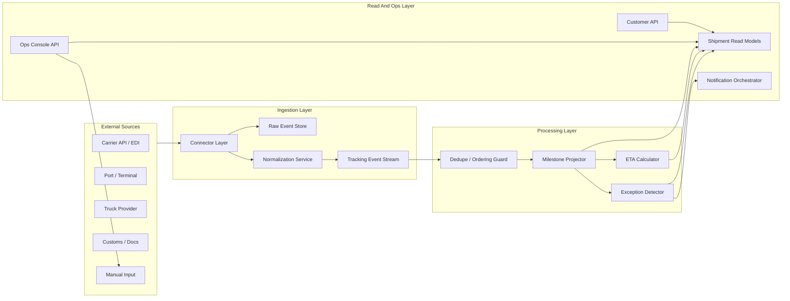

# 系统设计 - 案例 45：Flexport 货运可视化与异常追踪系统真题模拟

## 题目

设计一个类似 Flexport 的全球货运可视化与异常追踪系统，支持：

- 客户查看自己的国际货运 shipment
- 按 container、purchase order、SKU 追踪货物
- 展示关键 milestone，例如订舱、提柜、装船、离港、到港、清关、派送、签收
- 接入船司、航空公司、港口、卡车、海关、仓库等外部事件源
- 计算和更新 ETA
- 当延误、清关卡住、文件缺失、港口异常、运输节点超时等情况发生时，触发 exception alert
- 支持运营人员手动修正事件、补录 milestone、处理异常

先不做：

- 复杂报价和竞价系统
- 运价合同管理
- 完整海关申报系统
- 财务结算和账单系统
- 复杂 ML ETA 模型，只设计 ETA 数据流和接口

## 为什么这题像 Flexport 会出的题

Flexport 的业务本质不是普通快递，而是国际货运和供应链协同。  
这里的难点不只是“查一个物流单号”，而是：

- 一个 shipment 可能跨 ocean、air、truck、rail 多段运输
- 数据来自很多外部系统，格式、延迟、可靠性都不同
- 同一个货物可以从 shipment、container、PO、SKU 多个维度查看
- 事件可能乱序、重复、缺失、被人工修正
- 客户和运营都需要知道“现在卡在哪、预计什么时候到、要不要介入”

所以这题真正考的是：

- 如何建模复杂物流对象
- 如何接入不可靠外部事件
- 如何把原始事件归一化成业务 milestone
- 如何处理乱序、幂等、补录、修正
- 如何做 ETA 和异常检测
- 如何支持客户查询和运营人工介入

这比“设计一个包裹查询系统”更接近真实国际货代平台。

## 面试官真正想看什么

这题通常在看下面几件事：

1. 你会不会先把 `Shipment / Leg / Container / PO / SKU / Milestone` 这些对象拆清楚
2. 你能不能把外部事件接入、事件标准化、业务状态更新、查询视图拆成不同链路
3. 你会不会处理事件乱序、重复、缺失和人工修正
4. 你能不能区分 shipment 当前状态、milestone 历史、原始事件日志和客户查询视图
5. 你会不会设计 exception detection，而不是只展示轨迹
6. 你能不能讲清 ETA 是派生结果，不应该覆盖事件真相
7. 你会不会给运营人员留人工处理台、审计和回放能力

---

## 一开始先别急着画架构，先澄清业务边界

### 面试官开题

**面试官：**  
假设你在 Flexport，要设计一个 shipment tracking 系统。客户可以看到自己的货物现在在哪、下一步是什么、预计什么时候到。如果出现延误或异常，要提醒客户和运营。你会怎么设计？

### 候选人思考

**候选人思考：**  
这不是普通物流单号查询。国际货运是长链系统，而且数据源很乱。我要先问运输模式、追踪粒度、事件源、实时性、异常类型和人工修正。然后把系统拆成写入事件流和读取视图。

### 候选人澄清问题

**候选人：**  
我先确认几个边界：

1. 运输模式先支持 ocean，还是 ocean、air、truck 都要支持？
2. 客户查询粒度是 shipment 级别，还是 container、PO、SKU 级别？
3. 外部事件源有哪些？船司 API、EDI、港口系统、卡车 GPS、海关状态、人工录入都算吗？
4. 客户对实时性的期待是什么？分钟级、小时级，还是接近实时？
5. ETA 是简单规则计算，还是要接 ML 模型？
6. 异常提醒包括哪些类型？延误、文件缺失、清关卡住、节点超时、路线偏离？
7. 运营人员是否可以手动修正 milestone 或关闭异常？

**面试官：**  
先重点支持 ocean freight，但设计要能扩展到 air 和 truck。客户可以按 shipment、container、PO、SKU 看。事件源包括 carrier API、EDI、港口事件、卡车事件和人工录入。实时性不要求毫秒级，但希望分钟级到小时级更新。ETA 可以先规则化，后续能接模型。异常包括延误、节点超时、文件缺失和清关卡住。运营可以人工修正。

### 候选人收敛题目

**候选人回答：**  
那我会把题目收敛成一个国际货运可视化系统：

- 以 shipment 为主业务对象
- shipment 下可以有多个 container
- container 里可以关联多个 purchase order 和 SKU
- shipment 可以包含多段 leg，例如卡车到港、海运、目的港卡车派送
- 外部事件进入系统后先变成标准化 tracking event
- 标准事件再推进 shipment milestone 和 exception 状态
- 客户查询的是一个物化后的可视化视图
- 运营可以人工补录和修正，但所有修正都要审计

核心边界是：  
原始事件日志是事实输入，milestone 和 ETA 是派生状态，客户页面是查询视图。

---

## 第一步：明确非功能目标

### 面试官追问

**面试官：**  
除了功能需求，你觉得这个系统的非功能目标是什么？

### 候选人思考

**候选人思考：**  
这类 B2B 物流系统不像短视频 feed 那样追求毫秒级刷新，也不像支付那样每一步都强一致。它更重视数据可追溯、客户隔离、外部事件最终收敛、运营可介入，以及客户查询稳定。

### 候选人回答

**候选人回答：**  
我会把非功能目标分成五类。

第一，查询延迟：

```text
客户 shipment list / detail P95 < 300ms
运营后台常规查询 P95 < 500ms
复杂历史事件和审计查询可以秒级
```

所以客户查询不能每次从原始事件现算，要维护 read model。

第二，数据新鲜度：

```text
外部事件进入后，分钟级更新到客户视图
部分 carrier / port source 可能天然是小时级延迟
客户页面要显示 last_updated_at / data freshness
```

这说明系统不承诺所有事件实时，但要让用户知道数据新鲜度。

第三，正确性和可追溯：

```text
原始事件不能丢
标准化事件可以重放
milestone 和 ETA 是派生状态
人工修正必须有审计日志
客户可见状态要能解释来源
```

这比单纯低延迟更重要。

第四，可用性和隔离：

```text
某个 carrier API 挂了，不能影响其他 carrier
某个客户事件量暴涨，不能拖垮全局 pipeline
读路径和写路径解耦
```

第五，权限和合规：

```text
客户只能看到自己的 shipment、container、PO、SKU
运营人员按角色、客户、区域授权
所有人工修改、查看敏感文件和关闭异常都要审计
```

用一句话总结：

```text
这个系统的目标不是追求每个外部事件毫秒级同步，
而是让跨来源、乱序、延迟的数据最终变成可查询、可解释、可审计的货运状态。
```

---

## 第二步：容量估算

### 面试官追问

**面试官：**  
你估一下量级。

### 候选人思考

**候选人思考：**  
这题不能只估客户 QPS。更重要的是 shipment 数、container 数、事件写入量、查询 QPS、通知量。国际货运事件不像 IM 那么高 QPS，但数据正确性、可追踪和外部源可靠性更重要。

### 候选人计算过程

**候选人回答：**  
我先给一组合理假设：

- 活跃客户：`1 万`
- 活跃 shipment：`100 万`
- 活跃 container：`300 万`
- 每个 shipment 平均 `3` 个 container
- 每个 container 平均 `20` 个 tracking event
- 每天新增或更新事件：`2000 万`
- 客户查询峰值：`5000 QPS`
- 运营后台查询和处理峰值：`1000 QPS`
- 异常通知每天：`100 万` 级别

事件写入 QPS：

```text
事件 / day = 2000 万
平均写入 QPS = 2000 万 / 86400 ≈ 231 QPS
峰值按 20 倍估算 ≈ 4000 - 5000 QPS
```

查询 QPS：

```text
客户查询峰值 ≈ 5000 QPS
运营查询峰值 ≈ 1000 QPS
总读峰值 ≈ 6000 QPS
```

存储量：

```text
如果每条标准事件按 2KB 估算
2000 万事件 / day * 2KB ≈ 40GB / day
加索引、副本、原始 payload 后可能到 100GB+ / day
```

如果保留 2 年：

```text
100GB / day * 730 ≈ 73TB
```

这个量级说明：

- 事件日志要按 append-only 和冷热分层设计
- 查询不能每次扫事件重算
- 需要为客户页面维护 shipment/container 的读模型
- 外部事件写入量不算极高，但质量和顺序非常复杂

---

## 第三步：API 与核心对象建模

### 面试官追问

**面试官：**  
你会怎么设计 API 和建模这些货运对象？

### 候选人回答

**候选人回答：**  
我会先从访问模式定义 API，再反推数据模型。

### 客户查询 API

客户最常用的是列表、详情和按不同业务对象反查。

```text
GET /shipments?status=&eta_before=&cursor=
GET /shipments/{shipment_id}
GET /shipments/{shipment_id}/timeline
GET /containers/{container_number}
GET /purchase-orders/{po_id}/shipments
GET /skus/{sku_id}/shipments
```

这里要注意：

- 列表接口用 cursor 分页，避免深分页。
- 所有客户查询都必须带 `customer_id` 权限过滤。
- timeline 可以读 milestone 和 tracking event summary，不一定返回完整 raw payload。

### 外部事件接入 API

外部事件源可能是 API、webhook、EDI、SFTP 文件或人工录入。对 API / webhook，可以抽象成：

```text
POST /ingestion/carriers/{carrier_id}/tracking-events
POST /ingestion/ports/{port_id}/events
POST /ingestion/truck-providers/{provider_id}/events
```

请求里至少要有：

```text
source_system
external_event_id
event_type
event_time
container_number / shipment_reference
location
raw_payload
```

接入 API 返回的是“已接收”，不是“业务状态已经更新”：

```text
202 Accepted
```

因为标准化、milestone 推进、异常检测都应该异步执行。

### 运营后台 API

运营人员需要人工补录、修正、关闭异常和重放事件：

```text
POST /ops/shipments/{shipment_id}/manual-adjustments
POST /ops/shipments/{shipment_id}/replay-events
POST /ops/exceptions/{exception_id}/acknowledge
POST /ops/exceptions/{exception_id}/resolve
GET /ops/exceptions?severity=&owner_team=&cursor=
```

所有 ops API 都要写 audit log。

数据模型上，我会把对象拆成六层。

第一层，Shipment：

```text
shipment
- shipment_id
- customer_id
- origin
- destination
- mode              ocean / air / truck
- status
- current_milestone
- planned_departure_at
- planned_arrival_at
- eta
- created_at
- updated_at
```

第二层，Leg：

```text
shipment_leg
- leg_id
- shipment_id
- mode              truck / ocean / rail / air
- origin_node
- destination_node
- carrier_id
- vessel_or_flight
- planned_start_at
- planned_end_at
- actual_start_at
- actual_end_at
- status
```

第三层，Container：

```text
container
- container_id
- shipment_id
- container_number
- status
- current_location
- current_milestone
- eta
```

第四层，Purchase Order 和 SKU 关联：

```text
purchase_order
- po_id
- customer_id
- supplier_id
- destination
- status

shipment_po
- shipment_id
- po_id

container_sku
- container_id
- sku_id
- quantity
```

第五层，Tracking Event：

```text
tracking_event
- event_id
- source_system
- external_event_id
- shipment_id
- container_id
- event_type
- event_time
- received_at
- location
- raw_payload_ref
- normalized_payload
```

第六层，Milestone：

```text
shipment_milestone
- shipment_id
- milestone_type
- planned_at
- actual_at
- status
- source_event_id
- updated_by
- updated_at
```

这里最重要的是区分：

- `tracking_event`：外部世界发生了什么
- `milestone`：业务上我们认为流程走到了哪一步
- `shipment.status`：当前给客户和运营看的摘要状态

---

## 第四步：高层架构与主链路

### 面试官追问

**面试官：**  
你整体会怎么画这个系统？

### 候选人思考

**候选人思考：**  
这题不能只画一个 API + DB。它至少有三条链路：外部事件写入链路、客户查询读链路、运营处理链路。核心是事件日志和读模型分离。

### 候选人回答

**候选人回答：**  
我会把系统分成五层：

1. 外部接入层：接 carrier、port、truck、customs、manual input
2. 事件处理层：raw event、normalize、dedupe、projector
3. 派生状态层：milestone、ETA、exception、read model
4. 查询服务层：customer API、ops API、notification API
5. 存储与审计层：业务库、事件日志、对象存储、搜索索引、审计日志



这张图可以按三条主链路讲。

#### 写链路：外部事件进入系统

```text
External Source
-> Connector
-> Raw Event Store
-> Normalization
-> Tracking Event Stream
-> Milestone Projector
-> Read Model / ETA / Exception
```

写链路的关键是：先保存事实，再更新派生状态。  
所以 raw event 和 tracking event 是可重放的事实记录，milestone、ETA、exception、read model 都是派生结果。

#### 读链路：客户查询 shipment

```text
Client
-> Customer API
-> AuthZ
-> Shipment View / Container View / PO View
-> Timeline / Exception Summary
```

读链路不直接扫描原始事件。客户常用查询读物化视图，只有查看详细历史、审计或重放时才查事件日志。

#### 运营链路：人工处理异常

```text
Ops Console
-> Ops API
-> Exception Queue
-> Raw Event / Tracking Event / Milestone History
-> Manual Adjustment
-> Audit Log
-> Projector Rebuild
```

运营不是旁路工具，而是系统的一部分。国际货运一定会有外部数据缺失、延迟和错误，所以人工修正、审计和重放能力要进入主设计。

---

## 第五步：事件接入和标准化

### 面试官追问

**面试官：**  
外部事件从不同 carrier 和港口进来，格式不一样，怎么处理？

### 候选人回答

**候选人回答：**  
我会设计一个 ingestion pipeline，把接入和业务状态更新解耦。

```text
Carrier API / EDI / Port / Truck / Manual Input
-> Connector Layer
-> Raw Event Store
-> Normalization Service
-> Tracking Event Stream
-> Milestone Projector
-> Shipment Read Model
-> Exception Detector
```

第一步，Connector Layer：

- 每个外部系统一个 connector
- 支持 API polling、webhook、EDI file、SFTP、manual input
- 做基础鉴权、限流、重试和死信
- 不在 connector 里写复杂业务逻辑

第二步，Raw Event Store：

- 原始 payload 先落库或对象存储
- 保存 source、external_event_id、received_at
- 便于后续排查和重放

第三步，Normalization：

- 把不同来源的字段映射成统一 `tracking_event`
- 统一 event_type，例如 `VESSEL_DEPARTED`、`ARRIVED_AT_PORT`、`CUSTOMS_RELEASED`
- 做单位、时区、港口代码、container number 标准化

第四步，Milestone Projector：

- 根据 tracking_event 推进 shipment/container milestone
- 只允许合法状态迁移
- 对乱序和重复事件做幂等处理

这里我会特别强调：  
外部系统接入是不可靠的，所以 raw event、normalized event、business milestone 要分层保存，不能只保留最终状态。

---

## 第六步：幂等、乱序、缺失和人工修正

### 面试官追问

**面试官：**  
如果同一个 carrier 重复发事件，或者事件乱序到了怎么办？

### 候选人回答

**候选人回答：**  
我会从三层处理。

第一，接入层幂等：

```text
idempotency_key = source_system + external_event_id
```

如果外部没有稳定 event id，可以退化成：

```text
source_system + container_number + event_type + event_time + location
```

并允许人工校验冲突。

第二，状态更新幂等：

更新 milestone 时不能直接覆盖，而要做条件判断：

```sql
UPDATE shipment_milestone
SET actual_at = ?, status = 'COMPLETED', source_event_id = ?
WHERE shipment_id = ?
  AND milestone_type = ?
  AND (actual_at IS NULL OR actual_at <= ?);
```

这里不一定所有 milestone 都按时间覆盖，要根据业务规则。比如 `ARRIVED_AT_PORT` 不能被一个更早的旧事件覆盖成未到港。

第三，乱序处理：

- tracking_event 按 event_time 保存完整历史
- milestone projector 根据状态机判断是否能推进
- 旧事件只补历史，不回退当前状态
- 如果出现矛盾事件，进入 exception 或人工审核

### 面试官继续追问

**面试官：**  
如果事件缺失呢？比如没有收到离港事件，但收到了到港事件。

**候选人回答：**  
这在物流里很常见。我的处理是：

1. 不因为缺一个中间事件就阻塞后续状态  
   如果收到到港事件，可以把到港 milestone 标记完成。

2. 中间缺失 milestone 标记为 inferred 或 missing  
   例如离港事件没收到，但到港说明前面大概率已经发生。

3. exception detector 可以产生数据质量异常  
   提醒运营补录或确认。

4. 客户页面要区分 actual、estimated、inferred  
   不要把推断状态伪装成外部明确事件。

### 面试官追问人工修正

**面试官：**  
运营手动修正 ETA 或 milestone，怎么避免把系统搞乱？

**候选人回答：**  
人工修正必须是一等能力，但不能直接覆盖且不留痕。

我会设计：

```text
manual_adjustment
- adjustment_id
- target_type       shipment / container / milestone / eta
- target_id
- old_value
- new_value
- reason
- operator_id
- approved_by
- created_at
```

规则是：

- 人工修正写入 adjustment log
- milestone 表记录 updated_by = manual
- 后续自动事件如果和人工修正冲突，要按规则决定是否覆盖、忽略或重新进入人工审核
- 所有客户可见状态都能追溯来源

这样运营能处理现实世界的不完美数据，但系统仍然可审计。

---

## 第七步：ETA 和异常检测

### 面试官追问

**面试官：**  
ETA 怎么计算？异常怎么触发？

### 候选人思考

**候选人思考：**  
这里不能把 ETA 说成一个字段随便 update。ETA 是派生结果，来源可能是 carrier ETA、船期、历史统计、当前 milestone。异常检测也要基于计划时间、实际事件、ETA 偏移和业务 SLA。

### 候选人回答 ETA

**候选人回答：**  
ETA 我会设计成派生计算结果，而不是事件真相源。

ETA 输入：

- 原始计划时间
- carrier 提供的 ETA
- vessel schedule
- 当前 milestone
- 历史 lane transit time
- 港口拥堵或节假日配置
- 人工修正

ETA 结果：

```text
shipment_eta
- shipment_id
- eta
- confidence
- source          carrier / rule / model / manual
- computed_at
- explanation
```

初期可以规则化：

```text
如果 carrier ETA 存在且新鲜，优先使用 carrier ETA
否则用 current_milestone + lane 平均时长估算
如果已经 missed planned milestone，增加 delay buffer
人工 ETA 优先级最高，但需要过期或被确认事件刷新
```

后续可以把 ETA calculator 替换成模型服务，但接口不变。

### 候选人回答异常检测

异常检测可以分几类。

第一，milestone 超时：

```text
planned_departure_at 已过 12 小时
但 VESSEL_DEPARTED 未完成
=> DEPARTURE_DELAY exception
```

第二，ETA 偏移：

```text
new_eta - old_eta > 24 小时
=> ETA_DELAY exception
```

第三，文件缺失：

```text
距离清关节点不足 48 小时
但 customs docs 未齐
=> MISSING_DOCUMENT exception
```

第四，清关卡住：

```text
CUSTOMS_SUBMITTED 后超过 SLA
仍未 CUSTOMS_RELEASED
=> CUSTOMS_HOLD exception
```

第五，数据质量异常：

```text
收到 ARRIVED 但没有 DEPARTED
或地点跳变不合理
=> DATA_INCONSISTENCY exception
```

异常表：

```text
shipment_exception
- exception_id
- shipment_id
- container_id
- type
- severity
- status          open / acknowledged / resolved / ignored
- detected_at
- resolved_at
- owner_team
- evidence
```

异常触发后：

- 写 exception 表
- 更新 shipment read model 的 exception summary
- 通知客户或运营
- 支持运营确认、关闭、备注、升级

---

## 第八步：客户查询视图

### 面试官追问

**面试官：**  
客户打开页面查 shipment 时，怎么保证查询快？

### 候选人回答

**候选人回答：**  
我不会每次从 tracking_event 现算页面。  
我会维护一个 read model。

```text
shipment_view
- shipment_id
- customer_id
- origin
- destination
- mode
- current_status
- current_location
- current_milestone
- eta
- delay_status
- exception_count
- last_event_at
- updated_at
```

Container 视图：

```text
container_view
- container_id
- shipment_id
- container_number
- current_status
- current_location
- eta
- exception_count
```

PO / SKU 视图：

```text
po_shipment_view
- po_id
- shipment_id
- container_id
- sku_summary
- quantity
- status
- eta
```

查询路径：

```text
客户请求 shipment list
-> AuthZ 判断 customer_id 权限
-> 读 shipment_view 分页列表
-> 点击详情后读 container_view、milestone、exception summary
-> 需要审计时再查 tracking_event 历史
```

索引：

- `customer_id + updated_at`
- `customer_id + eta`
- `customer_id + status`
- `shipment_id`
- `container_number`
- `po_id`

这样客户常用查询走读模型，事件历史只用于详情、审计和重放。

---

## 第九步：存储选型、索引与权限隔离

### 面试官追问

**面试官：**  
这些数据分别放哪里？客户权限怎么保证？

### 候选人思考

**候选人思考：**  
这题的数据不是一种。业务对象、事件日志、原始 payload、读模型、搜索、审计的访问模式都不同。不能用一个数据库硬扛所有东西。Flexport 这类 B2B 系统还必须强调 tenant isolation。

### 候选人回答

**候选人回答：**  
我会按数据职责选存储。

#### 1. 业务状态库

`shipment`、`shipment_leg`、`container`、`milestone`、`exception`、`manual_adjustment` 这类对象需要事务、约束和审计，适合放关系型数据库：

```text
PostgreSQL / MySQL
```

关键索引：

```text
shipment(customer_id, updated_at)
shipment(customer_id, status, updated_at)
shipment(customer_id, eta)
container(container_number)
shipment_milestone(shipment_id, milestone_type)
shipment_exception(status, severity, owner_team, updated_at)
```

#### 2. 原始事件和 payload

外部原始 payload 可能很大，格式也不稳定，不适合全塞进业务表。

我会这样放：

```text
raw payload -> object storage
raw_event metadata -> database / event log
tracking_event -> append-only event table or log
```

`tracking_event` 可以按时间和 source 分区：

```text
tracking_event_2026_06
tracking_event_2026_07
```

常用索引：

```text
(source_system, external_event_id) unique
(shipment_id, event_time)
(container_id, event_time)
(received_at)
```

#### 3. 客户查询读模型

客户列表页、详情页不扫事件日志，而是读物化视图：

```text
shipment_view
container_view
po_shipment_view
exception_summary_view
```

这些可以放关系型数据库，也可以在搜索诉求强时同步到 OpenSearch / Elasticsearch。

如果客户需要多条件搜索：

```text
按 container number
按 PO
按 SKU
按 destination
按 status
按 ETA range
```

可以引入搜索索引，但权威状态仍然在业务库和事件日志里。

#### 4. 审计日志

审计日志要 append-only：

```text
audit_log
- audit_id
- actor_id
- actor_type customer / ops / system
- action
- resource_type
- resource_id
- before_value
- after_value
- reason
- created_at
```

人工修正、关闭异常、查看敏感文件、重放事件都要记审计。

### 权限与多租户隔离

客户查询必须以 `customer_id` 为第一层边界。

```text
所有 customer API：
WHERE customer_id = current_customer_id
```

不能只靠前端传参，也不能只靠 shipment_id 查询后再判断。最好在 service 层和数据库查询层都带上 customer scope。

权限模型可以分三类：

| 角色 | 权限 |
| --- | --- |
| Customer User | 只能看自己公司授权范围内的 shipment、container、PO、SKU |
| Customer Admin | 管理本公司用户、订阅通知、查看本公司全部 shipment |
| Ops User | 按区域、客户、业务线、owner team 授权处理异常 |

运营权限也不能无限大。比如美国团队未必能看欧洲客户，普通运营未必能修改 ETA 或关闭高严重异常。

面试里可以这样强调：

```text
Flexport 这类 B2B 系统，数据隔离和审计不是附加项。
客户之间 shipment 数据必须严格隔离，运营操作也要 RBAC + audit。
```

---

## 第十步：通知和运营处理台

### 面试官追问

**面试官：**  
异常提醒怎么发？怎么避免重复骚扰客户？

### 候选人回答

**候选人回答：**  
我会把 exception detection 和 notification 分开。

```text
Exception Detector
-> exception event
-> Notification Orchestrator
-> user preference / severity / dedupe
-> email / in-app / webhook / Slack
```

通知要做：

- 幂等：同一个 exception 不重复发同类提醒
- 合并：同一个 shipment 多个低级别异常可以聚合
- 频控：同一客户同一小时最多多少条
- 升级：高严重程度异常立即通知运营
- 偏好：客户配置不同渠道和订阅范围

通知记录：

```text
notification_log
- notification_id
- exception_id
- customer_id
- channel
- status
- dedupe_key
- sent_at
```

运营处理台要支持：

- 按严重程度和 owner team 看异常队列
- 查看原始事件、标准事件、milestone 历史
- 手动修正 milestone / ETA
- 关闭或升级异常
- 重放某个 shipment 的事件
- 所有操作写审计日志

这类系统里，人工处理台不是附属功能，而是生产系统的一部分。因为国际货运数据一定会有缺失、延迟和不一致。

---

## 第十一步：可用性和故障处理

### 面试官追问

**面试官：**  
如果某个 carrier API 挂了，或者事件 pipeline 积压，怎么办？

### 候选人回答

**候选人回答：**  
我会按故障面分开处理。

第一，外部 carrier API 挂了：

- connector 降级，不阻塞其他 source
- 按 source 维度告警
- 使用上一次状态和 ETA
- 标记数据新鲜度，例如 `last_carrier_sync_at`
- 如果超过阈值，生成 data stale exception

第二，事件 pipeline 积压：

- Kafka / queue 按 source 和 customer 分区
- 监控 lag
- projector 可水平扩展
- 读模型显示数据更新时间
- 高优先级事件，例如到港、清关、延误，可以单独 priority topic

第三，read model 更新失败：

- tracking_event append-only 日志仍然保留
- projector 支持从 offset 重放
- 单个 shipment 支持局部 rebuild

第四，重复通知：

- notification dedupe key
- exception 状态机
- 通知频控

第五，人工误操作：

- adjustment log
- 审批
- 回滚或再修正
- 审计可追踪

---

## 第十二步：扩展性和 trade-off

### 面试官追问

**面试官：**  
这个方案有哪些取舍？后续规模变大怎么扩展？

### 候选人回答

**候选人回答：**  
我会重点讲五个 trade-off。

#### 1. 实时更新 vs 最终一致

客户希望尽快看到状态，但外部 carrier、港口、海关的数据本身就可能延迟。  
所以我不会承诺所有 shipment 状态毫秒级实时，而是承诺：

```text
事件进入系统后分钟级更新 read model
页面展示 last_updated_at
外部 source 延迟时显示 data freshness
```

这样比伪装成实时更可靠。

#### 2. 直接查事件日志 vs 维护读模型

直接查事件日志更简单，但客户列表页会很慢。  
维护 read model 增加了异步一致性和 projector 复杂度，但能换来稳定查询延迟。

我的选择：

```text
客户常用查询走 read model；
事件日志用于审计、详情、回放和 rebuild。
```

#### 3. 自动处理 vs 人工介入

完全自动化听起来漂亮，但国际货运里外部数据经常缺失、错误或晚到。  
所以系统必须有人工修正和运营处理台。

代价是：

- 要做 audit log
- 要处理人工修正和后续自动事件冲突
- 要给运营操作加权限和审批

#### 4. 一个统一 pipeline vs 按 source / customer 隔离

统一 pipeline 简单，但某个 carrier 或大客户事件暴涨时可能拖慢全局。

扩展后可以：

- 按 source 分 topic
- 按 customer 或 shipment_id 分区
- 高优先级事件单独队列
- 大客户独立 processing quota
- carrier connector 独立限流和熔断

#### 5. 规则 ETA vs ML ETA

初期规则 ETA 可解释、实现快，适合面试方案第一版。  
后续可以接 ML ETA，但要保持接口不变：

```text
eta
confidence
source
computed_at
explanation
```

也就是说，模型只是 ETA calculator 的一种实现，不应该改变事件真相源和 milestone 语义。

### 扩展路径

如果规模继续增长，我会按瓶颈扩展：

| 瓶颈 | 扩展方式 |
| --- | --- |
| 外部 source 多 | connector 插件化，按 source 隔离限流和重试 |
| event 写入多 | event stream 分区，tracking_event 按时间/source 分区 |
| read model 更新慢 | projector 水平扩展，按 shipment_id 分区处理 |
| 客户查询复杂 | 引入搜索索引，保留业务库为权威状态 |
| 历史事件太大 | 冷热分层，旧 raw payload 归档到对象存储 |
| 异常过多 | exception 聚合、优先级队列、运营 assignment |

一句话总结 trade-off：

```text
这个系统用异步 read model 和事件日志换取可追溯、可重放和查询性能；
代价是最终一致、projector 复杂度和运营修正冲突处理。
```

---

## 候选人 3 分钟完整回答

**面试官：**  
你用几分钟完整总结一下方案。

**候选人回答：**  
我会把这个 Flexport 风格的 shipment tracking 系统设计成事件驱动的长链可视化平台。非功能目标上，客户查询要稳定在几百毫秒内，外部事件进入后分钟级更新到读模型，原始事件和人工修正必须可追溯，客户数据要严格隔离。

API 上，我会提供客户查询接口，例如 shipment list、shipment detail、container 查询、PO/SKU 反查；也会提供外部事件接入接口和运营后台接口。外部事件接入只返回 accepted，后续标准化、milestone 推进、ETA 和异常检测都异步执行。

核心对象包括 shipment、leg、container、purchase order、SKU、tracking event、milestone 和 exception。Shipment 是客户看到的主对象，leg 表达多段运输，container 和 PO/SKU 解决不同粒度的追踪，tracking event 保存外部事件，milestone 和 ETA 是基于事件推导出来的业务状态。

写链路上，carrier API、EDI、港口、卡车和人工录入先进入 connector layer。connector 只负责接入、鉴权、重试和原始 payload 保存，不做复杂业务。之后 normalization service 把不同来源事件转成统一 tracking_event，再由 milestone projector 推进 shipment/container milestone，更新 shipment_view 读模型，并触发 ETA calculator 和 exception detector。

我会特别处理事件质量问题：用 source_system + external_event_id 做幂等；没有外部 event id 时，用 container、event_type、event_time、location 做近似去重；tracking_event 按 event_time 保存完整历史；旧事件可以补历史但不能随意回退当前状态；缺失事件可以标记 inferred 或 missing；人工修正写 adjustment log，所有客户可见状态都能追溯来源。

读链路上，客户页面不直接扫事件日志，而是读 shipment_view、container_view、po_shipment_view 这些物化视图，按 customer_id、status、eta、container_number、po_id 建索引。事件历史主要用于详情、审计和重放。存储上，业务状态用关系型数据库，原始 payload 放对象存储，tracking_event 用 append-only 日志或分区表，复杂查询可以同步到搜索索引。权限上，所有客户 API 都必须按 customer_id scope 查询，运营后台用 RBAC 和 audit log 控制。

ETA 是派生结果，初期可用 carrier ETA、计划时间、当前 milestone 和 lane 平均时长做规则计算，后续可以替换成模型。异常检测基于 milestone 超时、ETA 偏移、文件缺失、清关卡住和数据不一致，写入 exception 表，再通过 notification orchestrator 做去重、频控、聚合和多渠道通知。

这个系统的核心不是简单展示物流轨迹，而是用事件日志和读模型把不可靠、乱序、跨系统的外部物流事件，稳定地转成客户可理解、运营可处理、可审计可重放的 shipment 状态。主要 trade-off 是牺牲一点实时强一致，换取可追溯、可恢复和查询性能。

---

## 面试复盘：这一题真正考什么

### 1. 得分点

- 能把 shipment、leg、container、PO、SKU、event、milestone 拆开
- 能明确非功能目标：查询延迟、数据新鲜度、可追溯、权限隔离
- 能给出客户 API、外部事件接入 API 和运营后台 API
- 能画出完整高层架构，而不是只画一个事件 pipeline
- 能说明 raw event、normalized event、business milestone、read model 的区别
- 能处理外部事件重复、乱序、缺失和人工修正
- 能把 ETA 设计成派生状态，而不是事件真相
- 能设计 exception detection 和 notification dedupe
- 能给出存储选型、索引、权限隔离、运营处理台、审计、重放和局部 rebuild
- 能说清实时性、读模型、人工介入、source 隔离和 ML ETA 的 trade-off

### 2. 常见失误

1. 把它答成普通快递查询  
   只说订单号、物流状态、Redis 缓存，完全没有国际货运对象建模。

2. 只保留最终状态  
   没有 raw event 和 tracking_event 历史，后续无法审计、回放和排查。

3. 不处理乱序和人工修正  
   现实中的物流事件经常晚到、缺失、错误，如果只用简单 update status 会崩。

4. ETA 和 milestone 混在一起  
   ETA 是估算，milestone 是业务节点完成情况，二者不能互相覆盖。

5. 忽略运营后台  
   国际货运不是纯自动化系统，人工补录、确认、关闭异常是核心能力。

6. 不讲 API 和权限隔离  
   B2B 系统里客户数据隔离非常关键，只讲事件处理但不讲 customer_id scope 和 RBAC 会明显缺一块。

7. 没有完整高层架构  
   只画 ingestion pipeline，没有讲客户读链路、运营链路、存储和审计，回答会像局部模块设计。

## 最后记忆模板

Flexport / 物流平台类题目可以按这套顺序答：

```text
非功能目标：
查询延迟 / 数据新鲜度 / 可追溯 / 多租户隔离 / 审计

API：
Shipment List / Detail / Container / PO / Event Ingest / Manual Adjustment / Exception Resolve

对象建模：
Shipment / Leg / Container / PO / SKU / Event / Milestone / Exception

高层架构：
External Sources -> Ingestion -> Event Stream -> Projectors -> Read Models -> Customer API / Ops Console

写链路：
Connector -> Raw Event -> Normalize -> Event Stream -> Milestone Projector -> Read Model

状态质量：
幂等 / 乱序 / 缺失 / 推断 / 人工修正 / 审计

客户查询：
Shipment View / Container View / PO-SKU View / Event History

存储权限：
业务库 / Event Log / Object Storage / Search Index / customer_id scope / RBAC

智能和运营：
ETA / Exception Detection / Notification / Ops Console

故障恢复：
Source 降级 / Queue Lag / Replay / Local Rebuild / Dedupe

Trade-off：
实时 vs 最终一致 / 直接查日志 vs 读模型 / 自动化 vs 人工介入
```

---

## 口头练习题

1. 用 3 分钟解释：为什么 tracking event、milestone 和 shipment status 不能混成一个字段。
2. 用 5 分钟算一遍：`100 万` 活跃 shipment、`300 万` container、每天 `2000 万` 事件时，写入 QPS 和存储量大概是多少。
3. 用 5 分钟解释：如果收到到港事件但没收到离港事件，系统应该怎么处理。
4. 用 3 分钟解释：为什么 ETA 是派生状态，不是真相源。
5. 用 5 分钟解释：异常检测和通知系统如何避免重复提醒客户。
6. 用 3 分钟说清这题的客户 API、外部事件 API 和运营 API。
7. 用 5 分钟画出完整高层架构，并区分写链路、读链路和运营链路。
8. 用 3 分钟解释：为什么客户查询要走 read model，而不是直接查 tracking_event。
9. 用 3 分钟解释：Flexport 这类 B2B 系统为什么必须强调 customer_id scope 和 RBAC。
