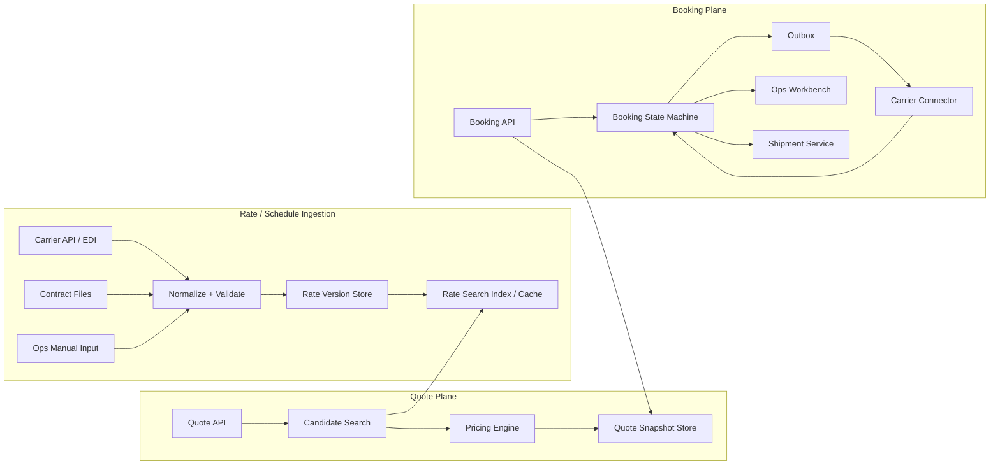
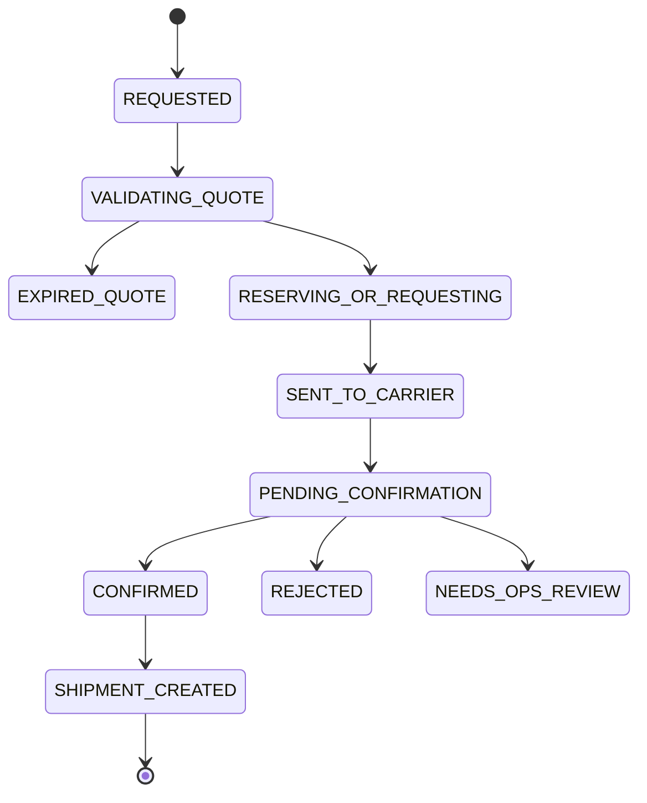

# 系统设计 - 案例 46：Flexport 国际货运报价与订舱系统真题模拟

## 题目

设计一个类似 Flexport 的国际货运报价与订舱系统，支持：

- 客户输入起运地、目的地、货物信息、运输模式和期望时间
- 系统返回多个报价选项，例如 ocean、air、truck 或组合方案
- 展示价格明细，包括基础运价、燃油附加费、港杂费、文件费、保险、平台加价等
- 展示预计出发时间、预计到达时间、承运商、服务等级和报价有效期
- 客户选择某个 quote 后可以提交 booking
- 系统向船司、航空公司、卡车公司或内部运营发起订舱
- 外部确认后生成 shipment，并进入后续 tracking 流程
- 报价和订舱过程要可审计、可追踪、可重试、可人工介入

先不做：

- 完整支付和发票系统
- 完整海关申报系统
- 复杂动态竞价系统
- 复杂 ML 定价模型
- 所有国家的监管细节

## 为什么这题像 Flexport 会出的题

Flexport 不是单纯的物流轨迹查询产品，它更像一个数字化 freight forwarder。  
客户真正关心的是：

```text
我这批货从 A 到 B，什么时候能走，多少钱，能不能订上，后续谁负责执行？
```

这题比普通“商品报价系统”复杂，因为国际货运报价有几个特点：

- 价格不是一个字段，而是很多费用项组合出来的
- 运价来自合同、承运商接口、Excel、运营录入、历史报价等多种来源
- 同一条 lane 上可能有不同承运商、航线、船期、服务等级和有效期
- 报价可能有 TTL，过期后要重新确认
- 有价格不等于有舱位，有舱位也不等于外部一定确认
- 客户看到的 quote 必须可审计，不能下单后随便重算变价
- 外部系统可能慢、失败、异步返回，运营人员要能接管

所以这题真正考的是：

- 复杂业务对象建模
- 读多的 quote search 和写少但强语义的 booking state machine
- rate / schedule / capacity 数据接入和版本化
- quote snapshot、TTL、幂等和审计
- 外部承运商接口不可靠时怎么设计
- 如何在“报价快”和“价格准确”之间做 trade-off

## 面试官真正想看什么

这题通常在看下面几件事：

1. 你会不会把 `Rate / Schedule / Quote / Booking / Shipment` 分清楚
2. 你能不能区分报价读路径和订舱写路径
3. 你会不会把价格计算做成可审计的 price breakdown，而不是只存一个 total_price
4. 你会不会给 quote 做版本、有效期和快照
5. 你能不能处理外部承运商确认慢、失败、重复、状态不一致
6. 你会不会设计 booking 状态机和幂等键
7. 你能不能说明哪些地方可以缓存，哪些地方必须重新确认

---

## 一开始先别急着画架构，先澄清业务边界

### 面试官开题

**面试官：**  
假设你在 Flexport，要设计一个 freight quote and booking 系统。客户输入货物信息和起终点后，可以看到多个运输报价，选一个后提交订舱。你会怎么设计？

### 候选人思考

**候选人思考：**  
这题不能直接做成“搜索价格表”。货运报价的核心是 rate、schedule、capacity 和 quote snapshot。订舱又是一个状态机，需要和外部承运商交互。我要先澄清运输模式、报价准确性、订舱语义、价格来源、容量是否实时、外部系统形式和人工介入。

### 候选人澄清问题

**候选人：**  
我先确认几个边界：

1. 运输模式先支持 ocean，还是 ocean、air、truck 都要支持？
2. 报价需要实时向 carrier 查询，还是基于已经导入的合同价和 schedule？
3. 客户提交 booking 后，是立即确认，还是先进入 pending 等外部确认？
4. 报价是否有有效期？过期后是否允许继续订舱？
5. 价格是否需要拆明细，例如 base rate、fuel surcharge、origin/destination fee？
6. 运力 capacity 是强实时，还是只做近似可用性？
7. 外部承运商通过 API、EDI、邮件还是运营后台接入？
8. 是否需要支持客户合同价、折扣、币种转换和平台 markup？

**面试官：**  
先重点支持 ocean freight，但设计要能扩展到 air 和 truck。报价主要基于导入的 contract rate、sailing schedule 和部分 carrier API。客户提交 booking 后不一定立即成功，要等待 carrier confirmation。quote 有有效期，例如 15 分钟到 24 小时。价格需要明细。capacity 可以先近似，但 booking 时要确认。外部系统有 API、EDI，也有运营人员手动处理。

### 候选人收敛题目

**候选人回答：**  
那我会把题目收敛成一个国际货运 quote-to-book 系统：

- Quote 阶段重点是快速返回可解释的报价选项
- Booking 阶段重点是幂等、状态机、外部确认和人工兜底
- Rate、schedule、capacity 是输入数据，不等于最终 quote
- Quote 是给客户的报价快照，必须保存当时的价格明细、规则版本和有效期
- Booking 不能简单重算价格后直接下单，要校验 quote 是否还有效
- 外部 carrier 交互要异步化、可重试、可审计
- Booking confirmed 后再创建 shipment，后续进入 tracking 系统

核心边界是：

```text
Rate 是原始运价规则
Quote 是面向客户的报价承诺快照
Booking 是客户选择 quote 后的订舱请求状态机
Shipment 是订舱成功后进入履约和追踪的对象
```

---

## 第一步：明确非功能目标

### 面试官追问

**面试官：**  
这个 quote-to-book 系统除了功能以外，非功能目标是什么？

### 候选人思考

**候选人思考：**  
这类系统不是单纯高 QPS。Quote 要快、价格要可解释，Booking 要可靠、可审计，外部承运商慢或失败时不能把用户请求拖死。它还涉及客户合同价、报价快照和 B2B 多租户隔离。

### 候选人回答

**候选人回答：**  
我会把非功能目标分成六类。

第一，报价延迟：

```text
常规 quote request P95 < 500ms - 1s
复杂货物或需要人工确认的 quote 可以异步返回
客户页面要快速返回候选方案，而不是同步等待所有 carrier
```

第二，价格正确性和可解释性：

```text
每个 quote 都要保存 price breakdown
每个费用项要能追溯到 rate item / surcharge rule / pricing version
rate 更新不能覆盖已经发给客户的 quote snapshot
```

第三，订舱可靠性：

```text
Booking API 要幂等
外部 carrier request 要可重试、可追踪、可人工接管
booking 状态不能因为外部 API 超时而丢失
```

第四，数据新鲜度：

```text
rate / schedule / capacity 要有 observed_at、published_at、expires_at
quote 页面要展示 quote valid_until 和 capacity confidence
```

第五，权限和隔离：

```text
客户只能看到自己的合同价、quote 和 booking
运营人员按客户、区域、业务线授权
价格修改、手工确认、取消 booking 都要审计
```

第六，可用性：

```text
某个 carrier connector 挂了，不能影响其他 carrier
rate ingestion 失败不能影响已有有效 quote 查询
booking pending 时客户和运营都能看到状态
```

一句话总结：

```text
Quote-to-book 系统的非功能重点不是极限吞吐，
而是报价快、价格可解释、订舱状态可靠、外部失败可恢复、客户数据隔离。
```

---

## 第二步：容量估算

### 面试官追问

**面试官：**  
你估一下量级。

### 候选人思考

**候选人思考：**  
这题不能只估 booking 数。Quote search 可能比 booking 多很多，是读多和计算多；booking 量小一些，但一致性和外部状态复杂。rate ingestion 也是关键，因为价格数据多、版本多、有效期多。

### 候选人计算过程

**候选人回答：**  
我先给一组合理假设：

- 活跃客户：`5 万`
- 每天 quote request：`100 万`
- 每个 quote request 平均返回 `20` 个候选方案
- 每个 quote request 内部评估 `100` 条候选 rate/schedule
- 每天 booking：`2 万`
- 每天新增或更新 rate row：`1000 万`
- 活跃 rate row：`1 亿`
- quote snapshot 保留：`90 天`
- booking 和 audit 长期保留：`7 年`

Quote QPS：

```text
100 万 / 86400 ≈ 12 QPS
```

平均不高，但客户通常集中在工作时间和批量询价场景，按 `50x` 峰值估：

```text
quote_peak_qps ≈ 600 QPS
```

内部 rate evaluation：

```text
600 quote/s * 100 candidate rates = 60,000 rate evaluations/s
```

Booking QPS：

```text
2 万 / 86400 ≈ 0.23 QPS
```

按高峰 `100x` 估：

```text
booking_peak_qps ≈ 20 - 30 QPS
```

所以这题的压力不是 booking 写入 QPS，而是：

- quote read path 要快
- rate search 和 price calculation 要高效
- rate 数据要版本化和可查询
- booking 虽然 QPS 低，但状态语义复杂
- 外部承运商交互要可靠

存储估算：

```text
quote snapshot = 100 万/day * 10KB * 90 days ≈ 900GB
rate rows = 1 亿 * 1KB ≈ 100GB
如果加上索引、版本、副本，在线存储按 1TB+ 估
```

这个量级可以用关系型数据库承载核心交易对象，但 rate search 可能需要单独的索引或缓存。

### 候选人反推架构重点

**候选人回答：**  
根据估算，我会把系统分成三条主链路：

1. Rate / schedule ingestion：导入、标准化、版本化、发布可查询的价格和船期数据
2. Quote read path：快速检索候选方案，计算价格，保存 quote snapshot
3. Booking write path：校验 quote、提交订舱、等待外部确认、创建 shipment

Quote 是读多和计算多，适合缓存、索引和预计算。  
Booking 是写少但语义重，适合状态机、Outbox、幂等和人工兜底。

---

## 第三步：API 与核心对象建模

### 面试官追问

**面试官：**  
你会怎么设计 API 和建模？

### 候选人回答

我会先从访问模式定义 API，再把对象分成输入数据、报价结果和订舱流程三类。

### 客户 Quote API

客户侧核心是询价、查看 quote、提交 booking。

```text
POST /quote-requests
GET /quote-requests/{quote_request_id}
GET /quote-requests/{quote_request_id}/options
GET /quote-options/{quote_option_id}
POST /quote-options/{quote_option_id}/bookings
```

`POST /quote-requests` 请求大概包括：

```text
origin
destination
mode_preference
cargo_type
weight
volume
equipment_type
ready_date
incoterm
customer_id
```

返回的是一组 quote option，每个 option 有：

```text
quote_option_id
carrier
service
estimated_departure
estimated_arrival
total_price
currency
price_breakdown
valid_until
capacity_confidence
```

### Booking API

客户提交 booking 时要带幂等键：

```text
POST /bookings
Idempotency-Key: client_request_id

body:
- quote_option_id
- customer_reference
- contact_info
- cargo_details_confirmation
```

查询 booking：

```text
GET /bookings/{booking_id}
GET /bookings?status=&cursor=
POST /bookings/{booking_id}/cancel
```

Booking API 返回的是状态：

```text
REQUESTED / PENDING_CONFIRMATION / CONFIRMED / REJECTED / NEEDS_OPS_REVIEW
```

不能把 `POST /bookings` 简化成同步成功，因为外部 carrier confirmation 可能很慢。

### Rate / Schedule 管理 API

这些通常是内部或运营 API：

```text
POST /ops/rate-contracts/import
POST /ops/rate-contracts/{contract_id}/publish
GET /ops/rate-contracts/{contract_id}
GET /ops/rate-items?lane=&carrier=&valid_date=
POST /ops/schedules/import
POST /ops/capacity-snapshots/import
```

Rate 发布要有 draft -> active 流程，避免导错价格直接影响客户。

### 运营后台 API

运营人员处理异常 booking 和外部承运商确认：

```text
GET /ops/bookings?status=NEEDS_OPS_REVIEW&cursor=
POST /ops/bookings/{booking_id}/manual-confirm
POST /ops/bookings/{booking_id}/manual-reject
POST /ops/bookings/{booking_id}/retry-carrier-submit
GET /ops/bookings/{booking_id}/carrier-messages
```

所有运营 API 都要写 audit log。

#### 1. Rate 相关对象

```text
RateContract
RateItem
SurchargeRule
CustomerPricingRule
CurrencyRate
```

`RateContract` 表示某个承运商、客户或平台合同：

```text
rate_contract
- id
- carrier_id
- customer_id nullable
- mode ocean/air/truck
- valid_from
- valid_to
- source_type api/edi/file/manual
- version
- status draft/active/expired
- created_at
```

`RateItem` 是可匹配的运价行：

```text
rate_item
- id
- contract_id
- origin_port
- destination_port
- equipment_type
- cargo_type
- service_level
- base_price
- currency
- min_weight
- max_weight
- valid_from
- valid_to
- effective_version
```

`SurchargeRule` 表示附加费规则：

```text
surcharge_rule
- id
- carrier_id
- lane_id
- fee_type fuel/terminal/document/security
- calculation_type fixed/per_container/percentage/per_kg
- amount
- currency
- valid_from
- valid_to
```

这里要注意：附加费不能随便写死，因为国际货运里 price breakdown 很重要。

#### 2. Schedule 和 capacity 对象

```text
carrier_service
- id
- carrier_id
- mode
- origin_port
- destination_port
- departure_time
- arrival_time
- transit_days
- vessel_or_flight_no
- service_level
- status
```

```text
capacity_snapshot
- id
- carrier_service_id
- equipment_type
- available_units
- confidence high/medium/low
- source
- observed_at
- expires_at
```

Capacity 不一定强实时，所以我会把它叫 snapshot，而不是绝对库存。

#### 3. Quote 对象

`QuoteRequest` 保存客户询价输入：

```text
quote_request
- id
- customer_id
- origin
- destination
- mode_preference
- cargo_type
- weight
- volume
- equipment_type
- ready_date
- incoterm
- created_at
```

`QuoteOption` 是返回给客户的一个报价选项：

```text
quote_option
- id
- quote_request_id
- carrier_id
- service_id
- mode
- estimated_departure
- estimated_arrival
- total_price
- currency
- valid_until
- pricing_version
- rate_contract_id
- status active/expired/booked
```

`PriceBreakdown` 保存价格明细：

```text
price_breakdown
- id
- quote_option_id
- fee_type
- description
- amount
- currency
- rule_id
- calculation_detail
```

这里最重要的是：QuoteOption 和 PriceBreakdown 是快照。  
客户看到的 quote 后续要能审计，不能因为 rate table 更新后就查不回当时价格。

#### 4. Booking 对象

```text
booking
- id
- customer_id
- quote_option_id
- idempotency_key
- status
- requested_at
- confirmed_at
- carrier_booking_ref
- shipment_id nullable
```

```text
booking_attempt
- id
- booking_id
- carrier_id
- connector_type api/edi/manual
- request_payload
- response_payload
- status sent/confirmed/rejected/timeout
- retry_count
- created_at
```

Booking 是状态机，不是一个布尔值。

---

## 第四步：整体架构

### 面试官追问

**面试官：**  
你会怎么画架构？

### 候选人回答

我会分成三个 plane：

1. Rate data plane：负责导入和发布可查询的价格、船期、capacity 数据
2. Quote plane：负责客户实时询价
3. Booking plane：负责订舱状态机和外部确认



这张图不要理解成“一个客户请求从左到右同步跑完”。它表达的是三条不同链路。

#### 1. Rate / Schedule Ingestion：后台准备价格和船期数据

这一块是后台数据准备链路：

```text
Carrier API / EDI
Contract Files
Ops Manual Input
        ↓
Normalize + Validate
        ↓
Rate Version Store
        ↓
Rate Search Index / Cache
```

运价和船期数据可能来自承运商 API、EDI、合同文件，也可能来自运营手动录入。  
这些原始数据不能直接给客户使用，要先做：

- 格式统一
- 字段校验
- 价格规则校验
- 有效期校验
- 版本化保存
- 发布到可查询索引

这一层产出的不是 quote，而是可被 Quote API 快速查询的 `Rate / Schedule / Capacity` 数据。

#### 2. Quote Plane：客户询价链路

这一块处理客户的实时询价：

```text
Quote API
-> Candidate Search
-> Rate Search Index / Cache
-> Pricing Engine
-> Quote Snapshot Store
```

例如客户输入：

```text
上海 -> 洛杉矶
40 尺柜
7 月初出发
```

`Quote API` 不应该每次都同步打所有 carrier。它会先通过 `Candidate Search` 找候选方案：

- 哪些 carrier 有这条路线
- 哪些 schedule 匹配出发时间
- 哪些 rate 还在有效期内
- 哪些 rate 适合这个柜型和货物类型
- 哪些价格规则适用于这个客户

然后 `Pricing Engine` 计算价格明细：

```text
基础运价
+ 燃油附加费
+ 港杂费
+ 文件费
+ 保险
+ 平台 markup
+ 客户折扣
= total price
```

最后保存成 `Quote Snapshot`。  
这个 snapshot 很重要，因为它记录客户当时看到的价格、价格明细、使用的 rate 版本、对应的 schedule 和有效期。后面 rate table 更新了，也不能把历史 quote 的证据覆盖掉。

#### 3. Booking Plane：客户选中报价后的订舱链路

这一块处理客户点击 booking 之后的流程：

```text
Booking API
-> Quote Snapshot Store
-> Booking State Machine
-> Outbox
-> Carrier Connector
-> Booking State Machine
-> Shipment Service
```

客户选中某个 quote 后，系统先查 `Quote Snapshot Store`：

- quote 是否属于这个客户
- quote 是否还没过期
- quote 是否已经被使用
- quote 的价格和条款是否允许提交 booking

通过校验后，系统创建 `Booking`，但这时还不代表承运商已经确认。  
Booking 会进入状态机，例如：

```text
REQUESTED
-> SENT_TO_CARRIER
-> PENDING_CONFIRMATION
-> CONFIRMED
-> SHIPMENT_CREATED
```

这里加 `Outbox` 是为了保证可靠性。创建 booking 和发送 carrier request 不能中间断掉，所以本地事务里先写：

```text
booking
booking_event
outbox_message
```

再由后台 worker 把 outbox message 发给 `Carrier Connector`。  
`Carrier Connector` 负责适配不同承运商的 API、EDI、callback、polling，甚至运营人工处理。

只有承运商确认成功后，系统才创建 `Shipment`，然后进入后续 tracking 系统。

一句话总结这张图：

```text
Ingestion 负责准备 Rate / Schedule；
Quote Plane 负责快速生成客户报价；
Booking Plane 负责把客户选中的报价变成一个可追踪、可确认、可人工兜底的订舱流程。
```

---

## 第五步：报价读路径

### 面试官追问

**面试官：**  
Quote API 怎么保证快？价格又怎么保证可解释？

### 候选人思考

**候选人思考：**  
Quote 是读多路径。要先检索候选 rate，再算 price breakdown，再排序返回。不能为了准确性每次查很多慢外部系统，也不能为了快而丢掉审计。解法是：rate 预处理、索引化、价格规则版本化、quote snapshot。

### 候选人回答

Quote path 可以拆成：

```text
validate request
-> normalize lane
-> retrieve candidate rates and schedules
-> filter by cargo, date, equipment, customer eligibility
-> calculate price breakdown
-> rank options
-> save quote snapshot
-> return options with TTL
```

#### Candidate search

Rate search 的索引维度通常包括：

```text
origin_port
destination_port
mode
equipment_type
cargo_type
valid_date
customer_id / customer_segment
carrier_id
```

为了避免每次扫大表，我会使用：

- 数据库复合索引承载基础规模
- 搜索索引或专用 rate index 承载复杂筛选
- 热门 lane 缓存候选集合
- 可预测活动或大客户询价提前预热

#### Pricing engine

价格不是一个数字，而是：

```text
total = base_rate
      + origin_fees
      + destination_fees
      + fuel_surcharge
      + security_fee
      + document_fee
      + insurance
      + platform_markup
      + customer_discount
      + currency_conversion
```

Pricing engine 的输出必须包括：

- total price
- currency
- fee breakdown
- 使用了哪些 rate item 和 surcharge rule
- pricing rule version
- quote valid_until

#### Quote snapshot

Quote snapshot 的核心作用是可审计：

```text
客户看到什么
系统当时用了哪些规则
价格为什么这么算
什么时候过期
是否允许 booking
```

所以我不会只存 `quote_id + total_price`。  
我会存完整 price breakdown 和规则版本。

### 面试官追问

**面试官：**  
如果 rate 更新了，客户用旧 quote 下单怎么办？

### 候选人回答

我会给 quote 明确有效期和状态：

```text
ACTIVE
EXPIRED
BOOKING_IN_PROGRESS
BOOKED
CANCELLED
```

Booking 时先校验：

1. quote 是否存在
2. quote 是否属于该 customer
3. quote 是否未过期
4. quote 是否未被使用或仍允许重复 booking
5. quote 对应服务是否仍可尝试订舱

如果 quote 未过期，我会优先按 quote snapshot 承诺的价格处理。  
如果 quote 已过期，就返回需要重新报价，或者进入运营确认。

面试里可以补一句：

```text
Rate 更新不应该修改已经发给客户的 quote snapshot。
它只影响后续新 quote。
```

---

## 第六步：订舱状态机

### 面试官追问

**面试官：**  
客户选了一个 quote，点击 booking。后面怎么设计？

### 候选人回答

Booking 不能简单同步调用 carrier API 然后返回成功。  
因为外部系统可能慢、失败、重复响应，也可能先 pending 后 confirmation。

我会设计状态机：

```text
REQUESTED
-> VALIDATING_QUOTE
-> RESERVING_OR_REQUESTING
-> SENT_TO_CARRIER
-> PENDING_CONFIRMATION
-> CONFIRMED
-> SHIPMENT_CREATED
```

失败分支：

```text
REJECTED
EXPIRED_QUOTE
CAPACITY_UNAVAILABLE
NEEDS_OPS_REVIEW
CANCELLED
```

核心流程：

```text
Booking API
-> 幂等校验
-> 校验 quote snapshot
-> 创建 booking
-> 写 booking event / outbox
-> 异步调用 carrier connector
-> 等待 API/EDI/callback/polling 确认
-> confirmed 后创建 shipment
```



### 幂等设计

客户可能重复点击 booking，前端可能重试，网关也可能重试。

所以 Booking API 要有：

```text
idempotency_key = customer_id + quote_option_id + client_request_id
```

数据库加唯一约束：

```text
unique(customer_id, idempotency_key)
```

如果重复请求进来，返回同一个 booking，而不是创建两个 carrier booking。

### Outbox 设计

创建 booking 和发送 carrier request 之间不能有裂缝。

所以本地事务里写：

```text
booking row
booking_event
outbox message
```

然后由 relay 异步发送给 carrier connector。

这样可以避免：

```text
booking 创建成功
但进程崩溃导致 carrier request 没发出去
```

---

## 第七步：外部承运商接入

### 面试官追问

**面试官：**  
Carrier API 和 EDI 都不稳定，你怎么处理？

### 候选人回答

我会把外部接入做成 connector pattern：

```text
CarrierConnector
- submitBooking()
- cancelBooking()
- getBookingStatus()
- parseCallback()
- normalizeError()
```

不同 carrier 的 API、EDI、邮件或人工流程，都适配成统一的 booking event。

外部接入要保留 raw payload：

```text
carrier_message
- id
- carrier_id
- booking_id
- direction outbound/inbound
- message_type booking_request/confirmation/rejection/update
- raw_payload
- normalized_payload
- status
- created_at
```

#### 可靠性策略

我会使用：

- retry with exponential backoff
- carrier 级别 rate limit
- circuit breaker
- dead letter queue
- polling + callback 双路径
- request_id / idempotency key 防重复提交
- ops fallback

#### 为什么要 ops fallback

国际货运不是所有 carrier 都有完美 API。  
有些流程可能仍然靠邮件、portal 或运营人员确认。

所以系统要支持：

```text
NEEDS_OPS_REVIEW
```

运营人员可以在后台：

- 查看 quote 和 booking 上下文
- 查看外部请求和响应
- 手动填写 carrier booking reference
- 标记 confirmed 或 rejected
- 上传附件
- 触发后续 shipment 创建

所有人工操作都要有 audit log。

---

## 第八步：数据存储、索引与权限隔离

### 面试官追问

**面试官：**  
你会怎么选数据库和索引？

### 候选人回答

我会按访问模式分。

#### 核心交易对象

Booking、quote snapshot、客户、权限、audit log 这类需要事务和一致性的对象，用关系型数据库：

```text
PostgreSQL / MySQL
```

关键索引：

```text
quote_option(customer_id, valid_until, status)
quote_option(quote_request_id)
booking(customer_id, idempotency_key) unique
booking(status, updated_at)
booking_attempt(booking_id, created_at)
```

#### Rate search

Rate row 多、筛选维度多、更新频繁但可以版本化发布。可以有两种选择：

1. 初期用关系型数据库复合索引
2. 规模上来后用专门的 rate search index

索引字段：

```text
origin_port
destination_port
mode
equipment_type
valid_from / valid_to
customer_id or segment
carrier_id
service_level
```

#### 缓存

可以缓存：

- 热门 lane 的 candidate rates
- 热门 lane 的 schedules
- customer pricing profile
- currency rate
- surcharge rule snapshot

不能随便缓存：

- 已经过期的 quote
- booking 状态
- carrier confirmation 结果

Booking 状态可以读缓存，但权威状态要在数据库里。

#### 权限与多租户隔离

Flexport 这类 B2B 报价系统里，权限隔离尤其重要，因为不同客户可能有不同合同价和折扣。

客户侧所有 quote 和 booking 查询都要带 `customer_id` scope：

```text
quote_request(customer_id, created_at)
quote_option(customer_id, valid_until, status)
booking(customer_id, status, updated_at)
```

不要只靠 `quote_option_id` 或 `booking_id` 查询后再判断权限。更稳的做法是查询条件本身就带客户边界：

```sql
SELECT *
FROM quote_option
WHERE id = ?
  AND customer_id = ?;
```

Rate 权限也要区分：

| Rate 类型 | 可见范围 |
| --- | --- |
| Platform Rate | 平台通用报价逻辑可用 |
| Customer Contract Rate | 只能该客户可用 |
| Carrier Internal Rate | 只给 pricing engine 和运营可见 |
| Manual Special Rate | 指定客户、指定 lane、指定有效期可用 |

运营后台使用 RBAC：

| 角色 | 权限 |
| --- | --- |
| Pricing Ops | 导入 rate、校验价格、发布合同价 |
| Booking Ops | 处理 pending booking、人工确认、重试承运商提交 |
| Support | 查看 quote/booking 状态，但不能改价格 |
| Admin | 管理权限、回滚 rate publish、处理高风险修正 |

所有敏感操作都要写审计：

```text
rate publish
manual price override
manual booking confirm / reject
booking cancel
customer contract rate update
```

面试里可以强调：

```text
报价系统的数据隔离比普通查询系统更敏感。
看错 shipment 是数据泄漏，看错 contract rate 可能直接造成商业损失。
```

---

## 第九步：一致性、价格变化和容量变化

### 面试官追问

**面试官：**  
如果客户看到报价后，capacity 没了或者价格变了怎么办？

### 候选人回答

这里要分清三件事：

```text
价格承诺
舱位可用性
外部确认
```

Quote 可以承诺一个有效期内的价格，但不一定强承诺舱位。  
Booking 时需要确认 capacity 或发送 carrier request。

我会在 quote 页面明确：

- price valid_until
- capacity confidence
- booking subject to carrier confirmation

Booking 时的策略：

| 情况 | 处理 |
| --- | --- |
| quote 未过期，capacity 仍可用 | 正常提交 booking |
| quote 未过期，但 capacity 不确定 | 提交 booking，状态 pending confirmation |
| quote 过期 | 要求重新报价，或进入 ops review |
| carrier 拒绝 | 返回 rejected，并提供替代 quote |
| carrier 价格变化 | 如果超过承诺边界，进入 ops review 或重新报价 |

关键表达：

```text
Quote snapshot 保证客户看到的价格可审计；
Booking confirmation 保证外部承运商真的接受；
这两个不能混成一个同步事务。
```

---

## 第十步：可观测性和故障处理

### 面试官追问

**面试官：**  
这个系统线上最容易出什么问题？

### 候选人回答

我会重点监控这些指标：

#### Quote path 指标

- quote API QPS
- quote P95 / P99 latency
- candidate rate count
- no quote rate
- price calculation error rate
- cache hit rate
- expired quote booking attempts

#### Booking path 指标

- booking created
- booking confirmation latency
- carrier rejection rate
- pending confirmation count
- needs ops review count
- duplicate idempotency hit
- outbox lag
- connector retry count
- DLQ size

#### Rate ingestion 指标

- rate import success / failure
- validation error count
- active rate count by lane
- rate publish lag
- schedule freshness
- capacity snapshot staleness

### 常见故障和处理

#### 故障 1：Carrier API 挂了

处理：

- connector 熔断
- quote 页面降低 capacity confidence
- booking 进入 pending 或 ops review
- 不让请求线程同步卡死

#### 故障 2：Rate 文件导错，价格异常

处理：

- rate import validation
- abnormal price detection
- draft -> active 发布流程
- 版本化回滚
- 已发 quote 保留 snapshot

#### 故障 3：重复 booking

处理：

- idempotency key
- unique constraint
- carrier request idempotency
- booking_attempt 去重

#### 故障 4：Quote search 很慢

处理：

- 热门 lane candidate cache
- rate index
- 预计算常见 lane
- 限制返回候选数量
- 分页或 async quote for complex cargo

---

## 第十一步：扩展性和 trade-off

### 1. 实时报价 vs 预计算报价

实时报价更准确，但慢、依赖外部系统。  
预计算报价更快，但可能 stale。

我的选择：

```text
大多数 quote 基于已发布 rate index 快速计算；
对少数高价值或 capacity 不确定的 booking，再向 carrier 做确认。
```

### 2. Quote 承诺价格 vs Booking 承诺舱位

Quote 可以承诺价格和有效期，但舱位通常要 external confirmation。  
如果题目要求强承诺舱位，就需要 hold/reservation 机制，但这会复杂很多。

### 3. 同步 booking vs 异步 booking

同步体验好，但容易被外部系统拖垮。  
异步更稳，但用户要接受 pending 状态。

我的选择：

```text
Booking API 只承诺已受理；
最终是否 confirmed 由 carrier confirmation 决定。
```

### 4. 一个大 pricing service vs 分散规则

价格规则如果散落在各服务里，很难审计。  
所以我会把 pricing engine 做成独立模块，输出结构化 breakdown 和 rule version。

### 5. 通用 rate index vs 客户专属价格隔离

通用 rate index 查询快，但客户合同价、折扣和 special rate 不能互相泄漏。  
所以我会把可共享的 lane / schedule / platform rate 做统一索引，把 customer-specific rate 用 customer scope 或单独分区控制。

关键原则是：

```text
Quote 生成时可以复用公共候选搜索，
但价格规则应用时必须带 customer_id 和 pricing profile。
```

### 6. 自动订舱 vs 运营兜底

自动订舱效率高，但国际货运里 carrier API、EDI、邮件和人工 portal 长期并存。  
如果系统假设所有 carrier 都能实时 API 确认，会不现实。

我的选择：

```text
标准 carrier 走自动 connector；
失败、超时、价格变化、capacity 不确定时进入 ops review。
```

### 扩展路径

如果规模继续增长，我会按瓶颈扩展：

| 瓶颈 | 扩展方式 |
| --- | --- |
| Quote search 慢 | 热门 lane 缓存、rate index、预计算常见 lane、限制候选数量 |
| Pricing CPU 高 | pricing engine 水平扩展、规则编译、批量计算、结果缓存 |
| Rate ingestion 大 | 文件分片导入、异步校验、draft -> active 发布、版本差量更新 |
| Booking pending 多 | carrier connector 分组扩容、ops queue 分配、优先级处理 |
| 外部 carrier 不稳定 | connector 熔断、polling + callback、DLQ、人工兜底 |
| 客户合同价复杂 | customer pricing profile 缓存、规则版本化、灰度发布 |
| 历史 quote/booking 多 | quote snapshot 冷热分层，booking/audit 长期归档 |

一句话总结 trade-off：

```text
这个系统用 quote snapshot 和异步 booking 状态机换取可审计和可靠性；
代价是 quote 可能过期、booking 可能 pending，用户体验要接受最终确认语义。
```

---

## 候选人 3 分钟完整回答

**候选人回答：**  
我会把这个系统拆成 quote 和 booking 两条主链路。Quote 是读多和计算多，Booking 是写少但状态语义复杂。非功能目标上，quote 要在几百毫秒到 1 秒内返回可解释报价，booking 要幂等、可靠、可审计，客户合同价和 booking 数据要严格按 customer 隔离。

API 上，我会提供 quote request、quote option 查询、submit booking、booking 查询和 cancel booking；内部提供 rate import、rate publish、schedule import、capacity snapshot import；运营后台提供 manual confirm、manual reject、retry carrier submit 和 carrier message 查看。客户提交 booking 时必须带 idempotency key。

核心对象包括 RateContract、RateItem、SurchargeRule、CarrierService、CapacitySnapshot、QuoteRequest、QuoteOption、PriceBreakdown、Booking 和 BookingAttempt。Rate 是原始价格规则，Quote 是给客户的报价快照，Booking 是客户选择 quote 后的订舱状态机，Shipment 是订舱成功后的履约对象。

容量上，假设每天 100 万次 quote request，高峰 600 QPS，每次内部评估 100 条候选 rate，那么 quote path 大概是 6 万次 rate evaluation/s。Booking 每天 2 万单，高峰也只有几十 QPS，所以 booking 不是吞吐瓶颈，真正难的是 quote 的低延迟、价格可解释，以及 booking 的幂等和外部确认。

架构上我会分成三层。第一层是 rate/schedule ingestion，把 carrier API、EDI、合同文件、运营录入的数据标准化、校验、版本化，然后发布到 rate store 和 rate index。第二层是 quote plane，Quote API 根据起终点、日期、货物、客户合同等条件检索候选 rate 和 schedule，通过 pricing engine 计算价格明细，保存 quote snapshot 后返回给客户。第三层是 booking plane，客户选择 quote 后，Booking API 做幂等校验和 quote 有效性校验，创建 booking 和 outbox，再异步调用 carrier connector，等待 API、EDI、callback 或运营确认。confirmed 后再创建 shipment。

一致性上，我会强调 quote snapshot 和 rate table 分离。Rate 更新只影响新 quote，不应该修改客户已经看到的 quote。Booking 时如果 quote 过期，就重新报价或进入运营确认。如果 quote 未过期但 capacity 不确定，booking 进入 pending confirmation，而不是直接承诺成功。

存储上，quote snapshot、booking、audit 这类核心交易对象放关系型数据库；rate search 可以从复合索引演进到专门的 rate index；热门 lane、schedule、customer pricing profile 可以缓存，但过期 quote、booking 权威状态和 carrier confirmation 不能只依赖缓存。权限上，所有 quote/booking 查询都要带 customer_id scope，customer contract rate 只能对应客户使用，运营后台用 RBAC 和 audit log 控制。

外部系统不可靠时，我会用 connector pattern、重试退避、熔断、DLQ、polling + callback、raw payload 审计和 ops fallback。所有人工确认、价格 override、rate publish 和 booking cancel 都要有 audit log。

最后 trade-off 是：quote 要快，所以主要基于已发布 rate index、缓存和预计算；booking 要稳，所以异步状态机和外部确认优先。这个系统的关键不是把价格算出来，而是让价格可解释、quote 可审计、booking 可追踪、外部失败可恢复，同时避免客户合同价泄漏。

---

## 面试复盘：这一题真正考什么

### 1. 得分点

这题答得好，通常要覆盖：

- Quote 和 Booking 是两条不同链路
- 能明确非功能目标：报价延迟、价格可解释、订舱可靠、权限隔离
- 能给出客户 Quote API、Booking API、Rate 管理 API、运营后台 API
- Rate、Quote、Booking、Shipment 四个对象边界清晰
- 价格明细和 pricing rule version 可审计
- Quote 有 TTL 和 snapshot
- Booking 有状态机、幂等和 Outbox
- 能说明 customer_id scope、customer contract rate 隔离、运营 RBAC 和 audit log
- 外部 carrier 接入异步化，并支持人工兜底
- Rate ingestion 有校验、版本和发布流程
- 能说清实时性、准确性、外部确认、权限隔离和扩展路径之间的 trade-off

### 2. 常见失误

常见失误包括：

- 把 quote 当成简单查价格表
- 把 booking 当成一次同步 API 调用
- 只存 total_price，不存 price breakdown
- Rate 更新后覆盖历史 quote，导致审计困难
- 忽略 quote 过期和 capacity 变化
- 没有幂等，重复点击导致重复订舱
- 没有外部 connector 的重试、DLQ 和人工处理
- 只讲高 QPS，不讲 B2B 系统里更重要的正确性和可追踪
- 不讲 API，只讲对象和组件，导致回答不像完整系统设计
- 不讲客户合同价隔离，忽略 B2B 报价系统最敏感的数据边界

## 最后记忆模板

这题可以背成：

```text
Flexport quote/book 题，不是普通价格查询题。

先定非功能目标：
报价快 / 价格可解释 / booking 可靠 / 外部失败可恢复 / 客户价格隔离

再定 API：
Quote Request / Quote Option / Submit Booking / Booking Status / Rate Import / Ops Review

先拆四个对象：
Rate 是原始规则，
Quote 是客户报价快照，
Booking 是订舱状态机，
Shipment 是确认后的履约对象。

再拆三条链路：
Rate ingestion 负责标准化、校验、版本化；
Quote plane 负责候选检索、价格计算、明细快照；
Booking plane 负责幂等、Outbox、carrier confirmation 和人工兜底。

核心 trade-off：
报价要快，所以用 rate index、缓存和预计算；
订舱要稳，所以用异步状态机、外部确认和 audit log。
客户价格要隔离，所以所有 quote、booking、contract rate 都要带 customer scope。
```

## 口头练习题

1. 为什么 quote 不能只存 total_price？
2. Rate 更新后，已经发给客户的 quote 应该怎么办？
3. Booking 为什么不能简单同步调用 carrier API？
4. Quote 未过期但 carrier 拒绝订舱怎么办？
5. 外部 carrier callback 重复到达怎么办？
6. 如何防止客户重复点击造成重复 booking？
7. Rate ingestion 文件导错导致价格异常，系统怎么回滚？
8. Quote path 慢，应该优化哪些地方？
9. 什么时候需要 capacity hold？它会引入什么复杂度？
10. 这题和 shipment tracking 系统最大的区别是什么？
11. 用 3 分钟说清这题的客户 API、内部 rate API 和运营 API。
12. 为什么 customer contract rate 必须做权限隔离？
13. Quote search 可以缓存哪些东西？哪些不能缓存？
14. 如果 Pricing Ops 导错客户合同价，系统如何发现、回滚和保护已发 quote？
