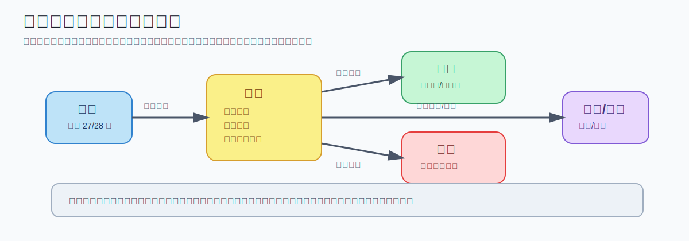

# 美团结算中心系统设计 - 第 1 课：外卖结算中心全景与核心链路

## 学习目标（本节结束后你能做到什么）

- 用一句话说清外卖结算系统到底在解决什么问题
- 分清支付、分账、账务、清算、付款、对账这些词的边界
- 理解一笔外卖订单的钱为什么不能“订单完成就直接打给商家”
- 能用完整链路解释一笔订单从支付成功到最终打款之间经历了什么

## 内容讲解（核心概念，用类比、例子、图示说清楚）

### 1. 先把问题说人话：它到底在解决什么

外卖结算系统本质上解决的是一句话：

**一笔订单的钱，到底该怎么在用户、平台、商家、骑手、补贴承担方、支付渠道之间，准确、可追溯、可对账地分掉。**

这里最容易犯的一个误解是，把结算系统理解成“收钱然后转钱”的程序。  
这不对。  
真正成熟的结算系统更像一个“资金规则解释器 + 账务记录器 + 周期核算器 + 出款协同器 + 差错修复器”。

也就是说，它不是只回答“这单商家拿多少”，还要回答：

- 用户到底付了多少钱
- 商家应收是多少
- 骑手应得是多少
- 平台赚了多少佣金
- 平台承担了多少营销成本
- 这笔钱现在只是记账了，还是已经打出去了
- 如果退款、赔付、取消，历史钱怎么冲回
- 支付账、业务账、账务账、付款账最后是否一致

当你能意识到它解决的是一整套“资金正确性问题”，你就已经比把它看成普通 CRUD 模块的人高一个层级了。

### 2. 一个简单订单例子：为什么会复杂

假设一单外卖：

- 商品原价 32 元
- 配送费 4 元
- 平台红包补贴 5 元
- 商家满减承担 3 元
- 用户实付 28 元
- 骑手配送收入 6 元
- 平台抽佣率 15%

这时候系统并不是只做一个减法。  
它需要同时处理好几条关系：

1. 用户视角  
   用户真正支付了多少？优惠前是多少？优惠是谁承担的？

2. 商家视角  
   商家最终应收多少？佣金怎么扣？商家自己承担了哪些营销成本？

3. 骑手视角  
   骑手拿到多少配送收入？这笔收入何时变成可提现？

4. 平台视角  
   平台的佣金收入是多少？平台自己承担了多少补贴成本？

5. 渠道视角  
   钱现在是还在第三方支付通道在途，还是已经进入平台可支配账户？

你会发现，这不是一个“结果字段”，而是一组“责任分摊 + 账务映射 + 状态推进”。

### 3. 为什么它不是支付系统

支付系统更关注：

- 用户能不能成功付款
- 渠道是否回调成功
- 这笔交易是否成功扣款

而结算系统更关注：

- 这笔钱的经济归属如何解释
- 这笔钱何时能确认给商家、骑手、平台
- 后续退款、赔付、冲销如何处理

一句话区分：

- 支付系统解决“钱有没有进来”
- 结算系统解决“钱应该归谁、何时归、怎么记”

### 4. 为什么不能订单完成后直接打钱

这是结算系统设计里必须先建立的直觉。

如果你只站在“正常订单”的角度想，可能会觉得：

“用户付了钱，订单完成了，直接把商家那部分打过去不就行了？”

但现实业务并不干净。  
你一定会遇到这些场景：

- 用户支付成功了，但商家取消了
- 订单完成后用户投诉，触发部分退款
- 骑手超时，平台赔付用户
- 活动配置错了，后面要补差额
- 商家被冻结，今天不能出款
- 支付渠道回单延迟
- 银行打款失败
- 月底财务要核对本月补贴和佣金收入

所以成熟系统一定遵循这个顺序：

**先记账，再清算，再出款。**

这是一条非常重要的系统设计原则。  
因为直接打钱意味着你把“业务解释”和“资金动作”耦合死了，一旦出现逆向或异常，系统会非常难修。

### 图示：结算核心链路

### 5. 从全链路看，一笔订单通常怎么走

你可以把整个流程拆成六段：

#### 5.1 订单事件接入

上游系统不断产生事件：

- 支付成功
- 订单完成
- 取消
- 退款
- 售后赔付

结算系统本身不发明事实，它只消费上游给出的事实。  
这意味着结算系统必须依赖事件驱动，而不是自己凭状态猜测。

#### 5.2 订单快照冻结

在开始计算之前，系统通常要保存订单快照，包括：

- 商品金额
- 配送费
- 优惠券
- 商家合同
- 城市信息
- 活动信息
- 命中的规则版本

这一步极其关键。  
因为规则以后会变，如果你不冻结快照和规则版本，过几天重算同一单，结果可能变掉，这在账务上是绝对不能接受的。

#### 5.3 规则计算

系统根据订单快照和规则版本，算出：

- 商家应收
- 骑手应收
- 平台佣金
- 平台补贴
- 各承担方分摊金额

这里的难点不是数学难，而是规则变化快、叠加多、版本多。

#### 5.4 账务记账

规则算完并不意味着打钱。  
先要把结果映射到账务分录上，例如：

- 商家待结算余额增加
- 骑手待结算余额增加
- 平台佣金收入增加
- 平台补贴成本增加
- 支付渠道在途余额变化

这一步是系统的心脏，因为它决定了后续所有清算、出款、对账有没有可靠真相源。

#### 5.5 周期清算

到了 T+1 或约定周期，再把订单级流水汇总成：

- 商家结算单
- 骑手结算单
- 渠道清算单

它更像“内部核算”，回答的是“这一周期总共该给谁多少钱”。

#### 5.6 付款与对账

真正打款通常是另一层能力：

- 生成付款单
- 调银行或支付渠道发起打款
- 跟踪回执
- 失败重试

之后还要做对账，检查：

- 订单账 vs 支付账
- 业务事件 vs 账务分录
- 账务余额 vs 结算单
- 结算单 vs 实际打款

### 6. 一个更真实的思维框架：它其实是五个子系统的组合

你可以把外卖结算中心理解成五个强相关子系统的组合：

1. 规则系统  
   负责解释“钱怎么算”

2. 账务系统  
   负责解释“算出来的钱怎么记”

3. 清算系统  
   负责解释“周期内总共该结多少”

4. 付款协同系统  
   负责解释“什么时候、通过哪个渠道把钱打出去”

5. 对账系统  
   负责解释“最后是不是都对上了”

很多人面试时喜欢一上来就讲数据库表，这其实是顺序反了。  
先要建立“这是五个系统组合，不是一个 if else 模块”的视角。

### 图示：参与方与资金分配关系

### 7. 这个系统最核心的三个设计原则

#### 7.1 事实由事件驱动，不由本系统脑补

结算系统依赖上游事件驱动。  
它不应该自己擅自判断“订单应该算完成了”，而应该消费明确的订单完成事件。

#### 7.2 历史结果必须可复现

只要涉及钱，你就必须能回答：

“为什么这单是这样算的？”

这要求你保留：

- 订单快照
- 规则版本
- 命中链路
- 账务分录

#### 7.3 历史账务不要随便改，只能追加

账务最怕直接 update 历史金额。  
因为一旦你这么做：

- 审计无法复盘
- 对账解释困难
- 并发更新风险高
- 历史真相被覆盖

所以后面你会反复看到一个原则：  
**流水追加，不直接改历史。**

### 8. 我额外补充的一点：不要把“结算”和“总账”混为一谈

你给的聊天记录已经把业务账讲得比较清楚了，但还需要补一句系统边界：

外卖结算中心通常更像一个偏业务子账本（sub-ledger）系统。  
它不一定等于财务总账系统本身。

它的职责是把业务事实沉淀成结构化账务结果，便于后续：

- 业务清算
- 出款
- 财务核算
- 对账

这点在面试里说出来会非常加分，因为它表明你知道“业务账”和“总账”是不同层次的系统。

## 小结（3-5 条关键点）

- 外卖结算系统解决的不是“收钱”，而是“钱怎么分、怎么记、怎么结、怎么打、怎么对”
- 它通常由事件接入、规则计算、账务记账、周期清算、付款、对账几个阶段组成
- 成熟系统遵循“先记账，再清算，再出款”，而不是订单完成后直接打钱
- 历史订单必须保留订单快照和规则版本，否则后续退款、审计、重放都无法复现
- 这类系统本质上更像交易资金系统，而不是普通 CRUD 模块

---

## 检查站：请回答以下问题

1. 你如何用自己的话区分“支付系统”和“结算系统”？
2. 为什么外卖订单完成后，系统通常不能直接把钱打给商家？请至少说出两个现实原因。
3. 为什么订单快照和规则版本一定要保存？如果不保存，后面会出什么问题？
4. 可选思考：你觉得这个系统更像“订单系统的附属模块”，还是“独立的资金基础设施”？为什么？

请把你的答案直接告诉我，我会根据你的回答决定下一步。
