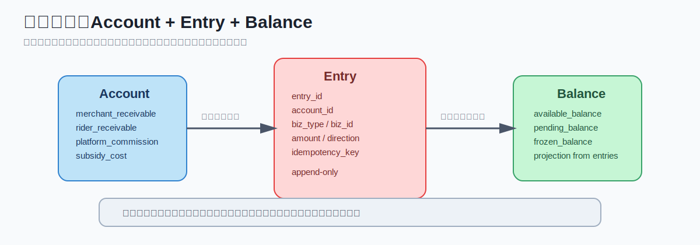

# 美团结算中心系统设计 - 第 2 课：规则引擎、账务分录与账户模型

## 学习目标（本节结束后你能做到什么）

- 理解结算规则为什么必须配置化、版本化，而不是硬编码在业务流程里
- 能说清规则引擎的最小抽象：Context、Rule、Matcher、Executor
- 理解为什么资金系统喜欢用 `account + entry + balance` 的账务模型
- 解释为什么账务流水通常 append-only，不能直接 update 历史账
- 初步理解退款、赔付、跨周期冲销为什么都依赖逆向分录

## 内容讲解（核心概念，用类比、例子、图示说清楚）

### 1. 规则复杂，难点不在公式，在“变化”

外卖业务里最容易低估的事情，不是算钱，而是规则变化的频率和组合复杂度。

同一单钱的分配会受到这些因素影响：

- 城市
- 商家合同
- 商家等级
- 配送模式
- 新客/老客
- 活动类型
- 会员券/红包/神券/满减叠加
- 时间段
- 天气
- 距离
- 特殊节假日政策

如果你把这些条件直接硬编码成一大坨 `if else`，最初也许能跑，但很快就会出现这些问题：

- 业务改一个活动就要改代码发版
- 运营想试算某个活动影响时做不到
- 某单为什么这样算说不清
- 历史订单无法按当时规则还原
- 逻辑越来越像“屎山”

所以你给的聊天记录里一直强调“规则引擎”，这不是为了追潮流，而是工程上必须把“规则”从“流程代码”里拆出来。

### 2. 规则引擎到底解决什么问题

规则引擎通常解决四件事：

#### 2.1 规则外置

不要把业务规则写死在服务流程里，而是放在规则配置中心、规则表或规则平台中。

例如：

- 商家佣金率 15%
- 新客券平台承担 100%
- 商家满减平台承担 30%
- 雨天骑手补贴 +2 元

#### 2.2 条件判断标准化

让系统能统一判断这些条件：

- 用户是否新客
- 商家是否 KA 商户
- 城市是否上海
- 是否晚高峰
- 距离是否大于 3km

#### 2.3 计算动作标准化

让规则命中后可以执行统一动作：

- 平台补贴 +1
- 商家承担比例改为 70%
- 佣金率调整为 12%
- 配送费上浮 1.5 元

#### 2.4 可解释与可追溯

最终系统必须能回答：

“为什么这单商家应收是 23.4 元？”

答案不能是“代码这样写的”，而应该是：

- 命中了商家合同规则 `contract_v12`
- 命中了新客补贴规则 `coupon_v5`
- 命中了雨天配送补贴规则 `weather_v3`

这就是为什么规则引擎要支持命中链路和版本追踪。

### 3. 规则引擎最小抽象：四个对象就够理解

即使你不做一个很重的平台，也可以把简化版规则引擎理解成四个对象：

#### 3.1 Context

就是订单上下文，也就是被冻结的订单快照，例如：

- 订单金额
- 配送费
- 城市
- 下单时间
- 用户是否新客
- 商家等级
- 促销标签
- 配送距离

#### 3.2 Rule

每条规则至少有：

- 规则 ID
- 规则类型
- 生效时间
- 失效时间
- 优先级
- 条件
- 动作
- 版本号

#### 3.3 Matcher

负责判断：

“这条规则是否命中当前订单上下文？”

#### 3.4 Executor

负责执行命中的动作，并把多个规则结果合并成最终结算结果。

### 4. 为什么规则一定要版本化

这是你给的聊天记录里反复出现、而且非常对的一点。  
规则版本化不是“高级玩法”，而是账务正确性的底线。

假设：

- 3 月 1 日订单按佣金规则 `v105` 计算
- 3 月 5 日业务把佣金规则改成 `v106`

如果系统没有保存：

- 当时命中的商家合同版本
- 当时活动配置版本
- 当时配送计价参数
- 当时规则版本

那你到 3 月 8 日再去重算 3 月 1 日订单时，结果就可能不一样。  
这对账务系统是不能接受的。

所以结算系统一般会保存两样东西：

- 订单业务快照
- 命中的规则版本

这保证了后面的退款、重放、补偿、审计都能复现当时的计算逻辑。

### 5. 规则算完之后，为什么还要账务分录

很多人面试讲到这里会停在“算出商家应收 23.4 元”。  
这还不够。  
真正的结算系统必须继续问：

“算出来的钱，如何成为可追溯的账？”

这就进入账务模型。

结算结果本质上只是业务解释结果。  
账务分录才是后续清算、付款、对账真正依赖的基础数据。

### 图示：账户、分录、余额之间的关系

### 6. 经典账务模型：account + entry + balance

这是很多资金系统喜欢采用的结构：

#### 6.1 `account`

表示账户主体和账户类型，例如：

- 商家待结算账户
- 骑手待结算账户
- 平台佣金收入账户
- 平台营销成本账户
- 支付渠道在途账户
- 风险准备金账户

#### 6.2 `account_entry`

表示账务分录，也就是每一次明确的余额变化记录。  
它通常包含：

- entry_id
- account_id
- biz_type
- biz_id
- amount
- direction
- currency
- created_at
- idempotency_key

#### 6.3 `account_balance`

表示账户当前余额。  
查询余额时不能每次都扫所有流水，否则会太慢。  
所以通常会维护一个余额投影表。

一句话记忆：

- 流水是事实
- 余额是投影

### 7. 为什么分录表通常 append-only

资金系统的一个基本原则是：

**历史流水只追加，不随便修改。**

为什么？

因为一旦直接 `update` 历史账，你会失去三个重要能力：

1. 审计能力  
   看不出中间发生过什么

2. 追责能力  
   无法定位到底是哪一步变更导致金额变化

3. 修复能力  
   无法安全地做冲正、补账、重放

所以行业里更常见的做法是：

- 正向交易写正向分录
- 退款、赔付、冲销写逆向分录

这样任何时刻都能完整还原资金历史。

### 8. 一笔正向订单怎样映射成分录

假设一笔订单结算后得到：

- 商家应收 +21.6
- 骑手应收 +6
- 平台佣金收入 +5.4
- 平台补贴成本 +1

系统不会只写“订单结算成功”一条记录，而是会拆成多条标准分录。  
例如概念上可以是：

- 商家待结算账户 `+21.6`
- 骑手待结算账户 `+6`
- 平台佣金收入账户 `+5.4`
- 平台补贴成本账户 `+1`

再结合渠道在途账户或平台资金账户，形成完整的账务映射。

注意：  
真实系统中到底是否严格采用双边记账、每条分录如何配平，会取决于具体账务体系。  
但工程上一定要保证：

- 每次余额变化都有来源
- 每笔分录都能追到业务单据
- 所有操作幂等可重放

### 9. 退款为什么不能“改原来的金额”

这是理解账务系统和普通业务系统差别的关键一课。

假设原单已经记账：

- 商家应收 +20
- 平台佣金收入 +4
- 骑手应收 +6

后来用户申请部分退款 8 元。  
这时绝对不能简单把原来那几条记录改成：

- 商家应收 +15
- 平台佣金收入 +3

正确做法是新增逆向分录，例如：

- 商家应收 `-5`
- 平台佣金收入 `-1`
- 用户退款负债或退款支出 `+6`

这样历史链路才是可解释的。  
否则你后续做审计、对账、归因时，会非常痛苦。

### 10. 我额外补充的一点：规则系统和账务系统不要混成一个服务

这是很多人设计时会踩的坑。

规则系统的职责是解释“怎么算”；  
账务系统的职责是把计算结果沉淀成可信账务事实。

如果你把它们混在一起，初期开发可能快一点，但后面会面临：

- 规则变动影响账务稳定性
- 难以单独重放规则计算
- 难以单独审计账务分录
- 服务责任边界不清

工程上更稳的做法是：

- 规则计算输出订单级结算明细
- 账务服务消费结算明细并生成分录

这样系统边界更清晰。

## 小结（3-5 条关键点）

- 规则系统的难点不在公式，而在规则高频变化、可追溯和可解释
- 规则必须外置、配置化、版本化，并与订单快照绑定
- 账务系统常采用 `account + entry + balance` 模型，其中流水是真相，余额是投影
- 历史账务记录应 append-only，退款和赔付通过逆向分录处理，而不是直接改历史金额
- 规则计算和账务记账最好分层解耦，否则后续审计、重放、修复会越来越困难

---

## 检查站：请回答以下问题

1. 为什么外卖结算规则不适合直接写成一堆硬编码的 `if else`？
2. 如果系统不保存“订单快照 + 规则版本”，后面退款或重放时会出现什么问题？
3. 你如何理解“流水是真相，余额是投影”这句话？
4. 为什么退款更推荐新增逆向分录，而不是直接 update 原来的账务记录？

请把你的答案直接告诉我，我会根据你的回答决定下一步。
