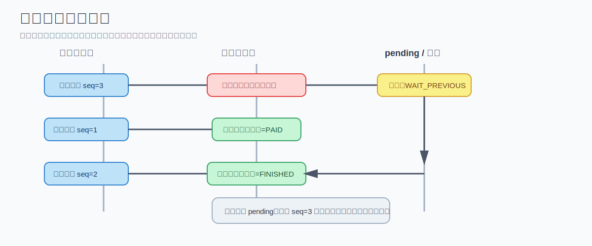

# 美团结算中心系统设计 - 第 3 课：消息乱序、幂等、一致性与补偿

## 学习目标（本节结束后你能做到什么）

- 理解为什么结算系统天然会遇到重复消息、乱序消息、延迟回调和跨系统状态不一致
- 能解释幂等为什么是“生死线”，以及常见的幂等落点
- 能说清消息乱序的几种工程化处理方式：序号、状态机、pending、补拉上游
- 理解为什么资金系统很少依赖全链路强事务，而更偏向本地事务 + 异步补偿 + 对账兜底
- 能在面试里回答“消息乱序怎么办”“为什么不用全局事务一把梭”这类追问

## 内容讲解（核心概念，用类比、例子、图示说清楚）

### 1. 现实世界的消息一定不干净

在分布式系统里，最危险的一种思维是：

“上游发的消息应该都是一次、按顺序、立刻到达的。”

真实世界不是这样。  
你会遇到：

- 消息重复投递
- 消息乱序到达
- 某条消息延迟很久才来
- 某条消息直接丢了
- 第三方支付回单晚到
- 某个下游处理成功，但回执没回上来

结算系统之所以比普通业务系统更怕这些问题，是因为它处理的是钱。  
一旦重复记账、提前退款、漏记分录，不是界面显示错了，而是资金结果错了。

### 2. 幂等为什么是生死线

幂等的本质是：

**同一个业务事件，无论被处理 1 次还是多次，最终结果都只能生效一次。**

举个最直接的例子：  
如果“订单完成事件”被消费两次，而系统没有幂等保护，就可能发生：

- 商家多记一笔应收
- 骑手多记一笔收入
- 平台收入重复确认
- 后续清算金额全部翻倍

这不是普通小 bug，而是资金事故。

### 3. 幂等通常做在哪些层

成熟系统一般不会只在一个地方做幂等，而是多层兜底。

#### 3.1 事件接入层幂等

每个事件都带唯一业务键，例如：

- `orderId + eventType + seq`
- `refundId`
- `settlementRequestId`

消费前先判断该事件是否处理过。

#### 3.2 账务分录层幂等

账务表上通常还会加唯一约束，例如：

- `biz_type`
- `biz_id`
- `entry_type`

这样即使消息重复消费，数据库唯一约束也能挡住重复入账。

#### 3.3 状态机层幂等

订单状态只能沿合法路径推进，例如：

- INIT -> PAID -> FINISHED -> PARTIAL_REFUNDED

如果一个已完成订单又收到一次完成事件，状态机至少会识别出“不该再推进”。

要注意：  
**仅靠状态机不够，账务层还要有分录级幂等。**  
因为状态看起来对，不代表钱没重复记。

### 4. 什么叫消息乱序

业务上事件真实顺序可能是：

1. 支付成功
2. 订单完成
3. 部分退款

但系统收到的顺序却可能是：

1. 部分退款
2. 支付成功
3. 订单完成

原因很多：

- 上游不同服务分别发消息
- 网络延迟不同
- MQ 分区不同
- 某条消息消费失败后重试，反而晚于后面的消息

所以你不能默认：

“先收到的消息，就是先发生的事。”

### 图示：消息乱序与挂起重试

### 5. 解决乱序的核心原则

成熟系统不会把希望完全寄托在“MQ 永远有序”上。  
更靠谱的思路是：

**架构上尽量减少乱序，业务上必须能扛住乱序。**

这句话几乎可以直接背下来。

### 6. 常见解法一：事件带序号或版本号

这是最经典的方法。

例如同一订单事件带递增序号：

- 支付成功 `seq=1`
- 订单完成 `seq=2`
- 部分退款 `seq=3`

系统记录当前订单已处理到哪个序号。  
如果当前只处理到 `seq=1`，结果突然收到 `seq=3`，就知道中间有前置事件没处理。

这时一般有两种策略：

#### 6.1 严格按下一个序号处理

当前到 1，只接受 2。  
收到 3 先挂起，等 2 到了再处理。

#### 6.2 允许跳过，但做前置条件校验

如果某些事件虽然序号更大，但前置业务状态已经满足，也许可以放行。  
这种方式更灵活，但实现更复杂。

### 7. 常见解法二：状态机前置校验

你可以把订单理解成状态机：

- INIT
- PAID
- FINISHED
- PARTIAL_REFUNDED
- FULLY_REFUNDED
- CANCELLED

每种事件只能在特定前置状态下执行，例如：

- `PAY_SUCCESS` 只能作用于 `INIT`
- `ORDER_FINISH` 只能作用于 `PAID`
- `REFUND` 只能作用于 `PAID` 或 `FINISHED`

如果当前订单还没支付，却先来了退款事件，系统就不能硬处理，而是应该：

- 暂存
- 延迟重试
- 或放进异常队列

这比“先处理再说”安全得多。

### 8. 常见解法三：pending 表或延迟队列

这是一种非常现实、也非常常见的做法。

当一条消息现在不能处理时，不要直接丢弃，而是挂起来。  
比如建一张 `pending_event` 表，里面记录：

- `event_id`
- `order_id`
- `event_type`
- `event_seq`
- `payload`
- `pending_reason`
- `next_retry_time`
- `retry_count`

之后有两种触发方式：

1. 新事件到来时顺手扫一下这个订单的 pending
2. 定时任务周期性重试 pending 事件

这就形成了一个比较稳的缓冲机制。

### 9. 常见解法四：关键异常路径补拉上游真实状态

这是我认为你提供的材料里很像真实工程经验的一部分，我这里再补强一下。

消息不是绝对真相，很多时候它只是一个触发器。  
如果你收到退款事件，但系统本地还看不到订单已完成，就可以去订单系统补查：

- 是否已支付
- 是否已完成
- 当前累计退款金额是多少

如果补查结果显示前置状态已经满足，那就可以处理；  
如果仍然不满足，就继续挂起。

这种方案代价是多一次远程调用，但在异常路径上非常有价值。

### 10. 为什么很多资金系统不迷信全局强事务

很多人刚学分布式系统时会本能地想：

“既然一致性这么重要，为什么不把整个链路放进一个分布式大事务？”

资金系统通常不会这么做，原因有几个：

- 全局事务性能成本高
- 链路耦合重
- 故障模式复杂
- 排障困难
- 第三方系统根本不可能纳入你的强事务里

所以更常见的工程组合是：

**本地事务 + Outbox + 异步消息 + 幂等 + 补偿 + 对账**

这套方案的核心思想不是“一次性完美”，而是：

- 每一步可解释
- 失败后可恢复
- 重试后不重复
- 最终可以通过补偿和对账收敛到正确结果

### 11. Outbox 为什么经常被提到

经典问题是：

- 数据库事务提交成功了
- 但发 MQ 消息失败了

如果没有设计好，就会出现本地账务已经写入，但下游永远收不到后续事件。

Outbox 的思路是：

在同一个本地事务里，同时写入：

- 账务分录
- 余额更新
- 一条 outbox_event

事务提交后，再由 relay 程序把 outbox_event 可靠投递到 MQ。

这样可以把“DB 成功，MQ 失败”的问题变成一个可重试的、工程可控的问题。

### 12. 为什么对账永远是最后兜底

即使你做了幂等、状态机、pending、Outbox，也不能假设系统永远不出错。  
因为现实里总会有：

- 人工补单
- 第三方延迟
- 极端 Bug
- 漏消费
- 补偿任务失败

所以最终还是要靠对账来发现：

- 漏记
- 重记
- 金额错
- 状态错

对账不是锦上添花，而是最后收口的关键能力。

### 13. 我额外补充的一点：一致性要分层看

不是所有地方都要同样强的一致性。

通常可以这么分：

#### 13.1 强约束层

尽量使用本地事务保障的部分：

- 账务分录生成
- 余额变更
- 付款状态切换

#### 13.2 最终一致层

可以接受一定延迟的部分：

- 报表
- 查询看板
- 财务分析
- 运营统计

这种分层很重要。  
否则你会为了报表强一致把整个系统拖死。

## 小结（3-5 条关键点）

- 结算系统一定会遇到重复、乱序、延迟和部分丢失消息，不能假设链路永远干净
- 幂等是资金系统生死线，至少要在事件层和分录层做双重保护
- 乱序处理常用组合是：序号/版本号 + 状态机 + pending + 上游补拉
- 资金系统通常更偏向本地事务 + Outbox + 补偿 + 对账，而不是全链路强事务
- 对账不是补充功能，而是最终保证账务正确的闭环能力

---

## 检查站：请回答以下问题

1. 为什么说幂等是结算系统的“生死线”？如果没有幂等，最直接会出什么事故？
2. 消息乱序为什么不能只靠 MQ 顺序保证来解决？你会用哪些业务手段兜底？
3. `pending_event` 这类机制解决的是什么问题？它为什么比直接丢弃异常消息更稳？
4. 你如何理解“本地事务 + Outbox + 补偿 + 对账”这套组合？

请把你的答案直接告诉我，我会根据你的回答决定下一步。
