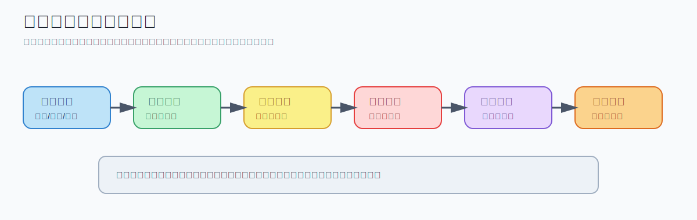
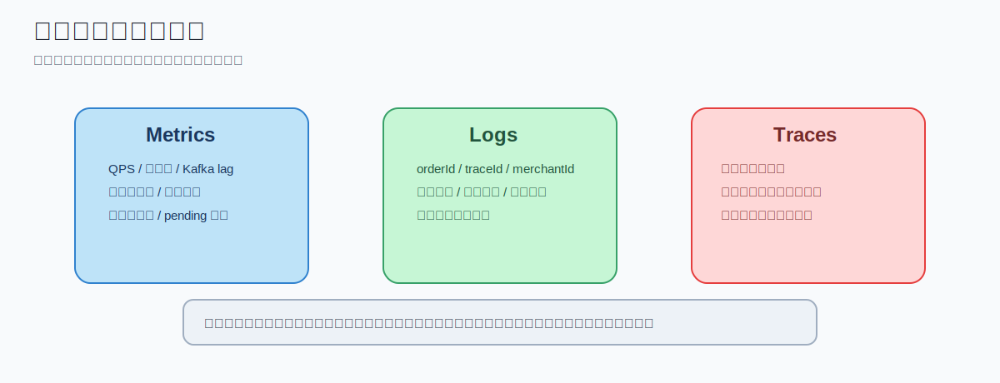

# 美团结算中心系统设计 - 第 4 课：技术选型、可观测性与面试回答框架

## 学习目标（本节结束后你能做到什么）

- 理解为什么资金系统的技术选型优先级通常是稳定、可追溯、可恢复，而不是“最潮”
- 能解释为什么核心账务层通常更偏 MySQL、Kafka/RocketMQ、Redis、任务调度平台这套成熟组合
- 理解监控和可观测性的差别，知道结算系统为什么必须建设业务监控
- 能说出一套面试中比较稳的回答结构，而不是想到哪讲到哪
- 能区分“会列组件名”和“会解释组件取舍”的差别

## 内容讲解（核心概念，用类比、例子、图示说清楚）

### 1. 先定技术选型总原则

结算系统是资金敏感系统。  
所以技术选型的第一优先级通常不是酷，而是：

- 稳定
- 可追溯
- 可恢复
- 可审计
- 易排障

这意味着你经常会看到这类系统偏爱成熟方案，而不是最花哨的框架。  
原因很简单：  
普通内容系统出错，可能是页面展示错；  
资金系统出错，可能是商家少收钱、骑手多发钱、平台收入对不上。

### 2. 一个比较稳的总体架构

外卖结算系统通常适合：

**微服务 + 事件驱动 + 本地事务 + 异步补偿 + 多层对账**

而不是：

- 单体大应用一把梭
- 所有链路同步 RPC 串起来
- 全链路强事务覆盖一切

因为它有几个天然特点：

- 上下游多
- 事件量大
- 业务链路长
- 很多步骤可以异步
- 真正强一致必须集中在少数核心环节

### 图示：整体服务拆分

### 3. 核心组件通常怎么选

#### 3.1 服务框架

如果是 Java 技术栈，常见会是：

- Spring Boot
- MyBatis
- gRPC 或 HTTP REST

这里一个很现实的判断是：  
账务系统通常 SQL 比较重、查询和批量写入比较重、执行计划敏感，所以很多团队比起重 ORM，更偏向 MyBatis 这类更可控的方案。

#### 3.2 消息队列

主流选择一般是：

- Kafka
- RocketMQ

为什么适合？

- 吞吐高
- 支持分区
- 适合事件流
- 可重放
- 适合异步解耦

如果你在面试里回答，不需要死咬某一个。  
更稳的说法是：

“如果是通用互联网架构，我会优先 Kafka；如果团队在国内生态里深用 RocketMQ，它也非常适合，尤其是顺序和延迟消息场景。”

#### 3.3 核心数据库

核心账务库大概率还是：

- MySQL
- 或 PostgreSQL

原因不是因为它最先进，而是因为它最适合 OLTP：

- 本地事务成熟
- 唯一约束成熟
- 行级锁能力成熟
- 团队熟悉
- 备份恢复和排障体系成熟

这里要有一句工程判断：

**MySQL 是账，ES/OLAP 是看账。**

也就是说，真相源应该在 OLTP 库里，查询增强和报表分析再交给别的系统。

#### 3.4 缓存

一般会用 Redis，但要非常明确边界：

- Redis 是加速器
- Redis 不是真相源

它适合存：

- 规则缓存
- 热点查询
- 第一层幂等去重

但钱的最终状态一定要落数据库，不能只落缓存。

#### 3.5 任务调度

结算系统有大量批任务：

- T+1 结算单生成
- 对账
- pending 扫描重试
- 付款失败重试
- 补偿任务

Java 生态里常见会用：

- XXL-JOB
- Quartz
- 或公司自研任务平台

这类系统很少完全依赖临时脚本，因为任务可观察、可重跑、可告警非常重要。

### 4. 可观测性为什么在结算系统里特别重要

很多人以为“监控”就是看 CPU、内存、错误率。  
这在资金系统里远远不够。

因为结算系统最可怕的问题不是“服务挂了”，而是：

- 服务都活着
- 接口也都返回 200
- 但有 2% 的订单没记账
- 某个规则版本算错了
- 某批商家少生成了一半结算单
- 某个渠道的打款回执一直没入库

这类问题如果没有业务可观测性，往往只能靠投诉才发现。

### 5. 监控和可观测性怎么区分

#### 5.1 监控（Monitoring）

提前定义指标和报警规则，异常时提醒你。  
例如：

- Kafka lag 超阈值报警
- 打款失败率超过 1% 报警
- pending_event 超过 1 万报警

#### 5.2 可观测性（Observability）

当系统真的出问题时，你能否沿着指标、日志、链路追踪把原因定位出来。  
例如：

- 为什么退款链路变慢了
- 慢在规则服务、数据库还是支付渠道
- 哪个规则版本命中异常

### 图示：可观测性的三根支柱

### 6. 资金系统最该重视的是业务监控

监控通常至少分三层：

#### 6.1 基础设施监控

- CPU
- 内存
- Pod 重启
- 数据库连接数
- Kafka lag

#### 6.2 应用监控

- QPS
- 错误率
- P95/P99 延迟
- 慢 SQL
- MQ 消费失败率

#### 6.3 业务监控

这一层最重要，也最能区分你是否真的懂系统。  
例如：

- 每分钟订单完成事件数
- 每分钟生成分录数
- 每分钟生成结算单数
- 打款成功率
- 对账差异笔数
- pending_event 堆积数
- 某规则版本命中率
- 某城市平均补贴金额异常

很多资金事故不会体现在 CPU 上，但会体现在这些业务指标上。

### 7. 日志和链路追踪为什么不能缺

#### 7.1 日志

日志不要只打自然语言，要结构化，并尽量带这些字段：

- traceId
- orderId
- refundId
- merchantId
- statementId
- payoutId
- eventId

否则一出问题你根本串不起全链路。

#### 7.2 Trace

链路追踪能回答：

- 这笔订单请求经过了哪些服务
- 每一跳耗时多少
- 慢在哪里
- 挂在哪里

它像请求的 GPS。  
对跨服务排障极其有价值。

### 8. 面试里怎么讲技术选型才像“做过”

很多人面试只会报菜名：

- Spring Boot
- Kafka
- MySQL
- Redis
- K8s

这种回答信息量很低。  
更好的回答方式是把“为什么”讲出来，例如：

“因为这是资金敏感系统，我更优先选择成熟且可排障的 OLTP 方案；核心账务落 MySQL 保证事务和唯一约束，异步事件通过 Kafka 或 RocketMQ 解耦并支持重放，Redis 只做缓存和幂等辅助而不作为真相源，最终通过本地事务、Outbox、幂等、补偿和对账来保证最终一致，而不是过度依赖全局事务。”

这段之所以有力量，是因为它讲的是取舍，不是组件名。

### 9. 一个稳的面试回答顺序

如果面试官问：

“设计一个类似美团外卖的结算系统，你会怎么做？”

建议按这个顺序讲：

#### 9.1 先定目标与边界

例如：

“目标是基于订单生命周期，完成分账、记账、周期结算、出款和对账。这里先不设计支付网关本身，假设支付成功事件由支付系统提供。”

这一步会让你的回答很像高级工程师，因为你先划边界。

#### 9.2 再识别核心参与方和核心对象

参与方：

- 用户
- 商家
- 骑手
- 平台
- 支付渠道/银行

核心对象：

- 订单
- 退款单
- 规则版本
- 账务分录
- 账户余额
- 结算单
- 付款单
- 对账差错单

#### 9.3 再讲主流程

- 订单事件接入
- 订单快照冻结
- 规则计算
- 账务记账
- 周期清算
- 付款与对账

#### 9.4 再讲系统拆分

- Event Ingestion
- Rule Service
- Ledger Service
- Clearing Service
- Payout Service
- Reconciliation Service
- Query/Reporting Service

#### 9.5 最后讲风险点和取舍

- 规则高频变更
- 幂等
- 乱序
- 退款逆向
- 对账兜底
- 最终一致而不是全局强一致

这一套下来，面试官通常会觉得你是在讲系统，而不是在背定义。

### 10. 我额外补充的一点：不要臆造内部数据和内部实现

这是学习这类题目时一个很重要的边界感。

你可以非常专业地讲：

- 典型模块怎么拆
- 通常难点是什么
- 为什么会这样选型

但不要随口臆造：

- 美团内部一定用某种数据库
- 某个指标一定是多少
- 某个团队一定按某种方式做

更成熟的说法是：

“如果是一个类似美团体量和复杂度的外卖结算系统，通常会采用……”

这样既专业，又有边界感。

## 小结（3-5 条关键点）

- 资金系统的技术选型优先级是稳定、可追溯、可恢复、可审计，而不是追新
- 核心账务层通常偏好成熟 OLTP 数据库，MQ 负责异步解耦和重放，缓存只做加速不做真相源
- 监控不只看机器和接口，更要看业务正确性，尤其是分录、结算单、打款和对账指标
- 面试回答要先讲目标和边界，再讲流程、模块拆分、难点和取舍
- 专业表达强调“通用架构抽象”，不臆造具体公司的内部实现细节

---

## 检查站：请回答以下问题

1. 为什么资金系统的技术选型通常优先考虑“稳定、可追溯、可恢复”，而不是“最潮的框架”？
2. 你如何理解“MySQL 是账，ES/OLAP 是看账”这句话？
3. 为什么结算系统不能只做基础设施监控，而必须建设业务监控？请举两个业务指标例子。
4. 如果面试官让你设计类似美团外卖的结算系统，你会按什么顺序展开回答？

请把你的答案直接告诉我，我会根据你的回答决定下一步。
