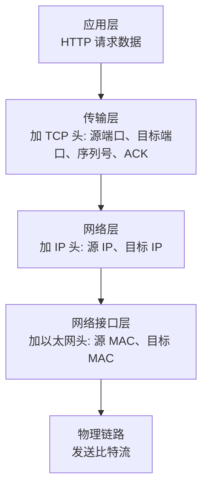
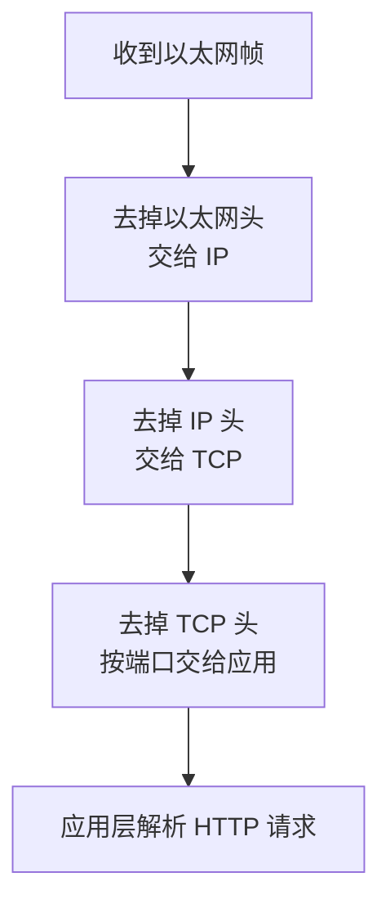

# 第 1 课：网络模型与封装：OSI、TCP/IP 与一次请求如何穿过协议栈

## 学习目标

- 区分 OSI 七层模型和 TCP/IP 四层模型。
- 说清应用层、传输层、网络层、网络接口层分别负责什么。
- 理解封装与解封装：发送端每层加头，接收端每层去头。
- 能把“一次 HTTP 请求”从应用数据讲到以太网帧。

## 为什么要分层

网络通信要解决的问题太多：

- 应用程序怎么表达请求？
- 两个进程之间怎么建立可靠传输？
- 数据包怎么跨网段找到目标主机？
- 同一个局域网里怎么找到下一跳设备？
- 比特流怎么在网线、光纤、无线信道上传输？

如果所有问题揉在一起，协议会非常难实现、难演进。分层的意义就是把复杂问题拆开：每一层只解决自己的问题，并给上一层提供稳定接口。

## OSI 七层模型

OSI 模型从上到下是：

| 层级 | 主要职责 | 常见理解 |
| --- | --- | --- |
| 应用层 | 为应用程序提供网络服务 | HTTP、DNS、FTP、SMTP |
| 表示层 | 数据格式转换、编码、加密压缩 | JSON、字符集、加密格式 |
| 会话层 | 管理会话建立、维持、终止 | 会话控制、检查点 |
| 传输层 | 端到端进程通信 | TCP、UDP |
| 网络层 | 主机到主机的寻址和路由 | IP、ICMP |
| 数据链路层 | 同一链路上的帧传输 | 以太网、MAC |
| 物理层 | 比特流传输 | 网线、光纤、无线电信号 |

OSI 更像教学和标准化模型，概念清晰，但工程实现里更常说 TCP/IP 模型。

## TCP/IP 四层模型

TCP/IP 模型通常分为：

| TCP/IP 层级 | 对应 OSI | 常见协议 |
| --- | --- | --- |
| 应用层 | 应用层、表示层、会话层 | HTTP、HTTPS、DNS、FTP、SMTP |
| 传输层 | 传输层 | TCP、UDP |
| 网络层 | 网络层 | IP、ICMP |
| 网络接口层 | 数据链路层、物理层 | 以太网、Wi-Fi、ARP |

面试里如果问“TCP、IP 分别在哪一层”，回答要直接：

- TCP 在传输层，解决端到端进程通信、可靠传输、流量控制、拥塞控制。
- IP 在网络层，解决跨网络寻址、路由和分片。

## 一次请求如何封装

假设浏览器发送一个 HTTP 请求，发送端的协议栈可以简化为：



接收端则反过来：



这个过程叫封装与解封装。

## 每层看到的地址不同

这是一个非常关键的面试点：

- 应用层通常关心 URL、域名、路径、Header。
- 传输层关心端口号，用来定位具体进程。
- 网络层关心 IP 地址，用来定位主机。
- 链路层关心 MAC 地址，用来在同一链路内发送帧。

所以一条请求里可能同时有这些“地址”：

```text
https://api.example.com/users/1
域名: api.example.com
目标 IP: 203.0.113.10
目标端口: 443
下一跳 MAC: 网关或目标主机的 MAC
```

域名不是网络层地址，端口不是主机地址，MAC 也不能跨公网路由。它们分别属于不同层。

## 面试高频误区

第一个误区：把 HTTPS 当成一个独立传输层协议。

更准确的说法是：HTTPS 是 HTTP over TLS。HTTP 仍是应用层协议，TLS 位于 HTTP 与 TCP 之间，为 HTTP 报文提供加密、完整性校验和身份认证。

第二个误区：以为 TCP/IP 模型没有物理传输。

TCP/IP 四层模型把 OSI 的数据链路层和物理层合并到了网络接口层，不代表不需要物理链路。

第三个误区：以为路由器会看 HTTP。

普通三层路由器主要看 IP 头做路由转发，不关心 HTTP 内容。七层网关、反向代理、WAF 才会解析 HTTP。

## 小结

- OSI 七层适合理解职责边界，TCP/IP 四层更贴近实际协议栈。
- 发送端逐层加头，接收端逐层去头。
- TCP 负责端到端进程通信，IP 负责主机间寻址路由，链路层负责同一链路内传输。
- 一次请求不是“HTTP 直接发到服务器”，而是经过应用层、传输层、网络层、网络接口层逐层协作。

## 问题

1. OSI 七层和 TCP/IP 四层如何对应？
2. TCP 和 IP 分别解决什么问题？
3. 为什么 URL、IP、端口、MAC 不能混为一谈？
4. HTTP 请求从浏览器发出时，每一层分别会添加什么信息？

