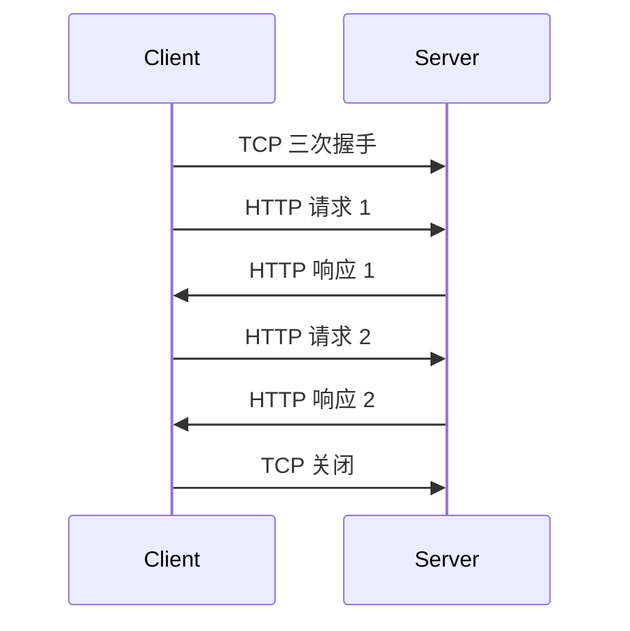

# 第 2 课：HTTP 基础：报文、方法、状态码、长连接与断点续传

## 学习目标

- 掌握 HTTP 请求报文和响应报文结构。
- 区分常见方法的语义、安全性和幂等性。
- 能解释常见状态码，尤其是 301/302、502/504。
- 理解短连接、长连接、Content-Length、Range 断点续传。

## HTTP 是什么

HTTP 是应用层协议，定义客户端和服务端之间如何表达请求和响应。它不负责可靠传输，可靠传输通常由下层 TCP 提供。

一句话：

> HTTP 解决“应用数据怎么组织和解释”，TCP 解决“字节流如何可靠送达”。

## HTTP 报文结构

HTTP 请求报文由四部分组成：

```text
请求行
请求头
空行
请求体
```

示例：

```http
GET /articles/1 HTTP/1.1
Host: example.com
User-Agent: curl/8.0
Accept: application/json

```

POST 请求可能有请求体：

```http
POST /comments HTTP/1.1
Host: example.com
Content-Type: application/json
Content-Length: 23

{"content":"hello"}
```

HTTP 响应报文也由四部分组成：

```text
状态行
响应头
空行
响应体
```

示例：

```http
HTTP/1.1 200 OK
Content-Type: application/json
Content-Length: 15

{"ok":true}
```

空行很重要，它标记头部结束，后面才是 body。

## 常见请求方法

| 方法 | 语义 | 是否安全 | 是否幂等 | 典型场景 |
| --- | --- | --- | --- | --- |
| GET | 获取资源 | 是 | 是 | 查询文章、下载页面 |
| POST | 提交数据或创建子资源 | 否 | 通常否 | 创建订单、提交表单 |
| PUT | 整体替换资源 | 否 | 是 | 更新完整用户资料 |
| PATCH | 局部修改资源 | 否 | 不一定 | 修改部分字段 |
| DELETE | 删除资源 | 否 | 是 | 删除一条记录 |
| HEAD | 只获取响应头 | 是 | 是 | 探测资源元信息 |

“安全”指不会修改服务端状态；“幂等”指执行一次和执行多次的结果相同。

注意：这是协议语义，不是强制能力。业务代码可以错误地用 GET 删除数据，但那是实现违背语义。

## GET 与 POST 的高频区别

可以从四个角度回答：

1. 语义：GET 获取资源，POST 提交数据让服务端处理。
2. 参数位置：GET 通常放在 URL 查询串，POST 通常放在请求体。
3. 缓存与书签：GET 更适合缓存、分享、收藏；POST 通常不被浏览器直接缓存。
4. 安全与幂等：GET 按规范应安全且幂等；POST 通常不安全且不幂等。

不要说“GET 一定没有请求体，POST 一定更安全”。HTTP 协议本身没有把安全性建立在方法名上，安全性取决于 HTTPS、认证授权、输入校验等整体设计。

## 状态码

HTTP 状态码分五类：

| 类型 | 含义 | 常见状态码 |
| --- | --- | --- |
| 1xx | 中间状态，继续处理 | 100 |
| 2xx | 成功 | 200、201、204、206 |
| 3xx | 重定向 | 301、302、304、307、308 |
| 4xx | 客户端错误 | 400、401、403、404、405、409、429 |
| 5xx | 服务端错误 | 500、502、503、504 |

几个高频状态码：

- 200 OK：请求成功。
- 204 No Content：成功但没有响应体。
- 206 Partial Content：范围请求成功，常用于断点续传。
- 301 Moved Permanently：永久重定向，浏览器和搜索引擎可能缓存新地址。
- 302 Found：临时重定向，本次临时跳转。
- 304 Not Modified：缓存仍可用，服务端不返回完整内容。
- 400 Bad Request：请求格式或参数错误。
- 401 Unauthorized：未认证或认证失败。
- 403 Forbidden：已认证但没有权限。
- 404 Not Found：资源不存在。
- 409 Conflict：资源状态冲突。
- 429 Too Many Requests：请求过多，被限流。
- 500 Internal Server Error：服务端内部错误。
- 502 Bad Gateway：网关从上游拿到无效响应。
- 503 Service Unavailable：服务暂不可用。
- 504 Gateway Timeout：网关等待上游超时。

## 301 和 302 的区别

301 是永久重定向，表示资源以后应该使用新 URL。客户端、浏览器缓存、搜索引擎都可能记住这个变化。

302 是临时重定向，表示这次先去另一个 URL，未来仍可访问原 URL。

两者通常都会通过 `Location` 响应头告诉客户端跳转地址。

## 502 和 504 的区别

以 Nginx 反向代理为例：

- 502：Nginx 联系到了上游，但上游响应无效，比如连接被重置、协议错误、上游崩溃。
- 504：Nginx 等上游响应等超时了。

排查时方向不同：

- 502 更关注上游进程是否存活、端口是否监听、连接是否被拒绝或重置。
- 504 更关注上游慢、数据库慢、线程池打满、网络超时、代理超时配置。

## 短连接与长连接

HTTP 是请求-响应模型。早期 HTTP/1.0 默认一个 TCP 连接只处理一次请求响应，然后关闭连接，这就是短连接。

短连接的问题是每个请求都要：

1. TCP 三次握手。
2. 发送 HTTP 请求。
3. 接收 HTTP 响应。
4. TCP 四次挥手。

连接建立和释放成本太高。

HTTP/1.1 默认支持长连接，也叫 Keep-Alive：一个 TCP 连接可以承载多个 HTTP 请求响应。



长连接降低了连接建立成本，但也需要连接池、空闲超时、服务端主动关闭等治理。

## HTTP/1.1 如何判断 body 边界

HTTP 基于 TCP 字节流，TCP 不知道 HTTP 报文边界。HTTP/1.1 常见的 body 边界识别方式有：

1. `Content-Length`：明确告诉接收方 body 有多少字节。
2. `Transfer-Encoding: chunked`：分块传输，每块有长度，最后用 0 长度块结束。
3. 对某些响应，连接关闭也可以作为结束标识，但这不适合长连接复用。

所以“HTTP 拆包”不是 TCP 自动做的，而是应用层协议根据自己的格式解析。

## 断点续传

断点续传依赖范围请求。

典型流程：

1. 服务端响应 `Accept-Ranges: bytes`，表示支持字节范围请求。
2. 客户端下载到一半断开，记录已经下载的位置。
3. 恢复时客户端发送 `Range: bytes=512000-`。
4. 服务端返回 `206 Partial Content`，并通过 `Content-Range` 表明返回范围。

示例：

```http
GET /large-file HTTP/1.1
Host: example.com
Range: bytes=512000-
```

响应：

```http
HTTP/1.1 206 Partial Content
Accept-Ranges: bytes
Content-Range: bytes 512000-1023999/1024000
Content-Length: 512000
```

如果请求范围不合法，服务端可以返回 `416 Range Not Satisfiable`。

## 小结

- HTTP 报文由起始行、头部、空行、body 组成。
- GET/POST 的核心区别是语义、安全性和幂等性，不只是参数位置。
- 301 是永久重定向，302 是临时重定向。
- 502 是网关拿到无效上游响应，504 是等待上游超时。
- 长连接复用 TCP，降低握手和挥手成本。
- HTTP/1.1 常用 Content-Length 或 chunked 解决 body 边界问题。
- 断点续传依赖 Range、Content-Range、Accept-Ranges、Content-Length 和 206。

## 问题

1. HTTP 请求报文和响应报文分别由哪几部分组成？
2. GET 和 POST 的区别应该从哪些角度回答？
3. 502 和 504 在线上排查时分别指向什么方向？
4. HTTP 基于 TCP，为什么还要自己处理报文边界？

