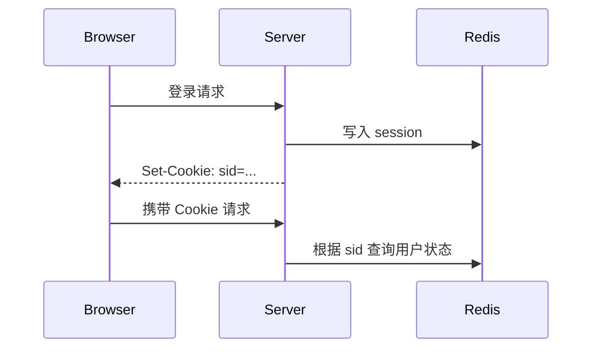

# 第 3 课：HTTP 状态与连接升级：Cookie、Session、JWT 与 WebSocket

## 学习目标

- 理解 HTTP 无状态的含义和优缺点。
- 区分 Cookie、Session、JWT 的职责和风险。
- 说清 WebSocket 和 HTTP 长连接的区别。
- 能回答“HTTP、Socket、TCP 分别是什么”。

## HTTP 为什么说是无状态

HTTP 无状态指的是：协议本身不要求服务端记住每个客户端之前的请求。每个请求都应该携带足够信息，让服务端能独立理解并处理。

无状态的好处：

- 服务端实现简单。
- 更容易横向扩展，请求可以被负载均衡到不同机器。
- 中间代理、缓存更容易工作。

无状态的代价：

- 登录态、购物车、用户偏好等状态需要额外机制保存。
- 每次请求都需要携带认证信息或会话标识。

所以“HTTP 无状态”不等于“Web 应用不能有状态”。状态通常放在 Cookie、Session、Token、数据库或缓存里。

## Cookie

Cookie 是浏览器保存的一小段键值数据。服务端通过响应头写入：

```http
Set-Cookie: sid=abc123; HttpOnly; Secure; SameSite=Lax; Path=/
```

之后浏览器访问同域名时，会自动带上：

```http
Cookie: sid=abc123
```

常见属性：

- `HttpOnly`：禁止 JavaScript 读取，降低 XSS 窃取风险。
- `Secure`：只在 HTTPS 下发送。
- `SameSite`：限制跨站请求携带 Cookie，降低 CSRF 风险。
- `Max-Age` / `Expires`：控制过期时间。
- `Domain` / `Path`：控制作用域。

Cookie 适合保存会话标识，不适合保存敏感业务数据本身。

## Session

Session 是服务端保存用户状态的一种方式。常见做法：

1. 用户登录成功。
2. 服务端生成 session id。
3. 服务端把用户状态存到内存、Redis 或数据库。
4. 服务端通过 Cookie 把 session id 发给浏览器。
5. 后续请求带上 session id，服务端查状态。



Session 的优点是服务端可控，能主动失效；缺点是需要存储和共享状态。多台应用服务器时，通常会把 Session 放到 Redis 集群或统一会话服务里。

## JWT

JWT 是一种自包含 Token，典型结构是三段：

```text
Header.Payload.Signature
```

- Header：签名算法、Token 类型。
- Payload：声明信息，比如用户 id、过期时间、权限范围。
- Signature：对前两段做签名，防止被篡改。

JWT 的优点：

- 服务端可以不保存会话状态。
- 适合跨服务传递身份声明。
- 对微服务、移动端、开放 API 比较友好。

JWT 的风险：

- Payload 只是编码，不是天然加密，不能放敏感明文。
- 一旦签发，在过期前通常不好主动撤销，除非引入黑名单或版本号。
- 签名密钥泄漏会导致严重安全问题。

对比：

| 方案 | 状态位置 | 优点 | 风险 |
| --- | --- | --- | --- |
| Cookie | 客户端 | 浏览器自动携带 | 容易受 XSS/CSRF 影响，需要安全属性 |
| Session | 服务端 | 可控、可主动失效 | 需要集中存储和扩展 |
| JWT | 客户端携带自包含 Token | 无状态、跨服务方便 | 撤销困难，密钥和过期策略要谨慎 |

## WebSocket 与 HTTP 长连接

HTTP 长连接只是复用一个 TCP 连接发送多个请求响应，仍然是“客户端请求，服务端响应”的模型。

WebSocket 是连接升级后的全双工通信协议。建立时先通过 HTTP 发起升级：

```http
GET /chat HTTP/1.1
Host: example.com
Upgrade: websocket
Connection: Upgrade
Sec-WebSocket-Key: ...
```

服务端同意后返回 `101 Switching Protocols`，后续连接就按 WebSocket 帧通信。

区别：

| 维度 | HTTP 长连接 | WebSocket |
| --- | --- | --- |
| 通信模式 | 请求-响应 | 全双工 |
| 服务端主动推送 | 不自然，需要轮询、长轮询或 SSE | 原生支持 |
| 连接建立 | TCP 后直接 HTTP | 先 HTTP Upgrade |
| 典型场景 | 普通 API、网页资源 | IM、实时行情、协同编辑、游戏 |

## HTTP、Socket、TCP 的区别

这个问题容易混层。

- TCP 是传输层协议，提供面向连接、可靠、有序的字节流。
- HTTP 是应用层协议，定义请求和响应的格式与语义。
- Socket 是操作系统提供的网络编程接口，是应用程序使用 TCP/UDP 的入口。

关系可以这样理解：

```text
应用代码 -> Socket API -> TCP 协议栈 -> IP -> 网络接口
HTTP 报文是应用代码通过 Socket 写入 TCP 字节流的数据
```

所以不能说“HTTP 和 Socket 哪个更底层”时只比较协议。Socket 不是协议，而是编程接口。

## 小结

- HTTP 无状态是协议设计，不代表业务系统不能维护登录态。
- Cookie 是客户端保存和自动携带的数据，Session 是服务端保存状态，JWT 是签名后的自包含声明。
- HTTP 长连接仍是请求-响应，WebSocket 是连接升级后的全双工通信。
- TCP 是协议，HTTP 是协议，Socket 是编程接口。

## 问题

1. HTTP 无状态的好处和代价是什么？
2. Cookie、Session、JWT 分别适合什么场景？
3. JWT 为什么不能直接存敏感明文？
4. WebSocket 和 HTTP Keep-Alive 的核心区别是什么？

