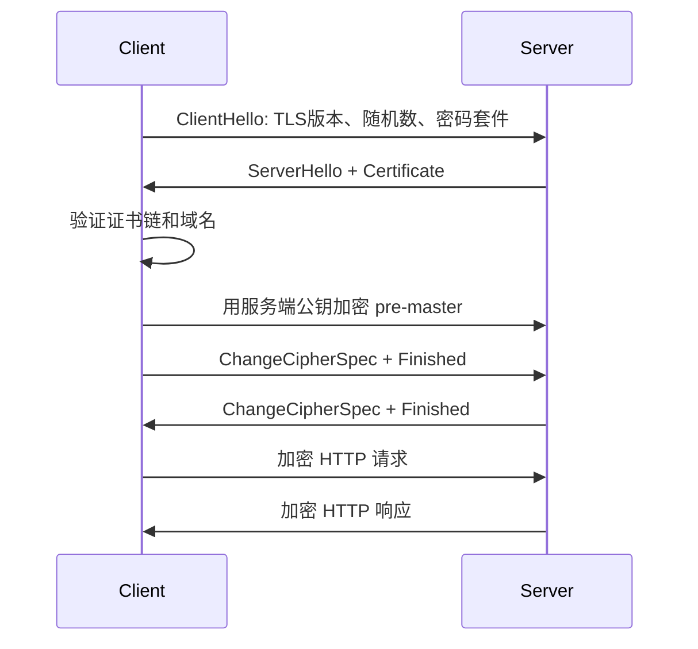

# 第 4 课：HTTPS 与 TLS：证书链、握手、密钥交换与中间人防护

## 学习目标

- 说清 HTTP 为什么不安全，HTTPS 解决了什么。
- 理解 TLS 在 HTTP 与 TCP 之间的位置。
- 掌握 TLS 1.2 RSA 握手作为历史基础，并知道 TLS 1.3 的现代差异。
- 能解释证书链如何防中间人攻击。

## HTTP 的三个风险

HTTP 明文传输，主要有三类风险：

- 窃听：链路上的中间节点可以看到请求和响应内容。
- 篡改：中间节点可以修改报文内容。
- 冒充：客户端无法确认自己连接的真的是目标服务器。

HTTPS 在 HTTP 和 TCP 之间加入 TLS，解决对应问题：

- 加密：防止内容被直接窃听。
- 完整性校验：防止内容被篡改而不被发现。
- 身份认证：通过证书链确认服务器身份。

```text
HTTP
TLS
TCP
IP
链路层
```

## HTTPS 不等于“只用了非对称加密”

HTTPS 实际上是混合加密：

- 非对称加密或密钥交换用于身份认证和协商密钥。
- 对称加密用于后续大量业务数据传输。

原因很简单：非对称加密开销大，不适合加密所有业务数据；对称加密快，但双方必须先安全地协商出同一把会话密钥。

## TLS 1.2 RSA 握手

TLS 1.2 里曾经常见 RSA 密钥交换。它的过程可以这样理解：

1. ClientHello
   - 客户端发送支持的 TLS 版本、随机数、密码套件列表。
2. ServerHello + Certificate
   - 服务端选择 TLS 版本和密码套件，发送服务端随机数和证书。
3. ClientKeyExchange + ChangeCipherSpec + Finished
   - 客户端验证证书。
   - 生成 pre-master secret。
   - 用证书里的服务端公钥加密后发给服务端。
   - 客户端根据客户端随机数、服务端随机数、pre-master secret 计算会话密钥。
4. Server ChangeCipherSpec + Finished
   - 服务端用私钥解密得到 pre-master secret。
   - 服务端计算同样的会话密钥。
   - 双方之后使用会话密钥加密通信。

简化链路：



## TLS 1.3 的现代变化

面试时可以补一句：上面的 RSA 握手主要是历史基础。TLS 1.3 已经移除静态 RSA 密钥交换，现代握手通常使用 ECDHE 这类支持前向安全的密钥交换方式。

TLS 1.3 的核心变化：

- 只保留更安全的密码套件。
- 默认支持前向安全。
- 常规握手从 TLS 1.2 的 2-RTT 降为 1-RTT。
- 支持 0-RTT 会话恢复，但 0-RTT 有重放风险，需要谨慎用于幂等请求。

前向安全指的是：即使服务端长期私钥未来泄漏，攻击者也不能解密过去抓到的历史通信内容。静态 RSA 密钥交换做不到这一点，而 ECDHE 可以。

## 证书链如何防中间人

HTTPS 防中间人攻击的关键不是“服务端给了一个公钥”，而是客户端要确认这个公钥确实属于目标域名。

证书验证大致包括：

1. 证书是否由受信任 CA 签发。
2. 证书链是否完整，从站点证书能追溯到可信根证书。
3. 证书域名是否匹配访问域名。
4. 证书是否在有效期内。
5. 证书是否被吊销或不再可信。
6. 签名算法和密钥长度是否安全。

如果中间人自己生成一张证书，它没有可信 CA 的签名，浏览器就会提示风险。

如果中间人拿自己的证书冒充目标域名，域名校验也会失败。

## 为什么不能只用对称加密

如果只用对称加密，客户端和服务端必须提前共享密钥。互联网上任意两个陌生端点第一次通信时，没有安全渠道把密钥交给对方。

TLS 的价值就是：在不安全网络上，通过证书认证和密钥交换，安全地产生后续对称加密需要的会话密钥。

## HTTPS 仍然不能解决什么

HTTPS 解决的是传输层面的机密性、完整性和服务器身份认证，不代表业务系统一定安全。

它不能直接解决：

- 服务端被入侵。
- 用户被钓鱼到另一个合法 HTTPS 域名。
- XSS、CSRF、SQL 注入。
- 客户端设备本身不可信。
- 证书私钥泄漏后的主动攻击风险。

## 小结

- HTTP 明文传输有窃听、篡改、冒充风险。
- HTTPS 是 HTTP over TLS，TLS 位于 HTTP 与 TCP 之间。
- HTTPS 使用混合加密：密钥交换和身份认证依赖非对称体系，业务数据用对称加密。
- TLS 1.2 RSA 握手是历史基础，TLS 1.3 使用更现代的前向安全密钥交换。
- 证书链的本质是让客户端确认“这个公钥确实属于这个域名”。

## 问题

1. HTTPS 分别如何解决窃听、篡改和冒充？
2. 为什么 HTTPS 不用非对称加密加密所有业务数据？
3. TLS 1.2 RSA 握手和 TLS 1.3 的核心差异是什么？
4. 中间人为什么不能随便替换服务端公钥？

