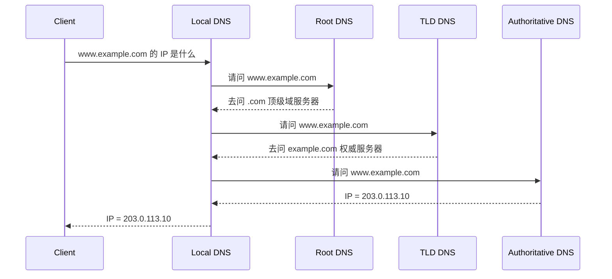

# 第 5 课：DNS：域名层级、递归迭代解析、缓存与 TCP/UDP 选择

## 学习目标

- 理解 DNS 是分布式域名数据库。
- 说清根域、顶级域、权威域名服务器、本地 DNS 的关系。
- 区分递归查询和迭代查询。
- 解释 DNS 为什么通常用 UDP，也会在某些场景使用 TCP。

## DNS 解决什么问题

人容易记域名，机器需要 IP 地址。DNS 的核心职责就是把域名解析成 IP 地址，也可以返回其他类型记录。

常见记录：

- A：域名到 IPv4 地址。
- AAAA：域名到 IPv6 地址。
- CNAME：别名记录。
- MX：邮件服务器记录。
- NS：域名由哪些权威服务器负责。
- TXT：文本记录，常用于校验和安全策略。

## 域名层级

以 `www.example.com` 为例：

```text
根域 .
  └── com
       └── example.com
            └── www.example.com
```

DNS 是分层授权体系：

- 根域服务器知道顶级域服务器在哪里。
- 顶级域服务器知道某个二级域的权威服务器在哪里。
- 权威域名服务器保存具体域名记录。
- 本地 DNS 负责替客户端完成查询和缓存。

## 递归查询与迭代查询

客户端通常把问题交给本地 DNS：

> 请你帮我查 `www.example.com` 的 IP。

这叫递归查询：客户端希望本地 DNS 最终给出答案。

本地 DNS 去问根域、顶级域、权威服务器时，通常是迭代查询：对方不一定直接给最终答案，而是告诉你下一步该问谁。



## DNS 缓存

DNS 查询链路较长，所以几乎每一层都会缓存：

- 浏览器缓存。
- 操作系统缓存。
- 本地 DNS 缓存。
- 中间递归解析器缓存。

缓存由 TTL 控制。TTL 越长，解析压力越低，但域名切换生效越慢；TTL 越短，切换更快，但查询量更大。

线上切流时常见做法是：提前把 TTL 调小，等旧缓存过期后再切换记录。

## DNS 用 TCP 还是 UDP

DNS 默认使用 UDP 53 端口，因为：

- 查询响应通常很小。
- UDP 无需建连接，延迟低。
- DNS 查询天然适合短请求。

但 DNS 也会使用 TCP 53：

- 响应太大，UDP 放不下或被截断。
- 区域传送，例如主从 DNS 同步。
- 某些安全扩展或网络环境要求。

所以准确回答是：DNS 主要用 UDP，但不是只用 UDP。

## DNS 劫持与污染

DNS 劫持指攻击者篡改解析结果，把用户导向错误 IP。可能发生在：

- 本地设备恶意软件。
- 路由器或运营商链路。
- 不可信 DNS 服务器。
- 企业代理或中间设备。

防护思路：

- 使用可信 DNS。
- 使用 DNS over HTTPS 或 DNS over TLS。
- 重要业务使用 HTTPS 证书校验，即使 DNS 被劫持，证书不匹配也应阻断。
- 客户端或服务端对关键域名做监控和告警。

## DNS 与负载均衡

DNS 可以做简单负载均衡，例如一个域名返回多个 IP。但 DNS 负载均衡有局限：

- 客户端和递归 DNS 会缓存结果。
- 故障 IP 不一定能立刻摘除。
- 不感知应用层健康状态，除非结合权威 DNS 的健康检查能力。

因此大型系统常把 DNS、GSLB、CDN、L4/L7 负载均衡结合使用。

## 小结

- DNS 是分布式、分层授权的域名解析系统。
- 客户端到本地 DNS 通常是递归查询，本地 DNS 到上游通常是迭代查询。
- DNS 缓存能降低延迟和压力，但会影响变更生效速度。
- DNS 默认用 UDP 53，但大响应、区域传送等场景会用 TCP 53。
- HTTPS 证书校验是抵御 DNS 劫持后冒充站点的重要防线。

## 问题

1. 根域、顶级域、权威 DNS、本地 DNS 分别负责什么？
2. 递归查询和迭代查询有什么区别？
3. DNS 为什么通常用 UDP？什么时候会用 TCP？
4. DNS 劫持后，HTTPS 为什么仍然能提供一层保护？

