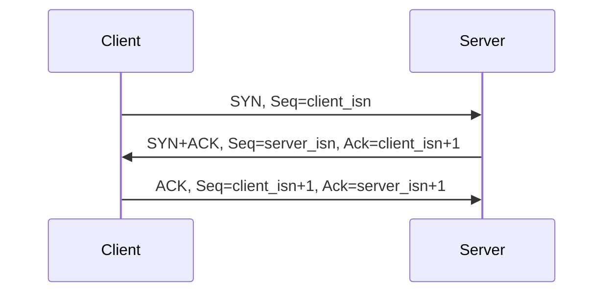
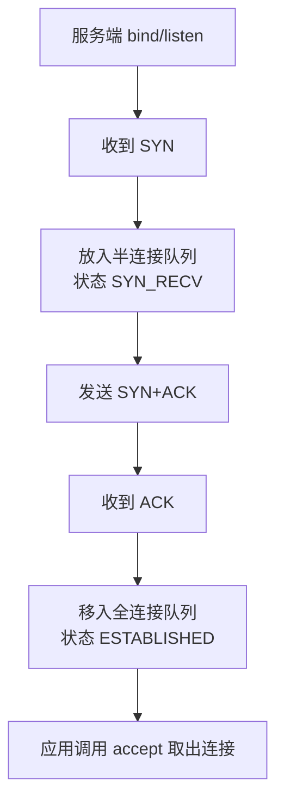

# 第 6 课：TCP 三次握手深挖：序列号、历史连接、队列与 SYN Cookie

## 学习目标

- 能准确描述三次握手过程和序列号、确认号变化。
- 解释为什么不是两次握手。
- 理解第三次 ACK 丢失、半连接队列、全连接队列、accept 的关系。
- 知道 SYN Flood 与 SYN Cookie 的基本原理。

## TCP 头部关键字段

TCP 头部里和握手最相关的是：

- 源端口、目标端口：定位通信两端进程。
- 序列号 `Seq`：当前报文段第一个字节的序号。
- 确认号 `Ack`：期望对方下一个发送的序号。
- 标志位：SYN、ACK、FIN、RST、PSH、URG 等。
- 窗口大小：用于流量控制。

SYN 和 FIN 虽然不携带业务数据，但会消耗一个序列号。

## 三次握手过程

假设客户端初始序列号是 `client_isn`，服务端初始序列号是 `server_isn`。

三次握手完成后：

- 客户端确认自己能发、能收，也确认服务端能发、能收。
- 服务端确认自己能发、能收，也确认客户端能发、能收。
- 双方同步了初始序列号，后续可靠传输才能基于序列号和 ACK 运转。

## 为什么不是两次握手

两次握手的问题在于：服务端在发出 SYN+ACK 后就认为连接建立，但客户端未必收到，也未必确认服务端的初始序列号。

更重要的是历史连接问题。

假设客户端以前发过一个 SYN，因为网络拥塞迟迟没有到达。客户端超时后又发了新的 SYN，并基于新 SYN 建立连接。过一会旧 SYN 到了服务端。

如果只有两次握手，服务端收到旧 SYN 后发 SYN+ACK 就可能直接建立一条无效连接，浪费资源，甚至让双方状态不一致。

三次握手中，客户端收到旧 SYN 对应的 SYN+ACK，会发现确认号不是当前期望的序列号，于是可以发送 RST 中止旧连接。

一句话：

> 三次握手不仅确认双方收发能力，还能让客户端校验服务端响应的是哪一次连接尝试，避免历史 SYN 造成错误连接。

## 为什么不是四次握手

四次握手当然也能建立连接：

1. 客户端发 SYN。
2. 服务端回 ACK。
3. 服务端发 SYN。
4. 客户端回 ACK。

但服务端的 ACK 和 SYN 可以合并成一个 SYN+ACK，所以三次足够。

## 第三次 ACK 丢了会怎样

第三次 ACK 丢失后，客户端通常已经进入 ESTABLISHED，认为连接建立。

服务端还停留在 SYN_RECV，因为没有收到最终 ACK。它会重传 SYN+ACK，等待客户端再次 ACK。

如果客户端随后发送业务数据，数据包里通常也带 ACK，服务端收到后也可以进入 ESTABLISHED。

如果服务端一直收不到第三次握手，会根据重传次数和超时策略放弃连接。

## 半连接队列、全连接队列与 accept

服务端调用 `listen()` 后，内核维护两个队列：

- 半连接队列：收到 SYN，发送 SYN+ACK，等待第三次 ACK 的连接。
- 全连接队列：三次握手完成，等待应用程序 `accept()` 取走的连接。

流程：

`accept()` 并不参与三次握手本身。三次握手由内核协议栈完成，`accept()` 只是从全连接队列里取出已经建立好的连接。

## SYN Flood 与 SYN Cookie

SYN Flood 攻击是攻击者大量发送 SYN，但不完成第三次握手，导致服务端半连接队列被占满。

SYN Cookie 的思路是：当半连接队列压力很大时，服务端不立即为每个 SYN 分配完整连接状态，而是把必要信息编码进 SYN+ACK 的序列号里。客户端如果真的存在，会回 ACK，服务端再根据 ACK 校验并恢复连接信息。

这样能降低半连接队列被打满时的资源消耗。

但 SYN Cookie 也有代价：它不是常规路径的万能替代，可能限制部分 TCP 选项能力，也不能替代上游清洗、限流、防火墙和容量治理。

## Linux 相关参数怎么理解

常见参数：

- `tcp_syn_retries`：客户端 SYN 重试次数。
- `tcp_synack_retries`：服务端 SYN+ACK 重试次数。
- `somaxconn`：监听队列相关上限。
- `tcp_max_syn_backlog`：半连接队列相关上限。
- `tcp_syncookies`：是否启用 SYN Cookie。

不要机械说“调大就好”。调参要结合连接量、攻击流量、应用 accept 速度、负载均衡和上游防护一起看。

## 小结

- 三次握手同步双方初始序列号，并确认双方收发能力。
- 两次握手会让服务端过早建立连接，无法可靠处理历史 SYN。
- 四次握手可以，但服务端 ACK 和 SYN 能合并，所以三次足够。
- 第三次 ACK 丢失时，服务端会重传 SYN+ACK，客户端业务数据也可能携带 ACK 完成确认。
- 半连接队列存等待第三次 ACK 的连接，全连接队列存已完成握手等待 accept 的连接。
- SYN Cookie 用于缓解 SYN Flood 下半连接队列被占满的问题。

## 问题

1. 三次握手每个报文的 SYN、ACK、Seq、Ack 如何变化？
2. 为什么两次握手无法可靠避免历史连接？
3. 第三次 ACK 丢失后客户端和服务端分别是什么状态？
4. accept 和三次握手是什么关系？

