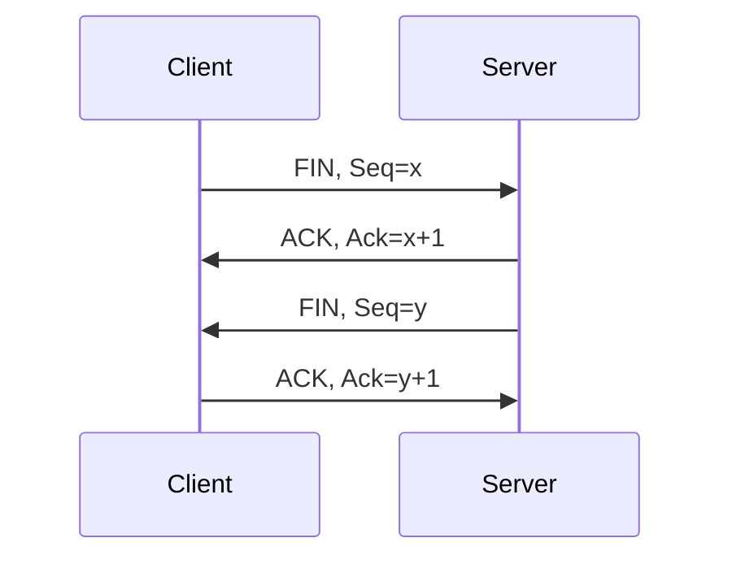

# 第 7 课：TCP 四次挥手深挖：TIME_WAIT、CLOSE_WAIT、FIN_WAIT2 与保活

## 学习目标

- 掌握 TCP 四次挥手过程。
- 理解为什么挥手通常是四次，而握手是三次。
- 说清 TIME_WAIT、CLOSE_WAIT、FIN_WAIT2 的意义和常见问题。
- 区分 TCP Keepalive 和应用层心跳。

## 四次挥手过程

假设客户端主动关闭连接：



状态变化：

- 主动关闭方：ESTABLISHED -> FIN_WAIT_1 -> FIN_WAIT_2 -> TIME_WAIT -> CLOSED
- 被动关闭方：ESTABLISHED -> CLOSE_WAIT -> LAST_ACK -> CLOSED

## 为什么挥手通常是四次

建立连接时，服务端的 SYN 和 ACK 可以合并成一个 SYN+ACK。

关闭连接时，一端收到 FIN 只表示“对方不再发送数据了”，但自己可能还有数据要发。因此收到 FIN 后先回 ACK，等本端数据发送完、应用调用 close 后，再发送自己的 FIN。

这就是挥手通常需要四次的原因。

如果被动关闭方没有剩余数据要发，也可能把 ACK 和 FIN 合并，但语义上仍然是双方各自关闭自己的发送方向。

## TIME_WAIT 为什么要等 2MSL

主动关闭方最后进入 TIME_WAIT，等待 2MSL。MSL 是报文在网络中的最大生存时间。

TIME_WAIT 有两个核心作用：

第一，保证最后一个 ACK 有机会被对方收到。

如果最后 ACK 丢失，被动关闭方会重传 FIN。主动关闭方还在 TIME_WAIT，就能再次回复 ACK。如果主动关闭方立刻关闭，收到重传 FIN 可能只能回 RST，导致对方认为异常。

第二，避免旧连接的残留报文污染新连接。

TCP 连接由四元组标识：

```text
源 IP、源端口、目标 IP、目标端口
```

如果立刻复用同一个四元组，旧连接在网络中延迟到达的报文可能被新连接误收。等待 2MSL 可以让旧报文自然过期。

## 大量 TIME_WAIT 是不是一定有问题

不一定。

TIME_WAIT 通常出现在主动关闭连接的一方。HTTP 短连接、客户端主动关闭、代理主动关闭上游连接，都可能产生大量 TIME_WAIT。

判断是否有问题要看：

- 是否耗尽本地临时端口。
- 是否造成连接建立失败。
- 是否连接复用策略不合理。
- 是否服务端或代理空闲超时设置过短。

治理方式：

- 优先使用 HTTP 长连接和连接池。
- 调整应用超时和代理 keepalive。
- 合理扩大端口范围。
- 谨慎调整内核参数，不要为了“看起来干净”盲目消灭 TIME_WAIT。

## CLOSE_WAIT 过多说明什么

CLOSE_WAIT 出现在被动关闭方。

流程是：对端发 FIN，本端内核回 ACK，然后等待应用程序调用 close 关闭连接。如果应用一直不 close，就会堆积 CLOSE_WAIT。

所以大量 CLOSE_WAIT 通常说明：

- 应用没有正确关闭 socket。
- 连接泄漏。
- 线程阻塞导致清理逻辑不执行。
- 某些异常路径没有释放资源。

这通常是应用问题，不是简单调内核参数能解决。

## FIN_WAIT2 过多说明什么

主动关闭方发出 FIN 并收到 ACK 后进入 FIN_WAIT2，等待对方发送 FIN。

如果对方一直不 close，主动关闭方就可能长时间停在 FIN_WAIT2。

常见原因：

- 对端应用没有关闭连接。
- 对端还在发送数据。
- 网络异常导致 FIN 丢失。
- 本端使用 `shutdown(SHUT_WR)` 只关闭写方向，还保留读方向。

Linux 里孤儿连接的 FIN_WAIT2 持续时间会受 `tcp_fin_timeout` 等参数影响，但有应用引用的连接不一定按孤儿连接处理。

## TCP Keepalive

TCP Keepalive 用来检测空闲连接是否还活着。典型参数：

```text
tcp_keepalive_time + tcp_keepalive_intvl * tcp_keepalive_probes
```

常见默认值可能很长，例如 7200 秒后才开始探测，每 75 秒探测一次，探测 9 次，总时间超过 2 小时。

这说明 TCP Keepalive 更适合清理长时间空闲死连接，不适合业务快速故障感知。

业务系统通常还会实现应用层心跳：

- WebSocket ping/pong。
- RPC 心跳。
- 客户端定期保活请求。

应用层心跳可以携带业务语义，超时时间也更可控。

## 服务端主动断开 HTTP 长连接

HTTP 长连接不是永久连接。服务端可能因为：

- 空闲超时。
- 达到最大请求数。
- 负载过高。
- 应用重启。
- 上游连接池回收。

主动关闭连接。

客户端必须能处理连接被关闭后的重连或重试。对于非幂等请求，重试要格外谨慎。

## 小结

- TCP 连接关闭是双向关闭，双方各自关闭发送方向，所以通常四次挥手。
- TIME_WAIT 保证最后 ACK 可重传，也避免旧报文污染新连接。
- 大量 TIME_WAIT 不一定是问题，要看端口和连接建立是否受影响。
- 大量 CLOSE_WAIT 通常是应用没有 close，属于资源泄漏方向。
- FIN_WAIT2 说明主动关闭方还在等对方 FIN，要结合对端行为和应用引用判断。
- TCP Keepalive 默认很慢，业务快速感知通常靠应用层心跳。

## 问题

1. 为什么连接建立是三次，关闭通常是四次？
2. TIME_WAIT 为什么要等 2MSL？
3. CLOSE_WAIT 很多时应该优先排查什么？
4. TCP Keepalive 和应用层心跳有什么区别？

