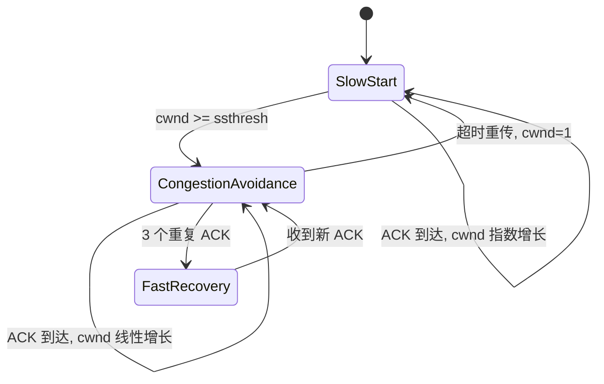

# 第 9 课：TCP 拥塞控制：慢启动、拥塞避免、快重传与快恢复

## 学习目标

- 理解拥塞控制解决的是网络过载问题。
- 掌握 cwnd、ssthresh 的含义。
- 说清慢启动、拥塞避免、快重传、快恢复的状态变化。
- 能画出超时丢包和重复 ACK 丢包时拥塞窗口的变化。

## 拥塞控制解决什么

TCP 不只要照顾接收方，还要照顾整个网络。

如果所有连接都不管链路容量，一上来就疯狂发包，路由器队列会排满、丢包增加、重传变多，网络会越来越拥塞。

拥塞控制就是发送方根据网络反馈调整发送速率。

核心变量：

- `cwnd`：拥塞窗口，发送方根据网络情况维护。
- `ssthresh`：慢启动门限，用于区分慢启动和拥塞避免。
- `rwnd`：接收窗口，由接收方通告。

实际可发送窗口：

```text
send_window = min(cwnd, rwnd)
```

## 慢启动

连接刚建立时，发送方不知道网络容量，不能一上来发太多。

慢启动的名字有点迷惑，它不是线性慢慢增，而是指数增长：

```text
cwnd = 1
收到一轮 ACK 后 cwnd = 2
再一轮 cwnd = 4
再一轮 cwnd = 8
```

直到 `cwnd >= ssthresh`，进入拥塞避免。

## 拥塞避免

到达慢启动门限后，继续指数增长太激进，于是进入拥塞避免阶段。

拥塞避免近似线性增长：

```text
每经过一个 RTT，cwnd 大约增加 1 MSS
```

它的目标是在接近网络容量时小心试探，而不是继续翻倍。

## 拥塞发生：超时重传

如果发生超时重传，TCP 认为拥塞比较严重，通常会：

```text
ssthresh = cwnd / 2
cwnd = 1
重新进入慢启动
```

这会让发送速率大幅降低。

简化曲线：

```text
cwnd: 1 -> 2 -> 4 -> 8 -> 12
发生超时
ssthresh = 6
cwnd = 1
重新慢启动: 1 -> 2 -> 4 -> 6
进入拥塞避免
```

## 快重传

如果发送方连续收到多个重复 ACK，说明网络可能只丢了一小段数据，后续数据仍然到达了接收方。

这比超时更轻。发送方可以不等 RTO，快速重传丢失报文。

典型触发条件是收到 3 个重复 ACK。

## 快恢复

快速重传后，TCP 不一定把 cwnd 直接降到 1，因为重复 ACK 说明网络仍然能传递后续包。

常见快恢复思路：

```text
ssthresh = cwnd / 2
cwnd = ssthresh + 3
收到新的 ACK 后 cwnd = ssthresh
进入拥塞避免
```

不同 TCP 拥塞控制算法细节会有所差异，但面试重点是：超时重传更严重，通常回到慢启动；重复 ACK 触发快重传和快恢复，降速但不完全归零。

## 四个算法串起来



## 拥塞控制和应用性能

拥塞控制会影响：

- 大文件下载吞吐。
- 高延迟链路下的带宽利用率。
- 短连接请求的冷启动性能。
- 丢包环境下的请求尾延迟。

为什么 HTTP 长连接、连接池、HTTP/2/HTTP/3 会有性能价值？一个原因就是减少重复握手和重复慢启动，让连接能持续利用已经探测到的网络能力。

## 小结

- 拥塞控制是发送方根据网络反馈调节发送速率。
- 慢启动是指数增长，到达 ssthresh 后进入拥塞避免。
- 拥塞避免是线性增长，谨慎探测可用带宽。
- 超时重传通常说明拥塞严重，会把 cwnd 降到 1。
- 三个重复 ACK 通常触发快重传和快恢复，说明只丢了一部分数据。

## 问题

1. cwnd、rwnd、ssthresh 分别是什么？
2. 慢启动为什么名字叫慢启动，但增长是指数级？
3. 超时重传和三个重复 ACK 对 cwnd 的影响有什么不同？
4. 为什么长连接能减少拥塞控制冷启动成本？

