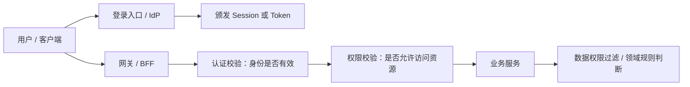

# 认证与授权 - 第 1 课：认证、授权、鉴权与权限控制总览

## 学习目标（本节结束后你能做到什么）

- 分清认证、授权、鉴权、权限控制这四个高频词的边界。
- 理解“用户登录成功”并不等于“后续所有请求都自动有权限”。
- 建立一张从身份确认到资源访问控制的整体脑图。
- 看懂常见系统里认证中心、权限中心、网关、业务服务大概各自负责什么。
- 面试时能用一套顺滑的话，把 JWT、OAuth、SSO 放回正确位置。

## 内容讲解（核心概念，用类比、例子、图示说清楚）

### 1. 为什么这一块最容易学混

很多同学第一次接触这块时，会遇到这样的情况：

- 登录接口返回了一个 `token`
- 网关会校验 `token`
- 后端接口还会判断角色
- 某些页面只有管理员能看
- 企业系统里还会说“接入统一登录”“做单点登录”“对接 OAuth”

于是大家就很容易把所有东西都叫成“鉴权”。

但从工程角度看，这里面至少有四层问题：

1. 这个请求是谁发的
2. 这个身份是否合法
3. 这个身份有没有权限做当前动作
4. 这个权限体系怎么长期维护、扩展、审计

这四层混在一起，系统就会变得说不清；把它们拆开，很多概念立刻就顺了。

### 2. 认证到底是什么

认证，英文是 `Authentication`，通常简称 `AuthN`。  
它解决的问题非常直接：

**你到底是谁。**

比如：

- 用户名 + 密码登录
- 手机号 + 验证码登录
- 邮箱验证码登录
- 指纹、人脸识别
- 第三方账号登录后确认身份
- 服务之间用证书确认调用方身份

你可以把认证理解成“查身份证”的过程。  
系统在这一步不关心你能不能进财务页面，也不关心你能不能删数据，它只关心：

- 你是不是声称的那个人
- 你提供的凭据是不是真的

所以认证的核心是“证明身份”。

### 3. 授权到底是什么

授权，英文是 `Authorization`，通常简称 `AuthZ`。  
它解决的问题是：

**这个身份被允许做什么。**

比如：

- 普通员工可以看自己的报销单
- 主管可以审批本组报销单
- 财务可以导出整个部门账单
- 超级管理员可以配置角色和菜单
- 某个第三方应用只能读取你的头像昵称，不能读取你的通讯录

这里你会发现，系统已经默认“知道你是谁”了。  
接下来讨论的是：

- 你有哪些角色
- 你拥有哪些资源权限
- 你的数据范围是什么
- 你的组织归属和租户边界是什么

所以授权是“给能力”或者“定义可操作边界”。

### 4. 鉴权是什么，为什么很多公司把它当动词用

中文语境里“鉴权”这个词非常常见，但它不完全等于认证，也不完全等于授权。

在工程实践里，鉴权更像一个运行时动作：

**当某个请求真正打到系统时，系统对这个请求做的一次身份与权限校验。**

比如一个接口请求进来：

1. 先检查有没有带 `token`
2. 再检查 `token` 是否有效、是否过期
3. 再解析用户身份
4. 再判断该用户是否有访问这个接口的权限
5. 如果还涉及数据范围，再判断是否只能看自己的数据

你会发现，“鉴权”常常是把认证校验和授权校验串起来的一次请求级检查。

所以中文里常说“网关做鉴权”“接口做鉴权”“权限中间件做鉴权”，本质上是在说：

**请求来了，我们要不要放你过去。**

### 5. 权限控制又是什么

权限控制不是单次校验动作，而是一整套长期治理体系。

它包括但不限于：

- 用户、角色、组织、岗位怎么建模
- 菜单权限、按钮权限、API 权限怎么维护
- 数据权限怎么表达
- 是否要支持租户隔离
- 管理员如何配置
- 修改权限后如何实时生效
- 是否要做审批、审计和变更留痕

也就是说，鉴权更像请求时刻的一次“守门动作”，而权限控制更像整套“门禁系统的设计与运营”。

### 6. 一个最实用的类比：写字楼门禁系统

你可以把一整套认证授权体系类比成一栋写字楼。

- 认证：前台看你的身份证，确认你是谁
- 授权：系统给你一张门禁卡，规定你能去哪些楼层
- 鉴权：你每次刷卡进门，闸机会实时判断是否放行
- 权限控制：物业后台管理整栋楼的门禁规则、人员、楼层、时间段、日志

这个类比的好处是，你立刻能看出：

- “确认身份”不等于“允许通行”
- “拥有门禁卡”不等于“可以去所有楼层”
- “一次登录成功”不等于“后续所有请求都自动合法”

### 7. 认证与授权在系统里通常怎么分层

在一个稍微像样一点的后端系统里，这几层往往不会全部堆在一个 Controller 里。

常见分工大概是这样：

这里最值得注意的是：

- 认证不一定只做在登录接口
- 授权不一定只做在网关
- 数据权限很多时候必须下沉到业务层或查询层

因为网关可能知道“你是不是管理员”，但未必知道“你能不能看这个部门这张单子”。

### 8. 为什么“登录”和“权限”不能简单合在一起

很多小系统早期会写成：

- 登录成功后，把角色信息直接塞进 Session 或 Token
- 每个接口只判断角色字符串

这样一开始很爽，但业务一复杂就开始出问题：

- 角色太粗，表达不了数据范围
- 一个用户多个角色时冲突很多
- 临时权限、审批权限、时间段权限很难表示
- 权限变更后，旧 token 里的权限信息可能不及时失效

所以大型系统通常会分得更细：

- 身份系统负责“你是谁”
- 权限系统负责“你能做什么”
- 网关和业务服务负责“具体请求要不要放行”

### 9. 这一课先把后面几个高频词放到正确位置

为了后面不乱，我们先把几个高频词先定位一下：

- `Session`：一种服务端保存登录态的方式
- `JWT`：一种令牌格式，常用于无状态身份传递
- `OAuth2`：一种授权框架，解决第三方应用代表用户访问资源的问题
- `OIDC`：在 OAuth2 上补了“身份信息”，更适合做登录
- `SSO`：单点登录，解决多个系统共享登录状态的问题
- `RBAC / ABAC / ACL`：权限模型，解决“你具体能做什么”

注意这里最关键的一点：

**这些东西不是同一层级。**

比如：

- `JWT` 不是 `OAuth2` 的替代品
- `SSO` 不是一种 token 格式
- `RBAC` 不是登录协议

它们有的描述令牌，有的描述协议，有的描述系统能力，有的描述权限模型。

### 10. 工程上最常见的一条主线

你可以先把实际系统里的主线记成这样：

1. 用户先完成认证
2. 系统给他一个后续可携带的登录态
3. 每次请求进来先校验登录态
4. 再根据资源、角色、组织、数据范围做授权校验
5. 业务服务最终执行时再做细粒度控制

如果再往企业级走一步，就会变成：

1. 统一身份中心负责认证
2. 多个业务系统共享登录状态，形成 `SSO`
3. 第三方应用接入时走 `OAuth2 / OIDC`
4. 内部权限系统维护 `RBAC / ABAC / 数据权限`

这时你就能看出来，JWT、OAuth、SSO 不是并列竞争关系，而是可能出现在同一套大系统里的不同层。

## 小结（3-5 条关键点）

- 认证解决“你是谁”，授权解决“你能做什么”。
- 鉴权通常指请求到达时，对身份和权限做的一次运行时校验。
- 权限控制不是一个注解或拦截器，而是一整套用户、角色、资源、数据范围和审计体系。
- `Session`、`JWT`、`OAuth2`、`OIDC`、`SSO`、`RBAC` 不在同一层，必须放回各自语境理解。
- 真实系统里，网关、认证中心、权限中心、业务服务经常是分工协作，而不是一个地方包打天下。

## 问题（检测用户对当前章节内容是否了解）

1. 为什么说“认证”和“授权”不是一回事？请你分别举一个真实系统里的例子。
2. 为什么很多公司口头上说“鉴权”，但它往往同时包含认证校验和权限校验？
3. 如果一个用户已经登录成功，为什么后续请求仍然要再做权限判断？
4. `JWT`、`OAuth2`、`SSO`、`RBAC` 分别更像令牌格式、授权框架、系统能力还是权限模型？
