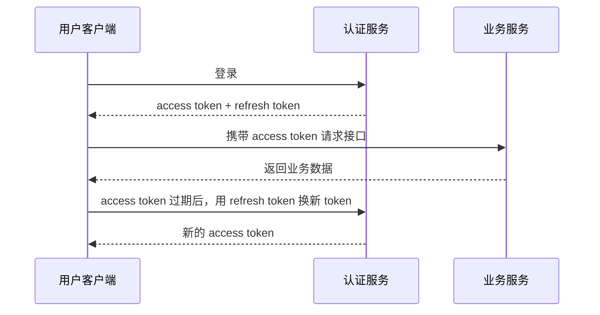

# 认证与授权 - 第 2 课：Cookie、Session与JWT：登录状态到底怎么保存

## 学习目标（本节结束后你能做到什么）

- 理解 `Cookie`、`Session`、`Token`、`JWT` 各自是什么，不再混为一谈。
- 说清服务端有状态登录和无状态令牌登录的核心差异。
- 理解 `JWT` 为什么流行，也理解它为什么并不适合所有系统。
- 知道 `Access Token`、`Refresh Token`、过期时间、撤销机制各自解决什么问题。
- 面试时能讲出“为什么不用 Session”以及“为什么不用 JWT”这两类反问。

## 内容讲解（核心概念，用类比、例子、图示说清楚）

### 1. 先把最容易混的四个词拆开

这一块最常见的混乱，是把下面四个词混成一个东西：

- `Cookie`
- `Session`
- `Token`
- `JWT`

但它们其实分别属于不同层：

- `Cookie`：浏览器存储和自动携带的一种机制
- `Session`：服务端保存用户会话状态的一种机制
- `Token`：客户端后续请求里携带的一个凭证统称
- `JWT`：一种具体的 token 格式

也就是说，`Cookie` 不等于 `Session`，`Token` 也不等于 `JWT`。

### 2. Cookie 到底是什么

`Cookie` 是浏览器能力，不是登录协议。

服务端响应时可以告诉浏览器：

```http
Set-Cookie: sid=abc123; HttpOnly; Secure
```

浏览器以后访问同域名时，就会自动把这个 `Cookie` 带回来。

所以 Cookie 的核心特点是：

- 存在浏览器端
- 浏览器会自动带上
- 常用于承载 `session id`

你可以把它理解成“浏览器兜里的一张小纸条”。  
这张纸条自己不一定有意义，关键看上面写了什么。

### 3. Session 是怎么工作的

`Session` 是典型的服务端有状态方案。

最经典流程是：

1. 用户提交用户名密码
2. 服务端校验成功
3. 服务端生成一个 `session id`
4. 把 `session id` 通过 Cookie 返回给浏览器
5. 服务端自己在内存、Redis 或数据库里保存 `session id -> 用户会话信息`
6. 后续请求带上 Cookie，服务端根据 `session id` 找回用户身份

它的关键不是 Cookie，而是：

**真正的用户状态保存在服务端。**

所以 `session id` 更像一个“寄存柜号码牌”，真正的东西存在后台柜子里。

### 4. Session 方案的优点和代价

优点很直观：

- 服务端可控，想失效就失效
- 会话内容能随时修改
- 权限变更后更容易实时生效
- 传统 Web 系统接浏览器很自然

但代价也很明显：

- 服务端要保存会话状态
- 多机部署时要做共享存储，比如 Redis
- 扩容时会考虑 Session 共享、粘性会话、序列化成本

所以 Session 不是“落后方案”，而是“有状态方案”。  
它在很多后台管理系统、企业内网系统里仍然非常好用。

### 5. Token 方案在解决什么

很多移动端、前后端分离、开放接口系统不喜欢 Session，一个重要原因是：

- 客户端不一定是浏览器
- 不一定能天然依赖 Cookie
- 服务端希望减轻会话存储压力

于是就变成：

1. 用户登录成功
2. 服务端返回一个 token
3. 客户端自己保存 token
4. 后续请求通过 `Authorization: Bearer <token>` 带上它
5. 服务端校验 token，识别身份

这就是大家常说的 token 登录。

注意，Token 只是“凭证”这个大类，不代表它一定是 JWT。  
它完全可以是：

- 一段随机字符串
- 一个数据库可查的 opaque token
- 一个 JWT

### 6. JWT 到底是什么

`JWT` 全称是 `JSON Web Token`。  
它本质上是一种令牌格式，通常长这样：

```text
header.payload.signature
```

三段分别承担的职责大概是：

- `header`：说明令牌类型和签名算法
- `payload`：放声明信息，比如用户 ID、过期时间、角色
- `signature`：对前两段做签名，防止篡改

最核心的理解是：

**JWT 不是“加密后的用户信息”，而是“可被校验完整性的一段声明”。**

也就是说：

- 默认很多 JWT 只是编码，不是加密
- 别人拿到后通常可以解码看到 payload
- 真正保证的是“你改了内容，签名会对不上”

### 7. 为什么 JWT 会流行

JWT 流行的原因非常工程化：

- 服务端不一定要存会话
- 多服务之间传递身份方便
- 网关、微服务、第三方系统都比较容易解析
- 很适合前后端分离、移动端、开放平台

它最大的诱惑是：

**拿到令牌，就能在本地直接解析出身份信息，不一定每次都回源查 session。**

于是很多系统会在 JWT 里放：

- 用户 ID
- 用户名
- 角色
- 租户 ID
- 过期时间

### 8. 但 JWT 为什么又常被吐槽

因为它的优点也正好带来代价。

最典型的问题有三个：

#### 8.1 很难主动失效

如果 Session 放在 Redis 里，管理员把用户踢下线，只要删掉那条 session 记录就行。

但 JWT 一旦发出去，只要：

- 签名没问题
- 还没过期

系统通常就会认为它有效。

除非你额外维护：

- 黑名单
- 版本号
- 令牌撤销表

否则“主动下线”“权限变更立刻生效”会比较麻烦。

#### 8.2 payload 容易放太多

很多团队一开始觉得 JWT 很方便，就往里塞大量字段：

- 角色列表
- 菜单权限
- 数据权限
- 组织树信息

结果问题来了：

- token 变大
- 敏感信息暴露风险上升
- 权限变更不同步

JWT 适合放“稳定、必要、可声明”的信息，不适合把整套权限系统都塞进去。

#### 8.3 容易被误解成“无状态万能药”

很多文章会说 JWT 是无状态的，所以性能更高、架构更优雅。  
这句话只说对了一半。

因为真实系统里，你往往还是会需要：

- Refresh Token 存储
- 黑名单
- 设备登录记录
- 风控状态
- 权限实时变更

一旦这些需求出现，你又会重新引入状态。

所以更准确的说法应该是：

**JWT 减少了“每次请求都查服务端会话”的依赖，但并不代表整套认证系统完全无状态。**

### 9. Access Token 和 Refresh Token 为什么常一起出现

为了平衡安全性和易用性，很多系统不会让一个 access token 活太久。

常见做法是：

- `Access Token`：寿命短，比如 15 分钟、30 分钟、2 小时
- `Refresh Token`：寿命长，比如 7 天、30 天

流程大概是：



这样做的思路是：

- 平时高频请求只带短期 token
- 真正长期驻留的凭证尽量少用、少暴露

### 10. Session 和 JWT 到底怎么选

最实用的判断方式不是问“谁更先进”，而是看场景。

#### 更适合 Session 的场景

- 传统浏览器 Web 应用
- 企业后台系统
- 权限经常变化
- 强调可控下线和强会话管理
- 团队对 Redis、网关和同域部署比较熟悉

#### 更适合 JWT / Token 的场景

- 前后端分离
- App、小程序、多端接入
- 微服务之间需要传递身份
- 开放平台、API 调用
- 需要较轻量的跨服务身份声明

但真实系统里经常不是二选一，而是混合：

- 浏览器端外层仍用 Cookie
- Cookie 里保存短 token 或 session 标识
- 服务内再用 JWT 在网关和服务间传递身份

### 11. 这块最常见的安全坑

#### 11.1 Session / Cookie 相关

- `HttpOnly` 没开，容易被脚本读到
- `Secure` 没开，HTTPS 下保护不够
- 没做 `SameSite` 策略，CSRF 风险更大
- Session 固定攻击没处理

#### 11.2 JWT / Token 相关

- access token 过期时间太长
- 刷新机制不严谨
- token 存在不安全位置
- 用 JWT 放了太多敏感或易变字段
- 签名算法配置错误或密钥管理不当

### 12. 一句话建立稳定判断

你可以先记住这句：

**Session 更像“后台查档案”，JWT 更像“手持盖章通行证”。**

前者可控、易撤销，但服务端要维护状态。  
后者分布式友好、传递方便，但撤销和动态权限控制更麻烦。

没有谁天然更高级，只有谁更适合当前系统约束。

## 小结（3-5 条关键点）

- `Cookie` 是浏览器存储与自动携带机制，`Session` 是服务端会话机制，`JWT` 是 token 格式。
- Session 方案的核心是“状态在服务端”，JWT 方案的核心是“声明在令牌里可被校验”。
- JWT 方便分布式身份传递，但主动失效、权限实时变更和敏感信息控制更麻烦。
- Access Token 和 Refresh Token 通常搭配使用，用来平衡安全性与用户体验。
- 技术选型不要问谁更先进，而要看客户端类型、权限变化频率、会话控制要求和系统架构。

## 问题（检测用户对当前章节内容是否了解）

1. `Cookie`、`Session`、`Token`、`JWT` 分别在什么层解决什么问题？
2. 为什么说 JWT 默认不是“加密”，而是“可验签的声明”？
3. 如果系统要求管理员可以随时踢用户下线，纯 JWT 方案会遇到什么挑战？
4. 你会在什么场景下优先考虑 Session，又会在什么场景下考虑 JWT 或 opaque token？
