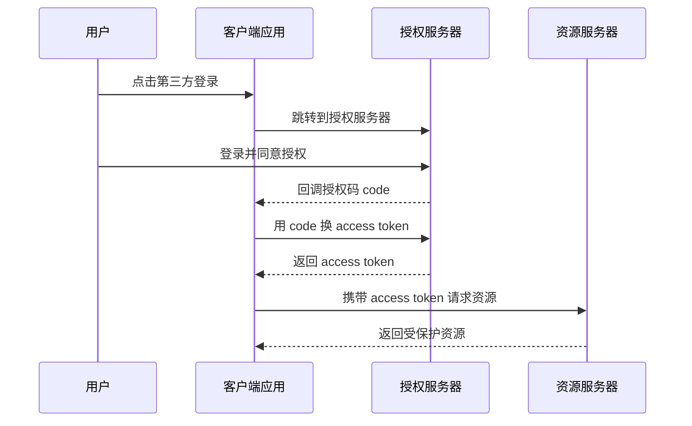

# 认证与授权 - 第 3 课：OAuth2与OIDC：第三方登录和统一身份的主线

## 学习目标（本节结束后你能做到什么）

- 理解 `OAuth2` 真正解决的问题是“授权委托”，而不是最原始意义上的登录。
- 说清资源所有者、客户端、授权服务器、资源服务器这几个角色。
- 看懂授权码模式为什么是最主流、最推荐的一条路径。
- 理解 `OIDC` 为什么是在 `OAuth2` 之上再补一层身份信息。
- 面试时能讲清“第三方登录”“OAuth2”“OIDC”“SSO”的关系和区别。

## 内容讲解（核心概念，用类比、例子、图示说清楚）

### 1. 先回答一个最关键的问题：OAuth2 到底在解决什么

很多人第一次学 `OAuth2`，是从“微信登录”“GitHub 登录”“Google 登录”开始接触的。  
于是很容易产生一个印象：

**OAuth2 就是登录协议。**

这其实不够准确。

`OAuth2` 更本质解决的是：

**让第三方应用在用户同意的前提下，代表用户访问某些受保护资源，而且不需要把用户密码直接交给第三方应用。**

这句话很长，但它非常关键。

比如一个第三方日历应用，想读取你的 Google 日历。  
如果没有 OAuth2，最粗暴的方式是：

- 你把 Google 用户名密码直接给第三方应用

这显然很危险。

OAuth2 的核心思想就是：

- 用户只在授权服务器那里登录
- 第三方应用拿到的是受限令牌，不是用户密码
- 用户可以明确授权范围，比如只读，不是读写全开

所以 OAuth2 的初心是“安全授权委托”。

### 2. 四个核心角色必须背后真正理解

OAuth2 里最重要的不是流程图，而是角色分工。

#### 2.1 Resource Owner：资源所有者

一般就是用户本人。  
资源是他的，比如头像、邮箱、仓库、联系人、日历。

#### 2.2 Client：客户端应用

想访问用户资源的应用。

比如：

- 某个第三方网站
- 某个移动 App
- 某个内部接入系统

#### 2.3 Authorization Server：授权服务器

负责：

- 用户登录
- 获取用户同意
- 颁发授权码或 access token

#### 2.4 Resource Server：资源服务器

真正存放和提供受保护资源的服务。  
它会检查 access token，再决定放不放数据。

只要这四个角色不乱，你后面流程就不会乱。

### 3. 为什么 OAuth2 比“账号密码交给第三方”更安全

你可以用“酒店代取快递”的类比理解。

以前粗暴方案相当于：

- 你把自己家门钥匙给代取员

OAuth2 相当于：

- 你给他一张一次性、限定范围、限定时间的授权凭证
- 凭这张凭证，他只能代你取某一类快递，不能进你家所有房间

OAuth2 带来的关键改进是：

- 用户密码不落到第三方应用手里
- 授权可以限制范围和期限
- 授权可以撤销
- 审计更清晰

### 4. 为什么授权码模式最重要

OAuth2 有多种授权模式，但今天最值得你掌握的是：

**授权码模式（Authorization Code Flow）**

因为它兼顾安全性和实用性，是现在 Web 与移动端接入里最主流的一条路径。

简化流程是：

这里最关键的一步是：

**先给 code，再由客户端拿 code 去换 token。**

这样 token 不会在用户浏览器重定向链路里直接裸奔，安全性更高。

### 5. State 参数为什么很重要

很多人看 OAuth2 只盯着 access token，忽略了 `state`。  
但在真实系统里，`state` 非常关键。

它主要用来：

- 关联发起请求和回调请求
- 防止 CSRF
- 避免回调被伪造或串号

简单说就是：

用户发起授权时，客户端先生成一个随机 state。  
授权服务器回调时，原样带回这个 state。  
客户端比对一致后，才继续后面的换 token 流程。

如果这一步做得很松，OAuth 登录就可能被攻击利用。

### 6. OAuth2 为什么常被拿来做“第三方登录”

因为第三方登录场景里，第三方应用通常最初只是想知道：

- 这是哪个用户
- 我能拿到他的基础资料吗

但 OAuth2 本身偏授权，它只规定了：

- 怎么拿 token
- 怎么用 token 访问资源

它没有统一规定：

- 用户唯一标识字段叫什么
- 用户昵称头像去哪取
- 身份信息用什么标准格式返回

于是不同平台早期都各搞各的：

- 你拿到 token 后，再去它自己的用户信息接口查资料

这就导致“能用，但不统一”。

### 7. OIDC 为什么要在 OAuth2 上补一层

`OIDC` 全称 `OpenID Connect`。  
它可以理解成：

**在 OAuth2 之上增加一套标准化的身份层。**

也就是说：

- OAuth2 更偏“你有没有权限访问资源”
- OIDC 再补“这个用户到底是谁”

OIDC 里几个关键补充是：

- `id token`
- `userinfo` 标准接口
- 标准化的身份声明字段，比如 `sub`

所以今天很多“第三方登录”本质上更准确的说法是：

**基于 OAuth2 + OIDC 的统一身份接入。**

### 8. Access Token 和 ID Token 不能混

这是面试高频坑。

#### Access Token

- 给资源服务器看的
- 用来访问 API
- 核心是授权

#### ID Token

- 给客户端看的
- 用来表明用户身份
- 核心是认证后的身份声明

如果把两者混为一谈，就容易设计出很别扭的系统。

你可以先记一句：

**Access Token 用来“拿资源”，ID Token 用来“认用户”。**

### 9. OAuth2、OIDC、SSO 到底什么关系

这三个词最容易一起出现，于是也最容易被当成同义词。

其实关系更像这样：

- `OAuth2`：授权框架
- `OIDC`：基于 OAuth2 的身份层
- `SSO`：单点登录这种系统能力

也就是说，企业做单点登录时：

- 底层可能用 OIDC
- 也可能用 SAML
- 也可能是自研协议

而 OAuth2 本身并不自动等于 SSO。  
它只是为“授权委托”和“令牌颁发”提供了一套框架。

### 10. 工程落地时最常见的边界

在后端系统里，很多同学会把下面两个场景混起来：

#### 场景 A：第三方应用要代用户访问资源

典型是 OAuth2 的原生主场。

#### 场景 B：多个内部系统想共享统一登录

这更像 SSO / OIDC / 企业身份平台问题。

所以你在设计时要先问清楚：

- 是“第三方授权”问题
- 还是“统一登录”问题
- 还是“登录后再调用 API”两个问题叠加

### 11. OAuth2 这一课最该建立的判断

不要把 OAuth2 学成一堆参数和 URL。  
你要建立的是这条判断：

**当一个系统需要在不暴露用户密码的前提下，让另一个系统在有限范围内代表用户访问资源时，OAuth2 就出现了。**

而当系统还想进一步统一“身份是谁”这件事时，就需要 OIDC 再补身份层。

## 小结（3-5 条关键点）

- OAuth2 的核心是授权委托，不是最初意义上的登录协议。
- 授权码模式是今天最主流、最推荐的 OAuth2 流程。
- `state` 不是可有可无的小参数，而是回调安全的重要部分。
- OIDC 在 OAuth2 之上补了一层标准化身份信息，更适合第三方登录和统一身份场景。
- Access Token 用于访问资源，ID Token 用于表达身份，不能简单混用。

## 问题（检测用户对当前章节内容是否了解）

1. 为什么说 OAuth2 的初心不是“让用户登录”，而是“让第三方安全地获得授权”？
2. 授权码模式里，为什么不直接在前端回调里把 access token 暴露出来？
3. `state` 参数主要在防什么问题？
4. 如果一个系统既要支持第三方登录，又要标准化返回身份信息，为什么常会引入 OIDC？
