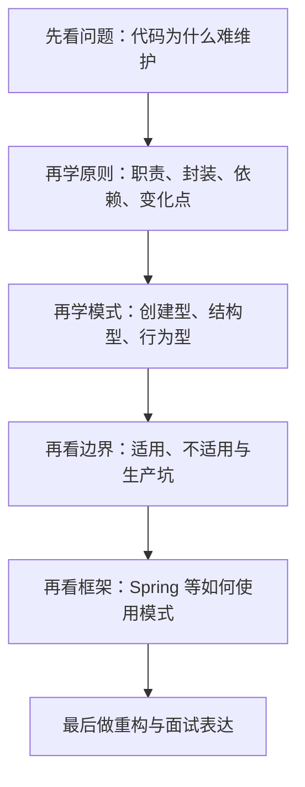

# 设计模式学习路径

## 学习目标

这条学习路径不是为了把 GoF 二十三种设计模式硬背一遍，更不是为了把面试题里的“工厂、单例、观察者、代理”当成名词卡片来记。你的目标应该是把自己训练到这样一种状态：

- 看到一段代码时，你能判断它为什么难维护，问题到底出在职责混乱、依赖过重、扩展点缺失，还是对象协作关系设计得不对。
- 你能把常见设计模式和真实后端场景对应起来，而不是把它们当成“面向对象课本”的抽象定义。
- 你能分清“什么时候该上模式，什么时候不该上模式”，避免把本来简单的代码过度设计。
- 你能在重构已有系统时，逐步把代码从 `if-else` 堆叠、重复逻辑蔓延、依赖方向混乱，推进到更稳定、可扩展的结构。
- 你能在面试、评审和日常协作中，用模式语言清楚表达自己的设计意图，比如“这里其实是策略模式”“这里更像模板方法 + 钩子”“这个代理是为了做鉴权和限流”。

## 重要说明

你是后端工程师，所以这套内容不会把重点放在“背定义”和“记分类”上，而会放在三个真正有价值的能力上：

1. 识别问题
   先看懂代码为什么痛苦，再决定要不要用模式。

2. 理解权衡
   每个模式都在解决特定矛盾，同时也会引入额外抽象层和理解成本。

3. 工程落地
   重点结合服务端开发常见场景，比如支付方式扩展、订单状态流转、消息处理链、第三方适配、缓存封装、权限拦截、模板化流程等。

也就是说，这条路线是“工程化设计模式学习”，不是纯学院派面向对象理论课。

## 知识图谱

建议把“设计模式”拆成 6 个层次来学：

1. 设计动机层
   - 为什么代码会腐化
   - 什么叫变化点
   - 什么叫高内聚、低耦合
   - 组合优于继承到底是什么意思

2. 设计原则层
   - SOLID 分别在解决什么工程问题
   - DRY、KISS、YAGNI 为什么经常互相制衡
   - 依赖倒置、接口隔离、组合优于继承如何落到代码里
   - 原则什么时候该用，什么时候会变成过度设计

3. 识别信号层
   - 满屏 `if-else`
   - 重复的构造流程
   - 多处判断对象类型
   - 一个类既做业务又做日志又做权限
   - 一改需求就牵一大片代码

4. 模式工具层
   - 创建型模式：怎么创建对象，怎么隔离构造复杂度
   - 结构型模式：怎么组合对象，怎么补接口、加能力、做隔离
   - 行为型模式：怎么组织对象协作，怎么切换策略、传递请求、管理状态

5. 场景迁移层
   - 在 Spring、RPC、MQ、支付、风控、订单、审核流里，模式到底长什么样
   - 框架帮你用了哪些模式
   - 你自己写业务代码时最常碰到哪些模式组合

6. 重构表达层
   - 怎么从坏味道一步步重构到模式
   - 怎么在 code review 里说清楚为什么这样设计
   - 怎么在面试里把“我做过”讲成“我理解其设计意图”

## 课程安排

1. `01_设计模式到底在解决什么问题.md`
   - 先建立总框架
   - 理解模式不是答案库，而是对高频设计问题的总结

2. `02_设计原则_SOLID与代码坏味道.md`
   - 把 SOLID、DRY、KISS、YAGNI、组合优于继承讲成可落地的判断标准
   - 学会识别职责混乱、依赖扩散、接口臃肿、继承滥用等坏味道
   - 补上设计原则在生产中的适用场景、不适用场景和常见坑

3. `03_创建型模式：单例、工厂、抽象工厂、建造者.md`
   - 解决对象创建复杂、依赖选择和装配问题
   - 重点看业务对象、客户端对象、第三方接入对象怎么组织

4. `04_结构型模式：适配器、装饰器、代理、外观.md`
   - 重点理解“兼容接口、增强能力、隔离复杂度”
   - 非常贴近后端工程实践

5. `05_行为型模式：策略、模板方法、责任链、观察者、状态.md`
   - 这是服务端代码里最常用的一组
   - 重点看流程编排、规则切换、状态流转和事件通知

6. `06_设计模式在 Spring 与常见框架中的影子.md`
   - 看框架如何把模式变成基础设施
   - 解决“学了模式却不会识别”的问题

7. `07_从坏代码到好设计：一步步重构实战.md`
   - 用真实味道驱动重构
   - 练习如何把业务代码慢慢演进，而不是一次性大改

8. `08_常见误区、过度设计与面试表达.md`
   - 学会收手
   - 学会解释取舍

9. `09_设计模式适用边界_生产问题与实战经验.md`
   - 按高频模式整理适用场景、不适用场景、生产事故点和解决方法
   - 把模式从“能说出定义”推进到“能在真实系统里安全落地”

## 学习顺序图

## 推荐学习方式

- 每学一个模式，都要回答四个问题：它解决什么问题、为什么会出现这个问题、不用它会怎样、用了它会付出什么代价。
- 不要孤立记忆模式名字，要把它和“代码坏味道”绑定。比如看到支付方式分支爆炸，就联想到策略；看到审核流程多节点传递，就联想到责任链；看到订单状态切换复杂，就联想到状态模式。
- 每一课结束后，最好去想自己做过的一个真实业务场景：如果当时用这个模式，代码会怎样更清晰；如果不用，会有哪些风险。
- 优先学高频模式，不要平均用力。对后端工程师来说，策略、模板方法、责任链、代理、适配器、工厂、状态，通常比访问者、备忘录更值得先吃透。

## 学完后你应该能做到的事

- 能从需求变化和代码坏味道出发，自然想到合适的设计手段
- 能读懂框架代码里常见模式的影子，不再只看到“注解魔法”
- 能在业务代码中控制抽象层次，不滥用模式，也不一味堆 `if-else`
- 能把“设计模式”转化成真实工程能力，而不是停留在面试背诵

## 推进规则

- 我们从第 1 课开始
- 每一课末尾都有检查站
- 你答完后，我会根据你的回答判断是进入下一课，还是先补一节同主题补充课
- 原则是不跳过关键理解点，尤其是“识别问题”“理解变化点”“判断是否过度设计”这三个核心能力
