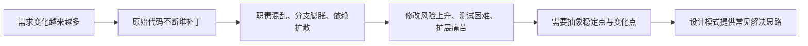

# 设计模式 - 第 1 课：设计模式到底在解决什么问题

## 学习目标（本节结束后你能做到什么）

1. 用自己的话说清楚设计模式不是“套路模板”，而是对高频设计问题的可复用解法总结。
2. 理解为什么很多代码一开始能跑，后面却越来越难改，而设计模式本质上是在对抗这种“代码腐化”。
3. 建立一个判断框架：什么时候应该考虑模式，什么时候只是把简单问题复杂化。
4. 能把设计模式和后端开发中的真实场景联系起来，而不是停留在抽象定义。

## 内容讲解（核心概念，用类比、例子、图示说清楚）

很多人第一次学设计模式，会有两个极端。第一个极端是把它当成“高级语法”，觉得学会二十三种模式，代码水平就会自动提高。第二个极端是觉得设计模式没用，现实工作里大家都是写业务逻辑、调数据库、接消息队列，谁会天天说“这里是访问者模式，那里是桥接模式”。这两个看法都不准确。设计模式既不是武功秘籍，也不是没用的学院派名词。它更像是一套工程经验的压缩包，把一类反复出现的问题和一类成熟的解决思路总结成了可交流、可复用的语言。

你可以先想一个你熟悉的后端场景。比如支付系统里支持微信、支付宝、银行卡、余额支付。最开始需求少的时候，很多人会直接写成这样：收到支付请求后，先根据 `payType` 判断分支，然后分别调用不同渠道的下单逻辑。刚开始这样完全没问题，代码也简单。但过几个月，需求开始长出来了。每种支付方式都要做参数校验、风控、下单、回调验签、状态更新、异常映射、监控打点。于是你会发现原来那段 `if-else` 不再只是“做选择”，它开始粘上越来越多细节。再过一阵子，产品说要加一种新的支付方式，开发会本能地紧张，因为你知道自己要改好几个分支，还要担心改坏老逻辑。这时问题不在于你不会写 `if`，而在于代码结构没有把“变化的部分”和“稳定的部分”分开。

这就是设计模式存在的第一层原因：软件开发最痛苦的地方，从来不是第一次把功能做出来，而是功能上线之后还得反复改。设计模式不是为了炫技，而是为了让“未来变化”发生时，影响范围更可控。

换个角度看，设计模式其实是在回答三个非常朴素的问题：

1. 对象该怎么创建，才不会把构造逻辑散得到处都是？
2. 对象该怎么组合，才不会因为一个新需求就改穿整条链路？
3. 对象之间该怎么协作，才不会让流程控制、状态切换、规则判断混成一团？

GoF 把模式分成创建型、结构型、行为型，本质上也就是围绕这三类问题展开。你完全可以先不背分类，而是先记住一句更实用的话：设计模式是在帮你管理变化、隔离复杂度、约束协作关系。

为什么说它不是“现成答案”，而是“问题驱动的总结”？因为模式本身没有脱离上下文的价值。比如策略模式很常见，但如果你只有两种简单分支，而且未来几乎不会扩展，那你硬拆出接口、实现类、工厂、上下文对象，很可能是在制造复杂度，而不是解决复杂度。再比如单例模式，如果你只是为了“全局方便访问”就把很多对象都做成单例，最后往往会得到隐藏依赖、难测代码和难以替换的全局状态。也就是说，模式不是看到名字就套，而是先看问题是不是真的存在。

你可以把“设计模式”和“药方”类比。药方不是营养品，不能因为它出名就天天吃。它必须建立在正确诊断的基础上。诊断错了，药越猛，副作用越大。设计模式也一样。没有变化点时，过度抽象会让代码变得绕；变化点已经很明显时，缺乏抽象会让代码越来越烂。真正重要的不是背药方，而是学会诊断。

那怎么诊断？先看代码里有没有这些信号：

- 新增一种业务类型时，总要改一个巨大的 `if-else` 或 `switch`
- 一个类同时负责参数校验、核心业务、日志、权限、重试、告警
- 构造一个对象要先准备十几个参数，还得按照固定顺序调用一堆初始化步骤
- 为了兼容第三方接口，业务代码里充满“字段转换 + 特殊判断”
- 状态流转复杂，代码里到处写“如果当前状态是 A 才能变成 B”

这些信号说明什么？说明你的代码可能不是“功能写不出来”，而是“职责没有切开，变化没有隔离，协作方式没有建模”。设计模式恰恰就是对这三种问题的系统回应。

这里有个特别容易误解的点：设计模式不是要替代基本功，而是建立在基本功之上。没有封装、抽象、接口隔离、依赖倒置这些基础，模式会学得很空。比如策略模式的核心，不是“有一个接口和多个实现类”，而是你先识别出“这里的算法或规则是可替换的”；模板方法的核心，不是“父类里写一个 final 方法”，而是你先识别出“流程骨架稳定，但个别步骤会变化”；状态模式的核心，也不是“建几个状态类”，而是你先意识到“状态转换规则本身就是业务的一部分，继续用条件分支硬写会越来越乱”。所以模式只是结果，问题建模才是前提。

再往后端工程里落一点。你会发现很多框架本身就在大量使用设计模式，只是平时你没意识到。比如 Spring 的 Bean 创建过程背后有工厂思想；AOP 代理本质上是代理模式；各种 `HandlerInterceptor`、过滤器链、责任链组件，本质上是责任链；支付、登录、风控这类按类型选择处理逻辑的场景，经常天然适合策略模式；订单、工单、审批这类状态变化复杂的系统，常常会走向状态模式。也就是说，你并不是“先学模式，再工作中勉强找例子”，而是工作里早就到处是模式，只是现在要把零散经验提炼成一套清晰认知。

你还需要建立一个很重要的判断：模式解决的是“变化带来的维护成本”，不是“代码看起来高级”。很多人学完模式后，写什么都想抽接口、建工厂、包一层上下文，这样很容易把业务写成空心架子。一个成熟工程师的标志，不是知道多少模式，而是知道什么时候停在朴素实现，什么时候该提前抽象。经验上可以这样判断：如果变化点已经稳定存在，或者你能明确预见短期内会反复扩展，那抽象通常值得；如果只是为了“可能以后会扩展”就把结构做得很重，那大概率是过度设计。

所以，第 1 课你最需要建立的不是“背出二十三种模式名字”，而是一种思维顺序：

1. 先看代码哪里痛。
2. 再看痛点背后是哪种结构问题。
3. 再考虑有没有成熟模式能降低未来修改成本。
4. 最后权衡：引入这个模式后，抽象成本是否值得。

只要这个顺序建立起来，后面学具体模式时你就不会陷入死记硬背。你会自然地把每个模式看成“针对某类问题的工具”，而不是“必须全都记住的标准答案”。

## 小结（3-5 条关键点）

1. 设计模式不是为了让代码显得高级，而是为了应对重复出现的设计问题，尤其是变化带来的维护成本。
2. 模式的核心价值在于管理变化、隔离复杂度、约束对象协作关系，而不是死记定义。
3. 学模式之前先学会识别代码坏味道，比如分支膨胀、职责混乱、构造复杂、状态判断散落。
4. 设计模式必须建立在正确诊断之上；没有真实问题时，硬套模式只会制造过度设计。
5. 对后端工程师来说，设计模式并不遥远，Spring、AOP、过滤器链、状态流转、支付路由里都能看到它们的影子。

---

## 检查站：请回答以下问题

1. 请你用自己的话解释：为什么说设计模式解决的不是“第一次把功能做出来”的问题，而是“功能上线后持续变化”的问题？
2. 假设一个支付系统现在通过一个很长的 `if-else` 处理不同支付方式。你觉得它未来最容易出现哪三类维护问题？
3. “设计模式像药方，先诊断再下药”这句话你怎么理解？请举一个你认为“不该急着上模式”的例子。
4. 如果让你现在只记住一句关于设计模式的话，你会记哪一句？为什么？

请把你的答案直接告诉我，我会根据你的回答决定下一步。
