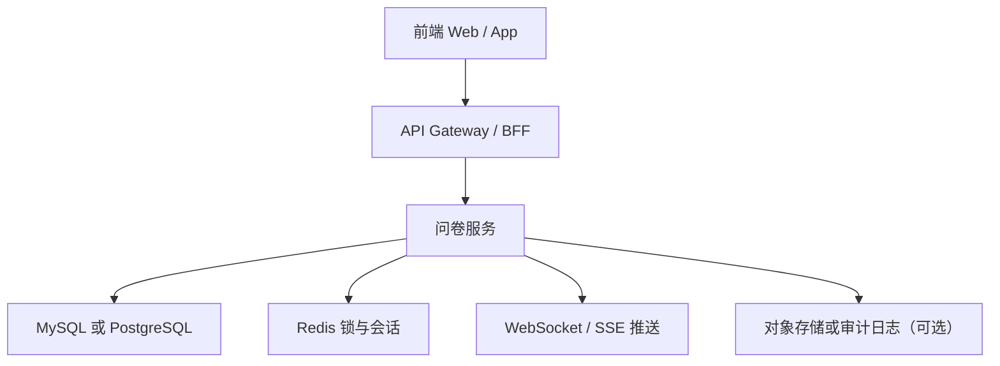

# 问卷系统设计 - 第 1 课：需求澄清与总体架构

## 学习目标（本节结束后你能做到什么）

1. 识别这道题真正的设计对象，是“问卷作答实例”的并发访问，而不是“问卷模板”的后台管理。
2. 能把需求拆成编辑权控制、只读展示、草稿恢复、最终提交四个核心能力。
3. 能画出一个不过度设计、但足够工程化的总体架构。
4. 知道为什么这题默认不需要上真正的多人实时协同算法。

## 内容讲解（核心概念，用类比、例子、图示说清楚）

我们先把题目翻译成人话。  
有一份待填写的问卷记录，用户 A 打开后正在编辑。过一会儿用户 B 也打开了同一份问卷。系统要求 B 看到的是灰白的、不能改、但可以完整阅读的页面。A 关闭系统后，下次再打开，要能看到上次填到哪里的内容。这个描述里，至少有三个对象需要先分清：

1. `问卷模板`：题目结构、字段定义、校验规则，比如姓名、手机号、职业、是否上传附件。
2. `问卷实例`：某个具体业务对象对应的一次待填写问卷，比如“客户 123 的入职问卷”“申请单 456 的审批问卷”。
3. `作答草稿/提交结果`：实例上的当前答案内容，可能还在编辑中，也可能已经正式提交。

很多人一听“多人并发问卷”，脑子里就开始往 Google Docs 想，这一步就偏了。因为这里没有要求两个用户同时改同一道题，也没有要求把不同人的编辑内容实时合并。题目给出的语义反而非常明确：第二个用户看到灰白只读态。这本质上说明业务希望采取`同一时刻一个编辑者`的策略，来避免冲突和数据覆盖。所以这题的关键不是协同算法，而是`编辑权管理`。

如果你在面试里先把这个判断说出来，会很加分。你可以这样表达：

“这道题我会先澄清一下，系统支持的是多人可同时打开同一份问卷，但同一时刻只允许一个持锁编辑者，其他用户是只读查看。这样设计的核心不是多人实时合并，而是单写多读的并发控制和草稿持久化恢复。”

接下来把需求拆开。功能需求至少包括：

- 用户打开问卷时，系统要返回当前题目结构和已有草稿内容。
- 系统要判断当前用户是否拿到编辑权。
- 如果没拿到编辑权，前端要以只读方式渲染，不允许提交修改。
- 编辑中的用户要支持自动保存。
- 用户主动关闭、浏览器异常退出、系统重启后，再次进入时要能恢复最近草稿。
- 正式提交后，问卷状态变成已提交，通常不再允许随便修改。

非功能需求则包括：

- 编辑权切换延迟不能太高，否则用户会感觉“为什么我明明等对方关掉了，还一直不能编辑”。
- 草稿不能轻易丢，保存链路要可靠。
- 锁失效时不能长期僵死，否则一个用户异常退出后，其他人永远只能只读。
- 审计能力要足够，至少能知道谁什么时候编辑、保存、提交过。

基于这些要求，一个足够稳的总体架构通常可以这样拆：

这里每层干的事情要说清楚。

前端负责渲染问卷模板、显示草稿、根据后端返回的编辑状态切换成可编辑或只读样式。  
API Gateway 或 BFF 负责统一鉴权、路由和聚合返回。  
问卷服务负责核心业务逻辑，包括加载模板、加载草稿、申请编辑锁、自动保存、提交问卷。  
数据库负责持久化模板、问卷实例、草稿和提交结果。  
Redis 更适合做短时、高频变动的编辑锁和心跳续租，因为它天生适合实现带 TTL 的租约锁。  
WebSocket 或 SSE 用于把“锁状态变化”快速推给其他在线用户，这样别人不需要一直刷新页面才知道自己能不能编辑。  
对象存储或审计日志不是主流程必须项，但如果问卷很长、需要版本快照、监管留痕，往往很有用。

这一题最容易犯的错误之一，是直接把数据库行锁当作答案。比如说“我打开问卷时把这一行 select for update 锁住”。这在工程上通常不可接受，因为问卷编辑是一个长时间动作，用户可能填 10 分钟、20 分钟，甚至中途去接电话。你不能让数据库长事务一直挂在那里，这会带来连接占用、死锁风险、故障恢复困难等问题。所以这里更合适的是`应用层租约锁`，也就是“我拿到一个有过期时间的编辑权，只要我持续心跳，锁就续命；如果我异常退出，锁自动过期。”

主链路可以先这样理解：

1. 用户打开问卷。
2. 问卷服务查询问卷实例和当前草稿。
3. 同时检查有没有有效编辑锁。
4. 如果锁空闲，尝试给当前用户加锁，成功则返回`editable=true`。
5. 如果锁已被别人持有，则返回`editable=false`和当前编辑者基本信息，前端渲染灰白只读态。
6. 持锁用户编辑过程中持续自动保存，并用心跳续租。
7. 用户提交后，状态切到`submitted`，释放锁。

这里再强调一个很重要的边界：  
“关闭系统后再打开能恢复上次内容”，本质上不是靠前端把表单值记在内存里，而是要有服务端持久化草稿。浏览器本地缓存只能做兜底，不能代替服务端状态。否则换设备、换浏览器、或者前端缓存被清理后，内容就全没了。

所以如果你站在系统设计面试角度回答，这一题的第一句话不应该是“我会选 React 还是 Vue”，也不应该是“我先上一个消息队列”，而应该先把核心矛盾定下来：`同一问卷实例的单写多读访问控制，以及编辑中草稿的可靠保存与恢复。`

## 小结（3-5 条关键点）

1. 这道题的设计对象是“问卷作答实例”，不是后台的问卷模板管理。
2. 题目要求说明这是一个`多人可打开、单人可编辑、其他人只读`的系统，不是多人实时协同编辑系统。
3. 总体架构里，数据库负责持久化草稿和结果，Redis 更适合做带过期时间的编辑锁。
4. 数据库长事务锁整份问卷通常不是好方案，因为编辑周期长，恢复能力差。
5. 系统关闭后还能恢复内容，说明必须有服务端草稿持久化，前端本地缓存只能做辅助兜底。

---

## 检查站：请回答以下问题

1. 为什么这道题通常不需要 CRDT 或 OT 一类的实时协同编辑算法？
2. 为什么“用数据库事务把整份问卷锁住直到用户提交”不是一个好方案？
3. 问卷模板、问卷实例、作答草稿三者分别是什么？
4. 如果你用一句话概括这道题的核心矛盾，你会怎么说？
