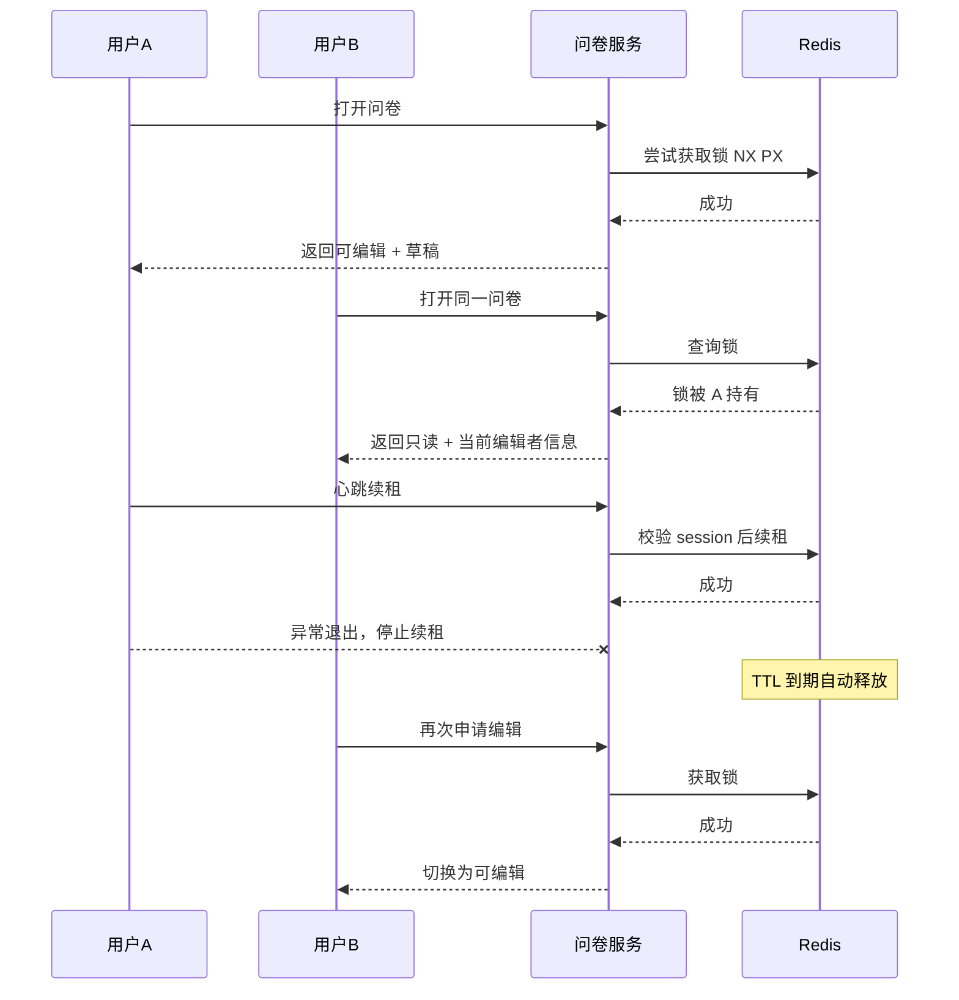

# 问卷系统设计 - 第 2 课：并发编辑控制与只读协同

## 学习目标（本节结束后你能做到什么）

1. 能解释为什么这个场景更适合悲观并发控制，也就是“单写者租约锁”。
2. 能讲清楚编辑锁的获取、续租、释放、过期和接管流程。
3. 能说清只读用户为什么不只是前端置灰，而是后端也必须做权限校验。
4. 能处理用户掉线、锁悬挂、重复释放、多人争抢等边界情况。

## 内容讲解（核心概念，用类比、例子、图示说清楚）

这节课是整道题的心脏。  
题目里最关键的一句其实是：“另一个第二个现在的问卷是灰白的，不可编辑，完全可读。”这句话直接告诉我们，业务要的不是冲突合并，而是`先到先得的编辑权`。在并发控制策略上，这更接近悲观锁，而不是乐观锁。

为什么不是乐观锁？  
因为乐观锁适合“大家都可以改，提交时发现版本冲突再提示用户重试”的场景，例如后台管理里改一条配置，冲突概率低，失败后重新编辑成本也不大。  
但问卷场景不同。问卷可能很长，用户填了十几分钟，如果最后提交时才告诉他“抱歉，这份问卷早就被别人改过了，请重新来”，体验非常差。所以业务上更稳妥的办法是：一开始就确定谁有编辑权，没有编辑权的人只能看。

最常见的工程实现是`Redis 租约锁 + 心跳续租`。  
核心思路可以理解成“租房子”：

- 拿到锁，不是永远拥有，而是租一段时间，比如 30 秒。
- 只要用户还在线、页面还在编辑中，就每 10 秒续租一次。
- 如果用户崩溃、断网、浏览器被强关，续租停止，30 秒后锁自动过期。
- 其他人这时就可以重新申请编辑权。

这比“永不超时的显式锁”安全得多，因为你不能指望客户端总是优雅地发来“我要退出”的释放请求。

一个比较常见的 Redis 实现是：

- 键：`questionnaire:lock:{instanceId}`
- 值：`userId + sessionId + expiresAt`
- 获取：`SET key value NX PX 30000`
- 续租：校验 value 里的 sessionId 仍然属于自己，再 `PEXPIRE` 或用 Lua 原子续约
- 释放：只有锁持有者才能删，避免误删别人的锁

这里有一个工程细节很重要：  
续租和释放都不能只靠“我知道 key 名，所以我就删”。必须校验 value 里的`sessionId`或`token`。否则会出现这样的问题：A 的锁过期了，B 正好拿到了新锁；这时 A 的旧页面又发来一个迟到的释放请求，如果你不校验归属，就会把 B 的锁误删。

并发链路大概是这样：

只读协同还有两个层面，很多人只说了前端置灰，但这不够。

第一层是`展示层只读`。  
前端拿到`editable=false`后，要把所有输入控件变成不可输入状态，按钮禁用，颜色灰白，并展示提示文案，比如“当前由张三编辑中，你可以查看但不能修改”。这是用户体验层。

第二层是`服务端写保护`。  
如果后端只是告诉前端“你现在是只读”，但保存接口没做校验，那懂一点抓包的用户照样可以直接调保存 API 写进去。所以每次保存、提交，都必须由服务端再次校验：当前锁是不是这个用户、这个 session 持有；如果不是，就直接拒绝并返回“无编辑权限”。

再看几个常见边界问题。

第一，用户开两个标签页怎么办？  
如果业务允许同一个用户多标签同时编辑，那 session 设计会更复杂，因为两个标签页都在续租，可能相互覆盖。更简单稳妥的做法是：锁归属于`用户 + 编辑会话`，同一用户新开标签页时，要么复用同一会话，要么提示“你已经在别处编辑”。面试里你可以先做这个简化，再说明后续可扩展。

第二，锁过期瞬间用户还在输入怎么办？  
这时保存接口会失败，前端必须收到明确提示，例如“编辑权已失效，页面已切换为只读，请刷新后重新申请编辑”。不要默默失败，否则用户以为自己还在写，实际上数据没保存进去。

第三，别人能不能强制接管？  
这取决于业务。审批、客服、内部运营系统里，通常需要管理员强制解锁能力，因为有人拿着锁下班了不处理会阻塞业务。但这属于受控操作，要记审计日志，不应默认开放给所有普通用户。

第四，是否一定要 WebSocket？  
不是必须。如果系统在线协同感要求不高，轮询也能做，比如每 10 秒查一次锁状态。但如果你想让“别人一释放锁，我这边马上能点编辑”更丝滑，WebSocket 或 SSE 会更合适。要注意，这里的推送只用来通知锁状态变化，不承担草稿真值存储。

最后说一个取舍：  
为什么锁放 Redis，而不是单独做一张数据库 lock 表然后 update where version？  
因为这是一个频繁续租、强依赖 TTL 的短生命周期状态。Redis 对这种“高频改、自动过期”的数据更合适，性能和语义都更自然。数据库表可以保留一份审计记录，但不适合作为高频心跳续租的主承载。

## 小结（3-5 条关键点）

1. 这道题更适合悲观并发控制，因为业务明确要求同一时刻只能有一个编辑者。
2. 编辑锁最好做成带 TTL 的租约锁，并通过心跳续租来避免僵死。
3. 前端置灰只是体验层，真正的写保护必须由后端保存接口再次校验锁归属。
4. 锁的释放和续租都要校验 session/token，避免迟到请求误删别人的锁。
5. Redis 适合承载编辑锁，WebSocket/SSE 适合通知状态变化，但都不替代数据库草稿持久化。

---

## 检查站：请回答以下问题

1. 为什么这个场景更适合悲观锁，而不是乐观锁加版本号冲突提示？
2. 为什么锁的 value 里通常要带 `sessionId`，而不是只存 `userId`？
3. 如果前端已经置灰了，为什么后端保存接口还必须再次校验编辑权？
4. 假设持锁用户突然断网了，系统应该如何让其他人最终拿到编辑权？
